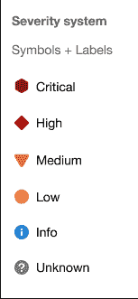
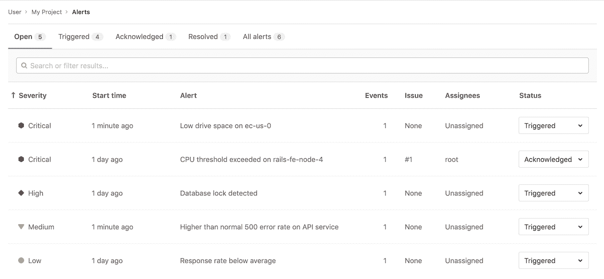
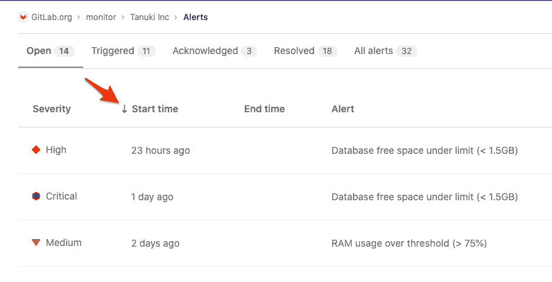
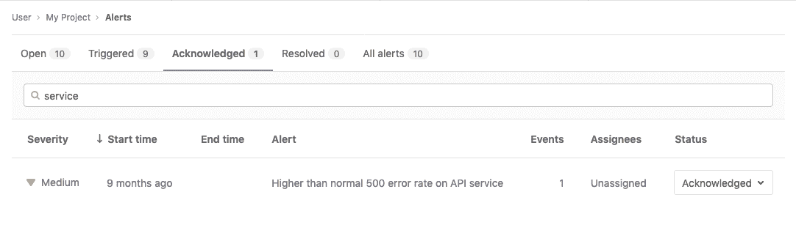
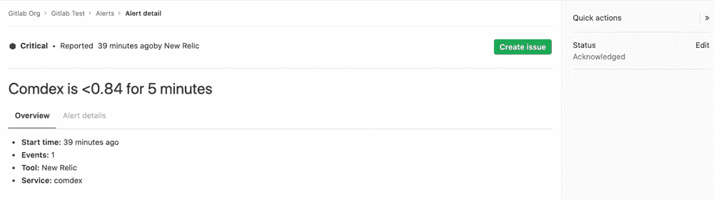
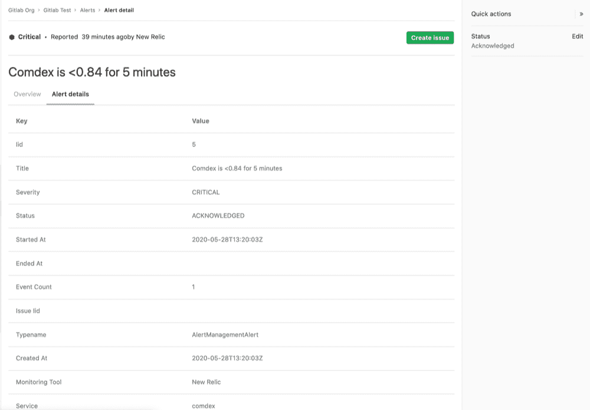
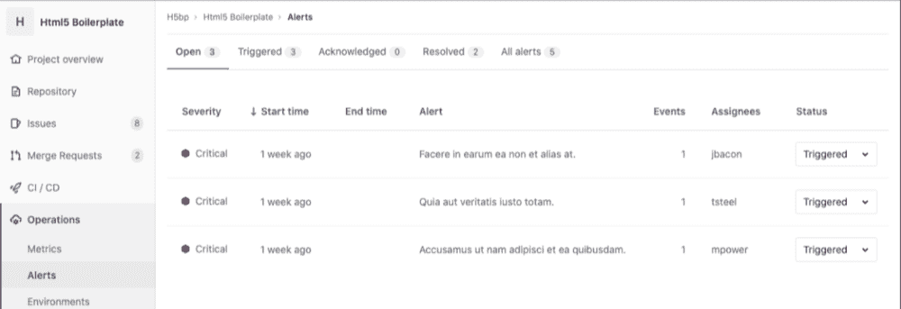
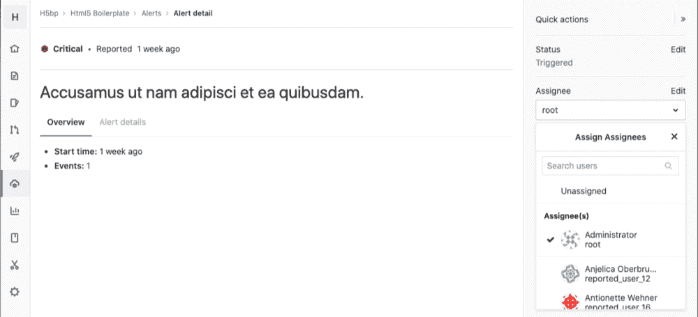
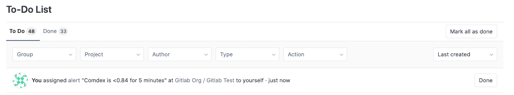
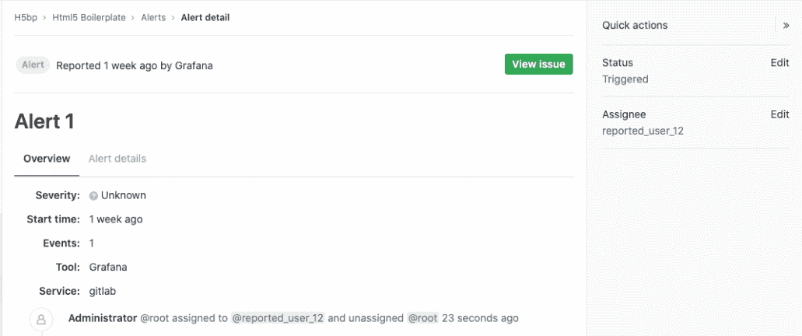

# Alert Management

> 原文：[https://docs.gitlab.com/ee/user/project/operations/alert_management.html](https://docs.gitlab.com/ee/user/project/operations/alert_management.html)

*   [Enable Alert Management](#enable-alert-management)
    *   [Enable a Generic Alerts endpoint](#enable-a-generic-alerts-endpoint)
    *   [Enable GitLab-managed Prometheus alerts](#enable-gitlab-managed-prometheus-alerts)
    *   [Enable external Prometheus alerts](#enable-external-prometheus-alerts)
*   [Alert Management severity](#alert-management-severity)
*   [Alert Management list](#alert-management-list)
    *   [Alert Management list sorting](#alert-management-list-sorting)
    *   [Searching alerts](#searching-alerts)
    *   [Alert Management statuses](#alert-management-statuses)
*   [Alert Management details](#alert-management-details)
    *   [Update an Alert’s status](#update-an-alerts-status)
    *   [Create an Issue from an Alert](#create-an-issue-from-an-alert)
    *   [Update an Alert’s assignee](#update-an-alerts-assignee)
    *   [Alert system notes](#alert-system-notes)
    *   [View an Alert’s metrics data](#view-an-alerts-metrics-data)
*   [Use cases for assigning alerts](#use-cases-for-assigning-alerts)
    *   [Slack Notifications](#slack-notifications)

# Alert Management

在 GitLab 13.0 中[引入](https://gitlab.com/groups/gitlab-org/-/epics/2877) .

警报管理使开发人员可以轻松发现和查看其应用程序生成的警报. 通过在开发代码的地方显示警报信息，可以提高效率和知名度.

## Enable Alert Management

**注意：**您至少需要维护者[权限](../../permissions.html)才能启用警报管理功能.

如下所述，有几种方法可以将警报接受到您的 GitLab 项目中. 启用任何这些方法将允许显示警报列表. 配置警报后，访问 您可以在项目的边栏中[查看](#alert-management-list) **操作>警报** ，以[查看](#alert-management-list)警报[列表](#alert-management-list) .

### Enable a Generic Alerts endpoint

GitLab 提供了通用警报端点，因此您可以接受来自第三方警报服务的警报. 请参阅有关[切换常规警报](../integrations/generic_alerts.html#setting-up-generic-alerts)的[说明](../integrations/generic_alerts.html#setting-up-generic-alerts)以添加此选项. 配置端点后，将启用" [警报"列表](#alert-management-list) .

要用数据填充警报，请参阅为警报端点的请求[自定义有效负载](../integrations/generic_alerts.html#customizing-the-payload) .

### Enable GitLab-managed Prometheus alerts

您可以在 Kubernetes 集群上安装 GitLab 管理的 Prometheus 应用程序. 有关更多信息，请参见[Kubernetes 上的 Managed Prometheus](../integrations/prometheus.html#managed-prometheus-on-kubernetes) . 安装了由 GitLab 管理的 Prometheus 时，也会启用[警报列表](#alert-management-list) .

要用数据填充警报，请参阅[GitLab 管理的 Prometheus 实例](../../../operations/metrics/index.html#managed-prometheus-instances) .

### Enable external Prometheus alerts

您可以配置外部管理的 Prometheus 实例，以将警报发送到 GitLab. 要设置此配置，请参阅[配置 Prometheus](../../../operations/metrics/index.html#external-prometheus-instances)文档. 激活外部 Prometheus 配置也会启用" [警报"列表](#alert-management-list) .

要用数据填充警报，请参阅[外部 Prometheus 实例](../../../operations/metrics/index.html#external-prometheus-instances) .

## Alert Management severity

警报的每个级别均包含一个形状和颜色编码独特的图标，以帮助您确定特定警报的严重性. 这些严重性图标可帮助您立即确定应优先调查的警报：

警报包含以下图标之一：

| Severity | Icon | 颜色（十六进制） |
| --- | --- | --- |
| Critical |  | `#8b2615` |
| High |  | `#c0341d` |
| Medium |  | `#fca429` |
| Low |  | `#fdbc60` |
| Info |  | `#418cd8` |
| Unknown |  | `#bababa` |

## Alert Management list

**注意：**您将至少需要具有开发人员[权限](../../permissions.html)才能查看警报管理列表.

您可以在以下位置找到警报管理列表 项目侧边栏中的**操作>警报** . 每个警报包含以下指标：

*   **严重性** -警报的当前重要性及其应受到的关注.
*   **开始时间** -警报触发前多久. 此字段使用`X time ago`的标准 GitLab 模式，但细化的日期/时间工具提示支持此字段，具体取决于用户的语言环境.
*   **警报说明** - The description of the alert, which attempts to capture the most meaningful data.
*   **事件计数** -警报触发的次数.
*   **问题** -指向为警报创建的事件问题的链接.
*   **状态** -警报的[当前状态](#alert-management-statuses) .

### Alert Management list sorting

在 GitLab 13.1 中[引入](https://gitlab.com/gitlab-org/gitlab/-/issues/217745) .

警报管理列表显示按开始时间排序的警报，但是您可以通过单击警报管理列表中的标题来更改排序顺序.

要查看列是否可排序，请将鼠标指向标题. 可排序的列在列名旁边显示一个箭头，如以下示例所示：

### Searching alerts

在 GitLab 13.1 中[引入](https://gitlab.com/gitlab-org/gitlab/-/issues/213884) .

警报列表支持简单的自由文本搜索.

此搜索过滤以下字段：

*   Title
*   Description
*   监控工具
*   Service

### Alert Management statuses

每个警报都包含一个状态下拉列表，以指示需要调查的警报. 标准警报状态包括已`triggered` ，已`acknowledged`和已`resolved` ：

*   **触发** ：没有人开始调查.
*   **致谢** ：有人正在积极调查问题.
*   **解决** ：不需要进一步的工作.

## Alert Management details

**注意：**您至少需要具有开发人员[权限](../../permissions.html)才能查看警报管理详细信息.

通过访问[警报管理列表](#alert-management-list)并从列表中选择一个警报，导航到警报管理详细信息视图.

### Update an Alert’s status

警报管理详细信息视图使您可以更新警报状态. 有关更多详细信息，请参见[警报管理状态](#alert-management-statuses) .

### Create an Issue from an Alert

在 GitLab 13.1 中[引入](https://gitlab.com/gitlab-org/gitlab/-/issues/217745) .

警报管理详细信息视图使您可以创建问题，并使用从警报自动填充的描述来创建问题. 要创建问题，请单击**创建问题**按钮. 然后，您可以通过单击**查看问题**按钮从警报中**查看问题** .

关闭与警报相关的 GitLab 问题会将警报的状态更改为"已解决". 有关[状态](#alert-management-statuses)的更多详细信息，请参阅[警报管理](#alert-management-statuses)状态.

### Update an Alert’s assignee

在 GitLab 13.1 中[引入](https://gitlab.com/groups/gitlab-org/-/epics/3066) .

警报管理详细信息视图允许用户更新警报受让人.

在大型团队中，共享警报的所有权，可能很难跟踪谁在调查和处理警报. 警报管理详细信息视图使您可以更新警报受让人：

**注意：** manbetx 客户端打不开目前仅支持每个警报一个受让人.

1.  要显示当前警报列表，请单击 **操作>警报** ：

    

2.  选择所需的警报以显示其**警报管理详细信息视图** ：

    

3.  如果右侧栏没有展开，请单击 **展开侧边栏**以展开它.
4.  在右侧栏中，找到**受让人** ，然后点击**编辑** . 从下拉菜单中，选择要分配给警报的每个用户. GitLab 为每个用户创建一个[待办事项列表项](../../todos.html) .

    

要删除受让人，请单击" **受让人"**下拉菜单旁边的" **编辑"** ，然后从**受让人**列表中取消选择该用户，或单击" **未分配"** .

### Alert system notes

在 GitLab 13.1 中[引入](https://gitlab.com/groups/gitlab-org/-/epics/3066) .

当您对警报采取措施时，它会记录为系统注释，在"警报详细信息"视图中可见. 这为您提供了警报调查和分配历史的线性时间表.

以下操作将产生系统注释：

*   [Updating the status of an alert](#update-an-alerts-status)
*   [Creating an issue based on an alert](#create-an-issue-from-an-alert)
*   [Assignment of an alert to a user](#update-an-alerts-assignee)

### View an Alert’s metrics data

在 GitLab 13.2 中[引入](https://gitlab.com/gitlab-org/gitlab/-/issues/217768) .

要查看警报的指标，请执行以下操作：

1.  以具有 Developer 或更高[权限](../../permissions.html)的用户身份登录.
2.  导航 **操作>警报** .
3.  单击您要查看的警报.
4.  在警报标题下，单击" **指标"**选项卡.

For GitLab-managed Prometheus instances, metrics data is automatically available for the alert, making it easy to see surrounding behavior. See [Managed Prometheus instances](../../../operations/metrics/index.html#managed-prometheus-instances) for information on setting up alerts.

对于外部管理的 Prometheus 实例，您可以配置警报规则以在警报中显示图表. 有关如何正确配置警报规则的信息，请参阅[基于警报在事件问题中嵌入指标](../../../operations/metrics/embed.html#embedding-metrics-based-on-alerts-in-incident-issues) . 有关为自己管理的 Prometheus 实例设置警报的信息，请参阅[外部](../../../operations/metrics/index.html#external-prometheus-instances) Prometheus 实例.

## Use cases for assigning alerts

考虑一个由监视的不同部分组成的团队，在单个应用程序上进行协作. 警报浮出水面之后，将警报发送给可以处理和解决警报的团队成员非常重要.

将警报分配给多个受让人可以简化协作和委派. 所有分配者都显示在团队的工作流程中，并且所有分配者都会收到通知，从而简化了警报的通信和所有权.

完成调查或修复警报的部分后，用户可以在角色完成后从警报中取消分配帐户. 可以更新[警报状态](#alert-management-statuses)以反映警报是否已解决.

### Slack Notifications

在 GitLab 13.1 中[引入](https://gitlab.com/gitlab-org/gitlab/-/issues/216326) .

当收到新的警报时，可以通过 Slack 消息向您发出警报.

有关如何进行设置的信息，请参阅[Slack Notifications Service 文档](../integrations/slack.html) .