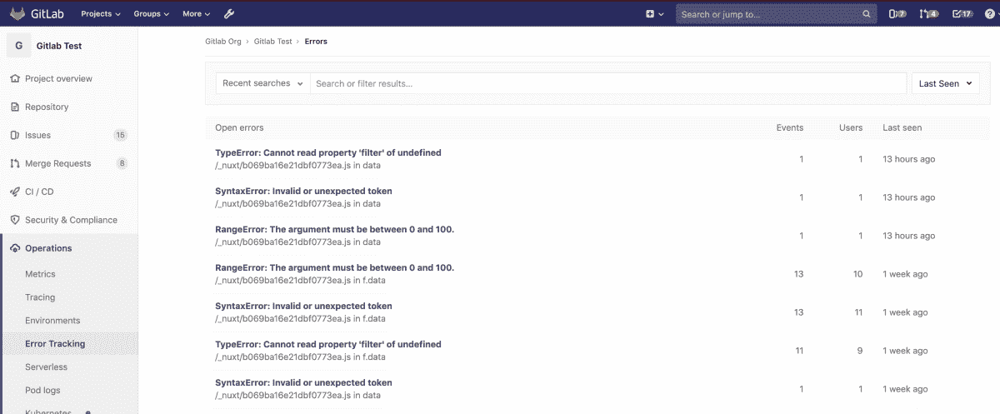
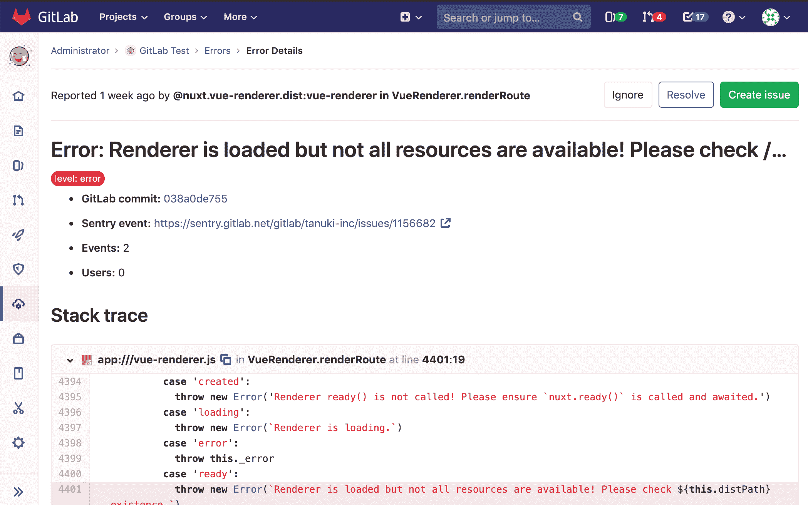
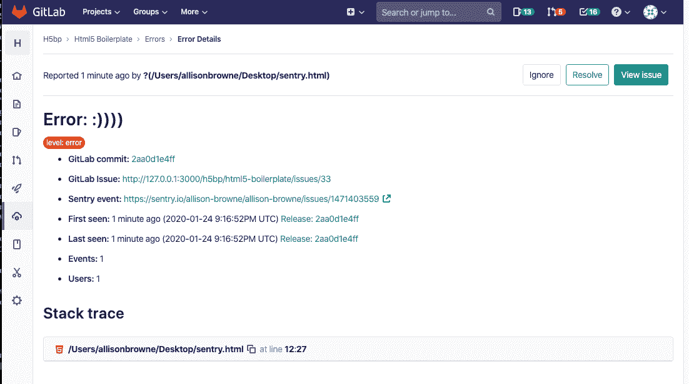

# Error Tracking

> 原文：[https://docs.gitlab.com/ee/user/project/operations/error_tracking.html](https://docs.gitlab.com/ee/user/project/operations/error_tracking.html)

*   [Sentry error tracking](#sentry-error-tracking)
    *   [Deploying Sentry](#deploying-sentry)
    *   [Enabling Sentry](#enabling-sentry)
    *   [Enabling GitLab issues links](#enabling-gitlab-issues-links)
*   [Error Tracking List](#error-tracking-list)
*   [Error Details](#error-details)
*   [Taking Action on errors](#taking-action-on-errors)
    *   [Ignoring errors](#ignoring-errors)
    *   [Resolving errors](#resolving-errors)

# Error Tracking

在 GitLab 11.8 中[引入](https://gitlab.com/groups/gitlab-org/-/epics/169) .

错误跟踪使开发人员可以轻松发现和查看其应用程序可能产生的错误. 通过在开发代码的地方显示错误信息，可以提高效率和知名度.

## Sentry error tracking

[Sentry](https://sentry.io/)是一个开源错误跟踪系统. GitLab 允许管理员将 Sentry 连接到 GitLab，以允许用户查看 GitLab 中的 Sentry 错误列表.

### Deploying Sentry

您可以注册到托管在[https://sentry.io](https://sentry.io)上的云，部署自己[的本地实例](https://docs.sentry.io/server/installation/)或使用 GitLab [将 Sentry 安装到 Kubernetes 集群](../../clusters/applications.html#install-sentry-using-gitlab-cicd) .

### Enabling Sentry

**注意：**您至少需要维护者[权限](../../permissions.html)才能启用 Sentry 集成.

GitLab 提供了一种将 Sentry 连接到您的项目的简便方法：

1.  注册到 Sentry.io 或[部署您自己的](#deploying-sentry) Sentry 实例.
2.  [创建](https://docs.sentry.io/guides/integrate-frontend/create-new-project/)一个新的 Sentry 项目. 对于您要集成的每个 GitLab 项目，我们建议您创建一个新的 Sentry 项目.
3.  [查找或生成](https://docs.sentry.io/api/auth/)您的 Sentry 项目的 Sentry 身份验证令牌. 确保至少给令牌以下范围： `event:read`和`project:read` .
4.  导航到项目的**"设置">"操作"** .
5.  确保设置了**活动**复选框.
6.  在**Sentry API URL**字段中，输入您的 Sentry 主机名. 例如，如果这是您的 Sentry 实例可用的地址，请输入`https://sentry.example.com` . 对于 Sena 的 SaaS 版本，主机名将为`https://sentry.io` .
7.  在" **验证令牌"**字段中，输入您先前生成的令牌.
8.  单击" **连接"**按钮以测试与 Sentry 的连接并填充" **项目"**下拉列表.
9.  从**项目**下拉菜单中，选择一个 Sentry 项目以链接到您的 GitLab 项目.
10.  单击**保存更改**以使更改生效.
11.  现在，您可以在项目的侧栏中访问" **操作">"错误跟踪"** ，以[查看](#error-tracking-list) Sentry 错误[的列表](#error-tracking-list) .

### Enabling GitLab issues links

您可能还需要按照[Sentry 文档中](https://docs.sentry.io/workflow/integrations/global-integrations/#gitlab)的步骤来启用 Sentry 的 GitLab 集成.

## Error Tracking List

**注意：**您将至少需要 Reporter [权限](../../permissions.html)才能查看"错误跟踪"列表.

您可以在项目的边栏中的" **操作">"错误跟踪"**中找到"错误跟踪"列表. 在这里，您可以按标题或状态（"已忽略"，"已解决"或"未解决"之一）过滤错误，并按"频率"，"首次看到"或"最后看到"的降序排列. 默认情况下，错误列表按"上次发现"排序，并过滤为"未解决的错误".

## Error Details

从错误列表中，用户可以通过单击任何错误的标题导航到错误详细信息页面.

该页面具有：

*   哨兵问题的链接.
*   如果 Sentry Issue 的第一个发行[版](https://docs.sentry.io/workflow/releases/?platform=javascript#configure-sdk)的 Sentry [版本 ID /版本](https://docs.sentry.io/workflow/releases/?platform=javascript#configure-sdk)与您的 GitLab 托管项目中的提交 SHA 匹配，则指向 GitLab 提交的链接.
*   有关该问题的其他详细信息，包括完整的堆栈跟踪.
*   在[GitLab 12.7 及更高版本中](https://gitlab.com/gitlab-org/gitlab/-/issues/36246) ，显示语言和紧急度.

默认情况下，显示**创建问题**按钮：

如果您从错误中创建了一个 GitLab 问题，则" **创建问题"**按钮将变为" **查看问题"**按钮，并且指向 GitLab 问题的链接将出现在"错误详细信息"部分中：

## Taking Action on errors

您可以从 GitLab UI 中对哨兵错误采取措施.

### Ignoring errors

在 GitLab 12.7 中[引入](https://gitlab.com/gitlab-org/gitlab/-/issues/39665) .

在" [错误详细信息"](#error-details)页面中，只需单击页面顶部附近的" **忽略"**按钮，就可以忽略 Sentry 错误.

忽略错误将阻止它出现在" [错误跟踪列表"中](#error-tracking-list) ，并将使 Sentry 中设置的通知静音.

### Resolving errors

在 GitLab 12.7 中[引入](https://gitlab.com/gitlab-org/gitlab/-/issues/39825) .

在" [错误详细信息"](#error-details)页面中，您可以通过单击页面顶部附近的" **解决"**按钮来解决 Sentry 错误.

将错误标记为已解决表示错误已停止触发事件. 如果 GitLab 问题与错误相关联，则该问题将被关闭.

如果发生另一个事件，该错误将恢复为未解决.