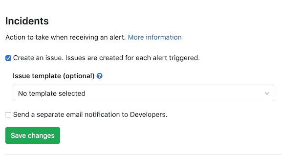

# Incident Management

> 原文：[https://docs.gitlab.com/ee/user/incident_management/](https://docs.gitlab.com/ee/user/incident_management/)

*   [Configure incidents](#configure-incidents-ultimate)
    *   [Notify developers of alerts](#notify-developers-of-alerts)
*   [Configure PagerDuty integration](#configure-pagerduty-integration)
*   [Configure Prometheus alerts](#configure-prometheus-alerts)
*   [Configure external generic alerts](#configure-external-generic-alerts)
*   [Embed metrics in incidents and issues](#embed-metrics-in-incidents-and-issues)
    *   [Context menu](#context-menu)
        *   [View logs from metrics panel](#view-logs-from-metrics-panel)
*   [Integrate incidents with Slack](#integrate-incidents-with-slack)
*   [Integrate issues with Zoom](#integrate-issues-with-zoom)

# Incident Management

GitLab 提供了用于处理应用程序和服务中的事件的解决方案，例如设置 Prometheus 警报，显示指标和发送通知.

## Configure incidents

在 GitLab Ultimate 11.11 中[引入](https://gitlab.com/gitlab-org/gitlab/-/issues/4925) .

您可以在 GitLab 用户界面中启用或禁用事件管理功能，以在触发警报时创建问题：

1.  导航 **设置>操作>事件，**然后展开**事件** ：

    

2.  对于 GitLab 11.11 及更高版本，您可以选中**创建问题**复选框以根据自己的[问题模板](../project/description_templates.html#creating-issue-templates)创建[问题](../project/description_templates.html#creating-issue-templates) . 有关更多信息，请参阅[从警报触发操作](../../operations/metrics/alerts.html#trigger-actions-from-alerts-ultimate) .
3.  要从警报中创建问题，请在" **问题模板"**选择框中选择**模板** .
4.  要向具有[开发者权限的](../permissions.html)用户发送[单独的电子邮件通知](#notify-developers-of-alerts) ，请选择" **向开发者发送单独的电子邮件通知"** .
5.  Click **保存更改**.

适当配置的警报包括与警报相对应的查询的[嵌入式图表](../../operations/metrics/embed.html#embedding-metrics-based-on-alerts-in-incident-issues) . 您还可以将 GitLab 配置为在收到警报已解决的通知时[关闭问题](../../operations/metrics/alerts.html#trigger-actions-from-alerts-ultimate) .

### Notify developers of alerts

GitLab 可以通过创建问题并通过电子邮件提醒开发人员来应对您的应用程序和服务触发的警报. 默认情况下，GitLab 将这些电子邮件发送给项目的[所有者和维护者](../permissions.html) . 这些电子邮件包含警报的详细信息以及更多信息的链接.

要将单独的电子邮件通知发送给具有[开发者权限的](../permissions.html)用户，请参阅[配置事件](#configure-incidents-ultimate) .

## Configure PagerDuty integration

在 GitLab 13.2 中[引入](https://gitlab.com/gitlab-org/gitlab/-/issues/119018) .

您可以使用 PagerDuty 设置一个 Webhook，以便为每个 PagerDuty 事件自动创建一个 GitLab 问题. 此配置要求您同时更改 PagerDuty 和 GitLab：

1.  以具有维护者[权限](../permissions.html)的用户身份登录.
2.  导航 **设置>操作>事件，**然后展开**事件** .
3.  选择**PagerDuty 集成**选项卡：

    

4.  激活集成，并将更改保存在 GitLab 中.
5.  复制**Webhook URL**的值， **以**供以后使用.
6.  按照[PagerDuty 文档中](https://support.pagerduty.com/docs/webhooks)描述的步骤，将[Webhook](https://support.pagerduty.com/docs/webhooks) URL 添加到 PagerDuty Webhook 集成中.

为了确认集成成功，从 PagerDuty 触发一个测试事件以确认是否从该事件中创建了一个 GitLab 问题.

## Configure Prometheus alerts

您可以在以下位置设置 Prometheus 警报：

*   [GitLab-managed Prometheus](../../operations/metrics/alerts.html) installations.
*   [Self-managed Prometheus](../../operations/metrics/alerts.html#external-prometheus-instances) installations.

Prometheus 警报由特殊的警报机器人用户创建. 您无法删除此用户，但不计入您的许可限制.

## Configure external generic alerts

GitLab 可以通过通用的 Webhook 接收器接受来自任何来源的警报. 在[配置通用警报集成时](../project/integrations/generic_alerts.html) ，GitLab 会创建一个唯一的端点，该端点接收 JSON 格式的可自定义负载.

## Embed metrics in incidents and issues

您可以在使用[GitLab Markdown 的](../markdown.html)任何地方嵌入指标，例如描述，问题评论和合并请求. 嵌入指标可帮助您在讨论事件或性能问题时共享它们. 通过[将链接复制并粘贴到指标仪表盘](../../operations/metrics/embed.html#embedding-gitlab-managed-kubernetes-metrics) ，您可以将仪表盘直接输出到 GitLab 中的任何问题，合并请求，史诗或其他 Markdown 文本字段中.

您可以将[GitLab 托管的指标](../../operations/metrics/embed.html)和[Grafana 指标](../../operations/metrics/embed_grafana.html)都嵌入事件和问题模板中.

### Context menu

您可以从上下文菜单中查看有关嵌入式指标面板的更多详细信息. 要访问上下文菜单，请单击 面板右上角上方的**更多操作**下拉框. 选项包括：

*   [View logs](#view-logs-from-metrics-panel).
*   **下载 CSV-**嵌入式图表中的数据可以[CSV 格式下载](../../operations/metrics/dashboards/index.html#downloading-data-as-csv) .

#### View logs from metrics panel

版本历史

*   在 GitLab Ultimate 12.8 中[引入](https://gitlab.com/gitlab-org/gitlab/-/issues/201846) .
*   [移至](https://gitlab.com/gitlab-org/gitlab/-/merge_requests/25455) [GitLab Core](https://about.gitlab.com/pricing/) 12.9\.

如果您要对应用程序事件进行分类并需要[浏览](../../operations/metrics/dashboards/index.html#view-logs-ultimate)整个应用程序中的日志，则从指标面板查看日志可能会很有用. 这些日志可帮助您了解影响应用程序性能的因素并解决所有问题.

## Integrate incidents with Slack

使用 Slack 斜杠命令，您可以控制 GitLab 并查看 GitLab 内容，而无需离开 Slack.

了解如何[设置 Slack 斜杠命令](../project/integrations/slack_slash_commands.html)以及如何[使用可用的斜杠命令](../../integration/slash_commands.html) .

## Integrate issues with Zoom

通过 GitLab，您可以[将 Zoom 会议与](../project/issues/associate_zoom_meeting.html)事件[相关联，](../project/issues/associate_zoom_meeting.html)以便在事件管理期间进行同步通信. 在启动事件的 Zoom 呼叫后，您可以将电话会议与问题关联. 您的团队成员无需请求链接即可加入 Zoom 通话.