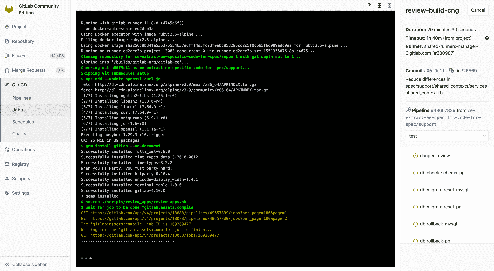
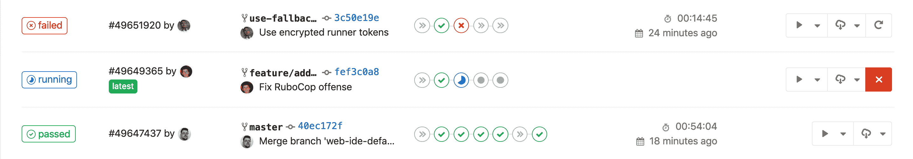
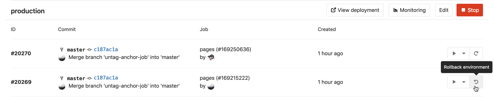
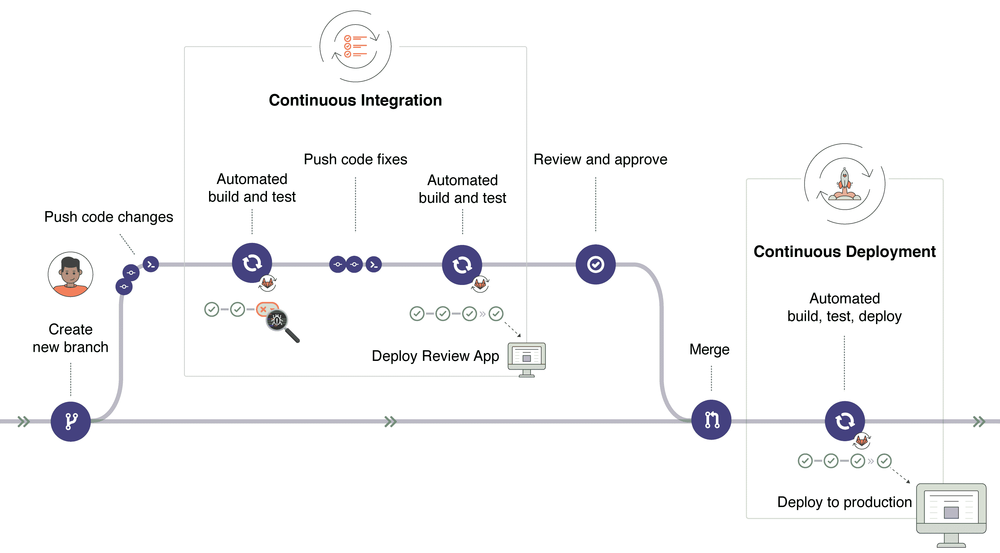
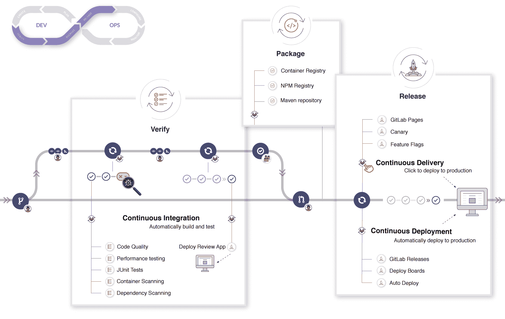

# Introduction to CI/CD with GitLab

> 原文：[https://docs.gitlab.com/ee/ci/introduction/](https://docs.gitlab.com/ee/ci/introduction/)

*   [Introduction to CI/CD methodologies](#introduction-to-cicd-methodologies)
    *   [Continuous Integration](#continuous-integration)
    *   [Continuous Delivery](#continuous-delivery)
    *   [Continuous Deployment](#continuous-deployment)
*   [Introduction to GitLab CI/CD](#introduction-to-gitlab-cicd)
    *   [How GitLab CI/CD works](#how-gitlab-cicd-works)
    *   [Basic CI/CD workflow](#basic-cicd-workflow)
        *   [A deeper look into the CI/CD basic workflow](#a-deeper-look-into-the-cicd-basic-workflow)
    *   [Setting up GitLab CI/CD for the first time](#setting-up-gitlab-cicd-for-the-first-time)

# Introduction to CI/CD with GitLab[](#introduction-to-cicd-with-gitlab "Permalink")

在本文档中，我们将概述持续集成，持续交付和持续部署的概念，并介绍 GitLab CI / CD.

**开箱即用的管理系统可以将维护工具链所花费的时间减少 10％或更多.** 观看我们的["精通持续软件开发"](https://about.gitlab.com/webcast/mastering-ci-cd/)网络广播，以了解连续方法以及 GitLab 的内置 CI 如何帮助您简化和扩展软件开发.

## Introduction to CI/CD methodologies[](#introduction-to-cicd-methodologies "Permalink")

软件开发的连续方法基于自动执行脚本，以最大程度地减少在开发应用程序时引入错误的机会. 从开发新代码到部署新代码，他们几乎不需要人工干预，甚至根本不需要干预.

它涉及到在每次小的迭代中就不断地构建，测试和部署代码更改，从而减少了基于错误或失败的先前版本开发新代码的机会.

此方法有三种主要方法，每种方法都将根据最适合您的策略的方式进行应用.

### Continuous Integration[](#continuous-integration "Permalink")

考虑一个应用程序，其代码存储在 GitLab 的 Git 存储库中. 开发人员每天要多次推送代码更改. 对于每次向存储库的推送，您都可以创建一组脚本来自动构建和测试您的应用程序，从而减少了向应用程序引入错误的机会.

这种做法被称为[持续整合](https://en.wikipedia.org/wiki/Continuous_integration) ； 对于提交给应用程序（甚至是开发分支）的每个更改，它都会自动连续地构建和测试，以确保所引入的更改通过您为应用程序建立的所有测试，准则和代码合规性标准.

[GitLab 本身](https://gitlab.com/gitlab-org/gitlab-foss)就是使用持续集成作为软件开发方法的一个示例. 对于项目的每一次推送，都有一组检查脚本的脚本.

### Continuous Delivery[](#continuous-delivery "Permalink")

[持续交付](https://continuousdelivery.com/)是超越持续集成的一步. 您的应用程序不仅会在推送到代码库的每次代码更改时都进行构建和测试，而且作为附加步骤，尽管部署是手动触发的，但它仍会持续部署.

此方法可确保自动检查代码，但需要人工干预才能从策略上手动触发更改的部署.

### Continuous Deployment[](#continuous-deployment "Permalink")

类似于持续交付， [持续部署](https://www.airpair.com/continuous-deployment/posts/continuous-deployment-for-practical-people)也是超越持续集成的又一步. 区别在于，您无需将其手动部署，而是将其设置为自动部署. 部署您的应用程序完全不需要人工干预.

## Introduction to GitLab CI/CD[](#introduction-to-gitlab-cicd "Permalink")

GitLab CI / CD 是内置在 GitLab 中的功能强大的工具，它使您可以将所有连续方法（连续集成，交付和部署）应用于软件，而无需第三方应用程序或集成.

有关概述，请参阅最近的 GitLab 聚会中的[GitLab CI 简介](https://www.youtube.com/watch?v=l5705U8s_nQ&t=397) .

### How GitLab CI/CD works[](#how-gitlab-cicd-works "Permalink")

要使用 GitLab CI / CD，您需要做的是托管在 Git 存储库中的应用程序代码库，并在[`.gitlab-ci.yml`](../yaml/README.html)文件中指定生成，测试和部署脚本，该文件位于以下目录的根路径中：您的存储库.

在此文件中，您可以定义要运行的脚本，定义包含和缓存依赖项，选择要按顺序运行的命令和要并行运行的命令，定义要在哪里部署应用程序，以及指定是否将要自动运行脚本或手动触发任何脚本. 熟悉 GitLab CI / CD 后，您可以在配置文件中添加更多高级步骤.

要将脚本添加到该文件，您需要按照适合您的应用程序并符合您要执行的测试的顺序来组织它们. 为了可视化该过程，假设添加到配置文件中的所有脚本与在计算机的终端上运行的命令相同.

将`.gitlab-ci.yml`配置文件添加到存储库后，GitLab 将检测到该文件并使用名为[GitLab Runner](https://docs.gitlab.com/runner/)的工具运行脚本，该工具的操作与终端类似.

这些脚本被分组为**作业** ，它们共同组成了一个**管道** . `.gitlab-ci.yml`文件的一个简约示例可以包含：

```
before_script:
  - apt-get install rubygems ruby-dev -y

run-test:
  script:
    - ruby --version 
```

`before_script`属性将在运行任何内容之前为您的应用程序安装依赖项，并且名为`run-test`的**作业**将打印当前系统的 Ruby 版本. 它们两者都构成了在每次推送到存储库的任何分支时触发的**管道** .

GitLab CI / CD 不仅执行您已设置的作业，而且还向您显示执行期间发生的事情，就像您在终端中看到的那样：

[](img/job_running.png)

您为您的应用程序创建了策略，GitLab 根据您定义的内容为您运行管道. 您的管道状态也会由 GitLab 显示：

[](img/pipeline_status.png)

最后，如果出现任何问题，您可以轻松[回滚](../environments/index.html#retrying-and-rolling-back)所有更改：

[](img/rollback.png)

### Basic CI/CD workflow[](#basic-cicd-workflow "Permalink")

考虑以下示例，以了解 GitLab CI / CD 如何适合通用开发工作流程.

假设您已在一个问题中讨论了代码实现，并在本地进行了建议的更改. 将提交推送到 GitLab 中的远程存储库中的功能分支后，将触发项目的 CI / CD 管道集. 这样，GitLab CI / CD：

*   运行自动化脚本（顺序或并行）以：
    *   构建并测试您的应用.
    *   就像在`localhost`看到的那样，使用 Review Apps 预览每个合并请求的更改.

对实施感到满意后：

*   让您的代码得到审查和批准.
*   将功能分支合并到默认分支.
    *   GitLab CI / CD 将您的更改自动部署到生产环境.
*   最后，如果出现问题，您和您的团队可以轻松地将其回滚.

[](img/gitlab_workflow_example_11_9.png)

GitLab CI / CD 可以做更多的事情，但是此工作流程体现了 GitLab 跟踪整个过程的能力，而无需使用外部工具来交付软件. 而且，最有用的是，您可以通过 GitLab UI 可视化所有步骤.

#### A deeper look into the CI/CD basic workflow[](#a-deeper-look-into-the-cicd-basic-workflow "Permalink")

如果我们深入研究基本工作流程，则可以在 DevOps 生命周期的每个阶段看到 GitLab 中可用的功能，如下图所示.

[](img/gitlab_workflow_example_extended_v12_3.png)

如果您从左至右查看图像，则会根据每个阶段（验证，打包，发布）看到 GitLab 中的一些可用功能.

1.  **Verify**:
    *   通过持续集成自动构建和测试您的应用程序.
    *   使用[GitLab 代码质量](../../user/project/merge_requests/code_quality.html)分析您的源代码[质量](../../user/project/merge_requests/code_quality.html) .
    *   使用[浏览器性能测试](../../user/project/merge_requests/browser_performance_testing.html)确定代码更改对性能的影响.
    *   执行一系列测试，例如[容器扫描](../../user/application_security/container_scanning/index.html) ， [依赖扫描](../../user/application_security/dependency_scanning/index.html) 和[JUnit 测试](../junit_test_reports.html) .
    *   使用[Review Apps](../review_apps/index.html)部署更改，以预览每个分支上的应用程序更改.
2.  **Package**:
    *   使用[Container Registry](../../user/packages/container_registry/index.html)存储 Docker 映像.
    *   使用[NPM Registry](../../user/packages/npm_registry/index.html)存储 NPM 软件包.
    *   用[Maven 存储库](../../user/packages/maven_repository/index.html)存储 Maven 工件.
    *   将 Conan 软件包存储在[Conan 仓库中](../../user/packages/conan_repository/index.html) .
3.  **Release**:
    *   持续部署，自动将您的应用程序部署到生产环境.
    *   连续交付，手动单击以将您的应用程序部署到生产环境.
    *   使用[GitLab Pages](../../user/project/pages/index.html)部署静态网站.
    *   仅将功能部件运送到您的一部分吊舱中，并让一定比例的用户群通过[Canary Deployments](../../user/project/canary_deployments.html)访问临时部署的功能部件.
    *   在[功能标记](../../operations/feature_flags.html)后面部署[功能](../../operations/feature_flags.html) .
    *   使用[GitLab Releases](../../user/project/releases/index.html)向任何 Git 标签添加发行说明.
    *   View of the current health and status of each CI environment running on Kubernetes with [Deploy Boards](../../user/project/deploy_boards.html).
    *   使用[Auto Deploy](../../topics/autodevops/stages.html#auto-deploy)将应用程序部署到 Kubernetes 集群中的生产环境.

使用 GitLab CI / CD，您还可以：

*   通过[Auto DevOps](../../topics/autodevops/index.html)轻松设置应用程序的整个生命周期.
*   将您的应用程序部署到不同的[环境](../environments/index.html) .
*   安装自己的[GitLab Runner](https://docs.gitlab.com/runner/) .
*   [Schedule pipelines](../pipelines/schedules.html).
*   使用[安全测试报告](../../user/application_security/index.html)检查应用程序漏洞.

要查看所有 CI / CD 功能，请导航回[CI / CD 索引](../README.html) .

观看视频[GitLab CI Live 演示](https://youtu.be/l5705U8s_nQ?t=369) ，深入了解 GitLab CI / CD.

### Setting up GitLab CI/CD for the first time[](#setting-up-gitlab-cicd-for-the-first-time "Permalink")

要开始使用 GitLab CI / CD，您需要熟悉[`.gitlab-ci.yml`](../yaml/README.html)配置文件的语法及其属性.

本文档[在 GitLab Pages 的范围内介绍了 GitLab CI / CD 的概念](../../user/project/pages/getting_started/pages_from_scratch.html) ，用于部署静态网站. 尽管它是为想要从头开始编写自己的 Pages 脚本的用户而设计的，但它也可以作为 GitLab CI / CD 设置过程的简介. 它涵盖了编写 CI / CD 配置文件的最初一般步骤，因此我们建议您通读它以了解 GitLab 的 CI / CD 逻辑，并学习如何为任何应用程序编写自己的脚本（或调整现有脚本）.

要深入了解 GitLab 的 CI / CD 配置选项，请查看[`.gitlab-ci.yml`完整参考](../yaml/README.html) .