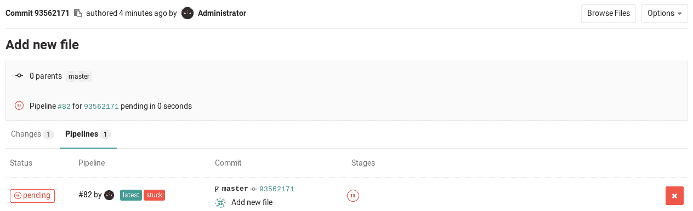
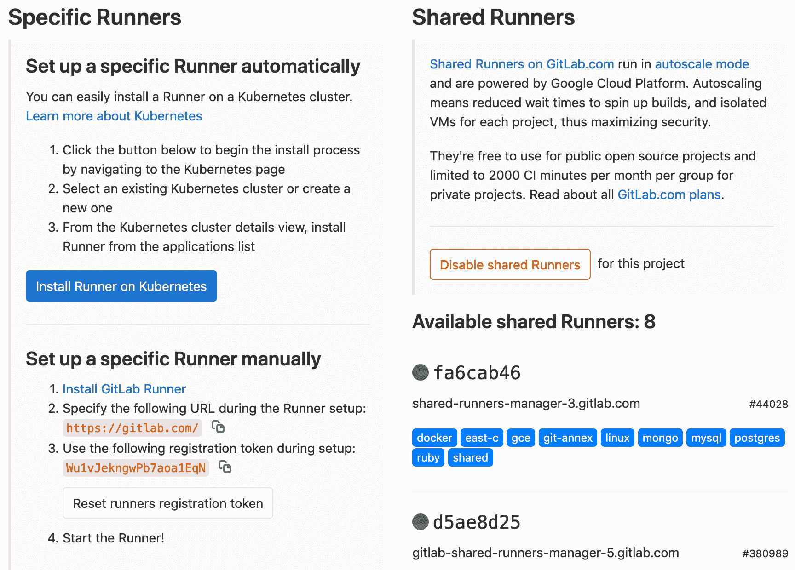
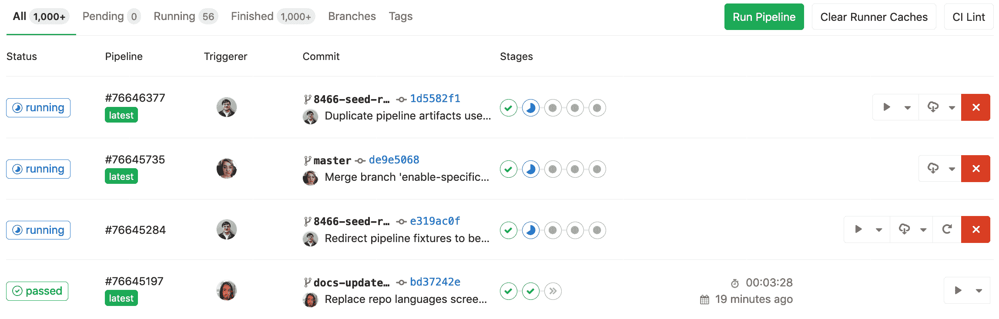
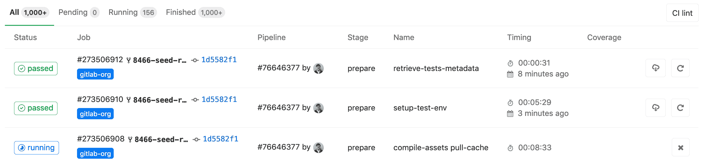
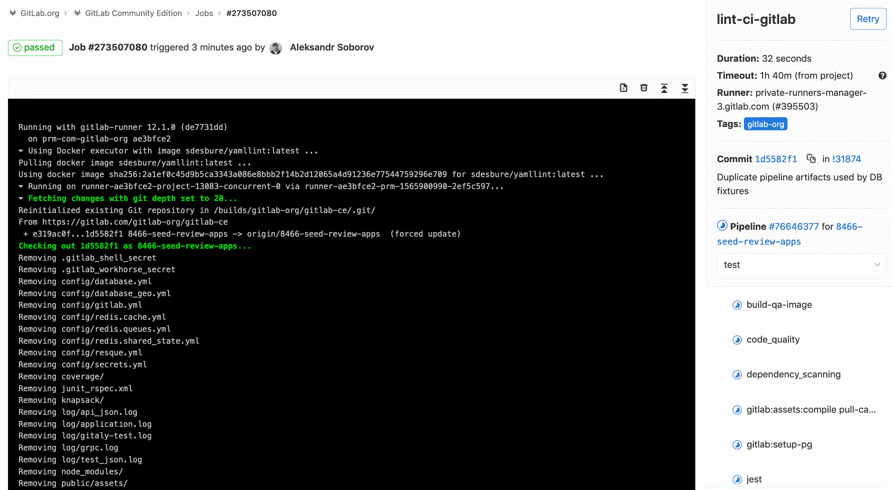

# Getting started with GitLab CI/CD

> 原文：[https://docs.gitlab.com/ee/ci/quick_start/README.html](https://docs.gitlab.com/ee/ci/quick_start/README.html)

*   [Creating a `.gitlab-ci.yml` file](#creating-a-gitlab-ciyml-file)
    *   [What is `.gitlab-ci.yml`](#what-is-gitlab-ciyml)
    *   [Creating a simple `.gitlab-ci.yml` file](#creating-a-simple-gitlab-ciyml-file)
    *   [Push `.gitlab-ci.yml` to GitLab](#push-gitlab-ciyml-to-gitlab)
*   [Configuring a Runner](#configuring-a-runner)
    *   [Shared Runners](#shared-runners)
*   [Seeing the status of your pipeline and jobs](#seeing-the-status-of-your-pipeline-and-jobs)
*   [Examples](#examples)

# Getting started with GitLab CI/CD[](#getting-started-with-gitlab-cicd "Permalink")

**注意：**从 8.0 版开始，GitLab [持续集成](https://about.gitlab.com/stages-devops-lifecycle/continuous-integration/) （CI）已完全集成到 GitLab 本身，并且默认情况下在所有项目上都[启用](../enable_or_disable_ci.html) .**注意：**请记住，只有项目维护者和管理员用户有权访问项目的设置.**注意：**要从 Jenkins 转到 GitLab 吗？ 查阅我们的[参考](../jenkins/index.html) ，将您先前存在的管道转换为我们的格式.**注意：**您可以考虑在项目中使用几种不同的[基本管道体系结构](../pipelines/pipeline_architectures.html) . 您可能需要在开始之前熟悉这些内容.

GitLab 提供[持续集成](https://about.gitlab.com/stages-devops-lifecycle/continuous-integration/)服务. 对于每次提交或推送以触发您的 CI [管道](../pipelines/index.html) ，您必须：

*   Add a [`.gitlab-ci.yml` file](#creating-a-gitlab-ciyml-file) to your repository’s root directory.
*   确保将项目配置为使用[Runner](#configuring-a-runner) .

`.gitlab-ci.yml`文件告诉 GitLab Runner 做什么. 一个简单的管道通常包括三个[阶段](../yaml/README.html#stages) ：

*   `build`
*   `test`
*   `deploy`

您不需要使用所有三个阶段； 没有工作的阶段将被忽略.

管道显示在项目的**CI / CD>管道**页面下. 如果一切运行正常（没有非零返回值），您将获得与提交关联的绿色复选标记. 这样就可以轻松查看提交是否导致任何测试失败，甚至无需查看作业（测试）日志. 许多项目使用 GitLab 的 CI 服务来运行测试套件，因此如果开发人员遇到问题，他们会立即获得反馈.

通常，使用管道将经过测试的代码自动部署到登台和生产环境中.

* * *

本指南假定您具有：

*   8.0+或正在使用[GitLab.com 的](https://gitlab.com)有效 GitLab 实例.
*   您要在其中使用 CI 的 GitLab 中的项目.
*   维护者或所有者对项目的访问

让我们将其分解为 GitLab CI / CD 难题.

## Creating a `.gitlab-ci.yml` file[](#creating-a-gitlab-ciyml-file "Permalink")

在创建`.gitlab-ci.yml`之前，让我们首先简要地解释这是怎么回事.

### What is `.gitlab-ci.yml`[](#what-is-gitlab-ciyml "Permalink")

您可以在`.gitlab-ci.yml`文件中配置 CI 对项目的作用. 它位于存储库的根目录中.

在对存储库进行任何推送时，GitLab 都会查找`.gitlab-ci.yml`文件，并根据该文件的内容在*Runners*上启动作业，以进行提交.

由于`.gitlab-ci.yml`在存储库中并且受版本控制，因此旧版本仍然可以成功构建，fork 可以轻松使用 CI，分支可以具有不同的管道和作业，并且您拥有 CI 的唯一真实来源. 您可以[在我们的博客中](https://about.gitlab.com/blog/2015/05/06/why-were-replacing-gitlab-ci-jobs-with-gitlab-ci-dot-yml/)阅读更多有关为什么使用`.gitlab-ci.yml`的原因.

### Creating a simple `.gitlab-ci.yml` file[](#creating-a-simple-gitlab-ciyml-file "Permalink")

> **注意：** `.gitlab-ci.yml`是一个[YAML](https://en.wikipedia.org/wiki/YAML)文件，因此您必须特别注意缩进. 始终使用空格，不要使用制表符.

您需要在存储库的根目录中创建一个名为`.gitlab-ci.yml`的文件. 以下是 Ruby on Rails 项目的示例.

```
image: "ruby:2.5"

before_script:
  - apt-get update -qq && apt-get install -y -qq sqlite3 libsqlite3-dev nodejs
  - ruby -v
  - which ruby
  - gem install bundler --no-document
  - bundle install --jobs $(nproc)  "${FLAGS[@]}"

rspec:
  script:
    - bundle exec rspec

rubocop:
  script:
    - bundle exec rubocop 
```

This is the simplest possible configuration that will work for most Ruby applications:

1.  用要执行的不同命令定义两个作业`rspec`和`rubocop` （名称是任意的）.
2.  在执行每个作业之前，将执行`before_script`定义的命令.

`.gitlab-ci.yml`文件定义了作业集，并限制了作业的运行方式和时间. 作业被定义为具有名称的顶级元素（在我们的示例中为`rspec`和`rubocop` ），并且始终必须包含`script`关键字. 乔布斯被用于创造就业机会，然后由挑选[运动员](../runners/README.html)和跑步者的环境中执行.

重要的是每个作业都彼此独立运行.

如果要检查项目的`.gitlab-ci.yml`是否有效，则项目名称空间的`/-/ci/lint`页下有一个 Lint 工具. 您也可以在项目的**CI / CD➔管道**和**管道➔作业**下找到" CI Lint"按钮以转到此页面.

有关更多信息和完整的`.gitlab-ci.yml`语法，请阅读[`.gitlab-ci.yml`上的参考文档](../yaml/README.html) .

### Push `.gitlab-ci.yml` to GitLab[](#push-gitlab-ciyml-to-gitlab "Permalink")

创建`.gitlab-ci.yml` ，应将其添加到 Git 存储库中并将其推送到 GitLab.

```
git add .gitlab-ci.yml
git commit -m "Add .gitlab-ci.yml"
git push origin master 
```

现在，如果您转到" **管道"**页面，您将看到管道处于挂起状态.

**注意：**如果您有一个[从 GitLab 提取镜像的存储库](../../user/project/repository/repository_mirroring.html#pulling-from-a-remote-repository-starter) ，则可能需要在项目的**"设置">"存储库">"从远程存储库中提取">"触发管道以进行镜像更新"中**启用管道触发.

您也可以转到" **提交"**页面，注意提交 SHA 旁边的小暂停图标.

[](img/new_commit.png)

单击它，您将被定向到该特定提交的作业页面.

[](img/single_commit_status_pending.png)

注意，有一个待处理的作业以我们在`.gitlab-ci.yml`编写的`.gitlab-ci.yml` . "卡住"表示尚未为此作业配置任何运行器.

下一步是配置运行器，以便它选择挂起的作业.

## Configuring a Runner[](#configuring-a-runner "Permalink")

在 GitLab 中，Runners 运行您在`.gitlab-ci.yml`定义的作业. Runner 可以是虚拟机，VPS，裸机，Docker 容器甚至是容器集群. GitLab 和 Runners 通过 API 进行通信，因此唯一的要求是 Runner 的计算机具有对 GitLab 服务器的网络访问权限.

Runner 可以特定于某个项目，也可以在 GitLab 中服务多个项目. 如果它服务于所有项目，则称为*Shared Runner* .

在" [跑步者"](../runners/README.html)文档中查找有关不同跑步者的更多信息.

您可以通过转到**设置➔CI / CD**来查找是否将任何跑步者分配给您的项目. 设置 Runner 既简单又直接. GitLab 支持的官方 Runner 是用 Go 编写的，其文档可以在[https://docs.gitlab.com/runner/中](https://docs.gitlab.com/runner/)找到.

为了拥有功能正常的 Runner，您需要执行以下两个步骤：

1.  [Install it](https://docs.gitlab.com/runner/install/)
2.  [Configure it](https://docs.gitlab.com/runner/configuration/)

请按照上面的链接设置您自己的 Runner 或使用下一节所述的 Shared Runner.

设置 Runner 之后，您应该在**设置➔CI / CD**后面的项目的 Runners 页面上看到它.

[](img/runners_activated.png)

### Shared Runners[](#shared-runners "Permalink")

如果使用[GitLab.com](https://gitlab.com/) ，则可以使用 GitLab Inc.提供的**共享运行程序** .

这些是在 GitLab 基础架构上运行的特殊虚拟机，可以构建任何项目.

要启用**共享运行程序，**您必须转到项目的**设置➔CI / CD** ，然后单击**启用共享运行程序** .

[Read more on Shared Runners](../runners/README.html).

## Seeing the status of your pipeline and jobs[](#seeing-the-status-of-your-pipeline-and-jobs "Permalink")

成功配置 Runner 之后，您应该看到上一次提交的状态从" *未决"*更改为" *正在* *运行"* ，" *成功"*或" *失败"* .

您可以转到项目中的" **管道"**页面来查看所有管道.

[](img/pipelines_status.png)

或者，您可以转到" **管道➔作业"**页面查看所有作业.

[](img/builds_status.png)

通过单击作业的状态，您将能够看到该作业的日志. 这对于诊断工作为什么失败或行为与您预期的不同很重要.

[](img/build_log.png)

您还可以在 GitLab 的各个页面中查看任何提交的状态，例如**提交**和**合并请求** .

## Examples[](#examples "Permalink")

请访问[示例自述文件](../examples/README.html)以查看使用各种语言的 GitLab CI 的示例列表.