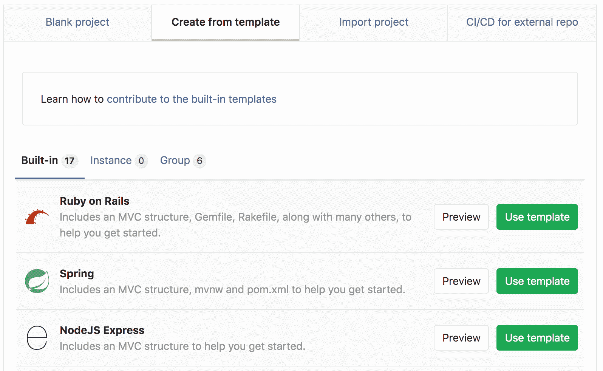
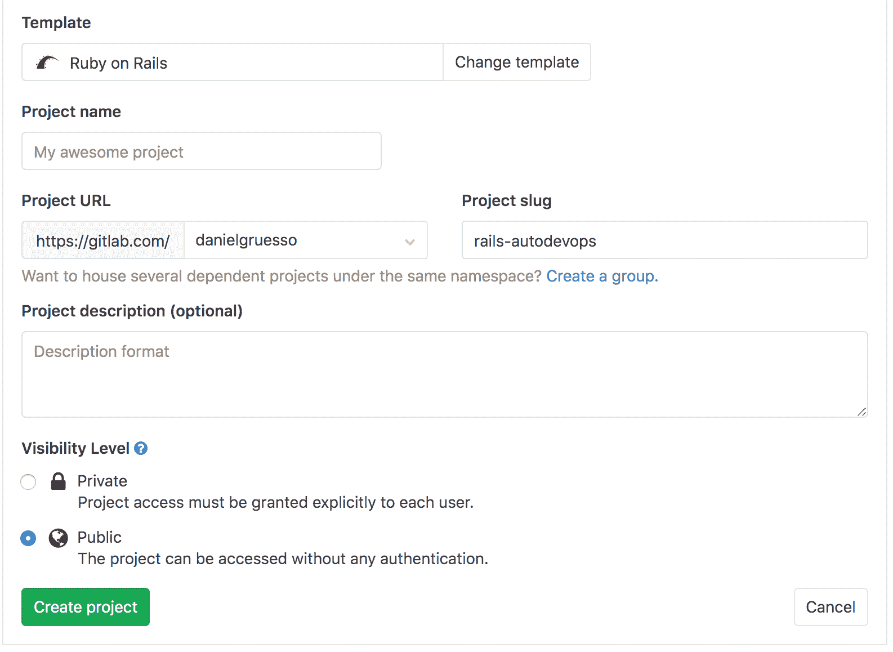
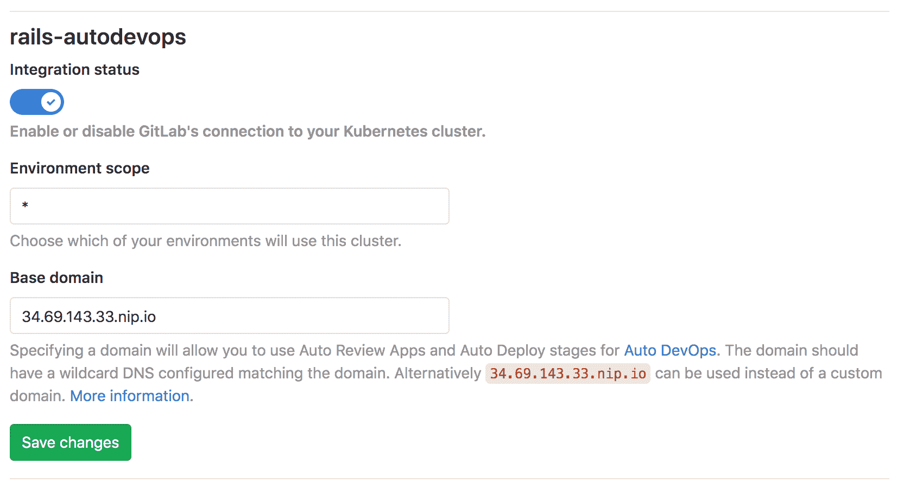
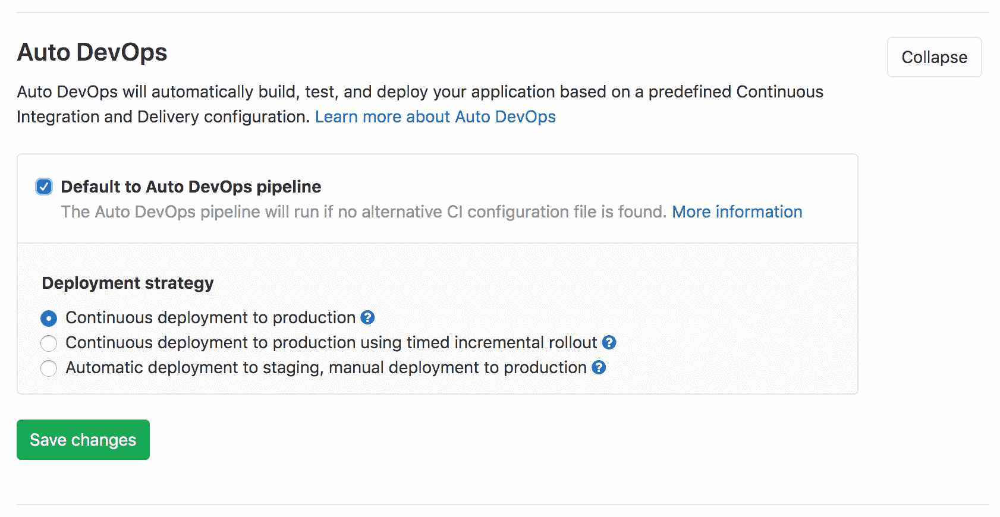
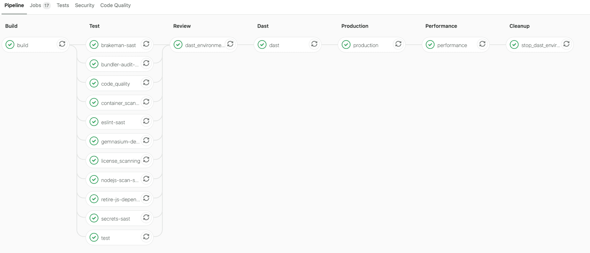
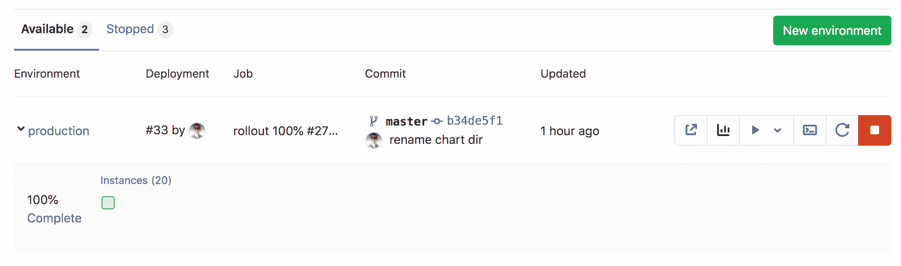
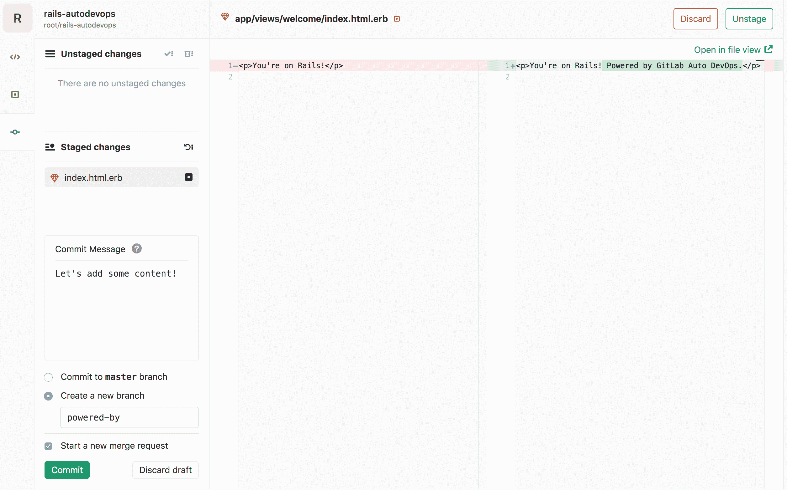
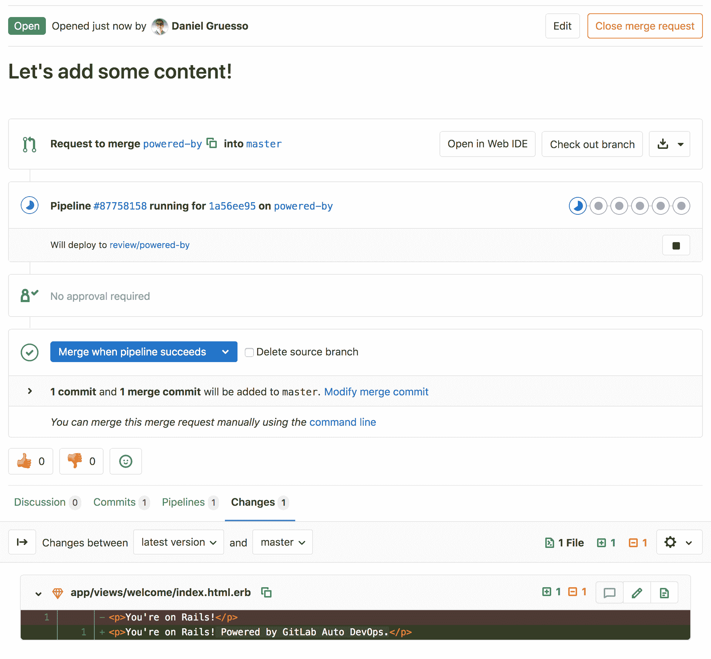
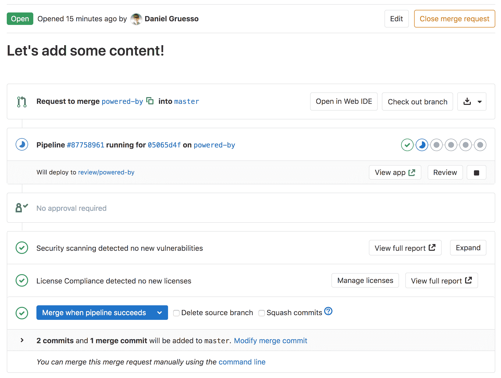

# Getting started with Auto DevOps

> 原文：[https://docs.gitlab.com/ee/topics/autodevops/quick_start_guide.html](https://docs.gitlab.com/ee/topics/autodevops/quick_start_guide.html)

*   [Configure your Google account](#configure-your-google-account)
*   [Create a new project from a template](#create-a-new-project-from-a-template)
*   [Create a Kubernetes cluster from within GitLab](#create-a-kubernetes-cluster-from-within-gitlab)
*   [Install Ingress and Prometheus](#install-ingress-and-prometheus)
*   [Enable Auto DevOps (optional)](#enable-auto-devops-optional)
*   [Deploy the application](#deploy-the-application)
    *   [Monitor your project](#monitor-your-project)
    *   [Work with branches](#work-with-branches)
*   [Conclusion](#conclusion)

# Getting started with Auto DevOps[](#getting-started-with-auto-devops "Permalink")

本分步指南将帮助您使用[Auto DevOps](index.html)将 GitLab.com 上托管的项目部署到 Google Kubernetes Engine.

您将使用 GitLab 的本地 Kubernetes 集成，因此您无需使用 Google Cloud Platform 控制台手动创建 Kubernetes 集群. 您将创建并部署一个从 GitLab 模板创建的简单应用程序.

这些说明也适用于自我管理的 GitLab 实例； 您只需要确保[配置了](../../ci/runners/README.html)自己的[Runners](../../ci/runners/README.html)并[启用了 Google OAuth](../../integration/google.html) .

## Configure your Google account[](#configure-your-google-account "Permalink")

在创建 Kubernetes 集群并将其连接到 GitLab 项目之前，您需要一个[Google Cloud Platform 帐户](https://console.cloud.google.com) . 使用现有的 Google 帐户登录，例如用于访问 Gmail 或 Google 云端硬盘的帐户，或创建一个新帐户.

1.  请按照 Kubernetes Engine 文档的["开始之前"一节](https://cloud.google.com/kubernetes-engine/docs/quickstart#before-you-begin)中描述的步骤来启用所需的 API 和相关服务.
2.  确保您已使用 Google Cloud Platform 创建了一个[结算帐户](https://cloud.google.com/billing/docs/how-to/manage-billing-account) .

**提示：**每个新的 Google Cloud Platform（GCP）帐户都会获得[$ 300 的信用额](https://console.cloud.google.com/freetrial) ，并且与 Google 合作，GitLab 能够为新的 GCP 帐户提供额外的$ 200，以开始使用 GitLab 的 Google Kubernetes Engine Integration. [点击此链接](https://cloud.google.com/partners/partnercredit/?pcn_code=0014M00001h35gDQAQ#contact-form)并申请信用.

## Create a new project from a template[](#create-a-new-project-from-a-template "Permalink")

我们将使用 GitLab 的项目模板之一来开始. 顾名思义，这些项目提供了基于某些知名框架的准系统应用程序.

1.  在 GitLab 中，单击加号（ ），然后选择**新建项目** .
2.  转到**从模板创建**选项卡，您可以在其中选择 Ruby on Rails，Spring 或 NodeJS Express 项目. 对于本教程，请使用 Ruby on Rails 模板.

    [](img/guide_project_template_v12_3.png)

3.  给您的项目起一个名字，或者选择一个描述，并将其公开，以便您可以利用[GitLab Gold 计划](https://about.gitlab.com/pricing/#gitlab-com)中的可用功能.

    [](img/guide_create_project_v12_3.png)

4.  Click **建立专案**.

现在，您已经创建了一个项目，接下来将创建 Kubernetes 集群以将该项目部署到该集群.

## Create a Kubernetes cluster from within GitLab[](#create-a-kubernetes-cluster-from-within-gitlab "Permalink")

1.  在项目的登录页面上，单击**添加 Kubernetes 集群** （请注意，当您导航到 **操作> Kubernetes** ）.

    [](img/guide_project_landing_page_v12_10.png)

2.  在" **添加 Kubernetes 集群集成"**页面上，单击" **创建新集群"**选项卡，然后单击" **Google GKE"** .

3.  与您的 Google 帐户关联，然后单击" **允许"**以允许访问您的 Google 帐户. （此授权请求仅在您第一次将 GitLab 与您的 Google 帐户连接时显示.）

    授权访问后，将显示" **添加 Kubernetes 集群集成"**页面.

4.  在**输入 Kubernetes 集群的详细信息**部分中，提供有关集群的详细信息：

    *   **Kubernetes cluster name**
    *   **环境范围** -保留此字段不变.
    *   **Google Cloud Platform 项目** -选择一个项目. 在[配置 Google 帐户后](#configure-your-google-account) ，应该已经为您创建了一个项目.
    *   **区域** -要在其中创建群集的[区域/区域](https://cloud.google.com/compute/docs/regions-zones/) .
    *   **节点数**
    *   **机器类型** -有关[机器类型的](https://cloud.google.com/compute/docs/machine-types)更多信息，请参阅 Google 文档.
    *   **为 Anthos 启用 Cloud Run-**选中此复选框以对该集群使用[Cloud Run](../../user/project/clusters/add_gke_clusters.html#cloud-run-for-anthos) ，Istio 和 HTTP Load Balancing 加载项.
    *   **由 GitLab 管理的群集** -选中此复选框以[允许 GitLab 管理](../../user/project/clusters/index.html#gitlab-managed-clusters)该群集的[名称空间和服务帐户](../../user/project/clusters/index.html#gitlab-managed-clusters) .
5.  Click **创建一个 Kubernetes 集群**.

几分钟后，将创建集群. 您还可以在[GCP 仪表板上](https://console.cloud.google.com/kubernetes)查看其状态.

接下来，您将在群集上安装一些需要充分利用 Auto DevOps 的应用程序.

## Install Ingress and Prometheus[](#install-ingress-and-prometheus "Permalink")

集群运行后，您可以安装第一个应用程序. 在本指南中，我们将安装 Ingress 和 Prometheus：

*   入口-在后台使用 NGINX 提供负载平衡，SSL 终止和基于名称的虚拟主机.
*   Prometheus-一种用于监视已部署应用程序的开源监视和警报系统.

**注意：**我们不会在此快速入门指南中安装 GitLab Runner，因为该指南使用了 GitLab.com 提供的共享 Runners.

要安装应用程序：

*   单击**Ingress**的**安装**按钮.
*   显示**入口端点时** ，复制 IP 地址.
*   添加您的**基本域** . 对于本指南，我们将使用 GitLab 建议的域.
*   Click **保存更改**.

[](img/guide_base_domain_v12_3.png)

## Enable Auto DevOps (optional)[](#enable-auto-devops-optional "Permalink")

默认情况下启用 Auto DevOps 时，可以在实例级别（对于自我管理的实例）和组级别禁用 Auto DevOps. 完成以下步骤以启用 Auto DevOps（如果已禁用）：

1.  导航 **设置> CI / CD>自动 DevOps** ，然后点击**扩展** .
2.  选择**默认为自动 DevOps 管道**以显示更多选项.
3.  在" **部署策略"中** ，选择所需的[连续部署策略](index.html#deployment-strategy) ，以在管道成功在`master`分支上运行之后将应用程序部署到生产中.
4.  Click **保存更改**.

    [](img/guide_enable_autodevops_v12_3.png)

保存更改后，GitLab 将创建一个新管道. 要查看它，请转到 **CI / CD>管道** .

在下一节中，我们将解释管道中每个作业的作用.

## Deploy the application[](#deploy-the-application "Permalink")

当管道运行时，它在做什么？

要查看管道中的作业，请单击管道的状态标记. 的 图标在管道作业运行时显示，并在不刷新页面的情况下进行更新 （成功）或 （失败）作业完成时.

作业分为以下几个阶段：

[](img/guide_pipeline_stages_v13_0.png)

*   **构建** -应用程序将构建 Docker 映像并将其上传到项目的[Container Registry](../../user/packages/container_registry/index.html) （ [Auto Build](stages.html#auto-build) ）.
*   **测试** -GitLab 在应用程序上运行各种检查：

    *   `test`作业通过检测语言和框架来运行单元测试和集成测试（ [自动测试](stages.html#auto-test) ）
    *   `code_quality`作业检查代码质量，并允许失败（ [自动代码质量](stages.html#auto-code-quality-starter) ）
    *   `container_scanning`作业检查 Docker 容器是否存在任何漏洞并被允许失败（ [自动容器扫描](stages.html#auto-container-scanning-ultimate) ）
    *   `dependency_scanning`作业检查应用程序是否具有易受漏洞影响的任何依赖关系，并允许其失败（ [自动依赖关系扫描](stages.html#auto-dependency-scanning-ultimate) ）
    *   后缀为`-sast`作业在当前代码上运行静态分析，以检查潜在的安全问题，并允许其失败（ [Auto SAST](stages.html#auto-sast-ultimate) ）
    *   `secret-detection`作业会检查泄漏的机密并允许其失败（ [自动机密检测](stages.html#auto-secret-detection-ultimate) ）
    *   `license_management`作业搜索应用程序的依存关系，以确定其每个许可证并被允许失败（ [自动许可证合规](stages.html#auto-license-compliance-ultimate) ）**注意：**除`test`外，所有作业均允许在测试阶段失败.
*   **回顾** -对输水管道`master`包括这个阶段有`dast_environment_deploy`工作. 要了解更多信息，请参阅[动态应用程序安全性测试（DAST）](../../user/application_security/dast/index.html) .

*   **生产** -测试和检查完成后，该应用程序将在 Kubernetes 中进行部署（ [Auto Deploy](stages.html#auto-deploy) ）.

*   **性能** -性能测试在已部署的应用程序上运行（ [自动浏览器性能测试](stages.html#auto-browser-performance-testing-premium) ）.

*   **清理** -对输水管道`master`包括这个阶段有`stop_dast_environment`工作.

在运行管道之后，您应该查看已部署的网站并学习如何对其进行监视.

### Monitor your project[](#monitor-your-project "Permalink")

成功部署您的应用程序后，您可以通过导航到" **环境"**页面来查看其网站并检查其运行状况. **运营>环境** . 该页面显示有关已部署应用程序的详细信息，右侧列显示将您链接到常见环境任务的图标：

[](img/guide_environments_v12_3.png)

*   **开放的现场环境** （ ）-打开生产环境中部署的应用程序的 URL
*   **Monitoring** () - Opens the metrics page where Prometheus collects data about the Kubernetes cluster and how the application affects it in terms of memory usage, CPU usage, and latency
*   **部署到** （ ）-显示可以部署到的环境的列表
*   **终端** （ ）-在运行应用程序的容器内打开[Web 终端](../../ci/environments/index.html#web-terminals)会话
*   **重新部署到环境** （ ）-有关更多信息，请参阅[重试和回滚](../../ci/environments/index.html#retrying-and-rolling-back)
*   **停止环境** （ ）-有关更多信息，请参阅[停止环境](../../ci/environments/index.html#stopping-an-environment)

GitLab 在环境信息下方显示[部署板](../../user/project/deploy_boards.html) ，并用正方形表示 Kubernetes 集群中的 Pod，并用颜色编码以显示其状态. 将鼠标悬停在部署板上的正方形上会显示部署的状态，单击该正方形会将您带到窗格的日志页面.

**提示：**该示例目前仅显示一个托管应用程序的 Pod，但是您可以通过在以下[`REPLICAS`](customize.html#environment-variables)定义[`REPLICAS`变量](customize.html#environment-variables)来添加更多 Pod **设置> CI / CD>环境变量** .

### Work with branches[](#work-with-branches "Permalink")

按照[GitLab 流程](../gitlab_flow.html#working-with-feature-branches) ，您接下来应该创建一个功能分支以向您的应用程序添加内容：

1.  在项目的存储库中，导航到以下文件： `app/views/welcome/index.html.erb` . 该文件应仅包含一个段落： `<p>You're on Rails!</p>` .
2.  打开 GitLab [Web IDE](../../user/project/web_ide/index.html)进行更改.
3.  编辑文件，使其包含：

    ```
    <p>You're on Rails! Powered by GitLab Auto DevOps.</p> 
    ```

4.  暂存文件. 添加提交消息，然后通过单击**Commit**创建一个新分支和一个合并请求.

    [](img/guide_ide_commit_v12_3.png)

提交合并请求后，GitLab 运行你的管道，而在这一切的工作，如[前文所述](#deploy-the-application) ，除了仅在比其他分支多跑几个`master` .

[](img/guide_merge_request_v12_3.png)

几分钟后，您会注意到测试失败，这意味着您的更改"破坏了"测试. 单击失败的`test`作业以查看有关它的更多信息：

```
Failure:
WelcomeControllerTest#test_should_get_index [/app/test/controllers/welcome_controller_test.rb:7]:
<You're on Rails!> expected but was
<You're on Rails! Powered by GitLab Auto DevOps.>..
Expected 0 to be >= 1.

bin/rails test test/controllers/welcome_controller_test.rb:4 
```

要修复损坏的测试：

1.  返回到合并请求的" **概述"**页面，然后单击" **在 Web IDE 中打开"** .
2.  在文件的左侧目录中，找到`test/controllers/welcome_controller_test.rb`文件，然后单击将其打开.
3.  更改第 7 行，说" `You're on Rails! Powered by GitLab Auto DevOps.` `You're on Rails! Powered by GitLab Auto DevOps.`
4.  Click **Commit**.
5.  在左侧列的"未**分段的更改"下** ，单击选中标记图标（ ）进行更改.
6.  编写提交消息，然后单击**提交** .

返回到合并请求的" **概述"**页面，您不仅应该看到测试通过，而且应该看到部署为[审阅应用程序的应用程序](stages.html#auto-review-apps) . 您可以通过单击**查看应用程序**来访问它 按钮以查看已部署的更改.

[](img/guide_merge_request_review_app_v12_3.png)

合并合并请求后，GitLab 在`master`分支上运行管道，然后将应用程序部署到生产环境.

## Conclusion[](#conclusion "Permalink")

实施该项目之后，您应该对 Auto DevOps 的基础有深入的了解. 您从构建和测试开始，到在 GitLab 中全部部署和监视应用程序. 尽管具有自动特性，但也可以配置和自定义 Auto DevOps 以适合您的工作流程. 以下是一些有用的资源，供您进一步阅读：

1.  [Auto DevOps](index.html)
2.  [Multiple Kubernetes clusters](index.html#using-multiple-kubernetes-clusters)
3.  [Incremental rollout to production](customize.html#incremental-rollout-to-production-premium)
4.  [Disable jobs you don’t need with environment variables](customize.html#environment-variables)
5.  [Use a static IP for your cluster](../../user/clusters/applications.html#using-a-static-ip)
6.  [Use your own buildpacks to build your application](customize.html#custom-buildpacks)
7.  [Prometheus monitoring](../../user/project/integrations/prometheus.html)