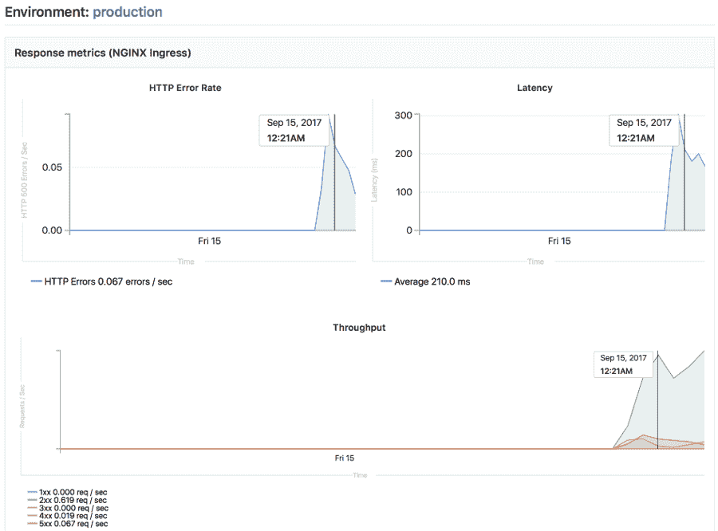

# Stages of Auto DevOps

> 原文：[https://docs.gitlab.com/ee/topics/autodevops/stages.html](https://docs.gitlab.com/ee/topics/autodevops/stages.html)

*   [Auto Build](#auto-build)
    *   [Auto Build using a Dockerfile](#auto-build-using-a-dockerfile)
    *   [Auto Build using Heroku buildpacks](#auto-build-using-heroku-buildpacks)
    *   [Auto Build using Cloud Native Buildpacks (beta)](#auto-build-using-cloud-native-buildpacks-beta)
*   [Auto Test](#auto-test)
    *   [Currently supported languages](#currently-supported-languages)
*   [Auto Code Quality](#auto-code-quality-starter)
*   [Auto SAST](#auto-sast-ultimate)
*   [Auto Secret Detection](#auto-secret-detection-ultimate)
*   [Auto Dependency Scanning](#auto-dependency-scanning-ultimate)
*   [Auto License Compliance](#auto-license-compliance-ultimate)
*   [Auto Container Scanning](#auto-container-scanning-ultimate)
*   [Auto Review Apps](#auto-review-apps)
*   [Auto DAST](#auto-dast-ultimate)
    *   [Overriding the DAST target](#overriding-the-dast-target)
    *   [Disabling Auto DAST](#disabling-auto-dast)
*   [Auto Browser Performance Testing](#auto-browser-performance-testing-premium)
*   [Auto Load Performance Testing](#auto-load-performance-testing-premium)
*   [Auto Deploy](#auto-deploy)
    *   [GitLab deploy tokens](#gitlab-deploy-tokens)
    *   [Kubernetes 1.16+](#kubernetes-116)
    *   [Migrations](#migrations)
    *   [Workers](#workers)
    *   [Network Policy](#network-policy)
    *   [Web Application Firewall (ModSecurity) customization](#web-application-firewall-modsecurity-customization)
    *   [Running commands in the container](#running-commands-in-the-container)
*   [Auto Monitoring](#auto-monitoring)

# Stages of Auto DevOps[](#stages-of-auto-devops "Permalink")

以下各节描述了[Auto DevOps](index.html)的阶段. 仔细阅读它们，以了解它们的工作原理.

## Auto Build[](#auto-build "Permalink")

自动构建使用现有的`Dockerfile`或 Heroku 构建包创建应用程序的构建. 生成的 Docker 映像被推送到[Container Registry](../../user/packages/container_registry/index.html) ，并用提交 SHA 或标记进行标记.

### Auto Build using a Dockerfile[](#auto-build-using-a-dockerfile "Permalink")

如果项目的存储库在其根目录中包含`Dockerfile` ，则"自动构建"将使用`Dockerfile` `docker build`来创建 Docker 映像.

如果您还使用 Auto Review Apps 和 Auto Deploy，并且选择提供自己的`Dockerfile` ，那么您必须：

*   将您的应用程序公开到端口`5000` ，因为[默认的 Helm 图表](https://gitlab.com/gitlab-org/charts/auto-deploy-app)假定此端口可用.
*   通过[自定义 Auto Deploy Helm 图表来](customize.html#custom-helm-chart)覆盖默认值.

### Auto Build using Heroku buildpacks[](#auto-build-using-heroku-buildpacks "Permalink")

自动构建使用项目的`Dockerfile`如果存在）构建应用程序. 如果不存在`Dockerfile` ，它将使用[Herokuish](https://github.com/gliderlabs/herokuish)和[Heroku buildpacks](https://devcenter.heroku.com/articles/buildpacks)检测应用程序并将其构建到 Docker 映像中.

每个 buildpack 都需要您项目的存储库包含某些文件，以便 Auto Build 成功构建您的应用程序. 例如，您的应用程序的根目录必须包含与您的应用程序语言相对应的文件：

*   对于 Python 项目，为`Pipfile`或`requirements.txt`文件.
*   对于 Ruby 项目，请使用`Gemfile`或`Gemfile.lock`文件.

有关其他语言和框架的要求，请阅读[Heroku buildpacks 文档](https://devcenter.heroku.com/articles/buildpacks#officially-supported-buildpacks) .

**提示：**如果尽管项目满足 buildpack 要求，但 Auto Build 失败，请设置项目变量`TRACE=true`启用详细日志记录，这可能有助于您进行故障排除.

### Auto Build using Cloud Native Buildpacks (beta)[](#auto-build-using-cloud-native-buildpacks-beta "Permalink")

在[GitLab 12.10 中](https://gitlab.com/gitlab-org/gitlab/-/merge_requests/28165)引入.

自动构建支持通过[`pack`命令](https://github.com/buildpacks/pack)使用[Cloud Native Buildpacks](https://buildpacks.io)构建应用程序. 要使用 Cloud Native Buildpacks，请将 CI 变量`AUTO_DEVOPS_BUILD_IMAGE_CNB_ENABLED`设置为非空值. 默认的构建器是`heroku/buildpacks:18`但是可以使用 CI 变量`AUTO_DEVOPS_BUILD_IMAGE_CNB_BUILDER`选择其他构建器.

Cloud Native Buildpacks（CNB）是 Heroku buildpack 的演进，最终将取代 Auto DevOps 中基于 Herokuish 的构建. 有关更多信息，请参见此[问题](https://gitlab.com/gitlab-org/gitlab/-/issues/212692) .

使用 Cloud Native Buildpacks 的构建与使用 Heroku buildpacks 的构建支持相同的选项，但有以下警告：

*   该构建包必须是 Cloud Native Buildpack. 可以使用 Heroku 的 cnb [`cnb-shim`](https://github.com/heroku/cnb-shim)将 Heroku 构建包转换为 Cloud Native 构建包.
*   `BUILDPACK_URL`必须[采用`pack`支持](https://buildpacks.io/docs/app-developer-guide/specific-buildpacks/)的格式.
*   `/bin/herokuish`命令不出现在结果图像中，并且不再需要（也不可能）使用`/bin/herokuish procfile exec`作为前缀命令.

**Note:** Auto Test still uses Herokuish, as test suite detection is not yet part of the Cloud Native Buildpack specification. For more information, see [this issue](https://gitlab.com/gitlab-org/gitlab/-/issues/212689).

## Auto Test[](#auto-test "Permalink")

自动测试通过分析项目以检测语言和框架，使用[Herokuish](https://github.com/gliderlabs/herokuish)和[Heroku](https://devcenter.heroku.com/articles/buildpacks)构建[包](https://github.com/gliderlabs/herokuish)为您的应用程序运行适当的测试. 系统会自动检测到多种语言和框架，但是如果未检测到您的语言，则可以创建[自定义 buildpack](customize.html#custom-buildpacks) . 检查[当前支持的语言](#currently-supported-languages) .

自动测试使用您的应用程序中已有的测试. 如果没有测试，则由您决定添加它们.

### Currently supported languages[](#currently-supported-languages "Permalink")

请注意，并不是所有的 buildpack 都支持自动测试，因为它是一个相对较新的增强功能. Heroku 的所有[官方支持的语言都](https://devcenter.heroku.com/articles/heroku-ci#supported-languages)支持自动测试. Heroku 的 Herokuish buildpack 支持的语言都支持自动测试，但值得注意的是 multi-buildpack 不支持.

支持的构建包是：

```
- heroku-buildpack-multi
- heroku-buildpack-ruby
- heroku-buildpack-nodejs
- heroku-buildpack-clojure
- heroku-buildpack-python
- heroku-buildpack-java
- heroku-buildpack-gradle
- heroku-buildpack-scala
- heroku-buildpack-play
- heroku-buildpack-php
- heroku-buildpack-go
- buildpack-nginx 
```

如果您的应用程序需要的构建包不在上面的列表中，则可能要使用[自定义的 buildpack](customize.html#custom-buildpacks) .

## Auto Code Quality[](#auto-code-quality-starter "Permalink")

自动代码质量使用[代码质量图像](https://gitlab.com/gitlab-org/ci-cd/codequality)对当前代码运行静态分析和其他代码检查. 创建报告后，报告将作为工件上传，您可以稍后下载并签出. 合并请求小部件还显示[源分支和目标分支之间的](../../user/project/merge_requests/code_quality.html)任何[差异](../../user/project/merge_requests/code_quality.html) .

## Auto SAST[](#auto-sast-ultimate "Permalink")

在[GitLab Ultimate](https://about.gitlab.com/pricing/) 10.3 中引入.

Static Application Security Testing (SAST) uses the [SAST Docker image](https://gitlab.com/gitlab-org/security-products/sast) to run static analysis on the current code, and checks for potential security issues. The Auto SAST stage will be skipped on licenses other than [Ultimate](https://about.gitlab.com/pricing/), and requires [GitLab Runner](https://docs.gitlab.com/runner/) 11.5 or above.

创建报告后，报告将作为工件上传，您可以稍后下载并签出. 合并请求小部件还显示任何安全警告.

要了解有关[SAST 工作原理的](../../user/application_security/sast/index.html)更多信息，请参阅文档.

## Auto Secret Detection[](#auto-secret-detection-ultimate "Permalink")

在[GitLab Ultimate](https://about.gitlab.com/pricing/) 13.1 中引入.

秘密检测使用[秘密检测 Docker 映像](https://gitlab.com/gitlab-org/security-products/analyzers/secrets)在当前代码上运行秘密检测，并检查泄漏的秘密. 自动秘密检测阶段仅在[Ultimate](https://about.gitlab.com/pricing/)层上运行，并且需要[GitLab Runner](https://docs.gitlab.com/runner/) 11.5 或更高版本.

创建报告后，报告将作为工件上传，您可以稍后下载和评估. 合并请求小部件还显示任何安全警告.

要了解更多信息，请参阅[秘密检测](../../user/application_security/secret_detection/index.html) .

## Auto Dependency Scanning[](#auto-dependency-scanning-ultimate "Permalink")

在[GitLab Ultimate](https://about.gitlab.com/pricing/) 10.7 中引入.

Dependency Scanning 使用[Dependency Scanning Docker 映像](https://gitlab.com/gitlab-org/security-products/dependency-scanning)对项目依赖项进行分析，并检查潜在的安全问题. 在非[Ultimate](https://about.gitlab.com/pricing/)许可证上，将跳过"自动依赖项扫描"阶段，并且需要[GitLab Runner](https://docs.gitlab.com/runner/) 11.5 或更高版本.

创建报告后，报告将作为工件上传，您可以稍后下载并签出. 合并请求小部件显示检测到的所有安全警告，

要了解有关" [依赖关系扫描"的](../../user/application_security/dependency_scanning/index.html)更多信息，请参阅文档.

## Auto License Compliance[](#auto-license-compliance-ultimate "Permalink")

在[GitLab Ultimate](https://about.gitlab.com/pricing/) 11.0 中引入.

许可证合规性使用[许可证合规性 Docker 映像](https://gitlab.com/gitlab-org/security-products/license-management)在项目依赖项中搜索其许可证. 除[Ultimate](https://about.gitlab.com/pricing/)以外的其他许可证将跳过"自动许可证合规性"阶段.

创建报告后，报告将作为工件上传，您可以稍后下载并签出. 合并请求显示所有检测到的许可证.

要了解有关[许可证合规性的](../../user/compliance/license_compliance/index.html)更多[信息](../../user/compliance/license_compliance/index.html) ，请参阅文档.

## Auto Container Scanning[](#auto-container-scanning-ultimate "Permalink")

在 GitLab 10.4 中引入.

Vulnerability Static Analysis for containers uses [Clair](https://github.com/quay/clair) to check for potential security issues on Docker images. The Auto Container Scanning stage is skipped on licenses other than [Ultimate](https://about.gitlab.com/pricing/).

创建报告后，报告将作为工件上传，您可以稍后下载并签出. 合并请求显示所有检测到的安全问题.

To learn more about [Container Scanning](../../user/application_security/container_scanning/index.html), see the documentation.

## Auto Review Apps[](#auto-review-apps "Permalink")

这是一个可选步骤，因为许多项目没有可用的 Kubernetes 集群. 如果不满足[要求](requirements.html) ，则将跳过该作业.

[Review App](../../ci/review_apps/index.html)是基于分支机构代码的临时应用程序环境，因此开发人员，设计人员，质量检查人员，产品经理和其他审阅者可以在审阅过程中实际查看代码更改并与之交互. 自动审核应用程序为每个分支创建一个审核应用程序.

Auto Review Apps 仅将您的应用程序部署到 Kubernetes 集群. 如果没有可用的群集，则不会进行部署.

Review App 具有基于项目 ID，分支或标签名称，唯一编号和 Auto DevOps 基本域（例如`13083-review-project-branch-123456.example.com`的组合的唯一 URL. 合并请求小部件显示指向 Review App 的链接，以便于发现. 当删除分支或标签时，例如在合并合并请求之后，Review App 也将被删除.

可以使用带有 Helm 的[auto-deploy-app](https://gitlab.com/gitlab-org/charts/auto-deploy-app)图表来部署评论应用，您可以对其进行[自定义](customize.html#custom-helm-chart) . 该应用程序将部署到环境的[Kubernetes 命名空间](../../user/project/clusters/index.html#deployment-variables)中.

从 GitLab 11.4 开始，使用[本地 Tiller](https://gitlab.com/gitlab-org/gitlab-foss/-/merge_requests/22036) . 早期版本的 GitLab 在项目名称空间中安装了一个 Tiller.

**注意：**您的应用程序*不*应该（直接使用 Kubernetes）以外的操纵舵的. 这可能会导致 Helm 无法检测到更改而造成混乱，随后使用 Auto DevOps 进行的部署可能会撤消您的更改. 同样，如果您更改了某些内容并想通过再次部署来撤消它，Helm 可能不会在一开始就检测到任何更改，因此不会意识到它需要重新应用旧配置.

## Auto DAST[](#auto-dast-ultimate "Permalink")

在[GitLab Ultimate](https://about.gitlab.com/pricing/) 10.4 中引入.

动态应用程序安全测试（DAST）使用流行的开源工具[OWASP ZAProxy](https://github.com/zaproxy/zaproxy)分析当前代码并检查潜在的安全问题. 除[Ultimate](https://about.gitlab.com/pricing/)以外的其他许可证将跳过 Auto DAST 阶段.

*   在默认分支上，除非您[覆盖目标分支](#overriding-the-dast-target) ，否则 DAST 会扫描专门为此目的部署的应用程序. DAST 运行后，该应用将被删除.
*   在功能分支上，DAST 扫描[审阅应用程序](#auto-review-apps) .

DAST 扫描完成后，所有安全警告都会显示在" [安全仪表板"](../../user/application_security/security_dashboard/index.html)和"合并请求"小部件上.

To learn more about [Dynamic Application Security Testing](../../user/application_security/dast/index.html), see the documentation.

### Overriding the DAST target[](#overriding-the-dast-target "Permalink")

要使用自定义目标而不是自动部署的审阅应用程序，请将`DAST_WEBSITE`环境变量设置为 URL 以便 DAST 进行扫描.

**危险：**如果启用了[DAST Full Scan](../../user/application_security/dast/index.html#full-scan) ，则 GitLab 强烈建议**不要**将`DAST_WEBSITE`设置为任何暂存或生产环境. DAST 全面扫描会主动攻击目标，这可能会破坏您的应用程序并导致数据丢失或损坏.

### Disabling Auto DAST[](#disabling-auto-dast "Permalink")

您可以禁用 DAST：

*   通过将`DAST_DISABLED`环境变量设置为`"true"`在所有分支上.
*   通过将`DAST_DISABLED_FOR_DEFAULT_BRANCH`环境变量设置为`"true"`仅在默认分支上.
*   通过将环境变量`REVIEW_DISABLED`设置为`"true"`仅在要素分支上. 这也会禁用 Review App.

## Auto Browser Performance Testing[](#auto-browser-performance-testing-premium "Permalink")

在[GitLab Premium](https://about.gitlab.com/pricing/) 10.4 中引入.

自动[浏览器性能测试](../../user/project/merge_requests/browser_performance_testing.html)使用[Sitespeed.io 容器](https://hub.docker.com/r/sitespeedio/sitespeed.io/)测量网页的浏览器性能，创建包括每个页面的整体性能得分的 JSON 报告，并将报告作为工件上传. 默认情况下，它将测试"审阅"和"生产"环境的根页面. 如果要测试其他 URL，请将路径添加到根目录中名为`.gitlab-urls.txt`的文件中，每行一个文件. 例如：

```
/
/features
/direction 
```

[合并请求小部件](../../user/project/merge_requests/browser_performance_testing.html)中还会[显示](../../user/project/merge_requests/browser_performance_testing.html)源分支与目标分支之间的任何浏览器性能差异.

## Auto Load Performance Testing[](#auto-load-performance-testing-premium "Permalink")

在[GitLab Premium](https://about.gitlab.com/pricing/) 13.2 中引入.

自动[负载性能测试](../../user/project/merge_requests/load_performance_testing.html)使用[k6 容器](https://hub.docker.com/r/loadimpact/k6/)测量应用程序的服务器性能，创建包含多个关键结果指标的 JSON 报告，并将报告作为工件上传.

需要一些初始设置. 需要编写针对您的特定应用的[k6](https://k6.io/)测试. 还需要配置测试，以便它可以通过环境变量获取环境的动态 URL.

[合并请求小部件](../../user/project/merge_requests/load_performance_testing.html)中还会[显示](../../user/project/merge_requests/load_performance_testing.html)源分支与目标分支之间的任何负载性能测试结果差异.

## Auto Deploy[](#auto-deploy "Permalink")

这是一个可选步骤，因为许多项目没有可用的 Kubernetes 集群. 如果不满足[要求](requirements.html) ，则跳过该作业.

将分支或合并请求合并到项目的默认分支（通常是`master` ）后，Auto Deploy 会将应用程序部署到 Kubernetes 集群中的`production`环境中，该环境具有基于项目名称和唯一项目 ID 的命名空间，例如`project-4321` .

默认情况下，"自动部署"不包括到暂存或 Canary 环境的部署，但是如果要启用这些任务，则" [Auto DevOps"模板](https://gitlab.com/gitlab-org/gitlab/blob/master/lib/gitlab/ci/templates/Auto-DevOps.gitlab-ci.yml)包含这些任务的作业定义.

您可以使用[环境变量](customize.html#environment-variables)来自动缩放 Pod 副本，并将自定义参数应用于 Auto DevOps `helm upgrade`命令. 这是[自定义 Auto Deploy Helm 图表](customize.html#custom-helm-chart)的简便方法.

Helm 使用[auto-deploy-app](https://gitlab.com/gitlab-org/charts/auto-deploy-app)图表将应用程序部署到环境的[Kubernetes 命名空间](../../user/project/clusters/index.html#deployment-variables)中.

从 GitLab 11.4 开始，将使用[本地 Tiller](https://gitlab.com/gitlab-org/gitlab-foss/-/merge_requests/22036) . 早期版本的 GitLab 在项目名称空间中安装了一个 Tiller.

**注意：**您的应用程序*不*应该（直接使用 Kubernetes）以外的操纵舵的. 这可能会导致 Helm 无法检测到更改而造成混乱，随后使用 Auto DevOps 进行的部署可能会撤消您的更改. 同样，如果您更改了某些内容并想通过再次部署来撤消它，Helm 可能不会在一开始就检测到任何更改，因此不会意识到它需要重新应用旧配置.

### GitLab deploy tokens[](#gitlab-deploy-tokens "Permalink")

在 GitLab 11.0 中[引入](https://gitlab.com/gitlab-org/gitlab-foss/-/merge_requests/19507) .

启用 Auto DevOps 时，将为内部和私有项目创建[GitLab 部署令牌](../../user/project/deploy_tokens/index.html#gitlab-deploy-token) ，并保存 Auto DevOps 设置. 您可以使用部署令牌对注册表进行永久访问. 手动吊销 GitLab 部署令牌后，将不会自动创建它.

如果找不到 GitLab 部署令牌，则使用`CI_REGISTRY_PASSWORD` .

**Note:** `CI_REGISTRY_PASSWORD` is only valid during deployment. Kubernetes will be able to successfully pull the container image during deployment, but if the image must be pulled again, such as after pod eviction, Kubernetes will fail to do so as it attempts to fetch the image using `CI_REGISTRY_PASSWORD`.

### Kubernetes 1.16+[](#kubernetes-116 "Permalink")

版本历史

*   在 GitLab 12.8 中[引入](https://gitlab.com/gitlab-org/charts/auto-deploy-app/-/merge_requests/51) .
*   在 GitLab 12.9 中[引入](https://gitlab.com/gitlab-org/cluster-integration/auto-deploy-image/-/merge_requests/49)了对部署支持 Kubernetes 1.16+的 PostgreSQL 版本的支持.
*   自 GitLab 13.0 起为新部署提供开箱即用的支持.

**弃用：**在[GitLab 13.0 中](https://gitlab.com/gitlab-org/charts/auto-deploy-app/-/issues/47) ， `deploymentApiVersion`设置的默认值已从`extensions/v1beta`更改为`apps/v1` .

在 Kubernetes 1.16 和更高版本中， [删除](https://kubernetes.io/blog/2019/07/18/api-deprecations-in-1-16/)了许多[API](https://kubernetes.io/blog/2019/07/18/api-deprecations-in-1-16/) ，包括在`extensions/v1beta1`版本中支持`Deployment` .

要在 Kubernetes 1.16+群集上使用 Auto Deploy：

1.  如果您是第一次在 GitLab 13.0 或更高版本上部署应用程序，则无需进行配置.

2.  在 GitLab 12.10 或更旧版本上，在[`.gitlab/auto-deploy-values.yaml`文件中](customize.html#customize-values-for-helm-chart)设置以下内容：

    ```
    deploymentApiVersion: apps/v1 
    ```

3.  如果您安装了集群内 PostgreSQL 数据库，并且`AUTO_DEVOPS_POSTGRES_CHANNEL`设置为`1` ，请按照[指南升级 PostgreSQL](upgrading_postgresql.html) .

4.  如果您是第一次部署应用程序，并且使用的是 GitLab 12.9 或 12.10，请将`AUTO_DEVOPS_POSTGRES_CHANNEL`设置为`2` .

**危险：**在 GitLab 12.9 和 12.10 上，选择使用`AUTO_DEVOPS_POSTGRES_CHANNEL`版本`2`会删除版本`1` PostgreSQL 数据库. 在选择版本`2`之前，请遵循[升级 PostgreSQL](upgrading_postgresql.html)的[指南来](upgrading_postgresql.html)备份和还原数据库（在 GitLab 13.0 上，需要附加变量来触发数据库删除）.

### Migrations[](#migrations "Permalink")

在 GitLab 11.4 中[引入](https://gitlab.com/gitlab-org/gitlab-foss/-/merge_requests/21955)

您可以通过分别设置项目变量`DB_INITIALIZE`和`DB_MIGRATE`来配置 PostgreSQL 的数据库初始化和迁移，以使其在应用程序窗格中运行.

如果存在， `DB_INITIALIZE`作为 Shell 命令作为 Helm 安装后挂钩在外壳中运行. 由于某些应用程序如果没有成功的数据库初始化步骤就无法运行，因此 GitLab 部署的第一个发行版没有应用程序部署，而只有数据库初始化步骤. 数据库初始化完成后，GitLab 部署第二个版本，并且应用程序部署正常.

请注意，安装后挂钩意味着如果任何部署成功，则`DB_INITIALIZE`将不再处理`DB_INITIALIZE` .

如果存在， `DB_MIGRATE`作为 Shell 命令作为 Helm 预升级挂钩在 Shell 中运行.

例如，在用[Herokuish](https://github.com/gliderlabs/herokuish)构建的图像中的 Rails 应用程序中：

*   可以将`DB_INITIALIZE`设置为`RAILS_ENV=production /bin/herokuish procfile exec bin/rails db:setup`
*   可以将`DB_MIGRATE`设置为`RAILS_ENV=production /bin/herokuish procfile exec bin/rails db:migrate`

除非您的存储库包含`Dockerfile` ，否则映像是使用 Herokuish 构建的，并且必须在这些映像中运行的命令前加上`/bin/herokuish procfile exec`前缀，以复制将在其中运行应用程序的环境.

### Workers[](#workers "Permalink")

某些 Web 应用程序必须为"工作流程"运行额外的部署. 例如，Rails 应用程序通常使用单独的工作进程来运行后台任务，例如发送电子邮件.

Auto Deploy 中使用的[默认 Helm 图表](https://gitlab.com/gitlab-org/charts/auto-deploy-app) [支持运行工作进程](https://gitlab.com/gitlab-org/charts/auto-deploy-app/-/merge_requests/9) .

要运行工作程序，必须确保工作程序可以响应标准的运行状况检查，该检查将在端口`5000`上期望成功的 HTTP 响应. 对于[Sidekiq](https://github.com/mperham/sidekiq) ，可以使用[`sidekiq_alive` gem](https://rubygems.org/gems/sidekiq_alive) .

要使用 Sidekiq，还必须确保您的部署可以访问 Redis 实例. Auto DevOps 不会为您部署此实例，因此您必须：

*   维护您自己的 Redis 实例.
*   设置 CI 变量`K8S_SECRET_REDIS_URL` ，它是该实例的 URL，以确保将其传递到您的部署中.

在将工作程序配置为对运行状况检查作出响应之后，为您的 Rails 应用程序运行 Sidekiq 工作程序. 您可以通过在[`.gitlab/auto-deploy-values.yaml`文件中](customize.html#customize-values-for-helm-chart)设置以下内容来启用工作[`.gitlab/auto-deploy-values.yaml`](customize.html#customize-values-for-helm-chart) ：

```
workers:
  sidekiq:
    replicaCount: 1
    command:
      - /bin/herokuish
      - procfile
      - exec
      - sidekiq
    preStopCommand:
      - /bin/herokuish
      - procfile
      - exec
      - sidekiqctl
      - quiet
    terminationGracePeriodSeconds: 60 
```

### Network Policy[](#network-policy "Permalink")

在 GitLab 12.7 中[引入](https://gitlab.com/gitlab-org/charts/auto-deploy-app/-/merge_requests/30) .

默认情况下，所有 Kubernetes 容器都是[非隔离的](https://kubernetes.io/docs/concepts/services-networking/network-policies/#isolated-and-non-isolated-pods) ，并且接受来自任何来源的流量. 您可以使用[NetworkPolicy](https://kubernetes.io/docs/concepts/services-networking/network-policies/)限制与选定 Pod，名称空间和 Internet 之间的连接.

**注意：**您必须使用 Kubernetes 网络插件来实现对`NetworkPolicy`支持. Kubernetes（ `kubenet` ）的默认网络插件[未实现](https://kubernetes.io/docs/concepts/extend-kubernetes/compute-storage-net/network-plugins/#kubenet) `kubenet`支持. 可以将[Cilium](https://cilium.io/)网络插件安装为[群集应用程序，](../../user/clusters/applications.html#install-cilium-using-gitlab-cicd)以支持网络策略.

您可以通过在`.gitlab/auto-deploy-values.yaml`文件中设置以下内容来启用网络策略`.gitlab/auto-deploy-values.yaml` ：

```
networkPolicy:
  enabled: true 
```

Auto Deploy 管道部署的默认策略允许本地名称空间内以及`gitlab-managed-apps`名称空间的`gitlab-managed-apps` . 所有其他入站连接均被阻止. 出站流量（例如，到 Internet 的流量）不受默认策略的影响.

您还可以在`.gitlab/auto-deploy-values.yaml`文件中提供自定义[策略规范](https://kubernetes.io/docs/concepts/services-networking/network-policies/) ，例如：

```
networkPolicy:
  enabled: true
  spec:
    podSelector:
      matchLabels:
        app.gitlab.com/env: staging
    ingress:
      - from:
        - podSelector:
            matchLabels: {}
        - namespaceSelector:
            matchLabels:
              app.gitlab.com/managed_by: gitlab 
```

有关安装网络策略的更多信息，请参阅[使用 GitLab CI / CD 安装 Cilium](../../user/clusters/applications.html#install-cilium-using-gitlab-cicd) .

### Web Application Firewall (ModSecurity) customization[](#web-application-firewall-modsecurity-customization "Permalink")

在 GitLab 12.8 中[引入](https://gitlab.com/gitlab-org/charts/auto-deploy-app/-/merge_requests/44) .

[安装](../../user/clusters/applications.html#web-application-firewall-modsecurity)了[ModSecurity 的](../../user/clusters/applications.html#web-application-firewall-modsecurity)群集可以在[Ingress](https://kubernetes.io/docs/concepts/services-networking/ingress/)或部署基础上进行自定义.

要在 Auto Deploy 中启用 ModSecurity，必须在项目中使用以下属性创建`.gitlab/auto-deploy-values.yaml`文件.

| Attribute | Description | Default |
| --- | --- | --- |
| `enabled` | 启用 ModSecurity 的自定义配置，默认为" [核心规则集"](https://coreruleset.org/) | `false` |
| `secRuleEngine` | 配置[规则引擎](https://github.com/SpiderLabs/ModSecurity/wiki/Reference-Manual-(v2.x)#secruleengine) | `DetectionOnly` |
| `secRules` | 创建一个或多个其他[规则](https://github.com/SpiderLabs/ModSecurity/wiki/Reference-Manual-(v2.x)#SecRule) | `nil` |

在以下`auto-deploy-values.yaml`示例中，为 ModSecurity 启用了一些自定义设置. 其中包括将其引擎设置为处理规则，而不是仅记录规则，同时添加两个基于标头的特定规则：

```
ingress:
  modSecurity:
    enabled: true
    secRuleEngine: "On"
    secRules:
      - variable: "REQUEST_HEADERS:User-Agent"
        operator: "printer"
        action: "log,deny,id:'2010',status:403,msg:'printer  is  an  invalid  agent'"
      - variable: "REQUEST_HEADERS:Content-Type"
        operator: "text/plain"
        action: "log,deny,id:'2011',status:403,msg:'Text  is  not  supported  as  content  type'" 
```

### Running commands in the container[](#running-commands-in-the-container "Permalink")

除非您的存储库包含[自定义 Dockerfile](#auto-build-using-a-dockerfile) ，否则默认情况下使用 Herokuish 使用[Auto Build 构建的](#auto-build)应用程序可能要求将命令包装如下：

```
/bin/herokuish procfile exec $COMMAND 
```

您可能需要包装命令的一些原因：

*   使用`kubectl exec`附加.
*   使用 GitLab 的[Web 终端](../../ci/environments/index.html#web-terminals) .

例如，要从应用程序根目录启动 Rails 控制台，请运行：

```
/bin/herokuish procfile exec bin/rails c 
```

## Auto Monitoring[](#auto-monitoring "Permalink")

部署应用程序后，"自动监视"可帮助您立即监视应用程序的服务器和响应指标. 自动监控使用[Prometheus](../../user/project/integrations/prometheus.html)直接从[Kubernetes](../../user/project/integrations/prometheus_library/kubernetes.html)检索系统指标，例如 CPU 和内存使用情况，以及从[NGINX 服务器](../../user/project/integrations/prometheus_library/nginx_ingress.html)检索响应指标，例如 HTTP 错误率，延迟和吞吐量.

指标包括：

*   **响应指标：**延迟，吞吐量，错误率
*   **系统指标：** CPU 利用率，内存利用率

安装 Prometheus 之后，GitLab 会为您提供一些初始警报：

*   入口状态码`500` > 0.1％
*   NGINX 状态码`500` > 0.1％

要使用自动监视：

1.  [Install and configure the Auto DevOps requirements](requirements.html).
2.  如果尚未[启用 Auto DevOps](index.html#enablingdisabling-auto-devops) ，请[启用它](index.html#enablingdisabling-auto-devops) .
3.  导航到您项目的 **CI / CD>管道** ，然后单击**运行管道** .
4.  管道成功完成后，打开已[部署环境](../../ci/environments/index.html#monitoring-environments)的[监视仪表板](../../ci/environments/index.html#monitoring-environments)以查看已部署应用程序的指标. 要查看整个 Kubernetes 集群的指标，请导航至 **操作>指标** .

[](img/auto_monitoring.png)