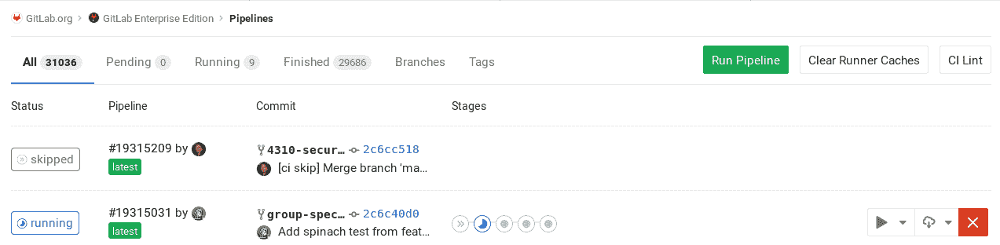

# Cache dependencies in GitLab CI/CD

> 原文：[https://docs.gitlab.com/ee/ci/caching/](https://docs.gitlab.com/ee/ci/caching/)

*   [Cache vs artifacts](#cache-vs-artifacts)
*   [Good caching practices](#good-caching-practices)
    *   [Sharing caches across the same branch](#sharing-caches-across-the-same-branch)
    *   [Sharing caches across different branches](#sharing-caches-across-different-branches)
    *   [Disabling cache on specific jobs](#disabling-cache-on-specific-jobs)
    *   [Inherit global config, but override specific settings per job](#inherit-global-config-but-override-specific-settings-per-job)
*   [Common use cases](#common-use-cases)
    *   [Caching Node.js dependencies](#caching-nodejs-dependencies)
    *   [Caching PHP dependencies](#caching-php-dependencies)
    *   [Caching Python dependencies](#caching-python-dependencies)
    *   [Caching Ruby dependencies](#caching-ruby-dependencies)
    *   [Caching Go dependencies](#caching-go-dependencies)
*   [Availability of the cache](#availability-of-the-cache)
    *   [Where the caches are stored](#where-the-caches-are-stored)
    *   [How archiving and extracting works](#how-archiving-and-extracting-works)
    *   [Cache mismatch](#cache-mismatch)
        *   [Examples](#examples)
*   [Clearing the cache](#clearing-the-cache)
    *   [Clearing the cache by changing `cache:key`](#clearing-the-cache-by-changing-cachekey)
    *   [Clearing the cache manually](#clearing-the-cache-manually)

# Cache dependencies in GitLab CI/CD[](#cache-dependencies-in-gitlab-cicd "Permalink")

GitLab CI / CD 提供了一种缓存机制，可用于在作业运行时节省时间.

缓存是指通过重用先前作业的相同内容来加快执行作业的时间. 当您开发依赖于在构建期间通过 Internet 获取的其他库的软件时，此功能特别有用.

如果启用了缓存，则默认情况下从 GitLab 9.0 开始，它在项目级别的管道和作业之间共享. 缓存不跨项目共享.

确保您阅读了[`cache`参考](../yaml/README.html#cache)以了解`.gitlab-ci.yml`定义.

## Cache vs artifacts[](#cache-vs-artifacts "Permalink")

**注意：**如果您使用缓存和工件在作业中存储相同的路径时要小心，因为在覆盖**工件**和内容**之前** ，将**还原缓存** .

不要使用缓存在阶段之间传递工件，因为缓存旨在存储编译项目所需的运行时依赖项：

*   `cache`: **用于存储项目依赖项**

    缓存用于通过存储下载的依赖项来加快后续作业在给定**管道中的**运行速度，这样就不必再次从 Internet 上获取它们（例如 npm 软件包，Go 供应商软件包等）.配置为在阶段之间传递中间构建结果，则应该使用工件来完成.

*   `artifacts`: **用于在阶段之间传递的阶段结果.**

    工件是由作业生成的文件，可以存储并上载，然后可以在**同一管道的**后续阶段中由作业获取和使用. 换句话说， [您不能在阶段 1 的 job-A 中创建工件，然后在阶段 1 的 job-B 中使用此工件](https://gitlab.com/gitlab-org/gitlab/-/issues/25837) . 此数据在不同的管道中将不可用，但可以从 UI 下载.

`artifacts`的名称听起来像是仅在工作之外有用，例如用于下载最终图像，但是人工制品也可以在管道的后期阶段使用. 因此，如果通过下载所有必需的模块来构建应用程序，则可能需要将它们声明为工件，以便后续阶段可以使用它们. 有一些优化措施，例如声明[到期时间，](../yaml/README.html#artifactsexpire_in)这样您就不会将工件保留太长时间，或者使用[依赖项](../yaml/README.html#dependencies)来控制哪些作业会获取工件.

Caches:

*   如果未全局定义或未按作业定义（使用`cache:` ：），则禁用该功能.
*   如果全局启用，则可用于`.gitlab-ci.yml`所有作业.
*   可以由创建缓存的同一作业在后续管道中使用（如果未全局定义）.
*   如果[启用了分布式缓存](https://docs.gitlab.com/runner/configuration/autoscale.html) ，则将它们存储在 Runner 安装的位置**并**上传到 S3.
*   如果按作业定义，则使用：
    *   通过后续管道中的相同作业.
    *   如果它们具有相同的依赖关系，则由同一管道中的后续作业组成.

Artifacts:

*   如果未按作业定义（使用`artifacts:` ：），则将其禁用.
*   只能针对每个作业启用，不能全局启用.
*   在管道中创建，并且可以被当前活动管道的后续作业使用.
*   始终上传到 GitLab（称为协调器）.
*   可以具有用于控制磁盘使用量的到期值（默认为 30 天）.

**注意：**工件和缓存均定义了相对于项目目录的路径，并且无法链接到其外部的文件.

## Good caching practices[](#good-caching-practices "Permalink")

We have the cache from the perspective of the developers (who consume a cache within the job) and the cache from the perspective of the Runner. Depending on which type of Runner you are using, cache can act differently.

从开发人员的角度来看，要确保高速缓存的最大可用性，在作业中声明`cache` ，请使用以下一项或多项：

*   [为跑步者](../runners/README.html#use-tags-to-limit-the-number-of-jobs-using-the-runner)添加标签，并在共享其缓存的作业上使用标签.
*   [使用](../runners/README.html#prevent-a-specific-runner-from-being-enabled-for-other-projects)仅适用于特定项目的[粘性运行器](../runners/README.html#prevent-a-specific-runner-from-being-enabled-for-other-projects) .
*   [使用](../yaml/README.html#cachekey)适合您的工作流[的`key`](../yaml/README.html#cachekey) （例如，每个分支上的不同缓存）. 为此，您可以利用[CI / CD 预定义变量](../variables/README.html#predefined-environment-variables) .

**提示：**在管道中使用相同的 Runner 是在一个阶段或管道中缓存文件，并以有保证的方式将该缓存传递到后续阶段或管道的最简单，最有效的方法.

从 Runner 的角度来看，为了使缓存有效运行，必须满足以下条件之一：

*   为您的所有工作使用一个赛跑者.
*   使用多个使用[分布式缓存的](https://docs.gitlab.com/runner/configuration/autoscale.html) Runner（无论是否处于自动缩放模式），这些[缓存](https://docs.gitlab.com/runner/configuration/autoscale.html)将缓存存储在 S3 存储桶中（例如 GitLab.com 上的共享 Runner）.
*   使用具有相同体系结构的多个运行程序（不在自动伸缩模式下）共享公共网络安装目录（使用 NFS 或类似方式），以存储缓存.

**提示：**了解[缓存](#availability-of-the-cache)的[可用性，](#availability-of-the-cache)以了解有关内部的更多信息，并更好地了解缓存的工作方式.

### Sharing caches across the same branch[](#sharing-caches-across-the-same-branch "Permalink")

使用`key: ${CI_COMMIT_REF_SLUG}`定义一个缓存，以便每个分支的作业始终使用相同的缓存：

```
cache:
  key: ${CI_COMMIT_REF_SLUG} 
```

尽管这似乎可以防止意外覆盖缓存，但是这意味着合并请求的第一个流水线很慢，这可能会给开发人员带来糟糕的体验. 下次将新提交推送到分支时，将重新使用缓存.

To enable per-job and per-branch caching:

```
cache:
  key: "$CI_JOB_NAME-$CI_COMMIT_REF_SLUG" 
```

要启用每个分支和每个阶段的缓存：

```
cache:
  key: "$CI_JOB_STAGE-$CI_COMMIT_REF_SLUG" 
```

### Sharing caches across different branches[](#sharing-caches-across-different-branches "Permalink")

如果要缓存的文件需要在所有分支和所有作业之间共享，则可以对所有这些文件使用相同的密钥：

```
cache:
  key: one-key-to-rule-them-all 
```

要在分支之间共享相同的缓存，但按作业将它们分开：

```
cache:
  key: ${CI_JOB_NAME} 
```

### Disabling cache on specific jobs[](#disabling-cache-on-specific-jobs "Permalink")

如果已全局定义了缓存，则意味着每个作业将使用相同的定义. 您可以按工作覆盖此行为，如果要完全禁用它，请使用空哈希：

```
job:
  cache: {} 
```

### Inherit global config, but override specific settings per job[](#inherit-global-config-but-override-specific-settings-per-job "Permalink")

您可以使用[定位符](../yaml/README.html#anchors)覆盖缓存设置，而无需覆盖全局缓存. 例如，如果要覆盖一项作业的`policy` ：

```
cache: &global_cache
    key: ${CI_COMMIT_REF_SLUG}
    paths:
      - node_modules/
      - public/
      - vendor/
    policy: pull-push

job:
  cache:
    # inherit all global cache settings
    <<: *global_cache
    # override the policy
    policy: pull 
```

要进行更精细的调整，还请阅读有关[`cache: policy`](../yaml/README.html#cachepolicy) .

## Common use cases[](#common-use-cases "Permalink")

缓存最常见的用例是在后续作业之间保留内容，以用于诸如依赖项和常用库（Node.js 包，PHP 包，rubygems，Python 库等）之类的东西，因此不必从公共互联网重新获取.

**注意：**有关更多示例，请查看我们的[GitLab CI / CD 模板](https://gitlab.com/gitlab-org/gitlab/tree/master/lib/gitlab/ci/templates) .

### Caching Node.js dependencies[](#caching-nodejs-dependencies "Permalink")

假设您的项目正在使用[npm](https://s0www0npmjs0com.icopy.site/)安装 Node.js 依赖项，下面的示例将全局定义`cache` ，以便所有作业都继承它. 默认情况下，npm 将缓存数据存储在主文件夹`~/.npm`但是由于[您无法缓存项目目录之外的内容](../yaml/README.html#cachepaths) ，因此我们告诉 npm 使用`./.npm` ，它按分支缓存：

```
#
# https://gitlab.com/gitlab-org/gitlab/tree/master/lib/gitlab/ci/templates/Nodejs.gitlab-ci.yml
#
image: node:latest

# Cache modules in between jobs
cache:
  key: ${CI_COMMIT_REF_SLUG}
  paths:
    - .npm/

before_script:
  - npm ci --cache .npm --prefer-offline

test_async:
  script:
    - node ./specs/start.js ./specs/async.spec.js 
```

### Caching PHP dependencies[](#caching-php-dependencies "Permalink")

假设您的项目正在使用[Composer](https://s0getcomposer0org.icopy.site/)安装 PHP 依赖项，下面的示例将全局定义`cache` ，以便所有作业都继承它. PHP 库模块安装在`vendor/`并按分支缓存：

```
#
# https://gitlab.com/gitlab-org/gitlab/tree/master/lib/gitlab/ci/templates/PHP.gitlab-ci.yml
#
image: php:7.2

# Cache libraries in between jobs
cache:
  key: ${CI_COMMIT_REF_SLUG}
  paths:
    - vendor/

before_script:
  # Install and run Composer
  - curl --show-error --silent https://getcomposer.org/installer | php
  - php composer.phar install

test:
  script:
    - vendor/bin/phpunit --configuration phpunit.xml --coverage-text --colors=never 
```

### Caching Python dependencies[](#caching-python-dependencies "Permalink")

假设您的项目正在使用[pip](https://pip.pypa.io/en/stable/)安装 Python 依赖项，以下示例将全局定义`cache` ，以便所有作业都继承它. Python 库安装在`venv/`下的虚拟环境中，pip 的缓存在`.cache/pip/`下定义，并且两者均按分支缓存：

```
#
# https://gitlab.com/gitlab-org/gitlab/tree/master/lib/gitlab/ci/templates/Python.gitlab-ci.yml
#
image: python:latest

# Change pip's cache directory to be inside the project directory since we can
# only cache local items.
variables:
    PIP_CACHE_DIR: "$CI_PROJECT_DIR/.cache/pip"

# Pip's cache doesn't store the python packages
# https://pip.pypa.io/en/stable/reference/pip_install/#caching
#
# If you want to also cache the installed packages, you have to install
# them in a virtualenv and cache it as well.
cache:
  paths:
    - .cache/pip
    - venv/

before_script:
  - python -V               # Print out python version for debugging
  - pip install virtualenv
  - virtualenv venv
  - source venv/bin/activate

test:
  script:
    - python setup.py test
    - pip install flake8
    - flake8 . 
```

### Caching Ruby dependencies[](#caching-ruby-dependencies "Permalink")

假设您的项目正在使用[Bundler](https://bundler.io)安装 gem 依赖项，以下示例将全局定义`cache` ，以便所有作业都继承它. 宝石安装在`vendor/ruby/`并按分支缓存：

```
#
# https://gitlab.com/gitlab-org/gitlab/tree/master/lib/gitlab/ci/templates/Ruby.gitlab-ci.yml
#
image: ruby:2.6

# Cache gems in between builds
cache:
  key: ${CI_COMMIT_REF_SLUG}
  paths:
    - vendor/ruby

before_script:
  - ruby -v                                        # Print out ruby version for debugging
  - bundle install -j $(nproc) --path vendor/ruby  # Install dependencies into ./vendor/ruby

rspec:
  script:
    - rspec spec 
```

### Caching Go dependencies[](#caching-go-dependencies "Permalink")

假设您的项目正在使用[Go Modules](https://github.com/golang/go/wiki/Modules)安装 Go 依赖项，以下示例在`go-cache`模板中定义了`cache` ，任何作业都可以扩展. Go 模块安装在`${GOPATH}/pkg/mod/` ，并为所有`go`项目缓存：

```
.go-cache:
  variables:
    GOPATH: $CI_PROJECT_DIR/.go
  before_script:
    - mkdir -p .go
  cache:
    paths:
      - .go/pkg/mod/

test:
  image: golang:1.13
  extends: .go-cache
  script:
    - go test ./... -v -short 
```

## Availability of the cache[](#availability-of-the-cache "Permalink")

缓存是一种优化，但不能保证始终有效，因此您需要准备好在需要它们的每个作业中重新生成所有缓存的文件.

假设您已根据工作流程[在`.gitlab-ci.yml`](../yaml/README.html#cache)正确[定义了`cache`](../yaml/README.html#cache) ，则缓存的可用性最终取决于 Runner 的配置方式（执行程序类型以及是否使用不同的 Runner 在作业之间传递缓存）.

### Where the caches are stored[](#where-the-caches-are-stored "Permalink")

由于亚军是一个负责存储的缓存，这是必须要知道它的存储**位置** . 在`.gitlab-ci.yml`中的作业下定义的所有缓存路径都存储在单个`cache.zip`文件中，并存储在 Runner 的配置缓存位置中. 默认情况下，它们存储在本地安装了 Runner 的计算机中，具体取决于执行程序的类型.

| GitLab Runner 执行器 | 缓存的默认路径 |
| --- | --- |
| [Shell](https://docs.gitlab.com/runner/executors/shell.html) | 在本地，存储在`gitlab-runner`用户的主目录下： `/home/gitlab-runner/cache/<user>/<project>/<cache-key>/cache.zip` home/ `gitlab-runner` user>/< `gitlab-runner` < `gitlab-runner` `/home/gitlab-runner/cache/<user>/<project>/<cache-key>/cache.zip` . |
| [Docker](https://docs.gitlab.com/runner/executors/docker.html) | 在本地存储在[Docker 卷下](https://docs.gitlab.com/runner/executors/docker.html) ：/ `/var/lib/docker/volumes/<volume-id>/_data/<user>/<project>/<cache-key>/cache.zip` [docker / volumes / <卷](https://docs.gitlab.com/runner/executors/docker.html) `/var/lib/docker/volumes/<volume-id>/_data/<user>/<project>/<cache-key>/cache.zip` _ `/var/lib/docker/volumes/<volume-id>/_data/<user>/<project>/<cache-key>/cache.zip` . |
| [Docker 机器](https://docs.gitlab.com/runner/executors/docker_machine.html) （自动缩放赛跑者） | 行为与 Docker 执行器相同. |

### How archiving and extracting works[](#how-archiving-and-extracting-works "Permalink")

在最简单的情况下，请考虑仅使用一台安装了 Runner 的计算机，并且项目的所有作业都在同一主机上运行.

让我们看下面两个属于两个连续阶段的作业的示例：

```
stages:
  - build
  - test

before_script:
  - echo "Hello"

job A:
  stage: build
  script:
    - mkdir vendor/
    - echo "build" > vendor/hello.txt
  cache:
    key: build-cache
    paths:
      - vendor/
  after_script:
    - echo "World"

job B:
  stage: test
  script:
    - cat vendor/hello.txt
  cache:
    key: build-cache 
```

这是幕后发生的事情：

1.  管道开始.
2.  `job A` runs.
3.  执行`before_script` .
4.  `script`已执行.
5.  `after_script`被执行.
6.  `cache`运行，并且`vendor/`目录被压缩到`cache.zip` . 然后根据[Runner 的设置](#where-the-caches-are-stored)和`cache: key`将该文件保存在目录中.
7.  `job B` runs.
8.  提取缓存（如果找到）.
9.  执行`before_script` .
10.  `script`已执行.
11.  管道完成.

通过在单台计算机上使用单个 Runner，就不会出现`job B`可能在不同于`job A`的 Runner 上执行的问题，从而保证了各个阶段之间的缓存. 仅当构建在同一 Runner /机器上从阶段`build`到`test` ，此方法才有效，否则，您[可能没有可用的缓存](#cache-mismatch) .

在缓存过程中，还需要考虑以下几点：

*   如果具有其他缓存配置的某些其他作业已将其缓存保存在同一 zip 文件中，则它将被覆盖. 如果使用了基于 S3 的共享缓存，则还会根据缓存密钥将文件另外上传到 S3 到对象. 因此，路径不同但缓存键相同的两个作业将覆盖其缓存.
*   从`cache.zip`提取缓存时，zip 文件中的所有内容都提取到作业的工作目录（通常是下拉的存储库）中，并且 Runner 不在乎`job A`的存档是否覆盖了`job B`

之所以以这种方式工作，是因为为一个 Runner 创建的缓存通常在由可以在**不同体系结构**上运行的缓存使用时才无效（例如，当缓存包含二进制文件时）. 而且由于不同的步骤可能由运行在不同计算机上的运行程序执行，因此这是安全的默认设置.

### Cache mismatch[](#cache-mismatch "Permalink")

在下表中，您可以看到可能导致缓存不匹配的一些原因以及一些解决方法.

| 缓存不匹配的原因 | 如何修复 |
| --- | --- |
| 您使用多个独立运行器（不在自动缩放模式下）附加到一个项目，而没有共享缓存 | 您的项目仅使用一个 Runner 或使用启用了分布式缓存的多个 Runner |
| 您在未启用分布式缓存的自动缩放模式下使用 Runners | 配置自动缩放运行器以使用分布式缓存 |
| 安装了 Runner 的计算机磁盘空间不足，或者，如果设置了分布式缓存，则存储缓存的 S3 存储桶空间不足 | 确保清除一些空间以允许存储新的缓存. 当前，没有自动的方法可以做到这一点. |
| 对于作业中缓存不同路径的作业，请使用相同的`key` . | Use different cache keys to that the cache archive is stored to a different location and doesn’t overwrite wrong caches. |

让我们探索一些例子.

#### Examples[](#examples "Permalink")

假设您只为项目分配了一个 Runner，因此默认情况下缓存将存储在 Runner 的计算机中. 如果两个作业 A 和 B 具有相同的缓存密钥，但是它们缓存不同的路径，则即使它们的`paths`不匹配，缓存 B 也会覆盖缓存 A：

当管道第二次运行时，我们希望`job A`和`job B`重用其缓存.

```
stages:
  - build
  - test

job A:
  stage: build
  script: make build
  cache:
    key: same-key
    paths:
      - public/

job B:
  stage: test
  script: make test
  cache:
    key: same-key
    paths:
      - vendor/ 
```

1.  `job A` runs.
2.  `public/`作为 cache.zip 缓存.
3.  `job B` runs.
4.  先前的缓存（如果有）已解压缩.
5.  `vendor/`作为 cache.zip 缓存，并覆盖前一个.
6.  下次`job A`运行时，它将使用`job B`的缓存，缓存不同，因此无效.

要解决此问题，请为每个作业使用不同的`keys` .

在另一种情况下，假设您为项目分配了多个运行器，但是未启用分布式缓存. 第二次运行管道时，我们希望`job A`和`job B`重用其缓存（在这种情况下将有所不同）：

```
stages:
  - build
  - test

job A:
  stage: build
  script: build
  cache:
    key: keyA
    paths:
      - vendor/

job B:
  stage: test
  script: test
  cache:
    key: keyB
    paths:
      - vendor/ 
```

在这种情况下，即使`key`不同（不必担心覆盖），如果作业在后续管道中的不同运行器上运行，您也可能会在每个阶段之前"清理"缓存的文件.

## Clearing the cache[](#clearing-the-cache "Permalink")

GitLab Runners 使用[缓存](../yaml/README.html#cache)通过重用现有数据来加快作业的执行速度. 但是，这有时可能导致行为不一致.

要从缓存的新副本开始，有两种方法可以做到这一点.

### Clearing the cache by changing `cache:key`[](#clearing-the-cache-by-changing-cachekey "Permalink")

您所需要做的就是设置一个新的`cache: key` `.gitlab-ci.yml` . 在下一个管道运行中，缓存将存储在其他位置.

### Clearing the cache manually[](#clearing-the-cache-manually "Permalink")

在 GitLab 10.4 中[引入](https://gitlab.com/gitlab-org/gitlab-foss/-/issues/41249) .

如果要避免编辑`.gitlab-ci.yml` ，则可以通过 GitLab 的 UI 轻松清除缓存：

1.  导航到项目的**CI / CD>管道**页面.
2.  单击" **清除流道缓存"**按钮以清理缓存.

    [](img/clear_runners_cache.png)

3.  在下一次推送时，您的 CI / CD 作业将使用新的缓存.

在后台，这可以通过在数据库中增加一个计数器来实现，该计数器的值用于通过将整数附加到`-1` ， `-2`等来为高速缓存创建密钥.密钥已生成，旧的缓存不再有效.