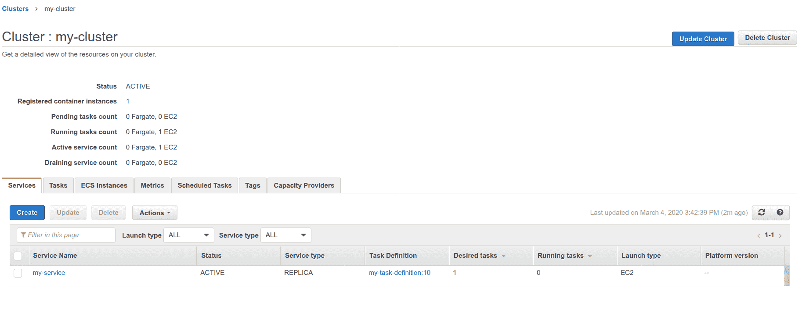

# Cloud deployment

> 原文：[https://docs.gitlab.com/ee/ci/cloud_deployment/](https://docs.gitlab.com/ee/ci/cloud_deployment/)

*   [AWS](#aws)
    *   [Run AWS commands from GitLab CI/CD](#run-aws-commands-from-gitlab-cicd)
    *   [Use an AWS Elastic Container Registry (ECR) image in your CI/CD](#use-an-aws-elastic-container-registry-ecr-image-in-your-cicd)
    *   [Deploy your application to the AWS Elastic Container Service (ECS)](#deploy-your-application-to-the-aws-elastic-container-service-ecs)

# Cloud deployment[](#cloud-deployment "Permalink")

与主要的云提供商进行交互可能已成为交付过程中非常需要的任务. GitLab 通过提供预安装了所需库和工具的 Docker 映像，减轻了这一过程的麻烦. 通过在 CI / CD 管道中引用它们，您将能够更轻松地与所选的云提供商进行交互.

## AWS[](#aws "Permalink")

GitLab 提供了可用于[从 GitLab CI / CD 运行 AWS 命令的](#run-aws-commands-from-gitlab-cicd) Docker 映像，并提供了一个模板，以使其更易于[部署到 AWS](#deploy-your-application-to-the-aws-elastic-container-service-ecs) .

### Run AWS commands from GitLab CI/CD[](#run-aws-commands-from-gitlab-cicd "Permalink")

在 GitLab 12.6 中[引入](https://gitlab.com/gitlab-org/gitlab/-/issues/31167) .

GitLab 的 AWS Docker 映像提供了[AWS Command Line Interface](https://aws.amazon.com/cli/) ，可让您运行`aws`命令. 作为部署策略的一部分，您可以通过指定[GitLab 的 AWS Docker 映像](https://gitlab.com/gitlab-org/cloud-deploy)直接从`.gitlab-ci.yml`运行`aws`命令.

需要一些凭据才能运行`aws`命令：

1.  如果您还没有[一个 AWS 账户](https://docs.aws.amazon.com/IAM/latest/UserGuide/getting-set-up.html) ，请注册一个.
2.  登录到控制台并创建[一个新的 IAM 用户](https://console.aws.amazon.com/iam/home#/home) .
3.  选择您新创建的用户以访问其详细信息. 导航到**安全凭证>创建新的访问密钥** .

    **注意：**将生成新的**访问密钥 ID**和**秘密访问密钥**对. 请立即记录下来.
4.  在您的 GitLab 项目中，转到**"设置">" CI / CD"** . 将以下内容设置为[环境变量](../variables/README.html#gitlab-cicd-environment-variables) （请参见下表）：

    *   访问密钥 ID.
    *   秘密访问密钥.
    *   地区代码. 您可以检查[AWS 区域终端节点列表](https://docs.aws.amazon.com/general/latest/gr/rande.html#regional-endpoints) . 您可能想要检查要使用的 AWS 服务[在所选区域中](https://aws.amazon.com/about-aws/global-infrastructure/regional-product-services/)是否[可用](https://aws.amazon.com/about-aws/global-infrastructure/regional-product-services/) .

    | 环保 变量名 | Value |
    | --- | --- |
    | `AWS_ACCESS_KEY_ID` | 您的访问密钥 ID |
    | `AWS_SECRET_ACCESS_KEY` | 您的秘密访问密钥 |
    | `AWS_DEFAULT_REGION` | 您的地区代码 |

5.  现在，您可以在此项目的`.gitlab-ci.yml`文件中使用`aws`命令：

    ```
    deploy:
      stage: deploy
      image: registry.gitlab.com/gitlab-org/cloud-deploy/aws-base:latest # see the note below
      script:
        - aws s3 ...
        - aws create-deployment ... 
    ```

    **注意：**上例中使用的映像（ `registry.gitlab.com/gitlab-org/cloud-deploy/aws-base:latest` ）托管在[GitLab 容器注册表中](../../user/packages/container_registry/index.html) ，可以使用. 或者，将映像替换为 AWS ECR 上托管的映像.

### Use an AWS Elastic Container Registry (ECR) image in your CI/CD[](#use-an-aws-elastic-container-registry-ecr-image-in-your-cicd "Permalink")

除了引用托管在 GitLab 注册表上的映像外，您还可以引用托管在任何第三方注册表上的映像，例如[Amazon Elastic Container Registry（ECR）](https://aws.amazon.com/ecr/) .

为此， [将映像推送到 ECR 存储库中](https://docs.aws.amazon.com/AmazonECR/latest/userguide/docker-push-ecr-image.html) . 然后在`.gitlab-ci.yml`文件中引用它，并替换`image`路径以指向您的 ECR 图像.

### Deploy your application to the AWS Elastic Container Service (ECS)[](#deploy-your-application-to-the-aws-elastic-container-service-ecs "Permalink")

在 GitLab 12.9 中[引入](https://gitlab.com/gitlab-org/gitlab/-/issues/207962) .

GitLab 提供了一系列[CI 模板，您可以将其包含在项目中](../yaml/README.html#include) . 要自动将应用程序部署到[Amazon Elastic Container Service](https://aws.amazon.com/ecs/) （AWS ECS）集群，您可以在`.gitlab-ci.yml`文件中`include` `Deploy-ECS.gitlab-ci.yml`模板.

GitLab 还提供了可在您的`gitlab-ci.yml`文件中使用的[Docker 映像](https://gitlab.com/gitlab-org/cloud-deploy/-/tree/master/aws) ，以简化使用 AWS 的工作：

*   使用`registry.gitlab.com/gitlab-org/cloud-deploy/aws-base:latest`以使用 AWS CLI 命令.
*   使用`registry.gitlab.com/gitlab-org/cloud-deploy/aws-ecs:latest`将您的应用程序部署到 AWS ECS.

在开始此过程之前，您需要 AWS ECS 上的集群以及相关组件，例如 ECS 服务，ECS 任务定义，AWS RDS 上的数据库等. [了解有关 AWS ECS 的更多信息](https://docs.aws.amazon.com/AmazonECS/latest/developerguide/Welcome.html) .

在 AWS ECS 上完成所有设置后，请执行以下步骤：

1.  确保将您的 AWS 凭证设置为项目的环境变量. 您可以按照[上述步骤](#run-aws-commands-from-gitlab-cicd)完成此设置.
2.  Add these variables to your project’s `.gitlab-ci.yml` file:

    ```
    variables:
      CI_AWS_ECS_CLUSTER: my-cluster
      CI_AWS_ECS_SERVICE: my-service
      CI_AWS_ECS_TASK_DEFINITION: my-task-definition 
    ```

    Three variables are defined in this snippet:

    *   `CI_AWS_ECS_CLUSTER` ：您要为部署目标的 AWS ECS 集群的名称.
    *   `CI_AWS_ECS_SERVICE` ：绑定到您的 AWS ECS 集群的目标服务的名称.
    *   `CI_AWS_ECS_TASK_DEFINITION` ：与上述服务绑定的任务定义的名称.

    您可以在[AWS ECS 仪表板上](https://console.aws.amazon.com/ecs/home)选择目标集群后找到这些名称：

    [](../img/ecs_dashboard_v12_9.png)

3.  将此模板包括在`.gitlab-ci.yml` ：

    ```
    include:
      - template: AWS/Deploy-ECS.gitlab-ci.yml 
    ```

    `Deploy-ECS`模板随 GitLab 一起提供[，](https://gitlab.com/gitlab-org/gitlab/-/blob/master/lib/gitlab/ci/templates/AWS/Deploy-ECS.gitlab-ci.yml)可[在 GitLab.com 上获得](https://gitlab.com/gitlab-org/gitlab/-/blob/master/lib/gitlab/ci/templates/AWS/Deploy-ECS.gitlab-ci.yml) .

4.  提交更新的`.gitlab-ci.yml`并将其推送到项目的存储库中，您就完成了！

    您的应用程序 Docker 映像将被重建并推送到 GitLab 注册表中. 然后，目标任务定义将使用新 Docker 映像的位置进行更新，结果将在 ECS 中创建新的修订版.

    最后，您的 AWS ECS 服务将使用任务定义的新修订版进行更新，从而使群集提取应用程序的最新版本.

**警告：** [`Deploy-ECS.gitlab-ci.yml`](https://gitlab.com/gitlab-org/gitlab/-/blob/master/lib/gitlab/ci/templates/AWS/Deploy-ECS.gitlab-ci.yml)模板包括[`Jobs/Build.gitlab-ci.yml`](https://gitlab.com/gitlab-org/gitlab/-/blob/master/lib/gitlab/ci/templates/Jobs/Build.gitlab-ci.yml)和[`Jobs/Deploy/ECS.gitlab-ci.yml`](https://gitlab.com/gitlab-org/gitlab/-/blob/master/lib/gitlab/ci/templates/Jobs/Deploy/ECS.gitlab-ci.yml) "子模板". 不要单独包括这些"子模板"，而仅包括主`Deploy-ECS.gitlab-ci.yml`模板. "子模板"旨在仅与主模板一起使用. 如果不包括主模板，它们可能会移动或发生意外更改，从而导致您的管道失败. 此外，这些模板中的作业名称可能会更改. 不要在您自己的管道中覆盖这些作业的名称，因为当名称更改时，覆盖将停止工作.

另外，如果您不希望使用`Deploy-ECS.gitlab-ci.yml`模板部署到 AWS ECS，则始终可以使用基于`aws-base` Docker 映像[为 ECS](https://docs.aws.amazon.com/cli/latest/reference/ecs/index.html#cli-aws-ecs)运行您自己的[AWS CLI 命令](https://docs.aws.amazon.com/cli/latest/reference/ecs/index.html#cli-aws-ecs) .

```
deploy:
  stage: deploy
  image: registry.gitlab.com/gitlab-org/cloud-deploy/aws-base:latest
  script:
    - aws ecs register-task-definition ... 
```