# Environments and deployments

> 原文：[https://docs.gitlab.com/ee/ci/environments/](https://docs.gitlab.com/ee/ci/environments/)

*   [Introduction](#introduction)
*   [Configuring environments](#configuring-environments)
    *   [Defining environments](#defining-environments)
        *   [Environment variables and Runner](#environment-variables-and-runner)
        *   [Set dynamic environment URLs after a job finishes](#set-dynamic-environment-urls-after-a-job-finishes)
            *   [Example of setting dynamic environment URLs](#example-of-setting-dynamic-environment-urls)
    *   [Configuring manual deployments](#configuring-manual-deployments)
    *   [Configuring dynamic environments](#configuring-dynamic-environments)
        *   [Allowed variables](#allowed-variables)
        *   [Example configuration](#example-configuration)
    *   [Configuring Kubernetes deployments](#configuring-kubernetes-deployments)
        *   [Configuring incremental rollouts](#configuring-incremental-rollouts)
    *   [Deployment safety](#deployment-safety)
    *   [Complete example](#complete-example)
    *   [Protected environments](#protected-environments)
*   [Working with environments](#working-with-environments)
    *   [Viewing environments and deployments](#viewing-environments-and-deployments)
    *   [Viewing deployment history](#viewing-deployment-history)
    *   [Retrying and rolling back](#retrying-and-rolling-back)
        *   [What to expect with a rollback](#what-to-expect-with-a-rollback)
    *   [Using the environment URL](#using-the-environment-url)
        *   [Going from source files to public pages](#going-from-source-files-to-public-pages)
    *   [Stopping an environment](#stopping-an-environment)
        *   [Automatically stopping an environment](#automatically-stopping-an-environment)
        *   [Environments auto-stop](#environments-auto-stop)
            *   [Auto-stop example](#auto-stop-example)
        *   [Delete a stopped environment](#delete-a-stopped-environment)
            *   [Delete environments through the UI](#delete-environments-through-the-ui)
            *   [Delete environments through the API](#delete-environments-through-the-api)
    *   [Prepare an environment](#prepare-an-environment)
    *   [Grouping similar environments](#grouping-similar-environments)
    *   [Monitoring environments](#monitoring-environments)
        *   [Embedding metrics in GitLab Flavored Markdown](#embedding-metrics-in-gitlab-flavored-markdown)
    *   [Web terminals](#web-terminals)
    *   [Check out deployments locally](#check-out-deployments-locally)
    *   [Scoping environments with specs](#scoping-environments-with-specs)
    *   [Environments Dashboard](#environments-dashboard-premium)
*   [Limitations](#limitations)
*   [Further reading](#further-reading)

# Environments and deployments[](#environments-and-deployments "Permalink")

在 GitLab 8.9 中引入.

环境允许您在 GitLab 中控制软件的连续部署.

## Introduction[](#introduction "Permalink")

在准备将软件投入大众使用之前，软件开发过程需要许多阶段.

例如：

1.  开发代码.
2.  测试您的代码.
3.  在将代码发布给公众之前，请将其部署到测试或暂存环境中.

This helps find bugs in your software, and also in the deployment process as well.

GitLab CI / CD 不仅能够测试或构建您的项目，而且还可以在基础架构中部署它们，并具有给您提供一种跟踪部署的方式的额外好处. 换句话说，您将始终知道服务器上当前正在部署或已经部署了什么.

重要的是要知道：

*   环境就像您的 CI 作业的标签一样，描述了代码的部署位置.
*   [作业](../yaml/README.html#introduction)是在[作业](../yaml/README.html#introduction)将代码版本部署到环境时创建的，因此每个环境可以有一个或多个部署.

GitLab:

*   提供每种环境的完整部署历史记录.
*   跟踪您的部署，因此您始终知道服务器上当前正在部署什么.

如果您有与项目关联的部署服务（例如[Kubernetes）](../../user/project/clusters/index.html) ，则可以使用它来协助您的部署，甚至可以从 GitLab 中访问您环境的[Web 终端](#web-terminals) ！

## Configuring environments[](#configuring-environments "Permalink")

配置环境涉及：

1.  了解[管道的](../pipelines/index.html)工作方式.
2.  在项目的[`.gitlab-ci.yml`](../yaml/README.html)文件中定义环境.
3.  创建配置为部署您的应用程序的作业. 例如，配置了[`environment`](../yaml/README.html#environment)的部署作业将您的应用程序部署到[Kubernetes 集群](../../user/project/clusters/index.html) .

本节的其余部分说明了如何使用示例方案配置环境和部署. 假设您已经：

*   在 GitLab 中创建了一个[项目](../../gitlab-basics/create-project.html) .
*   设置[亚军](../runners/README.html) .

在方案中：

*   我们正在开发一个应用程序.
*   我们想运行测试并在所有分支上构建我们的应用程序.
*   我们的默认分支是`master` .
*   We deploy the app only when a pipeline on `master` branch is run.

### Defining environments[](#defining-environments "Permalink")

让我们考虑以下`.gitlab-ci.yml`示例：

```
stages:
  - test
  - build
  - deploy

test:
  stage: test
  script: echo "Running tests"

build:
  stage: build
  script: echo "Building the app"

deploy_staging:
  stage: deploy
  script:
    - echo "Deploy to staging server"
  environment:
    name: staging
    url: https://staging.example.com
  only:
    - master 
```

我们定义了三个[阶段](../yaml/README.html#stages) ：

*   `test`
*   `build`
*   `deploy`

分配给这些阶段的作业将按此顺序运行. 如果任何作业失败，则管道将失败，分配给下一阶段的作业将不会运行.

在我们的情况下：

*   `test`作业将首先运行.
*   然后是`build`作业.
*   最后， `deploy_staging`作业.

使用此配置，我们：

*   检查测试是否通过.
*   确保我们的应用程序能够成功构建.
*   最后，我们部署到登台服务器.

**注意：** `environment`关键字定义了应用程序的部署位置. 环境`name`和`url`在 GitLab 中的各个位置公开. 每次指定环境的作业成功执行时，都会记录部署，Git SHA 和环境名称.**注意：**环境名称中不允许使用某些字符. 仅使用字母，数字，空格和`-` ， `_` ， `/` ， `{` ， `}`或`.` . 另外，它不得以`/`开头或结尾.

总而言之，使用上述`.gitlab-ci.yml`我们已经实现了以下目标：

*   所有分支机构将运行`test`并`build`作业.
*   `deploy_staging`作业将[仅](../yaml/README.html#onlyexcept-basic)在`master`分支上运行，这意味着从分支创建的所有合并请求都不会部署到登台服务器.
*   合并请求合并后，所有作业将运行，并且`deploy_staging`作业会将我们的代码部署到登台服务器，而部署将记录在名为`staging`的环境中.

#### Environment variables and Runner[](#environment-variables-and-runner "Permalink")

从 GitLab 8.15 开始，环境名称以两种形式向 Runner 显示：

*   `$CI_ENVIRONMENT_NAME` . `.gitlab-ci.yml`给出的名称（扩展了所有变量）.
*   `$CI_ENVIRONMENT_SLUG` . 名称的"清理"版本，适用于 URL，DNS 等.

如果更改现有环境的名称，则：

*   `$CI_ENVIRONMENT_NAME`变量将使用新的环境名称进行更新.
*   `$CI_ENVIRONMENT_SLUG`变量将保持不变，以防止意外的副作用.

从 GitLab 9.3 开始，环境 URL 通过`$CI_ENVIRONMENT_URL`向 Runner `$CI_ENVIRONMENT_URL` . URL 可以从以下任意一个展开：

*   `.gitlab-ci.yml`.
*   如果未在`.gitlab-ci.yml`定义，则来自环境的外部 URL.

#### Set dynamic environment URLs after a job finishes[](#set-dynamic-environment-urls-after-a-job-finishes "Permalink")

在 GitLab 12.9 中[引入](https://gitlab.com/gitlab-org/gitlab/-/issues/17066) .

在作业脚本中，您可以指定静态[环境 URL](#using-the-environment-url) . 但是，有时可能需要动态 URL. 例如，如果您将 Review App 部署到一个外部托管服务，该服务会为每个部署生成一个随机 URL，例如`https://94dd65b.amazonaws.com/qa-lambda-1234567` ，则在部署脚本之前您不会知道该 URL 完成. 如果要在 GitLab 中使用环境 URL，则必须手动更新.

为了解决此问题，您可以配置部署作业以报告一组变量，包括由外部服务动态生成的 URL. GitLab 支持[dotenv（ `.env` ）](https://github.com/bkeepers/dotenv)文件格式，并使用`.env`文件中定义的变量扩展`environment:url`值.

要使用此功能，请在`.gitlab-ci.yml`指定[`artifacts:reports:dotenv`](../pipelines/job_artifacts.html#artifactsreportsdotenv)关键字.

有关概述，请参阅[在作业完成后设置动态 URL](https://youtu.be/70jDXtOf4Ig) .

##### Example of setting dynamic environment URLs[](#example-of-setting-dynamic-environment-urls "Permalink")

以下示例显示了一个 Review App，该 App 为每个合并请求创建一个新环境. 每次推送都会触发`review`作业，并创建或更新一个名为`review/your-branch-name` . 环境 URL 设置为`$DYNAMIC_ENVIRONMENT_URL` ：

```
review:
  script:
    - DYNAMIC_ENVIRONMENT_URL=$(deploy-script)                                 # In script, get the environment URL.
    - echo "DYNAMIC_ENVIRONMENT_URL=$DYNAMIC_ENVIRONMENT_URL" >> deploy.env    # Add the value to a dotenv file.
  artifacts:
    reports:
      dotenv: deploy.env                                                       # Report back dotenv file to rails.
  environment:
    name: review/$CI_COMMIT_REF_SLUG
    url: $DYNAMIC_ENVIRONMENT_URL                                              # and set the variable produced in script to `environment:url`
    on_stop: stop_review

stop_review:
  script:
    - ./teardown-environment
  when: manual
  environment:
    name: review/$CI_COMMIT_REF_SLUG
    action: stop 
```

`review`作业完成后，GitLab 会立即更新`review/your-branch-name`环境的 URL. 它解析`deploy.env`报告工件，将变量列表注册为在运行时创建的变量，并将其用于扩展`environment:url: $DYNAMIC_ENVIRONMENT_URL`并将其设置为环境 URL. 您还可以在`environment:url:`处指定 URL 的静态部分，例如`https://$DYNAMIC_ENVIRONMENT_URL` . 如果`DYNAMIC_ENVIRONMENT_URL`值为`example.com` ，则最终结果将为`https://example.com` .

[在 UI 中可以看到](#using-the-environment-url)为`review/your-branch-name`环境分配的 URL.

> **Notes:**
> 
> *   `stop_review`不会生成 dotenv 报告工件，因此不会识别`DYNAMIC_ENVIRONMENT_URL`变量. 因此，您不应在`stop_review`作业中设置`environment:url:` `stop_review`
> *   如果环境 URL 无效（例如，URL 格式错误），则系统不会更新环境 URL.

### Configuring manual deployments[](#configuring-manual-deployments "Permalink")

添加`when: manual`添加到自动执行的作业的配置会将其转换为需要手动操作的作业.

为了扩展[前面的示例](#defining-environments) ，以下内容包括另一个作业，该作业将我们的应用程序部署到生产服务器，并由`production`环境进行跟踪.

`.gitlab-ci.yml`文件如下：

```
stages:
  - test
  - build
  - deploy

test:
  stage: test
  script: echo "Running tests"

build:
  stage: build
  script: echo "Building the app"

deploy_staging:
  stage: deploy
  script:
    - echo "Deploy to staging server"
  environment:
    name: staging
    url: https://staging.example.com
  only:
    - master

deploy_prod:
  stage: deploy
  script:
    - echo "Deploy to production server"
  environment:
    name: production
    url: https://example.com
  when: manual
  only:
    - master 
```

The `when: manual` action:

*   在 GitLab 的用户界面中显示该作业的"播放"按钮.
*   意味着仅在单击"播放"按钮时才会触发`deploy_prod`作业.

您可以在管道，环境，部署和作业视图中找到"播放"按钮.

| View | Screenshot |
| --- | --- |
| Pipelines | [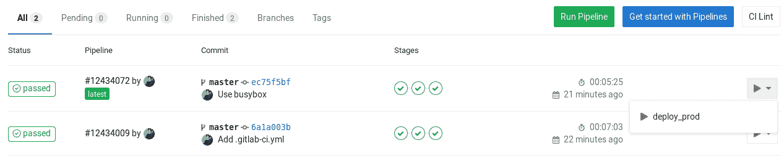](../img/environments_manual_action_pipelines.png) |
| 单管道 | [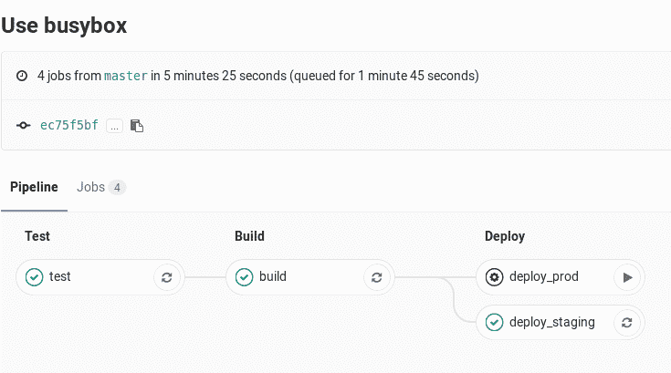](../img/environments_manual_action_single_pipeline.png) |
| Environments | [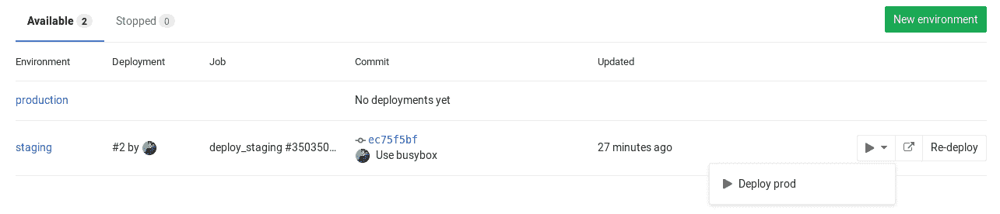](../img/environments_manual_action_environments.png) |
| Deployments | [](../img/environments_manual_action_deployments.png) |
| Jobs | [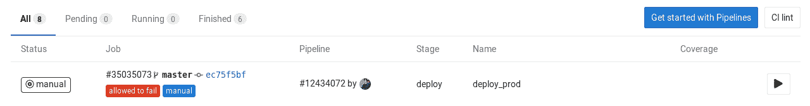](../img/environments_manual_action_jobs.png) |

在任何视图中单击播放按钮都将触发`deploy_prod`作业，并且部署将记录为名为`production`的新环境.

**注意：**如果您环境的名称是`production` （全部为小写），它将记录在[Value Stream Analytics 中](../../user/project/cycle_analytics.html) .

### Configuring dynamic environments[](#configuring-dynamic-environments "Permalink")

当部署到"稳定"的环境（例如分阶段或生产）时，常规环境会很好.

但是，对于`master`以外的分支环境，可以使用动态环境. 动态环境可以通过在`.gitlab-ci.yml`动态声明其名称来动态创建环境.

动态环境是[Review 应用程序](../review_apps/index.html)的基本组成部分.

#### Allowed variables[](#allowed-variables "Permalink")

动态环境的`name`和`url`参数可以使用大多数可用的 CI / CD 变量，包括：

*   [Predefined environment variables](../variables/README.html#predefined-environment-variables)
*   [Project and group variables](../variables/README.html#gitlab-cicd-environment-variables)
*   [`.gitlab-ci.yml` variables](../yaml/README.html#variables)

但是，不能使用定义的变量：

*   Under `script`.
*   在跑步者方面.

在`environment:name`上下文中还不支持其他变量. 有关更多信息，请参见[在哪里可以使用变量](../variables/where_variables_can_be_used.html) .

#### Example configuration[](#example-configuration "Permalink")

GitLab Runner 在作业运行时会公开各种[环境变量](../variables/README.html) ，因此您可以将它们用作环境名称.

在以下示例中，作业将部署到`master`以外的所有分支：

```
deploy_review:
  stage: deploy
  script:
    - echo "Deploy a review app"
  environment:
    name: review/$CI_COMMIT_REF_NAME
    url: https://$CI_ENVIRONMENT_SLUG.example.com
  only:
    - branches
  except:
    - master 
```

在此示例中：

*   作业的名称为`deploy_review` ，它在`deploy`阶段运行.
*   我们将`environment`设置为`environment` `environment:name`作为`review/$CI_COMMIT_REF_NAME` . 由于[环境名称](../yaml/README.html#environmentname)可以包含斜杠（ `/` ），因此我们可以使用此模式来区分动态环境和常规环境.
*   We tell the job to run [`only`](../yaml/README.html#onlyexcept-basic) on branches, [`except`](../yaml/README.html#onlyexcept-basic) `master`.

对于以下值：

*   `environment:name` ，第一部分是`review` ，后跟一个`/` ，然后是`$CI_COMMIT_REF_NAME` ，它接收分支名称的值.
*   `environment:url` ，我们希望每个分支都有一个特定且不同的 URL. `$CI_COMMIT_REF_NAME`可能包含`/`或其他在域名或 URL 中无效的字符，因此我们使用`$CI_ENVIRONMENT_SLUG`来确保获得有效的 URL.

    例如，给定`$CI_COMMIT_REF_NAME`为`100-Do-The-Thing` ，URL 将类似于`https://100-do-the-4f99a2.example.com` . 同样，设置 Web 服务器来满足这些请求的方式取决于您的设置.

    我们在这里使用了`$CI_ENVIRONMENT_SLUG` ，因为它保证是唯一的. 如果您使用的是[GitLab Flow 之](../../topics/gitlab_flow.html)类的工作[流程](../../topics/gitlab_flow.html) ，则冲突不太可能发生，并且您可能更希望环境名称与分支名称更紧密地[关联](../../topics/gitlab_flow.html) . 在这种情况下，您可以在上面的示例中的`environment:url`中使用`$CI_COMMIT_REF_NAME` ： `https://$CI_COMMIT_REF_NAME.example.com` ，其 URL 为`https://100-do-the-thing.example.com` .

**注意：**您不需要在动态环境的名称中使用相同的前缀或仅使用斜杠（ `/` ）. 但是，使用此格式将启用[类似环境分组](#grouping-similar-environments)功能.

### Configuring Kubernetes deployments[](#configuring-kubernetes-deployments "Permalink")

在 GitLab 12.6 中[引入](https://gitlab.com/gitlab-org/gitlab/-/issues/27630) .

如果要部署到与项目关联的[Kubernetes 集群](../../user/project/clusters/index.html) ，则可以从`gitlab-ci.yml`文件配置这些部署.

支持以下配置选项：

*   [`namespace`](https://kubernetes.io/docs/concepts/overview/working-with-objects/namespaces/)

在以下示例中，作业会将您的应用程序部署到`production` Kubernetes 命名空间.

```
deploy:
  stage: deploy
  script:
    - echo "Deploy to production server"
  environment:
    name: production
    url: https://example.com
    kubernetes:
      namespace: production
  only:
    - master 
```

使用 GitLab 的 Kubernetes 集成部署到 Kubernetes 集群时，有关集群和名称空间的信息将显示在部署作业页面上的作业跟踪上方：

[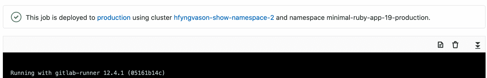](../img/environments_deployment_cluster_v12_8.png)

**注意：** [由 GitLab 管理的](../../user/project/clusters/index.html#gitlab-managed-clusters) Kubernetes 集群不支持 Kubernetes 配置. 要跟踪对 GitLab 管理的集群的支持进度，请参阅[相关问题](https://gitlab.com/gitlab-org/gitlab/-/issues/38054) .

#### Configuring incremental rollouts[](#configuring-incremental-rollouts "Permalink")

了解如何通过[增量部署](../environments/incremental_rollouts.html)仅对 Kubernetes Pod 的一部分发布生产更改.

### Deployment safety[](#deployment-safety "Permalink")

部署作业可能比管道中的其他作业更敏感，并且可能需要格外小心. GitLab 中有多个功能可帮助维护部署安全性和稳定性.

*   [Restrict write-access to a critical environment](deployment_safety.html#restrict-write-access-to-a-critical-environment)
*   [Limit the job-concurrency for deployment jobs](deployment_safety.html#ensure-only-one-deployment-job-runs-at-a-time)
*   [Skip outdated deployment jobs](deployment_safety.html#skip-outdated-deployment-jobs)
*   [Prevent deployments during deploy freeze windows](deployment_safety.html#prevent-deployments-during-deploy-freeze-windows)

### Complete example[](#complete-example "Permalink")

本节中的配置提供了完整的开发工作流程，其中您的应用程序是：

*   Tested.
*   Built.
*   部署为 Review App.
*   合并请求合并后，部署到登台服务器.
*   最后，能够手动部署到生产服务器.

以下内容结合了之前的配置示例，包括：

*   Defining [simple environments](#defining-environments) for testing, building, and deployment to staging.
*   添加[手动操作](#configuring-manual-deployments)以部署到生产中.
*   为部署创建[动态环境](#configuring-dynamic-environments)以供查看.

```
stages:
  - test
  - build
  - deploy

test:
  stage: test
  script: echo "Running tests"

build:
  stage: build
  script: echo "Building the app"

deploy_review:
  stage: deploy
  script:
    - echo "Deploy a review app"
  environment:
    name: review/$CI_COMMIT_REF_NAME
    url: https://$CI_ENVIRONMENT_SLUG.example.com
  only:
    - branches
  except:
    - master

deploy_staging:
  stage: deploy
  script:
    - echo "Deploy to staging server"
  environment:
    name: staging
    url: https://staging.example.com
  only:
    - master

deploy_prod:
  stage: deploy
  script:
    - echo "Deploy to production server"
  environment:
    name: production
    url: https://example.com
  when: manual
  only:
    - master 
```

一个更现实的示例还包括将文件复制到 Web 服务器（例如 NGINX）可以访问并为其提供服务的位置.

下面的示例将`public`目录复制到`/srv/nginx/$CI_COMMIT_REF_SLUG/public` ：

```
review_app:
  stage: deploy
  script:
    - rsync -av --delete public /srv/nginx/$CI_COMMIT_REF_SLUG
  environment:
    name: review/$CI_COMMIT_REF_NAME
    url: https://$CI_COMMIT_REF_SLUG.example.com 
```

此示例要求在要运行此作业的服务器上设置 NGINX 和 GitLab Runner.

**注意：**有关分支机构和 Review Apps 命名的一些极端情况，请参阅" [限制"](#limitations)部分.

完整的示例为开发人员提供了以下工作流程：

*   在本地创建分支.
*   进行更改并提交.
*   将分支推送到 GitLab.
*   创建一个合并请求.

在后台，GitLab Runner 将：

*   拾取更改并开始运行作业.
*   按`stages`定义顺序运行作业：
    *   首先，运行测试.
    *   如果测试成功，请构建应用程序.
    *   如果构建成功，则将应用程序部署到具有特定于分支机构名称的环境.

所以现在，每个分支：

*   获取自己的环境.
*   已部署到其自己的唯一位置，具有以下优点：
    *   有[部署历史](#viewing-deployment-history) .
    *   如果需要，能够[回滚更改](#retrying-and-rolling-back) .

有关更多信息，请参见[使用环境 URL](#using-the-environment-url) .

### Protected environments[](#protected-environments "Permalink")

可以对环境进行"保护"，限制对它们的访问.

有关更多信息，请参阅[受保护的环境](protected_environments.html) .

## Working with environments[](#working-with-environments "Permalink")

配置环境后，GitLab 将提供许多用于处理环境的功能，如下所述.

### Viewing environments and deployments[](#viewing-environments-and-deployments "Permalink")

每个项目的" **操作">"环境"**页面上都提供了环境和部署状态的列表.

例如：

[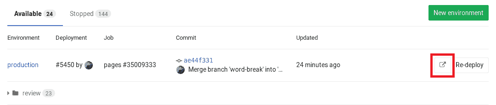](../img/environments_available.png)

此示例显示：

*   环境名称以及指向其部署的链接.
*   最后的部署 ID 号以及执行者.
*   上次部署的作业 ID 及其各自的作业名称.
*   上次部署的提交信息，例如谁提交了它，到哪个分支以及提交的 Git SHA.
*   上次部署的确切时间.
*   该按钮`.gitlab-ci.yml`您带到您在`.gitlab-ci.yml`的`environment`关键字下定义的 URL.
*   重新部署最新部署的按钮，这意味着它将运行由环境名称定义的特定提交的作业.

" **环境"**页面中显示的信息仅限于最新的部署，但是一个环境可以具有多个部署.

> **Notes:**
> 
> *   虽然您可以在 Web 界面中手动创建环境，但建议您首先在`.gitlab-ci.yml`定义环境. 首次部署后，将自动为您创建它们.
> *   只有具有[Reporter 权限](../../user/permissions.html#project-members-permissions)及以上[权限](../../user/permissions.html#project-members-permissions)的用户才能查看环境页面. 有关权限的更多信息，请参阅[权限文档](../../user/permissions.html) .
> *   只有在正确配置`.gitlab-ci.yml`之后发生的部署才会显示在" **环境"**和" **最后部署"**列表中.

### Viewing deployment history[](#viewing-deployment-history "Permalink")

GitLab keeps track of your deployments, so you:

*   始终知道服务器上当前正在部署什么.
*   可以具有每种环境的完整部署历史记录.

单击环境可显示其部署的历史记录. 这是具有多个部署的**环境**示例页面：

[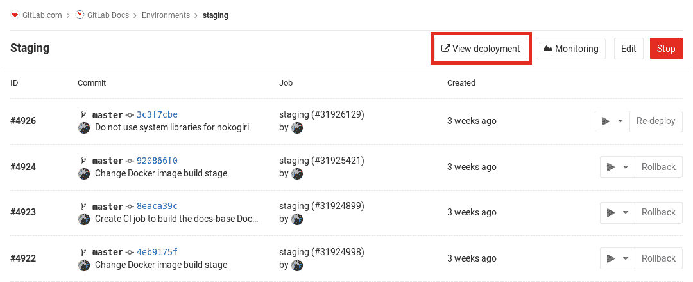](../img/deployments_view.png)

该视图类似于" **环境"**页面，但是显示了所有部署. 在此视图中，还有一个" **回滚"**按钮. 有关更多信息，请参阅[重试和回滚](#retrying-and-rolling-back) .

### Retrying and rolling back[](#retrying-and-rolling-back "Permalink")

如果部署存在问题，则可以重试或回滚.

要重试或回滚部署：

1.  导航到" **操作">"环境"** .
2.  单击环境.
3.  在环境的部署历史记录列表中，单击：
    *   最后部署旁边的" **重试"**按钮，以重试该部署.
    *   先前成功部署旁边的" **回滚"**按钮，以回滚到该部署.

#### What to expect with a rollback[](#what-to-expect-with-a-rollback "Permalink")

在特定提交上按**回滚**按钮将触发具有其自己的唯一作业 ID 的*新*部署.

这意味着您将看到一个新的部署，该部署指向您要回滚的提交.

**注意：**作业`script`定义的部署过程确定回滚是否成功.

### Using the environment URL[](#using-the-environment-url "Permalink")

[环境 URL](../yaml/README.html#environmenturl)在 GitLab 中的几个位置公开：

*   在合并请求小部件中作为链接： [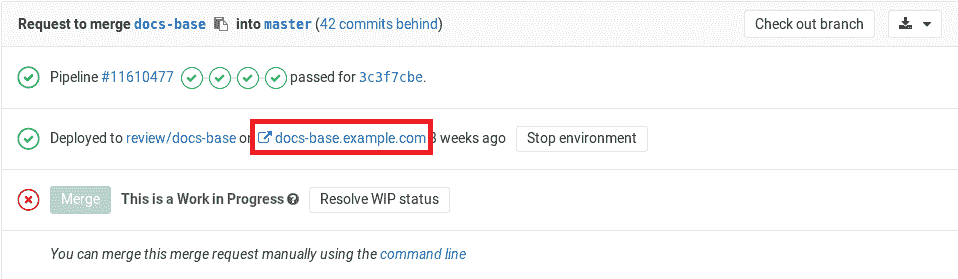](../img/environments_mr_review_app.png)
*   在"环境"视图中作为按钮： [](../img/environments_available.png)
*   在"部署"视图中作为按钮： [](../img/deployments_view.png)

在以下情况下，您可以在合并请求本身中看到此信息：

*   合并请求最终合并到默认分支（通常是`master` ）.
*   该分支还部署到环境（例如， `staging`或`production` ）.

例如：

[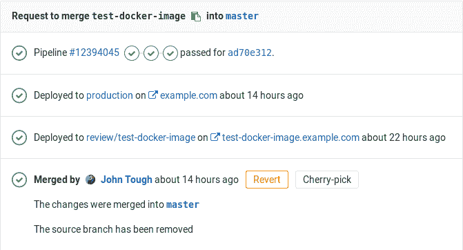](../img/environments_link_url_mr.png)

#### Going from source files to public pages[](#going-from-source-files-to-public-pages "Permalink")

使用 GitLab 的[路线图，](../review_apps/index.html#route-maps)您可以在为 Review Apps 设置的环境中直接从源文件转到公共页面.

### Stopping an environment[](#stopping-an-environment "Permalink")

停止环境：

*   将其从" **可用"**环境列表移至" [**环境"**页面](#viewing-environments-and-deployments)上的"已**停止"**环境列表.
*   执行[`on_stop`操作](../yaml/README.html#environmenton_stop) （如果已定义）.

当多个开发人员同时在一个项目上工作时，通常会使用此方法，每个开发人员都将推入自己的分支，从而创建了许多动态环境.

**注意：**从 GitLab 8.14 开始，删除动态环境的关联分支后，它们会自动停止.

#### Automatically stopping an environment[](#automatically-stopping-an-environment "Permalink")

可以使用特殊配置自动停止环境.

考虑以下示例，其中`deploy_review`作业调用`stop_review`清理并停止环境：

```
deploy_review:
  stage: deploy
  script:
    - echo "Deploy a review app"
  environment:
    name: review/$CI_COMMIT_REF_NAME
    url: https://$CI_ENVIRONMENT_SLUG.example.com
    on_stop: stop_review
  only:
    - branches
  except:
    - master

stop_review:
  stage: deploy
  variables:
    GIT_STRATEGY: none
  script:
    - echo "Remove review app"
  when: manual
  environment:
    name: review/$CI_COMMIT_REF_NAME
    action: stop 
```

设置[`GIT_STRATEGY`](../yaml/README.html#git-strategy)到`none`是必要的`stop_review`使各项工作[GitLab 亚军](https://docs.gitlab.com/runner/)不会尝试分支被删除后退房的代码.

当您的环境中定义了停止动作时（通常在该环境描述了 Review App 时），当关联的分支被删除时，GitLab 将自动触发停止动作. `stop_review`作业必须与`deploy_review`作业处于同一`stage` ，以便环境自动停止.

此外，两个作业都应具有匹配的[`rules`](../yaml/README.html#onlyexcept-basic)或[`only/except`](../yaml/README.html#onlyexcept-basic)配置[`only/except`](../yaml/README.html#onlyexcept-basic) . 在上面的示例中，如果配置不同，则`stop_review`作业可能不会包含在所有包含`deploy_review`作业的管道中，并且将无法触发该`action: stop`会自动停止环境.

您可以在[`.gitlab-ci.yml`参考中](../yaml/README.html#environmenton_stop)阅读更多[`.gitlab-ci.yml`](../yaml/README.html#environmenton_stop) .

#### Environments auto-stop[](#environments-auto-stop "Permalink")

在 GitLab 12.8 中[引入](https://gitlab.com/gitlab-org/gitlab/-/issues/20956) .

您可以设置环境的到期时间，并在一定时间后自动将其停止.

例如，考虑在 Review Apps 环境中使用此功能. 设置 Review Apps 时，有时它们会长时间运行，因为某些合并请求处于打开状态. 这种情况的一个示例是，由于优先级更改或决定采用其他方法而导致合并请求的作者未积极处理合并请求，而合并请求却被遗忘了. 空闲环境会浪费资源，因此应尽快终止它们.

要解决此问题，您可以为 Review Apps 环境指定一个可选的到期日期. 当达到到期时间时，GitLab 将自动触发作业以停止环境，而无需手动执行此操作. 万一更新了环境，则到期将得到更新，以确保只有活动的合并请求才能继续运行 Review Apps.

要启用此功能，您需要在`.gitlab-ci.yml`指定[`environment:auto_stop_in`](../yaml/README.html#environmentauto_stop_in)关键字. 您可以指定一个对人类友好的日期作为值，例如`1 hour and 30 minutes`或`1 day` . `auto_stop_in`使用相同的[`artifacts:expire_in`](../yaml/README.html#artifactsexpire_in)格式[`artifacts:expire_in` docs](../yaml/README.html#artifactsexpire_in) .

**注意：**由于资源限制，用于停止环境的后台工作器每小时仅运行一次. 这意味着不会按指定的确切时间在特定的时间戳记下停止环境，而是在每小时的 cron 工作者检测到过期的环境时将其停止.

##### Auto-stop example[](#auto-stop-example "Permalink")

在以下示例中，有一个基本的审阅应用程序设置，可为每个合并请求创建一个新环境. 每次推送都会触发`review_app`作业，并创建或更新一个名为`review/your-branch-name` . 环境一直运行，直到执行`stop_review_app` ：

```
review_app:
  script: deploy-review-app
  environment:
    name: review/$CI_COMMIT_REF_NAME
    on_stop: stop_review_app
    auto_stop_in: 1 week

stop_review_app:
  script: stop-review-app
  environment:
    name: review/$CI_COMMIT_REF_NAME
    action: stop
  when: manual 
```

只要合并请求处于活动状态并不断获得新的提交，审阅应用程序就不会停止，因此开发人员无需担心重新启动审阅应用程序.

另一方面，由于将`stop_review_app`设置为`auto_stop_in: 1 week` ，如果合并请求变得不活动超过一个星期，则 G​​itLab 会自动触发`stop_review_app`作业以停止环境.

您还可以通过 GitLab UI 检查环境的到期日期. 为此，请转到**操作>环境>环境** . 您可以在左上部分看到自动停止时间，并在右上部分看到一个记号按钮. 此固定标记按钮可用于防止环境自动停止. 单击此按钮，将`auto_stop_in`设置，并且环境将处于活动状态，直到手动将其停止为止.

[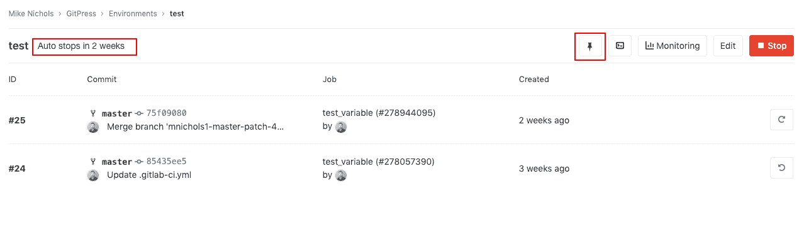](../img/environment_auto_stop_v12_8.png)

#### Delete a stopped environment[](#delete-a-stopped-environment "Permalink")

在 GitLab 12.10 中[引入](https://gitlab.com/gitlab-org/gitlab/-/issues/20620) .

您可以通过以下两种方式之一删除已[停止的环境](#stopping-an-environment) ：通过 GitLab UI 或通过 API.

##### Delete environments through the UI[](#delete-environments-through-the-ui "Permalink")

要查看已**停止**环境的列表，请导航至" **操作">"环境"** ，然后单击"已**停止"**选项卡.

在此处，您可以直接单击" **删除"**按钮，也可以单击环境名称以查看其详细信息，然后从此处**删除**它.

您还可以通过查看已停止环境的详细信息来删除环境：

1.  导航到" **操作">"环境"** .
2.  在"已**停止的**环境"列表中单击环境的名称.
3.  单击显示在所有已停止环境顶部的" **删除"**按钮.
4.  最后，在似乎要删除它的模式中确认您选择的环境.

##### Delete environments through the API[](#delete-environments-through-the-api "Permalink")

也可以使用[Environments API](../../api/environments.html#delete-an-environment)删除[环境](../../api/environments.html#delete-an-environment) .

### Prepare an environment[](#prepare-an-environment "Permalink")

在 GitLab 13.2 中[引入](https://gitlab.com/gitlab-org/gitlab/-/issues/208655) .

默认情况下，每次运行具有指定环境的构建时，GitLab 都会创建一个[部署](#viewing-deployment-history) . 较新的部署也可以[取消较旧的](deployment_safety.html#skip-outdated-deployment-jobs)部署.

您可能需要指定一个环境关键字来[保护构建免受未经授权的访问](protected_environments.html) ，或获得对[范围变量的](#scoping-environments-with-specs)访问. 在这些情况下，可以使用以下`action: prepare`关键字以确保不会创建部署，并且不会取消任何构建：

```
build:
  stage: build
  script:
    - echo "Building the app"
  environment:
    name: staging
    action: prepare
    url: https://staging.example.com 
```

### Grouping similar environments[](#grouping-similar-environments "Permalink")

在 GitLab 8.14 中[引入](https://gitlab.com/gitlab-org/gitlab-foss/-/merge_requests/7015) .

如[配置动态环境中所述](#configuring-dynamic-environments) ，您可以在环境名称前添加一个单词，后跟一个`/` ，最后是分支名称，该分支名称由`CI_COMMIT_REF_NAME`变量自动定义.

简而言之，所有名为`type/foo`的环境都在同一个名为`type`组下显示.

在[最小的示例中](#example-configuration) ，我们将环境命名为`review/$CI_COMMIT_REF_NAME` ，其中`$CI_COMMIT_REF_NAME`是分支名称. 这是示例的片段：

```
deploy_review:
  stage: deploy
  script:
    - echo "Deploy a review app"
  environment:
    name: review/$CI_COMMIT_REF_NAME 
```

在这种情况下，如果您访问" **环境"**页面并且分支存在，则应该看到类似以下内容的内容：

[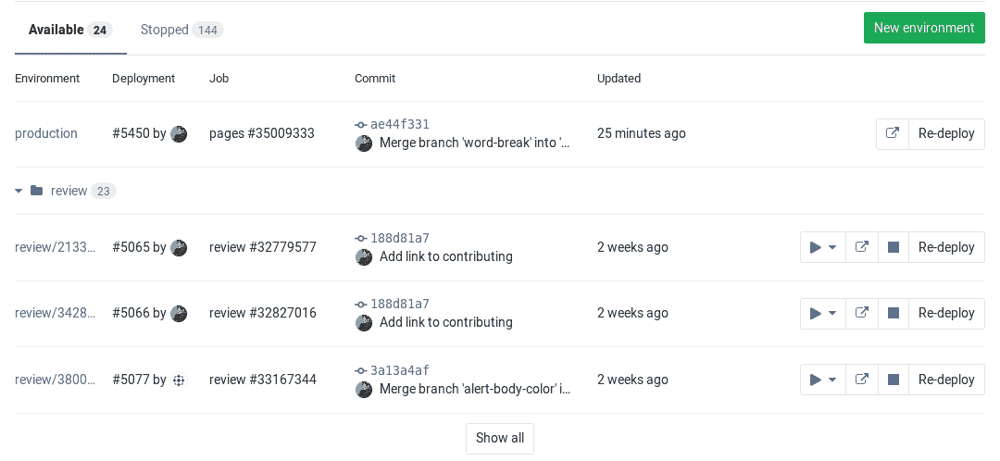](../img/environments_dynamic_groups.png)

### Monitoring environments[](#monitoring-environments "Permalink")

如果已启用[Prometheus 来监视系统和响应指标](../../user/project/integrations/prometheus.html) ，则可以监视在每个环境中运行的应用程序的行为. 为了显示监视仪表板，您需要配置 Prometheus 来收集至少一个[支持的指标](../../user/project/integrations/prometheus_library/index.html) .

**注意：**从 GitLab 9.2 开始，到环境的所有部署都直接显示在监视仪表板上.

配置完成后，GitLab 将尝试为成功部署的任何环境检索[支持的性能指标](../../user/project/integrations/prometheus_library/index.html) . 如果成功检索到监视数据，则将为每个环境显示一个" **监视"**按钮.

[](../img/deployments_view.png)

单击" **监视"**按钮将显示一个新页面，该页面最多显示最近 8 个小时的性能数据. 初始部署后，可能需要一两分钟的时间才能显示数据.

环境的所有部署都直接显示在监视仪表板上，这使性能的任何变化与应用程序的新版本之间都可以轻松关联，而无需离开 GitLab.

[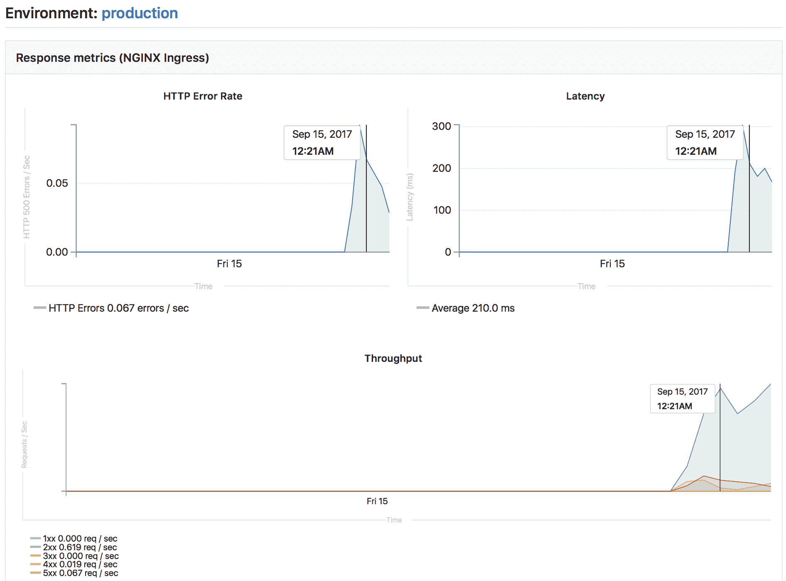](../img/environments_monitoring.png)

#### Embedding metrics in GitLab Flavored Markdown[](#embedding-metrics-in-gitlab-flavored-markdown "Permalink")

公制图表可以嵌入到 GitLab Flavored Markdown 中. 有关更多详细信息，请参见[在 GitLab 风味 Markdown 中嵌入指标](../../operations/metrics/embed.html) .

### Web terminals[](#web-terminals "Permalink")

> Web 终端已在 GitLab 8.15 中添加，仅对项目维护者和所有者可用.

If you deploy to your environments with the help of a deployment service (for example, the [Kubernetes integration](../../user/project/clusters/index.html)), GitLab can open a terminal session to your environment.

这是一项功能强大的功能，可让您调试问题而不会离开 Web 浏览器. 要启用它，只需按照服务集成文档中给出的说明进行操作.

启用后，您的环境将获得一个"终端"按钮：

[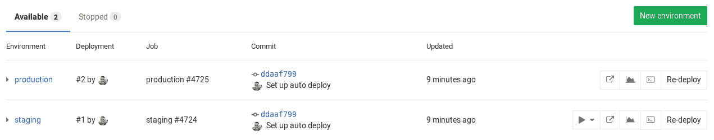](../img/environments_terminal_button_on_index.png)

您还可以从页面访问特定环境的终端按钮：

[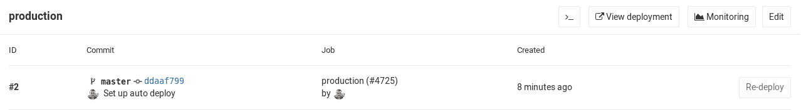](../img/environments_terminal_button_on_show.png)

无论在哪里找到它，单击按钮都会带您到单独的页面来建立终端会话：

[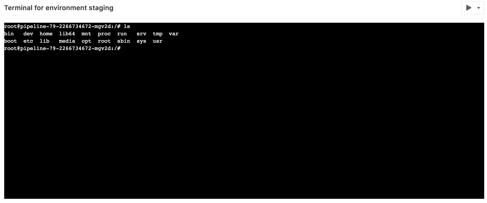](../img/environments_terminal_page.png)

就像其他终端一样工作. 您将处于部署创建的容器中，因此您可以：

*   运行 shell 命令并实时获取响应.
*   检查日志.
*   试用配置或代码调整等.

您可以在同一环境中打开多个终端，它们每个都有自己的 shell 会话，甚至可以是`screen`或`tmux`的多路复用器.

**注意：**基于容器的部署通常缺少基本工具（例如编辑器），并且可以随时停止或重新启动. 如果发生这种情况，您将丢失所有更改. 将此视为调试工具，而不是全面的在线 IDE.

### Check out deployments locally[](#check-out-deployments-locally "Permalink")

从 GitLab 8.13 开始，每次部署都会在 Git 存储库中保存一个引用，因此仅需`git fetch`知道当前环境的状态.

In your Git configuration, append the `[remote "<your-remote>"]` block with an extra fetch line:

```
fetch = +refs/environments/*:refs/remotes/origin/environments/* 
```

### Scoping environments with specs[](#scoping-environments-with-specs "Permalink")

版本历史

*   在[GitLab Premium](https://about.gitlab.com/pricing/) 9.4 中[引入](https://gitlab.com/gitlab-org/gitlab/-/merge_requests/2112) .
*   在 GitLab 12.2 中将[环境变量的作用域移至 Core](https://gitlab.com/gitlab-org/gitlab-foss/-/merge_requests/30779) .

您可以通过定义变量可用于的环境来限制变量的环境范围.

可以使用通配符，默认环境范围是`*` ，这意味着任何作业都将具有此变量，与是否定义环境无关.

例如，如果环境范围是`production` ，那么只有定义了环境`production`的作业才具有此特定变量. 通配符（ `*` ）可以与环境名称一起使用，因此，如果环境范围是`review/*`那么任何以环境名称以`review/`开头的作业都将具有该特定变量.

对于每个环境，某些 GitLab 功能可能会有不同的行为. 例如，您可以[创建一个秘密变量，仅将其注入生产环境](../variables/README.html#limit-the-environment-scopes-of-environment-variables) .

在大多数情况下，这些功能使用*环境规范*机制，该机制提供了一种在每个环境组内实现作用域的有效方法.

假设有四种环境：

*   `production`
*   `staging`
*   `review/feature-1`
*   `review/feature-2`

Each environment can be matched with the following environment spec:

| 环境规格 | `production` | `staging` | `review/feature-1` | `review/feature-2` |
| --- | --- | --- | --- | --- |
| * | Matched | Matched | Matched | Matched |
| production | Matched |   |   |   |
| staging |   | Matched |   |   |
| review/* |   |   | Matched | Matched |
| review/feature-1 |   |   | Matched |   |

如您所见，您可以使用特定的匹配来选择特定的环境，也可以使用通配符匹配（ `*` ）来选择特定的环境组，例如[Review Apps](../review_apps/index.html) （ `review/*` ）.

**注意：**最*具体的*规范优先于其他通配符匹配. 在这种情况下， `review/feature-1`规范优先于`review/*`和`*`规范.

### Environments Dashboard[](#environments-dashboard-premium "Permalink")

有关每个环境的运行状况的摘要，请参见[环境仪表板](../environments/environments_dashboard.html) .

## Limitations[](#limitations "Permalink")

在`environment: name` ，您仅限于[预定义的环境变量](../variables/predefined_variables.html) . 重用`script`内部定义为环境名称一部分的变量将不起作用.

## Further reading[](#further-reading "Permalink")

以下是一些您可能会发现有趣的链接：

*   [The `.gitlab-ci.yml` definition of environments](../yaml/README.html#environment)
*   [A blog post on Deployments & Environments](https://about.gitlab.com/blog/2016/08/26/ci-deployment-and-environments/)
*   [Review Apps - Use dynamic environments to deploy your code for every branch](../review_apps/index.html)
*   [Deploy Boards for your applications running on Kubernetes](../../user/project/deploy_boards.html)