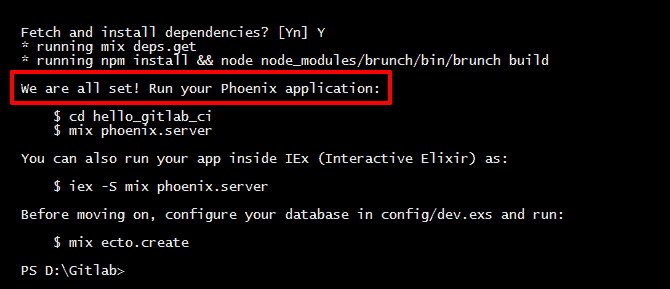
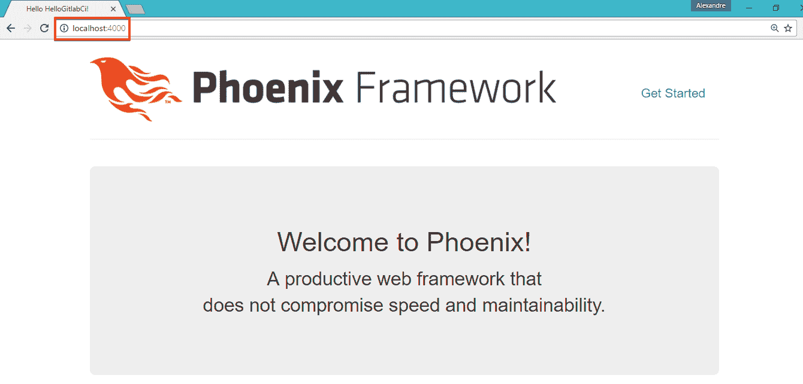
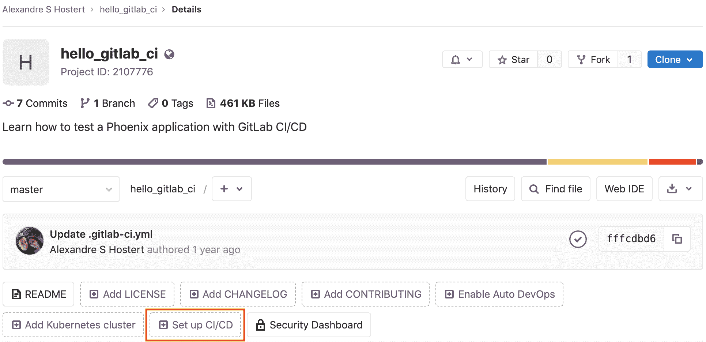
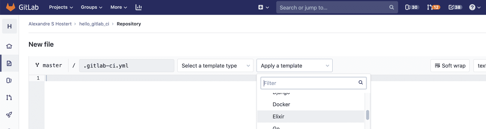
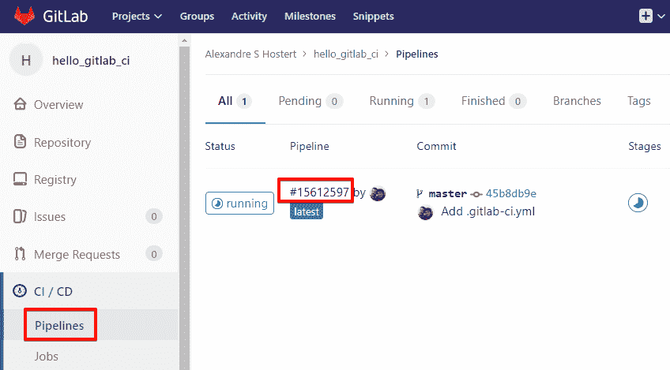

# Testing a Phoenix application with GitLab CI/CD

> 原文：[https://docs.gitlab.com/ee/ci/examples/test_phoenix_app_with_gitlab_ci_cd/](https://docs.gitlab.com/ee/ci/examples/test_phoenix_app_with_gitlab_ci_cd/)

*   [Introduction](#introduction)
    *   [What is Phoenix?](#what-is-phoenix)
    *   [What is Elixir?](#what-is-elixir)
*   [Requirements](#requirements)
    *   [Create a new Phoenix project](#create-a-new-phoenix-project)
    *   [Initialize the PostgreSQL database](#initialize-the-postgresql-database)
    *   [Start Phoenix server](#start-phoenix-server)
*   [Introducing GitLab CI/CD](#introducing-gitlab-cicd)
*   [Adjusting Phoenix configuration](#adjusting-phoenix-configuration)
*   [Testing](#testing)
*   [Configuring CI/CD Pipeline](#configuring-cicd-pipeline)
*   [Watching the build](#watching-the-build)
*   [Conclusion](#conclusion)
*   [References](#references)

# Testing a Phoenix application with GitLab CI/CD[](#testing-a-phoenix-application-with-gitlab-cicd "Permalink")

[Phoenix](https://www.phoenixframework.org/)是用[Elixir](https://s0elixir-lang0org.icopy.site)编写的 Web 开发框架， [Elixir](https://s0elixir-lang0org.icopy.site)是在[Erlang VM](https://www.erlang.org)上运行的旨在提高生产力和可维护性的功能性语言. Erlang VM 确实非常快，并且可以处理大量同时用户.

这就是为什么我们今天听到太多有关 Phoenix 的原因.

在本教程中，我们将教您如何设置[GitLab CI / CD](../../README.html)来构建和测试 Phoenix 应用程序.

本教程假定您知道如何创建 Phoenix 应用程序，在本地运行测试以及如何使用 Git 和 GitLab UI.

## Introduction[](#introduction "Permalink")

### What is Phoenix?[](#what-is-phoenix "Permalink")

[Phoenix](https://www.phoenixframework.org/) is a web development framework written in [Elixir](https://s0elixir-lang0org.icopy.site). It’s useful for building fast, reliable, and high-performance applications, as it uses [Erlang VM](https://www.erlang.org).

许多组件和概念类似于 Ruby on Rails 或 Python 的 Django. 高开发人员生产率和高应用程序性能只是学习如何使用它的几个优点. 使用 MVC 模式，它被设计为模块化和灵活的. 易于维护不断增长的应用程序是一个加号.

Phoenix 可以在任何支持 Erlang 的操作系统上运行：

*   Ubuntu
*   CentOS
*   Mac OS X
*   Debian
*   Windows
*   Fedora
*   Raspberry Pi 操作系统

查看[Phoenix 学习指南](https://s0hexdocs0pm.icopy.site/phoenix/overview.html)以获取更多信息.

### What is Elixir?[](#what-is-elixir "Permalink")

[Elixir](https://s0elixir-lang0org.icopy.site)是一种动态的，功能性的语言，旨在轻松地使用当今所有成熟的 Erlang（已有 30 年的历史！）. 它与 Ruby 有相似之处，特别是在语法上，因此 Ruby 开发人员对 Elixir 的快速增长感到非常兴奋. 一个全栈的 Ruby 开发人员可以在短短几周内学会如何使用 Elixir 和 Phoenix.

在药剂我们有一个叫做命令`mix` ，这是一个帮助创建项目，测试，运行迁移和[更多](https://s0elixir-lang0org.icopy.site/getting-started/mix-otp/introduction-to-mix) . 我们将在本教程的后面部分中使用它.

查看[Elixir 文档](https://s0elixir-lang0org.icopy.site/getting-started/introduction)以获取更多信息.

## Requirements[](#requirements "Permalink")

要遵循本教程，您需要先安装：

*   Elixir [installation instructions](https://s0elixir-lang0org.icopy.site/install)
*   Phoenix Framework [安装说明](https://s0hexdocs0pm.icopy.site/phoenix/installation.html)
*   PostgreSQL（如果需要使用 MySQL 服务器，请查看[Phoenix 说明](https://s0hexdocs0pm.icopy.site/phoenix/ecto.html) ）

### Create a new Phoenix project[](#create-a-new-phoenix-project "Permalink")

打开终端，然后转到要创建项目的目录. 您无需为项目的文件创建一个空目录，因为`mix`命令将为我们完成此操作.

当我们调用`mix`命令时，我们将传递两个参数：

*   我们希望它运行的任务： `phoenix.new`
*   参数`phoenix.new`需要，这是新项目的名称. 在这种情况下，我们称其为`hello_gitlab_ci` ，但您可以自由设置自己的名称：

```
mix phoenix.new hello_gitlab_ci 
```

当询问时，请回答`Y`以获取并安装依赖项.

如果一切顺利，您将获得如下输出：

[](img/mix-phoenix-new.png)

现在，我们的项目位于目录中，该目录与传递给`mix`命令的名称相同，例如`~/GitLab/hello_gitlab_ci` . 如果查看目录，我们将看到 Phoenix 文件和运行所需的依赖项.

### Initialize the PostgreSQL database[](#initialize-the-postgresql-database "Permalink")

By default, Phoenix requires a PostgreSQL database to store whatever we need to store in our app. In this case, we’ll only create an empty database.

首先，我们需要导航到我们最近创建的项目的目录，然后再次执行`mix` . 这次， `mix`将收到参数`ecto.create` ，这是创建新数据库的任务. [Ecto](https://s0hexdocs0pm.icopy.site/ecto/Ecto.html)是 Elixir 的数据库包装器.

创建项目后第一次运行`mix`时，它将把我们的文件编译为字节码，然后由 Erlang VM 解释. 在接下来的时间里，它只会编译我们的更改.

运行以下命令以创建我们的空数据库：

```
cd hello_gitlab_ci
mix ecto.create 
```

我们希望在命令末尾看到以下输出：

```
Generated hello_gitlab_ci app
The database for HelloGitlabCi.Repo has been created 
```

> **注意：** Phoenix 假设我们的 PostgreSQL 数据库将具有一个具有正确权限的`postgres`用户帐户和一个`postgres`密码. 如果不是您的情况，请查看[Ecto 的说明](https://s0hexdocs0pm.icopy.site/ecto/Ecto.html) .

### Start Phoenix server[](#start-phoenix-server "Permalink")

现在，该看看我们到目前为止所做的一切是否进展顺利. 我们将再次使用`phoenix.server`参数调用`mix` ，它将启动 Phoenix 的 HTTP Server.

```
mix phoenix.server 
```

这将是此命令的输出：

```
[info] Running HelloGitlabCi.Endpoint with Cowboy using http://localhost:4000
23 May 11:44:35 - info: compiling
23 May 11:44:37 - info: compiled 6 files into 2 files, copied 3 in 9.8 sec 
```

现在，我们的应用程序在本地运行. 我们可以直接在浏览器中预览它. 让我们打开[`localhost:4000`](http://localhost:4000)来查看我们的 Phoenix Framework 欢迎页面. 如果链接不起作用，请改为打开[`127.0.0.1:4000`](http://127.0.0.1:4000) ，然后[`127.0.0.1:4000`](http://127.0.0.1:4000)操作系统配置为将`localhost`指向`127.0.0.1` .

[](img/mix-phoenix-server.png)

太好了，现在我们有一个本地 Phoenix Server 运行我们的应用程序.

在本地，我们的应用程序在[`iex`](https://s0elixir-lang0org.icopy.site/getting-started/introduction.html)会话中运行，该会话代表 Interactive Elixir. 在这种交互模式下，我们可以键入任何 Elixir 表达式并获取其结果. 要退出`iex` ，我们需要按两次`Ctrl+C` 因此，当我们需要停止 Phoenix 服务器时，我们必须`Ctrl+C`两次`Ctrl+C`

## Introducing GitLab CI/CD[](#introducing-gitlab-cicd "Permalink")

借助 GitLab，我们可以在一个平台上管理开发工作流程，提高生产力，跟踪问题，执行代码审查等. 使用 GitLab CI / CD，我们可以提高工作效率，因为每次我们或我们的同事发布任何代码时，GitLab CI / CD 都会构建并测试更改，并实时告诉我们是否有任何问题.

当然，当我们的应用程序开始增长时，我们将需要更多的开发人员在同一个项目上工作，并且这种构建和测试过程很容易在没有适当管理的情况下变得一团糟. 这也是为什么 GitLab CI / CD 对我们的应用如此重要的原因. 每当有人将其代码推送到 GitLab 时，我们都会很快知道他们的更改是否破坏了某些内容. 我们不需要停止所做的一切工作，就可以手动进行测试，而无需在团队中进行任何更改.

让我们在实践中看一下.

## Adjusting Phoenix configuration[](#adjusting-phoenix-configuration "Permalink")

现在，我们需要在配置 GitLab CI / CD 之前调整 Phoenix 配置. Phoenix 项目中有一个目录（ `config` ），其中包含可以运行的每个环境的配置文件. 由于我们将在单个环境中工作，因此我们将仅编辑测试配置文件（ `test.exs` ）.

但是，为什么我们需要调整配置？ 好吧，GitLab CI / CD 使用 Docker 技术在一个称为[Runner 的](../../runners/README.html)隔离虚拟机中构建和测试我们的代码. 在此 Runner 中，GitLab CI / CD 可以访问 Phoenix 应用程序需要运行的所有内容，就像在`localhost` ，但是我们必须告诉 GitLab CI / CD 使用系统变量在哪里创建和找到该数据库. 这样，GitLab CI / CD 将在 Runner 内部创建测试数据库，就像在`localhost`运行 Phoenix 时一样.

*   在您喜欢的代码编辑器上打开`hello_gitlab_ci/config/test.exs`
*   转到" **配置数据库**会话"并编辑该块以包含`System.get_env` ：

    ```
    # Configure your database
    config :hello_gitlab_ci, HelloGitlabCi.Repo,
      adapter: Ecto.Adapters.Postgres,
      username: System.get_env("POSTGRES_USER") || "postgres",
      password: System.get_env("POSTGRES_PASSWORD") || "postgres",
      database: System.get_env("POSTGRES_DB") || "hello_gitlab_ci_test",
      hostname: System.get_env("POSTGRES_HOST") || "localhost",
      pool: Ecto.Adapters.SQL.Sandbox 
    ```

    稍后我们将需要这些系统变量.

*   在`hello_gitlab_ci/priv/repo/migrations`创建一个名为`.gitkeep`的空文件

    由于我们的项目仍然很新鲜，因此我们的数据库上没有任何数据，因此`migrations`目录将为空. 如果没有`.gitkeep` ，Git 将不会上传该空目录，并且在 GitLab 上运行测试时会出现错误.

    > **注意：**如果我们通过 GitLab UI 添加文件夹，则 GitLab 本身会将`.gitkeep`添加到该新目录中.

现在，让我们运行一个本地测试，看看我们所做的一切是否都没有破坏任何东西.

## Testing[](#testing "Permalink")

之前，当我们创建项目时，我们运行了`mix phoenix.new` . 该任务创建了 Phoenix 应用程序所需的所有内容，包括一些进入`hello_gitlab_ci/test`目录的单元测试.

让我们运行带有`mix`的新任务来为我们运行这些测试. 这次，预期的参数是`test` . 我们可以添加`--trace`参数以进行调试.

在您的终端中，导航到目录`hello_gitlab_ci`并运行：

```
mix test 
```

我们的预期结果是：

```
....

Finished in 0.7 seconds
4 tests, 0 failures

Randomized with seed 610000 
```

我们的测试成功了. 是时候将我们的文件推送到 GitLab 了.

## Configuring CI/CD Pipeline[](#configuring-cicd-pipeline "Permalink")

第一步是在我们项目的`hello_gitlab_ci`目录中创建一个名为`.gitlab-ci.yml`的新文件.

*   最简单的方法是单击项目主页上的" **设置 CI / CD** "：

    [](img/set_up_ci_v12_6.png)

*   在下一个屏幕上，我们可以使用已包含 Elixir 测试的模板. 单击" **应用模板"，**然后选择**Elixir** ：

    [](img/select_template_v12_6.png)

    该模板文件告诉 GitLab CI / CD 每次新的提交时我们希望做什么. 但是，我们必须对其稍作调整才能运行 Phoenix 应用程序.

*   The first line tells GitLab what Docker image will be used.

    还记得我们了解 Runners 时，GitLab CI / CD 在其中构建和测试我们的应用程序的隔离虚拟机吗？ 该虚拟机必须具有所有依赖关系才能运行我们的应用程序. 这是需要 Docker 映像的地方. 正确的图像将为我们提供整个系统.

    当我们专注于测试（而不是部署）时，可以使用[elixir：latest](https://hub.docker.com/_/elixir) Docker 映像，该映像已经具有用于运行 Phoenix 测试的依赖项，例如 Elixir 和 Erlang：

    ```
    image: elixir:latest 
    ```

*   我们将仅使用`postgres` ，因此我们可以从`services`部分删除`mysql`和`redis`行：

    ```
    services:
      - postgres:latest 
    ```

*   现在，我们将在`before_script`部分之前创建一个名为`variables`的新部分：

    ```
    variables:
      POSTGRES_DB: hello_gitlab_ci_test
      POSTGRES_HOST: postgres
      POSTGRES_USER: postgres
      POSTGRES_PASSWORD: "postgres"
      MIX_ENV: "test" 
    ```

    上面，我们设置了 GitLab CI / CD 的值以验证到 PostgreSQL，就像我们之前在`config/test.exs`那样. `postgres`服务使用`POSTGRES_USER`和`POSTGRES_PASSWORD`值来创建具有这些凭据的用户.

*   在`before_script`部分中，我们将添加一些命令来为测试做准备：

    ```
    before_script:
      - mix local.rebar --force
      - mix local.hex --force
      - mix deps.get --only test
      - mix ecto.create
      - mix ecto.migrate 
    ```

    这样可以确保在尝试获取运行测试所需的依赖项之前，都同时安装了[rebar3](https://www.rebar3.org)和[hex](https://s0hex0pm.icopy.site) . 接下来，使用`ecto`创建并迁移`postgres` db，以确保它是最新的.

*   最后，我们将`mix`部分保持不变.

让我们看一下更改后的更新文件：

```
image: elixir:latest

services:
  - postgres:latest

variables:
  POSTGRES_DB: hello_gitlab_ci_test
  POSTGRES_HOST: postgres
  POSTGRES_USER: postgres
  POSTGRES_PASSWORD: "postgres"
  MIX_ENV: "test"

before_script:
  - mix local.rebar --force
  - mix local.hex --force
  - mix deps.get --only test
  - mix ecto.create
  - mix ecto.migrate

mix:
  script:
    - mix test 
```

为了安全起见，在将此文件提交到 GitLab 之前，我们可以检查是否有语法错误. 复制`.gitlab-ci.yml`的内容并将其粘贴到[GitLab CI / CD Lint 工具上](https://gitlab.com/ci/lint) . 请注意，此链接仅对登录用户有效.

## Watching the build[](#watching-the-build "Permalink")

我不了解您，但是我喜欢看黑屏上充满了编译输出. 这样，我可以感觉到我所做的正确工作带来的快乐. 在`localhost` ，很容易观看我们的构建，但是在 GitLab 上，这可能吗？ 是!

让我们去**管道** ，看看 GitLab 做这项工作. 只需单击**管道**以查找实际正在运行的构建作业.

[](img/pipelines.png)

单击内部版本的 ID 观看整个过程. 如果一切都按预期进行，我们可以等待**构建成功**完成！ :)

```
$ mix test
....

Finished in 0.3 seconds
4 tests, 0 failures

Randomized with seed 206909
Build succeeded 
```

如果我们在 GitLab UI 上查看项目的主页，我们可以看到 GitLab CI / CD 进行的最后构建的状态.

是时候向世界展示我们的绿色建筑徽章！ 导航到项目的**"设置">" CI / CD"，**然后展开" **常规管道设置"** . 向下滚动到**管道状态，**并复制您的徽章的降价代码. 将其粘贴到`README.md`文件的顶部，以使项目外的人员可以看到我们的最新代码是否正在正确运行.

完成此版本后，GitLab 将启动另一个构建并显示一个**运行**徽标. 可以预期的是，毕竟我们只是配置了 GitLab CI / CD 来完成每次推送！ 但是您可能会想"为什么要针对诸如 README.md 之类的简单操作运行构建和测试？" 这是一个很好的问题. 对于不影响您的应用程序的更改，您可以添加关键字[`[ci skip]`](../../yaml/README.html#skip-pipeline)来提交消息，并且与该提交相关的内部版本将被跳过.

最后，我们终于获得了绿色环保的成功徽章！ 通过将结果输出到 README 文件中，它可以向登录项目页面的任何人显示您的代码是最新的并且可以正常工作.

## Conclusion[](#conclusion "Permalink")

当我们的应用程序不断增长且有许多开发人员在处理该应用程序时，或者当社区正在监视和贡献一个开源项目时，使我们的代码永久运行非常重要. GitLab CI / CD 是节省时间的强大工具，可帮助我们维护代码的组织和工作.

正如我们在这篇文章中所看到的，GitLab CI / CD 确实很容易配置和使用. 我们还有[许多其他理由](https://about.gitlab.com/blog/2015/02/03/7-reasons-why-you-should-be-using-ci/)继续使用 GitLab CI / CD. 给我们团队带来的好处是巨大的！

## References[](#references "Permalink")

*   [GitLab CI/CD introductory guide](https://about.gitlab.com/blog/2015/12/14/getting-started-with-gitlab-and-gitlab-ci/)
*   [GitLab CI/CD full Documentation](../../README.html)
*   [GitLab Runners documentation](../../runners/README.html)
*   [Using Docker images documentation](../../docker/using_docker_images.html)