# Test and deploy Laravel applications with GitLab CI/CD and Envoy

> 原文：[https://docs.gitlab.com/ee/ci/examples/laravel_with_gitlab_and_envoy/](https://docs.gitlab.com/ee/ci/examples/laravel_with_gitlab_and_envoy/)

*   [Introduction](#introduction)
*   [Initialize our Laravel app on GitLab](#initialize-our-laravel-app-on-gitlab)
    *   [Unit Test](#unit-test)
    *   [Push to GitLab](#push-to-gitlab)
*   [Configure the production server](#configure-the-production-server)
    *   [Create a new user](#create-a-new-user)
    *   [Add SSH key](#add-ssh-key)
    *   [Configuring NGINX](#configuring-nginx)
*   [Setting up Envoy](#setting-up-envoy)
    *   [How Envoy works](#how-envoy-works)
    *   [Zero downtime deployment](#zero-downtime-deployment)
        *   [@setup directive](#setup-directive)
        *   [@story directive](#story-directive)
        *   [Clone the repository](#clone-the-repository)
        *   [Installing dependencies with Composer](#installing-dependencies-with-composer)
        *   [Activate new release](#activate-new-release)
    *   [Full script](#full-script)
*   [Continuous Integration with GitLab](#continuous-integration-with-gitlab)
    *   [Create a Container Image](#create-a-container-image)
        *   [Setting Up GitLab Container Registry](#setting-up-gitlab-container-registry)
    *   [Setting up GitLab CI/CD](#setting-up-gitlab-cicd)
        *   [Image and Services](#image-and-services)
        *   [Variables](#variables)
        *   [Unit Test as the first job](#unit-test-as-the-first-job)
        *   [Deploy to production](#deploy-to-production)
    *   [Turn on GitLab CI/CD](#turn-on-gitlab-cicd)
*   [Conclusion](#conclusion)

# Test and deploy Laravel applications with GitLab CI/CD and Envoy[](#test-and-deploy-laravel-applications-with-gitlab-cicd-and-envoy "Permalink")

## Introduction[](#introduction "Permalink")

GitLab 通过持续集成为我们的应用程序提供功能，并且可以随时将新的代码更改轻松部署到生产服务器.

在本教程中，我们将向您展示如何初始化[Laravel](https://s0laravel0com.icopy.site)应用程序并设置[Envoy](https://s0laravel0com.icopy.site/docs/master/envoy)任务，然后我们将跳入如何使用[GitLab CI / CD](../README.html)通过[Continuous Delivery](https://about.gitlab.com/blog/2016/08/05/continuous-integration-delivery-and-deployment-with-gitlab/)测试和部署它的方法.

我们假设您具有 Laravel 和 Linux 服务器的基本经验，并且知道如何使用 GitLab.

Laravel 是一个用 PHP 编写的高质量 Web 框架. 它有一个很棒的社区，提供了[很棒的文档](https://s0laravel0com.icopy.site/docs) . 除了常规的路由，控制器，请求，响应，视图和（刀片）模板外，Laravel 还提供了许多其他服务，例如缓存，事件，本地化，身份验证以及许多其他服务.

我们将使用[Envoy](https://s0laravel0com.icopy.site/docs/master/envoy)作为基于 PHP 的 SSH 任务运行程序. 它使用简洁的[Blade 语法](https://s0laravel0com.icopy.site/docs/master/blade)来设置可以在远程服务器上运行的任务，例如，从存储库克隆项目，安装 Composer 依赖项以及运行[Artisan 命令](https://s0laravel0com.icopy.site/docs/master/artisan) .

## Initialize our Laravel app on GitLab[](#initialize-our-laravel-app-on-gitlab "Permalink")

我们假设[您已经安装了一个新的 Laravel 项目](https://s0laravel0com.icopy.site/docs/master/installation) ，所以让我们从单元测试开始，并为该项目初始化 Git.

### Unit Test[](#unit-test "Permalink")

Laravel 的每个新安装（当前为 5.4）都在测试目录中放置了两种类型的测试："功能"和"单元". 这是来自`test/Unit/ExampleTest.php`的单元测试：

```
<?php

namespace Tests\Unit;

...

class ExampleTest extends TestCase
{
    public function testBasicTest()
    {
        $this->assertTrue(true);
    }
} 
```

该测试就像断言给定值是 true 一样简单.

Laravel 默认使用`PHPUnit`进行测试. 如果运行`vendor/bin/phpunit`我们应该看到绿色输出：

```
vendor/bin/phpunit
OK (1 test, 1 assertions) 
```

该测试将在以后用于通过 GitLab CI / CD 持续测试我们的应用程序.

### Push to GitLab[](#push-to-gitlab "Permalink")

由于我们已经在本地启动并运行了应用程序，因此现在是将代码库推送到我们的远程存储库的时候了. 让我们在 GitLab 中创建[一个](../../../gitlab-basics/create-project.html)名为`laravel-sample` [的新项目](../../../gitlab-basics/create-project.html) . 之后，按照项目主页上显示的命令行说明在我们的计算机上启动存储库并推送第一个提交.

```
cd laravel-sample
git init
git remote add origin git@gitlab.example.com:<USERNAME>/laravel-sample.git
git add .
git commit -m 'Initial Commit'
git push -u origin master 
```

## Configure the production server[](#configure-the-production-server "Permalink")

在开始设置 Envoy 和 GitLab CI / CD 之前，让我们快速确保生产服务器已准备好进行部署. 我们已经在 Ubuntu 16.04 上安装了 LEMP 堆栈，该堆栈代表 Linux，NGINX，MySQL 和 PHP.

### Create a new user[](#create-a-new-user "Permalink")

现在，让我们创建一个新用户，该用户将用于部署我们的网站并使用[Linux ACL](https://serversforhackers.com/c/linux-acls)为其授予所需的权限：

```
# Create user deployer
sudo adduser deployer
# Give the read-write-execute permissions to deployer user for directory /var/www
sudo setfacl -R -m u:deployer:rwx /var/www 
```

如果您的 Ubuntu 服务器上未安装 ACL，请使用以下命令进行安装：

```
sudo apt install acl 
```

### Add SSH key[](#add-ssh-key "Permalink")

假设我们要从 GitLab 上的私有存储库将应用程序部署到生产服务器. 首先，我们需要为部署者用户[生成一个**没有密码短语**的新 SSH 密钥对](../../../ssh/README.html) .

之后，我们需要复制私钥，以使用 SSH 作为部署者用户将其用于连接到我们的服务器，以便能够自动化部署过程：

```
# As the deployer user on server
#
# Copy the content of public key to authorized_keys
cat ~/.ssh/id_rsa.pub >> ~/.ssh/authorized_keys
# Copy the private key text block
cat ~/.ssh/id_rsa 
```

现在，让我们将其作为[变量](../../variables/README.html#gitlab-cicd-environment-variables)添加到您的 GitLab 项目中. 变量是用户定义的变量，出于安全目的，它们存储在`.gitlab-ci.yml` . 可以通过导航到项目的**设置** > **CI / CD**来为每个项目添加它们.

在**KEY**字段中，添加名称`SSH_PRIVATE_KEY` ，然后在**VALUE**字段中，粘贴您先前复制的私钥. 稍后，我们将在`.gitlab-ci.yml`使用此变量，以轻松地以部署者用户身份连接到我们的远程服务器，而无需输入其密码.

[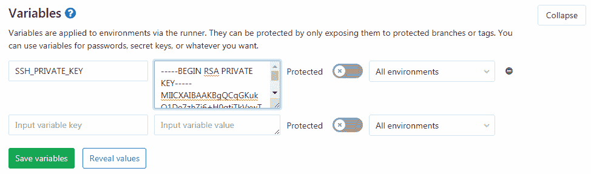](img/variables_page.png)

我们还需要将公共密钥作为[部署密钥](../../../ssh/README.html#deploy-keys)添加到" **项目"** > **"设置"** >" **存储库"** ，这使我们能够通过[SSH 协议](../../../gitlab-basics/command-line-commands.html#start-working-on-your-project)从服务器访问存储库.

```
# As the deployer user on the server
#
# Copy the public key
cat ~/.ssh/id_rsa.pub 
```

在" **标题** "字段中，添加所需的任何名称，然后将公共密钥粘贴到" **密钥"**字段中.

[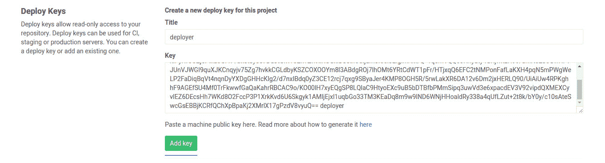](img/deploy_keys_page.png)

现在，让我们在服务器上克隆存储库，以确保`deployer`用户可以访问该存储库.

```
# As the deployer user on server
#
git clone git@gitlab.example.com:<USERNAME>/laravel-sample.git 
```

> **注意：**如果询问， **请**回答**是.** `Are you sure you want to continue connecting (yes/no)?` . 它将 GitLab.com 添加到已知主机.

### Configuring NGINX[](#configuring-nginx "Permalink")

现在，让我们确保我们的 Web 服务器配置指向`current/public`而不是`public` .

通过键入以下内容来打开默认的 NGINX 服务器块配置文件：

```
sudo nano /etc/nginx/sites-available/default 
```

配置应该是这样的.

```
server {
    root /var/www/app/current/public;
    server_name example.com;
    # Rest of the configuration
} 
```

> **注意：**您可以将`/var/www/app/current/public`的应用程序名称替换为应用程序的文件夹名称.

## Setting up Envoy[](#setting-up-envoy "Permalink")

因此，我们已经准备好生产 Laravel 应用. 接下来是使用 Envoy 执行部署.

要使用 Envoy，我们应该首先[按照 Laravel 给出的说明](https://s0laravel0com.icopy.site/docs/master/envoy/)将其安装在本地计算机上.

### How Envoy works[](#how-envoy-works "Permalink")

Envoy 的优点是它不需要 Blade 引擎，只使用 Blade 语法定义任务. 首先，我们在应用程序的根目录中创建一个`Envoy.blade.php` ，其中包含一个简单的测试 Envoy 的任务.

```
@servers(['web' => 'remote_username@remote_host'])

@task('list', ['on' => 'web'])
    ls -l
@endtask 
```

如您所料，我们在文件顶部的`@servers`指令中有一个数组，其中包含一个名为`web`的键，其值为服务器地址的值（例如， `deployer@192.168.1.1` 192.168.1.1）. 然后，在我们的`@task`指令中，定义执行任务时应在服务器上运行的 bash 命令.

在本地计算机上，使用`run`命令运行 Envoy 任务.

```
envoy run list 
```

它应该执行我们之前定义的`list`任务，该任务连接到服务器并列出目录内容.

Envoy 不是 Laravel 的依赖项，因此您可以将其用于任何 PHP 应用程序.

### Zero downtime deployment[](#zero-downtime-deployment "Permalink")

每次我们部署到生产服务器时，Envoy 都会从 GitLab 存储库下载我们应用程序的最新版本，并将其替换为预览版本. Envoy 做到了这一点，没有任何[停机时间](https://en.wikipedia.org/wiki/Downtime) ，因此我们在部署过程中不必担心有人在审查站点. 我们的部署计划是从 GitLab 存储库克隆最新版本，安装 Composer 依赖项，最后激活新版本.

#### [@setup](https://gitlab.com/setup) directive[](#setup-directive "Permalink")

我们部署过程的第一步是在内部定义一组变量 [](https://s0laravel0com.icopy.site/docs/master/envoy/)[@setup](https://gitlab.com/setup)指令. 您可以将`app`更改为您的应用名称：

```
...

@setup
    $repository = 'git@gitlab.example.com:<USERNAME>/laravel-sample.git';
    $releases_dir = '/var/www/app/releases';
    $app_dir = '/var/www/app';
    $release = date('YmdHis');
    $new_release_dir = $releases_dir .'/'. $release;
@endsetup

... 
```

*   `$repository`是我们存储库的地址
*   `$releases_dir`目录是我们部署应用程序的位置
*   `$app_dir`是服务器上实时存在的应用程序的实际位置
*   `$release` contains a date, so every time that we deploy a new release of our app, we get a new folder with the current date as name
*   `$new_release_dir`是新版本的完整路径，仅用于使任务更整洁

#### [@story](https://gitlab.com/story) directive[](#story-directive "Permalink")

的 [](https://s0laravel0com.icopy.site/docs/master/envoy/)[@story](https://gitlab.com/story)指令允许我们定义可以作为单个任务运行的任务列表. 在这里，我们有三个任务，称为`clone_repository` ， `run_composer`和`update_symlinks` . 这些变量可用于使我们的任务代码更清晰：

```
...

@story('deploy')
    clone_repository
    run_composer
    update_symlinks
@endstory

... 
```

让我们一一创建这三个任务.

#### Clone the repository[](#clone-the-repository "Permalink")

第一个任务将创建`releases`目录（如果不存在），然后将存储库的`master`分支（默认情况下）克隆到由`$new_release_dir`变量指定的新 release 目录中. `releases`目录将包含我们所有的部署：

```
...

@task('clone_repository')
    echo 'Cloning repository'
    [ -d {{ $releases_dir }} ] || mkdir {{ $releases_dir }}
    git clone --depth 1 {{ $repository }} {{ $new_release_dir }}
    cd {{ $new_release_dir }}
    git reset --hard {{ $commit }}
@endtask

... 
```

随着我们项目的发展，它的 Git 历史将随着时间的流逝而持续很长时间. 由于我们为每个版本创建一个目录，因此不必为每个版本下载项目的历史记录. `--depth 1`选项是一个很好的解决方案， `--depth 1`可以节省系统时间和磁盘空间.

#### Installing dependencies with Composer[](#installing-dependencies-with-composer "Permalink")

您可能知道，此任务只是导航到新的发行目录并运行 Composer 来安装应用程序依赖项：

```
...

@task('run_composer')
    echo "Starting deployment ({{ $release }})"
    cd {{ $new_release_dir }}
    composer install --prefer-dist --no-scripts -q -o
@endtask

... 
```

#### Activate new release[](#activate-new-release "Permalink")

在准备好新版本的要求之后，接下来要做的就是从其中删除存储目录，并创建两个符号链接，以将应用程序的`storage`目录和`.env`文件指向新版本. 然后，我们需要创建另一个符号链接到新版本用的名称`current`放置在 app 目录. `current`符号链接始终指向我们应用程序的最新版本：

```
...

@task('update_symlinks')
    echo "Linking storage directory"
    rm -rf {{ $new_release_dir }}/storage
    ln -nfs {{ $app_dir }}/storage {{ $new_release_dir }}/storage

    echo 'Linking .env file'
    ln -nfs {{ $app_dir }}/.env {{ $new_release_dir }}/.env

    echo 'Linking current release'
    ln -nfs {{ $new_release_dir }} {{ $app_dir }}/current
@endtask 
```

如您所见，我们使用`-nfs`作为`ln`命令的选项，它表示`storage` ， `.env`和`current`不再指向预览的发行版， `-nfs`通过强制将它们指向新发行版（ `-nfs` `f`表示强制） ，这是我们进行多个部署的情况.

### Full script[](#full-script "Permalink")

脚本已准备就绪，但请确保将`deployer@192.168.1.1`更改为服务器，并使用要部署应用程序的目录更改`/var/www/app` app.

最后，我们的`Envoy.blade.php`文件将如下所示：

```
@servers(['web' => 'deployer@192.168.1.1'])

@setup
    $repository = 'git@gitlab.example.com:<USERNAME>/laravel-sample.git';
    $releases_dir = '/var/www/app/releases';
    $app_dir = '/var/www/app';
    $release = date('YmdHis');
    $new_release_dir = $releases_dir .'/'. $release;
@endsetup

@story('deploy')
    clone_repository
    run_composer
    update_symlinks
@endstory

@task('clone_repository')
    echo 'Cloning repository'
    [ -d {{ $releases_dir }} ] || mkdir {{ $releases_dir }}
    git clone --depth 1 {{ $repository }} {{ $new_release_dir }}
    cd {{ $new_release_dir }}
    git reset --hard {{ $commit }}
@endtask

@task('run_composer')
    echo "Starting deployment ({{ $release }})"
    cd {{ $new_release_dir }}
    composer install --prefer-dist --no-scripts -q -o
@endtask

@task('update_symlinks')
    echo "Linking storage directory"
    rm -rf {{ $new_release_dir }}/storage
    ln -nfs {{ $app_dir }}/storage {{ $new_release_dir }}/storage

    echo 'Linking .env file'
    ln -nfs {{ $app_dir }}/.env {{ $new_release_dir }}/.env

    echo 'Linking current release'
    ln -nfs {{ $new_release_dir }} {{ $app_dir }}/current
@endtask 
```

在进行任何部署之前，我们应该做的另一件事是第一次将我们的应用程序`storage`文件夹手动复制到服务器上的`/var/www/app`目录. 您可能想要创建另一个 Envoy 任务来为您完成此任务. 我们还在同一路径中创建`.env`文件， `.env`设置生产环境变量. 这些是永久性数据，将与每个新版本共享.

现在，我们需要通过运行`envoy run deploy`来部署我们的应用程序，但这不是必需的，因为 GitLab 可以在 CI 的[环境下](../../environments/index.html)为我们处理此事，这将在本教程的[后面部分](#setting-up-gitlab-cicd)进行介绍.

现在是时候提交[Envoy.blade.php](https://gitlab.com/mehranrasulian/laravel-sample/blob/master/Envoy.blade.php)并将其推送到`master`分支了. 为了简化起见，我们直接致力于`master` ，而无需使用[功能分支，](../../../topics/gitlab_flow.html#github-flow-as-a-simpler-alternative)因为协作不在本教程的讨论范围之内. 在现实世界的项目中，团队可以使用[问题跟踪程序](../../../user/project/issues/index.html)和[合并请求](../../../user/project/merge_requests/index.html)在分支之间移动代码：

```
git add Envoy.blade.php
git commit -m 'Add Envoy'
git push origin master 
```

## Continuous Integration with GitLab[](#continuous-integration-with-gitlab "Permalink")

我们已经在 GitLab 上准备好了我们的应用程序，我们也可以手动部署它. 但是，让我们向前迈出一步，使用" [持续交付"](https://about.gitlab.com/blog/2016/08/05/continuous-integration-delivery-and-deployment-with-gitlab/#continuous-delivery)方法自动完成此操作. 我们需要使用一组自动化测试来检查每个提交，以尽早发现问题，然后，如果我们对测试结果感到满意，则可以将其部署到目标环境.

[GitLab CI / CD](../../README.html)允许我们使用[Docker](https://www.docker.com)引擎来处理测试和部署应用程序的过程. 如果您不熟悉 Docker，请参阅[如何自动化 Docker 部署](http://paislee.io/how-to-automate-docker-deployments/) .

为了能够使用 GitLab CI / CD 构建，测试和部署我们的应用程序，我们需要准备工作环境. 为此，我们将使用具有 Laravel 应用程序运行最低要求的 Docker 映像. [也有其他方法](../php.html#test-php-projects-using-the-docker-executor)可以执行此操作，但是它们可能会使我们的构建运行缓慢，而在使用更快的选项时，这不是我们想要的.

有了 Docker 映像，我们的构建运行得异常快！

### Create a Container Image[](#create-a-container-image "Permalink")

让我们在应用程序的根目录中创建一个[包含](https://gitlab.com/mehranrasulian/laravel-sample/blob/master/Dockerfile)以下内容的[Dockerfile](https://gitlab.com/mehranrasulian/laravel-sample/blob/master/Dockerfile) ：

```
# Set the base image for subsequent instructions
FROM php:7.1

# Update packages
RUN apt-get update

# Install PHP and composer dependencies
RUN apt-get install -qq git curl libmcrypt-dev libjpeg-dev libpng-dev libfreetype6-dev libbz2-dev

# Clear out the local repository of retrieved package files
RUN apt-get clean

# Install needed extensions
# Here you can install any other extension that you need during the test and deployment process
RUN docker-php-ext-install mcrypt pdo_mysql zip

# Install Composer
RUN curl --silent --show-error https://getcomposer.org/installer | php -- --install-dir=/usr/local/bin --filename=composer

# Install Laravel Envoy
RUN composer global require "laravel/envoy=~1.0" 
```

我们添加了[官方的 PHP 7.1 Docker 映像](https://hub.docker.com/_/php) ，该[映像](https://hub.docker.com/_/php)由 Debian Jessie 的最低安装和预安装的 PHP 组成，并且非常适合我们的用例.

我们使用了`docker-php-ext-install` （由官方 PHP Docker 映像提供）来安装所需的 PHP 扩展.

#### Setting Up GitLab Container Registry[](#setting-up-gitlab-container-registry "Permalink")

现在我们有了`Dockerfile`让我们构建并将其推送到[GitLab 容器注册表](../../../user/packages/container_registry/index.html) .

> 注册表是存储和标记图像以供以后使用的地方. 开发人员可能希望维护自己的注册表，以用于私人，公司映像或仅用于测试的一次性映像. 使用 GitLab 容器注册表意味着您无需设置和管理另一项服务或使用公共注册表.

在您的 GitLab 项目存储库上，导航到" **注册表"**选项卡.

[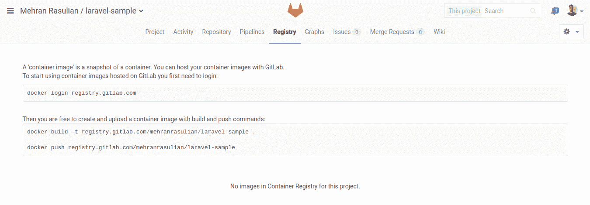](img/container_registry_page_empty_image.png)

您可能需要对项目[启用 Container Registry](../../../user/packages/container_registry/index.html#enable-the-container-registry-for-your-project)才能看到此选项卡. 您可以在项目的**设置>常规>可见性，项目功能，权限**下找到它.

要在我们的机器上开始使用 Container Registry，我们首先需要使用我们的 GitLab 用户名和密码登录到 GitLab 注册表：

```
docker login registry.gitlab.com 
```

然后，我们可以构建图像并将其推送到 GitLab：

```
docker build -t registry.gitlab.com/<USERNAME>/laravel-sample .

docker push registry.gitlab.com/<USERNAME>/laravel-sample 
```

> **注意：**要运行上述命令，我们首先需要在计算机上安装[Docker](https://s0docs0docker0com.icopy.site/engine/installation/) .

恭喜你！ 您刚刚将第一个 Docker 映像推送到了 GitLab 注册表，如果刷新页面，您应该可以看到它：

[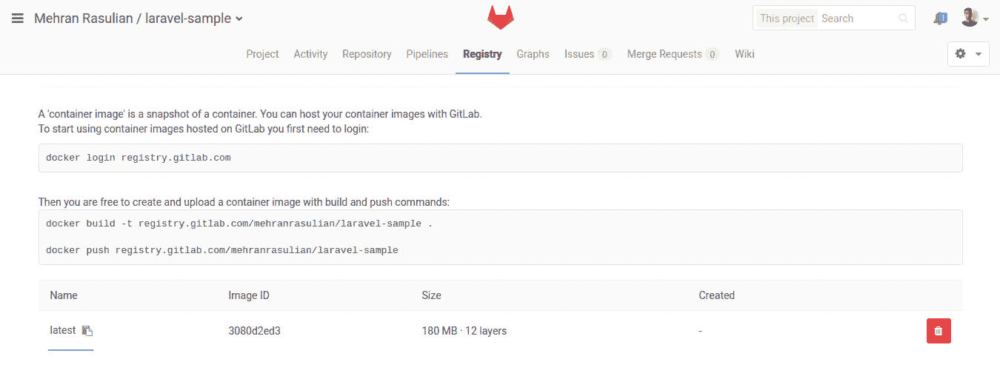](img/container_registry_page_with_image.jpg)

> **注意：**您也可以[使用 GitLab CI / CD](https://about.gitlab.com/blog/2016/05/23/gitlab-container-registry/#use-with-gitlab-ci)来构建和推送 Docker 映像，而不是在计算机上执行.

我们将在`.gitlab-ci.yml`配置文件中进一步使用此图像，以处理测试和部署我们的应用程序的过程.

让我们提交`Dockerfile`文件.

```
git add Dockerfile
git commit -m 'Add Dockerfile'
git push origin master 
```

### Setting up GitLab CI/CD[](#setting-up-gitlab-cicd "Permalink")

为了使用 GitLab CI / CD 构建和测试我们的应用程序，我们需要在存储库的根目录中有一个名为`.gitlab-ci.yml`的文件. 它类似于 Circle CI 和 Travis CI，但内置 GitLab.

我们的`.gitlab-ci.yml`文件将如下所示：

```
image: registry.gitlab.com/<USERNAME>/laravel-sample:latest

services:
  - mysql:5.7

variables:
  MYSQL_DATABASE: homestead
  MYSQL_ROOT_PASSWORD: secret
  DB_HOST: mysql
  DB_USERNAME: root

stages:
  - test
  - deploy

unit_test:
  stage: test
  script:
    - cp .env.example .env
    - composer install
    - php artisan key:generate
    - php artisan migrate
    - vendor/bin/phpunit

deploy_production:
  stage: deploy
  script:
    - 'which  ssh-agent  ||  (  apt-get  update  -y  &&  apt-get  install  openssh-client  -y  )'
    - eval $(ssh-agent -s)
    - ssh-add <(echo "$SSH_PRIVATE_KEY")
    - mkdir -p ~/.ssh
    - '[[  -f  /.dockerenv  ]]  &&  echo  -e  "Host  *\n\tStrictHostKeyChecking  no\n\n"  >  ~/.ssh/config'

    - ~/.composer/vendor/bin/envoy run deploy --commit="$CI_COMMIT_SHA"
  environment:
    name: production
    url: http://192.168.1.1
  when: manual
  only:
    - master 
```

需要很多东西，不是吗？ 让我们逐步进行操作.

#### Image and Services[](#image-and-services "Permalink")

[GitLab Runners](../../runners/README.html)运行`.gitlab-ci.yml`定义的脚本. `image`关键字告诉跑步者要使用哪个图像. `services`关键字定义[链接到主图像的其他图像](../../docker/using_docker_images.html#what-is-a-service) . 在这里，我们将之前创建的容器映像用作主映像，还将 MySQL 5.7 用作服务.

```
image: registry.gitlab.com/<USERNAME>/laravel-sample:latest

services:
  - mysql:5.7

... 
```

> **注意：**如果要使用不同的 PHP 版本和[数据库管理系统](../../services/README.html)测试应用程序，则可以为每个测试作业定义不同的`image`和`services`关键字.

#### Variables[](#variables "Permalink")

GitLab CI / CD 允许我们在工作中使用[环境变量](../../yaml/README.html#variables) . 我们将 MySQL 定义为数据库管理系统，它带有默认创建的超级用户根.

因此，我们应该通过将`MYSQL_DATABASE`变量定义为数据库名称并将`MYSQL_ROOT_PASSWORD`变量定义为`root`的密码来调整 MySQL 实例的配置. 在[官方的 MySQL Docker Image 中](https://hub.docker.com/_/mysql)找到有关 MySQL 变量的更多信息.

还要将变量`DB_HOST`设置为`mysql` ，将`DB_USERNAME`为`root` ，这是 Laravel 特定的变量. 我们将`DB_HOST`定义为`mysql`而不是`127.0.0.1` ，因为我们将 MySQL Docker 映像用作[与主 Docker 映像链接](../../docker/using_docker_images.html#how-services-are-linked-to-the-job)的服务.

```
...

variables:
  MYSQL_DATABASE: homestead
  MYSQL_ROOT_PASSWORD: secret
  DB_HOST: mysql
  DB_USERNAME: root

... 
```

#### Unit Test as the first job[](#unit-test-as-the-first-job "Permalink")

我们将所需的外壳程序脚本定义为运行`unit_test`作业时要执行的[脚本](../../yaml/README.html#script)变量的数组.

These scripts are some Artisan commands to prepare the Laravel, and, at the end of the script, we’ll run the tests by `PHPUnit`.

```
...

unit_test:
  script:
    # Install app dependencies
    - composer install
    # Set up .env
    - cp .env.example .env
    # Generate an environment key
    - php artisan key:generate
    # Run migrations
    - php artisan migrate
    # Run tests
    - vendor/bin/phpunit

... 
```

#### Deploy to production[](#deploy-to-production "Permalink")

`deploy_production`作业会将应用程序部署到生产服务器. 要使用 Envoy 部署我们的应用程序，我们必须将`$SSH_PRIVATE_KEY`变量设置为[SSH 私钥](../../ssh_keys/README.html#ssh-keys-when-using-the-docker-executor) . 如果 SSH 密钥已成功添加，我们可以运行 Envoy.

如前所述，GitLab 也支持[持续交付](https://about.gitlab.com/blog/2016/08/05/continuous-integration-delivery-and-deployment-with-gitlab/#continuous-delivery)方法. [环境](../../yaml/README.html#environment)关键字告诉 GitLab 该作业已部署到`production`环境. `url`关键字用于在 GitLab 环境页面上生成指向我们应用程序的链接. `only`关键字告诉 GitLab CI / CD 只有在管道正在构建`master`分支时才应执行作业. 最后， `when: manual`用于将作业从自动运行转变为手动操作.

```
...

deploy_production:
  script:
    # Add the private SSH key to the build environment
    - 'which  ssh-agent  ||  (  apt-get  update  -y  &&  apt-get  install  openssh-client  -y  )'
    - eval $(ssh-agent -s)
    - ssh-add <(echo "$SSH_PRIVATE_KEY")
    - mkdir -p ~/.ssh
    - '[[  -f  /.dockerenv  ]]  &&  echo  -e  "Host  *\n\tStrictHostKeyChecking  no\n\n"  >  ~/.ssh/config'

    # Run Envoy
    - ~/.composer/vendor/bin/envoy run deploy

  environment:
    name: production
    url: http://192.168.1.1
  when: manual
  only:
    - master 
```

您可能还需要为[登台环境](https://about.gitlab.com/blog/2016/08/26/ci-deployment-and-environments/)添加另一个作业，以便在部署到生产[环境](https://about.gitlab.com/blog/2016/08/26/ci-deployment-and-environments/)之前对应用程序进行最终测试.

### Turn on GitLab CI/CD[](#turn-on-gitlab-cicd "Permalink")

我们已经准备好使用 GitLab CI / CD 测试和部署应用程序所需的一切. 为此，请提交`.gitlab-ci.yml`并将其推入`master`分支. 它将触发管道，您可以在项目的**Pipelines**下实时观看.

[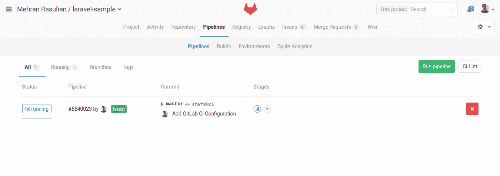](img/pipelines_page.png)

Here we see our **Test** and **Deploy** stages. The **Test** stage has the `unit_test` build running. click on it to see the Runner’s output.

[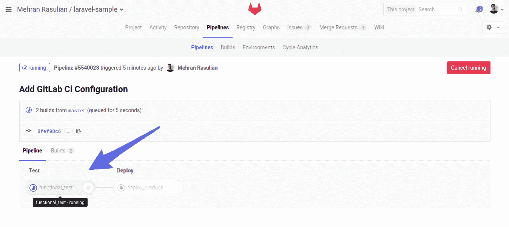](img/pipeline_page.png)

代码成功通过管道后，我们可以通过单击右侧的**播放**按钮将其部署到生产服务器.

[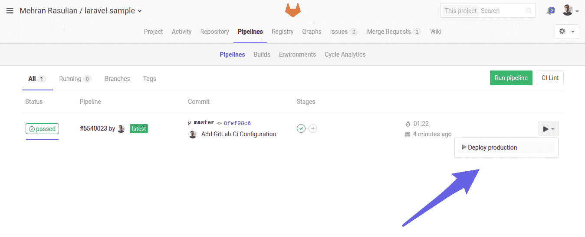](img/pipelines_page_deploy_button.png)

部署管道成功通过后，导航至" **管道">"环境"** .

[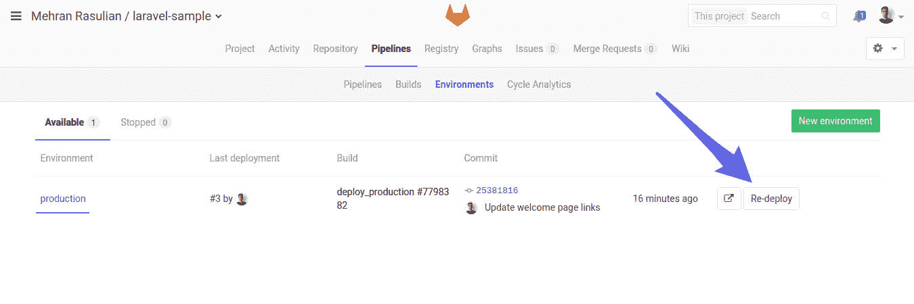](img/environments_page.png)

如果某些操作无法正常工作，则可以回滚到应用程序的最新工作版本.

[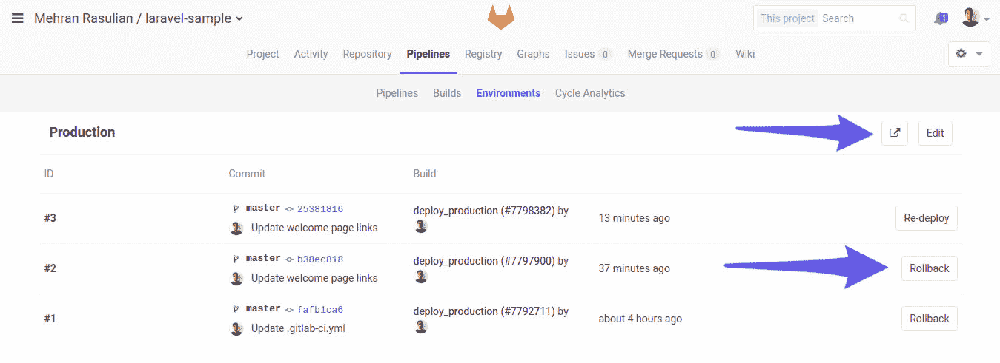](img/environment_page.png)

通过单击右侧指定的外部链接图标，GitLab 将打开生产网站. 我们的部署成功完成，我们可以看到该应用程序正在运行.

[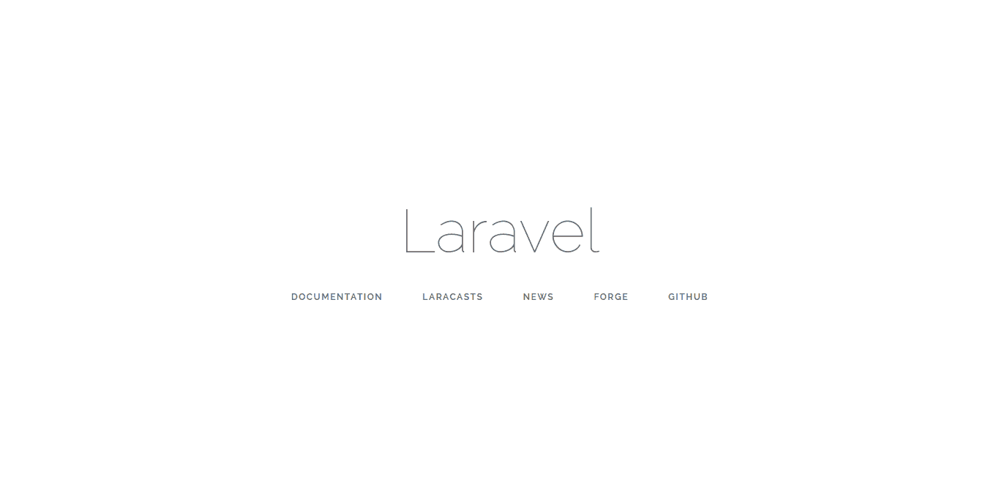](img/laravel_welcome_page.png)

如果您想了解部署后生产服务器上的应用程序目录结构如何，这里有三个目录，分别名为`current` ， `releases`和`storage` . 如您所知， `current`目录是指向最新版本的符号链接. `.env`文件包含我们的 Laravel 环境变量.

[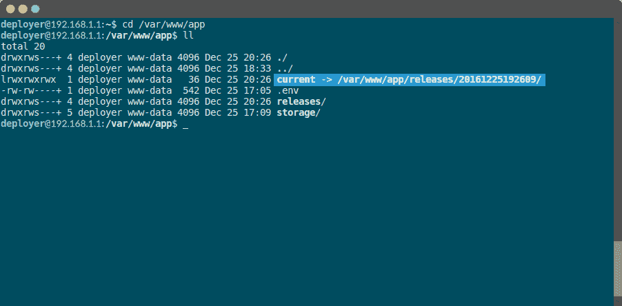](img/production_server_app_directory.png)

如果导航到`current`目录，则应该看到应用程序的内容. 如您所见， `.env`指向`/var/www/app/.env`文件， `storage`也指向`/var/www/app/storage/`目录.

[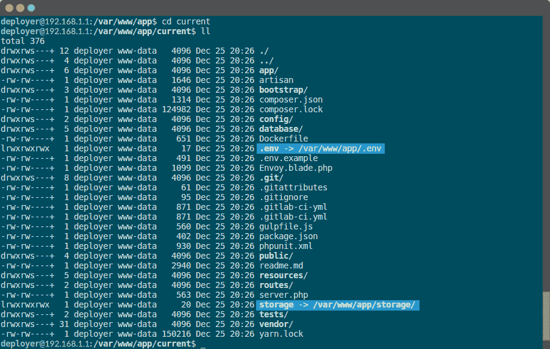](img/production_server_current_directory.png)

## Conclusion[](#conclusion "Permalink")

我们将 GitLab CI / CD 配置为执行自动化测试，并使用" [持续交付](https://continuousdelivery.com/) "方法直接从代码库部署到带有 Envoy 的 Laravel 应用程序.

Envoy 也非常适合帮助我们在不编写自定义 bash 脚本和进行 Linux 魔术的情况下部署应用程序.