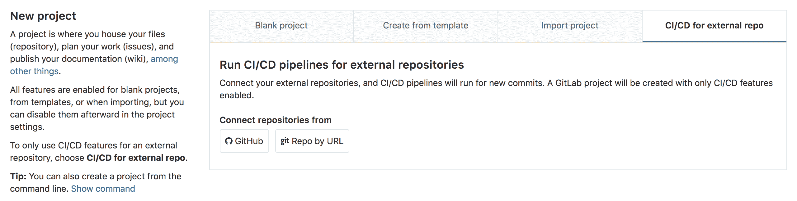

# GitLab CI/CD for external repositories

> 原文：[https://docs.gitlab.com/ee/ci/ci_cd_for_external_repos/](https://docs.gitlab.com/ee/ci/ci_cd_for_external_repos/)

*   [Pipelines for external pull requests](#pipelines-for-external-pull-requests)
    *   [How it works](#how-it-works)
    *   [Additional predefined variables](#additional-predefined-variables)
    *   [Limitations](#limitations)

# GitLab CI/CD for external repositories[](#gitlab-cicd-for-external-repositories-premium "Permalink")

[Introduced](https://gitlab.com/gitlab-org/gitlab/-/merge_requests/4642) in [GitLab Premium](https://about.gitlab.com/pricing/) 10.6.

GitLab CI / CD 可用于：

*   [GitHub](github_integration.html).
*   [Bitbucket Cloud](bitbucket_integration.html).
*   任何其他 Git 服务器.

无需将整个项目移至 GitLab，您可以连接外部存储库以获得 GitLab CI / CD 的好处.

连接外部存储库将建立[存储库镜像](../../user/project/repository/repository_mirroring.html)并创建一个轻型项目，其中禁用了问题，合并请求，Wiki 和代码片段. 这些功能[可以稍后重新启用](../../user/project/settings/index.html#sharing-and-permissions) .

要连接到外部存储库：

1.  在您的 GitLab 仪表板上，点击**新建项目** .
2.  切换到**CI / CD 的外部回购**标签.
3.  Choose **GitHub** or **通过 URL 回购**.
4.  后续步骤类似于[导入流程](../../user/project/import/index.html) .

[](img/ci_cd_for_external_repo.png)

## Pipelines for external pull requests[](#pipelines-for-external-pull-requests "Permalink")

[Introduced](https://gitlab.com/gitlab-org/gitlab-foss/-/issues/65139) in GitLab Premium 12.3.

当将 GitLab CI / CD 与[GitHub 上](github_integration.html)的[外部存储库一起使用时](github_integration.html) ，可以在 Pull Request 上下文中运行管道.

当您将更改推送到 GitHub 中的远程分支时，GitLab CI / CD 可以为该分支运行管道. 但是，当您打开或更新该分支的"拉取请求"时，您可能需要：

*   运行额外的工作.
*   不运行特定作业.

例如：

```
always-run:
  script: echo 'this should always run'

on-pull-requests:
  script: echo 'this should run on pull requests'
  only:
    - external_pull_requests

except-pull-requests:
  script: echo 'this should not run on pull requests'
  except:
    - external_pull_requests 
```

### How it works[](#how-it-works "Permalink")

从 GitHub 导入存储库时，GitLab 会订阅 webhooks 的`push`和`pull_request`事件. 收到`pull_request`事件后，将存储请求请求数据并将其保留为参考. 如果刚刚创建了 Pull Request，则 GitLab 会立即为外部 Pull Request 创建管道.

如果将更改推送到"拉取请求"所引用的分支，并且"拉取请求"仍处于打开状态，则会创建用于外部拉取请求的管道.

**注意：**在这种情况下，GitLab CI / CD 将创建 2 条管道. 一种用于分支推送，另一种用于外部拉取请求.

关闭"拉取请求"后，即使将新的更改推送到同一分支，也不会为外部拉取请求创建任何管道.

### Additional predefined variables[](#additional-predefined-variables "Permalink")

通过将管道用于外部拉取请求，GitLab 将其他[预定义变量](../variables/predefined_variables.html)公开给管道作业.

变量名称以`CI_EXTERNAL_PULL_REQUEST_`为前缀.

### Limitations[](#limitations "Permalink")

此功能当前不支持来自派生存储库的拉取请求. 来自 fork 存储库的任何 Pull Requests 将被忽略. [阅读更多](https://gitlab.com/gitlab-org/gitlab/-/issues/5667) .

鉴于 GitLab 将创建 2 条管道，如果将更改推送到引用了打开的 Pull Request 的远程分支，则两者都将通过 GitHub 集成促进 Pull Request 的状态. 如果要只在外部请求请求上而不是在分支上运行管道，则可以添加以下内容， `except: [branches]`到作业规范. [阅读更多](https://gitlab.com/gitlab-org/gitlab/-/issues/24089#workaround) .