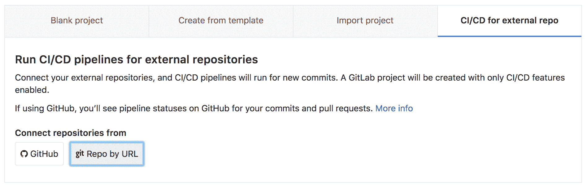
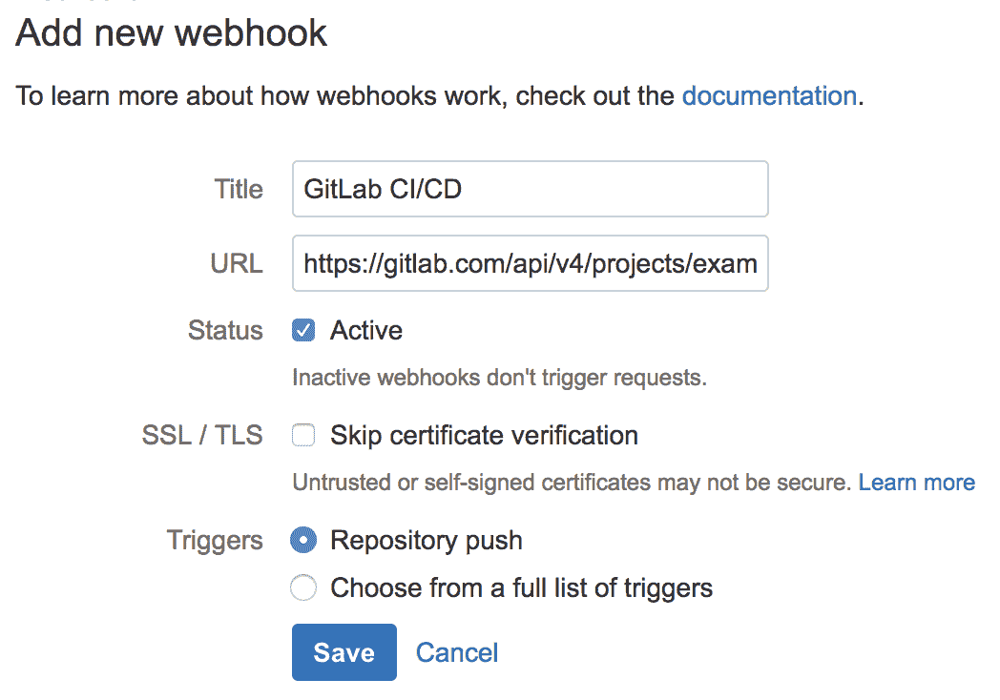
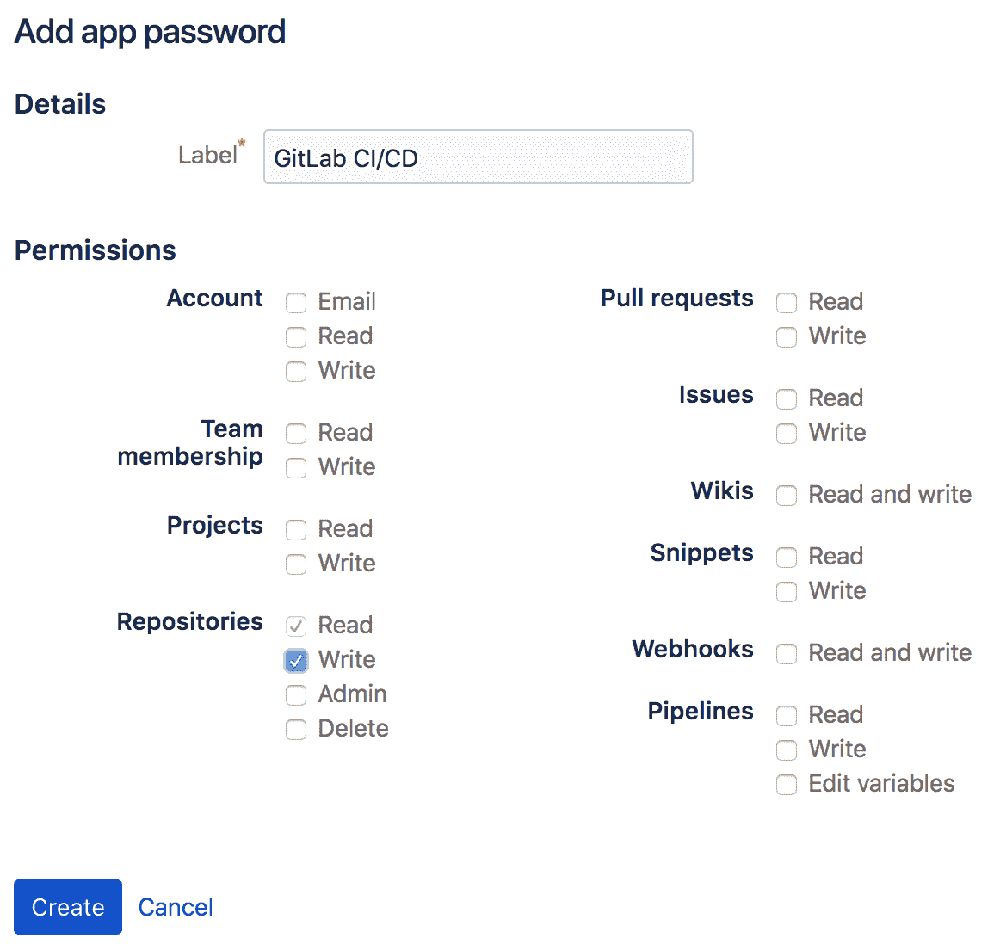

# Using GitLab CI/CD with a Bitbucket Cloud repository

> 原文：[https://docs.gitlab.com/ee/ci/ci_cd_for_external_repos/bitbucket_integration.html](https://docs.gitlab.com/ee/ci/ci_cd_for_external_repos/bitbucket_integration.html)

# Using GitLab CI/CD with a Bitbucket Cloud repository[](#using-gitlab-cicd-with-a-bitbucket-cloud-repository-premium "Permalink")

GitLab CI / CD 可以通过以下方式与 Bitbucket Cloud 一起使用：

1.  创建一个[CI / CD 项目](../../user/project/ci_cd_for_external_repo.html) .
2.  通过 URL 连接您的 Git 存储库.

要将 GitLab CI / CD 与 Bitbucket Cloud 存储库一起使用：

1.  在 GitLab 中**为外部** **仓库**创建一个**CI / CD** ，选择" **按 URL 进行仓库"**并创建项目.

    [](img/external_repository.png)

    GitLab 将导入存储库并启用[Pull Mirroring](../../user/project/repository/repository_mirroring.html#pulling-from-a-remote-repository-starter) .

2.  在 GitLab 中，创建具有`api`作用域的[个人访问令牌](../../user/profile/personal_access_tokens.html) . 这将用于验证来自 Web 钩子的请求，该请求将在 Bitbucket 中创建，以将新提交通知 GitLab.

3.  在 Bitbucket 中，从**"设置">" Webhooks"**中创建一个新的 Web 挂钩，以将新的提交通知 GitLab.

    应该使用我们刚刚生成的用于身份验证的个人访问令牌，将 Web 挂钩 URL 设置为 GitLab API 来触发拉镜像.

    ```
    https://gitlab.com/api/v4/projects/<PROJECT_ID>/mirror/pull?private_token=<PERSONAL_ACCESS_TOKEN> 
    ```

    网络挂钩触发器应设置为" Repository Push".

    [](img/bitbucket_webhook.png)

    保存后，通过将更改推送到您的 Bitbucket 存储库来测试 Web 挂钩.

4.  在 Bitbucket 中，从" **Bitbucket 设置">"应用程序密码"中**创建一个**应用** **程序密码，**以验证构建状态脚本设置来提交 Bitbucket 中的构建状态. 存储库写权限是必需的.

    [](img/bitbucket_app_password.png)

5.  在 GitLab 中，从**设置> CI / CD>环境变量中** ，添加变量以允许通过 Bitbucket API 与 Bitbucket 通信：

    `BITBUCKET_ACCESS_TOKEN` ：上面创建的 Bitbucket 应用密码.

    `BITBUCKET_USERNAME` ：Bitbucket 帐户的用户名.

    `BITBUCKET_NAMESPACE` ：如果您的 GitLab 和 Bitbucket 命名空间不同，请设置此项.

    `BITBUCKET_REPOSITORY` ：如果您的 GitLab 和 Bitbucket 项目名称不同，请设置此项.

6.  在 Bitbucket 中，添加脚本以将管道状态推送到 Bitbucket.

    > 注意：在 GitLab 中所做的更改将被 Bitbucket 在上游进行的任何更改所覆盖.

    创建一个文件`build_status`并在下面插入脚本，然后在终端中运行`chmod +x build_status`以使脚本可执行.

    ```
    #!/usr/bin/env bash

    # Push GitLab CI/CD build status to Bitbucket Cloud

    if [ -z "$BITBUCKET_ACCESS_TOKEN" ]; then echo "ERROR: BITBUCKET_ACCESS_TOKEN is not set"
    exit 1
    fi
    if [ -z "$BITBUCKET_USERNAME" ]; then echo "ERROR: BITBUCKET_USERNAME is not set"
    exit 1
    fi
    if [ -z "$BITBUCKET_NAMESPACE" ]; then echo "Setting BITBUCKET_NAMESPACE to $CI_PROJECT_NAMESPACE"
        BITBUCKET_NAMESPACE=$CI_PROJECT_NAMESPACE
    fi
    if [ -z "$BITBUCKET_REPOSITORY" ]; then echo "Setting BITBUCKET_REPOSITORY to $CI_PROJECT_NAME"
        BITBUCKET_REPOSITORY=$CI_PROJECT_NAME
    fi BITBUCKET_API_ROOT="https://api.bitbucket.org/2.0"
    BITBUCKET_STATUS_API="$BITBUCKET_API_ROOT/repositories/$BITBUCKET_NAMESPACE/$BITBUCKET_REPOSITORY/commit/$CI_COMMIT_SHA/statuses/build"
    BITBUCKET_KEY="ci/gitlab-ci/$CI_JOB_NAME"

    case "$BUILD_STATUS" in running)
       BITBUCKET_STATE="INPROGRESS"
       BITBUCKET_DESCRIPTION="The build is running!"
       ;;
    passed)
       BITBUCKET_STATE="SUCCESSFUL"
       BITBUCKET_DESCRIPTION="The build passed!"
       ;;
    failed)
       BITBUCKET_STATE="FAILED"
       BITBUCKET_DESCRIPTION="The build failed."
       ;;
    esac

    echo "Pushing status to $BITBUCKET_STATUS_API..."
    curl --request POST $BITBUCKET_STATUS_API \
    --user $BITBUCKET_USERNAME:$BITBUCKET_ACCESS_TOKEN \
    --header "Content-Type:application/json" \
    --silent \
    --data "{ \"state\": \"$BITBUCKET_STATE\", \"key\": \"$BITBUCKET_KEY\", \"description\": \"$BITBUCKET_DESCRIPTION\",\"url\": \"$CI_PROJECT_URL/-/jobs/$CI_JOB_ID\" }" 
    ```

7.  仍在 Bitbucket 中，创建一个`.gitlab-ci.yml`文件以使用该脚本将管道成功与失败推送到 Bitbucket.

    ```
    stages:
      - test
      - ci_status

    unit-tests:
      script:
        - echo "Success. Add your tests!"

    success:
      stage: ci_status
      before_script:
        - ""
      after_script:
        - ""
      script:
        - BUILD_STATUS=passed BUILD_KEY=push ./build_status
      when: on_success

    failure:
      stage: ci_status
      before_script:
        - ""
      after_script:
        - ""
      script:
        - BUILD_STATUS=failed BUILD_KEY=push ./build_status
      when: on_failure 
    ```

现在已将 GitLab 配置为从 Bitbucket 镜像更改，运行在`.gitlab-ci.yml`配置的 CI / CD 管道，并将状态推送到 Bitbucket.