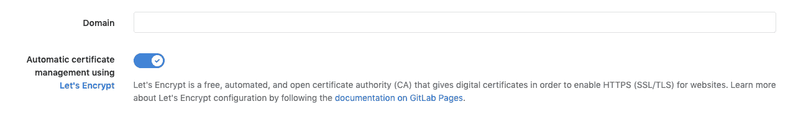

# GitLab Pages integration with Let's Encrypt

> 原文：[https://docs.gitlab.com/ee/user/project/pages/custom_domains_ssl_tls_certification/lets_encrypt_integration.html](https://docs.gitlab.com/ee/user/project/pages/custom_domains_ssl_tls_certification/lets_encrypt_integration.html)

*   [Requirements](#requirements)
*   [Enabling Let’s Encrypt integration for your custom domain](#enabling-lets-encrypt-integration-for-your-custom-domain)
*   [Troubleshooting](#troubleshooting)
    *   [Error “Something went wrong while obtaining the Let’s Encrypt certificate”](#error-something-went-wrong-while-obtaining-the-lets-encrypt-certificate)
    *   [Message “GitLab is obtaining a Let’s Encrypt SSL certificate for this domain. This process can take some time. Please try again later.” hangs for more than an hour](#message-gitlab-is-obtaining-a-lets-encrypt-ssl-certificate-for-this-domain-this-process-can-take-some-time-please-try-again-later-hangs-for-more-than-an-hour)

# GitLab Pages integration with Let’s Encrypt

在 GitLab 12.1 中[引入](https://gitlab.com/gitlab-org/gitlab-foss/-/issues/28996) . 对于 GitLab 12.1 之前的版本，请参见[手册"让我们加密"说明](../lets_encrypt_for_gitlab_pages.html) .

GitLab Pages 与 Let's Encrypt（LE）的集成使您可以将 LE 证书用于具有自定义域的 Pages 网站，而不必麻烦自己发行和更新它们. GitLab 现成的为您服务.

[Let's Encrypt](https://letsencrypt.org)是一个免费，自动化和开源的证书颁发机构.

**警告：**此功能仅涵盖**自定义域的**证书，而不包含运行[Pages 守护程序](../../../../administration/pages/index.html)所需的通配符证书 . 在[此问题中](https://gitlab.com/gitlab-org/omnibus-gitlab/-/issues/3342)跟踪通配符证书的生成.

## Requirements

在为您的域启用自动配置 SSL 证书之前，请确保您具有：

*   创建一个[项目](../getting_started_part_two.html)在 GitLab 包含您的网站的源代码.
*   获取域（ `example.com` ）并添加一个[DNS 条目，](index.html)将其指向您的 Pages 网站.
*   [将您的域添加到您的 Pages 项目](index.html#1-add-a-custom-domain-to-pages)并验证您的所有权.
*   确认您的网站已启动并且正在运行，可以通过您的自定义域进行访问.

**注意：** GitLab 的"让我们加密"集成已启用，并在 GitLab.com 上可用. 对于**自我管理的** GitLab 实例，请确保您的管理员已[启用它](../../../../administration/pages/index.html#lets-encrypt-integration) .

## Enabling Let’s Encrypt integration for your custom domain

满足要求后，启用"让我们加密"集成：

1.  导航到项目的**"设置">"页面"** .
2.  找到您的域，然后单击**详细信息** .
3.  点击右上角的**编辑** .
4.  通过**使用 Let's Encrypt**切换**自动证书管理来**启用 Let's Encrypt 集成：

    

5.  Click **保存更改**.

启用后，GitLab 将获得 LE 证书并将其添加到关联的 Pages 域中. 它也会由 GitLab 自动更新.

> **Notes:**
> 
> *   颁发证书和更新 Pages 配置**可能需要一个小时** .
> *   如果您在域设置中已经具有 SSL 证书，它将继续工作，直到被 Let's Encrypt 的证书替换为止.

## Troubleshooting

### Error “Something went wrong while obtaining the Let’s Encrypt certificate”

在 GitLab 13.0 中[引入](https://gitlab.com/gitlab-org/gitlab/-/issues/30146) .

如果您遇到错误， **则在获取 Let's Encrypt 证书时出了点问题** ，您可以尝试按照以下步骤再次获取证书：

1.  转到项目的**设置>页面** .
2.  在您的域上单击" **编辑** ".
3.  Click **Retry**.
4.  如果您仍然看到相同的错误：
    1.  请确保您已正确设置只有一个`CNAME`或`A` DNS 记录为您的域.
    2.  确保您的域**没有** `AAAA` DNS 记录.
    3.  如果您的域或任何更高级别的域都有`CAA` DNS 记录，请确保[其中包含`letsencrypt.org`](https://letsencrypt.org/docs/caa/) .
    4.  确保[您的域已验证](index.html#1-add-a-custom-domain-to-pages) .
    5.  转到步骤 1\.

### Message “GitLab is obtaining a Let’s Encrypt SSL certificate for this domain. This process can take some time. Please try again later.” hangs for more than an hour

如果您启用了 Let's Encrypt 集成，但是一个小时后缺少证书，则会看到以下消息：" GitLab 正在为此域获取 Let's Encrypt SSL 证书. 此过程可能需要一些时间. 请稍后再试."，请按照以下步骤尝试删除并再次为 GitLab 页面添加域：

1.  转到项目的**设置>页面** .
2.  在您的域上单击**删除** .
3.  [Add the domain again and verify it](index.html#1-add-a-custom-domain-to-pages).
4.  [Enable Let’s Encrypt integration for your domain](#enabling-lets-encrypt-integration-for-your-custom-domain).
5.  如果一段时间后仍然看到相同的消息：
    1.  请确保您已正确设置只有一个`CNAME`或`A` DNS 记录为您的域.
    2.  确保您的域**没有** `AAAA` DNS 记录.
    3.  如果您的域或任何更高级别的域都有`CAA` DNS 记录，请确保[其中包含`letsencrypt.org`](https://letsencrypt.org/docs/caa/) .
    4.  转到步骤 1\.