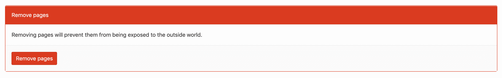

# Exploring GitLab Pages

> 原文：[https://docs.gitlab.com/ee/user/project/pages/introduction.html](https://docs.gitlab.com/ee/user/project/pages/introduction.html)

*   [GitLab Pages requirements](#gitlab-pages-requirements)
*   [GitLab Pages on GitLab.com](#gitlab-pages-on-gitlabcom)
*   [Example projects](#example-projects)
*   [Custom error codes Pages](#custom-error-codes-pages)
*   [Redirects in GitLab Pages](#redirects-in-gitlab-pages)
*   [GitLab Pages Access Control](#gitlab-pages-access-control-core)
*   [Unpublishing your Pages](#unpublishing-your-pages)
*   [Limitations](#limitations)
*   [Specific configuration options for Pages](#specific-configuration-options-for-pages)
    *   [`.gitlab-ci.yml` for plain HTML websites](#gitlab-ciyml-for-plain-html-websites)
    *   [`.gitlab-ci.yml` for a static site generator](#gitlab-ciyml-for-a-static-site-generator)
    *   [`.gitlab-ci.yml` for a repository where there’s also actual code](#gitlab-ciyml-for-a-repository-where-theres-also-actual-code)
    *   [Serving compressed assets](#serving-compressed-assets)
    *   [Resolving ambiguous URLs](#resolving-ambiguous-urls)
*   [Frequently Asked Questions](#frequently-asked-questions)
    *   [Can I download my generated pages?](#can-i-download-my-generated-pages)
    *   [Can I use GitLab Pages if my project is private?](#can-i-use-gitlab-pages-if-my-project-is-private)
    *   [Do I need to create a user/group website before creating a project website?](#do-i-need-to-create-a-usergroup-website-before-creating-a-project-website)
*   [Known issues](#known-issues)

# Exploring GitLab Pages[](#exploring-gitlab-pages "Permalink")

本文档是用户指南，用于探索 GitLab Pages 提供的选项和设置.

首先要熟悉 GitLab 页面：

*   阅读[有关 GitLab Pages](index.html#overview)的[介绍](index.html#overview) .
*   Learn [how to get started with Pages](index.html#getting-started).
*   在[管理员文档中](../../../administration/pages/index.html)了解如何在整个 GitLab 实例上启用 GitLab 页面.

## GitLab Pages requirements[](#gitlab-pages-requirements "Permalink")

简而言之，这是您需要在 GitLab 页面中上传网站的内容：

1.  实例的域：用于 GitLab 页面的域名（询问管理员）.
2.  GitLab CI / CD：一个`.gitlab-ci.yml`文件，在存储库的根目录中有一个名为[`pages`](../../../ci/yaml/README.html#pages)的特定作业.
3.  您网站存储库中一个名为`public`的目录，其中包含要发布的内容.
4.  为项目启用了 GitLab Runner.

## GitLab Pages on GitLab.com[](#gitlab-pages-on-gitlabcom "Permalink")

如果您使用[GitLab.com](#gitlab-pages-on-gitlabcom)上的[GitLab 页面](#gitlab-pages-on-gitlabcom)来托管您的网站，则：

*   The domain name for GitLab Pages on GitLab.com is `gitlab.io`.
*   自定义域和 TLS 支持已启用.
*   共享运行器默认情况下处于启用状态，免费提供，可用于构建您的网站. 如果您愿意，仍然可以携带自己的跑步者.

## Example projects[](#example-projects "Permalink")

访问[GitLab 页面组](https://gitlab.com/groups/pages)以获得示例项目的完整列表. 欢迎捐款.

## Custom error codes Pages[](#custom-error-codes-pages "Permalink")

您可以通过在将包含在工件中的`public/`目录的根目录中分别创建`403.html`和`404.html`文件来提供自己的 403 和 404 错误页面. 通常，这是项目的根目录，但是根据您的静态生成器配置，它可能有所不同.

如果是`404.html` ，则有不同的方案. 例如：

*   如果您使用项目 Pages（在`/projectname/` ）并尝试访问`/projectname/non/existing_file` ，则 GitLab Pages 将尝试首先提供`/projectname/404.html` ，然后提供`/404.html` .
*   如果您使用用户/组页面（在`/`下提供）并尝试访问`/non/existing_file` GitLab Pages 将尝试提供`/404.html` .
*   如果您使用自定义域并尝试访问`/non/existing_file` ，则 GitLab Pages 将尝试仅提供`/404.html` .

## Redirects in GitLab Pages[](#redirects-in-gitlab-pages "Permalink")

由于您不能使用任何自定义服务器配置文件（例如`.htaccess`或任何`.conf`文件），因此，如果要将页面重定向到其他位置，可以使用[HTTP meta refresh 标签](https://en.wikipedia.org/wiki/Meta_refresh) .

一些静态网站生成器提供了该功能的插件，因此您不必手动创建和编辑 HTML 文件. 例如，Jekyll 具有[redirect-from 插件](https://github.com/jekyll/jekyll-redirect-from) .

## GitLab Pages Access Control[](#gitlab-pages-access-control-core "Permalink")

要限制对您网站的访问，请启用[GitLab 页面访问控制](pages_access_control.html) .

## Unpublishing your Pages[](#unpublishing-your-pages "Permalink")

如果您需要清除 Pages 内容，可以通过右上角的齿轮图标进入项目设置，然后导航至**Pages** . 点击**删除页面**按钮，您的页面网站将被删除.

[](img/remove_pages.png)

## Limitations[](#limitations "Permalink")

在 GitLab 实例的常规域（ `*.example.io` ）下使用 Pages 时， *不能*将 HTTPS 与子子域一起使用. 这意味着，如果你的用户名或组名称中包含一个圆点，例如`foo.bar` ，域`https://foo.bar.example.io`将*无法*正常工作. 这是[HTTP Over TLS 协议](https://tools.ietf.org/html/rfc2818#section-3.1)的限制. 如果您不将 HTTP 重定向到 HTTPS，HTTP 页面将继续工作.

GitLab 网页[**不**支持组为网站分组](../../group/subgroups/index.html#limitations) . 您只能创建最高级别的群组网站.

## Specific configuration options for Pages[](#specific-configuration-options-for-pages "Permalink")

了解如何针对特定用例设置 GitLab CI / CD.

### `.gitlab-ci.yml` for plain HTML websites[](#gitlab-ciyml-for-plain-html-websites "Permalink")

假设您的存储库包含以下文件：

```
├── index.html
├── css
│   └── main.css
└── js
    └── main.js 
```

然后，下面的`.gitlab-ci.yml`示例仅将所有文件从项目的根目录移至`public/`目录. `.public`解决方法是， `cp`不会在无限循环中将`public/`复制到自身：

```
pages:
  script:
    - mkdir .public
    - cp -r * .public
    - mv .public public
  artifacts:
    paths:
      - public
  only:
    - master 
```

### `.gitlab-ci.yml` for a static site generator[](#gitlab-ciyml-for-a-static-site-generator "Permalink")

请参阅本文档，以获取[分步指南](getting_started/pages_from_scratch.html) .

### `.gitlab-ci.yml` for a repository where there’s also actual code[](#gitlab-ciyml-for-a-repository-where-theres-also-actual-code "Permalink")

请记住，默认情况下，GitLab 页面是分支/标签不可知的，它们的部署仅取决于您在`.gitlab-ci.yml`指定`.gitlab-ci.yml` . 每当将新的提交推送到专门用于页面的分支时，就可以使用[`only`参数](../../../ci/yaml/README.html#onlyexcept-basic)限制`pages`作业.

这样，您可以将项目的代码保存在`master`分支中，并使用一个孤儿分支（将其命名为`pages` ）来托管您的静态生成器站点.

您可以这样创建一个新的空分支：

```
git checkout --orphan pages 
```

在这个新分支上进行的第一次提交将没有父母，这将是与所有其他分支和提交完全脱节的新历史的根源. 在`pages`分支中推送静态生成器的源文件.

以下是`.gitlab-ci.yml`的副本，其中最重要的一行是最后一行，指定要执行`pages`分支中的所有`pages` ：

```
image: ruby:2.6

pages:
  script:
    - gem install jekyll
    - jekyll build -d public/
  artifacts:
    paths:
      - public
  only:
    - pages 
```

请参见一个示例，该示例在[`master`分支](https://gitlab.com/pages/jekyll-branched/tree/master)中具有不同的文件，而 Jekyll 的源文件在[`pages`分支中](https://gitlab.com/pages/jekyll-branched/tree/pages) ，该[分支](https://gitlab.com/pages/jekyll-branched/tree/pages)还包含`.gitlab-ci.yml` .

### Serving compressed assets[](#serving-compressed-assets "Permalink")

大多数现代的浏览器都支持下载压缩格式的文件. 通过减小文件大小，可以加快下载速度.

Pages 将提供未压缩的文件之前，将检查是否存在扩展名为`.gz`的相同文件. 如果支持，并且浏览器支持接收压缩文件，它将使用该版本而不是未压缩版本.

要利用此功能，您上传到页面的工件应具有以下结构：

```
public/
├─┬ index.html
│ └ index.html.gz
│
├── css/
│   └─┬ main.css
│     └ main.css.gz
│
└── js/
    └─┬ main.js
      └ main.js.gz 
```

这可以通过在`.gitlab-ci.yml`页面作业中包含以下`script:`来实现：

```
pages:
  # Other directives
  script:
    # Build the public/ directory first
    - find public -type f -regex '.*\.\(htm\|html\|txt\|text\|js\|css\)$' -exec gzip -f -k {} \; 
```

通过预压缩文件并在工件中包括两个版本，Pages 可以处理对压缩和未压缩内容的请求，而无需按需压缩文件.

### Resolving ambiguous URLs[](#resolving-ambiguous-urls "Permalink")

在 GitLab 11.8 中[引入](https://gitlab.com/gitlab-org/gitlab-pages/-/issues/95)

当接收到不包含扩展名的 URL 的请求时，GitLab Pages 会假设要提供哪些文件.

考虑使用以下文件部署的 Pages 站点：

```
public/
├─┬ index.html
│ ├ data.html
│ └ info.html
│
├── data/
│   └── index.html
├── info/
│   └── details.html
└── other/
    └── index.html 
```

页面支持通过几个不同的 URL 来访问每个文件. 特别是，如果 URL 仅指定目录，它将始终寻找`index.html`文件. 如果该 URL 引用了一个不存在的文件，但是将`.html`添加到该 URL 中会导致该文件*确实*存在，将改为提供该文件. 以下是在上述 Pages 网站上发生的情况的一些示例：

| URL path | HTTP 响应 | 文件送达 |
| --- | --- | --- |
| `/` | `200 OK` | `public/index.html` |
| `/index.html` | `200 OK` | `public/index.html` |
| `/index` | `200 OK` | `public/index.html` |
| `/data` | `200 OK` | `public/data/index.html` |
| `/data/` | `200 OK` | `public/data/index.html` |
| `/data.html` | `200 OK` | `public/data.html` |
| `/info` | `200 OK` | `public/info.html` |
| `/info/` | `200 OK` | `public/info.html` |
| `/info.html` | `200 OK` | `public/info.html` |
| `/info/details` | `200 OK` | `public/info/details.html` |
| `/info/details.html` | `200 OK` | `public/info/details.html` |
| `/other` | `302 Found` | `public/other/index.html` |
| `/other/` | `200 OK` | `public/other/index.html` |
| `/other/index` | `200 OK` | `public/other/index.html` |
| `/other/index.html` | `200 OK` | `public/other/index.html` |

**注意：**当存在`public/data/index.html`时，对于`/data`和`/data/` URL 路径，其优先于`public/data.html`文件.

## Frequently Asked Questions[](#frequently-asked-questions "Permalink")

### Can I download my generated pages?[](#can-i-download-my-generated-pages "Permalink")

当然. 您需要做的就是从作业页面下载工件存档.

### Can I use GitLab Pages if my project is private?[](#can-i-use-gitlab-pages-if-my-project-is-private "Permalink")

是. GitLab Pages 不在乎将项目的可见性级别设置为私有，内部还是公共.

### Do I need to create a user/group website before creating a project website?[](#do-i-need-to-create-a-usergroup-website-before-creating-a-project-website "Permalink")

不，你没有. 您可以先创建您的项目，然后将在`http(s)://namespace.example.io/projectname`下对其进行访问.

## Known issues[](#known-issues "Permalink")

有关已知问题的列表，请访问 GitLab 的[公共问题跟踪器](https://gitlab.com/gitlab-org/gitlab/-/issues?label_name[]=Category:Pages) .