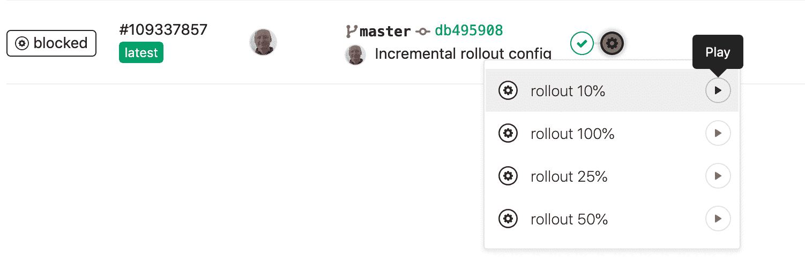
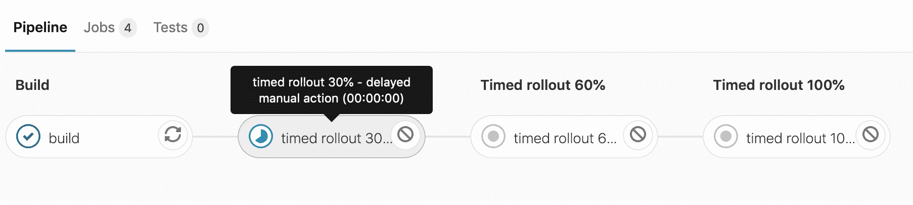

# Incremental Rollouts with GitLab CI/CD

> 原文：[https://docs.gitlab.com/ee/ci/environments/incremental_rollouts.html](https://docs.gitlab.com/ee/ci/environments/incremental_rollouts.html)

*   [Manual Rollouts](#manual-rollouts)
*   [Timed Rollouts](#timed-rollouts)
*   [Blue-Green Deployment](#blue-green-deployment)

# Incremental Rollouts with GitLab CI/CD[](#incremental-rollouts-with-gitlab-cicd "Permalink")

在对应用程序进行更改时，可以将生产更改仅发布到 Kubernetes 吊舱的一部分，作为降低风险的策略. 通过逐步发布生产更改，可以监视错误率或性能下降，并且如果没有问题，则可以更新所有吊舱.

manbetx 客户端打不开支持使用增量卷展到 Kubernetes 生产系统的手动触发和定时卷展. 使用"手动卷展"时，将手动触发每个吊舱的释放，而在"定时卷展"中，默认的暂停时间为 5 分钟，然后按批次进行释放. 也可以在暂停时间到期之前手动触发定时启动.

手动和定时卷展栏自动包含在由[AutoDevOps](../../topics/autodevops/index.html)控制的项目中，但也可以通过 GitLab CI / CD 在`.gitlab-ci.yml`配置文件中`.gitlab-ci.yml`配置.

可以使用" [持续交付"](../introduction/index.html#continuous-delivery)方法来实现手动触发的部署，而定时部署不需要干预，并且可以作为" [持续部署"](../introduction/index.html#continuous-deployment)策略的一部分. 您还可以通过自动部署应用程序的方式将两者结合在一起，除非最终在必要时进行手动干预.

我们创建了示例应用程序来演示这三个选项，您可以将其用作构建自己的示例：

*   [Manual incremental rollouts](https://gitlab.com/gl-release/incremental-rollout-example/blob/master/.gitlab-ci.yml)
*   [Timed incremental rollouts](https://gitlab.com/gl-release/timed-rollout-example/blob/master/.gitlab-ci.yml)
*   [Both manual and timed rollouts](https://gitlab.com/gl-release/incremental-timed-rollout-example/blob/master/.gitlab-ci.yml)

## Manual Rollouts[](#manual-rollouts "Permalink")

在 GitLab 10.8 中[引入](https://gitlab.com/gitlab-org/gitlab/-/issues/5415) .

可以将 GitLab 配置为通过`.gitlab-ci.yml`手动进行增量部署. 手动配置允许对该功能进行更多控制. 增量部署的步骤取决于为部署定义的 Pod 数量，这些 Pod 是在创建 Kubernetes 集群时配置的.

例如，如果您的应用程序有 10 个容器，并且运行了 10％的部署作业，则该应用程序的新实例将被部署到单个容器中，而其余 9 个将显示前一个实例.

首先，我们[将模板定义为手动](https://gitlab.com/gl-release/incremental-rollout-example/blob/master/.gitlab-ci.yml#L100-103) ：

```
.manual_rollout_template: &manual_rollout_template
  <<: *rollout_template
  stage: production
  when: manual 
```

然后，我们[定义每个步骤的推出量](https://gitlab.com/gl-release/incremental-rollout-example/blob/master/.gitlab-ci.yml#L152-155) ：

```
rollout 10%:
  <<: *manual_rollout_template
  variables:
    ROLLOUT_PERCENTAGE: 10 
```

When the jobs are built, a **play** button will appear next to the job’s name. Click the **play** button to release each stage of pods. You can also rollback by running a lower percentage job. Once 100% is reached, you cannot roll back using this method. It is still possible to roll back by redeploying the old version using the **Rollback** button on the environment page.

[](img/incremental_rollouts_play_v12_7.png)

一个[可部署的应用程序](https://gitlab.com/gl-release/incremental-rollout-example)可用，演示了手动触发的增量部署.

## Timed Rollouts[](#timed-rollouts "Permalink")

在 GitLab 11.4 中[引入](https://gitlab.com/gitlab-org/gitlab/-/issues/7545) .

定时部署的行为与手动部署的行为相同，不同之处在于，每个作业在部署前都会延迟几分钟. 单击作业将显示倒计时.

[](img/timed_rollout_v12_7.png)

可以将此功能与手动增量部署相结合，以便作业倒计时然后部署.

首先，我们[将模板定义为 timed](https://gitlab.com/gl-release/timed-rollout-example/blob/master/.gitlab-ci.yml#L86-89) ：

```
.timed_rollout_template: &timed_rollout_template
  <<: *rollout_template
  when: delayed
  start_in: 1 minutes 
```

我们可以使用`start_in`键定义延迟时间：

```
start_in: 1 minutes 
```

然后，我们[定义每个步骤的推出量](https://gitlab.com/gl-release/timed-rollout-example/blob/master/.gitlab-ci.yml#L97-101) ：

```
timed rollout 30%:
  <<: *timed_rollout_template
  stage: timed rollout 30%
  variables:
    ROLLOUT_PERCENTAGE: 30 
```

一个[可部署的应用程序](https://gitlab.com/gl-release/timed-rollout-example)可用， [演示了定时部署的配置](https://gitlab.com/gl-release/timed-rollout-example/blob/master/.gitlab-ci.yml#L86-95) .

## Blue-Green Deployment[](#blue-green-deployment "Permalink")

有时也称为 A / B 部署或红黑色部署，此技术用于减少部署期间的停机时间和风险. 当与增量推出结合使用时，您可以最大程度地减少导致问题的部署的影响.

使用这种技术，有两种部署方式（"蓝色"和"绿色"，但是可以使用任何命名）. 在任何给定时间，这些部署中只有一个处于活动状态，除非在增量部署期间.

例如，您的蓝色部署当前可以在生产中处于活动状态，而绿色部署"处于活动状态"可以进行测试，但不能部署到生产中. 如果发现问题，则可以在不影响生产部署的情况下更新绿色部署（当前为蓝色）. 如果测试没有问题，则将生产切换到绿色部署，并且蓝色现在可用于测试下一个版本.

此过程减少了停机时间，因为无需停止生产部署即可切换到其他部署. 两种部署都并行运行，并且可以随时切换到.

提供了一个[示例可部署应用程序](https://gitlab.com/gl-release/blue-green-example) ，带有一个[`gitlab-ci.yml` CI / CD 配置文件](https://gitlab.com/gl-release/blue-green-example/blob/master/.gitlab-ci.yml) ，该[文件](https://gitlab.com/gl-release/blue-green-example/blob/master/.gitlab-ci.yml)演示了蓝绿色的部署.