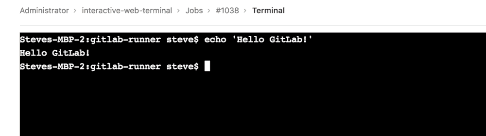
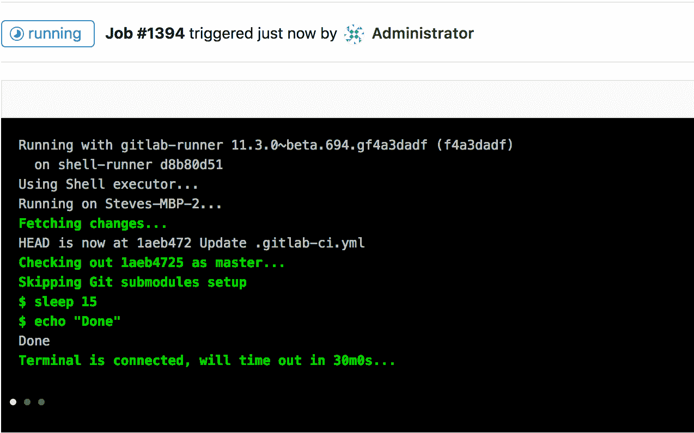

# Interactive Web Terminals

> 原文：[https://docs.gitlab.com/ee/ci/interactive_web_terminal/](https://docs.gitlab.com/ee/ci/interactive_web_terminal/)

*   [Configuration](#configuration)
*   [Debugging a running job](#debugging-a-running-job)
*   [Interactive Web Terminals for the Web IDE](#interactive-web-terminals-for-the-web-ide)

# Interactive Web Terminals

在 GitLab 11.3 中[引入](https://gitlab.com/gitlab-org/gitlab-foss/-/issues/50144) .

交互式 Web 终端使用户可以访问 GitLab 中的终端，以为其 CI 管道运行一次性命令. 由于这使用户可以通过外壳访问[GitLab Runner](https://docs.gitlab.com/runner/)部署环境，因此采取了一些[安全预防](../../administration/integration/terminal.html#security)措施来保护用户.

**注意：** [GitLab.com 上的共享跑步者](../quick_start/README.html#shared-runners)不提供交互式 Web 终端. 请遵循[此问题](https://gitlab.com/gitlab-org/gitlab/-/issues/24674)以获取增加支持方面的进展. 对于在 GitLab.com 上托管的组和项目，使用自己的组或项目运行器时可以使用交互式 Web 终端.

## Configuration

为了使交互式 Web 终端正常工作，需要配置两件事：

*   跑步者需要[正确配置`[session_server]`](https://docs.gitlab.com/runner/configuration/advanced-configuration.html)
*   如果您在 GitLab 实例上使用反向代理，则需要[启用](../../administration/integration/terminal.html#enabling-and-disabling-terminal-support) Web 终端

**注意：** [`gitlab-runner` Helm chart](https://docs.gitlab.com/charts/charts/gitlab/gitlab-runner/index.html)尚不支持交互式 Web 终端，但[已计划](https://gitlab.com/gitlab-org/charts/gitlab-runner/-/issues/79)支持.

## Debugging a running job

**注意：**并非所有执行程序都[受支持](https://docs.gitlab.com/runner/executors/) .**注意：**构建脚本完成后， `docker` executor 不会继续运行. 届时，终端将自动断开连接，并且不会等待用户完成操作. 请关注[此问题，](https://gitlab.com/gitlab-org/gitlab-runner/-/issues/3605)以获取有关改进此行为的更新.

有时，当一项作业正在运行时，事情并没有按您期望的那样进行，如果可以有一个外壳来帮助调试，这将很有帮助. 运行作业时，在右侧面板上可以看到一个`debug`按钮，它将打开当前作业的终端.

单击后，新选项卡将打开到终端页面，您可以在其中访问终端并键入命令，如普通的 shell.

如果您打开终端并且作业已完成其任务，则终端将在[`[session_server].session_timeout`](https://docs.gitlab.com/runner/configuration/advanced-configuration.html)配置的持续时间内阻止作业完成，直到关闭终端窗口.

## Interactive Web Terminals for the Web IDE

阅读 Web IDE 文档，以了解如何[通过 Web IDE](../../user/project/web_ide/index.html#interactive-web-terminals-for-the-web-ide)运行[交互式终端](../../user/project/web_ide/index.html#interactive-web-terminals-for-the-web-ide) .