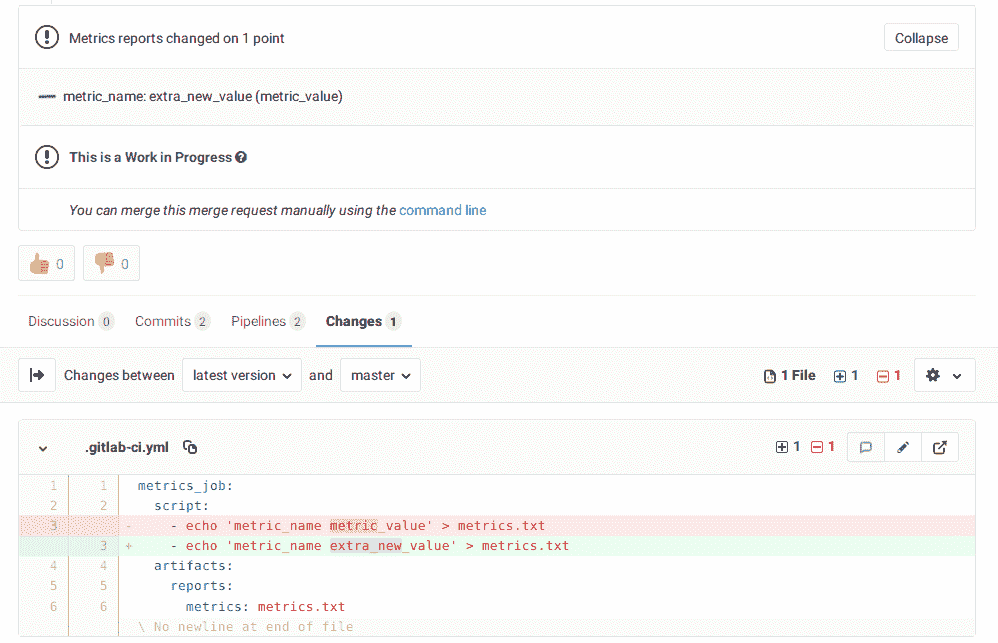

# Metrics Reports

> 原文：[https://docs.gitlab.com/ee/ci/metrics_reports.html](https://docs.gitlab.com/ee/ci/metrics_reports.html)

*   [Overview](#overview)
*   [Use cases](#use-cases)
*   [How it works](#how-it-works)
*   [How to set it up](#how-to-set-it-up)
*   [Advanced Example](#advanced-example)

# Metrics Reports[](#metrics-reports-premium "Permalink")

在[GitLab Premium](https://about.gitlab.com/pricing/) 11.10 中[引入](https://gitlab.com/gitlab-org/gitlab/-/issues/9788) . 需要 GitLab Runner 11.10 及更高版本.

## Overview[](#overview "Permalink")

GitLab 提供了许多用于[合并请求](../user/project/merge_requests/index.html)的出色报告工具[-JUnit 报告](junit_test_reports.html) ， [代码质量](../user/project/merge_requests/code_quality.html) ，性能测试等.尽管 JUnit 是用于"通过"或"失败"的测试的出色开放框架，但查看其他类型的测试也很重要.给定更改的指标.

您可以将作业配置为使用自定义指标报告，并且 GitLab 会在合并请求上显示报告，以便更轻松，更快速地识别更改而无需检查整个日志.

[](img/metrics_reports_v13_0.png)

## Use cases[](#use-cases "Permalink")

考虑以下可以利用指标报告的数据示例：

1.  内存使用情况
2.  负载测试结果
3.  代码复杂度
4.  代码覆盖率统计

## How it works[](#how-it-works "Permalink")

从指标报告中读取指标（默认值： `metrics.txt` ）. 它们被解析并显示在 MR 小部件中.

所有值都视为字符串，并且使用字符串比较来查找来自以下各项的最新可用`metrics`工件之间的差异：

*   `master`
*   功能分支

## How to set it up[](#how-to-set-it-up "Permalink")

添加一个创建[指标报告](pipelines/job_artifacts.html#artifactsreportsmetrics-premium)的作业（默认文件名： `metrics.txt` ）. 该文件应符合[OpenMetrics](https://openmetrics.io/)格式.

例如：

```
metrics:
  script:
    - echo 'metric_name metric_value' > metrics.txt
  artifacts:
    reports:
      metrics: metrics.txt 
```

## Advanced Example[](#advanced-example "Permalink")

OpenMetrics 文本文件的高级示例（来自[Prometheus 文档](https://github.com/prometheus/docs/blob/master/content/docs/instrumenting/exposition_formats.md#text-format-example) ）在合并请求小部件中呈现为：

[](img/metrics_reports_advanced_v13_0.png)