# CI/CD pipelines

> 原文：[https://docs.gitlab.com/ee/ci/pipelines/](https://docs.gitlab.com/ee/ci/pipelines/)

*   [Types of pipelines](#types-of-pipelines)
*   [Configure a pipeline](#configure-a-pipeline)
    *   [View pipelines](#view-pipelines)
    *   [Run a pipeline manually](#run-a-pipeline-manually)
    *   [Run a pipeline by using a URL query string](#run-a-pipeline-by-using-a-url-query-string)
    *   [Add manual interaction to your pipeline](#add-manual-interaction-to-your-pipeline)
        *   [Start multiple manual actions in a stage](#start-multiple-manual-actions-in-a-stage)
    *   [Delete a pipeline](#delete-a-pipeline)
    *   [Pipeline quotas](#pipeline-quotas)
        *   [How pipeline duration is calculated](#how-pipeline-duration-is-calculated)
    *   [Pipeline security on protected branches](#pipeline-security-on-protected-branches)
*   [View jobs in a pipeline](#view-jobs-in-a-pipeline)
    *   [See why a job failed](#see-why-a-job-failed)
    *   [The order of jobs in a pipeline](#the-order-of-jobs-in-a-pipeline)
    *   [Group jobs in a pipeline](#group-jobs-in-a-pipeline)
    *   [Specifying variables when running manual jobs](#specifying-variables-when-running-manual-jobs)
    *   [Delay a job](#delay-a-job)
    *   [Expand and collapse job log sections](#expand-and-collapse-job-log-sections)
        *   [Custom collapsible sections](#custom-collapsible-sections)
*   [Visualize pipelines](#visualize-pipelines)
    *   [Regular pipeline graphs](#regular-pipeline-graphs)
    *   [Pipeline mini graphs](#pipeline-mini-graphs)
    *   [Pipeline success and duration charts](#pipeline-success-and-duration-charts)
    *   [Pipeline badges](#pipeline-badges)
*   [Pipelines API](#pipelines-api)
*   [Troubleshooting `fatal: reference is not a tree:`](#troubleshooting-fatal-reference-is-not-a-tree)

# CI/CD pipelines[](#cicd-pipelines "Permalink")

在 GitLab 8.8 中引入.

**提示：**观看["精通持续软件开发"](https://about.gitlab.com/webcast/mastering-ci-cd/)网络广播，以观看 GitLab CI / CD 管道的全面演示.

管道是持续集成，交付和部署的顶级组件.

Pipelines comprise:

*   作业，定义*要做*什么. 例如，编译或测试代码的作业.
*   阶段，定义*何时*运行作业. 例如，在编译代码的阶段之后运行测试的阶段.

作业由[Runners](../runners/README.html)执行. 如果有足够的并发运行程序，则可以并行执行同一阶段中的多个作业.

如果一个阶段中的*所有*作业*都*成功，则管道将继续进行下一个阶段.

If *any* job in a stage fails, the next stage is not (usually) executed and the pipeline ends early.

通常，管道是自动执行的，创建后就无需干预. 但是，有时您还可以手动与管道进行交互.

典型的管道可能包含四个阶段，按以下顺序执行：

*   一个`build`阶段，其工作称为`compile` .
*   一个`test`阶段，具有两个作业，分别称为`test1`和`test2` .
*   `staging`阶段，其工作称为`deploy-to-stage` .
*   `production`阶段，其工作称为`deploy-to-prod` .

**注意：**如果您有[从 GitLab 提取镜像的存储库，则](../../user/project/repository/repository_mirroring.html#pulling-from-a-remote-repository-starter)可能需要在项目的**"设置">"存储库">"从远程存储库中提取">"触发管道更新镜像"中**启用管道触发.

## Types of pipelines[](#types-of-pipelines "Permalink")

管道可以通过许多不同的方式进行配置：

*   [基本管道](pipeline_architectures.html#basic-pipelines)在每个阶段同时运行所有内容，随后是下一阶段.
*   [定向非循环图管线（DAG）管线](../directed_acyclic_graph/index.html)基于作业之间的关系，并且比基本管线运行得更快.
*   [多项目管道](../multi_project_pipelines.html)将不同项目的[管道](../multi_project_pipelines.html)组合在一起.
*   [父子管道](../parent_child_pipelines.html)将复杂的管道分解为一个父管道，该管道可以触发多个子管道，这些子管道都在同一项目中并以相同的 SHA 运行.
*   [合并请求的管道仅针对合并请求](../merge_request_pipelines/index.html)运行（而不是针对每次提交）.
*   [合并结果管道](../merge_request_pipelines/pipelines_for_merged_results/index.html)是合并请求管道，其作用就像源分支的更改已被合并到目标分支一样.
*   [合并列车](../merge_request_pipelines/pipelines_for_merged_results/merge_trains/index.html)使用管道获取合并结果，以使合并一个接一个地排队.

## Configure a pipeline[](#configure-a-pipeline "Permalink")

在 CI / CD 管道配置文件中为每个项目定义了管道及其组件作业和阶段.

*   作业是[基本的配置](../yaml/README.html#introduction)组件.
*   阶段是通过使用[`stages`](../yaml/README.html#stages)关键字定义的.

有关 CI 管道文件中配置选项的列表，请参见《 [GitLab CI / CD 管道配置参考》](../yaml/README.html) .

您还可以通过 GitLab UI 配置管道的特定方面. 例如：

*   每个项目的[管道设置](settings.html) .
*   [Pipeline schedules](schedules.html).
*   [Custom CI/CD variables](../variables/README.html#custom-environment-variables).

### View pipelines[](#view-pipelines "Permalink")

您可以在项目的**CI / CD>管道**页面下找到当前和历史管道运行. 您还可以通过导航到" **管道"**选项卡来访问合并请求的**管道** .

[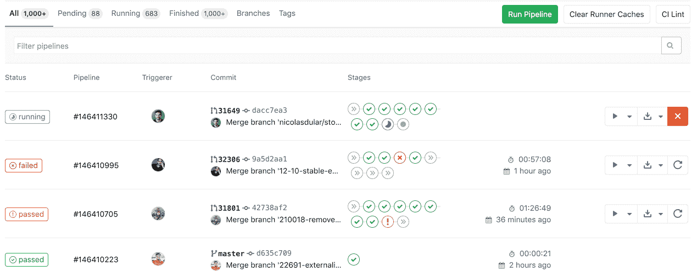](img/pipelines_index_v13_0.png)

单击管道将带您进入" **管道详细信息"**页面，并显示为该管道运行的作业. 在这里，您可以取消正在运行的管道，在发生故障的管道上重试作业或[删除管道](#delete-a-pipeline) .

[从 GitLab 12.3 开始，](https://gitlab.com/gitlab-org/gitlab-foss/-/issues/50499)可以在`/project/pipelines/[branch]/latest`找到指向给定分支的最后提交的最新管道的链接. 另外， `/project/pipelines/latest`会将您重定向到项目默认分支上最后一次提交的最新管道.

[从 GitLab 13.0 开始](https://gitlab.com/gitlab-org/gitlab/-/issues/215367) ，您可以通过以下方式过滤管道列表：

*   触发作者
*   分店名称
*   状态（ [自 GitLab 13.1 起](https://gitlab.com/gitlab-org/gitlab/-/issues/217617) ）
*   标签（ [自 GitLab 13.1 起](https://gitlab.com/gitlab-org/gitlab/-/issues/217617) ）

### Run a pipeline manually[](#run-a-pipeline-manually "Permalink")

可以使用预定义或手动指定的[变量](../variables/README.html)手动执行管道.

如果在管道的正常操作之外需要管道的结果（例如，代码生成），则可以执行此操作.

要手动执行管道：

1.  导航到项目的**CI / CD>管道** .
2.  单击**运行管道**按钮.
3.  在" **运行管道"**页面上：
    1.  在" **创建位置"**字段中选择要为其运行管道的分支.
    2.  输入管道运行所需的任何[环境变量](../variables/README.html) .
    3.  单击**创建管道**按钮.

管道将按照配置执行作业.

### Run a pipeline by using a URL query string[](#run-a-pipeline-by-using-a-url-query-string "Permalink")

在 GitLab 12.5 中[引入](https://gitlab.com/gitlab-org/gitlab/-/issues/24146) .

您可以使用查询字符串来预填充" **运行管道"**页面. 例如，查询字符串`.../pipelines/new?ref=my_branch&var[foo]=bar&file_var[file_foo]=file_bar`将使用以下内容预填充" **运行管道"**页面：

*   **竞选** field: `my_branch`.
*   **Variables** section:
    *   Variable:
        *   Key: `foo`
        *   Value: `bar`
    *   File:
        *   Key: `file_foo`
        *   Value: `file_bar`

`pipelines/new` URL 的格式为：

```
.../pipelines/new?ref=<branch>&var[<variable_key>]=<value>&file_var[<file_key>]=<value> 
```

支持以下参数：

*   `ref` ：指定用于填充" **运行为"**字段的分支.
*   `var` ：指定一个`Variable`变量.
*   `file_var` ：指定一个`File`变量.

对于每个`var`或`file_var` ，都需要一个键和一个值.

### Add manual interaction to your pipeline[](#add-manual-interaction-to-your-pipeline "Permalink")

在 GitLab 8.15 中[引入](https://gitlab.com/gitlab-org/gitlab-foss/-/merge_requests/7931) .

使用[`when:manual`](../yaml/README.html#whenmanual)参数配置的手动操作使您可以要求手动交互，然后才能在管道中继续前进.

您可以直接从管道图执行此操作. 只需单击播放按钮即可执行该特定作业.

例如，您的管道可能会自动启动，但是需要手动操作才能[部署到生产中](../environments/index.html#configuring-manual-deployments) . 在下面的示例中， `production`阶段有一个需要手动操作的工作.

[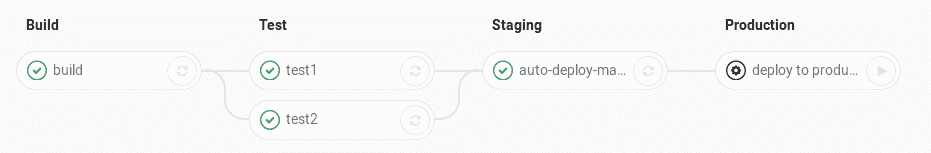](img/pipelines.png)

#### Start multiple manual actions in a stage[](#start-multiple-manual-actions-in-a-stage "Permalink")

在 GitLab 11.11 中[引入](https://gitlab.com/gitlab-org/gitlab-foss/-/merge_requests/27188) .

可以使用"全部播放手动"按钮同时启动一个阶段中的多个手动动作. 用户单击此按钮后，将触发每个单独的手动操作并将其刷新为更新状态.

此功能仅可用：

*   至少具有开发者访问权限的用户.
*   如果阶段包含[手动操作](#add-manual-interaction-to-your-pipeline) .

### Delete a pipeline[](#delete-a-pipeline "Permalink")

在 GitLab 12.7 中[引入](https://gitlab.com/gitlab-org/gitlab/-/issues/24851) .

在项目中具有[所有者权限的](../../user/permissions.html)用户可以通过以下方式删除管道：单击**CI / CD>管道中的管道**以转到" **管道详细信息"**页面，然后使用" **删除"**按钮.

[](img/pipeline-delete.png)

**警告：**删除管道将使所有管道缓存失效，并删除所有相关对象，例如构建，日志，工件和触发器. **此操作无法撤消.**

### Pipeline quotas[](#pipeline-quotas "Permalink")

每个用户都有一个个人管道配额，该配额跟踪所有个人项目中共享运行者的使用情况. 每个组都有一个[使用配额](../../subscriptions/index.html#ci-pipeline-minutes) ，该[配额](../../subscriptions/index.html#ci-pipeline-minutes)跟踪该组内创建的所有项目的共享运行器的使用.

触发管道时，无论是谁触发的，都会使用项目所有者的[名称空间](../../user/group/index.html#namespaces)的管道配额. 在这种情况下，名称空间可以是拥有项目的用户或组.

#### How pipeline duration is calculated[](#how-pipeline-duration-is-calculated "Permalink")

给定管道的总运行时间不包括重试和挂起（排队）时间.

每个作业都表示为一个`Period` ，它包括：

*   `Period#first` （作业开始时）.
*   `Period#last` （作业完成时）.

一个简单的例子是：

*   A（1、3）
*   B（2，4）
*   C（6、7）

在示例中：

*   A 从 1 开始到 3 结束.
*   B 从 2 开始到 4 结束.
*   C 从 6 开始到 7 结束.

在视觉上，它可以被视为：

```
0  1  2  3  4  5  6  7
   AAAAAAA
      BBBBBBB
                  CCCC 
```

A，B 和 C 的并集是（1、4）和（6、7）. 因此，总运行时间为：

```
(4 - 1) + (7 - 6) => 4 
```

### Pipeline security on protected branches[](#pipeline-security-on-protected-branches "Permalink")

在[受保护的分支](../../user/project/protected_branches.html)上执行管道时，将强制执行严格的安全模型.

仅当[允许](../../user/project/protected_branches.html#using-the-allowed-to-merge-and-allowed-to-push-settings)用户[合并或推送到](../../user/project/protected_branches.html#using-the-allowed-to-merge-and-allowed-to-push-settings)该特定分支时，才可以在受保护的分支上执行以下操作：

*   运行手动管道（使用[Web UI](#run-a-pipeline-manually)或[管道 API](#pipelines-api) ）.
*   运行预定的管道.
*   使用触发器运行管道.
*   在现有管道上触发手动操作.
*   重试或取消现有作业（使用 Web UI 或管道 API）.

标记为**受保护的** **变量**只能由在受保护的分支上运行的作业访问，从而防止不受信任的用户意外访问敏感信息，如部署凭据和令牌.

**运动员**标记为**保护**只能保护分支机构运行的作业，防止不可信代码在受保护亚军执行和不小心被访问保护部署密钥和其它凭证. 为了确保打算在受保护的运行程序上执行的作业不会使用常规运行程序，必须对它们进行相应标记.

## View jobs in a pipeline[](#view-jobs-in-a-pipeline "Permalink")

访问管道时，可以看到该管道的相关作业.

单击单个作业将向您显示其作业日志，并允许您：

*   取消作业.
*   重试该作业.
*   删除作业日志.

### See why a job failed[](#see-why-a-job-failed "Permalink")

在 GitLab 10.7 中[引入](https://gitlab.com/gitlab-org/gitlab-foss/-/merge_requests/17782) .

当管道发生故障或被允许失败时，可以在几个地方找到原因：

*   在[管道图中](#visualize-pipelines) ，在管道详细信息视图上.
*   在管道小部件中，在合并请求和提交页面中.
*   在工作视图中，在工作的全局视图和详细视图中.

在每个地方，如果将鼠标悬停在失败的作业上，都可以看到失败的原因.

[](img/job_failure_reason.png)

在[GitLab 10.8](https://gitlab.com/gitlab-org/gitlab-foss/-/merge_requests/17814)及更高版本中，您还可以在"作业详细信息"页面上查看其失败的原因.

### The order of jobs in a pipeline[](#the-order-of-jobs-in-a-pipeline "Permalink")

管道中作业的顺序取决于管道图的类型.

*   对于[常规管道图](#regular-pipeline-graphs) ，按名称对作业进行排序.
*   对于[管道微型图](#pipeline-mini-graphs) ，将按严重性然后按名称对作业进行排序.

严重性顺序为：

*   failed
*   warning
*   pending
*   running
*   manual
*   scheduled
*   canceled
*   success
*   skipped
*   created

例如：

[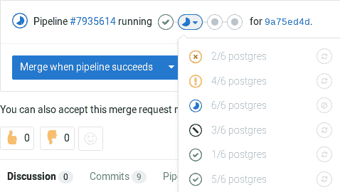](img/pipelines_mini_graph_sorting.png)

### Group jobs in a pipeline[](#group-jobs-in-a-pipeline "Permalink")

在 GitLab 8.12 中[引入](https://gitlab.com/gitlab-org/gitlab-foss/-/merge_requests/6242) .

如果您有许多类似的工作，则[管道图](#visualize-pipelines)将变得很长且难以阅读.

您可以自动将相似的作业分组在一起. 如果以某种方式格式化作业名称，它们将在常规管道图（而不是迷你图）中折叠为一组.

如果看不到管道中的重试或取消按钮，您将知道管道何时将其分组. 将鼠标悬停在它们上面将显示分组的作业数. 单击以展开它们.

[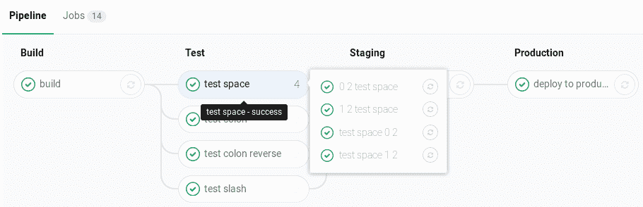](img/pipelines_grouped.png)

要创建一组作业，请在[CI / CD 管道配置文件中](../yaml/README.html) ，用数字和以下其中一个分隔每个作业名称：

*   斜线（ `/` ），例如`test 1/3` ， `test 2/3` ， `test 3/3` .
*   冒号（ `:` ）中，例如， `test 1:3` ， `test 2:3` ， `test 3:3` .
*   一个空格，例如`test 0 3` ， `test 1 3` ， `test 2 3` .

您可以互换使用这些符号.

例如，这三个作业将在一个名为`build ruby`的组中：

```
build ruby 1/3:
  stage: build
  script:
    - echo "ruby1"

build ruby 2/3:
  stage: build
  script:
    - echo "ruby2"

build ruby 3/3:
  stage: build
  script:
    - echo "ruby3" 
```

在管道中，结果是一个名为`build ruby`的组，具有三个作业：

[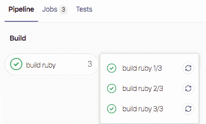](img/job_group_v12_10.png)

作业将通过从左到右比较数字进行排序. 通常，您希望第一个数字为索引，第二个数字为总数.

[此正则表达式](https://gitlab.com/gitlab-org/gitlab/blob/2f3dc314f42dbd79813e6251792853bc231e69dd/app/models/commit_status.rb#L99)计算作业名称： `\d+[\s:\/\\]+\d+\s*` .

### Specifying variables when running manual jobs[](#specifying-variables-when-running-manual-jobs "Permalink")

在 GitLab 12.2 中[引入](https://gitlab.com/gitlab-org/gitlab-foss/-/merge_requests/30485) .

运行手动作业时，您可以提供其他特定于作业的变量.

您可以从要运行其他变量的手动作业的作业页面执行此操作. 要访问此页面，请在管道视图中单击手动作业的**名称** ， *而不是*播放（ ）按钮.

当您想要更改使用[自定义环境变量](../variables/README.html#custom-environment-variables)的作业的执行时，这很有用. 在此处添加变量名称（键）和值将覆盖[UI 或`.gitlab-ci.yml`](../variables/README.html#custom-environment-variables)定义的值，以供手动运行一次.

[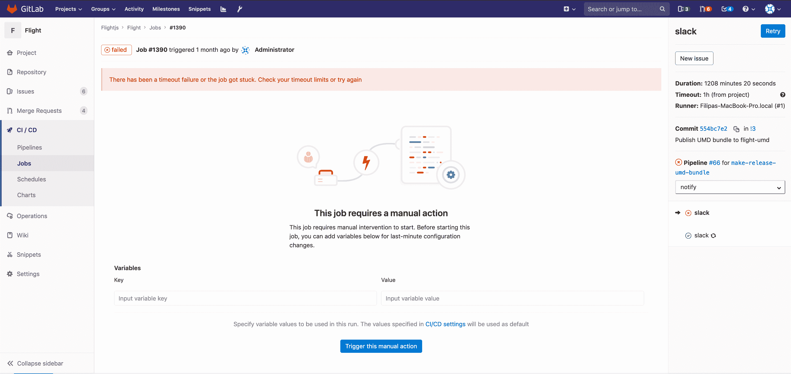](img/manual_job_variables.png)

### Delay a job[](#delay-a-job "Permalink")

在 GitLab 11.4 中[引入](https://gitlab.com/gitlab-org/gitlab-foss/-/merge_requests/21767) .

当您不想立即运行作业时，可以使用[`when:delayed`](../yaml/README.html#whendelayed)参数将作业的执行延迟一定时间.

这对于定时增量式部署特别有用，在这种情况下，新代码将逐步推出.

例如，如果您开始推出新代码并执行以下操作：

*   用户不会遇到麻烦，GitLab 可以从 0％到 100％自动完成部署.
*   用户在使用新代码时会遇到麻烦，您可以通过取消管道并[回滚](../environments/index.html#retrying-and-rolling-back)到最后一个稳定版本来停止定时增量推出.

[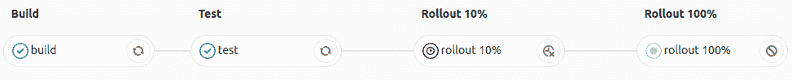](img/pipeline_incremental_rollout.png)

### Expand and collapse job log sections[](#expand-and-collapse-job-log-sections "Permalink")

在 GitLab 12.0 中[引入](https://gitlab.com/gitlab-org/gitlab-foss/-/issues/14664) .

作业日志分为可折叠或扩展的部分. 每个部分将显示持续时间.

在以下示例中：

*   两个部分已折叠并且可以展开.
*   三个部分被展开并且可以折叠.

[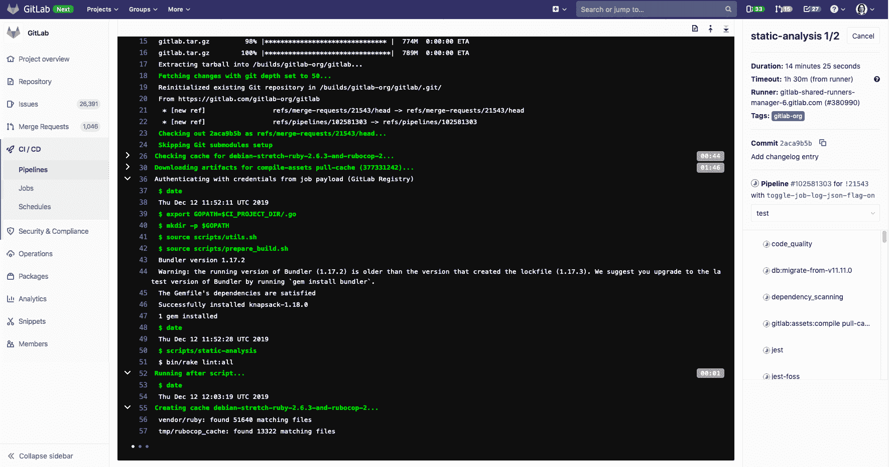](img/collapsible_log_v12_6.png)

#### Custom collapsible sections[](#custom-collapsible-sections "Permalink")

您可以通过手动输出特殊代码来在作业日志中创建可折叠部分，GitLab 将使用这些特殊代码来确定要折叠的部分：

*   节开始标记： `section_start:UNIX_TIMESTAMP:SECTION_NAME\r\e[0K` + `TEXT_OF_SECTION_HEADER`
*   节结束标记： `section_end:UNIX_TIMESTAMP:SECTION_NAME\r\e[0K`

您必须将这些代码添加到 CI 配置的脚本部分. 例如，使用`echo` ：

```
job1:
  script:
    - echo -e "section_start:`date +%s`:my_first_section\r\e[0KHeader of the 1st collapsible section"
    - echo 'this line should be hidden when collapsed'
    - echo -e "section_end:`date +%s`:my_first_section\r\e[0K" 
```

在上面的示例中：

*   `date +%s` ：Unix 时间戳（例如`1560896352` ）.
*   `my_first_section` ：为节指定的名称.
*   `\r\e[0K` ：阻止区域标记显示在渲染的（彩色）作业日志中，但它们显示在原始作业日志中. 要查看它们，请在作业日志的右上方，单击 （ **显示完整的原始文件** ）.
    *   `\r` ：回车.
    *   `\e[0K` ：清除 ANSI 转义代码.

原始作业日志样本：

```
section_start:1560896352:my_first_section\r\e[0KHeader of the 1st collapsible section
this line should be hidden when collapsed
section_end:1560896353:my_first_section\r\e[0K 
```

## Visualize pipelines[](#visualize-pipelines "Permalink")

在 GitLab 8.11 中[引入](https://gitlab.com/gitlab-org/gitlab-foss/-/merge_requests/5742) .

管道可以是具有许多顺序和并行作业的复杂结构.

为了更容易理解管道的流程，GitLab 提供了管道图来查看管道及其状态.

管道图可以两种不同的方式显示，具体取决于您从中访问该图的页面.

**注意：** GitLab 在管线图中将各阶段的名称大写.

### Regular pipeline graphs[](#regular-pipeline-graphs "Permalink")

常规管道图显示每个阶段的作业名称. 当您在[单个管道页面](#view-pipelines)上时，可以找到常规管道图. 例如：

[](img/pipelines.png)

[多项目管道图可](../multi_project_pipelines.html#multi-project-pipeline-visualization-premium)帮助您可视化整个管道，包括所有跨项目的相互依存关系.

### Pipeline mini graphs[](#pipeline-mini-graphs "Permalink")

管道微型图占用的空间更少，并且可以一眼告诉您所有作业都通过还是失败. 当您导航到以下位置时，可以找到管道迷你图：

*   管道索引页面.
*   单个提交页面.
*   合并请求页面.

管道微型图使您可以查看一次提交的所有相关作业以及管道每个阶段的最终结果. 这使您可以快速查看失败的原因并进行修复.

管道微型图中的阶段是可折叠的. 将鼠标悬停在他们上方，然后单击以展开他们的工作.

| 迷你图 | 迷你图展开 |
| --- | --- |
| [](img/pipelines_mini_graph_simple.png) | [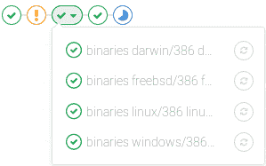](img/pipelines_mini_graph.png) |

### Pipeline success and duration charts[](#pipeline-success-and-duration-charts "Permalink")

版本历史

*   在 GitLab 3.1.1 中作为"提交统计信息"引入，后来更名为"管线图".
*   在 GitLab 12.8 中[重命名](https://gitlab.com/gitlab-org/gitlab/-/issues/38318)为 CI / CD Analytics.

GitLab 跟踪您的管道成功与失败的历史记录，以及每个管道的运行时间. 要查看此信息，请转到**分析> CI / CD 分析** .

查看成功的管道：

[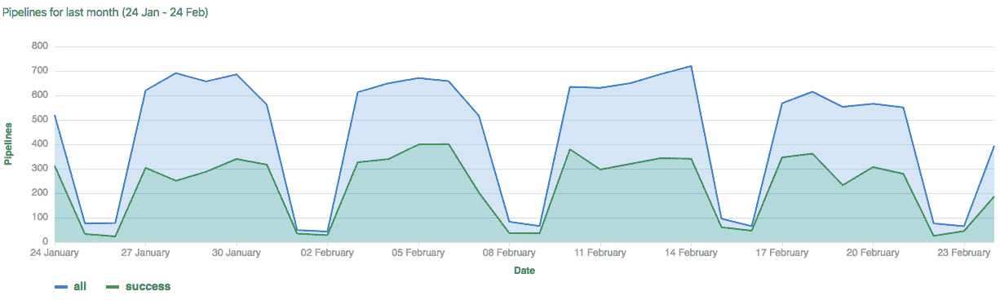](img/pipelines_success_chart.png)

查看管道持续时间历史记录：

[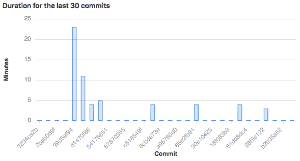](img/pipelines_duration_chart.png)

### Pipeline badges[](#pipeline-badges "Permalink")

管道状态和测试覆盖率报告标记可用于每个项目，并可对其进行配置. 有关将管道标记添加到项目的信息，请参见[管道标记](settings.html#pipeline-badges) .

## Pipelines API[](#pipelines-api "Permalink")

GitLab 提供 API 端点以：

*   执行基本功能. 有关更多信息，请参见[Pipelines API](../../api/pipelines.html) .
*   维护管道时间表. 有关更多信息，请参见[管道时间表 API](../../api/pipeline_schedules.html) .
*   触发管道运行. 有关更多信息，请参见：
    *   [通过 API 触发管道](../triggers/README.html) .
    *   [管道触发器 API](../../api/pipeline_triggers.html) .

## Troubleshooting `fatal: reference is not a tree:`[](#troubleshooting-fatal-reference-is-not-a-tree "Permalink")

在 GitLab 12.4 中[引入](https://gitlab.com/gitlab-org/gitlab/-/merge_requests/17043) .

以前，当您强制将分支推入其远程存储库时，会遇到意外的管道故障. 为了说明问题，假设您已经拥有当前的工作流程：

1.  用户创建一个名为`example`的功能分支并将其推送到远程存储库.
2.  新的管道开始在`example`分支上运行.
3.  用户将`example`分支基于最新的`master`分支，然后将其强制推送到其远程存储库.
4.  新的管道再次在`example`分支上运行，但是，先前的管道（2）由于`fatal: reference is not a tree:`错误`fatal: reference is not a tree:`失败.

这是因为先前的管道无法从`example`分支中找到校验历史 SHA（与管道记录相关联），该历史历史已被强制推送覆盖. 同样，由于[相同的原因](../merge_request_pipelines/pipelines_for_merged_results/index.html#intermittently-pipelines-fail-by-fatal-reference-is-not-a-tree-error) [，合并结果的管道](../merge_request_pipelines/pipelines_for_merged_results/index.html)可能会间歇性地失败.

从 GitLab 12.4 开始，我们通过专门保留管道引用来改善了这种行为. 为了说明其生命周期：

1.  在名为`example`的功能分支上创建了管道.
2.  在`refs/pipelines/<pipeline-id>`创建一个持久的管道 ref，该`refs/pipelines/<pipeline-id>`保留相关管道记录的 checkout-SHA. 即使在`example`分支的提交历史记录已被强制推送覆盖的情况下，该持久引用在管道执行期间也保持不变.
3.  GitLab Runner fetches the persistent pipeline ref and gets source code from the checkout-SHA.
4.  管道完成后，将在后台进程中清除其持久引用.