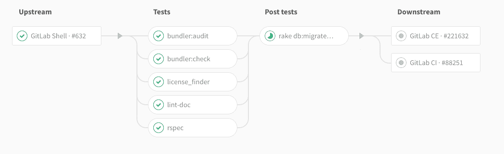
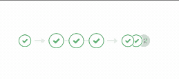

# Multi-project pipelines

> 原文：[https://docs.gitlab.com/ee/ci/multi_project_pipelines.html](https://docs.gitlab.com/ee/ci/multi_project_pipelines.html)

*   [Use cases](#use-cases)
*   [Multi-project pipeline visualization](#multi-project-pipeline-visualization-premium)
*   [Triggering multi-project pipelines through API](#triggering-multi-project-pipelines-through-api)
*   [Creating multi-project pipelines from `.gitlab-ci.yml`](#creating-multi-project-pipelines-from-gitlab-ciyml)
    *   [Triggering a downstream pipeline using a bridge job](#triggering-a-downstream-pipeline-using-a-bridge-job)
    *   [Specifying a downstream pipeline branch](#specifying-a-downstream-pipeline-branch)
    *   [Passing variables to a downstream pipeline](#passing-variables-to-a-downstream-pipeline)
    *   [Mirroring status from triggered pipeline](#mirroring-status-from-triggered-pipeline)
    *   [Mirroring status from upstream pipeline](#mirroring-status-from-upstream-pipeline)
    *   [Limitations](#limitations)
*   [Trigger a pipeline when an upstream project is rebuilt](#trigger-a-pipeline-when-an-upstream-project-is-rebuilt)

# Multi-project pipelines[](#multi-project-pipelines "Permalink")

版本历史

*   在 GitLab 7.14 中作为构建触发器[引入](https://about.gitlab.com/releases/2015/08/22/gitlab-7-14-released/#build-triggers-api-gitlab-ci) .
*   在 GitLab 12.8 中的所有层中[均可](https://gitlab.com/gitlab-org/gitlab/-/issues/199224)用.

您可以跨多个项目设置[GitLab CI / CD](README.html) ，以便一个项目中的管道可以触发另一个项目中的管道.

GitLab CI / CD 是一个功能强大的持续集成工具，不仅适用于每个项目，而且适用于具有多项目管道的项目.

多项目管道对于需要跨项目相互依赖的较大产品很有用，例如采用[微服务架构的产品](https://about.gitlab.com/blog/2016/08/16/trends-in-version-control-land-microservices/) .

有关跨功能开发团队如何使用跨管道触发来为不同的微服务项目触发多个管道的演示，请参阅[跨项目管道触发和可视化](https://about.gitlab.com/handbook/marketing/product-marketing/demo/#cross-project-pipeline-triggering-and-visualization-may-2019---1110) .

此外，还可以可视化整个管道，包括所有跨项目的相互依存关系.

## Use cases[](#use-cases "Permalink")

Let’s assume you deploy your web app from different projects in GitLab:

*   一个免费版本，它有自己的管道来构建和测试您的应用
*   一个用于付费版本的附加组件，还可以通过构建和测试
*   一个用于文档的文档，该文档还使用 SSG 进行构建，测试和部署

使用多项目管道，您可以可视化整个管道，包括三个项目的所有构建和测试阶段.

## Multi-project pipeline visualization[](#multi-project-pipeline-visualization-premium "Permalink")

[Introduced](https://gitlab.com/gitlab-org/gitlab/-/issues/2121) in [GitLab Premium 9.3](https://about.gitlab.com/releases/2017/06/22/gitlab-9-3-released/#multi-project-pipeline-graphs).

为项目配置 GitLab CI / CD 时，可以在[管道图](pipelines/index.html#visualize-pipelines)上可视化[作业](pipelines/index.html#configure-a-pipeline)的阶段.

[](img/multi_project_pipeline_graph.png)

在"合并请求"小组件中，将显示多项目管道微型图，并且当悬停或轻击（在触摸屏设备上）时，它们将展开并显示为彼此相邻.

[](img/multi_pipeline_mini_graph.gif)

## Triggering multi-project pipelines through API[](#triggering-multi-project-pipelines-through-api "Permalink")

版本历史

*   在[GitLab Premium](https://about.gitlab.com/pricing/) 9.3 中[引入](https://gitlab.com/gitlab-org/gitlab/-/merge_requests/2017)了`CI_JOB_TOKEN`在多项目管道中的使用.
*   在 GitLab 12.4 的所有层中都[可以](https://gitlab.com/gitlab-org/gitlab/-/issues/31573)将`CI_JOB_TOKEN`用于多项目管道.

当您使用[`CI_JOB_TOKEN`触发管道时](triggers/README.html#ci-job-token) ，GitLab 会识别作业令牌的来源，因此在内部将这些管道[`CI_JOB_TOKEN`](triggers/README.html#ci-job-token)在一起，从而可以在管道图上可视化它们的关系.

通过显示上游和下游管道依存关系的入站和出站连接，可以在管道图中显示这些关系.

## Creating multi-project pipelines from `.gitlab-ci.yml`[](#creating-multi-project-pipelines-from-gitlab-ciyml "Permalink")

版本历史

*   在[GitLab Premium](https://about.gitlab.com/pricing/) 11.8 中[引入](https://gitlab.com/gitlab-org/gitlab/-/issues/8997) .
*   在 12.8 中[可](https://gitlab.com/gitlab-org/gitlab/-/issues/199224)用于所有层.

### Triggering a downstream pipeline using a bridge job[](#triggering-a-downstream-pipeline-using-a-bridge-job "Permalink")

在 GitLab 11.8 之前，有必要实现一个管道作业，该作业负责发出 API 请求[以触​​发](#triggering-multi-project-pipelines-through-api)另一个项目中[的管道](#triggering-multi-project-pipelines-through-api) .

在 GitLab 11.8 中，GitLab 提供了新的 CI / CD 配置语法，使此任务更容易，并且避免需要 GitLab Runner 来触发跨项目管道. 下图说明了配置桥接作业：

```
rspec:
  stage: test
  script: bundle exec rspec

staging:
  variables:
    ENVIRONMENT: staging
  stage: deploy
  trigger: my/deployment 
```

在上面的示例中，一旦`rspec`作业在`test`阶段成功完成，则将启动`staging`桥作业. 该作业的初始状态将`pending` . manbetx 客户端打不开将在`my/deployment`项目中创建一个下游管道，并且，一旦创建管道， `staging`作业将成功. `my/deployment`是该项目的完整路径.

创建上游管道的用户需要具有对下游项目的访问权限（在本例中为`my/deployment` ）. 如果找不到下游项目，或者用户没有访问权限以在其中创建管道，则`staging`作业将被标记为*failed* .

**警告：**在该示例中，一旦创建了下游管道，该`staging`将被标记为成功. 如果要显示下游管道的状态，请参阅[从触发的管道镜像状态](#mirroring-status-from-triggered-pipeline) .**注意：**对于常规作业，网桥作业不支持用户可以使用的每个配置条目. Runner 不会选择 Bridge 作业，因此添加对`script`支持毫无意义. 如果用户尝试使用不受支持的配置语法，则在创建管道时，YAML 验证将失败.

### Specifying a downstream pipeline branch[](#specifying-a-downstream-pipeline-branch "Permalink")

可以指定下游管道将使用的分支名称：

```
rspec:
  stage: test
  script: bundle exec rspec

staging:
  stage: deploy
  trigger:
    project: my/deployment
    branch: stable-11-2 
```

Use:

*   `project`关键字，用于指定下游项目的完整路径.
*   该`branch`关键字指定由指定的项目分支的名称`project` . [从 GitLab 12.4 开始](https://gitlab.com/gitlab-org/gitlab/-/issues/10126) ，支持变量扩展.

在创建下游管道时，GitLab 将使用当前在分支的 HEAD 上的提交.

### Passing variables to a downstream pipeline[](#passing-variables-to-a-downstream-pipeline "Permalink")

有时您可能想将变量传递到下游管道. 您可以使用`variables`关键字来执行此操作，就像定义常规作业时一样.

```
rspec:
  stage: test
  script: bundle exec rspec

staging:
  variables:
    ENVIRONMENT: staging
  stage: deploy
  trigger: my/deployment 
```

`ENVIRONMENT`变量将传递到下游管道中定义的每个作业. 当 GitLab Runner 选择工作时，它将作为环境变量使用.

在以下配置中， `MY_VARIABLE`变量将传递到在`trigger-downstream`作业排队时创建的下游管道. 这是因为`trigger-downstream`作业继承了在全局变量块中声明的变量，然后将这些变量传递到下游管道.

```
variables:
  MY_VARIABLE: my-value

trigger-downstream:
  variables:
    ENVIRONMENT: something
  trigger: my/project 
```

您可能想使用例如预定义的变量传递有关上游管道的一些信息. 为此，您可以使用插值传递任何变量. 例如：

```
downstream-job:
  variables:
    UPSTREAM_BRANCH: $CI_COMMIT_REF_NAME
  trigger: my/project 
```

在这种情况下，具有与上游管道相关的值的`UPSTREAM_BRANCH`变量将传递到`downstream-job`作业，并在所有下游构建的上下文中可用.

**提示：**上游管道优先于下游管道. 如果在上游和下游项目中定义了两个具有相同名称的变量，则在上游项目中定义的变量将优先.

### Mirroring status from triggered pipeline[](#mirroring-status-from-triggered-pipeline "Permalink")

版本历史

*   在[GitLab Premium](https://about.gitlab.com/pricing/) 12.3 中[引入](https://gitlab.com/gitlab-org/gitlab/-/issues/11238) .
*   在 12.8 中[移至](https://gitlab.com/gitlab-org/gitlab/-/issues/199224) GitLab Core.

您可以使用`strategy: depend`将镜像状态从触发的管道镜像到源网桥作业. 例如：

```
trigger_job:
  trigger:
    project: my/project
    strategy: depend 
```

### Mirroring status from upstream pipeline[](#mirroring-status-from-upstream-pipeline "Permalink")

您可以使用`needs:pipeline`关键字将管道状态从上游管道镜像到桥作业. 来自主服务器的最新管道状态将复制到桥接作业.

Example:

```
upstream_bridge:
  stage: test
  needs:
    pipeline: other/project 
```

### Limitations[](#limitations "Permalink")

由于网桥作业与常规作业略有不同，因此此处无法使用完全相同的配置语法，就像在定义要由跑步者选择的常规作业时通常使用的配置语法一样.

某些功能尚未实现. 例如，对环境的支持.

可用于网桥作业的[配置关键字](yaml/README.html)是：

*   `trigger` （定义下游管道触发器）
*   `stage`
*   `allow_failure`
*   [`rules`](yaml/README.html#rules)
*   `only` and `except`
*   `when` （仅适用于`on_success` ， `on_failure`和`always`值为）
*   `extends`

## Trigger a pipeline when an upstream project is rebuilt[](#trigger-a-pipeline-when-an-upstream-project-is-rebuilt "Permalink")

[Introduced](https://gitlab.com/gitlab-org/gitlab/-/issues/9045) in [GitLab Premium](https://about.gitlab.com/pricing/) 12.8.

You can trigger a pipeline in your project whenever a pipeline finishes for a new tag in a different project:

1.  转到项目的**"设置">" CI / CD"**页面，然后展开" **管道订阅"**部分.
2.  输入您要订阅的项目的路径.
3.  单击订阅.

现在，成功完成已订阅项目中新标签的任何管道都将在当前项目的默认分支上触发管道. 对于上游和下游项目，上游管道订阅的最大数量为 2.