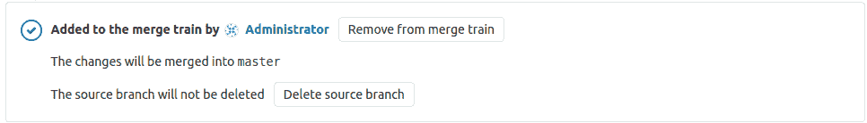
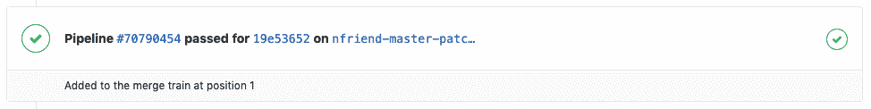
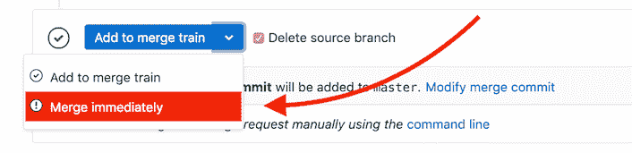
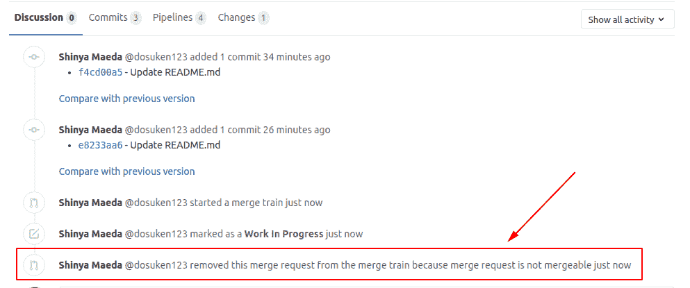

# Merge Trains

> 原文：[https://docs.gitlab.com/ee/ci/merge_request_pipelines/pipelines_for_merged_results/merge_trains/](https://docs.gitlab.com/ee/ci/merge_request_pipelines/pipelines_for_merged_results/merge_trains/)

*   [Merge train example](#merge-train-example)
*   [Prerequisites](#prerequisites)
*   [Enable merge trains](#enable-merge-trains)
*   [Start a merge train](#start-a-merge-train)
*   [Add a merge request to a merge train](#add-a-merge-request-to-a-merge-train)
*   [Remove a merge request from a merge train](#remove-a-merge-request-from-a-merge-train)
*   [View a merge request’s current position on the merge train](#view-a-merge-requests-current-position-on-the-merge-train)
*   [Immediately merge a merge request with a merge train](#immediately-merge-a-merge-request-with-a-merge-train)
*   [Troubleshooting](#troubleshooting)
    *   [Merge request dropped from the merge train immediately](#merge-request-dropped-from-the-merge-train-immediately)
    *   [Merge When Pipeline Succeeds cannot be chosen](#merge-when-pipeline-succeeds-cannot-be-chosen)
    *   [Merge Train Pipeline cannot be retried](#merge-train-pipeline-cannot-be-retried)
    *   [Unable to add to merge train with message “The pipeline for this merge request failed.”](#unable-to-add-to-merge-train-with-message-the-pipeline-for-this-merge-request-failed)
    *   [Merge Trains feature flag](#merge-trains-feature-flag-premium-only)

# Merge Trains[](#merge-trains-premium "Permalink")

版本历史

*   在[GitLab Premium](https://about.gitlab.com/pricing/) 12.0 中[引入](https://gitlab.com/gitlab-org/gitlab/-/issues/9186) .
*   [GitLab Premium](https://about.gitlab.com/pricing/) 12.6 中[引入了压](https://gitlab.com/gitlab-org/gitlab/-/issues/13001)入[和合并](../../../../user/project/merge_requests/squash_and_merge.html)支持.

启用[用于合并结果](../index.html#pipelines-for-merged-results-premium)的管道时，管道作业将运行，就好像源分支中的更改已被合并到目标分支中一样.

但是，目标分支可能正在快速变化. 准备合并时，如果有一段时间没有运行管道，则目标分支可能已更改. 现在合并可能会带来重大变化.

*合并列车*可以防止这种情况的发生. 合并列是合并请求的排队列表，每个请求都等待合并到目标分支中.

可以将许多合并请求添加到火车. 每个合并请求都运行其自己的合并结果管道，该管道包括列车上位于其*前面*的所有其他合并请求的更改. 所有管道并行运行，以节省时间.

如果合并请求的管道失败，则不会合并重大更改，并且目标分支不受影响. 合并请求已从火车中删除，并且其后面的所有管道都重新启动.

如果火车前部用于合并请求的管道成功完成，则更改将合并到目标分支中，其他管道将继续运行.

要将合并请求添加到合并系列，您需要具有[权限](../../../../user/permissions.html)才能推送到目标分支.

**注意：**每个合并列车最多可以并行运行**20 条**管道. 如果将超过二十个合并请求添加到合并列，则合并请求将排队，直到合并列中的插槽可用为止. 可以排队的合并请求数量没有限制.

## Merge train example[](#merge-train-example "Permalink")

将三个合并请求（ `A` ， `B`和`C` ）依次添加到合并序列中，这将创建三个并行运行的合并结果管道：

1.  第一条管道基于`A`与目标分支组合的更改运行.
2.  第二个管道基于`A`和`B`的更改以及目标分支运行.
3.  第三条流水线基于`A` ， `B`和`C`的更改以及目标分支.

如果`B`的管道发生故障，则将其从火车上移除. `C`的管道将在`A`和`C`更改的情况下重新启动，但`B`不会更改.

如果`A`然后成功完成，它将合并到目标分支中，并且`C`继续运行. 如果将更多合并请求添加到火车，它们现在将包括目标分支中包含的`A`更改，以及来自火车中已经存在的合并请求的`C`更改.

阅读有关[合并火车如何使您的主人保持绿色的](https://about.gitlab.com/blog/2020/01/30/all-aboard-merge-trains/)更多信息.

观看此视频，以获取有关[并行执行合并训练如何防止提交破坏默认分支](https://www.youtube.com/watch?v=D4qCqXgZkHQ)的演示.

## Prerequisites[](#prerequisites "Permalink")

要启用合并火车：

*   您必须具有维护者[权限](../../../../user/permissions.html) .
*   您必须使用[GitLab Runner](https://gitlab.com/gitlab-org/gitlab-runner) 11.9 或更高版本.
*   在 GitLab 12.0 和更高版本中，您需要[Redis](https://s0redis0io.icopy.site/) 3.2 或更高版本.

## Enable merge trains[](#enable-merge-trains "Permalink")

为您的项目启用合并火车：

1.  如果您使用的是自我管理的 GitLab 实例，请确保正确设置了[功能标志](#merge-trains-feature-flag-premium-only) .
2.  [配置您的 CI / CD 配置文件，](../../index.html#configuring-pipelines-for-merge-requests)以便为合并请求运行管道或单个作业.
3.  访问项目的**设置>常规，**然后展开**合并请求** .
4.  Check **为合并结果启用合并训练和管道**.
5.  Click **保存更改**.

**警告：**如果选中该复选框，但未将 CI / CD 配置为使用管道处理合并请求，则合并请求可能会停留在未解决的状态，或者管道可能会被丢弃.

## Start a merge train[](#start-a-merge-train "Permalink")

要开始合并火车：

1.  访问合并请求.
2.  Click the **开始合并火车** button.

[](img/merge_train_start_v12_0.png)

现在可以将其他合并请求添加到列车中.

## Add a merge request to a merge train[](#add-a-merge-request-to-a-merge-train "Permalink")

要将合并请求添加到合并火车：

1.  访问合并请求.
2.  单击**添加以合并火车**按钮.

如果用于合并请求的管道已经在运行，则无法将合并请求添加到列车. 相反，您可以计划**在最新管道成功时将**合并请求添加到合并**序列中** .

[](img/merge_train_start_when_pipeline_succeeds_v12_0.png)

## Remove a merge request from a merge train[](#remove-a-merge-request-from-a-merge-train "Permalink")

1.  访问合并请求.
2.  单击**从合并火车中删除**按钮.

[](img/merge_train_cancel_v12_0.png)

如果您想稍后再将合并请求添加到合并训练中，则可以.

## View a merge request’s current position on the merge train[](#view-a-merge-requests-current-position-on-the-merge-train "Permalink")

将合并请求添加到合并列之后，合并请求的当前位置显示在管道小部件下：

[](img/merge_train_position_v12_0.png)

## Immediately merge a merge request with a merge train[](#immediately-merge-a-merge-request-with-a-merge-train "Permalink")

如果您有必须紧急合并的高优先级合并请求（例如，重要补丁程序），则可以使用" **立即合并"**选项绕过合并程序. 这是将更改合并到目标分支的最快选项.

[](img/merge_train_immediate_merge_v12_6.png)

**警告：**每次您立即合并一个合并请求时，都会重新创建当前的合并序列，并重新启动所有管道.

## Troubleshooting[](#troubleshooting "Permalink")

### Merge request dropped from the merge train immediately[](#merge-request-dropped-from-the-merge-train-immediately "Permalink")

如果合并请求不可合并（例如，在制品，存在合并冲突等），则您的合并请求将自动从合并列中删除.

在这些情况下，删除合并请求的原因在**系统注释中** .

检查原因：

1.  打开从合并序列中删除的合并请求.
2.  打开**讨论**选项卡.
3.  查找包含以下任一内容的系统注释：
    *   文本**…从合并列表中删除了此合并请求，因为…**
    *   **…中止了来自合并序列的合并请求，因为…**原因在" **…"**短语之后的文本中给出.

[](img/merge_train_failure.png)

### Merge When Pipeline Succeeds cannot be chosen[](#merge-when-pipeline-succeeds-cannot-be-chosen "Permalink")

启用合并训练后，当前无法[在管道成功](../../../../user/project/merge_requests/merge_when_pipeline_succeeds.html)时合并.

有关更多信息，请参见[相关问题](https://gitlab.com/gitlab-org/gitlab/-/issues/12267) .

### Merge Train Pipeline cannot be retried[](#merge-train-pipeline-cannot-be-retried "Permalink")

合并火车管道无法重试，因为合并请求在失败后会从合并火车中删除. 因此，重试按钮不会出现在管道图标旁边.

如果管道发生故障，则应将合并请求[重新排队](#add-a-merge-request-to-a-merge-train)到合并[序列中](#add-a-merge-request-to-a-merge-train) ，然后合并[序列](#add-a-merge-request-to-a-merge-train)将启动新的管道.

### Unable to add to merge train with message “The pipeline for this merge request failed.”[](#unable-to-add-to-merge-train-with-message-the-pipeline-for-this-merge-request-failed "Permalink")

有时" **开始/添加到合并训练"**按钮不可用，合并请求显示"此合并请求的管道失败. 请重试该作业或推送新的提交以修复故障."

在**"设置">"常规">"合并请求"中**启用**"** [**管道必须成功"**](../../../../user/project/merge_requests/merge_when_pipeline_succeeds.html#only-allow-merge-requests-to-be-merged-if-the-pipeline-succeeds)时，会发生此问题. 此选项要求您运行新的成功管道，然后才能将合并请求重新添加到合并系列.

合并训练可确保在合并发生之前每个管道都已成功完成，因此您可以清除" **管道必须成功"**复选框，并保持**启用"启用合并训练和合并结果的管道** （合并训练）".

如果要与合并训练一起保持启用" **管道必须成功"**选项，可以在发生此错误时为合并结果创建新管道，方法是转到" **管道"**选项卡，然后单击**"运行管道"** . 然后**在管道成功时**单击" **开始/添加"以合并火车** .

有关更多信息，请参见[相关问题](https://gitlab.com/gitlab-org/gitlab/-/issues/35135) .

### Merge Trains feature flag[](#merge-trains-feature-flag-premium-only "Permalink")

要启用和禁用合并训练功能，请使用`:disable_merge_trains`功能标志.

要检查您的 GitLab 实例上是否启用了功能标志，请要求管理员执行以下命令：

```
> sudo gitlab-rails console                         # Login to Rails console of GitLab instance.
> Feature.enabled?(:disable_merge_trains)           # Check if it's disabled or not.
> Feature.enable(:disable_merge_trains)             # Disable Merge Trains.
> Feature.disable(:disable_merge_trains)            # Enable Merge Trains. 
```

禁用此功能后，所有现有的合并训练都将被取消，并且" **开始/添加到合并训练"**按钮不再出现在合并请求中.