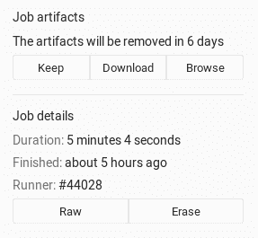
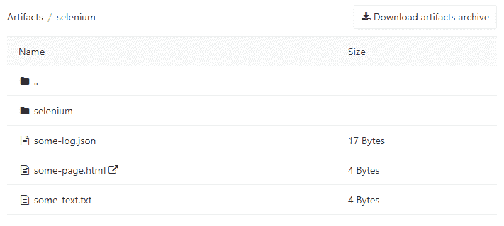
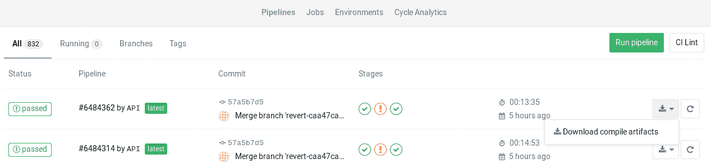
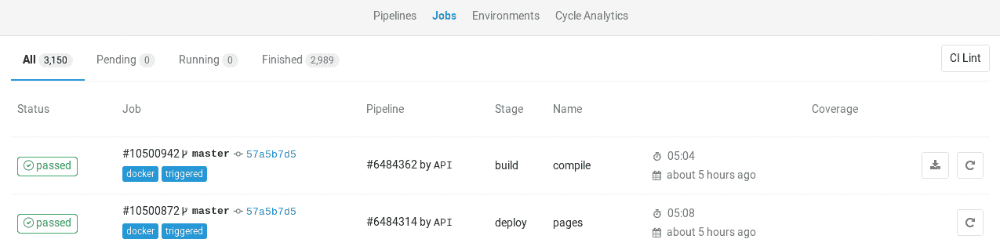
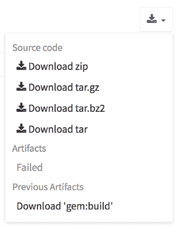

# Job artifacts

> 原文：[https://docs.gitlab.com/ee/ci/pipelines/job_artifacts.html](https://docs.gitlab.com/ee/ci/pipelines/job_artifacts.html)

*   [Defining artifacts in `.gitlab-ci.yml`](#defining-artifacts-in-gitlab-ciyml)
    *   [`artifacts:reports`](#artifactsreports)
        *   [`artifacts:reports:junit`](#artifactsreportsjunit)
        *   [`artifacts:reports:dotenv`](#artifactsreportsdotenv)
        *   [`artifacts:reports:cobertura`](#artifactsreportscobertura)
        *   [`artifacts:reports:terraform`](#artifactsreportsterraform)
        *   [`artifacts:reports:codequality`](#artifactsreportscodequality-starter)
        *   [`artifacts:reports:sast`](#artifactsreportssast-ultimate)
        *   [`artifacts:reports:secret_detection`](#artifactsreportssecret_detection-ultimate)
        *   [`artifacts:reports:dependency_scanning`](#artifactsreportsdependency_scanning-ultimate)
        *   [`artifacts:reports:container_scanning`](#artifactsreportscontainer_scanning-ultimate)
        *   [`artifacts:reports:dast`](#artifactsreportsdast-ultimate)
        *   [`artifacts:reports:license_management`](#artifactsreportslicense_management-ultimate)
        *   [`artifacts:reports:license_scanning`](#artifactsreportslicense_scanning-ultimate)
        *   [`artifacts:reports:performance`](#artifactsreportsperformance-premium)
        *   [`artifacts:reports:load_performance`](#artifactsreportsload_performance-premium)
        *   [`artifacts:reports:metrics`](#artifactsreportsmetrics-premium)
        *   [`artifacts:reports:requirements`](#artifactsreportsrequirements-ultimate)
*   [Browsing artifacts](#browsing-artifacts)
*   [Downloading artifacts](#downloading-artifacts)
*   [Downloading the latest artifacts](#downloading-the-latest-artifacts)
*   [Erasing artifacts](#erasing-artifacts)
*   [Retrieve artifacts of private projects when using GitLab CI](#retrieve-artifacts-of-private-projects-when-using-gitlab-ci)

# Job artifacts[](#job-artifacts "Permalink")

版本历史

*   在 GitLab 8.2 和 GitLab Runner 0.7.0 中引入.
*   从 GitLab 8.4 和 GitLab Runner 1.0 开始，工件存档格式已更改为`ZIP` ，现在可以浏览其内容，并具有分别下载文件的功能.
*   在 GitLab 8.17 中，将构建重命名为 job.
*   工件浏览器仅适用于使用 GitLab Runner 1.0 及更高版本发送到 GitLab 的新工件. 无法浏览已经上传到 GitLab 的旧工件.

作业工件是作业完成后创建的文件和目录的列表. [默认情况下](../../administration/job_artifacts.html) ，所有 GitLab 安装中均[启用](../../administration/job_artifacts.html)此功能.

由 GitLab Runner 创建的作业工件被上传到 GitLab，并可以使用 GitLab UI 或[GitLab API](../../api/jobs.html#get-job-artifacts)作为单个存档下载.

有关概述，请观看视频[GitLab CI 管道，工件和环境](https://www.youtube.com/watch?v=PCKDICEe10s) . 也请观看[面向初学者的 GitLab CI 管道教程](https://www.youtube.com/watch?v=Jav4vbUrqII) .

## Defining artifacts in `.gitlab-ci.yml`[](#defining-artifacts-in-gitlab-ciyml "Permalink")

在`.gitlab-ci.yml`中使用工件定义的一个简单示例如下：

```
pdf:
  script: xelatex mycv.tex
  artifacts:
    paths:
      - mycv.pdf
    expire_in: 1 week 
```

名为`pdf`的作业会调用`xelatex`命令，以便从乳胶源文件`mycv.tex`生成 PDF 文件. 然后，我们定义`artifacts`路径，这些路径又用`paths`关键字定义. 文件和目录的所有路径都相对于在构建过程中克隆的存储库.

默认情况下，当作业成功时将上传工件，但是可以将其设置为在作业失败时上传，或者如果使用[`artifacts:when`](../yaml/README.html#artifactswhen)参数，则始终设置为上传. 根据`expire_in`定义，这些上传的工件将在 GitLab 中保存 1 周. 您可以通过[Web 界面](#browsing-artifacts)防止工件过期. 如果未定义到期时间，则默认为[实例范围设置](../../user/admin_area/settings/continuous_integration.html#default-artifacts-expiration-core-only) .

有关工件的更多示例，请遵循[`.gitlab-ci.yml`](../yaml/README.html#artifacts)的[工件参考](../yaml/README.html#artifacts) .

### `artifacts:reports`[](#artifactsreports "Permalink")

版本历史

*   在 GitLab 11.2 中[引入](https://gitlab.com/gitlab-org/gitlab-foss/-/merge_requests/20390) .
*   需要 GitLab Runner 11.2 及更高版本.

`artifacts:reports`关键字用于从作业中收集测试报告，代码质量报告和安全性报告. 它还在 GitLab 的 UI 中显示这些报告（合并请求，管道视图和安全性仪表板）.

**注意：**无论作业结果（成功或失败），都将收集测试报告. 您可以使用[`artifacts:expire_in`](../yaml/README.html#artifactsexpire_in)设置其工件的到期日期.**注：**如果您还希望能够浏览报告输出文件，请包括[`artifacts:paths`](../yaml/README.html#artifactspaths)关键字.

#### `artifacts:reports:junit`[](#artifactsreportsjunit "Permalink")

版本历史

*   在 GitLab 11.2 中[引入](https://gitlab.com/gitlab-org/gitlab-foss/-/merge_requests/20390) .
*   需要 GitLab Runner 11.2 及更高版本.

`junit`报告将[JUnit XML 文件](https://www.ibm.com/support/knowledgecenter/en/SSQ2R2_14.1.0/com.ibm.rsar.analysis.codereview.cobol.doc/topics/cac_useresults_junit.html)收集为工件. 尽管 JUnit 最初是用 Java 开发的，但是还有许多其他[端口可以](https://en.wikipedia.org/wiki/JUnit#Ports)用于其他语言，例如 JavaScript，Python，Ruby 等.

有关更多详细信息和示例，请参见[JUnit 测试报告](../junit_test_reports.html) . 下面是从 Ruby 的 RSpec 测试工具收集 JUnit XML 文件的示例：

```
rspec:
  stage: test
  script:
    - bundle install
    - rspec --format RspecJunitFormatter --out rspec.xml
  artifacts:
    reports:
      junit: rspec.xml 
```

收集的 JUnit 报告将作为工件上传到 GitLab，并将自动显示在合并请求中.

**注意：**如果您使用的 JUnit 工具导出到多个 XML 文件，则可以在一个作业中指定多个测试报告路径，它们将被自动串联到一个文件中. 使用文件名模式（ `junit: rspec-*.xml` ），文件名数组（ `junit: [rspec-1.xml, rspec-2.xml, rspec-3.xml]` ）或其组合（ `junit: [rspec.xml, test-results/TEST-*.xml]` ）.

#### `artifacts:reports:dotenv`[](#artifactsreportsdotenv "Permalink")

版本历史

*   在 GitLab 12.9 中[引入](https://gitlab.com/gitlab-org/gitlab/-/issues/17066) .
*   需要 GitLab Runner 11.5 及更高版本.

`dotenv`报告收集一组环境变量作为工件.

收集的变量注册为作业的运行时创建的变量，这对于[在作业完成后设置动态环境 URL](../environments/index.html#set-dynamic-environment-urls-after-a-job-finishes)很有用.

[原始 dotenv 规则](https://github.com/motdotla/dotenv#rules)有两个例外：

*   可变键只能包含字母，数字和下划线（ `_` ）.
*   `.env`文件的最大大小为 5 KB.
*   变量的最大数量为 10.
*   不支持`.env`文件中的变量替换.
*   `.env`文件不能包含空行或注释（以`#`开头）.
*   `env`文件中的键值不能包含空格或换行符（ `\n` ），包括使用单引号或双引号时.
*   不支持在解析过程中使用引号转义（ `key = 'value'` -> `{key: "value"}` ）.

#### `artifacts:reports:cobertura`[](#artifactsreportscobertura "Permalink")

版本历史

*   在 GitLab 12.9 中[引入](https://gitlab.com/gitlab-org/gitlab/-/issues/3708) .
*   需要[GitLab Runner](https://docs.gitlab.com/runner/) 11.5 及更高版本.

The `cobertura` report collects [Cobertura coverage XML files](../../user/project/merge_requests/test_coverage_visualization.html). The collected Cobertura coverage reports will be uploaded to GitLab as an artifact and will be automatically shown in merge requests.

Cobertura 最初是为 Java 开发的，但是有许多第三方端口可用于其他语言，例如 JavaScript，Python，Ruby 等.

#### `artifacts:reports:terraform`[](#artifactsreportsterraform "Permalink")

版本历史

*   在 GitLab 13.0 中[引入](https://gitlab.com/gitlab-org/gitlab/-/issues/207528) .
*   需要[GitLab Runner](https://docs.gitlab.com/runner/) 11.5 及更高版本.

`terraform`报告获取 Terraform `tfplan.json`文件. [需要进行 JQ 处理才能删除凭据](../../user/infrastructure/index.html#output-terraform-plan-information-into-a-merge-request) . 收集的 Terraform 计划报告将作为工件上传到 GitLab，并将在合并请求中自动显示. 有关更多信息，请参见将[`terraform plan`信息输出到合并请求中](../../user/infrastructure/index.html#output-terraform-plan-information-into-a-merge-request) .

#### `artifacts:reports:codequality`[](#artifactsreportscodequality-starter "Permalink")

版本历史

*   在 GitLab 11.5 中引入.
*   需要 GitLab Runner 11.5 及更高版本.

`codequality`报告将[CodeQuality 问题](../../user/project/merge_requests/code_quality.html)收集为工件.

收集的代码质量报告将作为工件上传到 GitLab，并在合并请求中进行汇总.

#### `artifacts:reports:sast`[](#artifactsreportssast-ultimate "Permalink")

版本历史

*   在 GitLab 11.5 中引入.
*   需要 GitLab Runner 11.5 及更高版本.

`sast`报告将[SAST 漏洞](../../user/application_security/sast/index.html)收集为工件.

收集的 SAST 报告将作为工件上传到 GitLab，并将在合并请求和管道视图中进行汇总. 它还用于为安全仪表板提供数据.

#### `artifacts:reports:secret_detection`[](#artifactsreportssecret_detection-ultimate "Permalink")

版本历史

*   在 GitLab 13.1 中引入.
*   需要 GitLab Runner 11.5 及更高版本.

`secret-detection`报告将[检测到的机密](../../user/application_security/secret_detection/index.html)收集为伪像.

收集的 Secret Detection 报告作为工件上传到 GitLab，并在合并请求和管道视图中进行汇总. 它还用于为安全仪表板提供数据.

#### `artifacts:reports:dependency_scanning`[](#artifactsreportsdependency_scanning-ultimate "Permalink")

版本历史

*   在 GitLab 11.5 中引入.
*   需要 GitLab Runner 11.5 及更高版本.

`dependency_scanning`报告将" [依赖关系扫描"漏洞](../../user/application_security/dependency_scanning/index.html)收集为工件.

收集的"依赖关系扫描"报告将作为工件上传到 GitLab，并将在合并请求和管道视图中进行汇总. 它还用于为安全仪表板提供数据.

#### `artifacts:reports:container_scanning`[](#artifactsreportscontainer_scanning-ultimate "Permalink")

版本历史

*   在 GitLab 11.5 中引入.
*   需要 GitLab Runner 11.5 及更高版本.

`container_scanning`报告收集[容器扫描漏洞](../../user/application_security/container_scanning/index.html)作为工件.

收集的"容器扫描"报告将作为工件上传到 GitLab，并将在合并请求和管道视图中进行汇总. 它还用于为安全仪表板提供数据.

#### `artifacts:reports:dast`[](#artifactsreportsdast-ultimate "Permalink")

版本历史

*   在 GitLab 11.5 中引入.
*   需要 GitLab Runner 11.5 及更高版本.

`dast`报告将[DAST 漏洞](../../user/application_security/dast/index.html)收集为工件.

收集的 DAST 报告将作为工件上传到 GitLab，并将在合并请求和管道视图中进行汇总. 它还用于为安全仪表板提供数据.

#### `artifacts:reports:license_management`[](#artifactsreportslicense_management-ultimate "Permalink")

版本历史

*   在 GitLab 11.5 中引入.
*   需要 GitLab Runner 11.5 及更高版本.

**警告：**此工件仍然有效，但**不推荐使用** ，而**推荐使用** GitLab 12.8 中引入的[artifacts：reports：license_scanning](../pipelines/job_artifacts.html#artifactsreportslicense_scanning-ultimate) .

`license_management`报告收集[许可证](../../user/compliance/license_compliance/index.html)作为工件.

The collected License Compliance report will be uploaded to GitLab as an artifact and will be summarized in the merge requests and pipeline view. It’s also used to provide data for security dashboards.

#### `artifacts:reports:license_scanning`[](#artifactsreportslicense_scanning-ultimate "Permalink")

版本历史

*   在 GitLab 12.8 中引入.
*   需要 GitLab Runner 11.5 及更高版本.

`license_scanning`报告收集[许可证](../../user/compliance/license_compliance/index.html)作为工件.

许可证合规性报告将作为工件上传到 GitLab，并将自动显示在合并请求，管道视图中，并为安全仪表板提供数据.

#### `artifacts:reports:performance`[](#artifactsreportsperformance-premium "Permalink")

版本历史

*   在 GitLab 11.5 中引入.
*   需要 GitLab Runner 11.5 及更高版本.

`performance`报告收集[浏览器性能测试指标](../../user/project/merge_requests/browser_performance_testing.html)作为工件.

收集的浏览器性能报告将作为工件上传到 GitLab，并将自动显示在合并请求中.

#### `artifacts:reports:load_performance`[](#artifactsreportsload_performance-premium "Permalink")

版本历史

*   介绍了[GitLab 13.2](https://gitlab.com/gitlab-org/gitlab/-/merge_requests/35260)在[GitLab 溢价](https://about.gitlab.com/pricing/) 13.2\.
*   需要 GitLab Runner 11.5 及更高版本.

`load_performance`报告收集工件的[负载性能测试指标](../../user/project/merge_requests/load_performance_testing.html) .

该报告作为工件被上传到 GitLab，并自动显示在合并请求中.

#### `artifacts:reports:metrics`[](#artifactsreportsmetrics-premium "Permalink")

在 GitLab 11.10 中引入.

`metrics`报告收集[指标](../metrics_reports.html)作为工件.

收集的指标报告将作为工件上传到 GitLab，并将自动显示在合并请求中.

#### `artifacts:reports:requirements`[](#artifactsreportsrequirements-ultimate "Permalink")

版本历史

*   在 GitLab 13.1 中[引入](https://gitlab.com/groups/gitlab-org/-/epics/2859) .
*   需要 GitLab Runner 11.5 及更高版本.

`requirements`报告收集工件的`requirements.json`文件.

收集的需求报告将作为工件上传到 GitLab，现有[需求](../../user/project/requirements/index.html)将标记为"满意".

## Browsing artifacts[](#browsing-artifacts "Permalink")

版本历史

*   从 GitLab 9.2，可以直接在工作工件浏览器中预览 PDF，图像，视频和其他格式，而无需下载它们.
*   在[GitLab 10.1 中](https://gitlab.com/gitlab-org/gitlab-foss/-/merge_requests/14399)引入的公共项目中的 HTML 文件可以在新选项卡中直接预览，而在启用[GitLab Pages](../../administration/pages/index.html)时无需下载它们. 文本格式也是如此（当前支持的扩展名： `.txt` ， `.json`和`.log` ）.
*   在[GitLab 12.4 中](https://gitlab.com/gitlab-org/gitlab/-/merge_requests/16675)引入后，启用[GitLab 页面访问控制后，便](../../administration/pages/index.html#access-control)可以预览私有项目中的工件.

作业完成后，如果您访问作业的特定页面，则有三个按钮. 您可以下载工件归档文件或浏览其内容，而" **保留"**按钮仅在您为工件设置了[有效日期](../yaml/README.html#artifactsexpire_in)的情况下出现，以防万一您改变主意并希望保留它们.

[](img/job_artifacts_browser_button.png)

存档浏览器显示存档中每个文件的名称和实际文件大小. 如果您的工件包含目录，那么您也可以在其中进行浏览.

您可以在下面看到浏览的样子. 在这种情况下，我们浏览了档案内部，此时有一个目录，几个文件和一个 HTML 文件，启用[GitLab 页面](../../administration/pages/index.html) （在新选项卡中打开）后，您可以直接在线查看.

[](img/job_artifacts_browser.png)

## Downloading artifacts[](#downloading-artifacts "Permalink")

如果您需要下载工件或整个档案，请在 GitLab UI 的不同位置进行操作：

1.  在管道页面上，您可以在右上角看到每个作业的工件和存档的下载图标：

    [](img/job_artifacts_pipelines_page.png)

2.  在" **作业"**页面上，您可以在右上角看到每个作业的工件和存档的下载图标：

    [](img/job_artifacts_builds_page.png)

3.  While inside a specific job, you’re presented with a download button along with the one that browses the archive:

    [](img/job_artifacts_browser_button.png)

4.  最后，在浏览档案时，您可以在右上角看到下载按钮：

    [](img/job_artifacts_browser.png)

## Downloading the latest artifacts[](#downloading-the-latest-artifacts "Permalink")

可以通过众所周知的 URL 下载作业的最新工件，以便将其用于脚本目的.

**注意：**最新工件是由作业在特定引用的**最新**成功管道中创建的. 如果您为相同的参考运行两种类型的管道，则最新的工件将通过计时来确定. 例如，如果通过合并合并请求创建的分支管道与计划的管道同时运行，则最新的工件将来自最近完成的管道.

可以直接访问其他管道的工件.

用于下载整个工件存档的 URL 的结构如下：

```
https://example.com/<namespace>/<project>/-/jobs/artifacts/<ref>/download?job=<job_name> 
```

To download a single file from the artifacts use the following URL:

```
https://example.com/<namespace>/<project>/-/jobs/artifacts/<ref>/raw/<path_to_file>?job=<job_name> 
```

例如，要下载名为`gitlab`项目的`master`分支（属于`gitlab-org`命名空间）的`coverage`的作业的最新工件，URL 为：

```
https://gitlab.com/gitlab-org/gitlab/-/jobs/artifacts/master/download?job=coverage 
```

要从相同的工件下载文件`coverage/index.html` ，请使用以下 URL：

```
https://gitlab.com/gitlab-org/gitlab/-/jobs/artifacts/master/raw/coverage/index.html?job=coverage 
```

还有一个 URL 可浏览最新的作业工件：

```
https://example.com/<namespace>/<project>/-/jobs/artifacts/<ref>/browse?job=<job_name> 
```

例如：

```
https://gitlab.com/gitlab-org/gitlab/-/jobs/artifacts/master/browse?job=coverage 
```

还有一个指向特定文件的 URL，包括在[GitLab 页面](../../administration/pages/index.html)中显示的 HTML 文件：

```
https://example.com/<namespace>/<project>/-/jobs/artifacts/<ref>/file/<path>?job=<job_name> 
```

例如，当一个作业`coverage`创建神器`htmlcov/index.html` ，你可以访问它：

```
https://gitlab.com/gitlab-org/gitlab/-/jobs/artifacts/master/file/htmlcov/index.html?job=coverage 
```

UI 的不同位置也公开了最新版本. 具体来说，请在以下位置查找下载按钮：

*   主项目页面
*   分支机构页面
*   标签页面

如果最新作业未能上传工件，则可以在 UI 中看到该信息.

[](img/job_latest_artifacts_browser.png)

## Erasing artifacts[](#erasing-artifacts "Permalink")

**警告：**这是一种破坏性行为，会导致数据丢失. 请谨慎使用.

您可以通过 UI 删除单个作业，如果您是以下情况，则它也将删除作业的工件和跟踪：

*   工作的所有者.
*   项目的[维护者](../../user/permissions.html#gitlab-cicd-permissions) .

删除作业：

1.  导航到工作页面.
2.  单击作业跟踪右上方的垃圾桶图标.
3.  确认删除.

## Retrieve artifacts of private projects when using GitLab CI[](#retrieve-artifacts-of-private-projects-when-using-gitlab-ci "Permalink")

为了检索不同项目的作业工件，您可能需要使用专用令牌来[认证和下载](../../api/jobs.html#get-job-artifacts)工件.