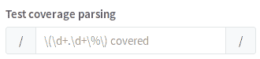
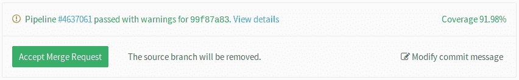
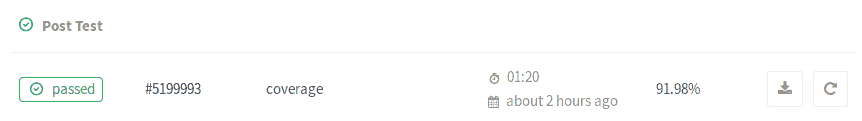
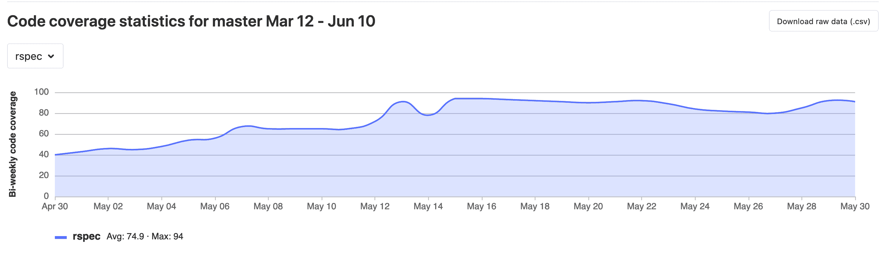
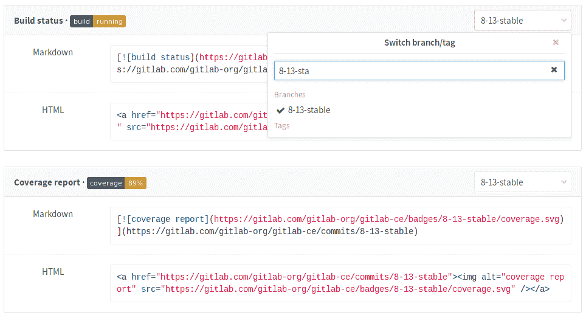

# Pipeline settings

> 原文：[https://docs.gitlab.com/ee/ci/pipelines/settings.html](https://docs.gitlab.com/ee/ci/pipelines/settings.html)

*   [Git strategy](#git-strategy)
*   [Git shallow clone](#git-shallow-clone)
*   [Timeout](#timeout)
    *   [Timeout overriding on Runner level](#timeout-overriding-on-runner-level)
*   [Maximum artifacts size](#maximum-artifacts-size-core-only)
*   [Custom CI configuration path](#custom-ci-configuration-path)
*   [Test coverage parsing](#test-coverage-parsing)
    *   [Code Coverage history](#code-coverage-history)
    *   [Removing color codes](#removing-color-codes)
*   [Visibility of pipelines](#visibility-of-pipelines)
*   [Auto-cancel pending pipelines](#auto-cancel-pending-pipelines)
*   [Skip outdated deployment jobs](#skip-outdated-deployment-jobs)
*   [Pipeline Badges](#pipeline-badges)
    *   [Pipeline status badge](#pipeline-status-badge)
    *   [Test coverage report badge](#test-coverage-report-badge)
    *   [Badge styles](#badge-styles)
        *   [Flat (default)](#flat-default)
        *   [Flat square](#flat-square)
    *   [Custom badge text](#custom-badge-text)
*   [Environment Variables](#environment-variables)

# Pipeline settings[](#pipeline-settings "Permalink")

要达到管道设置，请导航至项目的**"设置">" CI / CD"** .

可以为每个项目配置以下设置.

有关概述，请观看视频[GitLab CI 管道，工件和环境](https://www.youtube.com/watch?v=PCKDICEe10s) . 也请观看[面向初学者的 GitLab CI 管道教程](https://www.youtube.com/watch?v=Jav4vbUrqII) .

## Git strategy[](#git-strategy "Permalink")

使用 Git 策略，您可以选择从作业中的 GitLab 提取存储库的默认方式.

有两种选择. 使用：

*   `git clone` ，速度较慢，因为它会为每个作业从头开始克隆存储库，以确保本地工作副本始终是原始的.
*   `git fetch` ，它更快地重新使用本地工作副本（如果不存在，则回退为克隆）.

默认的 Git 策略可以由`.gitlab-ci.yml`的[GIT_STRATEGY 变量](../yaml/README.html#git-strategy)覆盖.

## Git shallow clone[](#git-shallow-clone "Permalink")

[Introduced](https://gitlab.com/gitlab-org/gitlab-foss/-/merge_requests/28919) in GitLab 12.0.

**注意：**从 GitLab 12.0 开始，新创建的项目将自动具有默认的`git depth`值`50` .

克隆存储库时，可以限制 GitLab CI / CD 获取的更改数量. 设置`git depth`的限制可以加快管道的执行速度. 最大允许值为`1000` .

要禁用浅表克隆并使 GitLab CI / CD 每次获取所有分支和标签，请将值保留为空或设置为`0` .

`.gitlab-ci.yml`文件中的[`GIT_DEPTH`](../large_repositories/index.html#shallow-cloning)变量也可以[覆盖](../large_repositories/index.html#shallow-cloning)此值.

## Timeout[](#timeout "Permalink")

超时定义了作业可以运行的最长时间（以分钟为单位）. 这可以在项目的**设置> CI / CD>常规管道设置下进行配置** . 默认值为 60 分钟. 如果要对作业的运行时间施加硬性限制，则减少时间限制，否则增加该限制. 无论如何，如果作业超过阈值，则将其标记为失败.

### Timeout overriding on Runner level[](#timeout-overriding-on-runner-level "Permalink")

在 GitLab 10.7 中[引入](https://gitlab.com/gitlab-org/gitlab-foss/-/merge_requests/17221) .

项目定义的超时（用户设置的特定超时或默认的 60 分钟超时）可以[在 Runner 级别](../runners/README.html#set-maximum-job-timeout-for-a-runner)上[覆盖](../runners/README.html#set-maximum-job-timeout-for-a-runner) .

## Maximum artifacts size[](#maximum-artifacts-size-core-only "Permalink")

有关为项目设置最大工件大小的信息，请参见[最大工件大小](../../user/admin_area/settings/continuous_integration.html#maximum-artifacts-size-core-only) .

## Custom CI configuration path[](#custom-ci-configuration-path "Permalink")

版本历史

*   在 GitLab 9.4 中[引入](https://gitlab.com/gitlab-org/gitlab-foss/-/merge_requests/12509) .
*   [支持](https://gitlab.com/gitlab-org/gitlab/-/issues/14376)在 GitLab 12.6 中引入的[外部`.gitlab-ci.yml`位置](https://gitlab.com/gitlab-org/gitlab/-/issues/14376) .

默认情况下，我们在项目的根目录中查找`.gitlab-ci.yml`文件. 如果需要，您可以指定备用路径和文件名，包括项目外部的位置.

要自定义路径：

1.  转到项目的**设置> CI / CD** .
2.  展开**常规管道**部分.
3.  在" **定制 CI 配置路径"**字段中提供一个值.
4.  Click **保存更改**.

如果 CI 配置在非默认位置存储在资源库中，则该路径必须相对于根目录. 有效路径和文件名的示例包括：

*   `.gitlab-ci.yml` (default)
*   `.my-custom-file.yml`
*   `my/path/.gitlab-ci.yml`
*   `my/path/.my-custom-file.yml`

如果 CI 配置将托管在外部站点上，则 URL 链接必须以`.yml` ：

*   `http://example.com/generate/ci/config.yml`

如果 CI 配置将托管在 GitLab 中的其他项目中，则该路径必须相对于另一个项目中的根目录，并在最后添加组和项目名称：

*   `.gitlab-ci.yml@mygroup/another-project`
*   `my/path/.my-custom-file.yml@mygroup/another-project`

将配置文件托管在单独的项目中，可以更严格地控​​制配置文件. 例如：

*   创建一个公共项目来承载配置文件.
*   仅向被允许编辑文件的用户授予对项目的写权限.

其他用户和项目将能够访问配置文件而无需对其进行编辑.

## Test coverage parsing[](#test-coverage-parsing "Permalink")

如果您在代码中使用测试覆盖率，则 GitLab 可以使用正则表达式将其输出捕获到作业日志中. 在管道设置中，搜索"测试 coverage 解析"部分.

[](img/pipelines_settings_test_coverage.png)

如果要禁用它或输入 Ruby 正则表达式，请保留空白. 您可以使用[https://rubular.com](https://rubular.com)来测试您的正则表达式. 正则表达式返回在输出中找到的**最后一个**匹配项.

如果管道成功，则覆盖范围将显示在合并请求窗口小部件和作业表中.

[](img/pipelines_test_coverage_mr_widget.png)

[](img/pipelines_test_coverage_build.png)

可以在管道设置页面中找到一些针对多种语言的已知覆盖工具的示例.

### Code Coverage history[](#code-coverage-history "Permalink")

Version history

*   [引入](https://gitlab.com/gitlab-org/gitlab/-/issues/209121)了在 GitLab 12.10 中下载`.csv` .
*   GitLab 13.1 中[引入的图](https://gitlab.com/gitlab-org/gitlab/-/issues/33743) .

如果您想查看项目代码覆盖率随时间的变化，则可以查看图形或下载包含此数据的 CSV 文件. 从您的项目中：

1.  去 **单击项目分析>存储库，**以查看图表上方下拉列表中列出的每个作业的历史数据.
2.  如果您想要该数据的 CSV 文件，请点击**下载原始数据（.csv）**

[](img/code_coverage_graph_v13_1.png)

### Removing color codes[](#removing-color-codes "Permalink")

某些使用 ANSI 颜色代码输出的测试 coverage 工具无法通过正则表达式正确解析，并且会导致 coverage 解析失败.

如果 Coverage 工具没有提供禁用输出中颜色代码的选项，则可以通过一个小的单行脚本通过管道传递 Coverage 工具的输出，该脚本将去除颜色代码.

例如：

```
lein cloverage | perl -pe 's/\e\[?.*?[\@-~]//g' 
```

## Visibility of pipelines[](#visibility-of-pipelines "Permalink")

Pipeline visibility is determined by:

*   您当前的[用户访问级别](../../user/permissions.html) .
*   项目**设置> CI / CD>常规管道**下的**公共管道**项目设置.

**注意：**如果项目可见性设置为" **私有"** ，则" [**公共管道"**设置将无效](../enable_or_disable_ci.html#per-project-user-setting) .

这也决定了这些相关功能的可见性：

*   作业输出日志
*   工作文物
*   The [pipeline security dashboard](../../user/application_security/security_dashboard/index.html#pipeline-security)

**注意：**当前， [访客用户和非项目成员尚看不到](https://gitlab.com/gitlab-org/gitlab/-/issues/25649)作业日志和工件.

如果启用了**公共管道** （默认）：

*   对于**公共**项目，任何人都可以查看管道和相关功能.
*   对于**内部**项目，任何登录的用户都可以查看管道和相关功能.
*   对于**私有**项目，任何项目成员（访客或更高级别）都可以查看管道和相关功能.

如果禁用**公共管道** ：

*   对于**公共**项目，任何人都可以查看管道，但是只有成员（报告者或更高级别）可以访问相关功能.
*   对于**内部**项目，任何登录的用户都可以查看管道. 但是，只有成员（记者或更高级别）可以访问与工作相关的功能.
*   对于**私有**项目，只有项目成员（报告者或更高版本）才能查看管道或访问相关功能.

## Auto-cancel pending pipelines[](#auto-cancel-pending-pipelines "Permalink")

在 GitLab 9.1 中[引入](https://gitlab.com/gitlab-org/gitlab-foss/-/merge_requests/9362) .

如果您希望每次创建新管道时（例如在 Git 推送之后或从 UI 手动创建）每次自动取消分支上所有未决的非 HEAD 管道，都可以在项目设置中启用此功能：

1.  去 **设置> CI / CD** .
2.  Expand **通用管道**.
3.  选中**自动取消冗余的未决管道**复选框.
4.  Click **保存更改**.

请注意，只有可[中断](../yaml/README.html#interruptible)设置为`true`作业才会被取消.

## Skip outdated deployment jobs[](#skip-outdated-deployment-jobs "Permalink")

在 GitLab 12.9 中[引入](https://gitlab.com/gitlab-org/gitlab/-/issues/25276) .

您的项目可能有多个并发部署作业，这些作业计划在同一时间范围内运行.

这可能导致旧的部署作业在新的作业之后运行，而这可能不是您想要的.

为了避免这种情况：

1.  去 **设置> CI / CD** .
2.  Expand **通用管道**.
3.  选中**跳过过期的部署作业**复选框.
4.  Click **保存更改**.

挂起的部署作业将被跳过.

有关更多信息，请参阅[部署安全](../environments/deployment_safety.html) .

## Pipeline Badges[](#pipeline-badges "Permalink")

在管道设置页面中，您可以找到项目的管道状态和测试覆盖率标志. 最新成功的管道将用于读取管道状态和测试覆盖率值.

访问项目中的管道设置页面，以查看指向徽章的确切链接，以及将徽章图像嵌入 HTML 或 Markdown 页面的方法.

[](img/pipelines_settings_badges.png)

### Pipeline status badge[](#pipeline-status-badge "Permalink")

根据您的工作状态，徽章可以具有以下值：

*   pending
*   running
*   passed
*   failed
*   skipped
*   canceled
*   unknown

您可以使用以下链接访问管道状态标志图像：

```
https://example.gitlab.com/<namespace>/<project>/badges/<branch>/pipeline.svg 
```

### Test coverage report badge[](#test-coverage-report-badge "Permalink")

GitLab 使定义[覆盖率报告](#test-coverage-parsing)的正则表达式成为可能，每个作业日志都将与之匹配. 这意味着管道中的每个作业都可以定义测试覆盖率百分比值.

可以使用以下链接访问测试覆盖率徽章：

```
https://example.gitlab.com/<namespace>/<project>/badges/<branch>/coverage.svg 
```

如果要从特定作业获取覆盖率报告，可以将`job=coverage_job_name`参数添加到 URL. 例如，以下 Markdown 代码会将`coverage`作业的测试覆盖率报告标志嵌入到`README.md` ：

```
 
```

### Badge styles[](#badge-styles "Permalink")

通过向 URL 添加`style=style_name`参数，可以以不同的样式呈现管道标志. 当前有两种样式：

#### Flat (default)[](#flat-default "Permalink")

```
https://example.gitlab.com/<namespace>/<project>/badges/<branch>/coverage.svg?style=flat 
```

[](https://gitlab.com/gitlab-org/gitlab/badges/master/coverage.svg?job=coverage&style=flat)

#### Flat square[](#flat-square "Permalink")

在 GitLab 11.8 中[引入](https://gitlab.com/gitlab-org/gitlab-foss/-/issues/30120) .

```
https://example.gitlab.com/<namespace>/<project>/badges/<branch>/coverage.svg?style=flat-square 
```

[](https://gitlab.com/gitlab-org/gitlab/badges/master/coverage.svg?job=coverage&style=flat-square)

### Custom badge text[](#custom-badge-text "Permalink")

在 GitLab 13.1 中[引入](https://gitlab.com/gitlab-org/gitlab/-/issues/17555) .

徽章的文本可以自定义. 这有助于区分在同一管道中运行的多个 Coverage 作业. 通过将`key_text=custom_text`和`key_width=custom_key_width`参数添加到 URL 来定制徽章文本和宽度：

```
https://gitlab.com/gitlab-org/gitlab/badges/master/coverage.svg?job=karma&key_text=Frontend+Coverage&key_width=100 
```

[](https://gitlab.com/gitlab-org/gitlab/badges/master/coverage.svg?job=karma&key_text=Frontend+Coverage&key_width=100)

## Environment Variables[](#environment-variables "Permalink")

可以在环境中设置[环境变量](../variables/README.html#gitlab-cicd-environment-variables)以供跑步者使用.