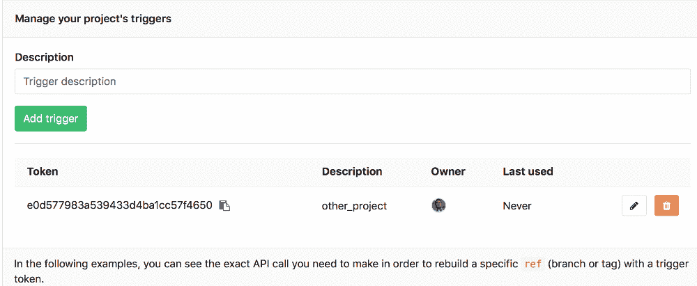
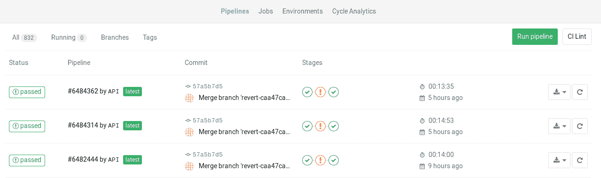
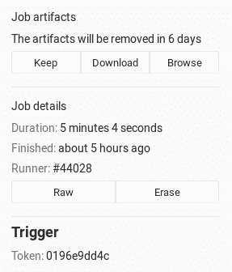
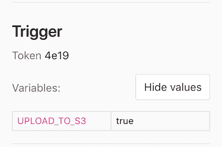

# Triggering pipelines through the API

> 原文：[https://docs.gitlab.com/ee/ci/triggers/README.html](https://docs.gitlab.com/ee/ci/triggers/README.html)

*   [Authentication tokens](#authentication-tokens)
    *   [Trigger token](#trigger-token)
    *   [CI job token](#ci-job-token)
        *   [When used with multi-project pipelines](#when-used-with-multi-project-pipelines)
        *   [When a pipeline depends on the artifacts of another pipeline](#when-a-pipeline-depends-on-the-artifacts-of-another-pipeline-premium)
*   [Adding a new trigger](#adding-a-new-trigger)
*   [Revoking a trigger](#revoking-a-trigger)
*   [Triggering a pipeline](#triggering-a-pipeline)
*   [Triggering a pipeline from a webhook](#triggering-a-pipeline-from-a-webhook)
*   [Making use of trigger variables](#making-use-of-trigger-variables)
*   [Using cron to trigger nightly pipelines](#using-cron-to-trigger-nightly-pipelines)
*   [Legacy triggers](#legacy-triggers)

# Triggering pipelines through the API[](#triggering-pipelines-through-the-api "Permalink")

版本历史

**注意事项** ：

*   在 GitLab 7.14 中[引入](https://about.gitlab.com/releases/2015/08/22/gitlab-7-14-released/) .
*   GitLab 8.12 具有完全重新设计的工作权限系统. 阅读有关[新模型及其含义的](../../user/project/new_ci_build_permissions_model.html#pipeline-triggers)所有信息.

触发器可用于通过 API 调用强制重新运行特定`ref` （分支或标签）的管道.

## Authentication tokens[](#authentication-tokens "Permalink")

支持以下身份验证方法：

*   [Trigger token](#trigger-token)
*   [CI job token](#ci-job-token)

如果使用`$CI_PIPELINE_SOURCE` [预定义环境变量](../variables/predefined_variables.html)来限制在管道中运行的作业，则值可以是`pipeline`或`trigger` ，具体取决于所使用的触发器方法.

| `$CI_PIPELINE_SOURCE` value | 触发方式 |
| --- | --- |
| `pipeline` | 使用 CI / CD 配置文件中的`trigger:`关键字，或将触发器 API 与`$CI_JOB_TOKEN` . |
| `trigger` | 使用生成的触发令牌使用触发 API |

当使用`pipelines`或使用[`only/except`](../yaml/README.html#onlyexcept-basic)传统[`only/except`基本语法`only/except`](../yaml/README.html#onlyexcept-basic) `triggers`关键字时，这也适用.

### Trigger token[](#trigger-token "Permalink")

A unique trigger token can be obtained when [adding a new trigger](#adding-a-new-trigger).

**危险：**在公共项目中传递纯文本令牌是一个安全问题. 潜在的攻击者可以在`.gitlab-ci.yml`文件中假冒公开暴露其触发令牌的用户. 使用[变量](../variables/README.html#gitlab-cicd-environment-variables)来保护触发令牌.

### CI job token[](#ci-job-token "Permalink")

You can use the `CI_JOB_TOKEN` [variable](../variables/README.html#predefined-environment-variables) (used to authenticate with the [GitLab Container Registry](../../user/packages/container_registry/index.html)) in the following cases.

#### When used with multi-project pipelines[](#when-used-with-multi-project-pipelines "Permalink")

版本历史

*   在[GitLab Premium](https://about.gitlab.com/pricing/) 9.3 中[引入](https://gitlab.com/gitlab-org/gitlab/-/merge_requests/2017)了`CI_JOB_TOKEN`在多项目管道中的使用.
*   在 GitLab 12.4 的所有层中都[可以](https://gitlab.com/gitlab-org/gitlab/-/issues/31573)将`CI_JOB_TOKEN`用于多项目管道.

这种触发方式只能在`.gitlab-ci.yml`内部调用时使用，并且会在[管道图](../multi_project_pipelines.html#overview)上创建可见的依赖管道关系. 例如：

```
build_docs:
  stage: deploy
  script:
    - curl --request POST --form "token=$CI_JOB_TOKEN" --form ref=master https://gitlab.example.com/api/v4/projects/9/trigger/pipeline
  only:
    - tags 
```

以这种方式触发的管道还公开了一个特殊变量： `CI_PIPELINE_SOURCE=pipeline` .

阅读有关[管道触发器 API 的](../../api/pipeline_triggers.html)更多信息.

#### When a pipeline depends on the artifacts of another pipeline[](#when-a-pipeline-depends-on-the-artifacts-of-another-pipeline-premium "Permalink")

在[GitLab Premium](https://about.gitlab.com/pricing/) 9.5 中[引入了](https://gitlab.com/gitlab-org/gitlab/-/merge_requests/2346)在工件下载 API 中使用`CI_JOB_TOKEN` .

随着不同项目之间的依赖关系的引入，其中一个项目可能需要访问由前一个项目创建的工件. 必须为授权访问授予此过程，并且可以使用标识特定作业的`CI_JOB_TOKEN`变量完成此过程. 例如：

```
build_submodule:
  image: debian
  stage: test
  script:
    - apt update && apt install -y unzip
    - curl --location --output artifacts.zip "https://gitlab.example.com/api/v4/projects/1/jobs/artifacts/master/download?job=test&job_token=$CI_JOB_TOKEN"
    - unzip artifacts.zip
  only:
    - tags 
```

这使您可以将其用于多项目管道，并从您有权访问的任何项目下载工件，因为这遵循与[权限模型](../../user/permissions.html#job-permissions)相同的原则.

了解有关[Jobs API 的](../../api/jobs.html#download-the-artifacts-archive)更多信息.

## Adding a new trigger[](#adding-a-new-trigger "Permalink")

您可以通过在"触发器"下转到项目的**"设置"➔CI / CD**来添加新**触发器** . **添加触发器**按钮将创建一个新令牌，然后您可以使用该令牌来触发此特定项目管道的重新运行.

您创建的每个新触发器都会被分配一个不同的令牌，然后您可以在脚本或`.gitlab-ci.yml`使用该令牌. 您还可以很好地了解上一次使用触发器的时间.

[](img/triggers_page.png)

## Revoking a trigger[](#revoking-a-trigger "Permalink")

您可以随时通过单击" **触发器"**下项目的**"设置"➔CI / CD**并单击" **撤消"**按钮来**撤消** **触发器** . 动作是不可逆的.

## Triggering a pipeline[](#triggering-a-pipeline "Permalink")

> **Notes**:
> 
> *   有效的引用只是分支和标签. 如果通过提交 SHA 作为参考，它将不会触发作业.

要触发作业，您需要向 gitLab 的 API 端点发送`POST`请求：

```
POST /projects/:id/trigger/pipeline 
```

必需的参数是[触发器的`token`](#authentication-tokens)和将在其上执行触发器的 Git `ref` . 有效的引用是分支和标签. 可以通过[查询 API](../../api/projects.html)或访问**CI / CD**设置页面（提供不言自明的示例）来找到项目的`:id` .

触发管道的重新运行时，该信息会在 GitLab 的 UI 中显示在**Jobs**页面下，并且作业被标记为"由 API 触发".

[](img/builds_page.png)

* * *

您可以通过访问单个作业页面查看是哪个触发器导致了重建. 从下图中可以看到，触发器的令牌的一部分显示在 UI 中.

[](img/trigger_single_build.png)

* * *

通过使用 cURL，您可以以最小的努力触发管道重新运行，例如：

```
curl --request POST \
     --form token=TOKEN \
     --form ref=master \
     https://gitlab.example.com/api/v4/projects/9/trigger/pipeline 
```

在这种情况下，ID `9`的项目将在`master`分支上重建.

或者，您可以在查询字符串中传递`token`和`ref`参数：

```
curl --request POST \
    "https://gitlab.example.com/api/v4/projects/9/trigger/pipeline?token=TOKEN&ref=master" 
```

您还可以在`.gitlab-ci.yml`使用触发器来`.gitlab-ci.yml` . 假设您有两个项目 A 和 B，并且每当在项目 A 上创建标签时，您都希望在项目 B 的`master`分支上触发重建. 这是您需要在项目 A 的`.gitlab-ci.yml`添加的工作：

```
build_docs:
  stage: deploy
  script:
    - "curl  --request  POST  --form  token=TOKEN  --form  ref=master  https://gitlab.example.com/api/v4/projects/9/trigger/pipeline"
  only:
    - tags 
```

这意味着每当在项目 A 上添加新标签时，该作业就会运行，并且`build_docs`作业将被执行，从而触发项目 B 的重建`build_docs` `stage: deploy`确保该作业仅在所有带有`stage: test`作业之后运行成功完成.

## Triggering a pipeline from a webhook[](#triggering-a-pipeline-from-a-webhook "Permalink")

版本历史

**注意事项** ：

*   在 GitLab 8.14 中引入.
*   `ref`应该作为 URL 的一部分传递，以便优先于来自 Webhook 主体的`ref` ，该 Webhook 主体指定了触发源存储库中的触发器的分支 ref.
*   `ref`包含斜杠，则应进行 URL 编码.

要从另一个项目的 Webhook 触发作业，您需要为 Push 和 Tag 事件添加以下 Webhook URL（更改项目 ID，ref 和 token）：

```
https://gitlab.example.com/api/v4/projects/9/ref/master/trigger/pipeline?token=TOKEN 
```

## Making use of trigger variables[](#making-use-of-trigger-variables "Permalink")

您可以在触发器 API 调用中传递任意数量的任意变量，这些变量将在 GitLab CI / CD 中可用，以便可以在您的`.gitlab-ci.yml`文件中使用. 参数的形式为：

```
variables[key]=value 
```

此信息也显示在 UI 中. 请注意，只有所有者和维护者才能看到这些*值* .

[](img/trigger_variables.png)

出于多种原因，使用触发器变量可能被证明是有用的：

*   可识别的工作. 由于该变量在 UI 中公开，因此您可以通过传递解释目的的变量来知道为什么触发了重建.
*   有条件的作业处理. 您可以让有条件的作业在存在某个变量时运行.

考虑以下`.gitlab-ci.yml` ，我们在其中设置了三个[阶段](../yaml/README.html#stages) ，仅当测试和构建阶段中的所有作业都通过时， `upload_package`作业才运行. 当`UPLOAD_TO_S3`变量不为零时，运行`make upload` .

```
stages:
  - test
  - build
  - package

run_tests:
  stage: test
  script:
    - make test

build_package:
  stage: build
  script:
    - make build

upload_package:
  stage: package
  script:
    - if [ -n "${UPLOAD_TO_S3}" ]; then make upload; fi 
```

然后，您可以在传递`UPLOAD_TO_S3`变量时触发重建，并且`upload_package`作业的脚本将运行：

```
curl --request POST \
  --form token=TOKEN \
  --form ref=master \
  --form "variables[UPLOAD_TO_S3]=true" \
  https://gitlab.example.com/api/v4/projects/9/trigger/pipeline 
```

触发变量在所有类型的变量中具有[最高优先级](../variables/README.html#priority-of-environment-variables) .

## Using cron to trigger nightly pipelines[](#using-cron-to-trigger-nightly-pipelines "Permalink")

> **注意：**以下行为也可以通过 GitLab 的 UI 与[管道计划一起实现](../pipelines/schedules.html) .

无论您编写脚本还是直接运行 cURL，都可以与 cron 一起触发作业. 以下示例每晚`00:30`在 ID 为`9`的项目的`master`分支上触发一个作业：

```
30 0 * * * curl --request POST --form token=TOKEN --form ref=master https://gitlab.example.com/api/v4/projects/9/trigger/pipeline 
```

## Legacy triggers[](#legacy-triggers "Permalink")

在 GitLab 9.0 之前创建的旧触发器将被标记为旧触发器.

具有旧标签的触发器没有关联的用户，只能访问当前项目. 它们被认为已弃用，并将在将来的 GitLab 版本中删除.