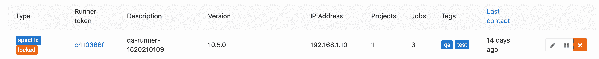

# Configuring GitLab Runners

> 原文：[https://docs.gitlab.com/ee/ci/runners/README.html](https://docs.gitlab.com/ee/ci/runners/README.html)

*   [Types of Runners](#types-of-runners)
    *   [Shared Runners](#shared-runners)
        *   [How shared Runners pick jobs](#how-shared-runners-pick-jobs)
        *   [Enable shared Runners](#enable-shared-runners)
        *   [Disable shared Runners](#disable-shared-runners)
    *   [Group Runners](#group-runners)
        *   [Create a group Runner](#create-a-group-runner)
        *   [View and manage group Runners](#view-and-manage-group-runners)
        *   [Pause or remove a group Runner](#pause-or-remove-a-group-runner)
    *   [Specific Runners](#specific-runners)
        *   [Create a specific Runner](#create-a-specific-runner)
        *   [Enable a specific Runner for a specific project](#enable-a-specific-runner-for-a-specific-project)
        *   [Prevent a specific Runner from being enabled for other projects](#prevent-a-specific-runner-from-being-enabled-for-other-projects)
*   [Manually clear the Runner cache](#manually-clear-the-runner-cache)
*   [Set maximum job timeout for a Runner](#set-maximum-job-timeout-for-a-runner)
*   [Be careful with sensitive information](#be-careful-with-sensitive-information)
    *   [Prevent Runners from revealing sensitive information](#prevent-runners-from-revealing-sensitive-information)
    *   [Forks](#forks)
    *   [Attack vectors in Runners](#attack-vectors-in-runners)
    *   [Reset the Runner registration token for a project](#reset-the-runner-registration-token-for-a-project)
*   [Determine the IP address of a Runner](#determine-the-ip-address-of-a-runner)
    *   [Determine the IP address of a shared Runner](#determine-the-ip-address-of-a-shared-runner)
    *   [Determine the IP address of a specific Runner](#determine-the-ip-address-of-a-specific-runner)
*   [Use tags to limit the number of jobs using the Runner](#use-tags-to-limit-the-number-of-jobs-using-the-runner)
    *   [Runner runs only tagged jobs](#runner-runs-only-tagged-jobs)
    *   [Runner is allowed to run untagged jobs](#runner-is-allowed-to-run-untagged-jobs)

# Configuring GitLab Runners

在 GitLab CI / CD 中，运行程序运行[`.gitlab-ci.yml`](../yaml/README.html)定义的代码. GitLab Runner 是一种轻量级，高度可扩展的代理，它通过 GitLab CI / CD 的协调器 API 提取 CI 作业，运行该作业，并将结果发送回 GitLab 实例.

运行程序由管理员创建，并在 GitLab UI 中可见. 运行者可以特定于某些项目，也可以适用于所有项目.

## Types of Runners

跑步者共有三种类型：

*   [共享](#shared-runners) （对于所有项目）
*   [组](#group-runners) （对于[组](#group-runners)中的所有项目）
*   [具体](#specific-runners) （针对特定项目）

如果您正在运行自我管理的 GitLab，则可以创建自己的 Runners.

如果使用的是 GitLab.com，则可以使用 GitLab 提供的共享运行程序，也可以创建自己的组或特定运行程序.

### Shared Runners

GitLab 实例中的每个项目都可以使用*共享运行器* .

当您有多个要求相似的作业时，请使用共享的运行器. 您可以让几个处理多个项目的 Runner 而不是让多个 Runner 空闲多个项目.

如果您使用的是 GitLab 的自我管理实例：

*   您的管理员可以通过查看[此处](https://docs.gitlab.com/runner/install/index.html)的说明来安装和注册共享运行程序.
*   管理员还可[以为每个组](../../user/admin_area/settings/continuous_integration.html#shared-runners-pipeline-minutes-quota-starter-only)配置最大的共享 Runner [管道分钟数](../../user/admin_area/settings/continuous_integration.html#shared-runners-pipeline-minutes-quota-starter-only) .

如果您使用的是 GitLab.com：

*   您可以从[GitLab 维护](../../user/gitlab_com/index.html#shared-runners)的[共享运行程序](../../user/gitlab_com/index.html#shared-runners)列表中进行选择.
*   共享的跑步者会消耗您帐户中包含的[管道分钟](../../subscriptions/index.html#ci-pipeline-minutes) .

#### How shared Runners pick jobs

共享运行者通过使用合理使用队列来处理作业. 此队列可防止项目创建数百个作业并使用所有可用的共享 Runner 资源.

合理使用队列算法根据已在共享 Runner 上运行的作业数量最少的项目分配作业.

**Example 1**

如果这些作业在队列中：

*   项目 1 的工作 1
*   项目 1 的工作 2
*   项目 1 的工作 3
*   项目 2 的工作 4
*   项目 2 的工作 5
*   项目 3 的工作 6

合理使用算法按以下顺序分配作业：

1.  首先选择作业 1，因为它在没有正在运行的作业的项目（即所有项目）中具有最低的作业编号.
2.  接下来是作业 4，因为现在 4 是来自没有正在运行的作业的项目中最低的作业编号（项目 1 有正在运行的作业）.
3.  接下来是作业 6，因为 6 现在是没有正在运行的作业的项目中最低的作业编号（项目 1 和 2 有正在运行的作业）.
4.  接下来是作业 2，因为在运行的作业数量最少的项目（每个都有 1）中，它是最低的作业数量.
5.  接下来是作业 5，因为项目 1 现在有 2 个正在运行的作业，而作业 5 是项目 2 和项目 3 之间剩余的最低编号.
6.  最后是工作 3…，因为这是剩下的唯一工作.

* * *

**例子 2**

如果这些作业在队列中：

*   项目 1 的工作 1
*   项目 1 的工作 2
*   项目 1 的工作 3
*   项目 2 的工作 4
*   项目 2 的工作 5
*   项目 3 的工作 6

合理使用算法按以下顺序分配作业：

1.  首先选择作业 1，因为它在没有正在运行的作业的项目（即所有项目）中具有最低的作业编号.
2.  我们完成工作 1.
3.  接下来是作业 2，因为完成作业 1 后，所有项目都再次运行 0 个作业，而 2 是最低的可用作业号.
4.  接下来是作业 4，因为在项目 1 运行作业的情况下，项目 4 在没有运行作业的项目（项目 2 和 3）中是最低的.
5.  我们完成工作 4.
6.  接下来是作业 5，因为完成了作业 4，所以项目 2 没有再次运行的作业.
7.  接下来是作业 6，因为项目 3 是唯一没有运行作业的项目.
8.  最后，我们选择作业 3…，因为它再次是唯一剩下的作业.

#### Enable shared Runners

在 GitLab.com 上，默认情况下在所有项目中启用[共享运行器](#shared-runners) .

On self-managed instances of GitLab, an administrator must [install](https://docs.gitlab.com/runner/install/index.html) and [register](https://docs.gitlab.com/runner/register/index.html) them.

您还可以为单个项目启用共享运行器.

要启用共享跑步者：

1.  转到项目的 **设置> CI / CD，**然后展开" **跑步者"**部分.
2.  Click **允许共享跑步者**.

#### Disable shared Runners

您可以为单个项目禁用共享运行器. 您必须具有项目的所有者权限.

要为项目禁用共享运行器：

1.  转到项目的 **设置> CI / CD，**然后展开" **跑步者"**部分.
2.  在" **共享运行程序"**区域中，单击" **禁用共享运行程序"** .

### Group Runners

当您希望组中的所有项目都可以访问一组运行器时，请使用" *组运行器"* .

Group Runners process jobs by using a first in, first out ([FIFO](https://en.wikipedia.org/wiki/FIFO_(computing_and_electronics))) queue.

#### Create a group Runner

您可以为自己管理的 GitLab 实例或 GitLab.com 创建一个组 Runner. 您必须具有该组的[所有者权限](../../user/permissions.html#group-members-permissions) .

创建组跑步者：

1.  [Install Runner](https://docs.gitlab.com/runner/install/).
2.  转到您要使 Runner 运行的组.
3.  去 **设置> CI / CD，**然后展开" **跑步者"**部分.
4.  注意 URL 和令牌.
5.  [Register the Runner](https://docs.gitlab.com/runner/register/).

#### View and manage group Runners

在 GitLab 13.2 中[引入](https://gitlab.com/gitlab-org/gitlab/-/issues/37366/) .

您可以查看和管理组，其子组和项目的所有运行器. 您可以为自己管理的 GitLab 实例或 GitLab.com 执行此操作. 您必须具有该组的[所有者权限](../../user/permissions.html#group-members-permissions) .

1.  转到要查看跑步者的组.
2.  去 **设置> CI / CD，**然后展开" **跑步者"**部分.
3.  显示以下字段.

    | Attribute | Description |
    | --- | --- |
    | Type | 以下一种或多种状态：共享，组，特定，锁定或暂停 |
    | 赛跑者令牌 | 令牌用于标识 Runner，并且 Runner 用于与 GitLab 实例进行通信 |
    | Description | 创建跑步者时的描述 |
    | Version | GitLab Runner 版本 |
    | IP 地址 | 注册了运行程序的主机的 IP 地址 |
    | Projects | Runner 分配到的项目数 |
    | Jobs | 跑步者所从事的工作总数 |
    | Tags | 与跑步者相关的标签 |
    | 最后联络人 | 指示 GitLab 实例最后一次与 Runner 联系的时间戳 |

在此页面上，您可以编辑，暂停和从组，其子组和项目中删除"跑步者".

#### Pause or remove a group Runner

您可以为自己管理的 GitLab 实例或 GitLab.com 暂停或删除组运行器. 您必须具有该组的[所有者权限](../../user/permissions.html#group-members-permissions) .

1.  转到您要删除或暂停 Runner 的组.
2.  去 **设置> CI / CD，**然后展开" **跑步者"**部分.
3.  Click **Pause** or **删除亚军**.
    *   如果您暂停由多个项目使用的组 Runner，则 Runner 会暂停所有项目.
    *   从组视图中，您无法删除分配给多个项目的运行器. 您必须先从每个项目中将其删除.
4.  在确认对话框中，单击**确定** .

### Specific Runners

当你想使用运动员的具体项目使用*特定的运动员* . 例如，当您拥有：

*   有特定要求的作业，例如需要凭据的部署作业.
*   CI 活动很多的项目可以从与其他运行者分离中受益.

您可以设置一个特定的 Runner，以供多个项目使用. 必须为每个项目明确启用特定的运行器.

特定运行程序通过使用[先进先出](https://en.wikipedia.org/wiki/FIFO_(computing_and_electronics)) （ [FIFO](https://en.wikipedia.org/wiki/FIFO_(computing_and_electronics)) ）队列来处理作业.

**注意：**特定运行器不会自动与分支项目共享. 分支*确实会*复制克隆存储库的 CI / CD 设置.

#### Create a specific Runner

您可以为自己管理的 GitLab 实例或 GitLab.com 创建特定的 Runner. 您必须具有项目的[所有者权限](../../user/permissions.html#project-members-permissions) .

要创建特定的运行器：

1.  [Install Runner](https://docs.gitlab.com/runner/install/).
2.  转到项目的 **设置> CI / CD，**然后展开" **跑步者"**部分.
3.  注意 URL 和令牌.
4.  [Register the Runner](https://docs.gitlab.com/runner/register/).

#### Enable a specific Runner for a specific project

在为其创建的项目中提供了特定的 Runner. 管理员可以使特定的 Runner 应用于其他项目.

*   您必须具有项目的所有者权限.
*   特定的跑步者一定不能被[锁定](#prevent-a-specific-runner-from-being-enabled-for-other-projects) .

要为项目启用或禁用特定的运行器：

1.  转到项目的 **设置> CI / CD，**然后展开" **跑步者"**部分.
2.  Click **为此项目启用** or **为此项目禁用**.

#### Prevent a specific Runner from being enabled for other projects

您可以配置一个特定的运行器，使其"锁定"并且不能为其他项目启用. 首次[注册 Runner](https://docs.gitlab.com/runner/register/)时可以启用此设置，但以后也可以更改.

锁定或解锁跑步者：

1.  转到项目的 **设置> CI / CD，**然后展开" **跑步者"**部分.
2.  找到您想要锁定或解锁的亚军. 确保已启用.
3.  单击铅笔按钮.
4.  选中" **锁定到当前项目"**选项.
5.  Click **保存更改**.

## Manually clear the Runner cache

Read [clearing the cache](../caching/index.html#clearing-the-cache).

## Set maximum job timeout for a Runner

对于每个跑步者，您可以指定*最大作业超时时间* . 如果此超时时间小于[项目定义的超时时间](../pipelines/settings.html#timeout) ，则优先.

此功能可用于防止共享的 Runner 被具有较长超时（例如，一个星期）的工作的项目淹没.

未配置时，Runner 将不会覆盖项目超时.

此功能的工作原理：

**示例 1-运行程序超时大于项目超时**

1.  您将跑步者的*最大作业超时*设置为 24 小时
2.  您将项目的*CI / CD 超时*设置为**2 小时**
3.  你开始工作
4.  如果工作时间更长，则**2 小时**后将超时

**示例 2-未配置运行程序超时**

1.  您从运行器中删除*最大作业超时*配置
2.  您将项目的*CI / CD 超时*设置为**2 小时**
3.  你开始工作
4.  如果工作时间更长，则**2 小时**后将超时

**示例 3-运行程序超时小于项目超时**

1.  您将跑步者的*最大作业超时*设置为**30 分钟**
2.  您将项目的*CI / CD 超时*设置为 2 小时
3.  你开始工作
4.  如果作业时间更长，则**30 分钟**后将超时

## Be careful with sensitive information

使用某些[Runner Executors](https://docs.gitlab.com/runner/executors/README.html) ，如果可以在 Runner 上运行作业，则可以完全访问文件系统，从而可以运行该文件的任何代码以及 Runner 的令牌. 使用共享的运行程序，这意味着在运行程序上运行作业的任何人都可以访问在运行程序上运行的任何其他人的代码.

另外，由于您可以访问 Runner 令牌，因此可以创建 Runner 的克隆并提交错误的作业.

通过限制在大型公共 GitLab 实例上共享[Runner 的](https://docs.gitlab.com/runner/executors/README.html)使用，控制对 GitLab 实例的访问以及使用更安全的[Runner Executor](https://docs.gitlab.com/runner/executors/README.html) ，可以轻松避免上述情况.

### Prevent Runners from revealing sensitive information

在 GitLab 10.0 中[引入](https://gitlab.com/gitlab-org/gitlab-foss/-/merge_requests/13194) .

您可以保护赛跑者，使他们不会泄露敏感信息. 当运行器受到保护时，运行器仅选择在[受保护分支](../../user/project/protected_branches.html)或[受保护标签](../../user/project/protected_tags.html)上创建的作业，而忽略其他作业.

保护或取消保护跑步者：

1.  转到项目的 **设置> CI / CD，**然后展开" **跑步者"**部分.
2.  找到您要保护或取消保护的跑步者. 确保已启用.
3.  单击铅笔按钮.
4.  检查**受保护的**选项.
5.  Click **保存更改**.

### Forks

每当分支一个项目时，它都会复制与其相关的作业的设置. 这意味着，如果您已经为项目设置了共享的 Runners，并且有人分叉了该项目，则共享的 Runners 也将为该项目的工作提供服务.

### Attack vectors in Runners

前面已经简要提到过，但是可以利用 Runners 的以下功能. 我们一直在寻找可以减轻这些[安全注意事项的因素](https://docs.gitlab.com/runner/security/) .

### Reset the Runner registration token for a project

如果您认为某个项目的注册令牌已公开，则应将其重置. 令牌可用于为该项目注册另一个 Runner. 然后可以使用该新 Runner 来获取秘密变量的值或克隆项目代码.

重置令牌：

1.  转到项目的 **设置> CI / CD** .
2.  展开**常规管道设置**部分.
3.  找到" **跑步者令牌"**表单字段，然后单击" **显示值"**按钮.
4.  删除值并保存表单.
5.  刷新页面后，展开" **跑步者设置"**部分并检查注册令牌-应该更改它.

从现在开始，旧令牌将不再有效，并且不会在项目中注册任何新的运行者. 如果您使用任何工具来供应和注册新的运行器，则应更新这些工具中使用的令牌以反映新令牌的价值.

## Determine the IP address of a Runner

在 GitLab 10.6 中[引入](https://gitlab.com/gitlab-org/gitlab-foss/-/merge_requests/17286) .

知道 Runner 的 IP 地址可能很有用，以便您可以解决该 Runner 的问题. GitLab 通过在轮询作业时查看向 GitLab 发出的 HTTP 请求的源来存储和显示 IP 地址. IP 地址始终保持最新，因此，如果 Runner IP 更改，它将在 GitLab 中自动更新.

共享运行程序和特定运行程序的 IP 地址可以在不同位置找到.

### Determine the IP address of a shared Runner

要查看共享运行器的 IP 地址，您必须具有对 GitLab 实例的管理员访问权限. 要确定这一点：

1.  Visit **管理区域>概述>跑步者**.
2.  在表中查找 Runner，您应该看到**IP Address**列.

### Determine the IP address of a specific Runner

若要查找特定项目的运行程序的 IP 地址，您必须具有该项目的所有者[权限](../../user/permissions.html#project-members-permissions) .

1.  转到项目的 **设置> CI / CD，**然后展开" **跑步者"**部分.
2.  在详细信息页面上，您应该看到**IP 地址**行.

## Use tags to limit the number of jobs using the Runner

您必须设置一个 Runner 才能运行它在共享项目上可能遇到的所有不同类型的作业. 如果不是标签，这对于大量项目将是有问题的.

通过将 Runner 标记为它可以处理的作业类型，可以确保共享的 Runners [仅运行其能够运行的作业](../yaml/README.html#tags) .

例如，在 GitLab 上，如果 Runners 包含运行 Rails 测试套件的适当依赖项，我们会将它们标记为`rails` .

[注册 Runner 时](https://docs.gitlab.com/runner/register/) ，其默认行为是**仅选择带** [标签的作业](../yaml/README.html#tags) . 要更改此设置，您必须具有项目的所有者[权限](../../user/permissions.html#project-members-permissions) .

要使跑步者选择无标签的工作，请执行以下操作：

1.  转到项目的 **设置> CI / CD，**然后展开" **跑步者"**部分.
2.  找到您要选择未加标签的作业的 Runner，并确保已启用它.
3.  单击铅笔按钮.
4.  选中**运行未加标签的作业**选项.
5.  单击**保存更改**按钮以使更改生效.

**注意：**不允许选择未标记的作业时，"运行者标签"列表不能为空.

以下是一些不同变化的示例场景.

### Runner runs only tagged jobs

以下示例说明了将 Runner 设置为仅运行带标签的作业的潜在影响.

范例 1：

1.  Runner 配置为仅运行带标签的作业，并具有`docker`标签.
2.  具有`hello`标签的作业将被执行并卡住.

Example 2:

1.  Runner 配置为仅运行带标签的作业，并具有`docker`标签.
2.  具有`docker`标签的作业将被执行并运行.

范例 3：

1.  Runner 配置为仅运行带标签的作业，并具有`docker`标签.
2.  没有定义标签的作业将被执行并卡住.

### Runner is allowed to run untagged jobs

以下示例说明了将 Runner 设置为运行带标签和未带标签的作业的潜在影响.

范例 1：

1.  Runner 配置为运行未加标签的作业，并具有`docker`标签.
2.  没有定义标签的作业将被执行并运行.
3.  执行并运行定义了`docker`标签的第二项作业.

范例 2：

1.  Runner 配置为运行未加标签的作业，并且未定义标签.
2.  没有定义标签的作业将被执行并运行.
3.  卡有定义了`docker`标签的第二项工作.