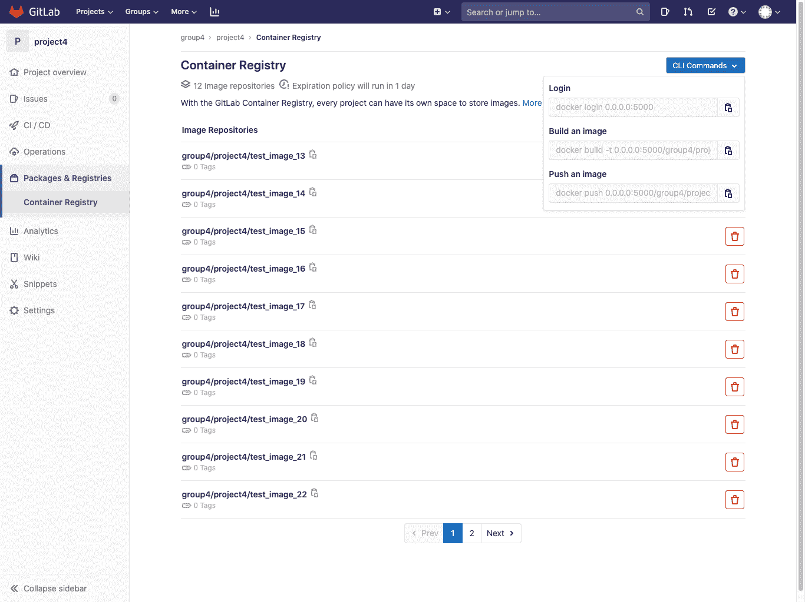
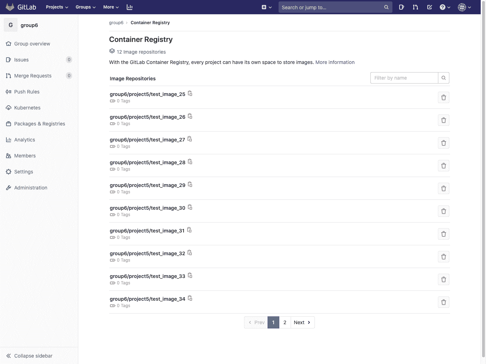

# GitLab Container Registry

> 原文：[https://docs.gitlab.com/ee/user/packages/container_registry/](https://docs.gitlab.com/ee/user/packages/container_registry/)

*   [Enable the Container Registry for your project](#enable-the-container-registry-for-your-project)
*   [Control Container Registry from within GitLab](#control-container-registry-from-within-gitlab)
    *   [Control Container Registry for your project](#control-container-registry-for-your-project)
    *   [Control Container Registry for your group](#control-container-registry-for-your-group)
    *   [Image Repository details page](#image-repository-details-page)
*   [Use images from GitLab Container Registry](#use-images-from-gitlab-container-registry)
*   [Authenticating to the GitLab Container Registry](#authenticating-to-the-gitlab-container-registry)
*   [Build and push images from your local machine](#build-and-push-images-from-your-local-machine)
*   [Build and push images using GitLab CI/CD](#build-and-push-images-using-gitlab-cicd)
    *   [Authenticating to the Container Registry with GitLab CI/CD](#authenticating-to-the-container-registry-with-gitlab-cicd)
    *   [Container Registry examples with GitLab CI/CD](#container-registry-examples-with-gitlab-cicd)
    *   [Using a Docker-in-Docker image from your Container Registry](#using-a-docker-in-docker-image-from-your-container-registry)
*   [Delete images](#delete-images)
    *   [Delete images from within GitLab](#delete-images-from-within-gitlab)
    *   [Delete images using the API](#delete-images-using-the-api)
    *   [Delete images using GitLab CI/CD](#delete-images-using-gitlab-cicd)
    *   [Delete images by using a cleanup policy](#delete-images-by-using-a-cleanup-policy)
*   [Cleanup policy](#cleanup-policy)
    *   [Managing project cleanup policy through the UI](#managing-project-cleanup-policy-through-the-ui)
        *   [Troubleshooting cleanup policies](#troubleshooting-cleanup-policies)
    *   [Managing project cleanup policy through the API](#managing-project-cleanup-policy-through-the-api)
    *   [Use with external container registries](#use-with-external-container-registries)
    *   [Regex pattern examples](#regex-pattern-examples)
*   [Use the Container Registry to store Helm Charts](#use-the-container-registry-to-store-helm-charts)
*   [Limitations](#limitations)
*   [Troubleshooting the GitLab Container Registry](#troubleshooting-the-gitlab-container-registry)
    *   [Docker connection error](#docker-connection-error)
    *   [Troubleshoot as a GitLab server admin](#troubleshoot-as-a-gitlab-server-admin)
    *   [Unable to change path or transfer a project](#unable-to-change-path-or-transfer-a-project)

# GitLab Container Registry[](#gitlab-container-registry "Permalink")

版本历史

*   在 GitLab 8.8 中[引入](https://gitlab.com/gitlab-org/gitlab-foss/-/merge_requests/4040) .
*   在 GitLab 8.9 中添加了 Docker Registry manifest `v1`支持，以支持 1.10 之前的 Docker 版本.
*   从 GitLab 8.12 开始，如果您的帐户中启用了 2FA，则需要传递[个人访问令牌（](../../profile/personal_access_tokens.html)而不是密码）才能登录到 GitLab 的 Container Registry.
*   在 GitLab 9.1 中添加了多级图像名称支持.
*   组级容器注册表是在 GitLab 12.10 中[引入的](https://gitlab.com/gitlab-org/gitlab/-/issues/23315) .
*   在 GitLab 13.0 中[引入](https://gitlab.com/gitlab-org/gitlab/-/merge_requests/31322)了按图像存储库名称搜索.

**注意：**本文档是用户指南. 要了解如何在整个 GitLab 实例上启用 GitLab 容器注册表，请访问[管理员文档](../../../administration/packages/container_registry.html) .

通过将 Docker 容器注册表集成到 GitLab 中，每个项目都可以拥有自己的空间来存储其 Docker 映像.

您可以在[https://docs.docker.com/registry/introduction/上](https://s0docs0docker0com.icopy.site/registry/introduction/)了解有关 Docker Registry 的更多信息.

[](img/container_registry_repositories_v13_1.png)

## Enable the Container Registry for your project[](#enable-the-container-registry-for-your-project "Permalink")

**警告：**容器注册表遵循项目的可见性设置. 如果项目是公开的，则容器注册表也是如此.

If you cannot find the **包和注册表>容器注册表** entry under your project’s sidebar, it is not enabled in your GitLab instance. Ask your administrator to enable GitLab Container Registry following the [administration documentation](../../../administration/packages/container_registry.html).

如果您使用的是 GitLab.com，则默认情况下启用此功能，因此您可以立即开始使用注册表. 当前，作为[存储库大小限制的](../../project/repository/index.html)一部分，GitLab.com 上的 Registry 有一个软的（10GB）大小限制.

为您的 GitLab 实例启用后，要为您的项目启用 Container Registry：

1.  转到项目的**"设置">"常规"**页面.
2.  展开" **可见性"，"项目功能"，"权限"**部分，并在项目上启用" **容器注册表"**功能. 对于新项目，默认情况下可以启用. 对于现有项目（GitLab 8.8 之前的版本），您必须显式启用它.
3.  按**保存更改**以使更改生效. 现在，您应该能够在侧栏中看到**Packages＆Registries> Container Registry**链接.

## Control Container Registry from within GitLab[](#control-container-registry-from-within-gitlab "Permalink")

GitLab 提供了一个简单的 Container Registry 管理面板. 该管理面板可用于项目和组.

### Control Container Registry for your project[](#control-container-registry-for-your-project "Permalink")

导航到您项目的 **包裹和注册>集装箱注册** .

[](img/container_registry_repositories_with_quickstart_v13_1.png)

该视图将：

*   显示属于该项目的所有图像存储库.
*   允许您按图像存储库的名称过滤.
*   允许您[删除](#delete-images-from-within-gitlab)一个或多个图像存储库.
*   允许您导航到图像存储库详细信息页面.
*   显示具有最常用命令的**快速入门**下拉列表，以登录，构建和推送
*   （可选）如果为该项目启用了[清理策略](#cleanup-policy) ，则将显示横幅.

### Control Container Registry for your group[](#control-container-registry-for-your-group "Permalink")

导航到您小组的 **包裹和注册>集装箱注册** .

[](img/container_registry_group_repositories_v13_1.png)

该视图将：

*   Show all the image repositories of the projects that belong to this group.
*   允许[删除](#delete-images-from-within-gitlab)一个或多个图像存储库.
*   允许导航到特定的图像存储库详细信息页面.

### Image Repository details page[](#image-repository-details-page "Permalink")

单击任何图像存储库的名称将导航到详细信息.

[](img/container_registry_repository_details_v13.0.png)

**注意：**下一页在**组级别容器注册表**和**项目级别容器注册表中**具有相同的功能.

此视图：

*   显示所有图像存储库详细信息.
*   显示图像存储库的所有标记.
*   允许您快速复制标签路径（通过单击标签名称附近的剪贴板按钮）.
*   允许您[删除一个或多个标签](#delete-images-from-within-gitlab) .

## Use images from GitLab Container Registry[](#use-images-from-gitlab-container-registry "Permalink")

要从 GitLab 容器注册表中托管的映像下载并运行容器，请使用`docker run` ：

```
docker run [options] registry.example.com/group/project/image [arguments] 
```

有关运行 Docker 容器的更多信息，请访问[Docker 文档](https://s0docs0docker0com.icopy.site/engine/userguide/intro/) .

## Authenticating to the GitLab Container Registry[](#authenticating-to-the-gitlab-container-registry "Permalink")

如果访问项目菜单下的**Packages＆Registries> Container Registry**链接，则可以看到使用 GitLab 凭据登录到 Container Registry 的明确说明.

例如，如果注册表的 URL 是`registry.example.com` ，那么您应该能够使用以下命令登录：

```
docker login registry.example.com 
```

**注意：**如果您的帐户中启用了[2 因子身份验证](../../profile/account/two_factor_authentication.html) ，则需要传递[个人访问令牌（](../../profile/personal_access_tokens.html)而不是密码）才能登录到 GitLab 的 Container Registry.

如果项目是私有项目，则需要提供凭据进行授权. 有两种方法可以做到这一点：

*   通过使用[个人访问令牌](../../profile/personal_access_tokens.html) .
*   通过使用[部署令牌](../../project/deploy_tokens/index.html) .

两者所需的最小范围是`read_registry` .

使用令牌的示例：

```
docker login registry.example.com -u <username> -p <token> 
```

## Build and push images from your local machine[](#build-and-push-images-from-your-local-machine "Permalink")

建立和发布图像应该是一个简单的过程. 只需确保您将注册表 URL 与 GitLab 上托管的名称空间和项目名称一起使用即可：

```
docker build -t registry.example.com/group/project/image .
docker push registry.example.com/group/project/image 
```

您的图片将按照以下方案命名：

```
<registry URL>/<namespace>/<project>/<image> 
```

GitLab 最多支持三个级别的图像存储库名称. 以下图像标签示例有效：

```
registry.example.com/group/project:some-tag
registry.example.com/group/project/image:latest
registry.example.com/group/project/my/image:rc1 
```

## Build and push images using GitLab CI/CD[](#build-and-push-images-using-gitlab-cicd "Permalink")

While you can build and push your images from your local machine, the true power of the Container Registry comes when you combine it with GitLab CI/CD. You can then create workflows and automate any processes that involve testing, building, and eventually deploying your project from the Docker image you created.

在深入研究细节之前，您应该注意一些事项：

*   运行任何命令之前，必须[先向容器注册表](#authenticating-to-the-container-registry-with-gitlab-cicd)进行[身份验证](#authenticating-to-the-container-registry-with-gitlab-cicd) . 如果有多个作业依赖于它，则可以在`before_script`执行此操作.
*   使用`docker build --pull`在构建之前获取对基础映像的所有更改，以防缓存过时. 它花费的时间稍长一些，但这意味着如果没有基础映像的安全补丁，您将不会陷入困境.
*   在每次`docker run` docker 之前进行显式`docker pull`都会获取刚刚构建的最新映像. 如果您正在使用多个在本地缓存图像的运行程序，则这一点尤其重要. 在图像标签中使用 Git SHA 使得此操作变得不必要，因为每个作业都是唯一的，并且您永远都不会过时的图像. 但是，如果在依赖项发生更改后重新构建给定的提交，则仍然可能会有陈旧的映像.
*   如果有多个作业同时发生，则您不想直接构建到`latest`标记.

### Authenticating to the Container Registry with GitLab CI/CD[](#authenticating-to-the-container-registry-with-gitlab-cicd "Permalink")

通过[GitLab CI / CD](../../../ci/yaml/README.html)向容器注册表进行身份验证的三种方法取决于您项目的可见性.

适用于所有项目，但更适合公共项目：

*   **使用特殊的`CI_REGISTRY_USER`变量** ：为您创建此变量指定的用户，以便推送到连接到您的项目的注册表. 它的密码是使用`CI_REGISTRY_PASSWORD`变量自动设置的. 这使您可以自动构建和部署 Docker 映像，并具有对注册表的读/写访问权限. 这是短暂的，因此仅适用于一项工作. 您可以按原样使用以下示例：

    ```
    docker login -u $CI_REGISTRY_USER -p $CI_REGISTRY_PASSWORD $CI_REGISTRY 
    ```

对于私人和内部项目：

*   **使用个人访问令牌** ：如果您的项目是私有的，则可以创建和使用[个人访问令牌](../../profile/personal_access_tokens.html) ：

    *   对于读取（拉）访问，范围应为`read_registry` .
    *   要进行读/写（拉/推）访问，请使用`api` .

    Replace the `<username>` and `<access_token>` in the following example:

    ```
    docker login -u <username> -p <access_token> $CI_REGISTRY 
    ```

*   **使用 GitLab 部署令牌** ：您可以在私有项目中创建和使用[特殊的部署令牌](../../project/deploy_tokens/index.html#gitlab-deploy-token) . 它提供对注册表的只读（拉）访问. 创建后，您可以使用特殊的环境变量，GitLab CI / CD 将为您填充它们. 您可以按原样使用以下示例：

    ```
    docker login -u $CI_DEPLOY_USER -p $CI_DEPLOY_PASSWORD $CI_REGISTRY 
    ```

### Container Registry examples with GitLab CI/CD[](#container-registry-examples-with-gitlab-cicd "Permalink")

如果您在 Runners 上使用 Docker-in-Docker，则`.gitlab-ci.yml`外观应与此类似：

```
build:
  image: docker:19.03.12
  stage: build
  services:
    - docker:19.03.12-dind
  script:
    - docker login -u $CI_REGISTRY_USER -p $CI_REGISTRY_PASSWORD $CI_REGISTRY
    - docker build -t $CI_REGISTRY/group/project/image:latest .
    - docker push $CI_REGISTRY/group/project/image:latest 
```

您还可以利用[其他变量](../../../ci/variables/README.html)来避免硬编码：

```
build:
  image: docker:19.03.12
  stage: build
  services:
    - docker:19.03.12-dind
  variables:
    IMAGE_TAG: $CI_REGISTRY_IMAGE:$CI_COMMIT_REF_SLUG
  script:
    - docker login -u $CI_REGISTRY_USER -p $CI_REGISTRY_PASSWORD $CI_REGISTRY
    - docker build -t $IMAGE_TAG .
    - docker push $IMAGE_TAG 
```

在这里， `$CI_REGISTRY_IMAGE`将解析为与此项目`$CI_REGISTRY_IMAGE`的注册表的地址. 由于`$CI_COMMIT_REF_NAME`解析为分支名称或标记名称，并且您的分支名称可以包含正斜杠（例如，feature / my-feature），因此将`$CI_COMMIT_REF_SLUG`用作图像标记`$CI_COMMIT_REF_SLUG`安全. 这是因为图像标记不能包含正斜杠. 我们还声明了自己的变量`$IMAGE_TAG` ，将两者结合起来可以节省一些在`script`部分键入的内容.

这是一个更详细的示例，将任务分为 4 个管道阶段，包括两个并行运行的测试. 内部`build`存储在容器注册表中，供后续阶段使用，并在需要时下载映像. 对`master`所做的更改也将被标记为`latest`并使用特定于应用程序的部署脚本进行部署：

```
image: docker:19.03.12
services:
  - docker:19.03.12-dind

stages:
  - build
  - test
  - release
  - deploy

variables:
  # Use TLS https://docs.gitlab.com/ee/ci/docker/using_docker_build.html#tls-enabled
  DOCKER_HOST: tcp://docker:2376
  DOCKER_TLS_CERTDIR: "/certs"
  CONTAINER_TEST_IMAGE: $CI_REGISTRY_IMAGE:$CI_COMMIT_REF_SLUG
  CONTAINER_RELEASE_IMAGE: $CI_REGISTRY_IMAGE:latest

before_script:
  - docker login -u $CI_REGISTRY_USER -p $CI_REGISTRY_PASSWORD $CI_REGISTRY

build:
  stage: build
  script:
    - docker build --pull -t $CONTAINER_TEST_IMAGE .
    - docker push $CONTAINER_TEST_IMAGE

test1:
  stage: test
  script:
    - docker pull $CONTAINER_TEST_IMAGE
    - docker run $CONTAINER_TEST_IMAGE /script/to/run/tests

test2:
  stage: test
  script:
    - docker pull $CONTAINER_TEST_IMAGE
    - docker run $CONTAINER_TEST_IMAGE /script/to/run/another/test

release-image:
  stage: release
  script:
    - docker pull $CONTAINER_TEST_IMAGE
    - docker tag $CONTAINER_TEST_IMAGE $CONTAINER_RELEASE_IMAGE
    - docker push $CONTAINER_RELEASE_IMAGE
  only:
    - master

deploy:
  stage: deploy
  script:
    - ./deploy.sh
  only:
    - master 
```

**注意：**此示例显式调用`docker pull` . 如果您希望使用`image:`隐式拉出构建的映像，并使用[Docker](https://docs.gitlab.com/runner/executors/docker.html)或[Kubernetes](https://docs.gitlab.com/runner/executors/kubernetes.html)执行程序，请确保[`pull_policy`](https://docs.gitlab.com/runner/executors/docker.html)设置为`always` .

### Using a Docker-in-Docker image from your Container Registry[](#using-a-docker-in-docker-image-from-your-container-registry "Permalink")

如果要为 Docker-in-Docker 使用自己的 Docker 映像，除了[Docker-in-Docker](../../../ci/docker/using_docker_build.html#use-docker-in-docker-workflow-with-docker-executor)部分中的步骤外，还需要做一些其他事情：

1.  更新`image`和`service`以指向您的注册表.
2.  添加服务[别名](../../../ci/yaml/README.html#servicesalias) .

以下是您的`.gitlab-ci.yml`外观示例：

```
 build:
   image: $CI_REGISTRY/group/project/docker:19.03.12
   services:
     - name: $CI_REGISTRY/group/project/docker:19.03.12-dind
       alias: docker
   stage: build
   script:
     - docker build -t my-docker-image .
     - docker run my-docker-image /script/to/run/tests 
```

如果您忘记设置服务别名，则`docker:19.03.12`映像将找不到`dind`服务，并且将引发类似以下的错误：

```
error during connect: Get http://docker:2376/v1.39/info: dial tcp: lookup docker on 192.168.0.1:53: no such host 
```

## Delete images[](#delete-images "Permalink")

您可以通过多种方式从 Container Registry 中删除图像.

**警告：**删除图像是一种破坏性行为，无法撤消. 要还原已删除的图像，必须重建并重新上传它.**注意：**管理员应查看如何[垃圾收集](../../../administration/packages/container_registry.html#container-registry-garbage-collection)删除的图像.

### Delete images from within GitLab[](#delete-images-from-within-gitlab "Permalink")

要从 GitLab 中删除图像：

1.  Navigate to your project’s or group’s **包和注册表>容器注册表**.
2.  在" **容器注册表"**页面上，可以通过以下任一方法选择要删除的内容：

    *   通过单击红色删除整个存储库及其包含的所有标签 **垃圾桶**图标.
    *   导航到存储库，然后通过单击红色单独或批量删除标签 您要删除的标签旁边的**垃圾桶**图标.
3.  在对话框中，点击**删除标签** .

    [](img/container_registry_repository_details_v13.0.png)

### Delete images using the API[](#delete-images-using-the-api "Permalink")

如果要自动执行删除图像的过程，GitLab 提供了一个 API. 有关更多信息，请参见以下端点：

*   [Delete a Registry repository](../../../api/container_registry.html#delete-registry-repository)
*   [Delete an individual Registry repository tag](../../../api/container_registry.html#delete-a-registry-repository-tag)
*   [Delete Registry repository tags in bulk](../../../api/container_registry.html#delete-registry-repository-tags-in-bulk)

### Delete images using GitLab CI/CD[](#delete-images-using-gitlab-cicd "Permalink")

**警告：** GitLab CI / CD 没有提供删除图像的内置方法，但是本示例使用了名为[reg](https://github.com/genuinetools/reg)的第三方工具，该工具与 GitLab Registry API 进行通信. 您应对自己的行为负责. 有关此工具的帮助，请参见[reg 的发行队列](https://github.com/genuinetools/reg/issues) .

以下示例定义了两个阶段： `build`和`clean` . `build_image`作业将为分支构建 Docker 映像，而`delete_image`作业将其删除. `reg`可执行文件已下载并用于删除与`$CI_PROJECT_PATH:$CI_COMMIT_REF_SLUG` [环境变量](../../../ci/variables/predefined_variables.html)匹配的映像.

要使用此示例，请更改`IMAGE_TAG`变量以符合您的需求：

```
stages:
  - build
  - clean

build_image:
  image: docker:19.03.12
  stage: build
  services:
    - docker:19.03.12-dind
  variables:
    IMAGE_TAG: $CI_REGISTRY_IMAGE:$CI_COMMIT_REF_SLUG
  script:
    - docker login -u $CI_REGISTRY_USER -p $CI_REGISTRY_PASSWORD $CI_REGISTRY
    - docker build -t $IMAGE_TAG .
    - docker push $IMAGE_TAG
  only:
    - branches
  except:
    - master

delete_image:
  image: docker:19.03.12
  stage: clean
  services:
    - docker:19.03.12-dind
  variables:
    IMAGE_TAG: $CI_PROJECT_PATH:$CI_COMMIT_REF_SLUG
    REG_SHA256: ade837fc5224acd8c34732bf54a94f579b47851cc6a7fd5899a98386b782e228
    REG_VERSION: 0.16.1
  before_script:
    - apk add --no-cache curl
    - curl --fail --show-error --location "https://github.com/genuinetools/reg/releases/download/v$REG_VERSION/reg-linux-amd64" --output /usr/local/bin/reg
    - echo "$REG_SHA256  /usr/local/bin/reg" | sha256sum -c -
    - chmod a+x /usr/local/bin/reg
  script:
    - /usr/local/bin/reg rm -d --auth-url $CI_REGISTRY -u $CI_REGISTRY_USER -p $CI_REGISTRY_PASSWORD $IMAGE_TAG
  only:
    - branches
  except:
    - master 
```

**提示：**您可以从[发布页面](https://github.com/genuinetools/reg/releases)下载最新的`reg`版本，然后通过更改`delete_image`作业中定义的`REG_SHA256`和`REG_VERSION`变量来更新代码示例.

### Delete images by using a cleanup policy[](#delete-images-by-using-a-cleanup-policy "Permalink")

您可以创建每个项目的[清理策略，](#cleanup-policy)以确保定期从 Container Registry 中删除较旧的标记和图像.

## Cleanup policy[](#cleanup-policy "Permalink")

版本历史

*   在 GitLab 12.8 中[引入](https://gitlab.com/gitlab-org/gitlab/-/issues/15398) .
*   在 GitLab 13.2 中从"过期策略" [重命名](https://gitlab.com/gitlab-org/gitlab/-/issues/218737)为"清理策略".

对于特定项目，如果要删除不再需要的标签，则可以创建清除策略. 应用该策略时，将删除与正则表达式模式匹配的标记. 底层和图像仍然保留.

要删除不再与任何标签关联的基础层和图像，实例管理员可以通过`-m`开关使用[垃圾回收](../../../administration/packages/container_registry.html#removing-unused-layers-not-referenced-by-manifests) .

**注意：**对于 GitLab.com，清理策略不适用于将该功能部署到生产之前（2020 年 2 月）创建的项目. 计划在 GitLab.com 上[为](https://gitlab.com/gitlab-org/gitlab/-/issues/196124)现有项目提供支持. 对于自我管理的实例，管理员可以在[GitLab 应用程序设置中](../../../api/settings.html#change-application-settings)通过将`container_expiration_policies_enable_historic_entries`设置为 true 来启用清除策略. 注意[涉及](./index.html#use-with-external-container-registries)的固有[风险](./index.html#use-with-external-container-registries) .

清理策略算法首先从列表中收集给定存储库的所有标记，然后进行从标记中排除标记的过程，直到仅保留要删除的标记为止：

1.  在列表中收集给定存储库的所有标记.
2.  排除名为标签`latest`从列表中.
3.  评估`name_regex` ，从列表中排除不匹配的名称.
4.  排除所有没有清单的标签（不是选项的一部分）.
5.  按`created_date`其余标签.
6.  从列表中排除基于`keep_n`值的 N 个标签（要保留的标签数）.
7.  从列表中排除比`older_than`值（清除间隔）更新的标签.
8.  从列表中排除与`name_regex_keep`值匹配的所有标签（要保留的图像）.
9.  最后，列表中的其余标签将从 Container Registry 中删除.

### Managing project cleanup policy through the UI[](#managing-project-cleanup-policy-through-the-ui "Permalink")

要管理项目清理策略，请导航至 **设置> CI / CD>容器注册表标记清除策略** .

用户界面允许您配置以下内容：

*   **清理策略：**启用或禁用清理策略.
*   **清除间隔：**标签可以删除多长时间.
*   **清理计划：**检查标签的 cron 作业应运行的频率.
*   **要保留的标签数量：**每个图像*始终*保留多少个标签.
*   **名称与该正则表达式模式匹配的 Docker 标签将过期：**用于确定应清除哪些标签的正则表达式. 要使所有标签都合格，请使用默认值`.*` .
*   **名称与该正则表达式模式匹配的 Docker 标签将被保留：**用于确定应保留哪些标签的正则表达式. 要保留所有标签，请使用默认值`.*` .

#### Troubleshooting cleanup policies[](#troubleshooting-cleanup-policies "Permalink")

如果看到以下消息：

"更新清理策略时出了点问题."

检查正则表达式模式以确保它们有效.

您可以使用[Rubular](https://rubular.com/)检查您的正则表达式. 查看一些常见的[regex 模式示例](#regex-pattern-examples) .

### Managing project cleanup policy through the API[](#managing-project-cleanup-policy-through-the-api "Permalink")

您可以使用 GitLab API 设置，更新和禁用清理策略.

Examples:

*   选择所有标签，每个图像至少保留 1 个标签，清理超过 14 天的所有标签，每月运行一次，使用名称`master`保留所有图像并启用该策略：

    ```
    curl --request PUT --header 'Content-Type: application/json;charset=UTF-8' --header "PRIVATE-TOKEN: <your_access_token>" --data-binary '{"container_expiration_policy_attributes":{"cadence":"1month","enabled":true,"keep_n":1,"older_than":"14d","name_regex":"","name_regex_delete":".*","name_regex_keep":".*-master"}}' 'https://gitlab.example.com/api/v4/projects/2' 
    ```

有关更多详细信息，请参见 API 文档： [编辑项目](../../../api/projects.html#edit-project) .

### Use with external container registries[](#use-with-external-container-registries "Permalink")

使用[外部容器注册表时](./../../../administration/packages/container_registry.html#use-an-external-container-registry-with-gitlab-as-an-auth-endpoint) ，在项目上运行清除策略可能会带来性能风险. 如果项目要运行的策略将删除大量标签（成千上万个），则运行该策略的 GitLab 后台作业可能会备份或完全失败. 如果您确信要清除的标签数量很少，建议仅对在 GitLab 12.8 之前创建的项目启用容器清理策略.

### Regex pattern examples[](#regex-pattern-examples "Permalink")

清理策略使用正则表达式模式来确定应在 UI 和 API 中保留或删除哪些标签.

以下是您可能要使用的正则表达式模式的示例：

*   匹配所有标签：

    ```
    .* 
    ```

*   匹配以`v`开头的标签：

    ```
    v.+ 
    ```

*   匹配包含`master`标签：

    ```
    master 
    ```

*   匹配以`v`开头，包含`master`或包含`release`标签：

    ```
    (?:v.+|master|release) 
    ```

## Use the Container Registry to store Helm Charts[](#use-the-container-registry-to-store-helm-charts "Permalink")

随着[Helm v3](https://helm.sh/docs/topics/registries/)的发布，您可以使用 Container Registry 存储 Helm Charts. 但是，由于 Docker 传递和存储元数据的方式，GitLab 无法解析此数据并达到性能标准. [本史诗](https://gitlab.com/groups/gitlab-org/-/epics/2313)更新了 Container Registry 的体系结构以支持 Helm Charts.

您可以[在此处](https://gitlab.com/gitlab-org/gitlab/-/issues/38047#note_298842890)阅读有关上述挑战的更多信息.

## Limitations[](#limitations "Permalink")

*   推送图像后，不支持移动或重命名现有 Container Registry 存储库，因为图像已签名，并且签名包含存储库名称. 要使用 Container Registry 移动或重命名存储库，必须删除所有现有映像.
*   在 GitLab 12.10 之前，清理策略不会删除使用与`latest`标签相同的图像 ID 的任何标签.

## Troubleshooting the GitLab Container Registry[](#troubleshooting-the-gitlab-container-registry "Permalink")

### Docker connection error[](#docker-connection-error "Permalink")

当组，项目或分支名​​称中包含特殊字符时，可能会发生 Docker 连接错误. 特殊字符可以包括：

*   领先的下划线
*   尾随连字符/破折号

为了解决这个问题，您可以[更改组路径](../../group/index.html#changing-a-groups-path) ， [更改项目路径](../../project/settings/index.html#renaming-a-repository)或更改分支名称.

### Troubleshoot as a GitLab server admin[](#troubleshoot-as-a-gitlab-server-admin "Permalink")

大多数情况下，对 GitLab 容器注册表进行故障排除需要管理员对 GitLab 服务器的访问.

[Read how to troubleshoot the Container Registry](../../../administration/packages/container_registry.html#troubleshooting).

### Unable to change path or transfer a project[](#unable-to-change-path-or-transfer-a-project "Permalink")

如果您尝试更改项目的路径或将项目转移到新的名称空间，则可能会收到以下错误之一：

*   "由于容器的注册表中存在标签，因此无法传输项目."
*   "无法移动名称空间，因为至少一个项目在容器注册表中具有标签."

当项目在容器注册表中有图像时，会发生此问题. 必须先删除或移动这些图像，然后才能更改路径或传输项目.

以下过程使用这些样本项目名称：

*   对于当前项目： `example.gitlab.com/org/build/sample_project/cr:v2.9.1` : `example.gitlab.com/org/build/sample_project/cr:v2.9.1`
*   对于新项目： `example.gitlab.com/new_org/build/new_sample_project/cr:v2.9.1` : `example.gitlab.com/new_org/build/new_sample_project/cr:v2.9.1`

使用您自己的 URL 完成以下步骤：

1.  将 Docker 映像下载到您的计算机上：

    ```
    docker login example.gitlab.com
    docker pull example.gitlab.com/org/build/sample_project/cr:v2.9.1 
    ```

2.  重命名图像以匹配新的项目名称：

    ```
    docker tag example.gitlab.com/org/build/sample_project/cr:v2.9.1 example.gitlab.com/new_org/build/new_sample_project/cr:v2.9.1 
    ```

3.  使用[UI](#delete-images)或[API](../../../api/packages.html#delete-a-project-package)删除两个项目中的图像. 图像排队和删除时可能会有延迟.
4.  通过转到**"设置">"常规"**并展开" **高级"**来更改路径或传输项目.
5.  恢复图像：

    ```
    docker push example.gitlab.com/new_org/build/new_sample_project/cr:v2.9.1 
    ```

有关详细信息，请关注[此问题](https://gitlab.com/gitlab-org/gitlab/-/issues/18383) .