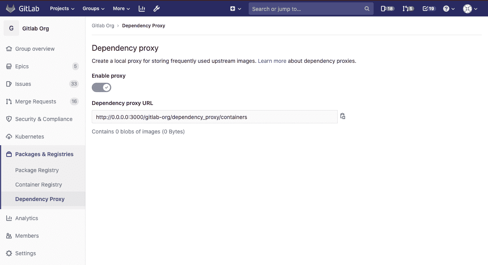

# Dependency Proxy

> 原文：[https://docs.gitlab.com/ee/user/packages/dependency_proxy/](https://docs.gitlab.com/ee/user/packages/dependency_proxy/)

*   [Supported dependency proxies](#supported-dependency-proxies)
*   [Using the Docker dependency proxy](#using-the-docker-dependency-proxy)
*   [Clearing the cache](#clearing-the-cache)
*   [Limitations](#limitations)

# Dependency Proxy[](#dependency-proxy-premium-only "Permalink")

[Introduced](https://gitlab.com/gitlab-org/gitlab/-/issues/7934) in [GitLab Ultimate](https://about.gitlab.com/pricing/) 11.11.

**注意：**这是用户指南. 为了使用依赖代理，管理员必须首先对其进行[配置](../../../administration/packages/dependency_proxy.html) .

对于许多组织而言，希望为经常使用的上游映像/程序包提供本地代理. 在 CI / CD 的情况下，代理负责接收请求并从注册表中返回上游映像，并充当下拉缓存.

依赖项代理在组级别可用. 要访问它，请导航到组的**Packages＆Registries> Dependency Proxy** .

[](img/group_dependency_proxy.png)

## Supported dependency proxies[](#supported-dependency-proxies "Permalink")

***注意：**有关代理即将添加的列表，请访问[指导页面](https://about.gitlab.com/direction/package/dependency_proxy/#top-vision-items) .*

支持以下依赖代理.

| 依赖代理 | GitLab 版本 |
| --- | --- |
| Docker | 11.11+ |

## Using the Docker dependency proxy[](#using-the-docker-dependency-proxy "Permalink")

借助 Docker 依赖项代理，您可以将 GitLab 用作 Docker 映像的源. 要将 Docker 映像放入依赖代理中：

1.  在" **软件包和** `gitlab.com/groupname/dependency_proxy/containers` **>"依赖代理"**下的组页面上找到代理 URL，例如`gitlab.com/groupname/dependency_proxy/containers` .
2.  触发 GitLab 提取所需的 Docker 映像（例如`alpine:latest`或`linuxserver/nextcloud:latest` ），然后使用以下方法之一将其存储在代理存储中：

    *   手动拉 Docker 镜像：

        ```
        docker pull gitlab.com/groupname/dependency_proxy/containers/alpine:latest 
        ```

    *   从`Dockerfile` ：

        ```
        FROM gitlab.com/groupname/dependency_proxy/containers/alpine:latest 
        ```

    *   In [`.gitlab-ci.yml`](../../../ci/yaml/README.html#image):

        ```
        image: gitlab.com/groupname/dependency_proxy/containers/alpine:latest 
        ```

然后，GitLab 将从 Docker Hub 中提取 Docker 映像，并将 blob 缓存在 GitLab 服务器上. 下次您提取同一映像时，它将从 Docker Hub 获取有关该映像的最新信息，但将为 GitLab 提供的现有 Blob 服务.

斑点被永久保存，并且可以存储多少数据没有硬性限制.

## Clearing the cache[](#clearing-the-cache "Permalink")

可以使用 GitLab API 清除给定组的依赖项代理缓存，以获取可能不再需要的图像 Blob 占用的磁盘空间. 有关更多详细信息，请参见[依赖项代理 API 文档](../../../api/dependency_proxy.html) .

## Limitations[](#limitations "Permalink")

适用以下限制：

*   仅支持公共组（尚不支持身份验证）.
*   仅支持 Docker Hub.
*   此功能需要 Docker Hub 可用.