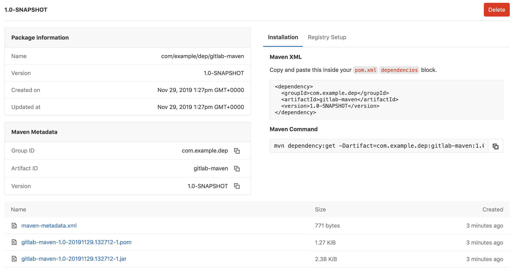

# GitLab Maven Repository

> 原文：[https://docs.gitlab.com/ee/user/packages/maven_repository/](https://docs.gitlab.com/ee/user/packages/maven_repository/)

*   [Enabling the Maven Repository](#enabling-the-maven-repository)
*   [Getting Started with Maven](#getting-started-with-maven)
    *   [Installing Maven](#installing-maven)
    *   [Creating a project](#creating-a-project)
*   [Getting started with Gradle](#getting-started-with-gradle)
    *   [Installing Gradle](#installing-gradle)
    *   [Creating a project in Gradle](#creating-a-project-in-gradle)
*   [Adding the GitLab Package Registry as a Maven remote](#adding-the-gitlab-package-registry-as-a-maven-remote)
    *   [Authenticating with a personal access token](#authenticating-with-a-personal-access-token)
        *   [Authenticating with a personal access token in Maven](#authenticating-with-a-personal-access-token-in-maven)
        *   [Authenticating with a personal access token in Gradle](#authenticating-with-a-personal-access-token-in-gradle)
    *   [Authenticating with a CI job token](#authenticating-with-a-ci-job-token)
        *   [Authenticating with a CI job token in Maven](#authenticating-with-a-ci-job-token-in-maven)
        *   [Authenticating with a CI job token in Gradle](#authenticating-with-a-ci-job-token-in-gradle)
    *   [Authenticating with a deploy token](#authenticating-with-a-deploy-token)
        *   [Authenticating with a deploy token in Maven](#authenticating-with-a-deploy-token-in-maven)
        *   [Authenticating with a deploy token in Gradle](#authenticating-with-a-deploy-token-in-gradle)
*   [Configuring your project to use the GitLab Maven repository URL](#configuring-your-project-to-use-the-gitlab-maven-repository-url)
    *   [Project level Maven endpoint](#project-level-maven-endpoint)
    *   [Group level Maven endpoint](#group-level-maven-endpoint)
    *   [Instance level Maven endpoint](#instance-level-maven-endpoint)
*   [Uploading packages](#uploading-packages)
    *   [Upload using Maven](#upload-using-maven)
    *   [Upload using Gradle](#upload-using-gradle)
*   [Installing a package](#installing-a-package)
    *   [Install using Maven with `mvn install`](#install-using-maven-with-mvn-install)
        *   [Install with `mvn dependency:get`](#install-with-mvn-dependencyget)
    *   [Install using Gradle](#install-using-gradle)
*   [Removing a package](#removing-a-package)
*   [Creating Maven packages with GitLab CI/CD](#creating-maven-packages-with-gitlab-cicd)
    *   [Creating Maven packages with GitLab CI/CD using Maven](#creating-maven-packages-with-gitlab-cicd-using-maven)
    *   [Creating Maven packages with GitLab CI/CD using Gradle](#creating-maven-packages-with-gitlab-cicd-using-gradle)
    *   [Version validation](#version-validation)
*   [Troubleshooting](#troubleshooting)
    *   [Useful Maven command line options](#useful-maven-command-line-options)
    *   [Verifying your Maven settings](#verifying-your-maven-settings)

# GitLab Maven Repository[](#gitlab-maven-repository-premium "Permalink")

[Introduced](https://gitlab.com/gitlab-org/gitlab/-/issues/5811) in [GitLab Premium](https://about.gitlab.com/pricing/) 11.3.

使用 GitLab [Maven](https://maven.apache.org)存储库，每个项目都可以有自己的空间来存储其 Maven 工件.

[](img/maven_package_view_v12_6.png)

## Enabling the Maven Repository[](#enabling-the-maven-repository "Permalink")

**注意：**仅当您的 GitLab 管理员[启用了对 Maven 存储库的支持时，](../../../administration/packages/index.html)此选项才可用.

启用"软件包"功能后，默认情况下，Maven 存储库将可用于所有新项目. 要为现有项目启用它，或者要禁用它：

1.  导航到项目的**"设置">"常规">"可见性，项目功能，权限"** .
2.  找到"软件包"功能并启用或禁用它.
3.  单击**保存更改**以使更改生效.

然后，您应该能够在左侧栏中看到" **程序包和注册表"**部分. 接下来，您必须配置您的项目以使用 GitLab Maven 存储库进行授权.

## Getting Started with Maven[](#getting-started-with-maven "Permalink")

本节将介绍安装 Maven 和构建软件包. 如果您不熟悉构建 Maven 软件包，这是一个快速入门. 如果您已经在使用 Maven 并且了解如何构建自己的软件包，请转到[下一节](#adding-the-gitlab-package-registry-as-a-maven-remote) .

Maven 仓库也可以与 Gradle 一起很好地工作. 如果要设置 Gradle 项目，请继续[使用 Gradle 入门](#getting-started-with-gradle) .

### Installing Maven[](#installing-maven "Permalink")

所需的最低版本为：

*   Java 11.0.5 以上
*   Maven 3.6+

按照[maven.apache.org](https://maven.apache.org/install.html)上的说明下载并安装适用于您本地开发环境的 Maven. 安装完成后，通过运行以下命令验证您可以在终端中使用 Maven：

```
mvn --version 
```

您应该在输出中看到类似于以下内容的内容：

```
Apache Maven 3.6.1 (d66c9c0b3152b2e69ee9bac180bb8fcc8e6af555; 2019-04-04T20:00:29+01:00)
Maven home: /Users/<your_user>/apache-maven-3.6.1
Java version: 12.0.2, vendor: Oracle Corporation, runtime: /Library/Java/JavaVirtualMachines/jdk-12.0.2.jdk/Contents/Home
Default locale: en_GB, platform encoding: UTF-8
OS name: "mac os x", version: "10.15.2", arch: "x86_64", family: "mac" 
```

### Creating a project[](#creating-a-project "Permalink")

了解如何创建完整的 Java 项目不在本指南的范围内，但是您可以按照以下步骤创建一个新项目，该项目可以发布到 GitLab Package Registry.

首先打开终端并创建一个目录，您要将目录存储在环境中. 从目录内部，您可以运行以下 Maven 命令来初始化新程序包：

```
mvn archetype:generate -DgroupId=com.mycompany.mydepartment -DartifactId=my-project -DarchetypeArtifactId=maven-archetype-quickstart -DinteractiveMode=false 
```

参数如下：

*   `DgroupId` ：标识您的包裹的唯一字符串. 您应该遵循[Maven 命名约定](https://maven.apache.org/guides/mini/guide-naming-conventions.html) .
*   `DartifactId` ：JAR 的名称，附加在`DgroupId`的末尾.
*   `DarchetypeArtifactId` ：用于创建项目初始结构的原型.
*   `DinteractiveMode` ：使用批处理模式（可选）创建项目.

运行该命令后，您应该看到以下消息，表明您的项目已成功设置：

```
...
[INFO] ------------------------------------------------------------------------
[INFO] BUILD SUCCESS
[INFO] ------------------------------------------------------------------------
[INFO] Total time:  3.429 s
[INFO] Finished at: 2020-01-28T11:47:04Z
[INFO] ------------------------------------------------------------------------ 
```

您应该看到一个新目录，在该目录中运行与`DartifactId`参数匹配的命令（在这种情况下，它应该是`my-project` ）.

## Getting started with Gradle[](#getting-started-with-gradle "Permalink")

本节将介绍如何安装 Gradle 和初始化 Java 项目. 如果您不熟悉 Gradle，这是一个快速入门. 如果您已经在使用 Gradle 并且了解如何构建自己的软件包，请转到[下一部分](#adding-the-gitlab-package-registry-as-a-maven-remote) .

### Installing Gradle[](#installing-gradle "Permalink")

仅当您要创建新的 Gradle 项目时才需要安装. 按照[gradle.org](https://s0gradle0org.icopy.site/install/)上的说明为您的本地开发环境下载并安装 Gradle.

通过运行以下命令验证您可以在终端中使用 Gradle：

```
gradle -version 
```

如果要使用现有的 Gradle 项目，则不需要安装. 只需在项目目录中执行`gradlew` （在 Linux 上）或`gradlew.bat` （在 Windows 上）即可.

You should see something imilar to the below printed in the output:

```
------------------------------------------------------------
Gradle 6.0.1
------------------------------------------------------------

Build time:   2019-11-18 20:25:01 UTC
Revision:     fad121066a68c4701acd362daf4287a7c309a0f5

Kotlin:       1.3.50
Groovy:       2.5.8
Ant:          Apache Ant(TM) version 1.10.7 compiled on September 1 2019
JVM:          11.0.5 (Oracle Corporation 11.0.5+10)
OS:           Windows 10 10.0 amd64 
```

### Creating a project in Gradle[](#creating-a-project-in-gradle "Permalink")

了解如何在 Gradle 中创建完整的 Java 项目不在本指南的范围内，但是您可以按照以下步骤创建一个可以发布到 GitLab Package Registry 的新项目.

首先打开终端并创建一个目录，您要将目录存储在环境中. 从目录内部，您可以运行以下 Maven 命令来初始化新程序包：

```
gradle init 
```

输出应为

```
Select type of project to generate:
  1: basic
  2: application
  3: library
  4: Gradle plugin
Enter selection (default: basic) [1..4] 
```

输入`3`创建一个新的 Library 项目. 输出应为：

```
Select implementation language:
  1: C++
  2: Groovy
  3: Java
  4: Kotlin
  5: Scala
  6: Swift 
```

输入`3`创建一个新的 Java 库项目. 输出应为：

```
Select build script DSL:
  1: Groovy
  2: Kotlin
Enter selection (default: Groovy) [1..2] 
```

选择`1`创建一个新的 Java 库项目，该项目将在 Groovy DSL 中进行描述. 输出应为：

```
Select test framework:
  1: JUnit 4
  2: TestNG
  3: Spock
  4: JUnit Jupiter 
```

选择`1`以使用 JUnit 4 测试库初始化项目. 输出应为：

```
Project name (default: test): 
```

输入项目名称或按 Enter 键以使用目录名称作为项目名称.

## Adding the GitLab Package Registry as a Maven remote[](#adding-the-gitlab-package-registry-as-a-maven-remote "Permalink")

下一步是将 GitLab 软件包注册表添加为 Maven 遥控器. 如果项目是私有的，或者您想将 Maven 工件上传到 GitLab，则也需要提供凭据进行授权. 仅对[个人访问令牌](#authenticating-with-a-personal-access-token) ， [CI 作业令牌](#authenticating-with-a-ci-job-token)和[部署令牌提供支持](../../project/deploy_tokens/index.html) . 常规的用户名/密码凭据不起作用.

### Authenticating with a personal access token[](#authenticating-with-a-personal-access-token "Permalink")

要使用[个人访问令牌进行](../../profile/personal_access_tokens.html)身份验证，请在创建[令牌](../../profile/personal_access_tokens.html)时将范围设置为`api` ，并将其添加到您的 Maven 或 Gradle 配置文件中.

#### Authenticating with a personal access token in Maven[](#authenticating-with-a-personal-access-token-in-maven "Permalink")

将相应的部分添加到[`settings.xml`](https://maven.apache.org/settings.html)文件中：

```
<settings>
  <servers>
    <server>
      <id>gitlab-maven</id>
      <configuration>
        <httpHeaders>
          <property>
            <name>Private-Token</name>
            <value>REPLACE_WITH_YOUR_PERSONAL_ACCESS_TOKEN</value>
          </property>
        </httpHeaders>
      </configuration>
    </server>
  </servers>
</settings> 
```

#### Authenticating with a personal access token in Gradle[](#authenticating-with-a-personal-access-token-in-gradle "Permalink")

创建具有以下内容的文件`~/.gradle/gradle.properties` ：

```
gitLabPrivateToken=REPLACE_WITH_YOUR_PERSONAL_ACCESS_TOKEN 
```

在您的[`build.gradle`](https://s0docs0gradle0org.icopy.site/current/userguide/tutorial_using_tasks.html)文件中添加一个存储库部分：

```
repositories {
    maven {
        url "https://<gitlab-url>/api/v4/groups/<group>/-/packages/maven"
        name "GitLab"
        credentials(HttpHeaderCredentials) {
            name = 'Private-Token'
            value = gitLabPrivateToken
        }
        authentication {
            header(HttpHeaderAuthentication)
        }
    }
} 
```

You should now be able to upload Maven artifacts to your project.

### Authenticating with a CI job token[](#authenticating-with-a-ci-job-token "Permalink")

如果您使用的是 GitLab CI / CD，则可以使用 CI 作业令牌代替个人访问令牌.

#### Authenticating with a CI job token in Maven[](#authenticating-with-a-ci-job-token-in-maven "Permalink")

要使用 CI 作业令牌进行身份验证，请将相应部分添加到[`settings.xml`](https://maven.apache.org/settings.html)文件中：

```
<settings>
  <servers>
    <server>
      <id>gitlab-maven</id>
      <configuration>
        <httpHeaders>
          <property>
            <name>Job-Token</name>
            <value>${env.CI_JOB_TOKEN}</value>
          </property>
        </httpHeaders>
      </configuration>
    </server>
  </servers>
</settings> 
```

您可以阅读有关[如何使用 GitLab CI / CD 创建 Maven 软件包的](#creating-maven-packages-with-gitlab-cicd)更多信息.

#### Authenticating with a CI job token in Gradle[](#authenticating-with-a-ci-job-token-in-gradle "Permalink")

要使用 CI 作业令牌进行身份验证，请在[`build.gradle`](https://s0docs0gradle0org.icopy.site/current/userguide/tutorial_using_tasks.html)文件中添加一个存储库部分：

```
repositories {
    maven {
        url "https://<gitlab-url>/api/v4/groups/<group>/-/packages/maven"
        name "GitLab"
        credentials(HttpHeaderCredentials) {
            name = 'Job-Token'
            value = '${CI_JOB_TOKEN}'
        }
        authentication {
            header(HttpHeaderAuthentication)
        }
    }
} 
```

### Authenticating with a deploy token[](#authenticating-with-a-deploy-token "Permalink")

[Introduced](https://gitlab.com/gitlab-org/gitlab/-/issues/213566) in [GitLab Premium](https://about.gitlab.com/pricing/) 13.0.

要使用[部署令牌进行](./../../project/deploy_tokens/index.html)身份验证，请在创建[令牌](./../../project/deploy_tokens/index.html)时将范围设置为`api` ，然后将其添加到您的 Maven 或 Gradle 配置文件中.

#### Authenticating with a deploy token in Maven[](#authenticating-with-a-deploy-token-in-maven "Permalink")

将相应的部分添加到[`settings.xml`](https://maven.apache.org/settings.html)文件中：

```
<settings>
  <servers>
    <server>
      <id>gitlab-maven</id>
      <configuration>
        <httpHeaders>
          <property>
            <name>Deploy-Token</name>
            <value>REPLACE_WITH_YOUR_DEPLOY_TOKEN</value>
          </property>
        </httpHeaders>
      </configuration>
    </server>
  </servers>
</settings> 
```

#### Authenticating with a deploy token in Gradle[](#authenticating-with-a-deploy-token-in-gradle "Permalink")

要使用部署令牌进行身份验证，请将存储库部分添加到[`build.gradle`](https://s0docs0gradle0org.icopy.site/current/userguide/tutorial_using_tasks.html)文件中：

```
repositories {
    maven {
        url "https://<gitlab-url>/api/v4/groups/<group>/-/packages/maven"
        name "GitLab"
        credentials(HttpHeaderCredentials) {
            name = 'Deploy-Token'
            value = '<deploy-token>'
        }
        authentication {
            header(HttpHeaderAuthentication)
        }
    }
} 
```

## Configuring your project to use the GitLab Maven repository URL[](#configuring-your-project-to-use-the-gitlab-maven-repository-url "Permalink")

要从 GitLab 下载和上传软件包，您需要在`pom.xml`文件中的" `repository` and `distributionManagement`部分. 如果您按照上面的步骤操作，则需要将以下信息添加到`my-project/pom.xml`文件中.

根据您的工作流程和所拥有的 Maven 软件包的数量，可以通过 3 种方式配置项目以将 GitLab 端点用于 Maven 软件包：

*   **项目级别** ：当您有几个不在同一 GitLab 组中的 Maven 软件包时，此选项很有用.
*   **组级别** ：当您在同一个 GitLab 组中有多个 Maven 软件包时，此选项很有用.
*   **实例级别** ：当您在不同的 GitLab 组下或它们自己的名称空间上有许多 Maven 软件包时很有用.

**注意：**在所有情况下，都需要一个项目特定的 URL 才能在`distributionManagement`部分中上载软件包.

### Project level Maven endpoint[](#project-level-maven-endpoint "Permalink")

下面的示例显示了`pom.xml`的相关`repository`部分在 Maven 中的样子：

```
<repositories>
  <repository>
    <id>gitlab-maven</id>
    <url>https://gitlab.com/api/v4/projects/PROJECT_ID/packages/maven</url>
  </repository>
</repositories>
<distributionManagement>
  <repository>
    <id>gitlab-maven</id>
    <url>https://gitlab.com/api/v4/projects/PROJECT_ID/packages/maven</url>
  </repository>
  <snapshotRepository>
    <id>gitlab-maven</id>
    <url>https://gitlab.com/api/v4/projects/PROJECT_ID/packages/maven</url>
  </snapshotRepository>
</distributionManagement> 
```

Gradle 中的相应部分如下所示：

```
repositories {
    maven {
        url "https://gitlab.com/api/v4/projects/PROJECT_ID/packages/maven"
        name "GitLab"
    }
} 
```

该`id`必须与您[在`settings.xml`定义](#adding-the-gitlab-package-registry-as-a-maven-remote)的`id`相同.

将`PROJECT_ID`替换为可以在项目主页上找到的项目 ID.

如果您具有自行管理的 GitLab 安装， `gitlab.com`使用您的域名替换`gitlab.com` .

**注意：**要检索工件，可以使用项目的[URL 编码](../../../api/README.html#namespaced-path-encoding)路径（例如`group/project` ）或项目的 ID（例如`42` ）. 但是，只能使用项目的 ID 进行上传.

### Group level Maven endpoint[](#group-level-maven-endpoint "Permalink")

[Introduced](https://gitlab.com/gitlab-org/gitlab/-/merge_requests/8798) in [GitLab Premium](https://about.gitlab.com/pricing/) 11.7.

如果您依赖于许多软件包，则在`repository`部分中为每个软件包添加唯一的 URL 可能效率不高. 相反，您可以将组级别端点用于存储在一个 GitLab 组中的所有 Maven 软件包. 只有您有权访问的软件包才可以下载.

组级别端点可与任何程序包名称一起使用，这意味着与[实例级别端点](#instance-level-maven-endpoint)相比，您具有更大的命名灵活性. 但是，GitLab 不能保证软件包名称在组中的唯一性. 您可以有两个具有相同软件包名称和软件包版本的项目. 因此，GitLab 将服务于较新的那个.

下面的示例显示`pom.xml`的相关`repository`部分的外观. 您仍需要一个特定于项目的 URL 来在`distributionManagement`部分中上传软件包：

```
<repositories>
  <repository>
    <id>gitlab-maven</id>
    <url>https://gitlab.com/api/v4/groups/GROUP_ID/-/packages/maven</url>
  </repository>
</repositories>
<distributionManagement>
  <repository>
    <id>gitlab-maven</id>
    <url>https://gitlab.com/api/v4/projects/PROJECT_ID/packages/maven</url>
  </repository>
  <snapshotRepository>
    <id>gitlab-maven</id>
    <url>https://gitlab.com/api/v4/projects/PROJECT_ID/packages/maven</url>
  </snapshotRepository>
</distributionManagement> 
```

对于 Gradle，相应的存储库部分如下所示：

```
repositories {
    maven {
        url "https://gitlab.com/api/v4/groups/GROUP_ID/-/packages/maven"
        name "GitLab"
    }
} 
```

该`id`必须与您[在`settings.xml`定义](#adding-the-gitlab-package-registry-as-a-maven-remote)的`id`相同.

在您的项目主页上可以找到您的组名，将`my-group`替换为您的组名，将`PROJECT_ID`替换为您的项目 ID.

如果您具有自行管理的 GitLab 安装， `gitlab.com`使用您的域名替换`gitlab.com` .

**注意：**对于检索工件，您可以使用组的[URL 编码](../../../api/README.html#namespaced-path-encoding)路径（例如`group/subgroup` ）或组的 ID（例如`12` ）.

### Instance level Maven endpoint[](#instance-level-maven-endpoint "Permalink")

[Introduced](https://gitlab.com/gitlab-org/gitlab/-/merge_requests/8274) in [GitLab Premium](https://about.gitlab.com/pricing/) 11.7.

如果您依赖于许多软件包，则在`repository`部分中为每个软件包添加唯一的 URL 可能效率不高. 相反，您可以对存储在 GitLab 中的所有 maven 程序包使用实例级别端点，并且可以访问您有权访问的程序包.

请注意， **只有与项目路径相同的软件包才**通过实例级别端点公开.

| Project | Package | 实例级别端点可用 |
| --- | --- | --- |
| `foo/bar` | `foo/bar/1.0-SNAPSHOT` | Yes |
| `gitlab-org/gitlab` | `foo/bar/1.0-SNAPSHOT` | No |
| `gitlab-org/gitlab` | `gitlab-org/gitlab/1.0-SNAPSHOT` | Yes |

下面的示例显示`pom.xml`的相关`repository`部分的外观. 您仍需要一个特定于项目的 URL 来在`distributionManagement`部分中上传软件包：

```
<repositories>
  <repository>
    <id>gitlab-maven</id>
    <url>https://gitlab.com/api/v4/packages/maven</url>
  </repository>
</repositories>
<distributionManagement>
  <repository>
    <id>gitlab-maven</id>
    <url>https://gitlab.com/api/v4/projects/PROJECT_ID/packages/maven</url>
  </repository>
  <snapshotRepository>
    <id>gitlab-maven</id>
    <url>https://gitlab.com/api/v4/projects/PROJECT_ID/packages/maven</url>
  </snapshotRepository>
</distributionManagement> 
```

Gradle 中相应的存储库部分如下所示：

```
repositories {
    maven {
        url "https://gitlab.com/api/v4/packages/maven"
        name "GitLab"
    }
} 
```

该`id`必须与您[在`settings.xml`定义](#adding-the-gitlab-package-registry-as-a-maven-remote)的`id`相同.

将`PROJECT_ID`替换为可以在项目主页上找到的项目 ID.

如果您具有自行管理的 GitLab 安装， `gitlab.com`使用您的域名替换`gitlab.com` .

**Note:** For retrieving artifacts, you can use either the [URL encoded](../../../api/README.html#namespaced-path-encoding) path of the project (e.g., `group%2Fproject`) or the project’s ID (e.g., `42`). However, only the project’s ID can be used for uploading.

## Uploading packages[](#uploading-packages "Permalink")

一旦设置了[远程和身份验证](#adding-the-gitlab-package-registry-as-a-maven-remote)并[配置了项目](#configuring-your-project-to-use-the-gitlab-maven-repository-url) ，请测试以从[您的项目](#configuring-your-project-to-use-the-gitlab-maven-repository-url)中上传 Maven 工件.

### Upload using Maven[](#upload-using-maven "Permalink")

```
mvn deploy 
```

如果部署成功，您应该再次看到构建成功消息：

```
...
[INFO] BUILD SUCCESS
... 
```

您还应该看到上传已上传到正确的注册表：

```
Uploading to gitlab-maven: https://gitlab.com/api/v4/projects/PROJECT_ID/packages/maven/com/mycompany/mydepartment/my-project/1.0-SNAPSHOT/my-project-1.0-20200128.120857-1.jar 
```

### Upload using Gradle[](#upload-using-gradle "Permalink")

将 Gradle 插件[`maven-publish`](https://s0docs0gradle0org.icopy.site/current/userguide/publishing_maven.html)添加到插件部分：

```
plugins {
    id 'java'
    id 'maven-publish'
} 
```

添加`publishing`部分：

```
publishing {
    publications {
        library(MavenPublication) {
            from components.java
        }
    }
    repositories {
        maven {
            url "https://gitlab.com/api/v4/projects/<PROJECT_ID>/packages/maven"
            credentials(HttpHeaderCredentials) {
                name = "Private-Token"
                value = gitLabPrivateToken // the variable resides in ~/.gradle/gradle.properties
            }
            authentication {
                header(HttpHeaderAuthentication)
            }
        }
    }
} 
```

将`PROJECT_ID`替换为可以在项目主页上找到的项目 ID.

运行发布任务：

```
gradle publish 
```

然后，您可以导航到项目的**Packages＆Registries**页面，并查看上载的工件，甚至删除它们.

## Installing a package[](#installing-a-package "Permalink")

从 GitLab 程序包注册表安装程序包要求您如上所述设置[远程和身份验证](#adding-the-gitlab-package-registry-as-a-maven-remote) . 一旦完成，就有两种安装软件包的方法.

### Install using Maven with `mvn install`[](#install-using-maven-with-mvn-install "Permalink")

手动将依赖项添加到您的项目`pom.xml`文件中. 要添加上面创建的示例，XML 如下所示：

```
<dependency>
  <groupId>com.mycompany.mydepartment</groupId>
  <artifactId>my-project</artifactId>
  <version>1.0-SNAPSHOT</version>
</dependency> 
```

然后，在您的项目中，运行以下命令：

```
mvn install 
```

如果一切设置正确，您应该会看到从 GitLab 软件包注册表下载的依赖项：

```
Downloading from gitlab-maven: http://gitlab.com/api/v4/projects/PROJECT_ID/packages/maven/com/mycompany/mydepartment/my-project/1.0-SNAPSHOT/my-project-1.0-20200128.120857-1.pom 
```

#### Install with `mvn dependency:get`[](#install-with-mvn-dependencyget "Permalink")

安装软件包的第二种方法是直接使用 Maven 命令. 在您的项目目录中，运行：

```
mvn dependency:get -Dartifact=com.nickkipling.app:nick-test-app:1.1-SNAPSHOT 
```

您应该看到相同的下载消息，确认从 GitLab 软件包注册表中检索了该项目.

**提示：** XML 块和 Maven 命令都可以从"软件包详细信息"页面中方便地复制和粘贴，从而可以快速简便地进行安装.

### Install using Gradle[](#install-using-gradle "Permalink")

添加[依赖](https://s0docs0gradle0org.icopy.site/current/userguide/declaring_dependencies.html)于依赖部分的 build.gradle：

```
dependencies {
    implementation 'com.mycompany.mydepartment:my-project:1.0-SNAPSHOT'
} 
```

## Removing a package[](#removing-a-package "Permalink")

在项目页面的软件包视图中，您可以通过单击红色垃圾图标或单击软件包详细信息页面上的**删除**按钮来**删除**软件包.

## Creating Maven packages with GitLab CI/CD[](#creating-maven-packages-with-gitlab-cicd "Permalink")

一旦您的存储库配置为使用 GitLab Maven 存储库，就可以配置 GitLab CI / CD 来自动构建新软件包.

### Creating Maven packages with GitLab CI/CD using Maven[](#creating-maven-packages-with-gitlab-cicd-using-maven "Permalink")

下面的示例显示了每次更新`master`分支时如何创建新程序包：

1.  创建一个`ci_settings.xml`文件，它将用作 Maven 的`settings.xml`文件. 添加与您在`pom.xml`文件中定义的 ID 相同的服务器部分. 例如，在我们的例子中是`gitlab-maven` ：

    ```
    <settings xmlns="http://maven.apache.org/SETTINGS/1.1.0" xmlns:xsi="http://www.w3.org/2001/XMLSchema-instance"
      xsi:schemaLocation="http://maven.apache.org/SETTINGS/1.1.0 http://maven.apache.org/xsd/settings-1.1.0.xsd">
      <servers>
        <server>
          <id>gitlab-maven</id>
          <configuration>
            <httpHeaders>
              <property>
                <name>Job-Token</name>
                <value>${env.CI_JOB_TOKEN}</value>
              </property>
            </httpHeaders>
          </configuration>
        </server>
      </servers>
    </settings> 
    ```

2.  确保您的`pom.xml`文件包含以下内容：

    ```
    <repositories>
      <repository>
        <id>gitlab-maven</id>
        <url>https://gitlab.com/api/v4/projects/${env.CI_PROJECT_ID}/packages/maven</url>
      </repository>
    </repositories>
    <distributionManagement>
      <repository>
        <id>gitlab-maven</id>
        <url>https://gitlab.com/api/v4/projects/${env.CI_PROJECT_ID}/packages/maven</url>
      </repository>
      <snapshotRepository>
        <id>gitlab-maven</id>
        <url>https://gitlab.com/api/v4/projects/${env.CI_PROJECT_ID}/packages/maven</url>
      </snapshotRepository>
    </distributionManagement> 
    ```

    **提示：**您可以让 Maven 利用 CI 环境变量，也可以硬编码项目的 ID.
3.  将`deploy`作业添加到您的`.gitlab-ci.yml`文件中：

    ```
    deploy:
      image: maven:3.3.9-jdk-8
      script:
        - 'mvn  deploy  -s  ci_settings.xml'
      only:
        - master 
    ```

4.  将这些文件推送到您的存储库.

下次运行`deploy`作业时，它将`ci_settings.xml`复制到用户的本地位置（在这种情况下，用户是`root`用户，因为它在 Docker 容器中运行），并且 Maven 将利用配置的 CI [环境变量](../../../ci/variables/README.html#predefined-environment-variables) .

### Creating Maven packages with GitLab CI/CD using Gradle[](#creating-maven-packages-with-gitlab-cicd-using-gradle "Permalink")

下面的示例显示了每次更新`master`分支时如何创建新程序包：

1.  确保按照["使用 Gradle 中的 CI 作业令牌进行身份](#authenticating-with-a-ci-job-token-in-gradle)验证"中所述使用 Job-Token 身份[验证](#authenticating-with-a-ci-job-token-in-gradle) .

2.  将`deploy`作业添加到您的`.gitlab-ci.yml`文件中：

    ```
    deploy:
      image: gradle:latest
      script:
        - 'gradle  publish'
      only:
        - master 
    ```

3.  将这些文件推送到您的存储库.

下次运行`deploy`作业时，它将`ci_settings.xml`复制到用户的本地位置（在这种情况下，用户是`root`用户，因为它在 Docker 容器中运行），并且 Maven 将使用配置的 CI [环境变量](../../../ci/variables/README.html#predefined-environment-variables) .

### Version validation[](#version-validation "Permalink")

使用以下正则表达式验证版本字符串.

```
\A(\.?[\w\+-]+\.?)+\z 
```

您可以使用正则表达式，并在[此正则表达式编辑器](https://rubular.com/r/rrLQqUXjfKEoL6)上尝试使用版本字符串.

## Troubleshooting[](#troubleshooting "Permalink")

### Useful Maven command line options[](#useful-maven-command-line-options "Permalink")

有一些[Maven 命令行选项](https://maven.apache.org/ref/current/maven-embedder/cli.html)在使用 GitLab CI / CD 执行任务时可能有用.

*   文件传输进度会使 CI 日志难以阅读. 选项`-ntp,--no-transfer-progress`已在[3.6.1](https://maven.apache.org/docs/3.6.1/release-notes.html#User_visible_Changes)中添加. 或者，查看`-B,--batch-mode` [或较低级别的日志记录更改.](https://stackoverflow.com/questions/21638697/disable-maven-download-progress-indication)

*   指定在哪里可以找到 POM 文件（ `-f,--file` ）：

    ```
     package:
       script:
         - 'mvn  --no-transfer-progress  -f  helloworld/pom.xml  package' 
    ```

*   指定在哪里可以找到用户设置（ `-s,--settings` ），而不是[默认位置](https://maven.apache.org/settings.html) . 还有一个`-gs,--global-settings`选项：

    ```
     package:
       script:
         - 'mvn  -s  settings/ci.xml  package' 
    ```

### Verifying your Maven settings[](#verifying-your-maven-settings "Permalink")

如果您在 CI 中遇到与`settings.xml`文件有关的问题，则添加其他脚本任务或作业以[验证有效设置](https://maven.apache.org/plugins/maven-help-plugin/effective-settings-mojo.html)可能会很有用.

帮助插件还可以提供[系统属性](https://maven.apache.org/plugins/maven-help-plugin/system-mojo.html) ，包括环境变量：

```
mvn-settings:
  script:
    - 'mvn  help:effective-settings'

package:
  script:
    - 'mvn  help:system'
    - 'mvn  package' 
```