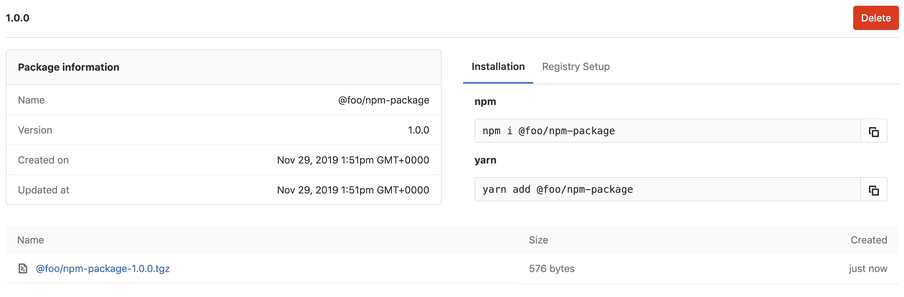

# GitLab NPM Registry

> 原文：[https://docs.gitlab.com/ee/user/packages/npm_registry/](https://docs.gitlab.com/ee/user/packages/npm_registry/)

*   [Enabling the NPM Registry](#enabling-the-npm-registry)
*   [Getting started](#getting-started)
    *   [Installing NPM](#installing-npm)
    *   [Installing Yarn](#installing-yarn)
    *   [Creating a project](#creating-a-project)
*   [Authenticating to the GitLab NPM Registry](#authenticating-to-the-gitlab-npm-registry)
    *   [Authenticating with a personal access token or deploy token](#authenticating-with-a-personal-access-token-or-deploy-token)
    *   [Using variables to avoid hard-coding auth token values](#using-variables-to-avoid-hard-coding-auth-token-values)
    *   [Authenticating with a CI job token](#authenticating-with-a-ci-job-token)
*   [Uploading packages](#uploading-packages)
*   [Uploading a package with the same version twice](#uploading-a-package-with-the-same-version-twice)
*   [Package naming convention](#package-naming-convention)
*   [Installing a package](#installing-a-package)
    *   [Forwarding requests to npmjs.org](#forwarding-requests-to-npmjsorg)
*   [Removing a package](#removing-a-package)
*   [Publishing a package with CI/CD](#publishing-a-package-with-cicd)
*   [Troubleshooting](#troubleshooting)
    *   [Error running yarn with NPM registry](#error-running-yarn-with-npm-registry)
    *   [`npm publish` targets default NPM registry (`registry.npmjs.org`)](#npm-publish-targets-default-npm-registry-registrynpmjsorg)
    *   [`npm install` returns `Error: Failed to replace env in config: ${NPM_TOKEN}`](#npm-install-returns-error-failed-to-replace-env-in-config-npm_token)
    *   [`npm install` returns `npm ERR! 403 Forbidden`](#npm-install-returns-npm-err-403-forbidden)
*   [NPM dependencies metadata](#npm-dependencies-metadata)
*   [NPM distribution tags](#npm-distribution-tags)

# GitLab NPM Registry[](#gitlab-npm-registry-premium "Permalink")

[Introduced](https://gitlab.com/gitlab-org/gitlab/-/issues/5934) in [GitLab Premium](https://about.gitlab.com/pricing/) 11.7.

使用 GitLab NPM 注册表，每个项目都可以拥有自己的空间来存储 NPM 软件包.

[](img/npm_package_view_v12_5.png)

**注意：**仅支持[作用域的](https://s0docs0npmjs0com.icopy.site/misc/scope)程序包.

## Enabling the NPM Registry[](#enabling-the-npm-registry "Permalink")

**注意：**仅当您的 GitLab 管理员[启用了对 NPM 注册表的支持时，](../../../administration/packages/index.html)此选项才可用.

启用 NPM 注册表后，默认情况下它将可用于所有新项目. 要为现有项目启用它，或者要禁用它：

1.  导航到项目的**"设置">"常规">"可见性，项目功能，权限"** .
2.  找到"软件包"功能并启用或禁用它.
3.  单击**保存更改**以使更改生效.

然后，您应该能够在左侧栏中看到" **程序包和注册表"**部分.

在继续使用 GitLab NPM 注册表进行身份验证之前，您应该熟悉软件包的命名约定.

## Getting started[](#getting-started "Permalink")

本节将介绍安装 NPM（或 Yarn）并为您的 JavaScript 项目构建软件包. 如果您不熟悉 NPM 软件包，这是一个快速入门. 如果您已经在使用 NPM 并了解如何构建自己的软件包，请继续[下一节](#authenticating-to-the-gitlab-npm-registry) .

### Installing NPM[](#installing-npm "Permalink")

按照[npmjs.com](https://s0docs0npmjs0com.icopy.site/downloading-and-installing-node-js-and-npm)上的说明下载 Node.js 和 NPM 并将其安装到本地开发环境.

安装完成后，通过运行以下命令验证您可以在终端中使用 NPM：

```
npm --version 
```

您应该会在输出中看到 NPM 版本：

```
6.10.3 
```

### Installing Yarn[](#installing-yarn "Permalink")

您可能需要安装并使用 Yarn 替代 NPM. 请按照[yarnpkg.com](https://classic.yarnpkg.com/en/docs/install)上的说明在您的开发环境上进行安装.

Once installed, you can verify that Yarn is available with the following command:

```
yarn --version 
```

You should see the version printed like so:

```
1.19.1 
```

### Creating a project[](#creating-a-project "Permalink")

了解如何创建完整的 JavaScript 项目不在本指南的范围内，但是您可以通过创建并导航到空目录并使用以下命令来初始化新的空包：

```
npm init 
```

或者，如果您使用的是 Yarn：

```
yarn init 
```

这将带您解决一系列问题，以产生`package.json`文件，这是所有 NPM 软件包所必需的. 最重要的问题是软件包名称. NPM 软件包必须[遵循命名约定，](#package-naming-convention)并且范围应限于注册表所在的项目或组.

完成设置后，现在就可以将软件包上传到 GitLab 注册表了. 首先，您需要设置身份验证，然后将 GitLab 配置为远程注册表.

## Authenticating to the GitLab NPM Registry[](#authenticating-to-the-gitlab-npm-registry "Permalink")

如果项目是私有项目，或者您要将 NPM 软件包上传到 GitLab，则需要提供凭据进行身份验证. 首选[个人访问令牌](../../profile/personal_access_tokens.html)和[部署令牌](../../project/deploy_tokens/index.html) ，但支持[OAuth 令牌](../../../api/oauth2.html#resource-owner-password-credentials-flow) .

**双因素认证（2FA）仅支持个人访问令牌：**如果你有 2FA 启用，你需要使用一个[令牌个人访问](../../profile/personal_access_tokens.html)使用 OAuth 标题与范围设置为`api`或[令牌部署](../../project/deploy_tokens/index.html)与`read_package_registry`或`write_package_registry`范围. 标准 OAuth 令牌将无法向 GitLab NPM 注册表进行身份验证.

### Authenticating with a personal access token or deploy token[](#authenticating-with-a-personal-access-token-or-deploy-token "Permalink")

要使用[个人访问令牌](../../profile/personal_access_tokens.html)或[部署令牌进行](../../project/deploy_tokens/index.html)身份验证，请设置 NPM 配置：

```
# Set URL for your scoped packages.
# For example package with name `@foo/bar` will use this URL for download
npm config set @foo:registry https://gitlab.com/api/v4/packages/npm/

# Add the token for the scoped packages URL. This will allow you to download
# `@foo/` packages from private projects.
npm config set '//gitlab.com/api/v4/packages/npm/:_authToken' "<your_token>"

# Add token for uploading to the registry. Replace <your_project_id>
# with the project you want your package to be uploaded to.
npm config set '//gitlab.com/api/v4/projects/<your_project_id>/packages/npm/:_authToken' "<your_token>" 
```

将`<your_project_id>`替换为可以在项目主页上找到的项目 ID，并将`<your_token>`替换为个人访问令牌或部署令牌.

如果您具有自行管理的 GitLab 安装， `gitlab.com`使用您的域名替换`gitlab.com` .

现在，您应该能够将 NPM 软件包下载并上传到您的项目.

**注意：**如果遇到有关[Yarn](https://classic.yarnpkg.com/en/)的错误消息，请参阅[故障排除部分](#troubleshooting) .

### Using variables to avoid hard-coding auth token values[](#using-variables-to-avoid-hard-coding-auth-token-values "Permalink")

为了避免对`authToken`值进行硬编码，可以在其位置使用变量：

```
npm config set '//gitlab.com/api/v4/projects/<your_project_id>/packages/npm/:_authToken' "${NPM_TOKEN}"
npm config set '//gitlab.com/api/v4/packages/npm/:_authToken' "${NPM_TOKEN}" 
```

然后，您可以在本地或通过 GitLab CI / CD 运行`npm publish` ：

*   **本地：**发布前导出`NPM_TOKEN` ：

    ```
    NPM_TOKEN=<your_token> npm publish 
    ```

*   **GitLab CI / CD：**设置`NPM_TOKEN` [变量](../../../ci/variables/README.html)下，项目的**设置> CI / CD>变量** .

### Authenticating with a CI job token[](#authenticating-with-a-ci-job-token "Permalink")

在 GitLab Premium 12.5 中[引入](https://gitlab.com/gitlab-org/gitlab/-/issues/9104) .

如果您将 NPM 与 GitLab CI / CD 一起使用，则可以使用 CI 作业令牌代替个人访问令牌或部署令牌. 令牌将继承生成管道的用户的权限.

将相应的部分添加到您的`.npmrc`文件中：

```
@foo:registry=https://gitlab.com/api/v4/packages/npm/
//gitlab.com/api/v4/packages/npm/:_authToken=${CI_JOB_TOKEN}
//gitlab.com/api/v4/projects/${CI_PROJECT_ID}/packages/npm/:_authToken=${CI_JOB_TOKEN} 
```

## Uploading packages[](#uploading-packages "Permalink")

在能够上载软件包之前，您需要为 NPM 指定注册表. 为此，将以下部分添加到`package.json`的底部：

```
"publishConfig":  {  "@foo:registry":"https://gitlab.com/api/v4/projects/<your_project_id>/packages/npm/"  } 
```

将`<your_project_id>`替换为您的项目 ID（可在项目的主页上找到），然后将`@foo`替换为您自己的作用域.

如果您具有自行管理的 GitLab 安装， `gitlab.com`使用您的域名替换`gitlab.com` .

启用它并设置[身份验证后](#authenticating-to-the-gitlab-npm-registry) ，您可以将 NPM 包上传到您的项目中：

```
npm publish 
```

然后，您可以导航到项目的" **程序包和注册表"**页面，查看上载的程序包，甚至删除它们.

如果尝试使用给定范围内已经存在的名称发布程序包，则会收到`403 Forbidden!` 错误.

## Uploading a package with the same version twice[](#uploading-a-package-with-the-same-version-twice "Permalink")

您不能两次上传相同名称和版本的软件包，除非先删除现有软件包. 这与 npmjs.org 的行为保持一致，但 npmjs.org 不允许用户多次发布同一版本，即使该版本已被删除也是如此.

## Package naming convention[](#package-naming-convention "Permalink")

**程序包的作用域必须在项目的根名称空间中** . 程序包名称可以是任何名称，但最好使用项目名称，除非由于命名冲突而无法使用. 例如：

| Project | Package | Supported |
| --- | --- | --- |
| `foo/bar` | `@foo/bar` | Yes |
| `foo/bar/baz` | `@foo/baz` | Yes |
| `foo/bar/buz` | `@foo/anything` | Yes |
| `gitlab-org/gitlab` | `@gitlab-org/gitlab` | Yes |
| `gitlab-org/gitlab` | `@foo/bar` | No |

用于命名的正则表达式正在验证来自所有程序包管理器的所有程序包名称：

```
/\A\@?(([\w\-\.\+]*)\/)*([\w\-\.]+)@?(([\w\-\.\+]*)\/)*([\w\-\.]*)\z/ 
```

它允许使用大写字母，而 NPM 不允许，并且几乎允许 NPM 允许的所有字符，但有少数例外（不允许`~` ）.

**注意：**需要大写字母，因为要求范围必须与项目的顶级名称空间相同. 因此，例如，如果您的项目路径为`My-Group/project-foo` ，则您的程序包必须命名为`@My-Group/any-package-name` . `@my-group/any-package-name`不起作用.**在更新用户/组的路径或传输（子）组/项目时：**如果使用 NPM 包更新**项目**的根名称空间，则更改将被拒绝. 为此，请确保先删除所有 NPM 软件包. 不要忘记更新`.npmrc`文件以遵循上述命名约定，并在必要时运行`npm publish` .

现在，您可以配置项目以通过 GitLab NPM 注册表进行身份验证.

## Installing a package[](#installing-a-package "Permalink")

NPM 软件包通常使用 JavaScript 项目中的`npm`或`yarn`命令安装. 如果尚未安装，则需要设置作用域软件包的 URL. 您可以使用以下命令执行此操作：

```
npm config set @foo:registry https://gitlab.com/api/v4/packages/npm/ 
```

您将需要用您的作用域替换`@foo` .

接下来，您需要确保已设置[身份验证](#authenticating-to-the-gitlab-npm-registry) ，以便成功安装软件包. 完成此操作后，您可以在项目中运行以下命令来安装软件包：

```
npm install @my-project-scope/my-package 
```

或者，如果您使用的是 Yarn：

```
yarn add @my-project-scope/my-package 
```

### Forwarding requests to npmjs.org[](#forwarding-requests-to-npmjsorg "Permalink")

[Introduced](https://gitlab.com/gitlab-org/gitlab/-/issues/55344) in [GitLab Premium](https://about.gitlab.com/pricing/) 12.9.

默认情况下，当在 GitLab NPM 注册表中找不到 NPM 软件包时，该请求将转发到[npmjs.com](https://s0www0npmjs0com.icopy.site/) .

管理员可以在" [持续集成"设置中](../../admin_area/settings/continuous_integration.html)禁用此行为.

## Removing a package[](#removing-a-package "Permalink")

在项目页面的软件包视图中，您可以通过单击红色垃圾图标或单击软件包详细信息页面上的**删除**按钮来**删除**软件包.

## Publishing a package with CI/CD[](#publishing-a-package-with-cicd "Permalink")

要在[GitLab CI / CD 中](./../../../ci/README.html)使用 NPM 命令，可以使用`CI_JOB_TOKEN`代替个人访问令牌或在命令中部署令牌.

一个简单的`.gitlab-ci.yml`文件示例，用于发布 NPM 软件包：

```
image: node:latest

stages:
  - deploy

deploy:
  stage: deploy
  script:
    - echo '//gitlab.com/api/v4/projects/${CI_PROJECT_ID}/packages/npm/:_authToken=${CI_JOB_TOKEN}'>.npmrc
    - npm publish 
```

了解有关[使用`CI_JOB_TOKEN`验证 GitLab NPM 注册表的更多信息](#authenticating-with-a-ci-job-token) .

## Troubleshooting[](#troubleshooting "Permalink")

### Error running yarn with NPM registry[](#error-running-yarn-with-npm-registry "Permalink")

如果您在 NPM 注册表中使用[yarn](https://classic.yarnpkg.com/en/) ，则可能会收到以下错误消息：

```
yarn install v1.15.2
warning package.json: No license field
info No lockfile found.
warning XXX: No license field
[1/4] 🔍  Resolving packages...
[2/4] 🚚  Fetching packages...
error An unexpected error occurred: "https://gitlab.com/api/v4/projects/XXX/packages/npm/XXX/XXX/-/XXX/XXX-X.X.X.tgz: Request failed \"404 Not Found\"".
info If you think this is a bug, please open a bug report with the information provided in "/Users/XXX/gitlab-migration/module-util/yarn-error.log".
info Visit https://classic.yarnpkg.com/en/docs/cli/install for documentation about this command 
```

在这种情况下，请尝试将其添加到您的`.npmrc`文件中（并将`<your_token>`替换为您的个人访问令牌或部署令牌）：

```
//gitlab.com/api/v4/projects/:_authToken=<your_token> 
```

### `npm publish` targets default NPM registry (`registry.npmjs.org`)[](#npm-publish-targets-default-npm-registry-registrynpmjsorg "Permalink")

确保在`package.json`和`.npmrc`文件中一致设置了包作用域.

例如，如果您在 GitLab 中的项目名称为`foo/my-package` ，则`package.json`文件应如下所示：

```
{  "name":  "@foo/my-package",  "version":  "1.0.0",  "description":  "Example package for GitLab NPM registry",  "publishConfig":  {  "@foo:registry":"https://gitlab.com/api/v4/projects/<your_project_id>/packages/npm/"  }  } 
```

`.npmrc`文件应如下所示：

```
//gitlab.com/api/v4/projects/<your_project_id>/packages/npm/:_authToken=<your_token>
//gitlab.com/api/v4/packages/npm/:_authToken=<your_token>
@foo:registry=https://gitlab.com/api/v4/packages/npm/ 
```

### `npm install` returns `Error: Failed to replace env in config: ${NPM_TOKEN}`[](#npm-install-returns-error-failed-to-replace-env-in-config-npm_token "Permalink")

除非您的项目是私有的，否则您不需要令牌即可运行`npm install` （仅要求发布令牌）. 如果`.npmrc`文件是以`$NPM_TOKEN`的引用签`$NPM_TOKEN` ，则可以将其删除. 如果您希望保留参考，则需要在运行`npm install`之前设置一个值，或者使用[GitLab 环境变量](./../../../ci/variables/README.html)来设置该值：

```
NPM_TOKEN=<your_token> npm install 
```

### `npm install` returns `npm ERR! 403 Forbidden`[](#npm-install-returns-npm-err-403-forbidden "Permalink")

*   检查您的令牌是否已过期并具有适当的权限.
*   检查您是否尝试发布名称在给定范围内已经存在的软件包.
*   确保作用域的软件包 URL 包含斜杠：
    *   正确： `//gitlab.com/api/v4/packages/npm/`
    *   错误的： `//gitlab.com/api/v4/packages/npm`

## NPM dependencies metadata[](#npm-dependencies-metadata "Permalink")

在 GitLab Premium 12.6 中[引入](https://gitlab.com/gitlab-org/gitlab/-/issues/11867) .

从 GitLab 12.6 开始，发布到 GitLab NPM 注册表的新软件包向 NPM 客户端公开了以下属性：

*   name
*   version
*   dist-tags
*   dependencies
    *   dependencies
    *   devDependencies
    *   bundleDependencies
    *   peerDependencies
    *   deprecated

## NPM distribution tags[](#npm-distribution-tags "Permalink")

在 GitLab Premium 12.8 中[引入](https://gitlab.com/gitlab-org/gitlab/-/issues/9425) .

您可以为新发布的软件包添加[分发标签](https://s0docs0npmjs0com.icopy.site/cli/dist-tag) . 它们遵循 NPM 的约定，在这些约定中它们是可选的，并且每个标签一次只能分配给一个软件包. 当发布没有标签的软件包时，默认情况下会添加`latest`标签. 在未指定标签或版本的情况下安装软件包也是如此.

支持的`dist-tag`命令和通常使用标签的示例：

```
npm publish @scope/package --tag               # Publish new package with new tag
npm dist-tag add @scope/package@version my-tag # Add a tag to an existing package
npm dist-tag ls @scope/package                 # List all tags under the package
npm dist-tag rm @scope/package@version my-tag  # Delete a tag from the package
npm install @scope/package@my-tag              # Install a specific tag 
```

**警告：**由于 NPM 6.9.0 中的错误，删除 dist 标签失败. 确保您的 NPM 版本大于 6.9.1.