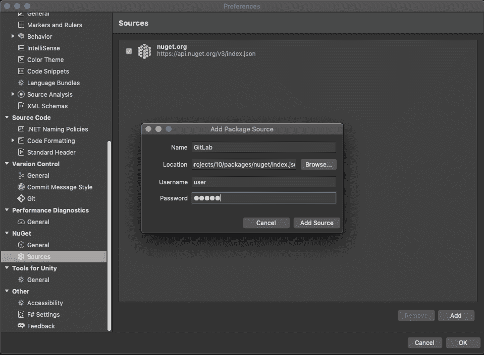
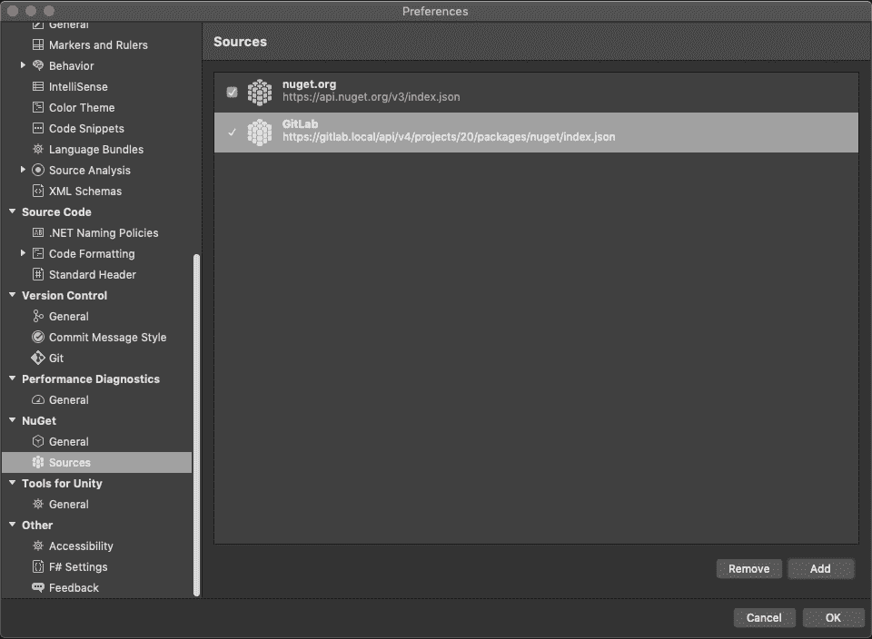

# GitLab NuGet Repository

> 原文：[https://docs.gitlab.com/ee/user/packages/nuget_repository/](https://docs.gitlab.com/ee/user/packages/nuget_repository/)

*   [Setting up your development environment](#setting-up-your-development-environment)
    *   [macOS support](#macos-support)
*   [Enabling the NuGet Repository](#enabling-the-nuget-repository)
*   [Adding the GitLab NuGet Repository as a source to NuGet](#adding-the-gitlab-nuget-repository-as-a-source-to-nuget)
    *   [Add NuGet Repository source with NuGet CLI](#add-nuget-repository-source-with-nuget-cli)
    *   [Add NuGet Repository source with Visual Studio](#add-nuget-repository-source-with-visual-studio)
    *   [Add NuGet Repository source with .NET CLI](#add-nuget-repository-source-with-net-cli)
*   [Uploading packages](#uploading-packages)
    *   [Upload packages with NuGet CLI](#upload-packages-with-nuget-cli)
    *   [Upload packages with .NET CLI](#upload-packages-with-net-cli)
*   [Install packages](#install-packages)
    *   [Install a package with NuGet CLI](#install-a-package-with-nuget-cli)
    *   [Install a package with .NET CLI](#install-a-package-with-net-cli)

# GitLab NuGet Repository[](#gitlab-nuget-repository-premium "Permalink")

[Introduced](https://gitlab.com/gitlab-org/gitlab/-/issues/20050) in [GitLab Premium](https://about.gitlab.com/pricing/) 12.8.

使用 GitLab NuGet 存储库，每个项目都可以拥有自己的空间来存储 NuGet 软件包.

GitLab NuGet 存储库可用于：

*   [NuGet CLI](https://docs.microsoft.com/en-us/nuget/reference/nuget-exe-cli-reference)
*   [.NET Core CLI](https://docs.microsoft.com/en-us/dotnet/core/tools/)
*   [Visual Studio](https://visualstudio.microsoft.com/vs/)

## Setting up your development environment[](#setting-up-your-development-environment "Permalink")

您将需要[NuGet CLI 5.2 或更高版本](https://www.nuget.org/downloads) . 早期版本尚未针对 GitLab NuGet 存储库进行测试，因此可能无法正常工作. 如果您具有[Visual Studio](https://visualstudio.microsoft.com/vs/) ，则可能已经安装了 NuGet CLI.

或者，您可以使用[.NET SDK 3.0 或更高版本](https://dotnet.microsoft.com/download/dotnet-core/3.0) ，该版本将安装 NuGet CLI.

您可以通过以下方法确认已正确安装[NuGet CLI](https://www.nuget.org/) ：

```
nuget help 
```

您应该看到类似以下内容：

```
NuGet Version: 5.2.0.6090
usage: NuGet <command> [args] [options]
Type 'NuGet help <command>' for help on a specific command.

Available commands:

[output truncated] 
```

### macOS support[](#macos-support "Permalink")

对于 macOS，您还可以使用[Mono](https://www.mono-project.com/)运行 NuGet CLI. 对于 Homebrew 用户，请运行`brew install mono`来安装 Mono. 然后，您应该能够从[NuGet CLI 页面](https://www.nuget.org/downloads)下载 Windows C＃二进制文件`nuget.exe`并运行：

```
mono nuget.exe 
```

## Enabling the NuGet Repository[](#enabling-the-nuget-repository "Permalink")

**注意：**仅当您的 GitLab 管理员[启用了对 Package Registry 的支持时，](../../../administration/packages/index.html)此选项才可用.

启用 NuGet 存储库后，默认情况下它将可用于所有新项目. 要为现有项目启用它，或者要禁用它：

1.  导航到项目的**"设置">"常规">"可见性，项目功能，权限"** .
2.  找到"软件包"功能并启用或禁用它.
3.  单击**保存更改**以使更改生效.

然后，您应该能够在左侧栏中看到" **程序包和注册表"**部分.

## Adding the GitLab NuGet Repository as a source to NuGet[](#adding-the-gitlab-nuget-repository-as-a-source-to-nuget "Permalink")

您将需要以下内容：

*   您的 GitLab 用户名.
*   个人访问令牌或部署令牌. 对于存储库身份验证：
    *   您可以将范围设置为`api`来生成[个人访问令牌](../../../user/profile/personal_access_tokens.html) .
    *   您可以生成[令牌部署](./../../project/deploy_tokens/index.html)与范围设置为`read_package_registry` ， `write_package_registry` ，或两者兼而有之.
*   您的来源的合适名称.
*   您的项目 ID，可以在项目的主页上找到.

您现在可以使用以下方法向 NuGet 添加新的源：

*   [NuGet CLI](#add-nuget-repository-source-with-nuget-cli)
*   [Visual Studio](#add-nuget-repository-source-with-visual-studio).
*   [.NET CLI](#add-nuget-repository-source-with-net-cli)

### Add NuGet Repository source with NuGet CLI[](#add-nuget-repository-source-with-nuget-cli "Permalink")

要将 GitLab NuGet 存储库添加为带有`nuget`的源：

```
nuget source Add -Name <source_name> -Source "https://gitlab-instance.example.com/api/v4/projects/<your_project_id>/packages/nuget/index.json" -UserName <gitlab_username or deploy_token_username> -Password <gitlab_personal_access_token or deploy_token> 
```

Where:

*   `<source_name>`是所需的源名称.

例如：

```
nuget source Add -Name "GitLab" -Source "https://gitlab.example/api/v4/projects/10/packages/nuget/index.json" -UserName carol -Password 12345678asdf 
```

### Add NuGet Repository source with Visual Studio[](#add-nuget-repository-source-with-visual-studio "Permalink")

1.  Open [Visual Studio](https://visualstudio.microsoft.com/vs/).
2.  打开" **文件">"选项"** （Windows）或" **Visual Studio">"首选项"** （Mac OS）.
3.  在**NuGet**部分中，打开**Sources** . 您将看到所有 NuGet 来源的列表.
4.  Click **Add**.
5.  填写以下字段：
    *   **名称** ：源的期望名称
    *   **位置** ： `https://gitlab.com/api/v4/projects/<your_project_id>/packages/nuget/index.json` : `https://gitlab.com/api/v4/projects/<your_project_id>/packages/nuget/index.json`
        *   将`<your_project_id>`替换为您的项目 ID.
        *   如果您具有自行管理的 GitLab 安装， `gitlab.com`使用您的域名替换`gitlab.com` .
    *   **用户**名：您的 GitLab 用户名或部署令牌用户名
    *   **密码** ：您的个人访问令牌或部署令牌

    [](img/visual_studio_adding_nuget_source.png)

6.  Click **Save**.

    [](img/visual_studio_nuget_source_added.png)

如有任何警告，请确保**Location** ， **Username**和**Password**正确.

### Add NuGet Repository source with .NET CLI[](#add-nuget-repository-source-with-net-cli "Permalink")

要将 GitLab NuGet 存储库添加为.NET 的源， `nuget.config`在项目的根目录中创建一个名为`nuget.config`的文件，其内容如下：

```
<?xml version="1.0" encoding="utf-8"?>
<configuration>
    <packageSources>
        <clear />
        <add key="gitlab" value="https://gitlab-instance.example.com/api/v4/projects/<your_project_id>/packages/nuget/index.json" />
    </packageSources>
    <packageSourceCredentials>
        <gitlab>
            <add key="Username" value="<gitlab_username or deploy_token_username>" />
            <add key="ClearTextPassword" value="<gitlab_personal_access_token or deploy_token>" />
        </gitlab>
    </packageSourceCredentials>
</configuration> 
```

## Uploading packages[](#uploading-packages "Permalink")

上载套件时，请注意：

*   允许的最大大小为 50 MB.
*   如果您多次上传具有相同版本的相同程序包，则每次连续上传都将保存为单独的文件. 安装软件包时，GitLab 将提供最新文件.
*   将软件包上传到 GitLab 时，它们不会立即显示在项目的软件包 UI 中. 处理包裹最多可能需要 10 分钟.

### Upload packages with NuGet CLI[](#upload-packages-with-nuget-cli "Permalink")

本部分假定您的项目已正确构建，并且已经[使用 NuGet CLI 创建了 NuGet 软件包](https://docs.microsoft.com/en-us/nuget/create-packages/creating-a-package) . 使用以下命令上传软件包：

```
nuget push <package_file> -Source <source_name> 
```

Where:

*   `<package_file>`是您的软件包文件名，以`.nupkg`结尾.
*   `<source_name>`是[安装过程中使用](#adding-the-gitlab-nuget-repository-as-a-source-to-nuget)的[源名称](#adding-the-gitlab-nuget-repository-as-a-source-to-nuget) .

### Upload packages with .NET CLI[](#upload-packages-with-net-cli "Permalink")

本节假定您的项目已正确构建，并且已经[使用.NET CLI 创建了 NuGet 软件包](https://docs.microsoft.com/en-us/nuget/create-packages/creating-a-package-dotnet-cli) . 使用以下命令上传软件包：

```
dotnet nuget push <package_file> --source <source_name> 
```

Where:

*   `<package_file>`是您的软件包文件名，以`.nupkg`结尾.
*   `<source_name>`是[安装过程中使用](#adding-the-gitlab-nuget-repository-as-a-source-to-nuget)的[源名称](#adding-the-gitlab-nuget-repository-as-a-source-to-nuget) .

例如：

```
dotnet nuget push MyPackage.1.0.0.nupkg --source gitlab 
```

## Install packages[](#install-packages "Permalink")

### Install a package with NuGet CLI[](#install-a-package-with-nuget-cli "Permalink")

**警告：**默认情况下， `nuget`检查的官方消息`nuget.org`第一. 如果您在 GitLab NuGet 存储库中拥有与`nuget.org`的软件包同名的软件包， `nuget.org`必须指定源名称，否则将安装错误的软件包.

使用以下命令安装最新版本的软件包：

```
nuget install <package_id> -OutputDirectory <output_directory> \
  -Version <package_version> \
  -Source <source_name> 
```

Where:

*   `<package_id>`是软件包 ID.
*   `<output_directory>`是将在其中安装软件包的输出目录.
*   `<package_version>` （可选）是软件包版本.
*   `<source_name>` （可选）是源名称.

### Install a package with .NET CLI[](#install-a-package-with-net-cli "Permalink")

**Warning:** If you have a package in the GitLab NuGet Repository with the same name as a package at a different source, you should verify the order in which `dotnet` checks sources during install. This is defined in the `nuget.config` file.

使用以下命令安装最新版本的软件包：

```
dotnet add package <package_id> \
       -v <package_version> 
```

Where:

*   `<package_id>`是软件包 ID.
*   `<package_version>` （可选）是软件包版本.