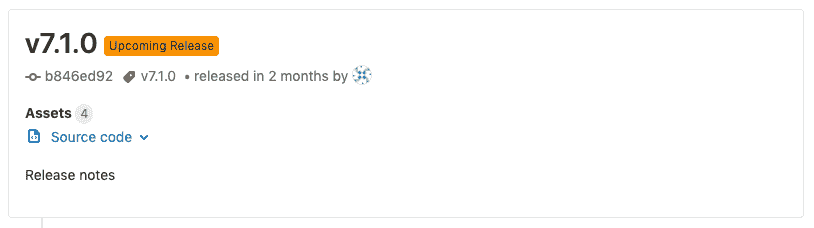

# Releases API

> 原文：[https://docs.gitlab.com/ee/api/releases/](https://docs.gitlab.com/ee/api/releases/)

*   [List Releases](#list-releases)
*   [Get a Release by a tag name](#get-a-release-by-a-tag-name)
*   [Create a release](#create-a-release)
*   [Collect release evidence](#collect-release-evidence-premium-only)
*   [Update a release](#update-a-release)
*   [Delete a Release](#delete-a-release)
*   [Upcoming Releases](#upcoming-releases)

# Releases API[](#releases-api "Permalink")

版本历史

*   在 GitLab 11.7 中[引入](https://gitlab.com/gitlab-org/gitlab-foss/-/issues/41766) .
*   使用此 API，您可以操纵 GitLab 的[Release](../../user/project/releases/index.html)条目.
*   有关将链接作为发布资产进行操作，请参见[Release Links API](links.html) .
*   在 GitLab 12.5 中[引入](https://gitlab.com/gitlab-org/gitlab/-/issues/26019)了发布证据.

## List Releases[](#list-releases "Permalink")

分页发布列表，按`released_at`排序.

```
GET /projects/:id/releases 
```

| Attribute | Type | Required | Description |
| --- | --- | --- | --- |
| `id` | integer/string | yes | 项目的 ID 或[URL 编码的路径](../README.html#namespaced-path-encoding) . |

请求示例：

```
curl --header "PRIVATE-TOKEN: gDybLx3yrUK_HLp3qPjS" "https://gitlab.example.com/api/v4/projects/24/releases" 
```

响应示例：

```
[  {  "tag_name":"v0.2",  "description":"## CHANGELOG\r\n\r\n- Escape label and milestone titles to prevent XSS in GFM autocomplete. !2740\r\n- Prevent private snippets from being embeddable.\r\n- Add subresources removal to member destroy service.",  "name":"Awesome app v0.2 beta",  "description_html":"\u003ch2 dir=\"auto\"\u003e\n\u003ca id=\"user-content-changelog\" class=\"anchor\" href=\"#changelog\" aria-hidden=\"true\"\u003e\u003c/a\u003eCHANGELOG\u003c/h2\u003e\n\u003cul dir=\"auto\"\u003e\n\u003cli\u003eEscape label and milestone titles to prevent XSS in GFM autocomplete. !2740\u003c/li\u003e\n\u003cli\u003ePrevent private snippets from being embeddable.\u003c/li\u003e\n\u003cli\u003eAdd subresources removal to member destroy service.\u003c/li\u003e\n\u003c/ul\u003e",  "created_at":"2019-01-03T01:56:19.539Z",  "released_at":"2019-01-03T01:56:19.539Z",  "author":{  "id":1,  "name":"Administrator",  "username":"root",  "state":"active",  "avatar_url":"https://www.gravatar.com/avatar/e64c7d89f26bd1972efa854d13d7dd61?s=80\u0026d=identicon",  "web_url":"https://gitlab.example.com/root"  },  "commit":{  "id":"079e90101242458910cccd35eab0e211dfc359c0",  "short_id":"079e9010",  "title":"Update README.md",  "created_at":"2019-01-03T01:55:38.000Z",  "parent_ids":[  "f8d3d94cbd347e924aa7b715845e439d00e80ca4"  ],  "message":"Update README.md",  "author_name":"Administrator",  "author_email":"admin@example.com",  "authored_date":"2019-01-03T01:55:38.000Z",  "committer_name":"Administrator",  "committer_email":"admin@example.com",  "committed_date":"2019-01-03T01:55:38.000Z"  },  "milestones":  [  {  "id":51,  "iid":1,  "project_id":24,  "title":"v1.0-rc",  "description":"Voluptate fugiat possimus quis quod aliquam expedita.",  "state":"closed",  "created_at":"2019-07-12T19:45:44.256Z",  "updated_at":"2019-07-12T19:45:44.256Z",  "due_date":"2019-08-16T11:00:00.256Z",  "start_date":"2019-07-30T12:00:00.256Z",  "web_url":"https://gitlab.example.com/root/awesome-app/-/milestones/1",  "issue_stats":  {  "total":  98,  "closed":  76  }  },  {  "id":52,  "iid":2,  "project_id":24,  "title":"v1.0",  "description":"Voluptate fugiat possimus quis quod aliquam expedita.",  "state":"closed",  "created_at":"2019-07-16T14:00:12.256Z",  "updated_at":"2019-07-16T14:00:12.256Z",  "due_date":"2019-08-16T11:00:00.256Z",  "start_date":"2019-07-30T12:00:00.256Z",  "web_url":"https://gitlab.example.com/root/awesome-app/-/milestones/2",  "issue_stats":  {  "total":  24,  "closed":  21  }  }  ],  "commit_path":"/root/awesome-app/commit/588440f66559714280628a4f9799f0c4eb880a4a",  "tag_path":"/root/awesome-app/-/tags/v0.11.1",  "assets":{  "count":6,  "sources":[  {  "format":"zip",  "url":"https://gitlab.example.com/root/awesome-app/-/archive/v0.2/awesome-app-v0.2.zip"  },  {  "format":"tar.gz",  "url":"https://gitlab.example.com/root/awesome-app/-/archive/v0.2/awesome-app-v0.2.tar.gz"  },  {  "format":"tar.bz2",  "url":"https://gitlab.example.com/root/awesome-app/-/archive/v0.2/awesome-app-v0.2.tar.bz2"  },  {  "format":"tar",  "url":"https://gitlab.example.com/root/awesome-app/-/archive/v0.2/awesome-app-v0.2.tar"  }  ],  "links":[  {  "id":2,  "name":"awesome-v0.2.msi",  "url":"http://192.168.10.15:3000/msi",  "external":true,  "link_type":"other"  },  {  "id":1,  "name":"awesome-v0.2.dmg",  "url":"http://192.168.10.15:3000",  "external":true,  "link_type":"other"  }  ],  "evidence_file_path":"https://gitlab.example.com/root/awesome-app/-/releases/v0.2/evidence.json"  },  "evidences":[  {  sha:  "760d6cdfb0879c3ffedec13af470e0f71cf52c6cde4d",  filepath:  "https://gitlab.example.com/root/awesome-app/-/releases/v0.2/evidence.json",  collected_at:  "2019-01-03T01:56:19.539Z"  }  ]  },  {  "tag_name":"v0.1",  "description":"## CHANGELOG\r\n\r\n-Remove limit of 100 when searching repository code. !8671\r\n- Show error message when attempting to reopen an MR and there is an open MR for the same branch. !16447 (Akos Gyimesi)\r\n- Fix a bug where internal email pattern wasn't respected. !22516",  "name":"Awesome app v0.1 alpha",  "description_html":"\u003ch2 dir=\"auto\"\u003e\n\u003ca id=\"user-content-changelog\" class=\"anchor\" href=\"#changelog\" aria-hidden=\"true\"\u003e\u003c/a\u003eCHANGELOG\u003c/h2\u003e\n\u003cul dir=\"auto\"\u003e\n\u003cli\u003eRemove limit of 100 when searching repository code. !8671\u003c/li\u003e\n\u003cli\u003eShow error message when attempting to reopen an MR and there is an open MR for the same branch. !16447 (Akos Gyimesi)\u003c/li\u003e\n\u003cli\u003eFix a bug where internal email pattern wasn't respected. !22516\u003c/li\u003e\n\u003c/ul\u003e",  "created_at":"2019-01-03T01:55:18.203Z",  "released_at":"2019-01-03T01:55:18.203Z",  "author":{  "id":1,  "name":"Administrator",  "username":"root",  "state":"active",  "avatar_url":"https://www.gravatar.com/avatar/e64c7d89f26bd1972efa854d13d7dd61?s=80\u0026d=identicon",  "web_url":"https://gitlab.example.com/root"  },  "commit":{  "id":"f8d3d94cbd347e924aa7b715845e439d00e80ca4",  "short_id":"f8d3d94c",  "title":"Initial commit",  "created_at":"2019-01-03T01:53:28.000Z",  "parent_ids":[  ],  "message":"Initial commit",  "author_name":"Administrator",  "author_email":"admin@example.com",  "authored_date":"2019-01-03T01:53:28.000Z",  "committer_name":"Administrator",  "committer_email":"admin@example.com",  "committed_date":"2019-01-03T01:53:28.000Z"  },  "assets":{  "count":4,  "sources":[  {  "format":"zip",  "url":"https://gitlab.example.com/root/awesome-app/-/archive/v0.1/awesome-app-v0.1.zip"  },  {  "format":"tar.gz",  "url":"https://gitlab.example.com/root/awesome-app/-/archive/v0.1/awesome-app-v0.1.tar.gz"  },  {  "format":"tar.bz2",  "url":"https://gitlab.example.com/root/awesome-app/-/archive/v0.1/awesome-app-v0.1.tar.bz2"  },  {  "format":"tar",  "url":"https://gitlab.example.com/root/awesome-app/-/archive/v0.1/awesome-app-v0.1.tar"  }  ],  "links":[  ],  "evidence_file_path":"https://gitlab.example.com/root/awesome-app/-/releases/v0.1/evidence.json"  },  "evidences":[  {  sha:  "c3ffedec13af470e760d6cdfb08790f71cf52c6cde4d",  filepath:  "https://gitlab.example.com/root/awesome-app/-/releases/v0.1/evidence.json",  collected_at:  "2019-01-03T01:55:18.203Z"  }  ]  }  ] 
```

## Get a Release by a tag name[](#get-a-release-by-a-tag-name "Permalink")

获取给定标签的发布.

```
GET /projects/:id/releases/:tag_name 
```

| Attribute | Type | Required | Description |
| --- | --- | --- | --- |
| `id` | integer/string | yes | 项目的 ID 或[URL 编码的路径](../README.html#namespaced-path-encoding) . |
| `tag_name` | string | yes | 将在其中创建发行版的标签. |

请求示例：

```
curl --header "PRIVATE-TOKEN: gDybLx3yrUK_HLp3qPjS" "https://gitlab.example.com/api/v4/projects/24/releases/v0.1" 
```

响应示例：

```
{  "tag_name":"v0.1",  "description":"## CHANGELOG\r\n\r\n- Remove limit of 100 when searching repository code. !8671\r\n- Show error message when attempting to reopen an MR and there is an open MR for the same branch. !16447 (Akos Gyimesi)\r\n- Fix a bug where internal email pattern wasn't respected. !22516",  "name":"Awesome app v0.1 alpha",  "description_html":"\u003ch2 dir=\"auto\"\u003e\n\u003ca id=\"user-content-changelog\" class=\"anchor\" href=\"#changelog\" aria-hidden=\"true\"\u003e\u003c/a\u003eCHANGELOG\u003c/h2\u003e\n\u003cul dir=\"auto\"\u003e\n\u003cli\u003eRemove limit of 100 when searching repository code. !8671\u003c/li\u003e\n\u003cli\u003eShow error message when attempting to reopen an MR and there is an open MR for the same branch. !16447 (Akos Gyimesi)\u003c/li\u003e\n\u003cli\u003eFix a bug where internal email pattern wasn't respected. !22516\u003c/li\u003e\n\u003c/ul\u003e",  "created_at":"2019-01-03T01:55:18.203Z",  "released_at":"2019-01-03T01:55:18.203Z",  "author":{  "id":1,  "name":"Administrator",  "username":"root",  "state":"active",  "avatar_url":"https://www.gravatar.com/avatar/e64c7d89f26bd1972efa854d13d7dd61?s=80\u0026d=identicon",  "web_url":"https://gitlab.example.com/root"  },  "commit":{  "id":"f8d3d94cbd347e924aa7b715845e439d00e80ca4",  "short_id":"f8d3d94c",  "title":"Initial commit",  "created_at":"2019-01-03T01:53:28.000Z",  "parent_ids":[  ],  "message":"Initial commit",  "author_name":"Administrator",  "author_email":"admin@example.com",  "authored_date":"2019-01-03T01:53:28.000Z",  "committer_name":"Administrator",  "committer_email":"admin@example.com",  "committed_date":"2019-01-03T01:53:28.000Z"  },  "milestones":  [  {  "id":51,  "iid":1,  "project_id":24,  "title":"v1.0-rc",  "description":"Voluptate fugiat possimus quis quod aliquam expedita.",  "state":"closed",  "created_at":"2019-07-12T19:45:44.256Z",  "updated_at":"2019-07-12T19:45:44.256Z",  "due_date":"2019-08-16T11:00:00.256Z",  "start_date":"2019-07-30T12:00:00.256Z",  "web_url":"https://gitlab.example.com/root/awesome-app/-/milestones/1",  "issue_stats":  {  "total":  98,  "closed":  76  }  },  {  "id":52,  "iid":2,  "project_id":24,  "title":"v1.0",  "description":"Voluptate fugiat possimus quis quod aliquam expedita.",  "state":"closed",  "created_at":"2019-07-16T14:00:12.256Z",  "updated_at":"2019-07-16T14:00:12.256Z",  "due_date":"2019-08-16T11:00:00.256Z",  "start_date":"2019-07-30T12:00:00.256Z",  "web_url":"https://gitlab.example.com/root/awesome-app/-/milestones/2",  "issue_stats":  {  "total":  24,  "closed":  21  }  }  ],  "commit_path":"/root/awesome-app/commit/588440f66559714280628a4f9799f0c4eb880a4a",  "tag_path":"/root/awesome-app/-/tags/v0.11.1",  "assets":{  "count":5,  "sources":[  {  "format":"zip",  "url":"https://gitlab.example.com/root/awesome-app/-/archive/v0.1/awesome-app-v0.1.zip"  },  {  "format":"tar.gz",  "url":"https://gitlab.example.com/root/awesome-app/-/archive/v0.1/awesome-app-v0.1.tar.gz"  },  {  "format":"tar.bz2",  "url":"https://gitlab.example.com/root/awesome-app/-/archive/v0.1/awesome-app-v0.1.tar.bz2"  },  {  "format":"tar",  "url":"https://gitlab.example.com/root/awesome-app/-/archive/v0.1/awesome-app-v0.1.tar"  }  ],  "links":[  {  "id":3,  "name":"hoge",  "url":"https://gitlab.example.com/root/awesome-app/-/tags/v0.11.1/binaries/linux-amd64",  "external":true,  "link_type":"other"  }  ]  },  "evidences":[  {  sha:  "760d6cdfb0879c3ffedec13af470e0f71cf52c6cde4d",  filepath:  "https://gitlab.example.com/root/awesome-app/-/releases/v0.1/evidence.json",  collected_at:  "2019-07-16T14:00:12.256Z"  }  ]  } 
```

## Create a release[](#create-a-release "Permalink")

创建发布. 您需要对存储库的推送访问权限才能创建发行版.

```
POST /projects/:id/releases 
```

| Attribute | Type | Required | Description |
| --- | --- | --- | --- |
| `id` | integer/string | yes | 项目的 ID 或[URL 编码的路径](../README.html#namespaced-path-encoding) . |
| `name` | string | no | 发布名称. |
| `tag_name` | string | yes | 将在其中创建发行版的标签. |
| `description` | string | no | 版本说明. 您可以使用[Markdown](../../user/markdown.html) . |
| `ref` | string | 是的，如果`tag_name`不存在 | If `tag_name` doesn’t exist, the release will be created from `ref`. It can be a commit SHA, another tag name, or a branch name. |
| `milestones` | 字符串数组 | no | 与发行版关联的每个里程碑的标题. |
| `assets:links` | 哈希数组 | no | 一系列资产链接. |
| `assets:links:name` | string | 要求： `assets:links` | 链接的名称. |
| `assets:links:url` | string | 要求： `assets:links` | 链接的 URL. |
| `assets:links:filepath` | string | no | [直接资产链接的](../../user/project/releases.html)可选路径. |
| `assets:links:link_type` | string | no | 链接的类型： `other` ， `runbook` ， `image` ， `package` . 默认为`other` . |
| `released_at` | datetime | no | 发布准备/准备就绪的日期. 默认为当前时间. 预期为 ISO 8601 格式（ `2019-03-15T08:00:00Z` ）. |

请求示例：

```
curl --header 'Content-Type: application/json' --header "PRIVATE-TOKEN: gDybLx3yrUK_HLp3qPjS" \
     --data '{ "name": "New release", "tag_name": "v0.3", "description": "Super nice release", "milestones": ["v1.0", "v1.0-rc"], "assets": { "links": [{ "name": "hoge", "url": "https://google.com", "filepath": "/binaries/linux-amd64", "link_type":"other" }] } }' \
     --request POST https://gitlab.example.com/api/v4/projects/24/releases 
```

响应示例：

```
{  "tag_name":"v0.3",  "description":"Super nice release",  "name":"New release",  "description_html":"\u003cp dir=\"auto\"\u003eSuper nice release\u003c/p\u003e",  "created_at":"2019-01-03T02:22:45.118Z",  "released_at":"2019-01-03T02:22:45.118Z",  "author":{  "id":1,  "name":"Administrator",  "username":"root",  "state":"active",  "avatar_url":"https://www.gravatar.com/avatar/e64c7d89f26bd1972efa854d13d7dd61?s=80\u0026d=identicon",  "web_url":"https://gitlab.example.com/root"  },  "commit":{  "id":"079e90101242458910cccd35eab0e211dfc359c0",  "short_id":"079e9010",  "title":"Update README.md",  "created_at":"2019-01-03T01:55:38.000Z",  "parent_ids":[  "f8d3d94cbd347e924aa7b715845e439d00e80ca4"  ],  "message":"Update README.md",  "author_name":"Administrator",  "author_email":"admin@example.com",  "authored_date":"2019-01-03T01:55:38.000Z",  "committer_name":"Administrator",  "committer_email":"admin@example.com",  "committed_date":"2019-01-03T01:55:38.000Z"  },  "milestones":  [  {  "id":51,  "iid":1,  "project_id":24,  "title":"v1.0-rc",  "description":"Voluptate fugiat possimus quis quod aliquam expedita.",  "state":"closed",  "created_at":"2019-07-12T19:45:44.256Z",  "updated_at":"2019-07-12T19:45:44.256Z",  "due_date":"2019-08-16T11:00:00.256Z",  "start_date":"2019-07-30T12:00:00.256Z",  "web_url":"https://gitlab.example.com/root/awesome-app/-/milestones/1",  "issue_stats":  {  "total":  99,  "closed":  76  }  },  {  "id":52,  "iid":2,  "project_id":24,  "title":"v1.0",  "description":"Voluptate fugiat possimus quis quod aliquam expedita.",  "state":"closed",  "created_at":"2019-07-16T14:00:12.256Z",  "updated_at":"2019-07-16T14:00:12.256Z",  "due_date":"2019-08-16T11:00:00.256Z",  "start_date":"2019-07-30T12:00:00.256Z",  "web_url":"https://gitlab.example.com/root/awesome-app/-/milestones/2",  "issue_stats":  {  "total":  24,  "closed":  21  }  }  ],  "commit_path":"/root/awesome-app/commit/588440f66559714280628a4f9799f0c4eb880a4a",  "tag_path":"/root/awesome-app/-/tags/v0.11.1",  "evidence_sha":"760d6cdfb0879c3ffedec13af470e0f71cf52c6cde4d",  "assets":{  "count":5,  "sources":[  {  "format":"zip",  "url":"https://gitlab.example.com/root/awesome-app/-/archive/v0.3/awesome-app-v0.3.zip"  },  {  "format":"tar.gz",  "url":"https://gitlab.example.com/root/awesome-app/-/archive/v0.3/awesome-app-v0.3.tar.gz"  },  {  "format":"tar.bz2",  "url":"https://gitlab.example.com/root/awesome-app/-/archive/v0.3/awesome-app-v0.3.tar.bz2"  },  {  "format":"tar",  "url":"https://gitlab.example.com/root/awesome-app/-/archive/v0.3/awesome-app-v0.3.tar"  }  ],  "links":[  {  "id":3,  "name":"hoge",  "url":"https://gitlab.example.com/root/awesome-app/-/tags/v0.11.1/binaries/linux-amd64",  "external":true,  "link_type":"other"  }  ],  "evidence_file_path":"https://gitlab.example.com/root/awesome-app/-/releases/v0.3/evidence.json"  },  } 
```

## Collect release evidence[](#collect-release-evidence-premium-only "Permalink")

[Introduced](https://gitlab.com/gitlab-org/gitlab/-/issues/199065) in [GitLab Premium](https://about.gitlab.com/pricing/) 12.10.

为现有版本创建证据.

```
POST /projects/:id/releases/:tag_name/evidence 
```

| Attribute | Type | Required | Description |
| --- | --- | --- | --- |
| `id` | integer/string | yes | 项目的 ID 或[URL 编码的路径](../README.html#namespaced-path-encoding) . |
| `tag_name` | string | yes | 将在其中创建发行版的标签. |

请求示例：

```
curl --request POST --header "PRIVATE-TOKEN: gDybLx3yrUK_HLp3qPjS" "https://gitlab.example.com/api/v4/projects/24/releases/v0.1/evidence" 
```

响应示例：

```
200 
```

## Update a release[](#update-a-release "Permalink")

更新发行版.

```
PUT /projects/:id/releases/:tag_name 
```

| Attribute | Type | Required | Description |
| --- | --- | --- | --- |
| `id` | integer/string | yes | 项目的 ID 或[URL 编码的路径](../README.html#namespaced-path-encoding) . |
| `tag_name` | string | yes | 将在其中创建发行版的标签. |
| `name` | string | no | 发布名称. |
| `description` | string | no | 版本说明. 您可以使用[Markdown](../../user/markdown.html) . |
| `milestones` | 字符串数组 | no | 与发布关联的每个里程碑的标题（ `[]`从发布中删除所有里程碑）. |
| `released_at` | datetime | no | 发布准备/准备就绪的日期. 预期为 ISO 8601 格式（ `2019-03-15T08:00:00Z` ）. |

请求示例：

```
curl --header 'Content-Type: application/json' --request PUT --data '{"name": "new name", "milestones": ["v1.2"]}' --header "PRIVATE-TOKEN: gDybLx3yrUK_HLp3qPjS" "https://gitlab.example.com/api/v4/projects/24/releases/v0.1" 
```

响应示例：

```
{  "tag_name":"v0.1",  "description":"## CHANGELOG\r\n\r\n- Remove limit of 100 when searching repository code. !8671\r\n- Show error message when attempting to reopen an MR and there is an open MR for the same branch. !16447 (Akos Gyimesi)\r\n- Fix a bug where internal email pattern wasn't respected. !22516",  "name":"new name",  "description_html":"\u003ch2 dir=\"auto\"\u003e\n\u003ca id=\"user-content-changelog\" class=\"anchor\" href=\"#changelog\" aria-hidden=\"true\"\u003e\u003c/a\u003eCHANGELOG\u003c/h2\u003e\n\u003cul dir=\"auto\"\u003e\n\u003cli\u003eRemove limit of 100 when searching repository code. !8671\u003c/li\u003e\n\u003cli\u003eShow error message when attempting to reopen an MR and there is an open MR for the same branch. !16447 (Akos Gyimesi)\u003c/li\u003e\n\u003cli\u003eFix a bug where internal email pattern wasn't respected. !22516\u003c/li\u003e\n\u003c/ul\u003e",  "created_at":"2019-01-03T01:55:18.203Z",  "released_at":"2019-01-03T01:55:18.203Z",  "author":{  "id":1,  "name":"Administrator",  "username":"root",  "state":"active",  "avatar_url":"https://www.gravatar.com/avatar/e64c7d89f26bd1972efa854d13d7dd61?s=80\u0026d=identicon",  "web_url":"https://gitlab.example.com/root"  },  "commit":{  "id":"f8d3d94cbd347e924aa7b715845e439d00e80ca4",  "short_id":"f8d3d94c",  "title":"Initial commit",  "created_at":"2019-01-03T01:53:28.000Z",  "parent_ids":[  ],  "message":"Initial commit",  "author_name":"Administrator",  "author_email":"admin@example.com",  "authored_date":"2019-01-03T01:53:28.000Z",  "committer_name":"Administrator",  "committer_email":"admin@example.com",  "committed_date":"2019-01-03T01:53:28.000Z"  },  "milestones":  [  {  "id":53,  "iid":3,  "project_id":24,  "title":"v1.0",  "description":"Voluptate fugiat possimus quis quod aliquam expedita.",  "state":"active",  "created_at":"2019-09-01T13:00:00.256Z",  "updated_at":"2019-09-01T13:00:00.256Z",  "due_date":"2019-09-20T13:00:00.256Z",  "start_date":"2019-09-05T12:00:00.256Z",  "web_url":"https://gitlab.example.com/root/awesome-app/-/milestones/3",  "issue_stats":  {  "opened":  11,  "closed":  78  }  }  ],  "commit_path":"/root/awesome-app/commit/588440f66559714280628a4f9799f0c4eb880a4a",  "tag_path":"/root/awesome-app/-/tags/v0.11.1",  "evidence_sha":"760d6cdfb0879c3ffedec13af470e0f71cf52c6cde4d",  "assets":{  "count":4,  "sources":[  {  "format":"zip",  "url":"https://gitlab.example.com/root/awesome-app/-/archive/v0.1/awesome-app-v0.1.zip"  },  {  "format":"tar.gz",  "url":"https://gitlab.example.com/root/awesome-app/-/archive/v0.1/awesome-app-v0.1.tar.gz"  },  {  "format":"tar.bz2",  "url":"https://gitlab.example.com/root/awesome-app/-/archive/v0.1/awesome-app-v0.1.tar.bz2"  },  {  "format":"tar",  "url":"https://gitlab.example.com/root/awesome-app/-/archive/v0.1/awesome-app-v0.1.tar"  }  ],  "links":[  ],  "evidence_file_path":"https://gitlab.example.com/root/awesome-app/-/releases/v0.1/evidence.json"  },  } 
```

## Delete a Release[](#delete-a-release "Permalink")

删除发行版. 删除发行版不会删除关联的标签.

```
DELETE /projects/:id/releases/:tag_name 
```

| Attribute | Type | Required | Description |
| --- | --- | --- | --- |
| `id` | integer/string | yes | 项目的 ID 或[URL 编码的路径](../README.html#namespaced-path-encoding) . |
| `tag_name` | string | yes | 将在其中创建发行版的标签. |

请求示例：

```
curl --request DELETE --header "PRIVATE-TOKEN: gDybLx3yrUK_HLp3qPjS" "https://gitlab.example.com/api/v4/projects/24/releases/v0.1" 
```

响应示例：

```
{  "tag_name":"v0.1",  "description":"## CHANGELOG\r\n\r\n- Remove limit of 100 when searching repository code. !8671\r\n- Show error message when attempting to reopen an MR and there is an open MR for the same branch. !16447 (Akos Gyimesi)\r\n- Fix a bug where internal email pattern wasn't respected. !22516",  "name":"new name",  "description_html":"\u003ch2 dir=\"auto\"\u003e\n\u003ca id=\"user-content-changelog\" class=\"anchor\" href=\"#changelog\" aria-hidden=\"true\"\u003e\u003c/a\u003eCHANGELOG\u003c/h2\u003e\n\u003cul dir=\"auto\"\u003e\n\u003cli\u003eRemove limit of 100 when searching repository code. !8671\u003c/li\u003e\n\u003cli\u003eShow error message when attempting to reopen an MR and there is an open MR for the same branch. !16447 (Akos Gyimesi)\u003c/li\u003e\n\u003cli\u003eFix a bug where internal email pattern wasn't respected. !22516\u003c/li\u003e\n\u003c/ul\u003e",  "created_at":"2019-01-03T01:55:18.203Z",  "released_at":"2019-01-03T01:55:18.203Z",  "author":{  "id":1,  "name":"Administrator",  "username":"root",  "state":"active",  "avatar_url":"https://www.gravatar.com/avatar/e64c7d89f26bd1972efa854d13d7dd61?s=80\u0026d=identicon",  "web_url":"https://gitlab.example.com/root"  },  "commit":{  "id":"f8d3d94cbd347e924aa7b715845e439d00e80ca4",  "short_id":"f8d3d94c",  "title":"Initial commit",  "created_at":"2019-01-03T01:53:28.000Z",  "parent_ids":[  ],  "message":"Initial commit",  "author_name":"Administrator",  "author_email":"admin@example.com",  "authored_date":"2019-01-03T01:53:28.000Z",  "committer_name":"Administrator",  "committer_email":"admin@example.com",  "committed_date":"2019-01-03T01:53:28.000Z"  },  "commit_path":"/root/awesome-app/commit/588440f66559714280628a4f9799f0c4eb880a4a",  "tag_path":"/root/awesome-app/-/tags/v0.11.1",  "evidence_sha":"760d6cdfb0879c3ffedec13af470e0f71cf52c6cde4d",  "assets":{  "count":4,  "sources":[  {  "format":"zip",  "url":"https://gitlab.example.com/root/awesome-app/-/archive/v0.1/awesome-app-v0.1.zip"  },  {  "format":"tar.gz",  "url":"https://gitlab.example.com/root/awesome-app/-/archive/v0.1/awesome-app-v0.1.tar.gz"  },  {  "format":"tar.bz2",  "url":"https://gitlab.example.com/root/awesome-app/-/archive/v0.1/awesome-app-v0.1.tar.bz2"  },  {  "format":"tar",  "url":"https://gitlab.example.com/root/awesome-app/-/archive/v0.1/awesome-app-v0.1.tar"  }  ],  "links":[  ],  "evidence_file_path":"https://gitlab.example.com/root/awesome-app/-/releases/v0.1/evidence.json"  },  } 
```

## Upcoming Releases[](#upcoming-releases "Permalink")

在 GitLab 12.1 中[引入](https://gitlab.com/gitlab-org/gitlab-foss/-/issues/38105) .

有一种剥离`released_at`属性设置为将来的日期将被标记在 UI **即将推出**的**版本** ：

[](img/upcoming_release_v12_1.png)