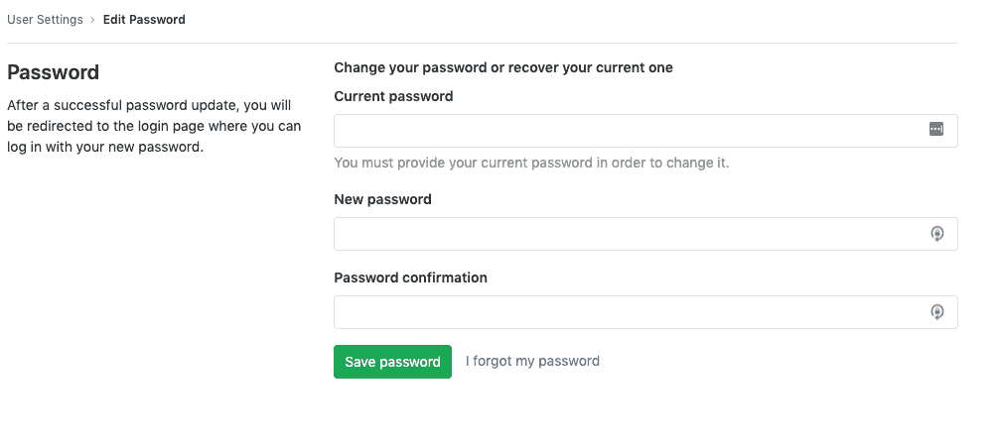

# User account

> 原文：[https://docs.gitlab.com/ee/user/profile/](https://docs.gitlab.com/ee/user/profile/)

*   [Creating users](#creating-users)
*   [Signing in](#signing-in)
    *   [Unknown sign-in](#unknown-sign-in)
*   [User profile](#user-profile)
*   [Profile settings](#profile-settings)
*   [Changing your password](#changing-your-password)
*   [Changing your username](#changing-your-username)
*   [Private profile](#private-profile)
*   [Add details of external accounts](#add-details-of-external-accounts)
*   [Private contributions](#private-contributions)
*   [Current status](#current-status)
*   [Commit email](#commit-email)
    *   [Private commit email](#private-commit-email)
*   [Troubleshooting](#troubleshooting)
    *   [Why do I keep getting signed out?](#why-do-i-keep-getting-signed-out)
    *   [Increased sign-in time](#increased-sign-in-time)

# User account[](#user-account "Permalink")

每个 GitLab 帐户都有一个用户个人资料和设置. 您的[个人资料](#user-profile)包含有关您以及您的 GitLab 活动的信息. 您的[设置](#profile-settings)允许您自定义 GitLab 的某些方面以适合自己.

## Creating users[](#creating-users "Permalink")

在 GitLab 上有几种创建用户的方法. 有关更多详细信息，请参见[创建用户文档](account/create_accounts.html) .

## Signing in[](#signing-in "Permalink")

有几种方法可以登录您的 GitLab 帐户. 有关更多详细信息，请参见[身份验证主题](../../topics/authentication/index.html) .

### Unknown sign-in[](#unknown-sign-in "Permalink")

GitLab will notify you if a sign-in occurs that is from an unknown IP address or device. See [Unknown Sign-In Notification](unknown_sign_in_notification.html) for more details.

## User profile[](#user-profile "Permalink")

要访问您的个人资料：

1.  单击您的头像.
2.  Select **Profile**.

在您的个人资料页面上，您将看到以下信息：

*   个人信息
*   活动流：查看您的活动流线和贡献历史
*   组： [组](../group/index.html)你的成员
*   参与的项目：您参与的[项目](../project/index.html)
*   个人项目：您的个人项目（尊重项目的可见性级别）
*   已加星标的项目：您已加星标的项目
*   片段：您的个人代码[片段](../snippets.html#personal-snippets)

## Profile settings[](#profile-settings "Permalink")

要访问您的个人资料设置：

1.  单击您的头像.
2.  Select **Settings**.

从那里，您可以：

*   更新您的个人信息
*   修改[密码](#changing-your-password)
*   为您的个人资料设置[自定义状态](#current-status)
*   管理您的个人资料的[提交电子邮件](#commit-email)
*   Manage [2FA](account/two_factor_authentication.html)
*   添加[外部帐户的](#add-details-of-external-accounts)详细信息.
*   更改您的用户名并[删除您的帐户](account/delete_account.html)
*   管理可以[将 GitLab 用作 OAuth 提供](../../integration/oauth_provider.html#introduction-to-oauth)程序的应用[程序](../../integration/oauth_provider.html#introduction-to-oauth)
*   管理[个人访问令牌](personal_access_tokens.html)以通过 API 和授权的应用程序访问您的帐户
*   添加和删​​除链接到您帐户的电子邮件
*   选择用于[通知](notifications.html) ，基于 Web 的提交并显示在您的公开个人资料上的电子邮件
*   管理[SSH 密钥](../../ssh/README.html)以通过 SSH 访问您的帐户
*   管理您的[首选项](preferences.html#syntax-highlighting-theme)以自定义自己的 GitLab 体验
*   [查看您的活动会话](active_sessions.html)并在必要时撤消其中的任何一个
*   访问审核日志，这是涉及您帐户的重要事件的安全日志

## Changing your password[](#changing-your-password "Permalink")

1.  导航到您的[个人资料的](#profile-settings) **设置>密码** .
2.  在"当前密码"字段中输入您的当前密码.
3.  两次输入所需的新密码，一次在"新密码"字段中，一次在"密码确认"字段中.
4.  点击"保存密码"按钮.

如果您不知道当前密码，请选择"我忘记了密码"链接.

[](./img/change_password_v13_0.png)

## Changing your username[](#changing-your-username "Permalink")

`username`是与用户 ID 相关的唯一[`namespace`](../group/index.html#namespaces) . 对其进行更改可能会产生意想不到的副作用，请在继续之前阅读[重定向的行为](../project/index.html#redirects-when-changing-repository-paths) .

更改`username` ：

1.  导航到您的[个人资料的](#profile-settings) **设置>帐户** .
2.  在**更改用户**名下输入新的用户**名** .
3.  Click **更新用户名**.

**注意：**如果用户名包含带有[Container Registry](../packages/container_registry/index.html)标签的项目，则当前无法更改用户名，因为该项目无法移动.**提示：**如果要保留对原始名称空间的所有权并保护 URL 重定向，则可以更改一个组并向其传输项目，而无需更改组的路径或重命名用户名. 另外，您可以按照[《 GitLab 团队手册》中的详细步骤进行操作，该手册](https://about.gitlab.com/handbook/tools-and-tips/#how-to-change-your-username-at-gitlabcom)还介绍了使用[GitLab Pages](../project/pages/index.html)托管项目的情况.

## Private profile[](#private-profile "Permalink")

如果启用了此功能，将从用户配置文件页面（ `https://gitlab.example.com/username` ）中隐藏以下信息：

*   原子饲料
*   创建帐户的日期
*   活动标签
*   组选项卡
*   参与项目标签
*   个人项目标签
*   已加星标的项目标签
*   片段标签

要启用私人资料：

1.  单击您的头像.
2.  Select **Profile**.
3.  单击**编辑配置文件** （铅笔图标）.
4.  在" **主要设置"**部分中选中" **私人个人资料"**选项.
5.  Click **更新配置文件设置**.

**Note:** All your profile information can be seen by yourself, and GitLab admins, even if the **私人简介** option is enabled.

## Add details of external accounts[](#add-details-of-external-accounts "Permalink")

GitLab 允许您将链接添加到您可能拥有的某些其他外部帐户，例如 Skype 和 Twitter. 他们可以帮助其他用户在其他平台上与您建立联系.

要将链接添加到其他帐户：

1.  单击您的头像.
2.  Select **Profile**.
3.  单击**编辑配置文件** （铅笔图标）.
4.  在" **主要设置"**部分中完成外部帐户的所需字段：
    *   Skype 的
    *   推特
    *   领英
5.  Click **更新配置文件设置**.

## Private contributions[](#private-contributions "Permalink")

在 GitLab 11.3 中[引入](https://gitlab.com/gitlab-org/gitlab-foss/-/issues/14078) .

启用私人捐款将包括对私人项目的捐款，用户捐款日历图和用户最近的活动.

要启用私人捐款：

1.  单击您的头像.
2.  Select **Profile**.
3.  单击**编辑配置文件** （铅笔图标）.
4.  选中**私人捐款**选项.
5.  Click **更新配置文件设置**.

## Current status[](#current-status "Permalink")

在 GitLab 11.2 中引入.

您可以为用户个人资料提供自定义状态消息以及描述它的表情符号. 当您不在办公室或不在家时，这可能会有所帮助. 然后，其他用户可以在回答您的问题或为您分配工作时考虑您的身份. 请注意，即使您的[个人资料是私人的](#private-profile) ，您的状态也是公开可见的.

状态消息限制为 100 个纯文本字符. 但是，它们可能包含表情符号代码，例如" `I'm on vacation :palm_tree:` .

设置当前状态：

1.  单击您的头像.
2.  点击**设置状态** ，或点击**编辑状态（**如果您已经设置了状态）.
3.  设置所需的表情符号和/或状态消息.
4.  点击**设置状态** . 或者，您可以单击" **删除状态"**以完全删除您的用户状态.

or

1.  单击您的头像.
2.  Select **Profile**.
3.  单击**编辑配置文件** （铅笔图标）.
4.  在**您的状态**文本字段中输入您的状态消息.
5.  点击**添加状态表情符号** （笑脸），然后选择所需的表情符号.
6.  Click **更新配置文件设置**.

您还可以[使用 API](../../api/users.html#user-status)设置当前状态.

## Commit email[](#commit-email "Permalink")

在 GitLab 11.4 中[引入](https://gitlab.com/gitlab-org/gitlab-foss/-/merge_requests/21598) .

提交电子邮件是在通过 GitLab 界面执行的每个与 Git 相关的操作中显示的电子邮件地址.

您自己的任何已验证电子邮件地址都可以用作提交电子邮件.

要更改您的提交电子邮件：

1.  单击您的头像.
2.  Select **Profile**.
3.  单击**编辑配置文件** （铅笔图标）.
4.  Click **提交电子邮件** dropdown.
5.  选择任何已验证的电子邮件.
6.  Click **更新配置文件设置**.

### Private commit email[](#private-commit-email "Permalink")

在 GitLab 11.5 中[引入](https://gitlab.com/gitlab-org/gitlab-foss/-/merge_requests/22560) .

GitLab 为用户提供了一个自动生成的私人提交电子邮件选项，该选项允许用户将其电子邮件信息保密.

要启用此选项：

1.  单击您的头像.
2.  Select **Profile**.
3.  单击**编辑配置文件** （铅笔图标）.
4.  Click **提交电子邮件** dropdown.
5.  Select **使用私人电子邮件** option.
6.  Click **更新配置文件设置**.

启用此选项后，将使用私有提交电子邮件执行与 Git 相关的所有操作.

要保持完全匿名，您还可以复制此私人提交电子邮件，并使用以下命令在本地计算机上对其进行配置：

```
git config --global user.email <your email address> 
```

## Troubleshooting[](#troubleshooting "Permalink")

### Why do I keep getting signed out?[](#why-do-i-keep-getting-signed-out "Permalink")

登录主 GitLab 应用程序时，将设置`_gitlab_session` cookie. `_gitlab_session`在您关闭浏览器时在客户端清除，并在"应用程序设置->会话持续时间（分钟）" / `session_expire_delay` （默认为`10080`分钟= 7 天）后过期.

登录到主要的 GitLab 应用程序时，您还可以选中" Remember me"选项，该选项设置了`remember_user_token` cookie（通过[`devise`](https://github.com/heartcombo/devise) ）. `remember_user_token`之后到期`config/initializers/devise.rb` > - `config.remember_for` （默认为 2 周）.

当`_gitlab_session`过期或不可用，GitLab 使用`remember_user_token`让你一个新的`_gitlab_session` ，让你在浏览器中通过重新签署.

你的后`remember_user_token`到期，你的`_gitlab_session`清/过期，你会被要求再次登录验证您的身份出于安全原因.

### Increased sign-in time[](#increased-sign-in-time "Permalink")

在 GitLab 13.1 中[引入](https://gitlab.com/gitlab-org/gitlab/-/issues/20340) .

该`remember_user_token`一个 cookie 的寿命，现在可以通过超出期限延长集`config.remember_for` ，作为`config.extend_remember_period`标志现在设置为 true.

GitLab 使用会话和持久性 Cookie：

*   会话 cookie：通常，在关闭浏览器后，会话 cookie 会在浏览器会话结束时删除. `_gitlab_session` cookie 没有到期日期.
*   永久性 cookie： `remember_me_token`是有效期为两周的 cookie. 如果您在登录时单击"记住我"，则 GitLab 会激活此 cookie.

默认情况下，服务器在使用的任何会话上将生存时间（TTL）设置为 1 周.

当您关闭浏览器时，会话 cookie 可能仍然保留. 例如，Chrome 具有"恢复上次退出的位置"选项，该选项可还原会话 Cookie. 换句话说，只要您每两周至少访问 GitLab 一次，只要打开浏览器选项卡，就可以保持登录状态. 无论是否安装了 2FA，服务器都会继续为该会话重置 TTL.如果关闭浏览器并再次打开它，则`remember_user_token`用户令牌 cookie 允许您的用户重新进行身份验证.

如果没有`config.extend_remember_period`标志，则两周后您将被迫再次登录.