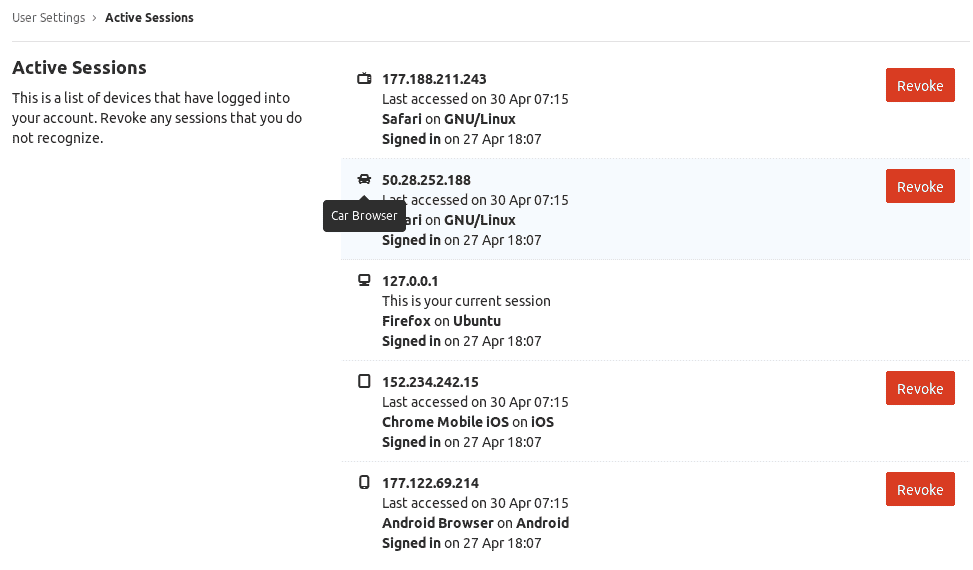

# Active sessions

> 原文：[https://docs.gitlab.com/ee/user/profile/active_sessions.html](https://docs.gitlab.com/ee/user/profile/active_sessions.html)

*   [Listing all active sessions](#listing-all-active-sessions)
*   [Active sessions limit](#active-sessions-limit)
*   [Revoking a session](#revoking-a-session)

# Active sessions

在 GitLab 10.8 中[引入](https://gitlab.com/gitlab-org/gitlab-foss/-/merge_requests/17867) .

GitLab 列出了已登录到您帐户的所有设备. 这使您可以查看会话，并撤销所有您不认识的会话.

## Listing all active sessions

1.  单击您的头像.
2.  Select **Settings**.
3.  点击边栏中的**活动会话** .

## Active sessions limit

在 GitLab 12.6 中[引入](https://gitlab.com/gitlab-org/gitlab/-/issues/31611) .

GitLab 允许用户一次拥有多达 100 个活动会话. 如果活动会话数超过 100，则最早的会话将被删除.

## Revoking a session

1.  使用前面的步骤导航到" **活动会话"** .
2.  单击除会话外的**撤消** . 当前会话无法撤消，因为这将使您退出 GitLab.