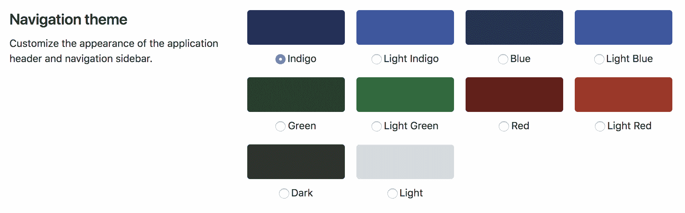
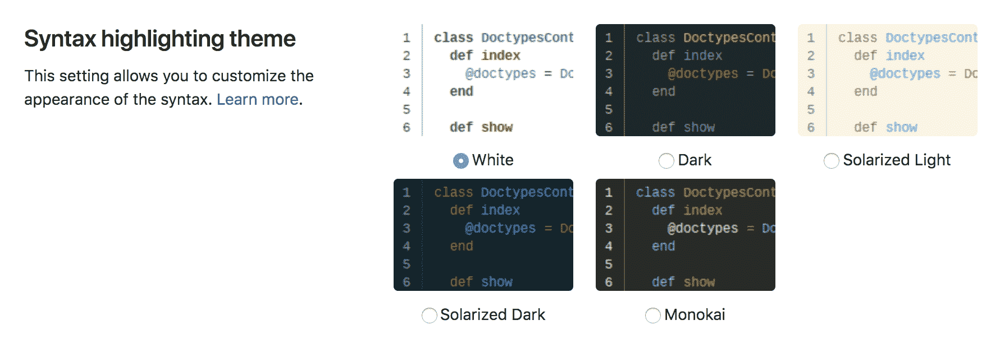

# Profile preferences

> 原文：[https://docs.gitlab.com/ee/user/profile/preferences.html](https://docs.gitlab.com/ee/user/profile/preferences.html)

*   [Navigation theme](#navigation-theme)
*   [Dark mode](#dark-mode)
*   [Syntax highlighting theme](#syntax-highlighting-theme)
*   [Behavior](#behavior)
    *   [Layout width](#layout-width)
    *   [Default dashboard](#default-dashboard)
    *   [Group overview content](#group-overview-content)
    *   [Project overview content](#project-overview-content)
    *   [Tab width](#tab-width)
*   [Localization](#localization)
    *   [Language](#language)
    *   [First day of the week](#first-day-of-the-week)
*   [Integrations](#integrations)
    *   [Sourcegraph](#sourcegraph)

# Profile preferences

用户的个人资料首选项页面允许用户自定义 GitLab 的各个方面.

要导航至个人资料的首选项，请执行以下操作：

1.  单击您的头像.
2.  Select **Settings**.
3.  单击边栏中的**首选项** .

## Navigation theme

GitLab 导航主题设置可让您个性化 GitLab 体验. 您可以从多个颜色主题中进行选择，这些主题可以为顶部导航和左侧导航添加独特的颜色. 使用单独的颜色主题可以帮助您区分不同的 GitLab 实例.

默认主题为 Indigo. 您可以选择 10 个主题：

*   Indigo
*   浅靛蓝
*   Blue
*   浅蓝
*   Green
*   浅绿色
*   Red
*   红灯
*   Dark
*   Light

## Dark mode

[介绍](https://gitlab.com/gitlab-org/gitlab/-/merge_requests/28252)在 GitLab 13.1 作为一个 alpha 版本.

manbetx 客户端打不开已经开始在黑暗模式下工作！ 深色[版本](https://about.gitlab.com/handbook/product/#alpha)的[Alpha 版本](https://about.gitlab.com/handbook/product/#alpha)本着迭代的精神和[Alpha 版本](https://about.gitlab.com/handbook/product/#alpha)的较低期望提供.

[黑暗主题史诗中](https://gitlab.com/groups/gitlab-org/-/epics/2902)追踪了黑暗模式的进展. 见史诗：

*   已知问题列表.
*   我们计划的方向和下一步.

如果发现未列出的问题，请在史诗上发表评论或创建新的问题.

出于 MVC 和兼容性原因，暗模式可用作导航主题. 将来，我们计划使其在自己的部分中可配置，同时支持[不同的导航主题](https://gitlab.com/gitlab-org/gitlab/-/issues/219512) .

**注意：**深色主题当前仅适用于"深色"语法突出显示.

## Syntax highlighting theme

**注意：** GitLab 使用[rouge Ruby 库](http://rouge.jneen.net/ "胭脂网站")在任何 Editor 上下文之外突出显示语法. WebIDE（如代码片段）使用[Monaco Editor](https://microsoft.github.io/monaco-editor/) ，并提供了[Monarch](https://microsoft.github.io/monaco-editor/monarch.html)库以突出显示语法. 有关支持的语言的列表，请访问相应库的文档.

更改此设置可让您在 GitLab 上查看语法突出显示的代码时自定义颜色主题.

默认语法主题为"白色"，您可以在 5 个不同的主题中进行选择：

*   White
*   Dark
*   日光灯
*   日光暗
*   Monokai

您在 13.0 中[引入](https://gitlab.com/groups/gitlab-org/-/epics/2389)的主题也适用于[Web IDE](../project/web_ide/index.html)的代码编辑器和[Snippets](../snippets.html) . 主题仅在 Web IDE 文件编辑器中可用， [深色主题](https://gitlab.com/gitlab-org/gitlab/-/issues/209808)和[日光化深色主题](https://gitlab.com/gitlab-org/gitlab/-/issues/219228)除外，它们适用于整个 Web IDE 屏幕.

## Behavior

以下设置可让您自定义 GitLab 布局的行为以及仪表板和项目登录页面的默认视图.

### Layout width

可以根据喜好将 GitLab 设置为使用不同的宽度. 在固定（最大`1280px` ）和流畅（ `100%` ）应用程序布局之间选择.

**注意：**虽然使用固定版式时`1280px`是标准最大宽度，但是某些页面仍根据内容使用 100％宽度.

### Default dashboard

对于有权访问大量项目但仅能跟上少数项目的用户，默认"仪表板"页面上的活动量可能会很大. 更改此设置可让您重新定义默认的仪表板.

您可以在此处使用 8 个选项作为默认仪表板视图：

*   您的项目（默认）
*   已加星标的项目
*   您的项目活动
*   已加星标项目的活动
*   您的团体
*   Your [Todos](../todos.html)
*   分配的问题
*   分配的合并请求
*   操作仪表板

### Group overview content

网上**论坛概述内容**下拉菜单允许您选择网上论坛首页上显示的信息.

您可以选择 2 个选项：

*   详细信息（默认）
*   [Security dashboard](../application_security/security_dashboard/index.html)

### Project overview content

项目概述内容设置允许您选择想要在项目主页上看到的内容.

您可以选择 3 个选项：

*   文件和自述文件（默认）
*   Readme
*   Activity

### Tab width

您可以在 GitLab 的各个部分设置标签字符的显示宽度，例如 blob，diff 和片段.

**注意：** GitLab 的某些部分不遵守此设置，包括 WebIDE，文件编辑器和 Markdown 编辑器.

## Localization

### Language

从支持的语言列表中选择首选语言.

*此功能是实验性的，翻译尚未完成.*

### First day of the week

可以针对日历视图和日期选择器自定义一周的第一天.

您可以选择以下选项之一作为一周的第一天：

*   Saturday
*   Sunday
*   Monday

如果选择**System Default** ，则将使用系统范围的默认设置.

## Integrations

使用第三方服务配置您的首选项，这些服务可增强您的 GitLab 体验.

### Sourcegraph

**注意：**仅当 GitLab 管理员已启用 Sourcegraph 时，此设置才可见.

管理由 Sourcegraph 支持的集成代码智能功能的可用性. 查看[Sourcegraph 功能文档](../../integration/sourcegraph.html#enable-sourcegraph-in-user-preferences)以获取更多信息.