# Threads

> 原文：[https://docs.gitlab.com/ee/user/discussions/](https://docs.gitlab.com/ee/user/discussions/)

*   [Resolvable comments and threads](#resolvable-comments-and-threads)
    *   [Commit threads in the context of a merge request](#commit-threads-in-the-context-of-a-merge-request)
    *   [Jumping between unresolved threads](#jumping-between-unresolved-threads)
    *   [Marking a comment or thread as resolved](#marking-a-comment-or-thread-as-resolved)
    *   [Move all unresolved threads in a merge request to an issue](#move-all-unresolved-threads-in-a-merge-request-to-an-issue)
    *   [Moving a single thread to a new issue](#moving-a-single-thread-to-a-new-issue)
    *   [Only allow merge requests to be merged if all threads are resolved](#only-allow-merge-requests-to-be-merged-if-all-threads-are-resolved)
    *   [Automatically resolve merge request diff threads when they become outdated](#automatically-resolve-merge-request-diff-threads-when-they-become-outdated)
*   [Commit threads](#commit-threads)
*   [Threaded discussions](#threaded-discussions)
*   [Image threads](#image-threads)
*   [Lock discussions](#lock-discussions)
*   [Merge Request Reviews](#merge-request-reviews)
    *   [Starting a review](#starting-a-review)
    *   [Resolving/Unresolving threads](#resolvingunresolving-threads)
    *   [Submitting a review](#submitting-a-review)
*   [Filtering notes](#filtering-notes)
*   [Suggest Changes](#suggest-changes)
    *   [Multi-line Suggestions](#multi-line-suggestions)
    *   [Code block nested in Suggestions](#code-block-nested-in-suggestions)
    *   [Configure the commit message for applied Suggestions](#configure-the-commit-message-for-applied-suggestions)
    *   [Batch Suggestions](#batch-suggestions)
        *   [Enable or disable Batch Suggestions](#enable-or-disable-batch-suggestions)
*   [Start a thread by replying to a standard comment](#start-a-thread-by-replying-to-a-standard-comment)
*   [Assign an issue to the commenting user](#assign-an-issue-to-the-commenting-user)

# Threads[](#threads "Permalink")

整个 GitLab 都提供了进行对话的能力.

您可以在以下位置发表评论：

*   Issues
*   Epics
*   合并要求
*   Snippets
*   Commits
*   提交差异

有标准注释，您还可以选择以线程形式创建注释. 收到回复后，评论也可以[变成主题](#start-a-thread-by-replying-to-a-standard-comment) .

评论区域支持[Markdown](../markdown.html)和[快速操作](../project/quick_actions.html) . 您可以随时编辑自己的评论，拥有" [维护者"访问级别](../permissions.html)或更高[权限的](../permissions.html)任何人也可以编辑其他人的评论.

如果为您的 GitLab 实例配置了" [通过电子邮件回复"，](../../administration/reply_by_email.html)您还可以回复评论通知电子邮件以回复评论. 回复标准评论会创建另一个标准评论. 回复主题注释会在主题中创建回复. 电子邮件回复支持[Markdown](../markdown.html)和[快速操作](../project/quick_actions.html) ，就像您从网络上回复一样.

**注意：**每个对象最多只能有 5,000 条注释，例如：issue，epic 和 merge request.

## Resolvable comments and threads[](#resolvable-comments-and-threads "Permalink")

版本历史

*   在 GitLab 8.11 中[引入](https://gitlab.com/gitlab-org/gitlab-foss/-/merge_requests/5022) .
*   可解决的线程只能添加到合并请求差异中.

线程解析有助于跟踪计划或代码审查期间的进度.

合并请求，提交，提交差异和摘要中的每个标准注释或线程最初都显示为未解决. 然后，至少具有开发人员访问项目权限的任何人或所检查的更改的作者都可以单独解决这些问题. 如果该线程已解决，并且非成员取消了他们自己的响应，则这也将取消解决讨论线程. 如果非成员然后解决了相同的答复，则将解决讨论线程.

解决所有标准注释或线程的需求可以防止您忘记处理反馈，并可以隐藏不再相关的线程.

[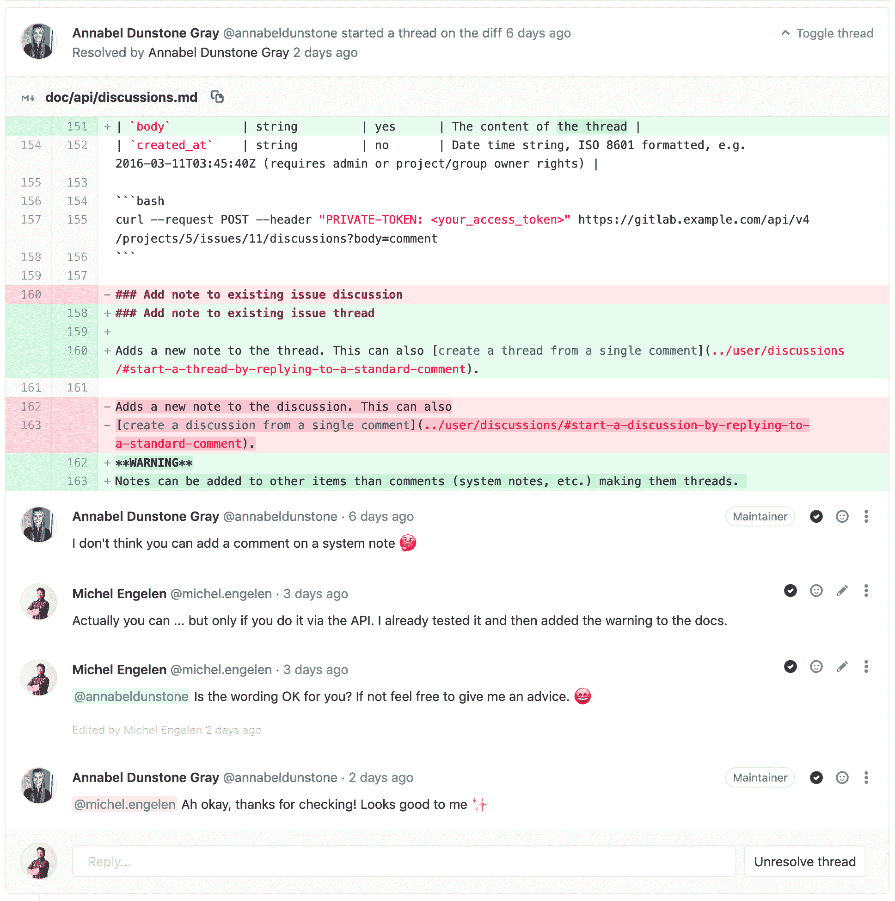](img/thread_view.png)

### Commit threads in the context of a merge request[](#commit-threads-in-the-context-of-a-merge-request "Permalink")

在 GitLab 10.3 中[引入](https://gitlab.com/gitlab-org/gitlab-foss/-/issues/31847) .

对于具有基于提交的工作流的审阅者，在合并请求的上下文中将线程添加到特定的提交差异可能很有用. 在以下情况下，这些线程将通过更改提交 ID 保持不变：

*   重新设置后强制推动
*   修改提交

创建提交差异线程：

1.  导航到合并请求的" **提交"**选项卡. 将显示构成合并请求的提交列表.

    [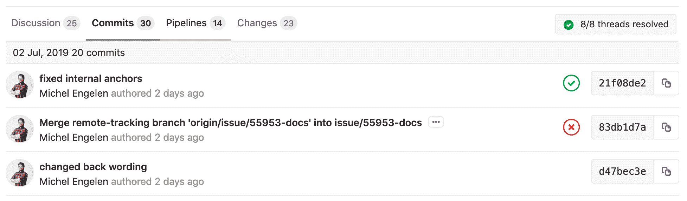](img/merge_request_commits_tab.png)

2.  导航到特定的提交，单击" **更改"**选项卡（在该选项卡中，将仅显示与所选提交不同的内容），并留下评论.

    [](img/commit_comment_mr_context.png)

3.  以这种方式创建的任何线程都将显示在合并请求的" **讨论"**选项卡中，并且可以解决.

    [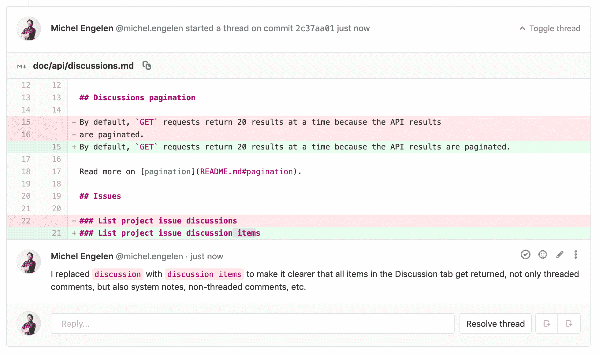](img/commit_comment_mr_discussions_tab.png)

以这种方式创建的线程将仅出现在原始合并请求中，而不是导航到项目的" **存储库">"提交"**页面下的**提交时** .

**提示：**在合并请求内的线程中找到提交引用的链接时，它将在当前合并请求的上下文中自动转换为链接.

### Jumping between unresolved threads[](#jumping-between-unresolved-threads "Permalink")

当合并请求中包含大量注释时，可能很难跟踪仍未解决的问题. 您可以使用线程上"回复"字段旁边的"跳转"按钮在未解决的线程之间跳转.

您也可以从已解决的线程跟踪器旁边的按钮跳转到下一个未解决的线程.

您还可以使用键盘快捷键在线程之间导航：

*   使用`n`跳到下一个未解决的线程.
*   使用`p`跳到上一个未解决的线程.

[](img/threads_resolved.png)

### Marking a comment or thread as resolved[](#marking-a-comment-or-thread-as-resolved "Permalink")

您可以通过单击**线程**底部的" **解决线程"**按钮将其标记为已解决.

[](img/resolve_thread_button.png)

或者，您可以将每个评论标记为单独解决.

[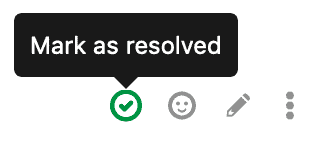](img/resolve_comment_button.png)

### Move all unresolved threads in a merge request to an issue[](#move-all-unresolved-threads-in-a-merge-request-to-an-issue "Permalink")

在 GitLab 9.1 中[引入](https://gitlab.com/gitlab-org/gitlab-foss/-/merge_requests/8266)

要在新问题中继续执行来自合并请求的所有打开的线程，请单击" **解决新问题中的所有线程"**按钮.

[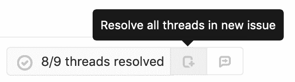](img/btn_new_issue_for_all_threads.png)

或者，当您的项目仅[在解决所有线程](#only-allow-merge-requests-to-be-merged-if-all-threads-are-resolved)后才接受合并请求[时](#only-allow-merge-requests-to-be-merged-if-all-threads-are-resolved) ，将存在**一个问题，即以后**在合并请求小部件中**解决它们的**链接.

[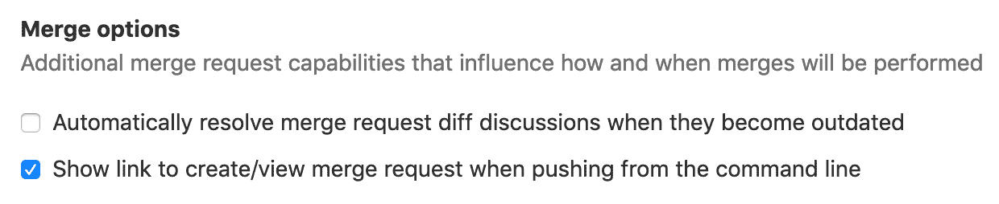](img/resolve_thread_open_issue.png)

这将准备一个问题，其内容涉及合并请求和未解决的线程.

[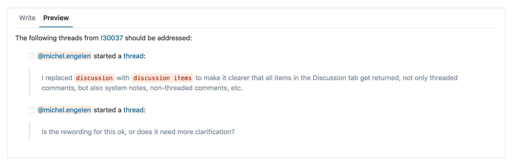](img/preview_issue_for_threads.png)

击中" **提交"问题**将导致所有线程被标记为已解决，并添加注释以引用新创建的问题.

[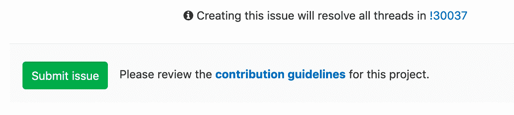](img/resolve_thread_issue_notice.png)

现在，您可以继续从 UI 合并合并请求.

### Moving a single thread to a new issue[](#moving-a-single-thread-to-a-new-issue "Permalink")

在 GitLab 9.1 中[引入](https://gitlab.com/gitlab-org/gitlab-foss/-/merge_requests/8266)

要为单个线程创建新问题，可以使用" **在新问题中解决此线程"**按钮.

[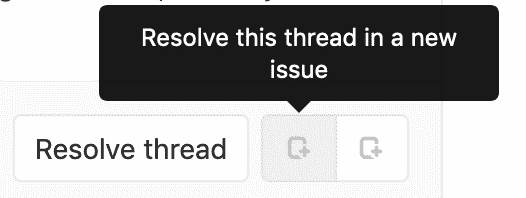](img/new_issue_for_thread.png)

这会将您定向到预填充了线程内容的新问题，类似于为一次委派多个线程而创建的问题. 保存问题将把该线程标记为已解决，并在合并请求线程中添加引用新问题的注释.

[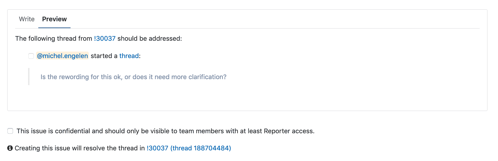](img/preview_issue_for_thread.png)

### Only allow merge requests to be merged if all threads are resolved[](#only-allow-merge-requests-to-be-merged-if-all-threads-are-resolved "Permalink")

在 GitLab 8.14 中[引入](https://gitlab.com/gitlab-org/gitlab-foss/-/merge_requests/7125) .

在解决所有线程之前，可以阻止合并请求.

导航到项目的设置页面，选中" **仅在解决所有线程后才允许合并请求"**复选框，然后单击" **保存"**以使更改生效.

[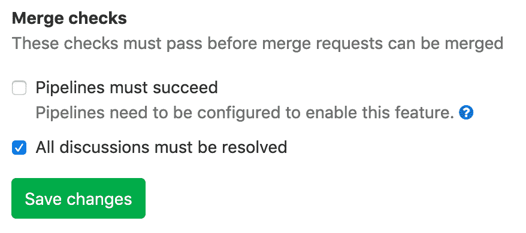](img/only_allow_merge_if_all_threads_are_resolved.png)

从现在开始，直到所有线程解决后，您才能从 UI 进行合并.

[](img/resolve_thread_open_issue.png)

### Automatically resolve merge request diff threads when they become outdated[](#automatically-resolve-merge-request-diff-threads-when-they-become-outdated "Permalink")

在 GitLab 10.0 中[引入](https://gitlab.com/gitlab-org/gitlab-foss/-/merge_requests/14053) .

您可以在使用新的推送修改的行上自动解决合并请求差异线程.

导航到您的项目的设置页面，选中" **使用推送更改的行上**的**自动解析合并请求差异线程"**复选框，然后单击" **保存"**以使更改生效.

[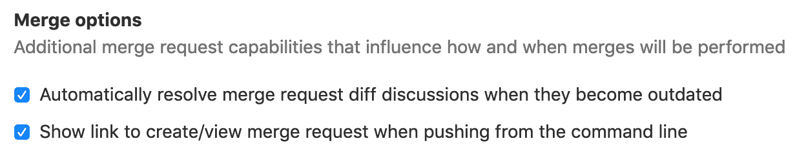](img/automatically_resolve_outdated_discussions.png)

从现在开始，如果推送使 diff 部分过时，默认情况下将解决 diff 上的所有线程. 不变的线上线程和顶级可解析线程不会自动解析.

## Commit threads[](#commit-threads "Permalink")

您可以在项目的**Repository> Commits**下向特定提交添加注释和线程.

**注意：**如果在强制推送后更改了提交 ID，则以这种方式创建的线程将丢失.

## Threaded discussions[](#threaded-discussions "Permalink")

在 GitLab 9.1 中[引入](https://gitlab.com/gitlab-org/gitlab-foss/-/merge_requests/7527) .

尽管可解析线程仅可用于合并请求差异，但也可以添加没有差异的线程. 您可以针对问题，提交，摘要和合并请求启动一个看起来像线程的特定线程.

要开始主题讨论，请单击" **评论"**按钮切换下拉列表，选择" **开始主题"，**并在准备发布评论时单击" **开始主题** ".

[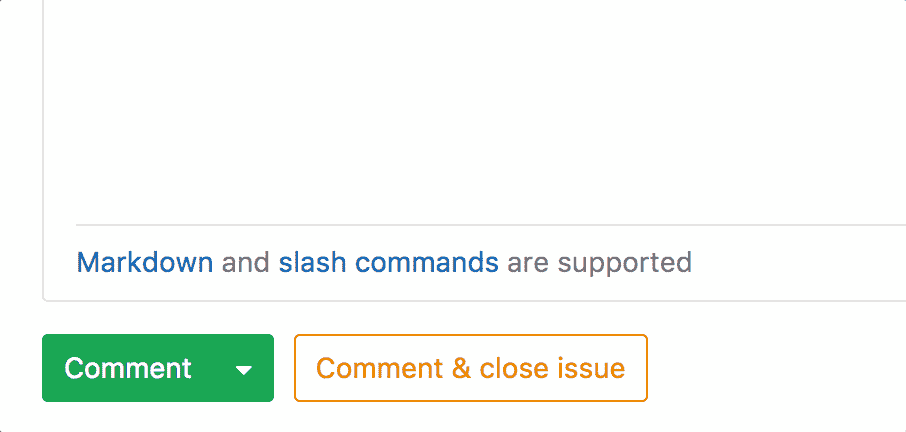](img/comment_type_toggle.gif)

这将以单个线程发布评论，使您可以更详细地讨论特定评论.

[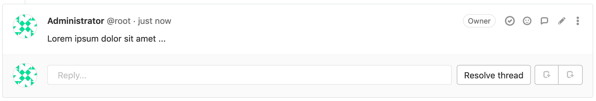](img/discussion_comment.png)

## Image threads[](#image-threads "Permalink")

在 GitLab 10.1 中[引入](https://gitlab.com/gitlab-org/gitlab-foss/-/merge_requests/14061) .

有时线程围绕图像旋转. 使用图像线程，您可以轻松地定位图像的特定坐标并在其周围启动线程. 图像线程在合并请求和提交详细信息视图中可用.

要启动图像线程，请将鼠标悬停在图像上. 您的鼠标指针应转换为图标，表示该图像可用于注释. 只需单击图像上的任意位置以创建新线程.

[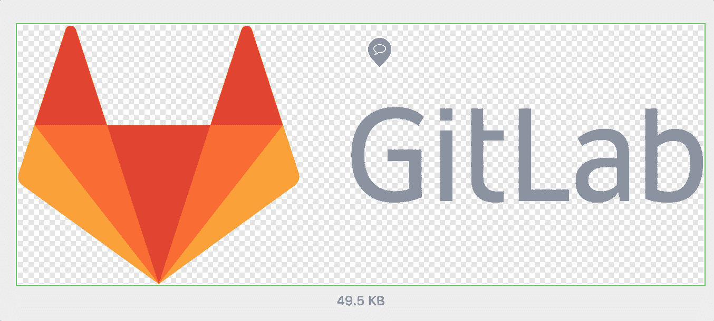](img/start_image_discussion.gif)

单击图像后，将显示注释表单，该注释表单将成为您线程的开始. 保存评论后，您会在图像顶部看到一个新的徽章. 此徽章代表您的话题.

> **注意：**该线程标志通常与一个数字关联，该数字仅用作每个线程的可视参考. 在合并请求线程选项卡中，此标记将带有注释图标，因为每个线程都会呈现一个新的图像部分.

图像线程还可以在替换现有图像的差异上工作. 在此差异查看模式下，您可以切换不同的查看模式，但仍可以看到线点标记.

| 2-up | Swipe | 洋葱皮 |
| --- | --- | --- |
| [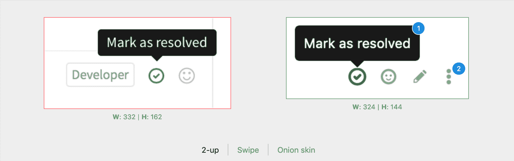](img/two_up_view.png) | [](img/swipe_view.png) | [](img/onion_skin_view.png) |

映像线程也可与可解析线程一起很好地工作. 差异上的已解析线程（不在"合并请求讨论"选项卡上）在页面加载时将显示为折叠状态，并且将具有对应的标记计数器以匹配图像上的计数器.

[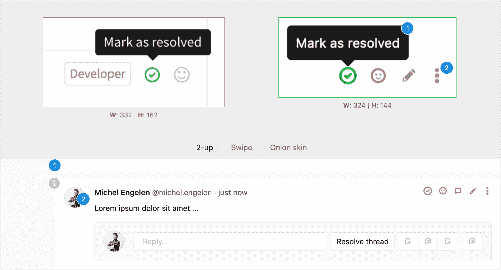](img/image_resolved_discussion.png)

## Lock discussions[](#lock-discussions "Permalink")

在 GitLab 10.1 中[引入](https://gitlab.com/gitlab-org/gitlab-foss/-/merge_requests/14531) .

For large projects with many contributors, it may be useful to stop threads in issues or merge requests in these scenarios:

*   项目维护者已经解决了该线程，对于继续反馈没有帮助.
*   项目维护者已经将新对话指向新问题或合并请求.
*   参与线程的人正在拖钓，辱骂或没有生产力.

在这些情况下，项目中具有开发者权限或更高权限的用户可以使用边栏中的"锁定"部分来锁定（和解锁）问题或合并请求. 对于问题，具有记者权限的用户可以锁定（和解锁）.

| Unlock | Lock |
| --- | --- |
| [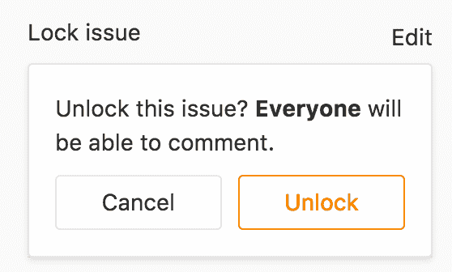](img/turn_off_lock.png) | [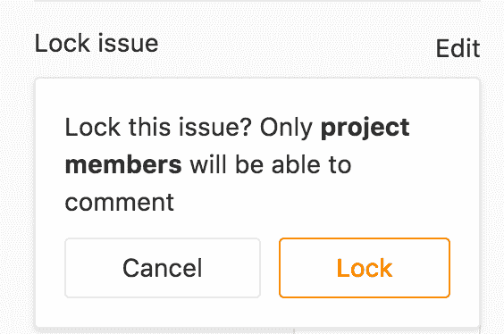](img/turn_on_lock.png) |

系统注释指示锁定和解锁.

[](img/discussion_lock_system_notes.png)

在锁定的问题或合并请求中，只有团队成员才能添加新评论和编辑现有评论. 禁止非团队成员添加或编辑评论.

| 队员 | 非团队成员 |
| --- | --- |
| [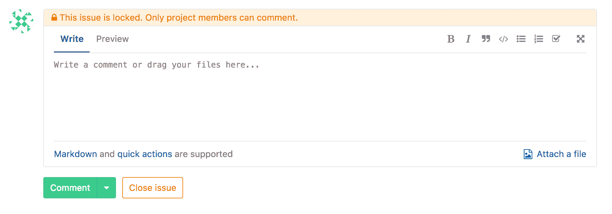](img/lock_form_member.png) | [](img/lock_form_non_member.png) |

此外，无法重新打开锁定的问题和合并请求.

## Merge Request Reviews[](#merge-request-reviews "Permalink")

版本历史

*   在[GitLab Premium](https://about.gitlab.com/pricing/) 11.4 中[引入](https://gitlab.com/gitlab-org/gitlab/-/merge_requests/4213) .
*   在 13.1 版中[移至](https://gitlab.com/gitlab-org/gitlab/-/issues/28154) GitLab Core.

查看"合并请求"差异时，您可以开始审阅. 这样，您便可以在"合并请求"中创建**仅**在发布之前才对**您可见的**注释，以便您可以将所有注释作为单个操作提交.

### Starting a review[](#starting-a-review "Permalink")

为了开始审阅，只需像往常一样在 MR 的" **更改"**选项卡下对差异添加注释，然后单击" **开始审阅"**按钮.

[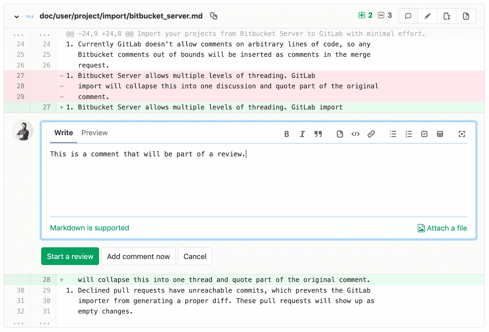](img/mr_review_start.png)

Once a review is started, you will see any comments that are part of this review marked `Pending`. All comments that are part of a review show two buttons:

*   **完成审阅** ：提交**审阅中的**所有评论，使其他用户可以看到它们.
*   **立即添加评论** ：提交特定评论作为常规评论，而不是审阅的一部分.

[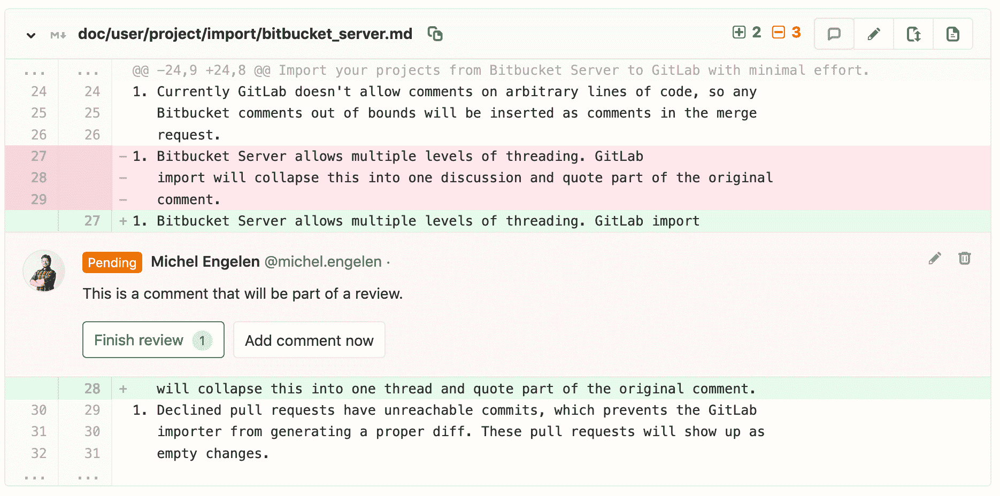](img/pending_review_comment.png)

您可以在评论中使用[快速操作](../project/quick_actions.html) . 注释将显示发布后将执行的操作.

[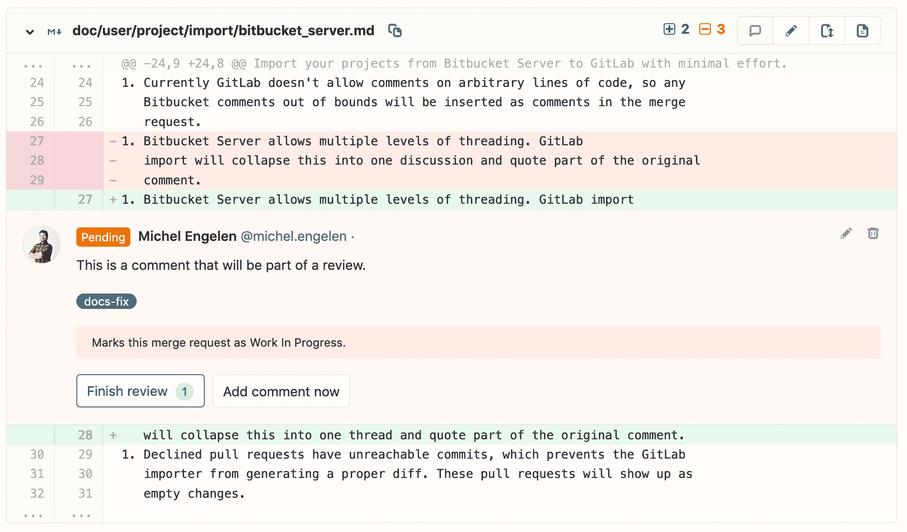](img/review_comment_quickactions.png)

要向评论添加更多评论，请照常开始写评论，然后单击**添加到评论**按钮.

[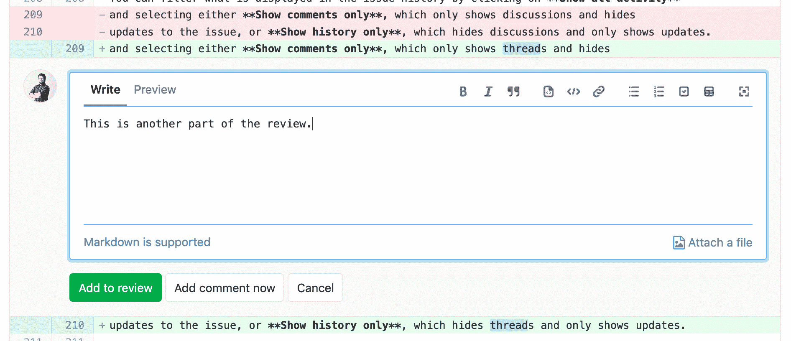](img/mr_review_second_comment.png)

这会将评论添加到评论中.

[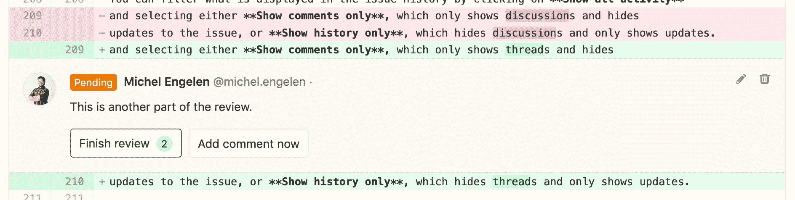](img/mr_review_second_comment_added.png)

### Resolving/Unresolving threads[](#resolvingunresolving-threads "Permalink")

评论注释也可以解决/无法解决[可解决的线程](#resolvable-comments-and-threads) . 回复评论时，您将看到一个复选框，您可以单击该复选框以在发布后解决或取消解决线程.

[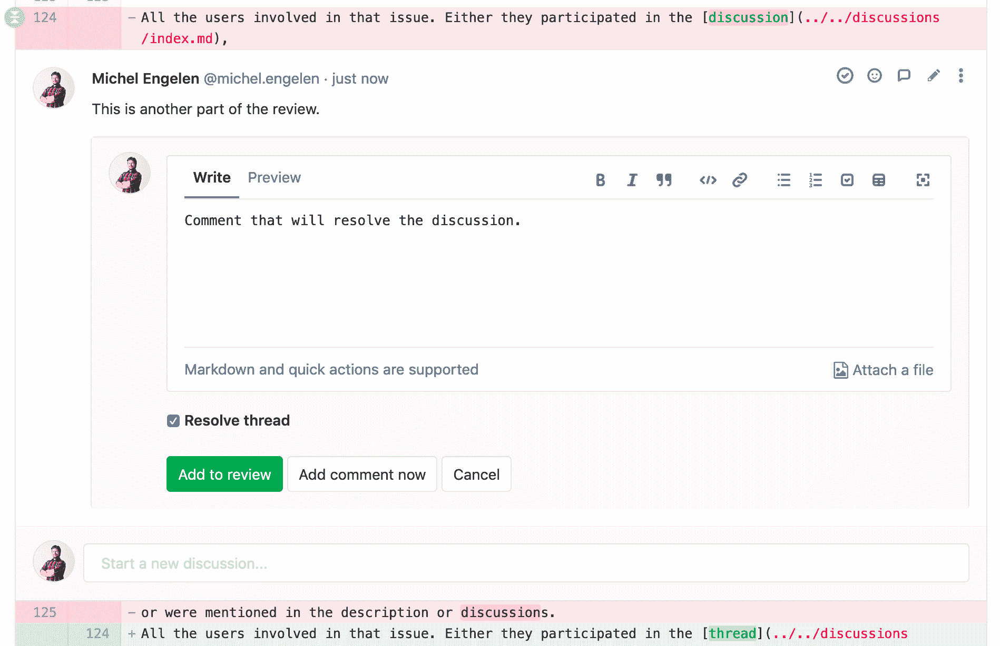](img/mr_review_resolve.png)

如果特定的待处理注释将解决或取消解决该线程，它将显示在待处理注释本身上.

[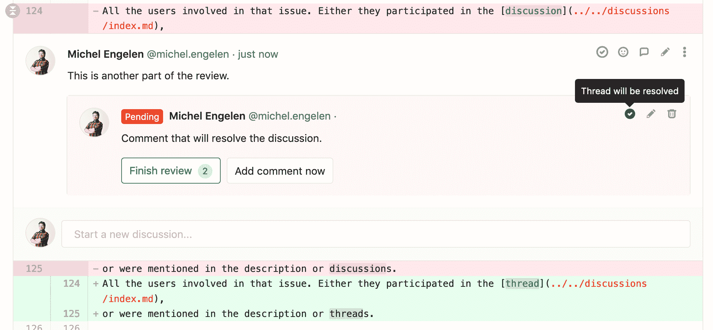](img/mr_review_resolve2.png)

[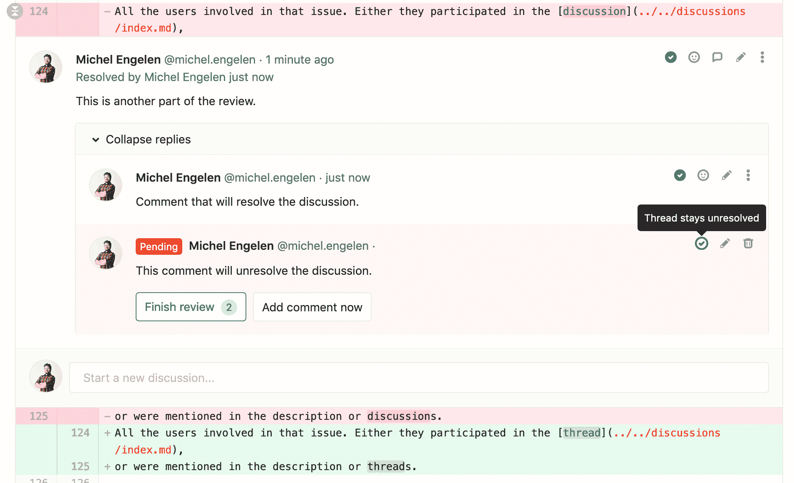](img/mr_review_unresolve.png)

### Submitting a review[](#submitting-a-review "Permalink")

If you have any comments that have not been submitted, you will see a bar at the bottom of the screen with two buttons:

*   **舍弃** ： **舍弃**所有尚未提交的评论.
*   **完成审阅** ：打开准备提交审阅的评论列表. 单击**提交评论**将发布所有评论. 此时将执行所有提交的快速操作.

另外，要通过待审核的评论完成整个审核，请执行以下操作：

*   单击**评论**上的" **完成审阅"**按钮.
*   在非评论注释的文本中使用`/submit_review` [快速操作](../project/quick_actions.html) .

[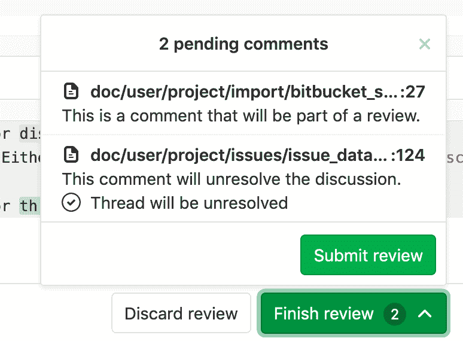](img/review_preview.png)

提交审阅将向合并请求的每个应通知用户发送一封电子邮件，其中包含与之相关的所有注释.

因此，回复此电子邮件将在关联的合并请求上创建一个新注释.

## Filtering notes[](#filtering-notes "Permalink")

在 GitLab 11.5 中[引入](https://gitlab.com/gitlab-org/gitlab-foss/-/issues/26723) .

对于活动注释和用户注释等具有许多注释的问题，有时很难找到有用的信息. 有一种方法可以针对合并请求和问题从单个注释和线程中过滤注释.

从合并请求的" **讨论"**选项卡，或史诗/问题概述中，找到页面右侧的过滤器下拉菜单，您可以从中选择以下选项之一：

*   **显示所有活动** ：显示所有用户评论和系统注释（问题更新，对其他问题的提及，对描述的更改等）.
*   **仅显示评论** ：仅在列表中显示用户评论.
*   **仅显示历史记录** ：仅显示活动记录.

[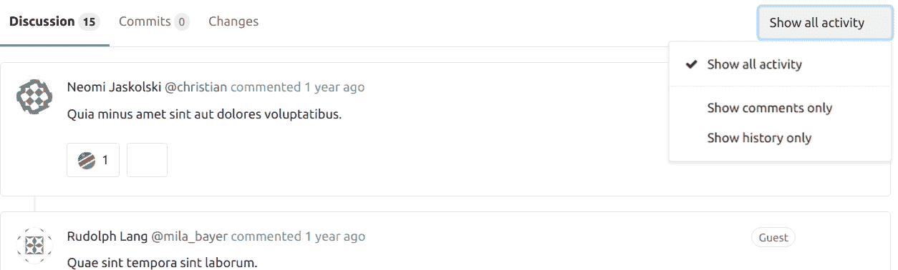](img/index_notes_filters.png)

在给定问题或 MR 中选择过滤器之一后，GitLab 将保存您的首选项，这样当您从已登录的任何设备再次访问同一页面时，该首选项将保持不变.

## Suggest Changes[](#suggest-changes "Permalink")

在 GitLab 11.6 中[引入](https://gitlab.com/gitlab-org/gitlab-foss/-/issues/18008) .

作为审阅者，您可以在 Merge Request Diff 线程中使用简单的 Markdown 语法建议代码更改. 然后，合并请求作者（或具有适当[权限的](../permissions.html)其他用户）能够通过单击来应用这些建议，这将在应用了这些建议的用户创作的合并请求中生成提交.

1.  选择要更改的代码行，添加新注释，然后单击工具栏中的" **插入建议"**图标：

    [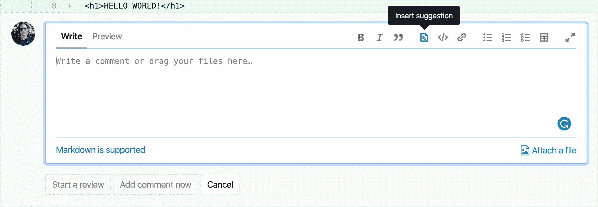](img/suggestion_button_v12_7.png)

2.  在注释中，将您的建议添加到预填充的代码块中：

    [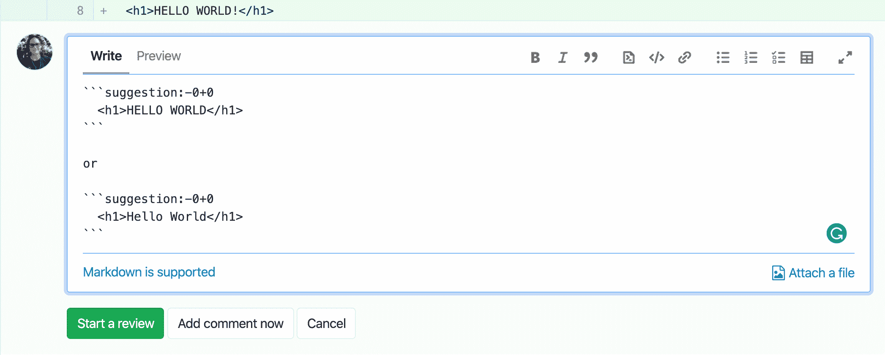](img/make_suggestion_v12_7.png)

3.  单击**开始审查**或**加入审查** ，以您的评论添加到[审查](#merge-request-reviews) ，或者**现在添加注释** ，注释立即加入到线程.

    注释中的"建议"可由合并请求作者直接从合并请求中应用：

    [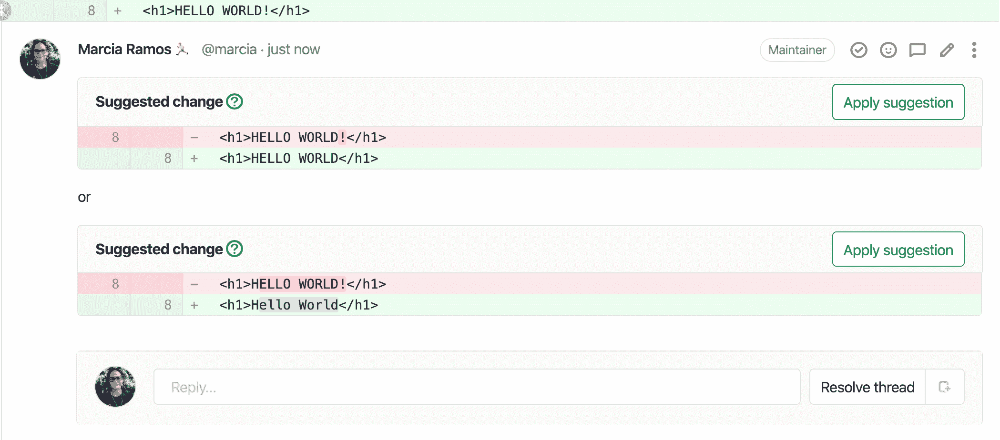](img/apply_suggestion_v12_7.png)

一旦作者应用了一个建议，它将被标记为"已**应用"**标签，该线程将被自动解析，并且 GitLab 将创建一个新的提交，并将建议的更改直接推送到合并请求分支中的代码库中. 这样做需要[开发人员许可](../permissions.html) .

### Multi-line Suggestions[](#multi-line-suggestions "Permalink")

在 GitLab 11.10 中[引入](https://gitlab.com/gitlab-org/gitlab-foss/-/issues/53310) .

审阅者还可以通过调整范围偏移，在合并请求差异线程中使用单个"建议"来建议对多行进行更改. 偏移量相对于 diff 线程的位置，并指定应用建议时要被建议替换的范围.

[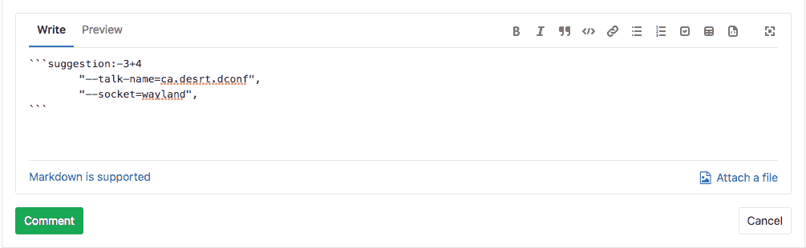](img/multi-line-suggestion-syntax.png)

在上面的示例中，建议涵盖了注释行上方的三行和注释行下方的四行. 应用时，它将用建议的更改从注释行*上方的* 3 行替换为注释行*下方*的 4 行.

[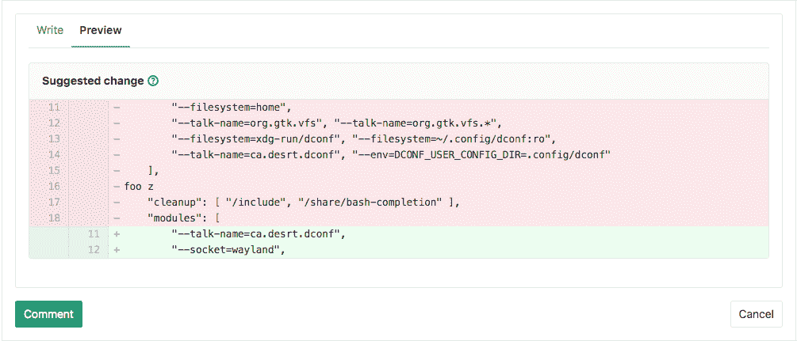](img/multi-line-suggestion-preview.png)

**注意：**涵盖多行的建议仅限于已注释差异行*上方的* 100 行和*下方*的差异行*下方*的 100 行，每个建议最多可更改 200 行.

### Code block nested in Suggestions[](#code-block-nested-in-suggestions "Permalink")

如果您需要提出涉及[受限制的代码块](../markdown.html#code-spans-and-blocks)的建议，请将您的建议换成四个反引号，而不是通常的三个.

[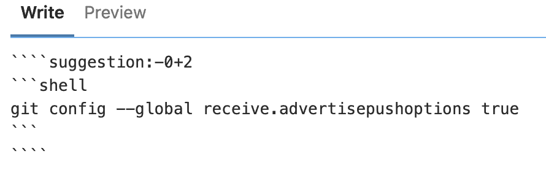](img/suggestion_code_block_editor_v12_8.png)

[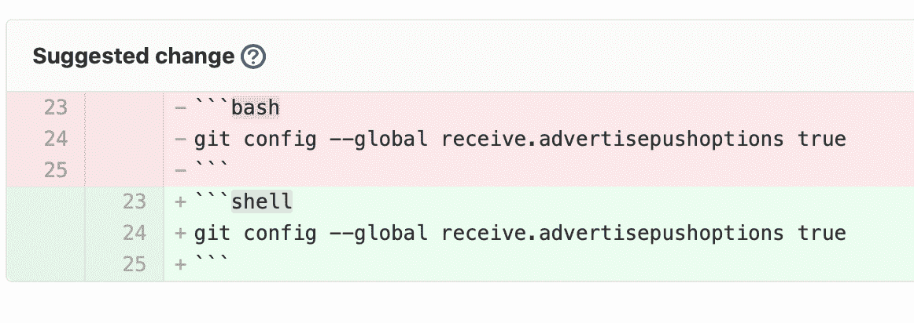](img/suggestion_code_block_output_v12_8.png)

### Configure the commit message for applied Suggestions[](#configure-the-commit-message-for-applied-suggestions "Permalink")

在 GitLab 12.7 中[引入](https://gitlab.com/gitlab-org/gitlab/-/issues/13086) .

GitLab 在应用建议时使用默认的提交消息： `Apply %{suggestions_count} suggestion(s) to %{files_count} file(s)`

例如，假设用户将 3 条建议应用于 2 个不同的文件，则默认的提交消息将是： **将 3 条建议应用于 2 个文件**

可以自定义这些提交消息，以遵循您可能拥有的任何准则. 为此， **请**在项目的" **常规"**设置中展开" **合并请求"**选项卡，然后更改" **合并建议"**文本：

[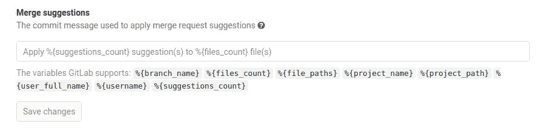](img/suggestions_custom_commit_messages_v13_1.jpg)

除了静态文本，您还可以使用以下变量：

| Variable | Description | 输出示例 |
| --- | --- | --- |
| `%{branch_name}` | 建议所应用到的分支的名称. | `my-feature-branch` |
| `%{files_count}` | 应用了建议的文件数. | **2** |
| `%{file_paths}` | 应用了建议文件的路径. 路径用逗号分隔. | `docs/index.md, docs/about.md` |
| `%{project_path}` | 项目路径. | `my-group/my-project` |
| `%{project_name}` | 项目的可读名称. | **我的项目** |
| `%{suggestions_count}` | 应用的建议数. | **3** |
| `%{username}` | 应用建议的用户的用户名. | `user_1` |
| `%{user_full_name}` | 应用建议的用户的全名. | **用户 1** |

例如，要自定义提交消息以输出**Addresses user_1 的评论** ，请将自定义文本设置为`Addresses %{username}'s review` .

**注意：** [＃25381](https://gitlab.com/gitlab-org/gitlab/-/issues/25381)将为每个应用的建议（以及批量建议）引入自定义提交消息.

### Batch Suggestions[](#batch-suggestions "Permalink")

版本历史

*   在 GitLab 13.1 中作为[Alpha 功能](https://about.gitlab.com/handbook/product/#alpha) [引入](https://gitlab.com/gitlab-org/gitlab/-/issues/25486) .
*   它部署在功能标记后面，默认情况下处于禁用状态.
*   在 GitLab.com 上已禁用.
*   要在 GitLab 自管实例中使用它，请让 GitLab 管理员[启用它](#enable-or-disable-batch-suggestions) .

您可以一次应用多个建议，以减少为满足审阅者的请求而添加到分支的提交数量.

1.  要启动将在一次提交中应用的一批建议，请单击" **将建议添加到批处理"** ：

    [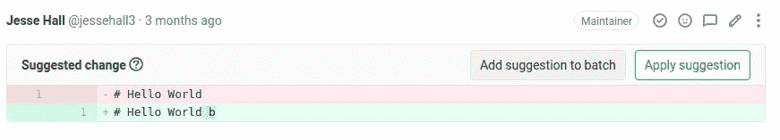](img/add_first_suggestion_to_batch_v13_1.jpg)

2.  根据需要向批处理中添加尽可能多的其他建议：

    [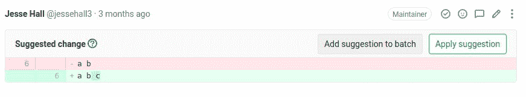](img/add_another_suggestion_to_batch_v13_1.jpg)

3.  要删除建议，请单击" **从批处理中删除"** ：

    [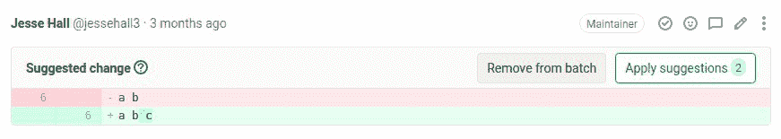](img/remove_suggestion_from_batch_v13_1.jpg)

4.  将所有建议添加到您的喜好中后，准备好后，请点击**应用建议** ：

    [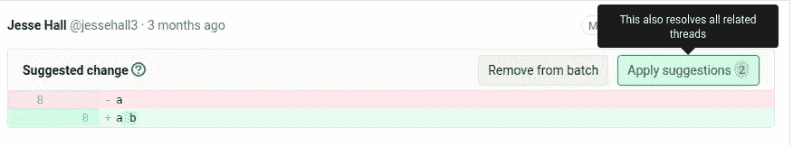](img/apply_batch_of_suggestions_v13_1.jpg)

#### Enable or disable Batch Suggestions[](#enable-or-disable-batch-suggestions "Permalink")

批处理建议部署在**默认情况下禁用**的功能标志的后面. [有权访问 GitLab Rails 控制台的 GitLab 管理员](../../administration/feature_flags.html)可以为您的实例启用它.

要启用它：

```
# Instance-wide
Feature.enable(:batch_suggestions) 
```

禁用它：

```
# Instance-wide
Feature.disable(:batch_suggestions) 
```

## Start a thread by replying to a standard comment[](#start-a-thread-by-replying-to-a-standard-comment "Permalink")

在 GitLab 11.9 中[引入](https://gitlab.com/gitlab-org/gitlab-foss/-/issues/30299)

要回复标准（非线程）评论，可以使用" **回复评论"**按钮.

[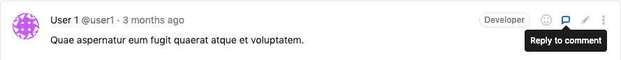](img/reply_to_comment_button.png)

仅当您有权回复现有主题或从标准评论启动主题时，才会显示" **回复评论"**按钮.

单击" **回复评论"**按钮将使回复区域成为焦点，您可以键入回复.

[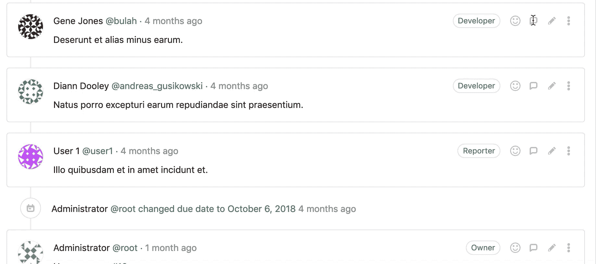](img/reply_to_comment.gif)

提交回复后，回复非线程注释将把非线程注释转换为线程. 该转换被认为是对原始评论的修改，因此在其下方会出现一条有关上次编辑时间的注释.

此功能仅适用于"问题"，"合并请求"和"事件". 尚不支持提交，摘要和合并请求差异线程.

## Assign an issue to the commenting user[](#assign-an-issue-to-the-commenting-user "Permalink")

在 GitLab 13.1 中[引入](https://gitlab.com/gitlab-org/gitlab/-/issues/191455) .

您可以将问题分配给发表评论的用户.

在评论中，单击" **更多操作"**菜单，然后单击" **分配给评论用户"** .

再次单击按钮以取消分配评论者.

[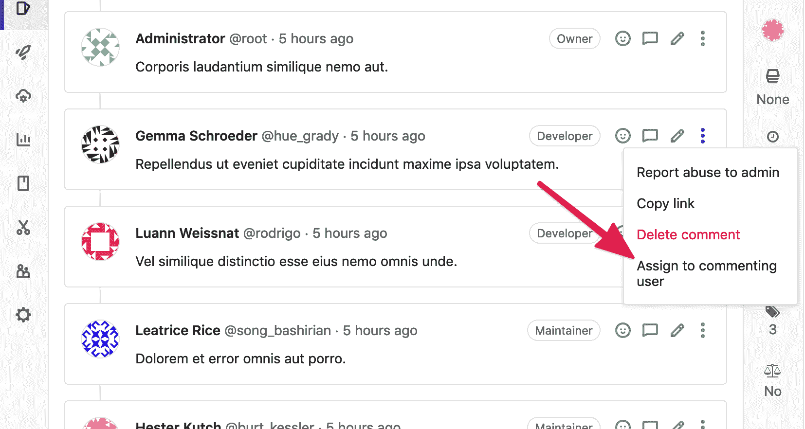](img/quickly_assign_commenter_v13_1.png)