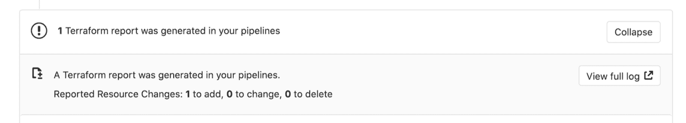
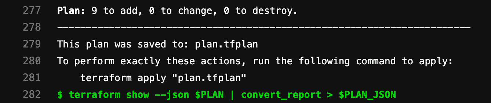

# Infrastructure as code with Terraform and GitLab

> 原文：[https://docs.gitlab.com/ee/user/infrastructure/index.html](https://docs.gitlab.com/ee/user/infrastructure/index.html)

*   [Motivation](#motivation)
*   [GitLab managed Terraform State](#gitlab-managed-terraform-state)
*   [Permissions for using Terraform](#permissions-for-using-terraform)
*   [Get started using local development](#get-started-using-local-development)
*   [Get started using GitLab CI](#get-started-using-gitlab-ci)
*   [Configure the backend](#configure-the-backend)
*   [Example project](#example-project)
*   [Output Terraform Plan information into a merge request](#output-terraform-plan-information-into-a-merge-request)
    *   [Example `.gitlab-ci.yaml` file](#example-gitlab-ciyaml-file)
    *   [Multiple Terraform Plan reports](#multiple-terraform-plan-reports)

# Infrastructure as code with Terraform and GitLab[](#infrastructure-as-code-with-terraform-and-gitlab "Permalink")

## Motivation[](#motivation "Permalink")

GitLab 中的 Terraform 集成功能使您的 GitOps /基础设施即代码（IaC）工作流能够与 GitLab 的身份验证和授权结合在一起. 这些功能着重于降低团队采用 Terraform，在 GitLab 中有效协作以及支持 Terraform 最佳实践的准入门槛.

## GitLab managed Terraform State[](#gitlab-managed-terraform-state "Permalink")

在 GitLab 13.0 中[引入](https://gitlab.com/groups/gitlab-org/-/epics/2673) .

[Terraform 远程后端](https://www.terraform.io/docs/backends/index.html)使您可以将状态文件存储在远程共享存储中. GitLab 使用[Terraform HTTP 后端](https://www.terraform.io/docs/backends/types/http.html)将状态文件安全地存储在本地存储（默认）或[您选择的远程存储中](../../administration/terraform_state.html) .

由 GitLab 管理的 Terraform 状态后端可以轻松安全地存储 Terraform 状态，并使您免于设置其他远程资源（如 Amazon S3 或 Google Cloud Storage）. 其功能包括：

*   在传输和静止时都支持状态文件的加密.
*   锁定和解锁状态.
*   远程 Terraform 计划并执行.

要开始使用 GitLab 管理的 Terraform State，有两种不同的选择：

*   [Use a local machine](#get-started-using-local-development).
*   [Use GitLab CI](#get-started-using-gitlab-ci).

## Permissions for using Terraform[](#permissions-for-using-terraform "Permalink")

在 GitLab 版本 13.1 中，需要[维护者访问权限](../permissions.html)才能使用 GitLab 管理的 Terraform 状态后端. 在 GitLab 版本 13.2 和更高版本中，需要[维护者访问权限](../permissions.html)才能锁定，解锁和写入状态（使用`terraform apply` ），而需要[开发人员访问权限](../permissions.html)来读取状态（使用`terraform plan -lock=false` ）.

## Get started using local development[](#get-started-using-local-development "Permalink")

如果您计划仅运行`terraform plan`并从本地计算机上执行`terraform plan` `terraform apply`命令，这是一种入门的简单方法：

1.  在您的 GitLab 实例上创建项目.
2.  导航 **设置>常规，**并记下您的**项目名称**和**项目 ID** .
3.  Define the Terraform backend in your Terraform project to be:

    ```
    terraform {
      backend "http" {
      }
    } 
    ```

4.  使用`api`范围创建一个[个人访问令牌](../profile/personal_access_tokens.html) .

5.  在本地计算机上，运行`terraform init` ，传入以下选项，并用相关值替换`<YOUR-PROJECT-NAME>` ， `<YOUR-PROJECT-ID>` ， `<YOUR-USERNAME>`和`<YOUR-ACCESS-TOKEN>` . 此命令将初始化 Terraform 状态，并将该状态存储在 GitLab 项目中. 这个例子使用`gitlab.com` ：

    ```
    terraform init \
        -backend-config="address=https://gitlab.com/api/v4/projects/<YOUR-PROJECT-ID>/terraform/state/<YOUR-PROJECT-NAME>" \
        -backend-config="lock_address=https://gitlab.com/api/v4/projects/<YOUR-PROJECT-ID>/terraform/state/<YOUR-PROJECT-NAME>/lock" \
        -backend-config="unlock_address=https://gitlab.com/api/v4/projects/<YOUR-PROJECT-ID>/terraform/state/<YOUR-PROJECT-NAME>/lock" \
        -backend-config="username=<YOUR-USERNAME>" \
        -backend-config="password=<YOUR-ACCESS-TOKEN>" \
        -backend-config="lock_method=POST" \
        -backend-config="unlock_method=DELETE" \
        -backend-config="retry_wait_min=5" 
    ```

Next, [configure the backend](#configure-the-backend).

## Get started using GitLab CI[](#get-started-using-gitlab-ci "Permalink")

如果您不想开始本地开发，也可以使用 GitLab CI 来运行`terraform plan`和`terraform apply`命令.

Next, [configure the backend](#configure-the-backend).

## Configure the backend[](#configure-the-backend "Permalink")

执行`terraform init`命令后，必须配置 Terraform 后端和 CI YAML 文件：

1.  在 Terraform 项目中，通过在`.tf`文件（例如`backend.tf` ）中添加以下代码块来定义远程后端，以定义[HTTP](https://www.terraform.io/docs/backends/types/http.html)后端：

    ```
    terraform {
      backend "http" {
      }
    } 
    ```

2.  在项目存储库的根目录中，配置`.gitlab-ci.yaml`文件. 本示例使用一个包含`gitlab-terraform`帮助器的预构建图像. 有关受支持的 Terraform 版本，请参见[GitLab Terraform Images 项目](https://gitlab.com/gitlab-org/terraform-images) .

    ```
    image: registry.gitlab.com/gitlab-org/terraform-images/stable:latest 
    ```

3.  在`.gitlab-ci.yaml`文件中，定义一些环境变量以简化开发. 在此示例中， `TF_ROOT`是必须执行 Terraform 命令的目录， `TF_ADDRESS`是该管道在其上运行的 GitLab 实例上的状态的 URL，并且`TF_ADDRESS`的最后路径段是 Terraform 状态的名称. 项目可能具有多个状态，并且该名称是任意的，因此在此示例中，我们将其设置为项目的名称，并确保使用基于缓存的缓存键在管道中的作业之间缓存`.terraform`目录.州名：

    ```
    variables:
      TF_ROOT: ${CI_PROJECT_DIR}/environments/cloudflare/production
      TF_ADDRESS: ${CI_API_V4_URL}/projects/${CI_PROJECT_ID}/terraform/state/${CI_PROJECT_NAME}

    cache:
      key: ${CI_PROJECT_NAME}
      paths:
        - ${TF_ROOT}/.terraform 
    ```

4.  在`before_script` ，更改为`TF_ROOT` ：

    ```
    before_script:
      - cd ${TF_ROOT}

    stages:
      - prepare
      - validate
      - build
      - deploy

    init:
      stage: prepare
      script:
        - gitlab-terraform init

    validate:
      stage: validate
      script:
        - gitlab-terraform validate

    plan:
      stage: build
      script:
        - gitlab-terraform plan
        - gitlab-terraform plan-json
      artifacts:
        name: plan
        paths:
          - ${TF_ROOT}/plan.cache
        reports:
          terraform: ${TF_ROOT}/plan.json

    apply:
      stage: deploy
      environment:
        name: production
      script:
        - gitlab-terraform apply
      dependencies:
        - plan
      when: manual
      only:
        - master 
    ```

5.  将项目推送到 GitLab，这将触发 CI 作业管道. 该管道运行`gitlab-terraform init` ， `gitlab-terraform validate`和`gitlab-terraform plan`命令.

以上`terraform`命令的输出应在作业日志中可见.

## Example project[](#example-project "Permalink")

请参阅使用 GitLab 和 Terraform 在自定义 VPC 中部署基本 AWS EC2 的[参考项目](https://gitlab.com/nicholasklick/gitlab-terraform-aws) .

## Output Terraform Plan information into a merge request[](#output-terraform-plan-information-into-a-merge-request "Permalink")

使用[GitLab Terraform Report 工件](../../ci/pipelines/job_artifacts.html#artifactsreportsterraform) ，您可以将`terraform plan`运行中的详细信息直接暴露到合并请求小部件中，使您能够查看有关 Terraform 将创建，修改或销毁的资源的统计信息.

让我们探索如何配置 GitLab Terraform Report 工件. 您可以使用包含上述`gitlab-terraform`帮助器的预构建映像，其中`gitlab-terraform plan-json`输出所需的工件，或者您可以按以下方式手动进行配置：

1.  为简单起见，让我们定义一些可重用的变量，以允许我们多次引用这些文件：

    ```
    variables:
      PLAN: plan.cache
      PLAN_JSON: plan.json 
    ```

2.  安装`jq` ，这是一种[轻巧灵活的命令行 JSON 处理器](https://stedolan.github.io/jq/) .
3.  为特定的`jq`命令创建一个别名，该别名解析出我们要从`terraform plan`输出中提取的信息：

    ```
    before_script:
      - apk --no-cache add jq
      - alias convert_report="jq -r '([.resource_changes[]?.change.actions?]|flatten)|{\"create\":(map(select(.==\"create\"))|length),\"update\":(map(select(.==\"update\"))|length),\"delete\":(map(select(.==\"delete\"))|length)}'" 
    ```

    **注意：**在使用 Bash 的发行版（例如，Ubuntu）中， `alias`语句不会在非交互模式下扩展. 如果您的管道失败并显示错误`convert_report: command not found` ，则可以通过在脚本中添加`shopt`命令来明确激活别名扩展：

    ```
    before_script:
      - shopt -s expand_aliases
      - alias convert_report="jq -r '([.resource_changes[]?.change.actions?]|flatten)|{\"create\":(map(select(.==\"create\"))|length),\"update\":(map(select(.==\"update\"))|length),\"delete\":(map(select(.==\"delete\"))|length)}'" 
    ```

4.  定义运行`terraform plan`和`terraform show`的`script` . 这些命令通过管道`PLAN_JSON`输出并将相关位转换为存储变量`PLAN_JSON` . 此 JSON 用于创建[GitLab Terraform Report 工件](../../ci/pipelines/job_artifacts.html#artifactsreportsterraform) . Terraform 报告获取 Terraform `tfplan.json`文件. 收集的 Terraform 计划报告作为工件上传到 GitLab，并在合并请求中显示.

    ```
    plan:
      stage: build
      script:
        - terraform plan -out=$PLAN
        - terraform show --json $PLAN | convert_report > $PLAN_JSON
      artifacts:
        reports:
          terraform: $PLAN_JSON 
    ```

    有关使用预构建图像的完整示例，请参见[Example `.gitlab-ci.yaml`文件](#example-gitlab-ciyaml-file) .

    有关显示多个报告的示例，请参见[`.gitlab-ci.yaml`多个报告文件](#multiple-terraform-plan-reports) .

5.  运行管道会在合并请求中显示小部件，如下所示：

    [](img/terraform_plan_widget_v13_2.png)

6.  Clicking the **查看完整日志** button in the widget takes you directly to the plan output present in the pipeline logs:

    [](img/terraform_plan_log_v13_0.png)

### Example `.gitlab-ci.yaml` file[](#example-gitlab-ciyaml-file "Permalink")

```
image: registry.gitlab.com/gitlab-org/terraform-images/stable:latest

variables:
  TF_ROOT: ${CI_PROJECT_DIR}/environments/cloudflare/production
  TF_ADDRESS: ${CI_API_V4_URL}/projects/${CI_PROJECT_ID}/terraform/state/${CI_PROJECT_NAME}

cache:
  key: ${CI_PROJECT_NAME}
  paths:
    - ${TF_ROOT}/.terraform

before_script:
  - cd ${TF_ROOT}

stages:
  - prepare
  - validate
  - build
  - deploy

init:
  stage: prepare
  script:
    - gitlab-terraform init

validate:
  stage: validate
  script:
    - gitlab-terraform validate

plan:
  stage: build
  script:
    - gitlab-terraform plan
    - gitlab-terraform plan-json
  artifacts:
    name: plan
    paths:
      - ${TF_ROOT}/plan.cache
    reports:
      terraform: ${TF_ROOT}/plan.json

apply:
  stage: deploy
  environment:
    name: production
  script:
    - gitlab-terraform apply
  dependencies:
    - plan
  when: manual
  only:
    - master 
```

### Multiple Terraform Plan reports[](#multiple-terraform-plan-reports "Permalink")

从 13.2 开始，您可以在"合并请求"页面上显示多个报告. 报告还将显示`artifact: name:` 有关建议的设置，请参见下面的示例.

```
image:
  name: registry.gitlab.com/gitlab-org/gitlab-build-images:terraform
  entrypoint:
    - '/usr/bin/env'
    - 'PATH=/usr/local/sbin:/usr/local/bin:/usr/sbin:/usr/bin:/sbin:/bin'

cache:
  paths:
    - .terraform

stages:
  - build

.terraform-plan-generation:
  stage: build
  variables:
    PLAN: plan.tfplan
    JSON_PLAN_FILE: tfplan.json
  before_script:
    - cd ${TERRAFORM_DIRECTORY}
    - terraform --version
    - terraform init
    - apk --no-cache add jq
  script:
    - terraform validate
    - terraform plan -out=${PLAN}
    - terraform show --json ${PLAN} | jq -r '([.resource_changes[]?.change.actions?]|flatten)|{"create":(map(select(.=="create"))|length),"update":(map(select(.=="update"))|length),"delete":(map(select(.=="delete"))|length)}' > ${JSON_PLAN_FILE}
  artifacts:
    reports:
      terraform: ${TERRAFORM_DIRECTORY}/${JSON_PLAN_FILE}

review_plan:
  extends: .terraform-plan-generation
  variables:
    TERRAFORM_DIRECTORY: "review/"
  # Review will not include an artifact name

staging_plan:
  extends: .terraform-plan-generation
  variables:
    TERRAFORM_DIRECTORY: "staging/"
  artifacts:
    name: Staging

production_plan:
  extends: .terraform-plan-generation
  variables:
    TERRAFORM_DIRECTORY: "production/"
  artifacts:
    name: Production 
```