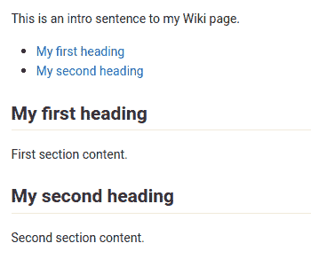
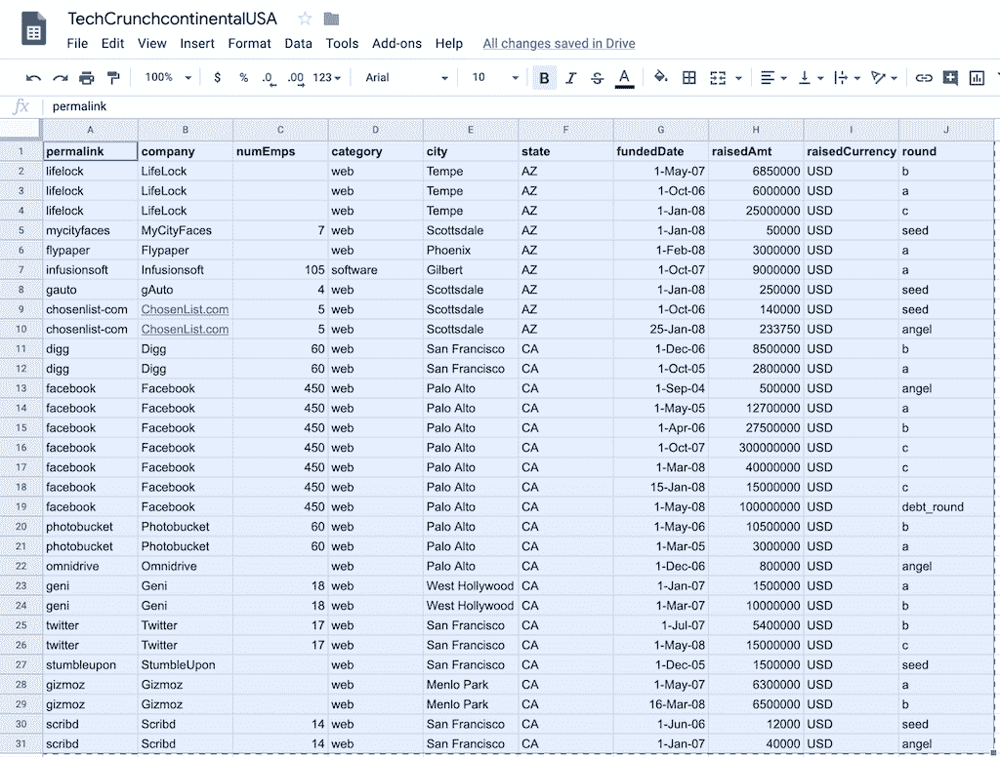
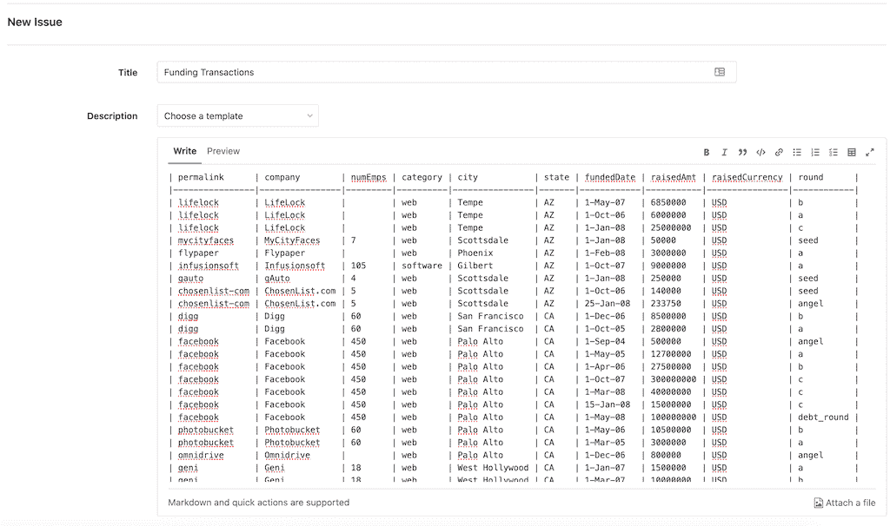

# GitLab Markdown

> 原文：[https://docs.gitlab.com/ee/user/markdown.html](https://docs.gitlab.com/ee/user/markdown.html)

*   [GitLab Flavored Markdown (GFM)](#gitlab-flavored-markdown-gfm)
    *   [Transition from Redcarpet to CommonMark](#transition-from-redcarpet-to-commonmark)
    *   [GFM extends standard Markdown](#gfm-extends-standard-markdown)
*   [New GFM Markdown extensions](#new-gfm-markdown-extensions)
    *   [Colors](#colors)
    *   [Diagrams and flowcharts](#diagrams-and-flowcharts)
        *   [Mermaid](#mermaid)
        *   [PlantUML](#plantuml)
    *   [Emoji](#emoji)
    *   [Front matter](#front-matter)
    *   [Inline diff](#inline-diff)
    *   [Math](#math)
    *   [Special GitLab references](#special-gitlab-references)
    *   [Task lists](#task-lists)
    *   [Table of contents](#table-of-contents)
    *   [Wiki-specific Markdown](#wiki-specific-markdown)
        *   [Wiki - direct page link](#wiki---direct-page-link)
        *   [Wiki - direct file link](#wiki---direct-file-link)
        *   [Wiki - hierarchical link](#wiki---hierarchical-link)
        *   [Wiki - root link](#wiki---root-link)
    *   [Embedding metrics in GitLab Flavored Markdown](#embedding-metrics-in-gitlab-flavored-markdown)
*   [Standard Markdown and extensions in GitLab](#standard-markdown-and-extensions-in-gitlab)
    *   [Blockquotes](#blockquotes)
        *   [Multiline blockquote](#multiline-blockquote)
    *   [Code spans and blocks](#code-spans-and-blocks)
        *   [Colored code and syntax highlighting](#colored-code-and-syntax-highlighting)
    *   [Emphasis](#emphasis)
        *   [Multiple underscores in words and mid-word emphasis](#multiple-underscores-in-words-and-mid-word-emphasis)
    *   [Footnotes](#footnotes)
    *   [Headers](#headers)
        *   [Header IDs and links](#header-ids-and-links)
    *   [Horizontal Rule](#horizontal-rule)
    *   [Images](#images)
        *   [Videos](#videos)
        *   [Audio](#audio)
    *   [Inline HTML](#inline-html)
        *   [Details and summary](#details-and-summary)
    *   [Line breaks](#line-breaks)
        *   [Newlines](#newlines)
    *   [Links](#links)
        *   [URL auto-linking](#url-auto-linking)
    *   [Lists](#lists)
    *   [Superscripts / Subscripts](#superscripts--subscripts)
    *   [Tables](#tables)
        *   [Copy from spreadsheet and paste in Markdown](#copy-from-spreadsheet-and-paste-in-markdown)
*   [References](#references)

# GitLab Markdown[](#gitlab-markdown "Permalink")

该 Markdown 指南**仅对 GitLab 的内部 Markdown 渲染系统的条目和文件有效** . 它是**无效**的[GitLab 文档，网站](https://s0docs0gitlab0com.icopy.site)或[GitLab 的主要网站](https://about.gitlab.com) ，因为它们都使用[Kramdown](https://kramdown.gettalong.org)作为他们的降价引擎. 文档网站使用扩展的 Kramdown 宝石[GitLab Kramdown](https://gitlab.com/gitlab-org/gitlab_kramdown) . 有关完整的 Kramdown 参考，请查阅《 [GitLab Kramdown 指南》](https://about.gitlab.com/handbook/markdown-guide/) .

**注意：**我们建议您查看[GitLab 本身提供的](https://gitlab.com/gitlab-org/gitlab/blob/master/doc/user/markdown.md)此文档.

## GitLab Flavored Markdown (GFM)[](#gitlab-flavored-markdown-gfm "Permalink")

GitLab 使用" GitLab 风味降价"（GFM）. 它以几种方式扩展了[CommonMark 规范](https://spec.commonmark.org/current/) （基于标准 Markdown），以添加其他有用的功能. 它的灵感来自[GitHub Flavored Markdown](https://help.github.com/en/github/writing-on-github/basic-writing-and-formatting-syntax) .

您可以在以下区域使用 GFM：

*   Comments
*   Issues
*   合并要求
*   Milestones
*   代码段（代码段必须以`.md`扩展名命名）
*   维基页面
*   仓库中的 Markdown 文档
*   Epics

您还可以在 GitLab 中使用其他 RTF 文件. 您可能必须安装依赖项才能这样做. 请参阅[`gitlab-markup` gem 项目](https://gitlab.com/gitlab-org/gitlab-markup)以获取更多信息.

### Transition from Redcarpet to CommonMark[](#transition-from-redcarpet-to-commonmark "Permalink")

从 11.1 开始，GitLab 使用[CommonMark Ruby 库](https://github.com/gjtorikian/commonmarker)对[Markit](https://github.com/gjtorikian/commonmarker)处理 GitLab 系统中的所有新问题，合并请求，注释和其他 Markdown 内容. 从 11.3 开始，存储库中的 Wiki 页面和 Markdown 文件（ `*.md` ）也将通过 CommonMark 处理. 从 11.8 开始， [Redcarpet Ruby 库](https://github.com/vmg/redcarpet)已被删除，所有问题和注释，包括 11.1 之前的问题和注释，现在都可以使用[CommonMark Ruby Library 处理](https://github.com/gjtorikian/commonmarker) .

该文档网站的[Markdown 引擎](https://gitlab.com/gitlab-org/gitlab-docs/-/merge_requests/108)已于 2018 年 10 月[从 Redcarpet 迁移到 Kramdown](https://gitlab.com/gitlab-org/gitlab-docs/-/merge_requests/108) .

您的存储库中可能存在较旧的问题，合并请求或 Markdown 文档，这些文档是使用 GitLab 的 RedCarpet 版本的 Markdown 的细微差别编写的. 由于 CommonMark 使用了稍微严格的语法，因此自我们过渡到 CommonMark 以来，这些文档现在看起来可能会有所不同.

通常很容易修复. 例如，带嵌套列表的编号列表可能会错误显示：

```
1. Chocolate
 - dark
 - milk 
```

只需在每个嵌套项目中添加一个空格即可使`-`与顶部列表项的第一个字符对齐（本例中为`C` ）：

```
1. Chocolate
 - dark
 - milk 
```

1.  Chocolate
    *   dark
    *   milk

**注意：**我们将在本文档中标记 Redcarpet 和 CommonMark Markdown 之间的任何重大差异.

如果您有大量的 Markdown 文件，确定它们是否正确显示可能很繁琐. 您可以使用[diff_redcarpet_cmark](https://gitlab.com/digitalmoksha/diff_redcarpet_cmark)工具（不是官方支持的产品）来生成文件列表以及 RedCarpet 和 CommonMark 呈现文件的方式之间的差异. 它可以指示是否需要更改任何内容-通常不需要更改.

### GFM extends standard Markdown[](#gfm-extends-standard-markdown "Permalink")

GitLab 充分利用了标准（CommonMark）格式，但还包括对 GitLab 用户有用的附加功能.

它利用了[Markdown](#new-GFM-markdown-extensions)的[新功能](#new-GFM-markdown-extensions) ，这些[功能](#new-GFM-markdown-extensions)是标准 Markdown 所没有的：

*   [Color “chips” written in HEX, RGB or HSL](#colors)
*   [Diagrams and flowcharts](#diagrams-and-flowcharts)
*   [Emoji](#emoji)
*   [Front matter](#front-matter)
*   [Inline diffs](#inline-diff)
*   [Math equations and symbols written in LaTeX](#math)
*   [Special GitLab references](#special-gitlab-references)
*   [Task Lists](#task-lists)
*   [Table of Contents](#table-of-contents)
*   [Wiki specific Markdown](#wiki-specific-markdown)

它还具有[扩展的 Markdown 功能](#standard-markdown-and-extensions-in-gitlab) ，而无需更改标准 Markdown 的使用方式：

| 标准减价 | 在 GitLab 中扩展 Markdown |
| --- | --- |
| [blockquotes](#blockquotes) | [multi-line blockquotes](#multiline-blockquote) |
| [code blocks](#code-spans-and-blocks) | [colored code and syntax highlighting](#colored-code-and-syntax-highlighting) |
| [emphasis](#emphasis) | [multiple underscores in words](#multiple-underscores-in-words-and-mid-word-emphasis) |
| [headers](#headers) | [linkable Header IDs](#header-ids-and-links) |
| [images](#images) | [embedded videos](#videos) and [audio](#audio) |
| [line breaks](#line-breaks) | [more line break control](#newlines) |
| [links](#links) | [automatically linking URLs](#url-auto-linking) |

## New GFM Markdown extensions[](#new-gfm-markdown-extensions "Permalink")

### Colors[](#colors "Permalink")

> 如果未正确呈现，请[在 GitLab 本身中查看它](https://gitlab.com/gitlab-org/gitlab/blob/master/doc/user/markdown.md#colors) .

可以使用颜色指示器呈现以 HEX，RGB 或 HSL 格式书写的颜色.

支持的格式（不支持命名的颜色）：

*   HEX: ``#RGB[A]`` or ``#RRGGBB[AA]``
*   RGB: ``RGB[A](R, G, B[, A])``
*   HSL: ``HSL[A](H, S, L[, A])``

反引号内的颜色后面将带有颜色"碎片"：

```
- `#F00`
- `#F00A`
- `#FF0000`
- `#FF0000AA`
- `RGB(0,255,0)`
- `RGB(0%,100%,0%)`
- `RGBA(0,255,0,0.3)`
- `HSL(540,70%,50%)`
- `HSLA(540,70%,50%,0.3)` 
```

*   `#F00`
*   `#F00A`
*   `#FF0000`
*   `#FF0000AA`
*   `RGB(0,255,0)`
*   `RGB(0%,100%,0%)`
*   `RGBA(0,255,0,0.3)`
*   `HSL(540,70%,50%)`
*   `HSLA(540,70%,50%,0.3)`

### Diagrams and flowcharts[](#diagrams-and-flowcharts "Permalink")

可以使用[Mermaid](https://s0mermaidjs0github0io.icopy.site/)或[PlantUML](https://plantuml.com)从 GitLab 中的文本生成图表和流程图.

#### Mermaid[](#mermaid "Permalink")

在 GitLab 10.3 中[引入](https://gitlab.com/gitlab-org/gitlab-foss/-/merge_requests/15107) .

访问[官方页面](https://s0mermaidjs0github0io.icopy.site/)以获取更多详细信息. 如果您不熟悉使用 Mermaid，或者需要帮助来确定 Mermaid 代码中的问题，则[Mermaid Live Editor](https://mermaid-js.github.io/mermaid-live-editor/)是一个有用的工具，可用于在 Mermaid 图中创建和解决问题.

为了生成图表或流程图，您应该在`mermaid`块内编写文本：

```
```mermaid graph TD;
  A-->B;
  A-->C;
  B-->D;
  C-->D;
``` 
```

图 TD; A-> B; A-> C; B-> D; C-> D;

子图也可以包括：

```
```mermaid graph TB

  SubGraph1 --> SubGraph1Flow
  subgraph "SubGraph 1 Flow"
  SubGraph1Flow(SubNode 1)
  SubGraph1Flow -- Choice1 --> DoChoice1
  SubGraph1Flow -- Choice2 --> DoChoice2
  end

  subgraph "Main Graph"
  Node1[Node 1] --> Node2[Node 2]
  Node2 --> SubGraph1[Jump to SubGraph1]
  SubGraph1 --> FinalThing[Final Thing]
end
``` 
```

图 TB SubGraph1-> SubGraph1Flow 子图" SubGraph 1 Flow" SubGraph1Flow（SubNode 1）SubGraph1Flow-Choice1-> DoChoice1 SubGraph1Flow-Choice2-> DoChoice2 结束子图" Main Graph" Node1 [Node 1]-> Node2 [ Node 2] Node2-> SubGraph1 [Jump to SubGraph1] SubGraph1-> FinalThing [Final Thing]结束

#### PlantUML[](#plantuml "Permalink")

为了使 PlantUML 在 GitLab 中可用，GitLab 管理员需要首先启用它. 在[PlantUML＆GitLab 中](../administration/integration/plantuml.html)了解更多[信息](../administration/integration/plantuml.html) .

### Emoji[](#emoji "Permalink")

> 如果未正确呈现，请[在 GitLab 本身中查看它](https://gitlab.com/gitlab-org/gitlab/blob/master/doc/user/markdown.md#emoji) .

```
Sometimes you want to :monkey: around a bit and add some :star2: to your :speech_balloon:. Well we have a gift for you:

:zap: You can use emoji anywhere GFM is supported. :v:

You can use it to point out a :bug: or warn about :speak_no_evil: patches. And if someone improves your really :snail: code, send them some :birthday:. People will :heart: you for that.

If you're new to this, don't be :fearful:. You can easily join the emoji :family:. All you need to do is to look up one of the supported codes.

Consult the [Emoji Cheat Sheet](https://www.emojicopy.com) for a list of all supported emoji codes. :thumbsup: 
```

有时候你想  大约添加一些  给你  . 好吧，我们有礼物送给您：

您可以在支持 GFM 的任何地方使用表情符号. 

您可以使用它指出一个  或警告  补丁. 如果有人真的改善了你  代码，给他们发送一些  . 人们会  为此.

如果您是新手，请不要  . 您可以轻松加入表情符号  . 您需要做的只是查找受支持的代码之一.

有关所有受支持的表情符号代码的列表，请查阅[表情符号备忘单](https://www.webfx.com/tools/emoji-cheat-sheet/) . 

> **注意：**以上表情符号示例在本文档中使用了硬编码图像. 在 GitLab 中呈现时，表情符号可能会出现不同，具体取决于所使用的操作系统和浏览器.

大多数 emoji 表情在 macOS，Windows，iOS，Android 上均受本机支持，并且将退回到不支持图像的基于图像的表情上.

**注意：**在 Linux 上，您可以下载[Noto Color Emoji](https://www.google.com/get/noto/help/emoji/)以获得完整的本机表情符号支持. Ubuntu 18.04（与许多现代 Linux 发行版一样）默认情况下已安装此字体.

### Front matter[](#front-matter "Permalink")

在 GitLab 11.6 中[引入](https://gitlab.com/gitlab-org/gitlab-foss/-/merge_requests/23331) .

首要事项是 Markdown 文档开头，内容之前的元数据. 静态站点生成器（例如[Jekyll](https://jekyllrb.com/docs/front-matter/) ， [Hugo](https://s0gohugo0io.icopy.site/content-management/front-matter/)和许多其他应用程序）可以使用此数据.

当您查看由 GitLab 渲染的 Markdown 文件时，任何前端问题都会按原样显示在文档顶部的框中，位于渲染的 HTML 内容之前. 要查看示例，可以在[GitLab 文档文件](https://gitlab.com/gitlab-org/gitlab/blob/master/doc/README.md)的源版本和渲染版本之间切换.

在 GitLab 中，仅在 Markdown 文件和 Wiki 页面中使用前题，而不在支持 Markdown 格式的其他地方使用. 它必须在文档的最顶部，并且必须在定界符之间，如下所述.

支持以下定界符：

*   YAML（ `---` ）：

    ```
    ---
    title: About Front Matter
    example:
    language: yaml
    --- 
    ```

*   TOML（ `+++` ）：

    ```
    +++
    title = "About Front Matter"
    [example]
    language = "toml"
    +++ 
    ```

*   JSON（ `;;;` ）：

    ```
    ;;;  {  "title":  "About Front Matter"  "example":  {  "language":  "json"  }  }  ;;; 
    ```

通过向任何现有定界符添加说明符来支持其他语言. 例如：

```
---php
$title = "About Front Matter";
$example = array(
  'language' => "php",
);
--- 
```

### Inline diff[](#inline-diff "Permalink")

> 如果未正确呈现，请[在 GitLab 本身中查看它](https://gitlab.com/gitlab-org/gitlab/blob/master/doc/user/markdown.md#inline-diff) .

使用内联 diff 标签，您可以显示`{+ additions +}`或`[- deletions -]` .

包装标签可以是大括号或方括号：

```
- {+ addition 1 +}
- [+ addition 2 +]
- {- deletion 3 -}
- [- deletion 4 -] 
```

*   {+加法 1 +}
*   [+加法 2 +]
*   {-删除 3-}
*   [-删除 4-]

* * *

但是，包装标签不能混合使用：

```
- {+ addition +]
- [+ addition +}
- {- deletion -]
- [- deletion -} 
```

如果您的差异包含``code``字体的单词，请确保使用反斜杠`\`来转义每个反引号``` ，否则差异突出显示将无法正确呈现：

```
- {+ Just regular text +}
- {+ Text with `backticks` inside +}
- {+ Text with escaped \`backticks\` inside +} 
```

*   {+普通文字+}
*   {+带有`backticks`文字+}
*   {+内含转义的`反引号'的文字+}

### Math[](#math "Permalink")

> 如果未正确呈现，请[在 GitLab 本身中查看它](https://gitlab.com/gitlab-org/gitlab/blob/master/doc/user/markdown.md#math) .

可以使用[KaTeX](https://github.com/KaTeX/KaTeX)渲染用 LaTeX 语法编写的数学运算.

在美元符号`$`之间写的数学将与文本内嵌. 用声明为`math`的语言在[代码块中](#code-spans-and-blocks)编写的`math`将在单独的行上呈现：

```
This math is inline $`a^2+b^2=c^2`$.

This is on a separate line

```math a^2+b^2=c^2
``` 
```

此数学`a^2+b^2=c^2`为内联$ `a^2+b^2=c^2` $.

这是在单独的行上

```
a^2+b^2=c^2
```

*请注意，KaTeX 仅支持 LaTeX 的[子集](https://katex.org/docs/supported.html) .*

**注意：**这也适用于 Asciidoctor `:stem: latexmath` . 有关详细信息，请参见[Asciidoctor 用户手册](https://asciidoctor.org/docs/user-manual/#activating-stem-support) .

### Special GitLab references[](#special-gitlab-references "Permalink")

GFM 可以识别与 GitLab 相关的特殊参考. 例如，您可以轻松地引用项目中的问题，提交，团队成员甚至整个团队. GFM 会将引用转换为链接，以便您可以轻松地在它们之间导航.

此外，GFM 可以识别某些跨项目引用，并且还具有一个速记版本，可以引用同一名称空间中的其他项目.

GFM 将识别以下内容：

| references | input | 跨项目参考 | shortcut within same namespace |
| --- | --- | --- | --- |
| 特定使用者 | `@user_name` |   |   |
| 特定人群 | `@group_name` |   |   |
| 整个团队 | `@all` |   |   |
| project | `namespace/project>` |   |   |
| issue | `#123` | `namespace/project#123` | `project#123` |
| 合并要求 | `!123` | `namespace/project!123` | `project!123` |
| snippet | `$123` | `namespace/project$123` | `project$123` |
| epic | `&123` | `group1/subgroup&123` |   |
| 通过 ID 标签 | `~123` | `namespace/project~123` | `project~123` |
| 一词标签名称 | `~bug` | `namespace/project~bug` | `project~bug` |
| 多词标签名称 | `~"feature request"` | `namespace/project~"feature request"` | `project~"feature request"` |
| 范围标签按名称 | `~"priority::high"` | `namespace/project~"priority::high"` | `project~"priority::high"` |
| ID 项目里程碑 | `%123` | `namespace/project%123` | `project%123` |
| 一词里程碑 | `%v1.23` | `namespace/project%v1.23` | `project%v1.23` |
| 多词里程碑 | `%"release candidate"` | `namespace/project%"release candidate"` | `project%"release candidate"` |
| 具体提交 | `9ba12248` | `namespace/project@9ba12248` | `project@9ba12248` |
| 提交范围比较 | `9ba12248...b19a04f5` | `namespace/project@9ba12248...b19a04f5` | `project@9ba12248...b19a04f5` |
| 仓库文件参考 | `[README](doc/README)` |   |   |
| 存储库文件行参考 | `[README](doc/README#L13)` |   |   |

除此之外，还可以识别和格式化指向某些对象的链接. 这些示例包括：

*   对问题的评论： `"https://gitlab.com/gitlab-org/gitlab/-/issues/1234#note_101075757"` ，它将呈现为`#1234 (note1)`
*   问题设计标签： `"https://gitlab.com/gitlab-org/gitlab/-/issues/1234/designs"` ，该标签将显示为`#1234 (designs)` .
*   链接到各个设计： `"https://gitlab.com/gitlab-org/gitlab/-/issues/1234/designs/layout.png"` ，它将呈现为`#1234[layout.png]` .

### Task lists[](#task-lists "Permalink")

> 如果未正确呈现，请[在 GitLab 本身中查看它](https://gitlab.com/gitlab-org/gitlab/blob/master/doc/user/markdown.md#task-lists) .

您可以在支持 Markdown 的任何位置添加任务列表，但是如果它们处于问题，合并请求或注释中，则只能"单击"以切换它们. 在其他地方，您必须手动编辑 Markdown 以通过在方括号内添加或删除`x`来更改状态.

要创建任务列表，请添加特殊格式的 Markdown 列表. 您可以使用无序列表或有序列表：

```
- [x] Completed task
- [ ] Incomplete task
 - [ ] Sub-task 1
 - [x] Sub-task 2
 - [ ] Sub-task 3
 1. [x] Completed task
1. [ ] Incomplete task
 1. [ ] Sub-task 1
 1. [x] Sub-task 2 
```

*   [x]完成的任务
*   []未完成的任务
    *   []子任务 1
    *   [x]子任务 2
    *   []子任务 3

1.  [x] Completed task
2.  []未完成的任务
    1.  []子任务 1
    2.  [x]子任务 2

### Table of contents[](#table-of-contents "Permalink")

通过在标记行`[[_TOC_]]`上添加标记，您可以将目录添加到 Markdown 文件，Wiki 页面或发布/合并请求描述中. 它将显示为链接到各种标题的无序列表.

```
This is an intro sentence to my Wiki page.

[[_TOC_]]

## My first heading

First section content.

## My second heading

Second section content. 
```

[](img/markdown_toc_preview_v12_9.png)

### Wiki-specific Markdown[](#wiki-specific-markdown "Permalink")

以下示例显示了 Wiki 内部链接的行为.

#### Wiki - direct page link[](#wiki---direct-page-link "Permalink")

仅包含页面的子弹的链接将指向该页面， *位于 Wiki 的基本级别* .

该代码段将链接到 Wiki 根目录下的`documentation`页面：

```
[Link to Documentation](documentation) 
```

#### Wiki - direct file link[](#wiki---direct-file-link "Permalink")

*相对于当前页面* ，带有文件扩展名的链接指向该文件.

如果下面的代码段放在`<your_wiki>/documentation/related`的页面上，它将链接到`<your_wiki>/documentation/file.md` ：

```
[Link to File](file.md) 
```

#### Wiki - hierarchical link[](#wiki---hierarchical-link "Permalink")

可以使用`./<page>` ， `../<page>`来相对于当前 Wiki 页面构建链接.

如果此代码段放在`<your_wiki>/documentation/main`的页面上，它将链接到`<your_wiki>/documentation/related` ：

```
[Link to Related Page](./related) 
```

如果此代码段放在`<your_wiki>/documentation/related/content`的页面上，它将链接到`<your_wiki>/documentation/main` ：

```
[Link to Related Page](../main) 
```

如果此代码段放在`<your_wiki>/documentation/main`的页面上，它将链接到`<your_wiki>/documentation/related.md` ：

```
[Link to Related Page](./related.md) 
```

如果此代码段放在`<your_wiki>/documentation/related/content`的页面上，它将链接到`<your_wiki>/documentation/main.md` ：

```
[Link to Related Page](../main.md) 
```

#### Wiki - root link[](#wiki---root-link "Permalink")

以`/`开头的链接是相对于 Wiki 根目录的.

该代码段链接到`<wiki_root>/documentation` ：

```
[Link to Related Page](/documentation) 
```

该代码段链接到`<wiki_root>/miscellaneous.md` ：

```
[Link to Related Page](/miscellaneous.md) 
```

### Embedding metrics in GitLab Flavored Markdown[](#embedding-metrics-in-gitlab-flavored-markdown "Permalink")

公制图表可以嵌入到 GitLab 风味 Markdown 中. 有关更多详细信息，请参见[在 GitLab 风格的 Markdown 中嵌入度量标准](../user/project/integrations/prometheus.html#embedding-metric-charts-within-gitlab-flavored-markdown) .

## Standard Markdown and extensions in GitLab[](#standard-markdown-and-extensions-in-gitlab "Permalink")

所有标准 Markdown 格式均应在 GitLab 中按预期工作. 一些标准功能通过附加功能进行了扩展，而不会影响标准用法. 如果扩展了功能，则新选项将作为子节列出.

### Blockquotes[](#blockquotes "Permalink")

块引号是突出显示信息（如边注）的简便方法. 它是通过以`>`开头的 blockquote 行来生成的：

```
> Blockquotes are very handy to emulate reply text.
> This line is part of the same quote.

Quote break.
 > This is a very long line that will still be quoted properly when it wraps. Oh boy let's keep writing to make sure this is long enough to actually wrap for everyone. Oh, you can *put* **Markdown** into a blockquote. 
```

> 块引用非常容易模拟回复文本. 该行是同一报价的一部分.

报价中断.

> 这是一条很长的行，当它换行时仍会被正确引用. 哦，男孩，让我们继续写作，以确保它足够长，可以实际包裹所有人. 哦，您可以*将* **Markdown**放入 blockquote 中.

#### Multiline blockquote[](#multiline-blockquote "Permalink")

> 如果未正确呈现，请[在 GitLab 本身中查看它](https://gitlab.com/gitlab-org/gitlab/blob/master/doc/user/markdown.md#multiline-blockquote) .

GFM 还支持`>>>`围起来的多行块引用，从而扩展了标准的 Markdown 标准：

```
>>>
If you paste a message from somewhere else

that spans multiple lines,

you can quote that without having to manually prepend `>` to every line!
>>> 
```

> 如果您从其他地方粘贴消息
> 
> 跨越多行，
> 
> 您可以引用它，而不必手动在每行前面加上`>` ！

### Code spans and blocks[](#code-spans-and-blocks "Permalink")

您可以轻松突出显示应视为代码而非简单文本的任何内容.

简单的内联代码很容易用单个反引号```突出显示：

```
Inline `code` has `back-ticks around` it. 
```

Inline `code` has `back-ticks around` it.

* * *

同样，整个代码块可以用三个反引号（ ````` ），三个波浪号（ `~~~` ）或缩进 4 个或更多的空格来围起来，以实现较大代码体的相似效果.

```
```python def function():
    #indenting works just fine in the fenced code block
    s = "Python code"
    print s
``` Using 4 spaces
    is like using
    3-backtick fences. 
```

```
~~~
Tildes are OK too.
~~~ 
```

上面的三个示例呈现为：

```
def function():
    #indenting works just fine in the fenced code block
    s = "Python code"
    print s 
```

```
Using 4 spaces
is like using
3-backtick fences. 
```

```
Tildes are OK too. 
```

#### Colored code and syntax highlighting[](#colored-code-and-syntax-highlighting "Permalink")

> 如果未正确呈现，请[在 GitLab 本身中查看它](https://gitlab.com/gitlab-org/gitlab/blob/master/doc/user/markdown.md#colored-code-and-syntax-highlighting) .

GitLab 使用[Rouge Ruby 库](http://rouge.jneen.net/)在代码块中突出显示了更加丰富多彩的语法. 有关支持的语言的列表，请访问[Rouge 项目 Wiki](https://github.com/rouge-ruby/rouge/wiki/List-of-supported-languages-and-lexers) . 语法突出显示仅在代码块中受支持，因此在内联时无法突出显示代码.

代码块由带有三个反引号（ ````` ）或三个波浪号（ `~~~` ）的行围起来，并在第一个围栏的末尾标识了语言：

```
```javascript var s = "JavaScript syntax highlighting";
alert(s);
```

```python def function():
    #indenting works just fine in the fenced code block
    s = "Python syntax highlighting"
    print s
```

```ruby require 'redcarpet'
markdown = Redcarpet.new("Hello World!")
puts markdown.to_html
```

```  No language indicated, so no syntax highlighting.
s = "There is no highlighting for this."
But let's throw in a <b>tag</b>.
``` 
```

上面的四个示例呈现为：

```
var s = "JavaScript syntax highlighting";
alert(s); 
```

```
def function():
    #indenting works just fine in the fenced code block
    s = "Python syntax highlighting"
    print s 
```

```
require 'redcarpet'
markdown = Redcarpet.new("Hello World!")
puts markdown.to_html 
```

```
No language indicated, so no syntax highlighting.
s = "There is no highlighting for this."
But let's throw in a <b>tag</b>. 
```

### Emphasis[](#emphasis "Permalink")

在 Markdown 中有多种强调文本的方法. 您可以斜体，粗体，删除线，以及将这些强调样式结合在一起.

Examples:

```
Emphasis, aka italics, with *asterisks* or _underscores_.

Strong emphasis, aka bold, with double **asterisks** or __underscores__.

Combined emphasis with **asterisks and _underscores_**.

Strikethrough uses two tildes. ~~Scratch this.~~ 
```

强调，又称斜体，带有*星号*或*下划线* .

重点突出，又大胆，带有双星**号**或**下划线** .

结合强调与**星号和*下划线*** .

删除线使用两个波浪号. ~~抓这个.~~

**注意：**删除线不是 Markdown 核心标准的一部分，而是 GFM 的一部分.

#### Multiple underscores in words and mid-word emphasis[](#multiple-underscores-in-words-and-mid-word-emphasis "Permalink")

> 如果未正确呈现，请[在 GitLab 本身中查看它](https://gitlab.com/gitlab-org/gitlab/blob/master/doc/user/markdown.md#multiple-underscores-in-words) .

仅将单词的*一部分*斜体化通常是没有用的，尤其是当您要处理经常带有多个下划线的代码和名称时. 结果，GFM 通过忽略单词中的多个下划线来扩展了标准的 Markdown 标准，以更好地呈现讨论代码的 Markdown 文档：

```
perform_complicated_task

do_this_and_do_that_and_another_thing

but_emphasis is_desired _here_ 
```

perform_complicated_task

do_this_and_do_that_and_another_thing

但是*在这里需要重点*

* * *

如果您只想强调单词的一部分，仍然可以使用星号来完成：

```
perform*complicated*task

do*this*and*do*that*and*another thing 
```

perform*complicated*task

做*这个* ， *做*那个*和*另一件事

### Footnotes[](#footnotes "Permalink")

脚注会添加指向注释的链接，该链接将在 Markdown 文件的末尾呈现.

要创建脚注，您既需要参考标记，又需要带有注释内容的单独行（文件中的任何地方）.

无论标签名称如何，参考标签的相对顺序都决定了呈现的编号.

参考标记可以使用字母和其他字符. 在解决[此错误](https://gitlab.com/gitlab-org/gitlab/-/issues/24423)之前，请避免在脚注标签名称中使用小写`w`或下划线（ `_` ）.

```
A footnote reference tag looks like this: [^1]

This reference tag is a mix of letters and numbers. [^footnote-42]

[^1]: This is the text inside a footnote.

[^footnote-42]: This is another footnote. 
```

脚注参考标记如下所示： <sup id="fnref:1">[1](#fn:1)</sup>

此参考标记是字母和数字的组合. <sup id="fnref:footnote-42">[2](#fn:footnote-42)</sup>

### Headers[](#headers "Permalink")

```
# H1
## H2
### H3
#### H4
##### H5
###### H6

Alternatively, for H1 and H2, an underline-ish style:

Alt-H1
====== 
Alt-H2
------ 
```

#### Header IDs and links[](#header-ids-and-links "Permalink")

GFM 扩展了标准 Markdown 标准，以便所有 Markdown 呈现的标头都自动获取 ID，可以将 ID 链接到该 ID，注释中除外.

悬停时，将显示到这些 ID 的链接，从而可以更轻松地将链接复制到标头以在其他地方使用.

根据以下规则从标头的内容生成 ID：

1.  所有文本都将转换为小写.
2.  删除所有非单词文本（例如标点符号或 HTML）.
3.  所有空格都将转换为连字符.
4.  连续的两个或多个连字符转换为 1.
5.  If a header with the same ID has already been generated, a unique incrementing number is appended, starting at 1.

Example:

```
# This header has spaces in it
## This header has a :thumbsup: in it
# This header has Unicode in it: 한글
## This header has spaces in it
### This header has spaces in it
## This header has 3.5 in it (and parentheses) 
```

将生成以下链接 ID：

1.  `this-header-has-spaces-in-it`
2.  `this-header-has-a-in-it`
3.  `this-header-has-unicode-in-it-한글`
4.  `this-header-has-spaces-in-it-1`
5.  `this-header-has-spaces-in-it-2`
6.  `this-header-has-3-5-in-it-and-parentheses`

请注意，表情符号处理是在生成标题 ID 之前进行的，因此表情符号将转换为图像，然后从 ID 中删除.

### Horizontal Rule[](#horizontal-rule "Permalink")

使用三个或多个连字符，星号或下划线来创建水平尺非常简单：

```
Three or more hyphens,
 --- 
asterisks,
 *** 
or underscores

___ 
```

### Images[](#images "Permalink")

Examples:

```
Inline-style (hover to see title text):


Reference-style (hover to see title text):

![alt text1][logo]

[logo]: img/markdown_logo.png "Title Text" 
```

Inline-style (hover to see title text):

[](img/markdown_logo.png)

参考样式（悬停以查看标题文本）：

[](img/markdown_logo.png)

#### Videos[](#videos "Permalink")

> 如果未正确呈现，请[在 GitLab 本身中查看它](https://gitlab.com/gitlab-org/gitlab/blob/master/doc/user/markdown.md#videos) .

链接到带有视频扩展名的文件的图像标签会自动转换为视频播放器. 有效的视频扩展名是`.mp4` ， `.m4v` ， `.mov` ， `.webm`和`.ogv` ：

```
Here's a sample video:

 
```

这是一个示例视频：

[](img/markdown_video.mp4)

#### Audio[](#audio "Permalink")

> 如果未正确呈现，请[在 GitLab 本身中查看它](https://gitlab.com/gitlab-org/gitlab/blob/master/doc/user/markdown.md#audio) .

与视频类似，带有音频扩展名的文件的链接标签会自动转换为音频播放器. 有效的音频扩展名是`.mp3` ， `.oga` ， `.ogg` ， `.spx`和`.wav` ：

```
Here's a sample audio clip:

 
```

这是一个示例音频剪辑：

[](img/markdown_audio.mp3)

### Inline HTML[](#inline-html "Permalink")

> 要在第二个示例中[查看](https://gitlab.com/gitlab-org/gitlab/blob/master/doc/user/markdown.md#inline-html)在 HTML 中呈现的 Markdown，请[在 GitLab 本身中查看它](https://gitlab.com/gitlab-org/gitlab/blob/master/doc/user/markdown.md#inline-html) .

您还可以在 Markdown 中使用原始 HTML，通常效果很好.

有关允许的 HTML 标记和属性的列表，请参见 HTML :: Pipeline 的[SanitizationFilter](https://github.com/jch/html-pipeline/blob/v2.12.3/lib/html/pipeline/sanitization_filter.rb#L42)类的文档. 除了默认`SanitizationFilter`允许列表，GitLab 允许`span` ， `abbr` ， `details`和`summary`元素.

```
<dl>
  <dt>Definition list</dt>
  <dd>Is something people use sometimes.</dd>

  <dt>Markdown in HTML</dt>
  <dd>Does *not* work **very** well. HTML <em>tags</em> will <b>work</b>, in most cases.</dd>
</dl> 
```

Definition list

人们有时会用到的东西.

Markdown in HTML

*不是*很好**. HTML *标签*将工作 ，在大多数情况下.

* * *

仍然可以在 HTML 标记内使用 Markdown，但前提是包含 Markdown 的行分为各自的行：

```
<dl>
  <dt>Markdown in HTML</dt>
  <dd>Does *not* work **very** well. HTML tags will work, in most cases.</dd>

  <dt>Markdown in HTML</dt>
  <dd>

  Does *not* work **very** well. HTML tags will work, in most cases.

  </dd>
</dl> 
```

Markdown in HTML

*不是*很好**. HTML 标记在大多数情况下都可以使用.

Markdown in HTML

*不能* 很好地工作. HTML 标记在大多数情况下都可以使用.

#### Details and summary[](#details-and-summary "Permalink")

> 要在第二个示例中[查看](https://gitlab.com/gitlab-org/gitlab/blob/master/doc/user/markdown.md#details-and-summary)在 HTML 中呈现的 Markdown，请[在 GitLab 本身中查看它](https://gitlab.com/gitlab-org/gitlab/blob/master/doc/user/markdown.md#details-and-summary) .

可以使用 HTML 的[`<details>`](https://s0developer0mozilla0org.icopy.site/en-US/docs/Web/HTML/Element/details)和[`<summary>`](https://s0developer0mozilla0org.icopy.site/en-US/docs/Web/HTML/Element/summary)标记折叠内容. 这对于折叠长日志特别有用，因为它们占用更少的屏幕空间.

```
<p>
<details>
<summary>Click this to collapse/fold.</summary>

These details <em>will</em> remain <strong>hidden</strong> until expanded.

<pre><code>PASTE LOGS HERE</code></pre>

</details>
</p> 
```

<details title="单击以折叠/折叠. These details will remain hidden until expanded. PASTE LOGS HERE"><summary>单击以折叠/折叠.</summary> 这些细节*将*保持**隐藏，**直到扩展.

```
 PASTE LOGS HERE 
```</details> 

* * *

这些标记内的 Markdown 也受支持.

**注意：**如果 Markdown 无法正确呈现，请尝试在页面顶部添加`{::options parse_block_html="true" /}` ，然后将`markdown="span"`添加到开头的摘要标记中，如下所示： `<summary markdown="span">` .

请记住，在`</summary>`标记之后和`</details>`标记之前留空行，如示例所示：

```
<details>
<summary>Click this to collapse/fold.</summary>

These details _will_ remain **hidden** until expanded.

```
PASTE LOGS HERE
```

</details> 
```

<details title="单击以折叠/折叠. These details will remain hidden until expanded. PASTE LOGS HERE"><summary>单击以折叠/折叠.</summary> 这些细节*将*保持隐藏，直到扩展.

```
 PASTE LOGS HERE 
```</details> 

### Line breaks[](#line-breaks "Permalink")

如果先前的文本以两个换行符结尾，则会插入一个换行符（将开始一个新的段落），例如当您连续两次按`Enter 键`时. 如果仅使用一个换行符（ `按`一次`Enter 键` ），则下一个句子将成为同一段落的一部分. 如果要避免长行换行并使它们易于编辑，这很有用：

```
Here's a line for us to start with.

This longer line is separated from the one above by two newlines, so it will be a *separate paragraph*.

This line is also a separate paragraph, but...
These lines are only separated by single newlines,
so they *do not break* and just follow the previous lines
in the *same paragraph*. 
```

这是我们要开始的一行.

该较长的行与上面的一行由两个换行符*隔开* ，因此它将是一个*单独的段落* .

该行也是一个单独的段落，但是…这些行仅由单个换行符分隔，因此它们*不会中断*并且仅遵循*同一段落中*的前几行.

#### Newlines[](#newlines "Permalink")

GFM 在[处理段落和换行符方面](https://spec.commonmark.org/current/)遵循 Markdown 规范.

段落是一个或多个连续的文本行，由一个或多个空行分隔（第一段末尾有两个新行）， [如上所述](#line-breaks) .

如果您需要对换行符或换行符进行更多控制，则可以通过以反斜杠或两个或多个空格结束一行来添加单个换行符. 连续两个换行符将创建一个新的段落，中间有一个空行：

```
First paragraph.
Another line in the same paragraph.
A third line in the same paragraph, but this time ending with two spaces.{space}{space}
A new line directly under the first paragraph.

Second paragraph.
Another line, this time ending with a backslash.\
A new line due to the previous backslash. 
```

### Links[](#links "Permalink")

有两种创建链接的方法，即内联样式和引用样式：

```
- This is an [inline-style link](https://www.google.com)
- This is a [link to a repository file in the same directory](index.md)
- This is a [relative link to a readme one directory higher](../README.md)
- This is a [link that also has title text](https://www.google.com "This link takes you to Google!")

Using header ID anchors:

- This links to [a section on a different Markdown page, using a "#" and the header ID](index.md#overview)
- This links to [a different section on the same page, using a "#" and the header ID](#header-ids-and-links)

Using references:

- This is a [reference-style link, see below][Arbitrary case-insensitive reference text]
- You can [use numbers for reference-style link definitions, see below][1]
- Or leave it empty and use the [link text itself][], see below.

Some text to show that the reference links can follow later.

[arbitrary case-insensitive reference text]: https://www.mozilla.org/en-US/
[1]: https://slashdot.org
[link text itself]: https://www.reddit.com 
```

*   这是一个[内联样式的链接](https://www.google.com)
*   这是[指向同一目录中存储库文件](index.html)的[链接](index.html)
*   这是[指向自述文件的上一级目录](../README.html)的[相对链接](../README.html)
*   这是一个[也有标题文字](https://www.google.com "此链接将您带到 Google！")的[链接](https://www.google.com "此链接将您带到 Google！")

使用标头 ID 锚点：

*   该链接[使用"＃"和标题 ID](index.html#overview)链接到[另一个 Markdown 页面上的部分](index.html#overview)
*   这[使用"＃"和标题 ID](#header-ids-and-links)链接到[同一页面上的不同部分.](#header-ids-and-links)

使用参考：

*   这是[参考样式的链接，请参见下文](https://www.mozilla.org/en-US/)
*   您可以[将数字用于引用样式的链接定义，请参见下文](https://slashdot.org)
*   或将其保留为空，并使用[链接文本本身](https://www.reddit.com) ，请参见下文.

一些文本表明参考链接可以在以后使用.

**注意：**相对链接不允许引用 Wiki 页面或项目文件中的 Wiki 页面中的项目文件. 这样做的原因是，Wiki 始终位于 GitLab 中的单独 Git 存储库中. 例如，仅当链接位于 Wiki Markdown 文件内部时， `[I'm a reference-style link](style)`才会将链接指向`wikis/style` .

#### URL auto-linking[](#url-auto-linking "Permalink")

GFM will auto-link almost any URL you put into your text:

```
- https://www.google.com
- https://www.google.com
- ftp://ftp.us.debian.org/debian/
- smb://foo/bar/baz
- irc://irc.freenode.net/
- http://localhost:3000 
```

*   [https://www.google.com](https://www.google.com)
*   [https://www.google.com](https://www.google.com)
*   [ftp://ftp.us.debian.org/debian/](ftp://ftp.us.debian.org/debian/)
*   <smb://foo/bar/baz>
*   <irc://irc.freenode.net/>
*   [http://localhost:3000](http://localhost:3000)

### Lists[](#lists "Permalink")

可以轻松创建有序列表和无序列表.

对于有序列表，请在有序列表的每一行的开头添加希望列表以其开头的数字，例如`1.` ，后跟一个空格. 在第一个数字之后，使用什么数字都没有关系，有序列表将按垂直顺序自动编号，因此对同一列表中的所有项目重复`1.` .. 如果你开始以外的其他数字`1.` ，它会用它作为第一个数字，并从那里计数.

Examples:

```
1. First ordered list item
2. Another item
 - Unordered sub-list.
1. Actual numbers don't matter, just that it's a number
 1. Ordered sub-list
 1. Next ordered sub-list item
4. And another item. 
```

1.  首先订购的清单项目
2.  另一个项目
    *   无序子列表.
3.  实际数字并不重要，只是一个数字
    1.  订购子清单
    2.  下一个订购的子清单项目
4.  还有另一个项目.

对于无序列表，请在无序列表的每一行的开头添加`-` ， `*`或`+` ，然后加上一个空格，但是您不能混合使用它们.

```
Unordered lists can:
 - use
- minuses

They can also:
 * use
* asterisks

They can even:
 + use
+ pluses 
```

无序列表可以：

*   use
*   minuses

他们还可以：

*   use
*   asterisks

They can even:

*   use
*   pluses

* * *

如果列表项包含多个段落，则每个后续段落都应缩进到与列表项文本开头相同的级别.

Example:

```
1. First ordered list item

   Second paragraph of first item.
 1. Another item 
```

1.  首先订购的清单项目

    第一项第二段.

2.  Another item

* * *

如果第一项的段落没有缩进适当的空格数，则该段落将出现在列表外部，而不是在列表项下方正确缩进.

Example:

```
1. First ordered list item

  Paragraph of first item.
 1. Another item 
```

1.  首先订购的清单项目

第一项的段落.

1.  另一个项目

### Superscripts / Subscripts[](#superscripts--subscripts "Permalink")

当前，CommonMark 和 GFM 不支持 Redcarpet 支持的上标语法（ `x^2` ）. 您可以对上标和下标使用标准的 HTML 语法：

```
The formula for water is H<sub>2</sub>O
while the equation for the theory of relativity is E = mc<sup>2</sup>. 
```

水的公式为 H <sub>2</sub> O，而相对论的公式为 E = mc <sup>2</sup> .

### Tables[](#tables "Permalink")

表不是 Markdown 核心规范的一部分，但它们是 GFM 的一部分.

1.  第一行包含标头，并用"竖线"（ `|` ）分隔.
2.  第二行将标题与单元格分开，并且必须包含三个或更多破折号.
3.  第三行以及随后的任何行均包含单元格值.
    *   您**不能**在 Markdown 中将单元格分隔成多行，它们必须保持为单行，但它们可能会很长. 如果需要，还可以包含 HTML `<br>`标记以强制换行.
    *   像元大小**不必**彼此匹配. 它们很灵活，但必须用管道（ `|` ）分隔.
    *   您**可以**有空白单元格.

Example:

```
| header 1 | header 2 | header 3 |
| ---      |  ------  |---------:|
| cell 1   | cell 2   | cell 3   |
| cell 4 | cell 5 is longer | cell 6 is much longer than the others, but that's ok. It will eventually wrap the text when the cell is too large for the display size. |
| cell 7   |          | cell <br> 9 | 
```

| 标题 1 | 标头 2 | 标头 3 |
| --- | --- | --- |
| 单元格 1 | 单元格 2 | 单元格 3 |
| 单元格 4 | 单元格 5 更长 | 单元格 6 比其他单元格长得多，但这没关系. 当单元格太大而无法显示时，它将最终包裹文本. |
| 单元格 7 |   | cell
9 |

（另外，你可以通过添加冒号选择文本列中的对齐`:`第二行中的"破折号"线条的两侧）. 这将影响列中的每个单元格.

**注意：** [在 GitLab 本身中](https://gitlab.com/gitlab-org/gitlab/blob/master/doc/user/markdown.md#tables) ，标题始终在 Chrome 和 Firefox 中左对齐，并在 Safari 中居中.

```
| Left Aligned | Centered | Right Aligned | Left Aligned | Centered | Right Aligned |
| :---         | :---:    | ---:          | :----------- | :------: | ------------: |
| Cell 1       | Cell 2   | Cell 3        | Cell 4       | Cell 5   | Cell 6        |
| Cell 7       | Cell 8   | Cell 9        | Cell 10      | Cell 11  | Cell 12       | 
```

| 左对齐 | Centered | 右对齐 | 左对齐 | Centered | 右对齐 |
| --- | --- | --- | --- | --- | --- |
| 单元格 1 | 单元格 2 | 单元格 3 | 单元格 4 | 单元格 5 | 单元格 6 |
| 单元格 7 | 单元格 8 | 单元格 9 | 单元格 10 | 单元格 11 | 单元格 12 |

#### Copy from spreadsheet and paste in Markdown[](#copy-from-spreadsheet-and-paste-in-markdown "Permalink")

在 GitLab 12.7 中[引入](https://gitlab.com/gitlab-org/gitlab/-/issues/27205) .

如果您使用电子表格软件（例如 Microsoft Excel，Google 表格或 Apple Numbers），则可以从电子表格中进行复制，GitLab 会将其粘贴为 Markdown 表. 例如，假设您具有以下电子表格：

[](img/markdown_copy_from_spreadsheet_v12_7.png)

选择单元格并将其复制到剪贴板. 打开一个 GitLab Markdown 条目并粘贴电子表格：

[](img/markdown_paste_table_v12_7.png)

## References[](#references "Permalink")

*   该文档从[Markdown-Cheatsheet 中](https://github.com/adam-p/markdown-here/wiki/Markdown-Cheatsheet)大量利用.
*   Daring Fireball 上的原始[Markdown 语法指南](https://daringfireball.net/projects/markdown/syntax)是详细解释标准 Markdown 的绝佳资源.
*   有关 CommonMark 的详细规范，请参见[CommonMark 规范.](https://spec.commonmark.org/current/)
*   [CommonMark Dingus](http://try.commonmark.org)是用于测试 CommonMark 语法的便捷工具.

1.  这是脚注中的文本. [↩](#fnref:1)

2.  这是另一个脚注. [↩](#fnref:footnote-42)