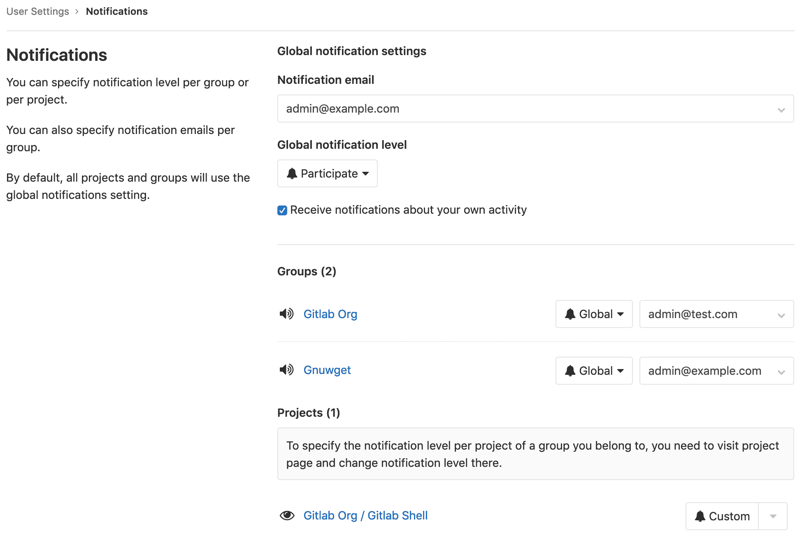
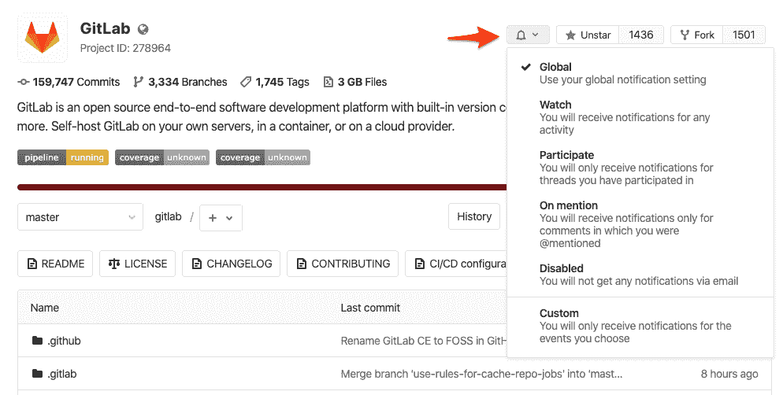
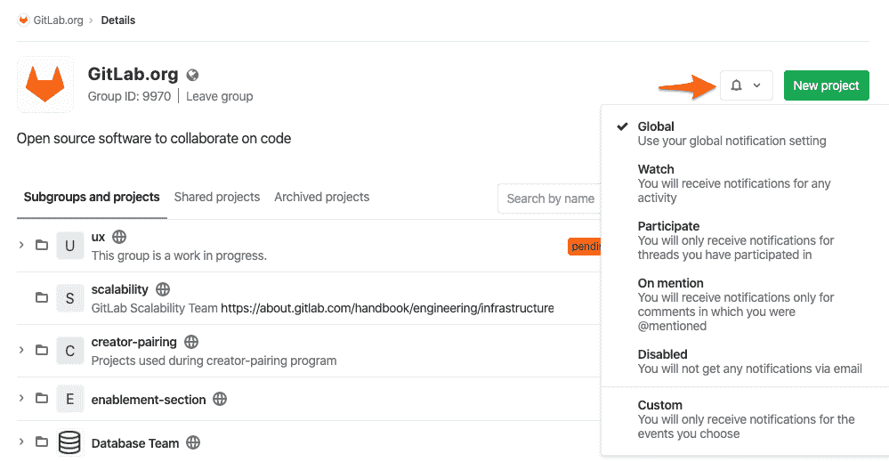

# GitLab Notification Emails

> 原文：[https://docs.gitlab.com/ee/user/profile/notifications.html](https://docs.gitlab.com/ee/user/profile/notifications.html)

*   [Receiving notifications](#receiving-notifications)
*   [Tuning your notifications](#tuning-your-notifications)
    *   [Editing notification settings](#editing-notification-settings)
*   [Global notification settings](#global-notification-settings)
    *   [Notification scope](#notification-scope)
        *   [Project notifications](#project-notifications)
        *   [Group notifications](#group-notifications)
            *   [Group notification level](#group-notification-level)
            *   [Group notification email address](#group-notification-email-address)
    *   [Notification levels](#notification-levels)
*   [Notification events](#notification-events)
*   [Issue / Epics / Merge request events](#issue--epics--merge-request-events)
*   [Filtering email](#filtering-email)
    *   [X-GitLab-NotificationReason](#x-gitlab-notificationreason)

# GitLab Notification Emails

GitLab 通知使您可以随时了解 GitLab 中发生的事情. 启用通知后，您可以接收有关问题，合并请求和史诗活动的更新. 通知通过电子邮件发送.

## Receiving notifications

您将由于以下原因之一收到通知：

*   您参与发行，合并请求或史诗. 在这种情况下， *参与*意味着评论或编辑.
*   You enable notifications in an issue, merge request, or epic. To enable notifications, click the **Notifications** toggle in the sidebar to *on*.

启用通知后，您将收到有关该问题，合并请求或史诗中发生的操作的通知.

**注意：**通知可能会被管理员阻止，从而阻止发送通知.

## Tuning your notifications

通知的数量可能是巨大的. GitLab 允许您调整收到的通知. 例如，您可能希望收到有关特定项目中所有活动的通知，而对于其他项目，仅当您的名字被提及时才得到通知.

您可以通过组合通知设置来调整收到的通知：

*   [Global notification settings](#global-notification-settings)
*   [Notification scope](#notification-scope)
*   [Notification levels](#notification-levels)

### Editing notification settings

编辑通知设置：

1.  点击您的个人资料图片，然后选择**设置** .
2.  点击左侧边栏中的**通知** .
3.  编辑所需的通知设置. 编辑的设置将自动保存并启用.

这些通知设置仅适用于您. 它们不会影响同一项目或组中其他任何人收到的通知.

## Global notification settings

**全局通知设置**是默认设置，除非您为项目或组选择不同的值.

*   通知电子邮件
    *   这是您的通知将发送到的电子邮件地址.
*   全局通知级别
    *   这是适用于所有通知的默认[通知级别](#notification-levels) .
*   接收有关您自己的活动的通知.
    *   如果您想接收有关自己活动的通知，请选中此复选框. 默认值：未选中.

### Notification scope

您可以通过为每个项目和组选择不同的通知级别来调整通知的范围.

通知范围按优先级顺序应用（从高到低）：

*   Project
    *   对于每个项目，您可以选择一个通知级别. 您的项目设置将覆盖组设置.
*   Group
    *   对于每个组，您可以选择一个通知级别. 您的群组设置会覆盖您的默认设置.
*   全局（默认）
    *   如果尚未为发生活动的项目或组选择通知级别，则将应用全局或*默认*通知级别.

#### Project notifications

您可以为每个项目选择一个通知级别. 如果您需要密切监视选定项目中的活动，这将很有用.

要为项目选择通知级别，请使用以下两种方法之一：

1.  点击您的个人资料图片，然后选择**设置** .
2.  点击左侧边栏中的**通知** .
3.  在" **项目"**部分中找到该项目.
4.  选择所需的[通知级别](#notification-levels) .

Or:

1.  导航到项目页面.
2.  单击带有下拉图标的通知下拉列表.
3.  选择所需的[通知级别](#notification-levels) .

有关如何在有新版本发布时通知的演示，请参阅[发布通知](https://www.youtube.com/watch?v=qyeNkGgqmH4) .

#### Group notifications

您可以为每个组选择通知级别和电子邮件地址.

##### Group notification level

要为组选择通知级别，请使用以下两种方法之一：

1.  点击您的个人资料图片，然后选择**设置** .
2.  点击左侧边栏中的**通知** .
3.  在" **组"**部分中找到该项目.
4.  选择所需的[通知级别](#notification-levels) .

* * *

1.  导航到组的页面.
2.  单击带有下拉图标的通知下拉列表.
3.  选择所需的[通知级别](#notification-levels) .

##### Group notification email address

在 GitLab 12.0 中引入

您可以选择一个电子邮件地址，以接收您所属的每个组的通知. 例如，如果您是自由职业者，并且希望将有关客户项目的电子邮件分开存放，这可能会很有用.

1.  点击您的个人资料图片，然后选择**设置** .
2.  点击左侧边栏中的**通知** .
3.  在" **组"**部分中找到该项目.
4.  选择所需的电子邮件地址.

### Notification levels

对于每个项目和组，您可以选择以下级别之一：

| Level | Description |
| --- | --- |
| Global | 您的全局设置适用. |
| Watch | 接收任何活动的通知. |
| 提一下 | `@mentioned`在评论中`@mentioned`接收通知. |
| Participate | 接收有关您参与的线程的通知. |
| Disabled | 关闭通知. |
| Custom | 接收有关自定义选定事件的通知. |

## Notification events

将通知用户以下事件：

| Event | 发给 | 设定等级 |
| --- | --- | --- |
| 添加了新的 SSH 密钥 | User | 安全电子邮件，始终发送. |
| 添加了新电子邮件 | User | 安全电子邮件，始终发送. |
| 电邮已变更 | User | 安全电子邮件，始终发送. |
| 密码已更改 | User | 安全电子邮件，始终发送. |
| 新用户创建 | User | 在创建用户时发送，但 OmniAuth（LDAP）除外 |
| 用户已添加到项目 | User | 将用户添加到项目时发送 |
| 项目访问权限级别已更改 | User | 更改用户项目访问级别时发送 |
| 用户已添加到组 | User | 将用户添加到组时发送 |
| 群组访问权限级别已更改 | User | 更改用户组访问级别时发送 |
| 项目已移 | 项目成员（1） | （1）不禁用 |
| 新品发布 | 项目成员 | 自定义通知 |

## Issue / Epics / Merge request events

在以下大多数情况下，通知将发送到：

*   Participants:
    *   发行/合并请求的作者和受让人
    *   关于问题/合并请求的评论的作者
    *   `@username`在问题，合并请求或史诗的标题或描述中提到的任何人
    *   `@username`在有关问题，合并请求或史诗的任何评论中提及的"参与"或更高通知级别的任何人
*   观察者：通知级别为"观察"的用户
*   订阅者：手动订阅问题，合并请求或史诗的任何人
*   自定义：通知级别为"自定义"的用户针对下表中显示的任何事件打开了通知

**注意：**为了最大程度地减少不需要任何操作的通知的数量，从[GitLab 12.9 起](https://gitlab.com/gitlab-org/gitlab/-/issues/616) ，不再为项目中的所有活动通知合格的批准者. 要接收它们，他们必须将其用户通知设置更改为" **观看"** .

| Event | 发给 |
| --- | --- |
| 新问题 |   |
| 结束期 |   |
| 重新分配问题 | 以上，加上旧的受让人 |
| 重新打开问题 |   |
| 到期问题 | 选择此事件的参与者和自定义通知级别 |
| 更改里程碑问题 | 选择了此事件的订户，提及的参与者和自定义通知级别 |
| 消除里程碑问题 | 选择了此事件的订户，提及的参与者和自定义通知级别 |
| 新合并请求 |   |
| 推送合并请求 | 选择此事件的参与者和自定义通知级别 |
| 重新分配合并请求 | 以上，加上旧的受让人 |
| 关闭合并请求 |   |
| 重新打开合并请求 |   |
| 合并合并请求 |   |
| 更改里程碑合并请求 | 选择了此事件的订户，提及的参与者和自定义通知级别 |
| 删除里程碑合并请求 | 选择了此事件的订户，提及的参与者和自定义通知级别 |
| 新评论 | 以上内容，加上评论中`@username`提及的任何人，通知级别为"提及"或更高 |
| 管道失败 | 管道的作者 |
| 固定管道 | 管道的作者. 默认启用. 在 GitLab 13.1 中[引入](https://gitlab.com/gitlab-org/gitlab/-/issues/24309) . 管理员可以使用`ci_pipeline_fixed_notifications` [功能标记](../../administration/feature_flags.html)禁用此通知选项. |
| 成功的管道 | 管道的作者（如果他们具有成功管道的自定义通知设置）. 如果管道先前失败，则将为失败后的第一个成功管道发送`Fixed pipeline`消息，然后为任何进一步成功的管道发送`Successful pipeline`消息. |
| 新史诗 |   |
| 接近史诗 |   |
| 重新开启史诗 |   |

此外，如果发布或合并请求的标题或描述发生了更改，则通知将通过`@username`发送到任何**新**提及的内容，就像在原始文本中提到的一样.

您不会收到有关您自己创建的问题，合并请求或里程碑的通知（除非由于问题而定）. 仅当其他人对您创建或提及的内容进行评论或添加更改时，您才会收到自动通知.

如果开放的合并请求由于冲突而变得不可合并，则将通知其原因. 如果用户还将合并请求设置为一旦管道成功就自动合并，则该用户也会收到通知.

## Filtering email

通知电子邮件包括特定于 GitLab 的标题. 您可以根据这些标头的内容过滤通知电子邮件，以更好地管理您的通知. 例如，您可以过滤特定项目的所有电子邮件，在该项目中您将被分配合并请求或问题.

下表列出了所有特定于 GitLab 的电子邮件标题：

| Header | Description |
| --- | --- |
| `X-GitLab-Group-Id` | 组的 ID. 仅在史诗的通知电子邮件中显示. |
| `X-GitLab-Group-Path` | 组的路径. 仅在史诗的通知电子邮件中显示. |
| `X-GitLab-Project` | 通知所属的项目的名称. |
| `X-GitLab-Project-Id` | 项目的 ID. |
| `X-GitLab-Project-Path` | 项目的路径. |
| `X-GitLab-(Resource)-ID` | 通知所针对的资源的 ID. 该资源例如可以是`Issue` ， `MergeRequest` ， `Commit`或其他此类资源. |
| `X-GitLab-Discussion-ID` | 注释所属的线程的 ID，用于注释的通知电子邮件中. |
| `X-GitLab-Pipeline-Id` | 通知所针对的管道的 ID，在管道的通知电子邮件中. |
| `X-GitLab-Reply-Key` | 支持通过电子邮件回复的唯一令牌. |
| `X-GitLab-NotificationReason` | 通知原因. 可以`mentioned` ， `assigned`或`own_activity` . |
| `List-Id` | The path of the project in an RFC 2919 mailing list identifier. This is useful for email organization with filters, for example. |

### X-GitLab-NotificationReason

`X-GitLab-NotificationReason`标头包含`X-GitLab-NotificationReason`的原因. 该值是按优先级顺序的以下值之一：

*   `own_activity`
*   `assigned`
*   `mentioned`

通知的原因也包含在通知电子邮件的页脚中. 例如有原因的电子邮件`assigned`都会有这句话的注脚：

*   `You are receiving this email because you have been assigned an item on <configured GitLab hostname>.`

**注意：**正在考虑将其他事件的通知包含在`X-GitLab-NotificationReason`标头中. 有关详细信息，请参见此[相关问题](https://gitlab.com/gitlab-org/gitlab/-/issues/20689) .