# Search through GitLab

> 原文：[https://docs.gitlab.com/ee/user/search/](https://docs.gitlab.com/ee/user/search/)

*   [Issues and merge requests](#issues-and-merge-requests)
    *   [Issues and MRs assigned to you or created by you](#issues-and-mrs-assigned-to-you-or-created-by-you)
    *   [Filtering issue and merge request lists](#filtering-issue-and-merge-request-lists)
    *   [Filtering by **None** / **Any**](#filtering-by-none--any)
    *   [Searching for specific terms](#searching-for-specific-terms)
    *   [Filtering by ID](#filtering-by-id)
    *   [Filtering merge requests by approvers](#filtering-merge-requests-by-approvers-starter)
    *   [Filtering merge requests by “approved by”](#filtering-merge-requests-by-approved-by-starter)
*   [Filters autocomplete](#filters-autocomplete)
*   [Search history](#search-history)
*   [Removing search filters](#removing-search-filters)
*   [Filtering with multiple filters of the same type](#filtering-with-multiple-filters-of-the-same-type)
*   [Shortcut](#shortcut)
*   [To-Do List](#to-do-list)
*   [Projects](#projects)
*   [Groups](#groups)
*   [Issue Boards](#issue-boards)
*   [Advanced Global Search](#advanced-global-search-starter)
*   [Advanced Syntax Search](#advanced-syntax-search-starter)

# Search through GitLab

## Issues and merge requests

要搜索问题并合并多个项目中的请求，可以使用屏幕右上角的" **问题"**或" **合并请求"**链接.

它们两者都以相同的方式工作，因此，以下说明对两者均有效.

右边显示的数字代表分配给您的问题和合并请求的数量.

[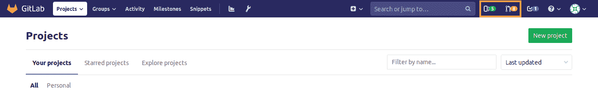](img/dashboard_links.png)

点击**问题时** ，您会立即看到分配给您的未解决问题：

[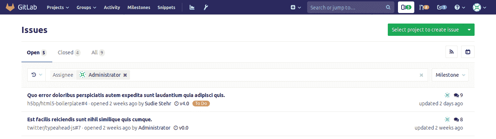](img/issues_assigned_to_you.png)

You can search through **Open**, **Closed**, or **All** issues.

您还可以使用搜索和过滤器字段过滤结果，如下面的[过滤问题和合并请求列表中所述](#filtering-issue-and-merge-request-lists) .

### Issues and MRs assigned to you or created by you

您还可以在屏幕右上角的搜索字段中找到问题的快捷方式，并合并由您创建或分配给您的请求：

### Filtering issue and merge request lists

请按照以下步骤筛选项目和组中的" **问题**和**合并请求"**列表页面：

1.  单击字段**搜索或过滤结果…** .
2.  在出现的下拉菜单中，选择您要过滤的属性：
    *   作者
    *   受让人
    *   [里程碑](../project/milestones/index.html)
    *   释放
    *   [标签](../project/labels.html)
    *   我的反应
    *   机密
    *   Epic（在 GitLab 12.9 中[引入](https://gitlab.com/gitlab-org/gitlab/-/issues/195704) ），包括[儿童史诗](../group/epics/index.html#multi-level-child-epics-ultimate) （在[GitLab Ultimate](https://about.gitlab.com/pricing/) 13.0 中[引入](https://gitlab.com/gitlab-org/gitlab/-/issues/9029) ）
    *   搜索此文字
3.  选择或键入用于过滤属性的运算符. 可以使用以下运算符：
    *   `=` ：是
    *   `!=` ：不是（在 GitLab 12.7 中[引入](https://gitlab.com/gitlab-org/gitlab/-/issues/18059) ）
4.  输入文本以按[过滤属性](#filters-autocomplete) .
5.  重复此过程以按多个属性进行过滤. 多个属性通过逻辑`AND` .

例如，按作者`=` Jane 和 Milestone `!=` 12.6 进行过滤，以解决 Jane 是作者而里程碑不是 12.6 的问题.

[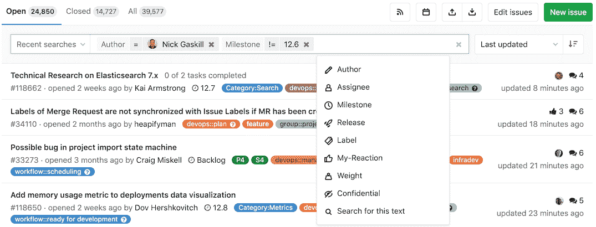](img/issue_search_filter_v12_7.png)

### Filtering by **None** / **Any**

一些过滤字段（例如里程碑和受让人）允许您按**None**或**Any**进行过滤.

[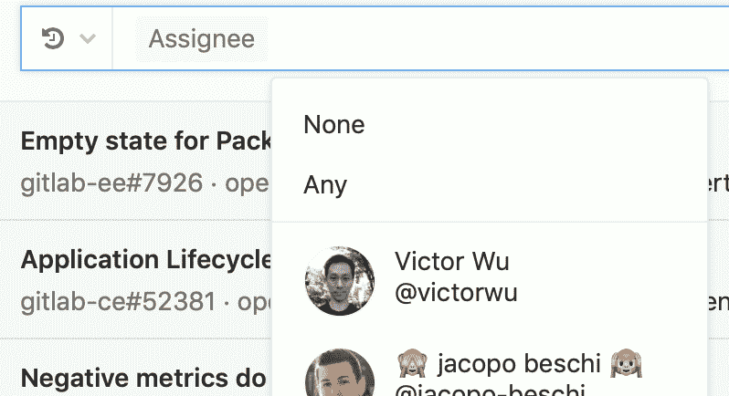](img/issues_filter_none_any.png)

选择" **无"**将返回该字段为空值的结果. 例如：没有里程碑，没有受让人.

选择" **任意** "则相反. 它返回该字段具有非空值的结果.

### Searching for specific terms

您可以按标题或说明中包含的特定术语过滤问题并合并请求.

*   Syntax
    *   搜索以任何顺序查找查询中的所有单词. 例如：搜索问题以寻找`display bug` ，将以任何顺序返回匹配这两个单词的所有问题.
    *   要找到确切的术语，请使用双引号： `"display bug"`
*   Limitation
    *   出于性能原因，少于 3 个字符的术语将被忽略. 例如：搜索问题`included in titles`是一样`included titles`
    *   每个查询只能搜索 4096 个字符和 64 个字词.

[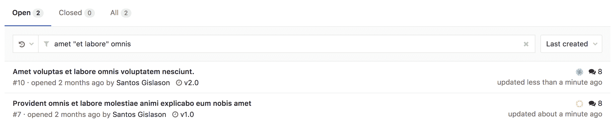](img/issue_search_by_term.png)

### Filtering by ID

在 GitLab 12.1 中[引入](https://gitlab.com/gitlab-org/gitlab-foss/-/issues/39908) .

您可以按 ID 将" **问题"**列表过滤到单个实例. 例如，输入过滤器`#10`仅返回问题 10.这同样适用于" **合并请求"**列表. 输入过滤器`#30`以仅返回合并请求 30.

[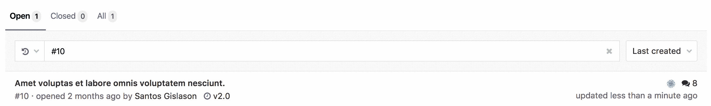](img/issue_search_by_id.png)

### Filtering merge requests by approvers

[Introduced](https://gitlab.com/gitlab-org/gitlab/-/merge_requests/9468) in [GitLab Starter](https://about.gitlab.com/pricing/) 11.9.

要过滤单个批准者的合并请求，您可以键入（或从下拉列表中选择） **批准者**并选择用户.

[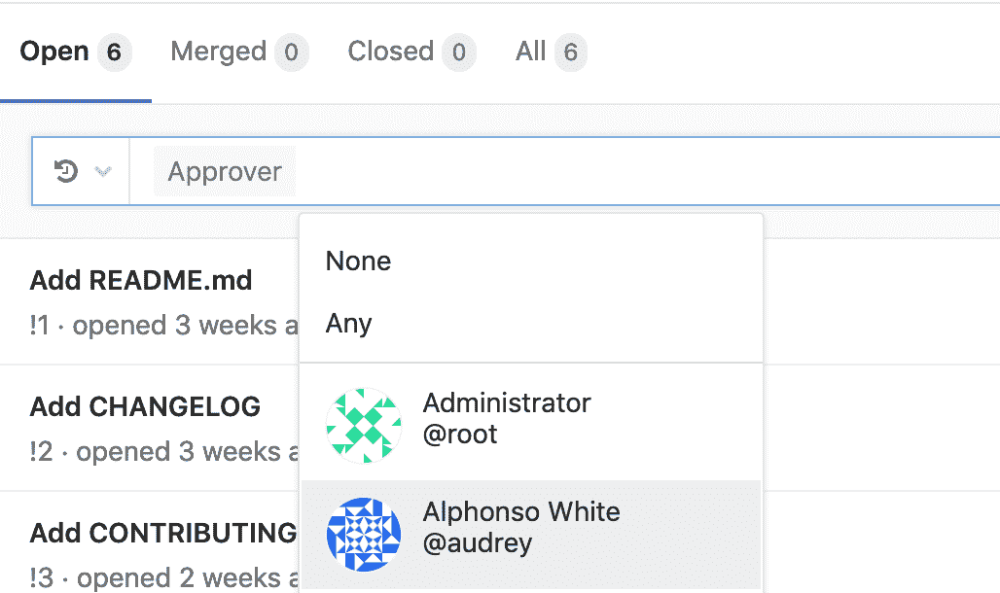](img/filter_approver_merge_requests.png)

### Filtering merge requests by “approved by”

[Introduced](https://gitlab.com/gitlab-org/gitlab/-/merge_requests/30335) in [GitLab Starter](https://about.gitlab.com/pricing/) 13.0.

要过滤已由特定个人批准的合并请求，您可以键入（或从下拉列表中选择）" **批准"，**然后选择用户.

[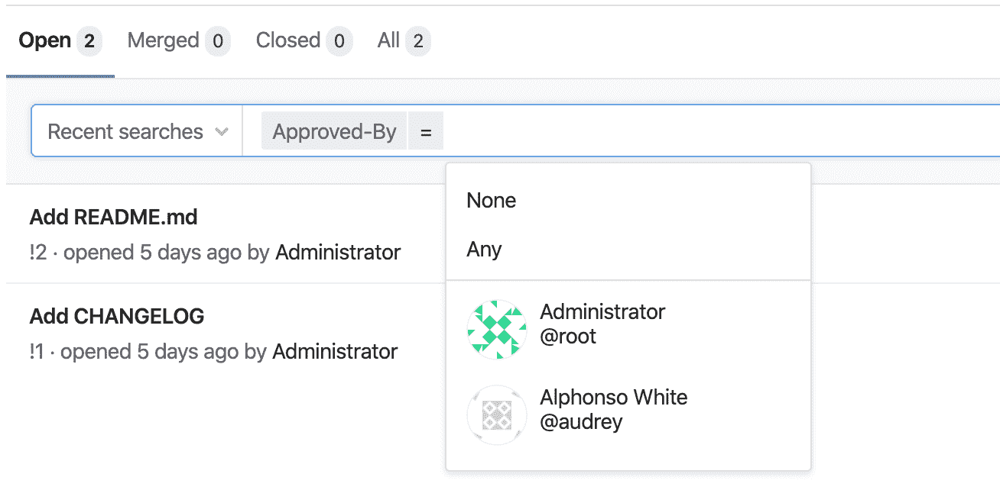](img/filter_approved_by_merge_requests_v13_0.png)

## Filters autocomplete

GitLab 在许多页面（问题，合并请求，史诗和管道等）中提供了许多过滤器，您可以使用它们来缩小搜索范围. 使用过滤器功能时，可以开始键入字符以显示相关用户或其他属性.

为了优化性能，至少需要三个字符才能开始搜索. 例如，如果您要搜索受让人" Simone Presley"的问题，则您需要至少键入" Sim"，然后自动完成才能给出任何相关结果.

## Search history

您可以通过单击搜索输入左侧的小箭头图标来查看最近的搜索. 单击搜索条目以再次运行该搜索. 此功能可用于问题和合并请求. 搜索结果存储在本地浏览器中.

[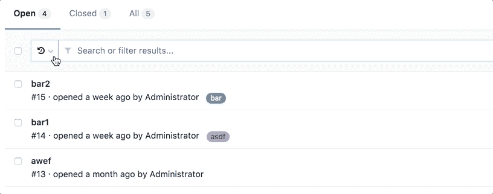](img/search_history.gif)

## Removing search filters

单击过滤器的（x）按钮或退格可以删除单个过滤器. 整个搜索过滤器可以通过点击搜索框的（X）按钮，或通过`⌘`键`（Mac）+⌫`被清除.

要一次删除一个过滤器令牌，可以使用`⌥` （Mac）/ `Ctrl` + `⌫`键盘组合.

## Filtering with multiple filters of the same type

某些过滤器可以多次添加. 这些包括但不限于受让人和标签. 当使用相同类型的多个过滤器进行过滤时，将应用"与"逻辑. 例如，如果您要过滤`assignee:@sam assignee:@sarah` ，那么您的结果将仅包含将受让人分配给 Sam 和 Sarah 的条目.

[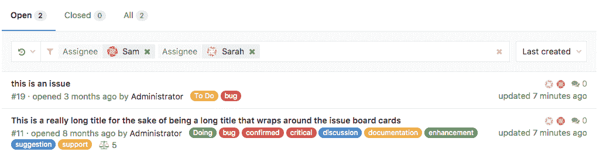](img/multiple_assignees.png)

## Shortcut

您还可以在项目仪表板右上方的搜索字段中找到快捷方式，以快速访问问题并合并在该项目中创建或分配给您的请求：

## To-Do List

可以通过"待办事项"和"完成"来搜索您[的待办事项列表](../todos.html#gitlab-to-do-list) . 您可以按项目，作者，类型和操作[过滤](../todos.html#filtering-your-to-do-list)它们. 另外，您可以按[**标签优先级**](../../user/project/labels.html#label-priority) ， **最后创建**和**最早创建**对其进行排序.

## Projects

您可以从左侧菜单中搜索项目，方法是依次点击菜单栏和**项目** . 在" **按名称过滤** "字段上，输入要查找的项目或组名称，GitLab 会在您键入时为您过滤它们.

你也可以去找你的项目[出演](../project/index.html#star-a-project) （ **加星标的项目** ），并**探索**所有的公共和内部项目 GitLab.com 可用，从中你可以通过可视性筛选，通过**趋势** ，最好与**大多数明星**评分，或他们的**全部** .

您还可以按**名称** ， **最后创建** ， **最旧创建** ， **最后更新** ， **最新更新** ， **所有者**对它们进行排序，并选择隐藏或显示**已归档的项目** ：

[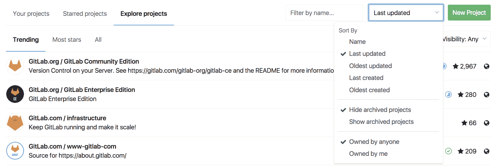](img/sort_projects.png)

## Groups

Similarly to [projects search](#projects), you can search through your groups from the left menu, by clicking the menu bar, then **Groups**.

在" **按名称过滤** "字段上，输入要查找的组名，GitLab 将在您键入时为您过滤它们.

您也可以**浏览**所有的公共和 GitLab.com 可用的内部组，您可以按照**最新创建的** ， **最早建立** ， **最后更新** ，或**最早的更新** .

## Issue Boards

在[问题板上](../../user/project/issue_board.html) ，您可以按**作者** ， **受让人** ， **里程碑**和**标签**过滤问题. 您还可以从键入时加载的字段中**按名称过滤** （按名称）（问题标题）.

当您要搜索要添加到**问题**面板中列表中的问题时，请点击屏幕右上角的**添加问题**按钮，打开一个模态窗口，除了按**名称**过滤它们之外，您还可以从中找到一个模式窗口**作者** ， **受让人** ， **里程碑**和**标签** ，选择多个问题以添加到您选择的列表中：

[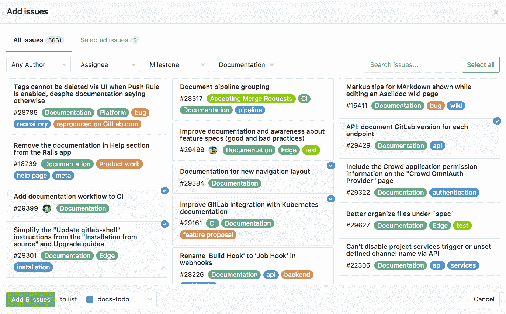](img/search_issues_board.png)

## Advanced Global Search

利用 Elasticsearch 在整个 GitLab 实例上进行更快，更高级的代码搜索.

[Learn how to use the Advanced Global Search.](advanced_global_search.html)

## Advanced Syntax Search

使用高级查询获得更具针对性的搜索结果.

[Learn how to use the Advanced Syntax Search.](advanced_search_syntax.html)