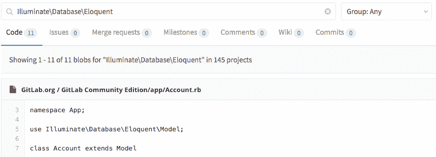

# Advanced Global Search

> 原文：[https://docs.gitlab.com/ee/user/search/advanced_global_search.html](https://docs.gitlab.com/ee/user/search/advanced_global_search.html)

*   [Overview](#overview)
*   [Use cases](#use-cases)
    *   [Faster searches](#faster-searches)
    *   [Promote innersourcing](#promote-innersourcing)
*   [Searching globally](#searching-globally)

# Advanced Global Search

版本历史

*   在 GitLab [Starter](https://about.gitlab.com/pricing/) 8.4 中[引入](https://gitlab.com/gitlab-org/gitlab/-/merge_requests/109) .

**GitLab.com 的可用性：**高级全局搜索（由 Elasticsearch 支持）在 GitLab.com 上尚不可用. 它将在 2020 年第三季度为所有付费群体逐步启用.请[遵循此史诗](https://gitlab.com/groups/gitlab-com/-/epics/649) ，以获取时间表上的最新更新.

利用 Elasticsearch 在整个 GitLab 实例上进行更快，更高级的代码搜索.

这是用户文档. 要安装和配置 Elasticsearch，请访问[管理员文档](../../integration/elasticsearch.html) .

## Overview

GitLab 中的 Advanced Global Search 是一项功能强大的搜索服务，可以节省您的时间. 现在，您可以在其他团队中搜索可以为您自己的项目提供帮助的代码，而不必创建重复的代码和浪费时间.

manbetx 客户端打不开利用[Elasticsearch](https://www.elastic.co/elasticsearch/)的搜索功能，并在搜索时启用它：

*   Projects
*   Repositories
*   Commits
*   Issues
*   合并要求
*   Milestones
*   注释（评论）
*   Snippets
*   Wiki

## Use cases

高级全局搜索在各种情况下都非常有用.

### Faster searches

如果您要处理大量数据，并希望保持 GitLab 的快速搜索，高级全局搜索将帮助您实现这一目标.

### Promote innersourcing

您的公司可能由许多不同的开发人员团队组成，每个开发人员团队都有各自的团队来托管各种项目. 您的某些应用程序可能会相互连接，因此您的开发人员需要立即在整个 GitLab 实例中进行搜索并找到他们搜索的代码.

## Searching globally

像以前一样使用搜索，GitLab 会向您显示您有权访问的每个项目中的匹配代码.

您还可以使用提供一些有用查询的[高级语法搜索](advanced_search_syntax.html) .

**注意：** Elasticsearch 仅具有默认分支的数据. 这意味着，如果您转到存储库树并将分支从默认分支切换到其他分支，那么即使启用了 Elasticsearch，常规搜索也会提供搜索结果页面中的"代码"选项卡.