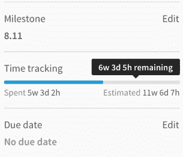
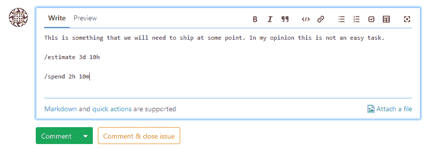

# Time Tracking

> 原文：[https://docs.gitlab.com/ee/user/project/time_tracking.html](https://docs.gitlab.com/ee/user/project/time_tracking.html)

*   [Overview](#overview)
*   [How to enter data](#how-to-enter-data)
    *   [Estimates](#estimates)
    *   [Time spent](#time-spent)
*   [Configuration](#configuration)
    *   [Limit displayed units to hours](#limit-displayed-units-to-hours-core-only)
*   [Other interesting links](#other-interesting-links)

# Time Tracking

在 GitLab 8.14 中引入.

时间跟踪允许您跟踪估计和花费在问题上的时间以及在 GitLab 中合并请求.

## Overview

时间跟踪使您能够：

*   记录处理问题或合并请求所花费的时间.
*   添加完成问题或合并请求所需时间的估计.

您不必输入估算值即可输入花费的时间，反之亦然.

有关时间跟踪的数据显示在问题/合并请求侧栏上，如下所示.

## How to enter data

时间跟踪使用了 GitLab 通过此新功能引入的两个[快速操作](quick_actions.html) ： `/spend`和`/estimate` .

快速操作既可以用于问题或合并请求的正文中，也可以用于问题或合并请求的注释中.

下面是一个示例，说明如何在评论中使用这些新的快速操作.

添加时间条目（花费的时间或估计的时间）仅限于项目成员.

### Estimates

要输入估算值，请输入`/estimate` ，然后输入时间. 例如，如果您需要输入 3 天 5 小时 10 分钟的估算值，则可以输入`/estimate 3d 5h 10m` . 我们支持的时间单位列在此帮助页面的底部.

每次输入新的时间估算值时，任何先前的时间估算值都将被该新值覆盖. 在发布或合并请求中应该只有一个有效的估计.

要完全删除估算，请使用`/remove_estimate` .

### Time spent

要输入花费的时间，请使用`/spend 3d 5h 10m` .

每个新花费的时间条目将被添加到当前用于发布或合并请求的总时间中.

您可以通过输入负数来减少时间： `/spend -3d`将从总花费时间中删除 3 天. 您所花费的时间不能少于 0 分钟，因此，如果您删除的时间量与已输入的时间相比更长，则 GitLab 将自动重置所花费的时间.

要删除一次花费的所有时间，请使用`/remove_time_spent` .

## Configuration

以下时间单位可用：

*   月（mo）
*   周（w）
*   Days (d)
*   小时（h）
*   分钟（米）

默认转换率是 1mo = 4w，1w = 5d 和 1d = 8h.

### Limit displayed units to hours

在 GitLab 12.1 中[引入](https://gitlab.com/gitlab-org/gitlab-foss/-/merge_requests/29469/) .

在 GitLab 自我管理实例中，可以通过**"** **本地化** **"**下**"管理">"设置">"首**选项"中的选项将时间单位的显示限制为小时.

启用此选项后，将显示`75h`而不是`1w 4d 3h` .

## Other interesting links

*   [Time Tracking landing page in the GitLab handbook](https://about.gitlab.com/solutions/time-tracking/)