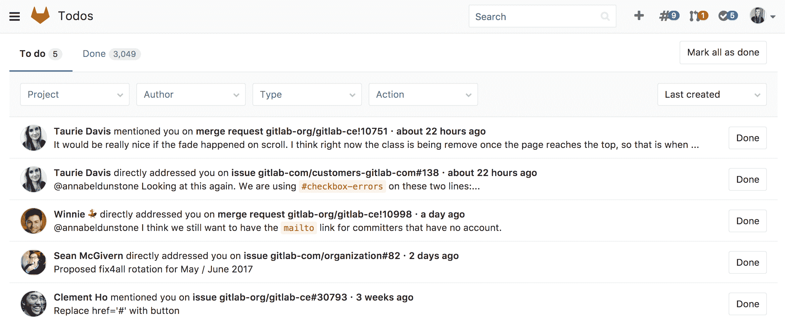
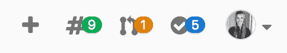
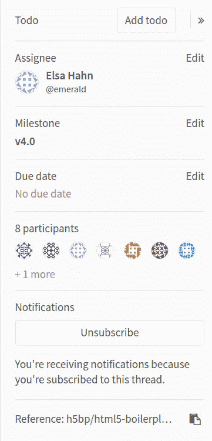
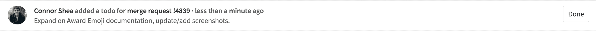
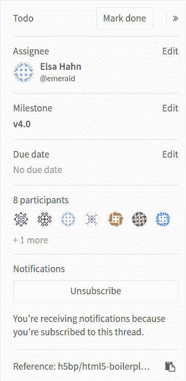

# GitLab To-Do List

> 原文：[https://docs.gitlab.com/ee/user/todos.html](https://docs.gitlab.com/ee/user/todos.html)

*   [What triggers a To Do](#what-triggers-a-to-do)
    *   [Directly addressing a To Do](#directly-addressing-a-to-do)
    *   [Manually creating a To Do](#manually-creating-a-to-do)
*   [Marking a To Do as done](#marking-a-to-do-as-done)
*   [Filtering your To-Do List](#filtering-your-to-do-list)

# GitLab To-Do List[](#gitlab-to-do-list "Permalink")

在 GitLab 8.5 中[引入](https://gitlab.com/gitlab-org/gitlab-foss/-/merge_requests/2817) .

当您登录到 GitLab 时，通常需要查看应该花些时间在哪里，采取一些措施或知道需要注意什么而无需大量电子邮件通知. GitLab 是您工作的地方，因此快速入门非常重要.

待办事项列表在一个简单的仪表板中按时间顺序列出了等待您输入的项目.

[](img/todos_index.png)

通过单击顶部导航中搜索栏旁边的对勾图标，可以快速访问待办事项列表. 如果计数为：

*   小于 100 的蓝色数字是待办事项的数量.
*   大于或等于 100，则数字显示为 99+. 确切的数字显示在"任务列表"上. 你还有空. 否则，该数字将显示为 99+. 确切的数字显示在"任务列表"上.

[](img/todos_icon.png)

## What triggers a To Do[](#what-triggers-a-to-do "Permalink")

在以下情况下，待办事项会显示在您的待办事项列表中：

*   分配或合并请求已分配给您
*   在以下内容的描述或评论中`@mentioned`您`@mentioned` ：
    *   问题
    *   合并请求
    *   史诗
*   在以下评论中`@mentioned`您：
    *   承诺
    *   设计
*   您的合并请求的 CI / CD 管道失败
*   由于冲突，一个打开的合并请求变得不可合并，并且满足以下条件之一：
    *   你是作者
    *   您是将其设置为在管道成功后自动合并的用户
*   [从 GitLab 13.2 开始](https://gitlab.com/gitlab-org/gitlab/-/issues/12136) ，合并请求将从[合并火车中](../ci/merge_request_pipelines/pipelines_for_merged_results/merge_trains/index.html)删除，您是添加请求的用户.

待办事项触发器不受[GitLab 通知电子邮件设置的影响](profile/notifications.html) .

**注意：**当用户不再有权访问与待办事项相关的资源（例如问题，合并请求，项目或组）时，出于安全原因，相关的待办事项将在下一小时内删除. 如果用户的访问被错误地取消，则删除操作会延迟以防止数据丢失.

### Directly addressing a To Do[](#directly-addressing-a-to-do "Permalink")

在 GitLab 9.0 中[引入](https://gitlab.com/gitlab-org/gitlab-foss/-/merge_requests/7926) .

如果在一行的开头提到您，则您收到的待办事项将列为"直接处理". 例如，在此注释中：

```
@alice What do you think? cc: @bob
 - @carol can you please have a look?
 >>>
@dan what do you think?
>>>

@erin @frank thank you! 
```

接收直接处理的待办事项的人是`@alice` ， `@erin`和`@frank` . 直接寻址的待办事项仅出于过滤目的而与提及事项有所不同； 否则，它们显示为正常.

### Manually creating a To Do[](#manually-creating-a-to-do "Permalink")

您还可以通过在以下位置单击" **添加待办事项"**按钮，将以下内容添加到"待办事项列表"：

*   Issue
*   合并请求
*   Epic

[](img/todos_add_todo_sidebar.png)

## Marking a To Do as done[](#marking-a-to-do-as-done "Permalink")

采取以下任何措施都会将相应的待办事项标记为已完成：

*   Issue
*   合并请求
*   Epic

取消待办事项的动作包括：

*   更换受让人
*   改变里程碑
*   添加/删除标签
*   对这个问题发表评论

Your To-Do List is personal, and items are only marked as done if the action comes from you. If you close the issue or merge request, your To Do is automatically marked as done.

为防止其他用户在不通知您的情况下关闭问题，如果其他人关闭，合并或对以下任何一项采取了措施，则您的待办事项将保持待处理状态：

*   Issue
*   合并要求
*   Epic

每种情况只有一个待办事项，因此在一个问题中提到用户一百次只会触发一个待办事项.

如果不需要采取任何措施，您可以通过单击相应的**"完成"**按钮来手动将"待办事项"标记为已完成，该按钮将从您的"待办事项列表"中消失.

[](img/todos_todo_list_item.png)

您还可以通过单击以下边栏中的" **标记为已完成"**按钮将"待办事项" **标记为已完成** ：

*   Issue
*   合并请求
*   Epic

[](img/todos_mark_done_sidebar.png)

您可以通过单击**全部标记为已完成**按钮将所有待办事项**标记为已完成** .

## Filtering your To-Do List[](#filtering-your-to-do-list "Permalink")

您可以在待办事项列表中使用四种过滤器.

| Filter | Description |
| --- | --- |
| Project | 按项目筛选 |
| Group | 按组筛选 |
| Author | 按触发待办事项的作者过滤 |
| Type | 按问题，合并请求，设计或史诗过滤 |
| Action | 按触发待办事项的动作过滤 |

您还可以同时按多个过滤条件之一进行过滤. [上面描述了](#what-triggers-a-to-do)可能的操作，包括：

*   任何行动
*   Assigned
*   Mentioned
*   Added
*   Pipelines
*   直接寻址