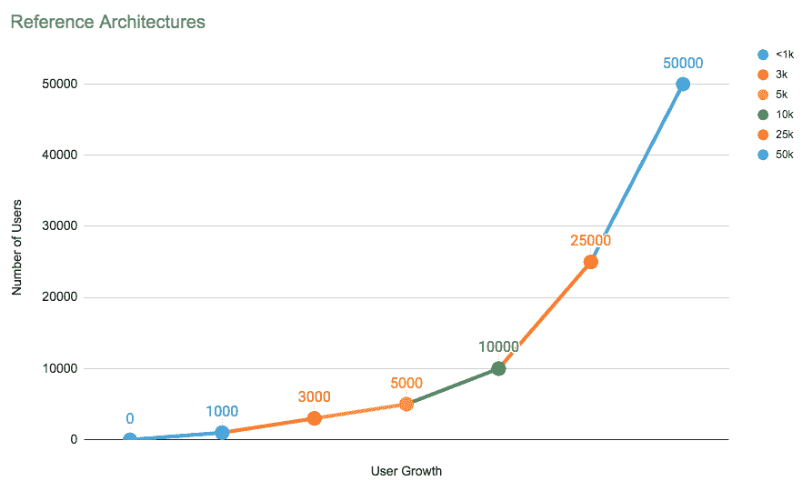

# Reference architectures

> 原文：[https://docs.gitlab.com/ee/administration/reference_architectures/](https://docs.gitlab.com/ee/administration/reference_architectures/)

*   [Available reference architectures](#available-reference-architectures)
*   [Availability Components](#availability-components)
    *   [Automated backups](#automated-backups-core-only)
    *   [Traffic load balancer](#traffic-load-balancer-starter-only)
    *   [Zero downtime updates](#zero-downtime-updates-starter-only)
    *   [Automated database failover](#automated-database-failover-premium-only)
    *   [Instance level replication with GitLab Geo](#instance-level-replication-with-gitlab-geo-premium-only)
*   [Configure GitLab to scale](#configure-gitlab-to-scale)
    *   [Configuring select components with Cloud Native Helm](#configuring-select-components-with-cloud-native-helm)
*   [Footnotes](#footnotes)

# Reference architectures

您可以在单个服务器上设置 GitLab 或扩展它以服务许多用户. 本页详细介绍了由 GitLab 的质量和支持团队构建和验证的推荐参考架构.

下面的图表表示每个体系结构层及其可处理的用户数量. 随着用户数量的增长，建议您相应地调整 GitLab.

这些参考架构的测试是使用[GitLab 的 Performance Tool](https://gitlab.com/gitlab-org/quality/performance)在特定的编码工作负载下进行的，用于测试的吞吐量是根据样本客户数据计算得出的. 选择适合您规模的参考架构后，请参考将[GitLab 配置为可缩放](#configure-gitlab-to-scale)以查看所涉及的组件以及如何配置它们.

每 1000 个用户使用以下每秒请求数（RPS）测试每种端点类型：

*   API：20 RPS
*   网络：2 RPS
*   转到：2 RPS

对于用户数少于 2,000 的 GitLab 实例，建议您通过在单个计算机上[安装 GitLab](../../install/README.html)来使用[默认设置](#automated-backups-core-only) ，以最大程度地减少维护和资源成本.

如果您的组织有 2000 多名用户，则建议将 GitLab 的组件扩展到多个机器节点. 机器节点按组件分组. 这些节点的增加提高了您的 GitLab 实例的性能和可伸缩性.

扩展 GitLab 时，需要考虑以下几个因素：

*   多个应用程序节点来处理前端流量.
*   前面添加了一个负载均衡器，以在应用程序节点之间分配流量.
*   应用程序节点连接到共享文件服务器以及后端的 PostgreSQL 和 Redis 服务.

**注意：**根据您的工作流程，以下建议的参考体系结构可能需要进行相应的调整. 您的工作负载受以下因素影响，这些因素包括用户的活跃程度，使用的自动化程度，镜像和存储库/更改大小. 此外，显示的内存值由[GCP 机器类型提供](https://cloud.google.com/compute/docs/machine-types) . 对于不同的云供应商，请尝试选择最匹配所提供架构的选项.

## Available reference architectures

提供以下参考体系结构：

*   [Up to 1,000 users](1k_users.html)
*   [Up to 2,000 users](2k_users.html)
*   [Up to 3,000 users](3k_users.html)
*   [Up to 5,000 users](5k_users.html)
*   [Up to 10,000 users](10k_users.html)
*   [Up to 25,000 users](25k_users.html)
*   [Up to 50,000 users](50k_users.html)

## Availability Components

GitLab 随附以下组件供您使用，从最小到最复杂列出：

1.  [Automated backups](#automated-backups-core-only)
2.  [Traffic load balancer](#traffic-load-balancer-starter-only)
3.  [Zero downtime updates](#zero-downtime-updates-starter-only)
4.  [Automated database failover](#automated-database-failover-premium-only)
5.  [Instance level replication with GitLab Geo](#instance-level-replication-with-gitlab-geo-premium-only)

在实现这些组件时，请从单个服务器开始，然后再进行备份. 仅在完成第一台服务器后，才可以继续执行下一个.

此外，不为 GitLab 实施额外的服务器并不一定意味着您将有更多的停机时间. 根据您的需求和经验水平，单个服务器可以为用户带来更多实际的正常运行时间.

### Automated backups

> *   复杂程度： **低**
> *   必需的领域知识：PostgreSQL，GitLab 配置，Git
> *   支持的级别： [GitLab Core，Starter，Premium 和 Ultimate](https://about.gitlab.com/pricing/)

该解决方案适用于具有默认 GitLab 安装的许多团队. 通过自动备份 GitLab 存储库，配置和数据库，如果您没有严格的要求，这可能是最佳的解决方案. [自动备份](../../raketasks/backup_restore.html#configuring-cron-to-make-daily-backups)的设置最简单. 这提供了预定时间表的时间点恢复.

### Traffic load balancer

> *   复杂程度： **中**
> *   必需的领域知识：HAProxy，共享存储，分布式系统
> *   支持的级别： [GitLab Starter，Premium 和 Ultimate](https://about.gitlab.com/pricing/)

这需要使用添加的[负载平衡器](../high_availability/load_balancer.html)将 GitLab 分离为多个应用程序节点. 负载平衡器将在 GitLab 应用程序节点之间分配流量. 同时，每个应用程序节点都连接到后端的共享文件服务器和数据库系统. 这样，如果其中一台应用程序服务器发生故障，则工作流不会中断. 建议使用[HAProxy](https://www.haproxy.org/)作为负载平衡器.

与默认安装相比，有了此添加的组件，您具有许多优点：

*   增加用户数量.
*   启用零停机时间升级.
*   提高可用性.

### Zero downtime updates

> *   复杂程度： **中**
> *   必需的领域知识：PostgreSQL，HAProxy，共享存储，分布式系统
> *   支持的级别： [GitLab Starter，Premium 和 Ultimate](https://about.gitlab.com/pricing/)

GitLab 支持[零停机时间更新](https://docs.gitlab.com/omnibus/update/) . 尽管您可以使用单个 GitLab 节点执行零停机时间更新，但是建议将 GitLab 分为几个应用程序节点. 只要每个组件中的至少一个在线且能够处理实例的使用负载，您的团队的生产力就不会在更新期间被打断.

### Automated database failover

> *   复杂程度： **高**
> *   必需的领域知识：PgBouncer，Repmgr 或 Patroni，共享存储，分布式系统
> *   支持的级别： [GitLab Premium 和 Ultimate](https://about.gitlab.com/pricing/)

通过为数据库系统添加自动故障转移，可以通过其他数据库节点来提高正常运行时间. 这将使用群集管理和故障转移策略扩展默认数据库. [建议将 PgBouncer 与 Repmgr 或 Patroni 结合使用](../postgresql/replication_and_failover.html) .

### Instance level replication with GitLab Geo

> *   复杂程度： **很高**
> *   必需的域知识：存储复制
> *   支持的级别： [GitLab Premium 和 Ultimate](https://about.gitlab.com/pricing/)

[GitLab Geo](../geo/replication/index.html)允许您将 GitLab 实例复制到其他地理位置，作为只读的完全可操作实例，如果发生灾难，也可以升级它.

## Configure GitLab to scale

**Note:** From GitLab 13.0, using NFS for Git repositories is deprecated. In GitLab 14.0, support for NFS for Git repositories is scheduled to be removed. Upgrade to [Gitaly Cluster](../gitaly/praefect.html) as soon as possible.

以下组件是您需要配置以扩展 GitLab 的组件. 如果您选择的[参考体系结构](#reference-architectures)要求它们，则按照通常配置它们的顺序列出它们.

它们大多数捆绑在 GitLab deb / rpm 软件包（称为 Omnibus GitLab）中，但是根据您的系统架构，您可能需要其中未包含的某些组件. 如果需要，应在设置 GitLab 提供的组件之前对其进行配置. 配置说明列中提供了有关如何为您的组织选择正确的解决方案的建议.

| Component | Description | 配置说明 | 与 Omnibus GitLab 捆绑在一起 |
| --- | --- | --- | --- |
| 负载均衡器（ [6](#footnotes) ） | 处理负载平衡，通常在您有多个 GitLab 应用程序服务节点时 | [Load balancer configuration](../high_availability/load_balancer.html) ([6](#footnotes)) | No |
| 对象存储服务（ [4](#footnotes) ） | 推荐的共享数据对象存储 | [Object Storage configuration](../object_storage.html) | No |
| NFS（ [5](#footnotes) ）（ [7](#footnotes) ） | 共享磁盘存储服务. 可以用作备用对象存储. GitLab 页面必需 | [NFS configuration](../high_availability/nfs.html) | No |
| [Consul](../../development/architecture.html#consul) ([3](#footnotes)) | Service discovery and health checks/failover | [Consul configuration](../high_availability/consul.html) | Yes |
| [PostgreSQL](../../development/architecture.html#postgresql) | Database | [PostgreSQL configuration](https://docs.gitlab.com/omnibus/settings/database.html) | Yes |
| [PgBouncer](../../development/architecture.html#pgbouncer) | 数据库连接池 | [PgBouncer configuration](../high_availability/pgbouncer.html#running-pgbouncer-as-part-of-a-non-ha-gitlab-installation) | Yes |
| Repmgr | PostgreSQL 集群管理和故障转移 | [PostgreSQL and Repmgr configuration](../postgresql/replication_and_failover.html) | Yes |
| Patroni | 替代的 PostgreSQL 集群管理和故障转移 | [PostgreSQL and Patroni configuration](../postgresql/replication_and_failover.html#patroni) | Yes |
| [Redis](../../development/architecture.html#redis) ([3](#footnotes)) | 键/值存储，用于快速查找和缓存数据 | [Redis configuration](../high_availability/redis.html) | Yes |
| Redis 前哨 | Redis | [Redis Sentinel configuration](../high_availability/redis.html) | Yes |
| [吉塔利](../../development/architecture.html#gitaly) （ [2](#footnotes) ）（ [7](#footnotes) ） | 提供对 Git 存储库的访问 | [Gitaly configuration](../gitaly/index.html#run-gitaly-on-its-own-server) | Yes |
| [Sidekiq](../../development/architecture.html#sidekiq) | 异步/后台作业 | [Sidekiq configuration](../high_availability/sidekiq.html) | Yes |
| [GitLab application services](../../development/architecture.html#unicorn)([1](#footnotes)) | Puma / Unicorn，Workhorse，GitLab Shell-服务于前端请求（UI，API，基于 HTTP / SSH 的 Git） | [GitLab app scaling configuration](../high_availability/gitlab.html) | Yes |
| [Prometheus](../../development/architecture.html#prometheus) and [Grafana](../../development/architecture.html#grafana) | GitLab 环境监控 | [Monitoring node for scaling](../high_availability/monitoring_node.html) | Yes |

### Configuring select components with Cloud Native Helm

我们还提供[Helm 图表](https://docs.gitlab.com/charts/)作为 GitLab 的 Cloud Native 安装方法. 对于参考体系结构，如果需要，可以以这种方式设置选择组件.

对于此类设置，我们支持在[高级配置](https://docs.gitlab.com/charts/)中使用图表，在这些[高级配置中](https://docs.gitlab.com/charts/) ，有状态后端组件（例如数据库或 Gitaly）可通过 Omnibus 或信誉良好的第三方服务在外部运行. 请注意，我们目前不支持通过 Helm *大规模*运行有状态组件.

设计这些环境时，应[参考](#available-reference-architectures)上面的相应[参考体系结构](#available-reference-architectures)以获取有关大小调整的指导. 通过 Helm 运行的组件将按类似比例缩放到其 Omnibus 规格，仅转换为 Kubernetes 资源.

例如，如果您要设置一个 50k 的安装，并且 Rails 节点在 Helm 中运行，那么应该为 Kubernetes 集群提供与 Omnibus 相同数量的资源，并且将 Rails 节点分解为多个较小的 Pod 跨集群.

## Footnotes

1.  在我们的体系结构中，我们使用 Puma Web 服务器运行每个 GitLab Rails 节点，并将其工作程序数量设置为 90％的可用 CPU 以及四个线程. 对于运行带有其他组件的 Rails 的节点，应该相应地降低 worker 的值，我们发现 50％达到了很好的平衡，但这取决于工作量.

2.  Gitaly 节点的要求取决于客户数据，特别是项目数量及其规模. 我们建议每个 Gitaly 节点应存储不超过 5TB 的数据，并且将[`gitaly-ruby`工作者](../gitaly/index.html#gitaly-ruby)的数量设置为可用 CPU 的 20％. 根据以上建议，应结合其他节点并结合对预期数据大小和分布的审查.

3.  推荐的 Redis 设置因架构的大小而异. 对于较小的体系结构（少于 3000 个用户），一个实例就足够了. 对于中型安装（3,000-5,000），我们建议为所有课程使用一个 Redis 集群，并且 Redis Sentinel 与 Consul 一起托管. 对于较大的体系结构（10,000 个或更多用户），我们建议分别为 Cache 类和队列和 Shared State 类运行一个单独的[Redis 群集](../redis/replication_and_failover.html#running-multiple-redis-clusters) . 我们还建议您为每个 Redis 群集分别运行 Redis Sentinel 群集.

4.  对于 LFS，Uploads，Artifacts 等数据对象.由于性能更好，我们建议尽可能在 NFS 上使用[对象存储服务](../object_storage.html) .

5.  NFS 可以用作对象存储的替代方法，但是出于性能考虑，通常不建议使用 NFS. 请注意，但是[GitLab Pages](https://gitlab.com/gitlab-org/gitlab-pages/-/issues/196)是必需的.

6.  我们的架构已通过[HAProxy](https://www.haproxy.org/)作为负载均衡器进行了测试和验证. 尽管也可以使用具有类似功能集的其他负载均衡器，但这些负载均衡器尚未经过验证.

7.  我们强烈建议为任何 Gitaly 或 NFS 节点设置 HDD 之上的 SSD 磁盘，其读操作的吞吐量至少为 8000 IOPS，写操作的吞吐量至少为 2,000 IOPS，因为这些组件的 I / O 繁重. 这些 IOPS 值仅建议作为启动器使用，因为随着时间的推移，它们可能会根据环境工作负载的规模而调整得更高或更低. 如果您正在 Cloud provider 上运行环境，则可能需要参考其文档以了解如何正确配置 IOPS.

8.  这些架构是使用 GCP 上的[Intel Xeon E5 v3（Haswell）](https://cloud.google.com/compute/docs/cpu-platforms) CPU 平台构建和测试的. 在不同的硬件上，您可能会发现需要对 CPU 或节点数进行相应的调整，无论是较低还是较高. 有关更多信息，请在[此处](https://gitlab.com/gitlab-org/quality/performance/-/wikis/Reference-Architectures/GCP-CPU-Benchmarks)找到 CPU 的[Sysbench](https://github.com/akopytov/sysbench)基准.