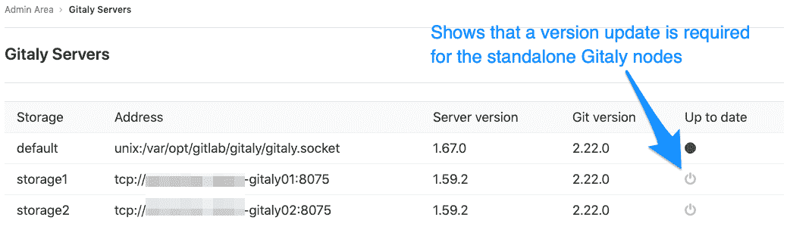

# Troubleshooting a reference architecture set up

> 原文：[https://docs.gitlab.com/ee/administration/reference_architectures/troubleshooting.html](https://docs.gitlab.com/ee/administration/reference_architectures/troubleshooting.html)

*   [Troubleshooting object storage](#troubleshooting-object-storage)
    *   [S3 API compatibility issues](#s3-api-compatibility-issues)
    *   [GitLab Pages requires NFS](#gitlab-pages-requires-nfs)
    *   [Incremental logging is required for CI to use object storage](#incremental-logging-is-required-for-ci-to-use-object-storage)
    *   [Proxy Download](#proxy-download)
    *   [ETag mismatch](#etag-mismatch)
*   [Troubleshooting Redis](#troubleshooting-redis)
*   [Troubleshooting Gitaly](#troubleshooting-gitaly)
    *   [Checking versions when using standalone Gitaly nodes](#checking-versions-when-using-standalone-gitaly-nodes)
    *   [`gitaly-debug`](#gitaly-debug)
    *   [Commits, pushes, and clones return a 401](#commits-pushes-and-clones-return-a-401)
    *   [Client side gRPC logs](#client-side-grpc-logs)
    *   [Observing `gitaly-ruby` traffic](#observing-gitaly-ruby-traffic)
    *   [Repository changes fail with a `401 Unauthorized` error](#repository-changes-fail-with-a-401-unauthorized-error)
    *   [Command line tools cannot connect to Gitaly](#command-line-tools-cannot-connect-to-gitaly)
    *   [Gitaly not listening on new address after reconfiguring](#gitaly-not-listening-on-new-address-after-reconfiguring)
    *   [Permission denied errors appearing in Gitaly logs when accessing repositories from a standalone Gitaly node](#permission-denied-errors-appearing-in-gitaly-logs-when-accessing-repositories-from-a-standalone-gitaly-node)
*   [Troubleshooting the GitLab Rails application](#troubleshooting-the-gitlab-rails-application)
*   [Troubleshooting Monitoring](#troubleshooting-monitoring)

# Troubleshooting a reference architecture set up[](#troubleshooting-a-reference-architecture-set-up "Permalink")

如果您遵循一种[参考体系结构，](index.html#reference-architectures)则此页面可作为故障排除文档.

## Troubleshooting object storage[](#troubleshooting-object-storage "Permalink")

### S3 API compatibility issues[](#s3-api-compatibility-issues "Permalink")

并非所有 S3 提供程序[都](../../raketasks/backup_restore.html#other-s3-providers)与 GitLab 使用的 Fog 库[完全兼容](../../raketasks/backup_restore.html#other-s3-providers) . 症状包括：

```
411 Length Required 
```

### GitLab Pages requires NFS[](#gitlab-pages-requires-nfs "Permalink")

如果您打算使用[GitLab 页面](../../user/project/pages/index.html) ，则当前需要[NFS](../high_availability/nfs.html) . 有[工作正在进行中](https://gitlab.com/gitlab-org/gitlab-pages/-/issues/196)去除这种依赖性. 将来，GitLab 页面可能会使用[对象存储](https://gitlab.com/gitlab-org/gitlab/-/issues/208135) .

对磁盘存储的依赖性还阻止了使用[GitLab Helm 图表](https://gitlab.com/gitlab-org/charts/gitlab/-/issues/37)部署 Pages.

### Incremental logging is required for CI to use object storage[](#incremental-logging-is-required-for-ci-to-use-object-storage "Permalink")

如果将 GitLab 配置为将对象存储用于 CI 日志和工件，则[还必须启用增量日志记录](../job_logs.html#new-incremental-logging-architecture) .

### Proxy Download[](#proxy-download "Permalink")

对象存储的许多使用情况都允许将客户端流量重定向到对象存储后端，例如当 Git 客户端通过 LFS 请求大文件时或在下载 CI 工件和日志时.

当文件存储在本地块存储或 NFS 上时，GitLab 必须充当代理. 对于对象存储，GitLab 的默认行为是重定向到对象存储设备，而不是代理请求.

`proxy_download`设置控制此行为：默认设置通常为`false` . 在每个用例的文档中对此进行验证. 将其设置为`true`可使 GitLab 代理文件而不是重定向.

当不代理文件时，GitLab 将返回[HTTP 302 重定向，该重定向带有预先签名的有时间限制的对象存储 URL](https://gitlab.com/gitlab-org/gitlab/-/issues/32117#note_218532298) . 这可能会导致以下一些问题：

*   如果 GitLab 使用非安全的 HTTP 访问对象存储，则客户端可能会生成`https->http`降级错误，并拒绝处理重定向. 解决方案是让 GitLab 使用 HTTPS. 例如，LFS 将产生此错误：

    ```
     LFS: lfsapi/client: refusing insecure redirect, https->http 
    ```

*   客户端将需要信任颁发对象存储证书的证书颁发机构，或者可能返回常见的 TLS 错误，例如：

    ```
     x509: certificate signed by unknown authority 
    ```

*   客户端将需要网络访问对象存储. 如果没有此访问权限，则可能导致的错误包括：

    ```
     Received status code 403 from server: Forbidden 
    ```

### ETag mismatch[](#etag-mismatch "Permalink")

Using the default GitLab settings, some object storage back-ends such as [MinIO](https://gitlab.com/gitlab-org/gitlab/-/issues/23188) and [Alibaba](https://gitlab.com/gitlab-org/charts/gitlab/-/issues/1564) might generate `ETag mismatch` errors.

使用 GitLab 直接上传时， [MinIO](https://gitlab.com/gitlab-org/charts/gitlab/-/issues/1564#note_244497658)的[解决方法](https://gitlab.com/gitlab-org/charts/gitlab/-/issues/1564#note_244497658)是在服务器上使用`--compat`参数.

我们正在致力于 GitLab 组件 Workhorse 的修复，同时，也正在尝试一种解决方法，以[允许禁用 ETag 验证](https://gitlab.com/gitlab-org/gitlab/-/merge_requests/18175) .

## Troubleshooting Redis[](#troubleshooting-redis "Permalink")

如果应用程序节点无法连接到 Redis 节点，请检查您的防火墙规则，并确保 Redis 可以接受端口`6379`下的 TCP 连接.

## Troubleshooting Gitaly[](#troubleshooting-gitaly "Permalink")

### Checking versions when using standalone Gitaly nodes[](#checking-versions-when-using-standalone-gitaly-nodes "Permalink")

使用独立的 Gitaly 节点时，必须确保它们与 GitLab 的版本相同，以确保完全兼容. 检查您的 GitLab 实例上的**管理区域> Gitaly 服务器** ，并确认所有 Gitaly 服务器都是`Up to date` .

[](../gitaly/img/gitlab_gitaly_version_mismatch_v12_4.png)

### `gitaly-debug`[](#gitaly-debug "Permalink")

`gitaly-debug`命令提供用于" Gitaly"和" Git"性能的"生产调试"工具. 它旨在帮助生产工程师和支持工程师调查 Gitaly 性能问题.

如果您使用的是 GitLab 11.6 或更高版本，则此工具应已安装在您的 GitLab / Gitaly 服务器上，位于`/opt/gitlab/embedded/bin/gitaly-debug` . 如果要研究旧版本的 GitLab，可以离线编译此工具，然后将可执行文件复制到服务器：

```
git clone https://gitlab.com/gitlab-org/gitaly.git
cd cmd/gitaly-debug
GOOS=linux GOARCH=amd64 go build -o gitaly-debug 
```

要查看`gitaly-debug`的帮助页面以`gitaly-debug`受支持的子命令列表，请运行：

```
gitaly-debug -h 
```

### Commits, pushes, and clones return a 401[](#commits-pushes-and-clones-return-a-401 "Permalink")

```
remote: GitLab: 401 Unauthorized 
```

您将需要将`gitlab-secrets.json`文件与 GitLab 应用程序节点同步.

### Client side gRPC logs[](#client-side-grpc-logs "Permalink")

Gitaly 使用[gRPC](https://grpc.io/) RPC 框架. Ruby gRPC 客户端具有自己的日志文件，当您看到 Gitaly 错误时，该文件可能包含有用的信息. 您可以使用`GRPC_LOG_LEVEL`环境变量控制 gRPC 客户端的日志级别. 默认级别为`WARN` .

您可以使用以下命令运行 gRPC 跟踪：

```
sudo GRPC_TRACE=all GRPC_VERBOSITY=DEBUG gitlab-rake gitlab:gitaly:check 
```

### Observing `gitaly-ruby` traffic[](#observing-gitaly-ruby-traffic "Permalink")

[`gitaly-ruby`](../gitaly/index.html#gitaly-ruby)是[`gitaly-ruby`](../gitaly/index.html#gitaly-ruby)的内部实现细节，因此，对`gitaly-ruby`流程内部发生的情况`gitaly-ruby` .

如果已设置 Prometheus 来抓取 Gitaly 进程，则可以通过查询`grpc_client_handled_total`来`grpc_client_handled_total` `gitaly-ruby`各个 RPC 的请求率和错误代码. 严格来说，此度量标准并未区分`gitaly-ruby`和其他 RPC，但实际上（自 GitLab 11.9 起），Gitaly 本身进行的所有 gRPC 调用都是从 Gitaly 主过程到其`gitaly-ruby`边车之一的内部调用.

假设您的`grpc_client_handled_total`计数器仅观察到 Gitaly，以下查询将显示 RPC 在内部（最有可能）实现为对`gitaly-ruby`调用：

```
sum(rate(grpc_client_handled_total[5m])) by (grpc_method) > 0 
```

### Repository changes fail with a `401 Unauthorized` error[](#repository-changes-fail-with-a-401-unauthorized-error "Permalink")

If you’re running Gitaly on its own server and notice that users can successfully clone and fetch repositories (via both SSH and HTTPS), but can’t push to them or make changes to the repository in the web UI without getting a `401 Unauthorized` message, then it’s possible Gitaly is failing to authenticate with the other nodes due to having the wrong secrets file.

确认以下所有内容均正确：

*   当任何用户向该 Gitaly 节点上的任何存储库执行`git push` ，它都会失败，并显示以下错误（请注意`401 Unauthorized` ）：

    ```
    remote: GitLab: 401 Unauthorized
    To <REMOTE_URL>
    ! [remote rejected] branch-name -> branch-name (pre-receive hook declined)
    error: failed to push some refs to '<REMOTE_URL>' 
    ```

*   当任何用户使用 GitLab UI 从存储库添加或修改文件时，该文件都会立即失败，并显示红色`401 Unauthorized`横幅.
*   创建一个新项目并[使用 README 对其进行初始化会](../../gitlab-basics/create-project.html#blank-projects)成功创建该项目，但不会创建 README.
*   [将日志拖到](https://docs.gitlab.com/omnibus/settings/logs.html)应用程序节点上并重现错误时，到达`/api/v4/internal/allowed`端点时会出现`401`错误：

    ```
    # api_json.log
    {
      "time": "2019-07-18T00:30:14.967Z",
      "severity": "INFO",
      "duration": 0.57,
      "db": 0,
      "view": 0.57,
      "status": 401,
      "method": "POST",
      "path": "\/api\/v4\/internal\/allowed",
      "params": [
        {
          "key": "action",
          "value": "git-receive-pack"
        },
        {
          "key": "changes",
          "value": "REDACTED"
        },
        {
          "key": "gl_repository",
          "value": "REDACTED"
        },
        {
          "key": "project",
          "value": "\/path\/to\/project.git"
        },
        {
          "key": "protocol",
          "value": "web"
        },
        {
          "key": "env",
          "value": "{\"GIT_ALTERNATE_OBJECT_DIRECTORIES\":[],\"GIT_ALTERNATE_OBJECT_DIRECTORIES_RELATIVE\":[],\"GIT_OBJECT_DIRECTORY\":null,\"GIT_OBJECT_DIRECTORY_RELATIVE\":null}"
        },
        {
          "key": "user_id",
          "value": "2"
        },
        {
          "key": "secret_token",
          "value": "[FILTERED]"
        }
      ],
      "host": "gitlab.example.com",
      "ip": "REDACTED",
      "ua": "Ruby",
      "route": "\/api\/:version\/internal\/allowed",
      "queue_duration": 4.24,
      "gitaly_calls": 0,
      "gitaly_duration": 0,
      "correlation_id": "XPUZqTukaP3"
    }

    # nginx_access.log
    [IP] - - [18/Jul/2019:00:30:14 +0000] "POST /api/v4/internal/allowed HTTP/1.1" 401 30 "" "Ruby" 
    ```

要解决此问题，请确认 Gitaly 节点上的 gitlab `gitlab-secrets.json`文件与所有其他节点上的 gitlab `gitlab-secrets.json`文件匹配. 如果不匹配，请更新 Gitaly 节点上的 secrets 文件以使其与其他文件匹配，然后[重新配置该节点](../restart_gitlab.html#omnibus-gitlab-reconfigure) .

### Command line tools cannot connect to Gitaly[](#command-line-tools-cannot-connect-to-gitaly "Permalink")

如果使用命令行（CLI）工具连接到 Gitaly 节点时遇到问题，并且某些操作导致出现`14: Connect Failed`错误消息，则表明 gRPC 无法到达您的 Gitaly 节点.

确认您可以通过 TCP 到达 Gitaly：

```
sudo gitlab-rake gitlab:tcp_check[GITALY_SERVER_IP,GITALY_LISTEN_PORT] 
```

如果 TCP 连接失败，请检查您的网络设置和防火墙规则. 如果 TCP 连接成功，则您的网络和防火墙规则正确.

如果您在命令行环境（例如 Bash）中使用代理服务器，则这些代理服务器可能会干扰您的 gRPC 通信.

如果使用 Bash 或兼容的命令行环境，请运行以下命令来确定是否配置了代理服务器：

```
echo $http_proxy
echo $https_proxy 
```

如果这些变量中的任何一个都有值，则您的 Gitaly CLI 连接可能正在通过无法连接到 Gitaly 的代理进行路由.

要删除代理设置，请运行以下命令（取决于哪些变量具有值）：

```
unset http_proxy
unset https_proxy 
```

### Gitaly not listening on new address after reconfiguring[](#gitaly-not-listening-on-new-address-after-reconfiguring "Permalink")

当更新`gitaly['listen_addr']`或`gitaly['prometheus_listen_addr']`值时，Gitaly 可能会在`sudo gitlab-ctl reconfigure`后继续侦听旧地址.

发生这种情况时，执行`sudo gitlab-ctl restart`将解决此问题. 解决[此问题](https://gitlab.com/gitlab-org/gitaly/-/issues/2521)后，将不再需要[此操作](https://gitlab.com/gitlab-org/gitaly/-/issues/2521) .

### Permission denied errors appearing in Gitaly logs when accessing repositories from a standalone Gitaly node[](#permission-denied-errors-appearing-in-gitaly-logs-when-accessing-repositories-from-a-standalone-gitaly-node "Permalink")

如果即使文件许可权正确也发生此错误，则 Gitaly 节点很可能正在发生[时钟漂移](https://en.wikipedia.org/wiki/Clock_drift) .

请确保 GitLab 和 Gitaly 节点已同步，并在可能的情况下使用 NTP 时间服务器使其保持同步.

## Troubleshooting the GitLab Rails application[](#troubleshooting-the-gitlab-rails-application "Permalink")

*   `mount: wrong fs type, bad option, bad superblock on`

您尚未安装必要的 NFS 客户端实用程序. 请参阅上面的步骤 1.

*   `mount: mount point /var/opt/gitlab/... does not exist`

NFS 服务器上不存在此特定目录. 确保共享已导出并且存在于 NFS 服务器上，然后尝试重新安装.

## Troubleshooting Monitoring[](#troubleshooting-monitoring "Permalink")

如果监视节点未接收到任何数据，请检查导出器是否正在捕获数据.

```
curl http[s]://localhost:<EXPORTER LISTENING PORT>/metric 
```

or

```
curl http[s]://localhost:<EXPORTER LISTENING PORT>/-/metric 
```