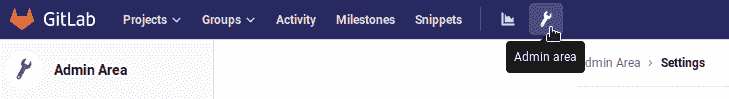
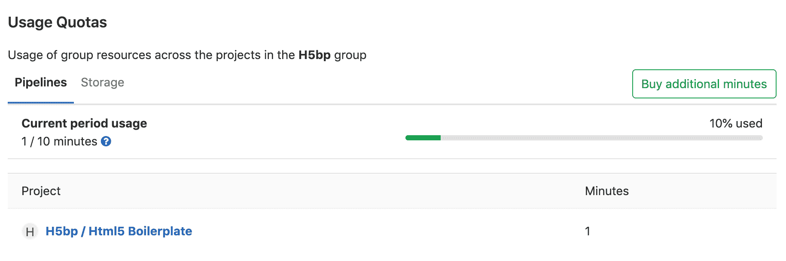
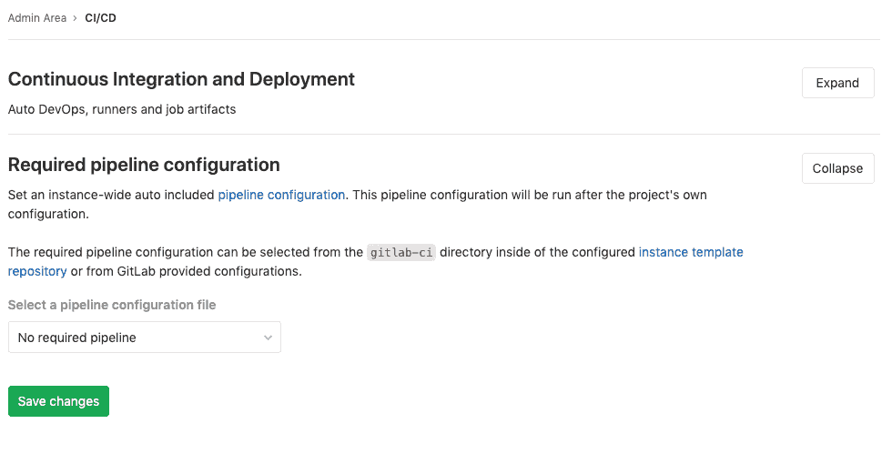
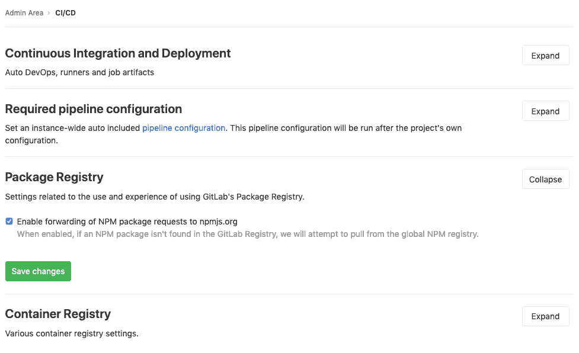

# Continuous Integration and Deployment Admin settings

> 原文：[https://docs.gitlab.com/ee/user/admin_area/settings/continuous_integration.html](https://docs.gitlab.com/ee/user/admin_area/settings/continuous_integration.html)

*   [Auto DevOps](#auto-devops-core-only)
*   [Maximum artifacts size](#maximum-artifacts-size-core-only)
*   [Default artifacts expiration](#default-artifacts-expiration-core-only)
*   [Shared Runners pipeline minutes quota](#shared-runners-pipeline-minutes-quota-starter-only)
*   [Archive jobs](#archive-jobs-core-only)
*   [Default CI configuration path](#default-ci-configuration-path)
*   [Required pipeline configuration](#required-pipeline-configuration-premium-only)
*   [Package Registry configuration](#package-registry-configuration-premium-only)

# Continuous Integration and Deployment Admin settings

在此区域中，您将找到 Auto DevOps，Runners 和作业工件的设置. 您可以在**管理区域>设置> CI / CD 中**找到它.

## Auto DevOps

要为所有项目启用（或禁用） [Auto DevOps](../../../topics/autodevops/index.html) ：

1.  转到**管理区域>设置> CI / CD** .
2.  选中（或取消选中以禁用） **所有项目的默认为 Auto DevOps 管道**的框.
3.  （可选）设置将用于 Auto Deploy 和 Auto Review Apps 的[Auto DevOps 基本域](../../../topics/autodevops/index.html#auto-devops-base-domain) .
4.  点击**保存更改**以使更改生效.

从现在开始，每个不带`.gitlab-ci.yml`现有项目和新创建的项目都将使用 Auto DevOps 管道.

如果要为特定项目禁用它，可以在[其设置中](../../../topics/autodevops/index.html#enablingdisabling-auto-devops)禁用它.

## Maximum artifacts size

可以将[作业工件](../../../administration/job_artifacts.html)的最大大小设置为：

*   实例级别.
*   [从 GitLab 12.4 开始](https://gitlab.com/gitlab-org/gitlab/-/issues/21688) ，为项目和组级别.

值是：

*   以*MB*为单位，每个作业的默认值为 100MB.
*   在 GitLab.com 上[设置为 1G](../../gitlab_com/index.html#gitlab-cicd) .

要在以下位置进行更改：

*   实例级别：

    1.  Go to **管理区域>设置> CI / CD**.
    2.  更改最大工件大小的值（以 MB 为单位）.
    3.  单击**保存更改**以使更改生效.
*   [组级别](../../group/index.html#group-settings) （这将覆盖实例设置）：

    1.  转到组的**设置> CI / CD>常规管道** .
    2.  更改**最大工件大小**的值**（以 MB 为单位）** .
    3.  单击**保存更改**以使更改生效.
*   [项目级别](../../../ci/pipelines/settings.html) （这将覆盖实例和组设置）：

    1.  转到项目的**设置> CI / CD>常规管道** .
    2.  更改**最大工件大小**的值**（以 MB 为单位）** .
    3.  单击**保存更改**以使更改生效.

**注意：**所有级别的设置仅对 GitLab 管理员可用.

## Default artifacts expiration

可以在 GitLab 实例的"管理区域"中设置[作业工件](../../../administration/job_artifacts.html)的默认过期时间. 持续时间的语法在[`artifacts:expire_in`](../../../ci/yaml/README.html#artifactsexpire_in)描述，缺省值为`30 days` .

1.  转到**管理区域>设置> CI / CD** .
2.  更改默认到期时间的值.
3.  单击**保存更改**以使更改生效.

此设置是[`.gitlab-ci.yml`](../../../ci/yaml/README.html#artifactsexpire_in)每个作业设置的，可以在[`.gitlab-ci.yml`](../../../ci/yaml/README.html#artifactsexpire_in)覆盖. 要禁用到期时间，请将其设置为`0` . 默认单位是秒.

**注意：**对此设置的任何更改将仅适用于新工件. 更改此设置之前创建的工件的过期时间将不会更新. 管理员可能需要手动搜索并终止先前创建的工件，如[故障排除文档中所述](../../../administration/troubleshooting/gitlab_rails_cheat_sheet.html#remove-artifacts-more-than-a-week-old) .

## Shared Runners pipeline minutes quota

在 GitLab Starter 8.16 中[引入](https://gitlab.com/gitlab-org/gitlab/-/merge_requests/1078) .

如果已为 GitLab 实例启用共享运行程序，则可以通过设置组每月可以在共享运行程序上使用的最大管道分钟数来限制其使用. 将此设置为`0` （默认值）将授予无限制的管道分钟数. 尽管构建限制以分钟存储，但计数以秒为单位. 使用情况会在每个月的第一天重置. 在 GitLab.com 上，配额是根据您的[订阅计划](https://about.gitlab.com/pricing/#gitlab-com)计算的.

要更改管道分钟配额：

1.  转到**管理区域>设置> CI / CD** .
2.  Expand **持续集成和部署**.
3.  在" **管道分钟数"配额**框中，输入最大分钟数.
4.  单击**保存更改**以使更改生效.

* * *

尽管"管理区域"中的设置具有全局作用，但作为管理员，您也可以更改每个组的管道分钟配额以覆盖全局值.

1.  导航到" **管理区域">"概述">"组"，**然后单击您要更改管道分钟配额的组的" **编辑"**按钮.
2.  在" **管道分钟配额"**框中，输入最大分钟数.
3.  单击**保存更改**以使更改生效.

保存后，您可以在组管理员视图中查看构建配额. 如果启用了共享运行器，也可以在项目管理视图中查看配额.

您可以在组页面设置列表可用的" **使用配额"**页面中查看该组所有项目的管道分钟配额的概述.

## Archive jobs

归档作业通过删除作业的某些功能（运行作业所需的元数据）来减少系统上的 CI / CD 占用空间，但保留迹线和工件以供审核时很有用.

设置作业将被视为过期和过期的持续时间：

1.  转到**管理区域>设置> CI / CD** .
2.  展开**持续集成和部署**部分.
3.  设置**存档作业**的值.
4.  点击**保存更改**以使更改生效.

一旦超过该时间，作业将被存档，并且不再能够重试. 将其设为空以永不过期作业. 它必须不少于 1 天，例如： `15 days` ， `1 month` ， `2 years` .

截至 2020 年 6 月 22 日，该[值](../../gitlab_com/index.html#gitlab-cicd)在 GitLab.com 上[设置](../../gitlab_com/index.html#gitlab-cicd)为 3 个月. 在此日期之前创建的作业将在 2020 年 9 月 22 日之后存档.

## Default CI configuration path

在 GitLab 12.5 中[引入](https://gitlab.com/gitlab-org/gitlab/-/merge_requests/18073) .

可以在您的 GitLab 实例的"管理"区域中设置新项目的默认 CI 配置文件路径（如果未设置， `.gitlab-ci.yml` ）：

1.  转到**管理区域>设置> CI / CD** .
2.  在**默认 CI 配置路径**字段中输入新路径.
3.  点击**保存更改**以使更改生效.

也可以[为特定项目](../../../ci/pipelines/settings.html#custom-ci-configuration-path)指定[自定义 CI 配置路径](../../../ci/pipelines/settings.html#custom-ci-configuration-path) .

## Required pipeline configuration

**警告：**此功能正在重新评估，以支持其他[合规性解决方案](https://gitlab.com/gitlab-org/gitlab/-/issues/34830) . 我们建议尚未实施此功能的用户等待新解决方案.

GitLab 管理员可以强制管道配置在每个管道上运行.

该配置适用于 GitLab 实例的所有管道，其来源为：

*   The [instance template repository](instance_template_repository.html).
*   GitLab 提供的配置.

设置所需的管道配置：

1.  转到**管理区域>设置> CI / CD** .
2.  展开" **所需管道配置"**部分.
3.  从提供的下拉列表中选择所需的配置.
4.  Click **保存更改**.

## Package Registry configuration

GitLab 管理员可以禁用将 NPM 请求转发到[npmjs.com](https://s0www0npmjs0com.icopy.site/) .

To disable it:

1.  转到**管理区域>设置> CI / CD** .
2.  展开" **程序包注册表"**部分.
3.  Uncheck **启用将 NPM 软件包请求转发到 npmjs.org**.
4.  Click **保存更改**.

