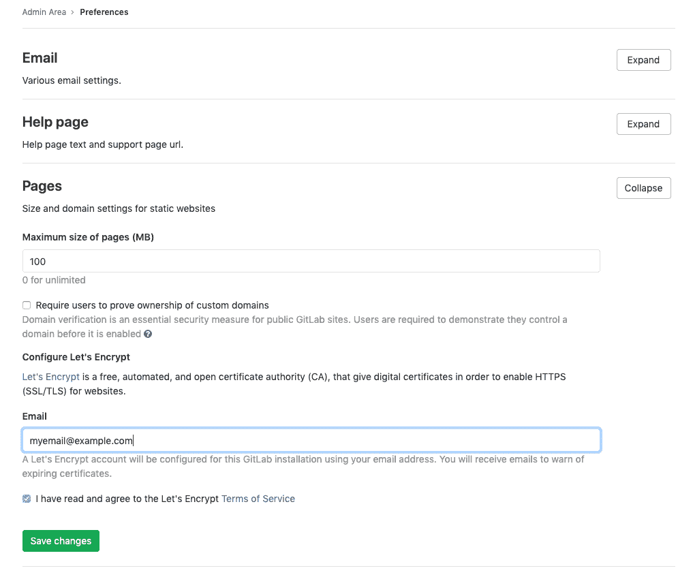

# GitLab Pages administration

> 原文：[https://docs.gitlab.com/ee/administration/pages/](https://docs.gitlab.com/ee/administration/pages/)

*   [Overview](#overview)
*   [Prerequisites](#prerequisites)
    *   [Add the domain to the Public Suffix List](#add-the-domain-to-the-public-suffix-list)
    *   [DNS configuration](#dns-configuration)
*   [Configuration](#configuration)
    *   [Wildcard domains](#wildcard-domains)
    *   [Wildcard domains with TLS support](#wildcard-domains-with-tls-support)
    *   [Additional configuration for Docker container](#additional-configuration-for-docker-container)
    *   [Global settings](#global-settings)
*   [Advanced configuration](#advanced-configuration)
    *   [Custom domains](#custom-domains)
    *   [Custom domains with TLS support](#custom-domains-with-tls-support)
    *   [Custom domain verification](#custom-domain-verification)
    *   [Let’s Encrypt integration](#lets-encrypt-integration)
    *   [Access control](#access-control)
        *   [Disabling public access to all Pages websites](#disabling-public-access-to-all-pages-websites)
    *   [Running behind a proxy](#running-behind-a-proxy)
    *   [Using a custom Certificate Authority (CA)](#using-a-custom-certificate-authority-ca)
*   [Activate verbose logging for daemon](#activate-verbose-logging-for-daemon)
*   [Change storage path](#change-storage-path)
*   [Configure listener for reverse proxy requests](#configure-listener-for-reverse-proxy-requests)
*   [Set maximum pages size](#set-maximum-pages-size)
    *   [Override maximum pages size per project or group](#override-maximum-pages-size-per-project-or-group-premium-only)
*   [Running GitLab Pages on a separate server](#running-gitlab-pages-on-a-separate-server)
*   [Backup](#backup)
*   [Security](#security)
*   [Troubleshooting](#troubleshooting)
    *   [`open /etc/ssl/ca-bundle.pem: permission denied`](#open-etcsslca-bundlepem-permission-denied)
    *   [`dial tcp: lookup gitlab.example.com` and `x509: certificate signed by unknown authority`](#dial-tcp-lookup-gitlabexamplecom-and-x509-certificate-signed-by-unknown-authority)
    *   [404 error after transferring project to a different group or user](#404-error-after-transferring-project-to-a-different-group-or-user)

# GitLab Pages administration[](#gitlab-pages-administration "Permalink")

版本历史

*   在 GitLab EE 8.3 中[引入](https://gitlab.com/gitlab-org/gitlab/-/merge_requests/80) .
*   GitLab EE 8.5 中[引入](https://gitlab.com/gitlab-org/gitlab/-/merge_requests/173)了具有 TLS 支持的自定义 CNAME.
*   GitLab 页面[已移植](https://gitlab.com/gitlab-org/gitlab-foss/-/issues/14605)到 GitLab 8.17 中的 Community Edition.
*   在 GitLab 11.8 中[引入](https://gitlab.com/gitlab-org/gitlab-foss/-/issues/30548)了对子组项目网站的支持.

GitLab 页面允许托管静态站点. 它必须由管理员配置. 提供了单独的[用户文档](../../user/project/pages/index.html) .

**注意：**本指南适用于 Omnibus GitLab 安装. 如果您从源代码安装了 GitLab，请参见[GitLab 页面管理以了解源代码安装](source.html) .

## Overview[](#overview "Permalink")

GitLab Pages 使用[GitLab Pages 守护程序](https://gitlab.com/gitlab-org/gitlab-pages) ，这是一个用 Go 编写的简单 HTTP 服务器，可以侦听外部 IP 地址并提供对自定义域和自定义证书的支持. 它通过 SNI 支持动态证书，并且默认情况下使用 HTTP2 公开页面. 我们鼓励您阅读其[自述文件](https://gitlab.com/gitlab-org/gitlab-pages/blob/master/README.md)以全面了解其工作原理.

对于[自定义域](#custom-domains) （而不是[通配符域](#wildcard-domains) ），Pages 守护程序需要在端口`80`和/或`443` . 因此，设置方式具有一定的灵活性：

*   在与 GitLab 相同的服务器上运行 Pages 守护程序，侦听**辅助 IP** .
*   在[单独的服务器上](#running-gitlab-pages-on-a-separate-server)运行 Pages 守护程序. 在这种情况下， [Pages 路径](#change-storage-path)也必须存在于安装 Pages 守护程序的服务器中，因此您必须通过网络共享它.
*   在与 GitLab 相同的服务器上运行 Pages 守护程序，侦听相同的 IP，但侦听不同的端口. 在这种情况下，您将不得不使用负载平衡器代理流量. 如果选择该路由，请注意，应将 TCP 负载平衡用于 HTTPS. 如果您使用 TLS 终止（HTTPS 负载平衡），则将无法使用用户提供的证书来提供页面. 对于 HTTP，可以使用 HTTP 或 TCP 负载平衡.

在本文档中，我们将假设第一个选项继续进行. 如果您不支持自定义域，则不需要辅助 IP.

## Prerequisites[](#prerequisites "Permalink")

在进行页面配置之前，您需要：

1.  具有用于服务 GitLab 页面的专有根域. 请注意，您不能使用 GitLab 实例域的子域.
2.  配置**通配符 DNS 记录** .
3.  （可选）如果您决定在 HTTPS 下提供 Pages，则具有该域的**通配符证书** .
4.  （可选，但建议使用）启用[共享运行器，](../../ci/runners/README.html)以便您的用户不必自己携带.
5.  （仅用于自定义域）具有**辅助 IP** .

**注意：**如果您的 GitLab 实例和 Pages 守护程序部署在专用网络中或防火墙后面，则只有有权访问专用网络的设备/用户才能访问 GitLab Pages 网站.

### Add the domain to the Public Suffix List[](#add-the-domain-to-the-public-suffix-list "Permalink")

浏览器使用" [公共后缀列表"](https://publicsuffix.org)来决定如何对待子域. 如果您的 GitLab 实例允许公众创建 GitLab Pages 网站，那么它还允许这些用户在 pages 域（ `example.io` ）上创建子域. 将域添加到"公共后缀列表"中可防止浏览器接受[超级 cookie](https://en.wikipedia.org/wiki/HTTP_cookie#Supercookie)等.

请按照[以下说明](https://publicsuffix.org/submit/)提交您的 GitLab 页面子域. 例如，如果您的域是`example.io` ，则应请求将`example.io`添加到公共后缀列表中. `gitlab.io` [在 2016 年](https://gitlab.com/gitlab-com/infrastructure/-/issues/230)添加了`gitlab.io` .

### DNS configuration[](#dns-configuration "Permalink")

GitLab 页面期望在其自己的虚拟主机上运行. 在您的 DNS 服务器/提供程序中，您需要添加[通配符 DNS A 记录](https://en.wikipedia.org/wiki/Wildcard_DNS_record) ，该[记录](https://en.wikipedia.org/wiki/Wildcard_DNS_record)指向 GitLab 运行的主机. 例如，条目如下所示：

```
*.example.io. 1800 IN A    192.0.2.1
*.example.io. 1800 IN AAAA 2001::1 
```

其中`example.io`是将在其下提供 GitLab 页面的域， `192.0.2.1`是您的 GitLab 实例的 IPv4 地址，而`2001::1`是 IPv6 地址. 如果没有 IPv6，则可以省略 AAAA 记录.

**注意：**您不应使用 GitLab 域来服务用户页面. 有关更多信息，请参见[安全性部分](#security) .

## Configuration[](#configuration "Permalink")

根据您的需要，您可以通过 4 种不同的方式设置 GitLab 页面.

从最简单的设置到最高级的设置，列出了以下示例. 绝对最低要求是设置通配符 DNS，因为在所有配置中都需要这样做.

### Wildcard domains[](#wildcard-domains "Permalink")

**Requirements:**

*   [Wildcard DNS setup](#dns-configuration)

* * *

网址方案： `http://page.example.io` ： `http://page.example.io`

这是可以与 Pages 一起使用的最小设置. 如下所述，它是所有其他设置的基础. NGINX 将把所有请求代理到守护程序. Pages 守护程序不收听外界.

1.  Set the external URL for GitLab Pages in `/etc/gitlab/gitlab.rb`:

    ```
    pages_external_url 'http://example.io' 
    ```

2.  [Reconfigure GitLab](../restart_gitlab.html#omnibus-gitlab-reconfigure).

观看[视频教程](https://youtu.be/dD8c7WNcc6s)以了解此配置.

### Wildcard domains with TLS support[](#wildcard-domains-with-tls-support "Permalink")

**Requirements:**

*   [Wildcard DNS setup](#dns-configuration)
*   通配 TLS 证书

* * *

网址方案： `https://page.example.io` ： `https://page.example.io`

NGINX 将把所有请求代理到守护程序. Pages 守护程序不收听外界.

1.  将证书和密钥放在`/etc/gitlab/ssl`
2.  在`/etc/gitlab/gitlab.rb`指定以下配置：

    ```
    pages_external_url 'https://example.io'

    pages_nginx['redirect_http_to_https'] = true
    pages_nginx['ssl_certificate'] = "/etc/gitlab/ssl/pages-nginx.crt"
    pages_nginx['ssl_certificate_key'] = "/etc/gitlab/ssl/pages-nginx.key" 
    ```

    其中`pages-nginx.crt`和`pages-nginx.key`分别是 SSL 证书和密钥.

3.  [Reconfigure GitLab](../restart_gitlab.html#omnibus-gitlab-reconfigure).

### Additional configuration for Docker container[](#additional-configuration-for-docker-container "Permalink")

当它在 Docker 容器中运行时，GitLab Pages 守护程序将没有绑定绑定的权限. 要解决此问题，您需要更改 chroot 行为：

1.  Edit `/etc/gitlab/gitlab.rb`.
2.  将 GitLab 页面的`inplace_chroot`设置为`true` ：

    ```
    gitlab_pages['inplace_chroot'] = true 
    ```

3.  [Reconfigure GitLab](../restart_gitlab.html#omnibus-gitlab-reconfigure).

**注意：** `inplace_chroot`选项可能不适用于其他功能，例如[Pages Access Control](#access-control) . [GitLab 页面自述文件](https://gitlab.com/gitlab-org/gitlab-pages#caveats)包含有关警告和解决方法的更多信息.

### Global settings[](#global-settings "Permalink")

下表是 Omnibus GitLab 中 Pages 已知的所有配置设置及其作用. 这些选项可以在`/etc/gitlab/gitlab.rb`进行调整，并在[重新配置 GitLab](../restart_gitlab.html#omnibus-gitlab-reconfigure)之后生效. 这些设置中的大多数不需要手动配置，除非您需要对 Pages 守护程序在环境中如何运行和提供内容的方式进行更精细的控制.

| Setting | Description |
| --- | --- |
| `pages_external_url` | 可访问 GitLab 页面的 URL，包括协议（HTTP / HTTPS）. 如果使用`https://` ，则还必须设置`gitlab_pages['ssl_certificate']`和`gitlab_pages['ssl_certificate_key']` . |
| `gitlab_pages[]` |   |
| `access_control` | 是否启用[访问控制](index.html#access-control) . |
| `api_secret_key` | 具有用于通过 GitLab API 进行身份验证的密钥的文件的完整路径. 未设置时自动生成. |
| `artifacts_server` | 在 GitLab 页面中启用查看[工件](../job_artifacts.html) . |
| `artifacts_server_timeout` | 对工件服务器的代理请求超时（以秒为单位）. |
| `artifacts_server_url` | 用于代理工件请求的 API URL. 默认为 GitLab `external URL` + `/api/v4` ，例如`https://gitlab.com/api/v4` . |
| `auth_redirect_uri` | 用于通过 GitLab 进行身份验证的回调 URL. 默认为`pages_external_url` + `/auth`项目子域. |
| `auth_secret` | Secret key for signing authentication requests. Leave blank to pull automatically from GitLab during OAuth registration. |
| `dir` | 配置和机密文件的工作目录. |
| `enable` | 在当前系统上启用或禁用 GitLab 页面. |
| `external_http` | 将页面配置为绑定到一个或多个辅助 IP 地址，以服务 HTTP 请求. 可以将多个地址以及确切的端口作为数组给出，例如`['1.2.3.4', '1.2.3.5:8063']` . 设置`listen_http`值. |
| `external_https` | 将页面配置为绑定到一个或多个辅助 IP 地址，以服务 HTTPS 请求. 可以将多个地址以及确切的端口作为数组给出，例如`['1.2.3.4', '1.2.3.5:8063']` . 设置`listen_https`值. |
| `gitlab_client_http_timeout` | GitLab API HTTP 客户端连接超时（以秒为单位）（默认值：10s）. |
| `gitlab_client_jwt_expiry` | JWT 令牌的到期时间，以秒为单位（默认值：30s）. |
| `gitlab_id` | OAuth 应用程序公共 ID. 当 Pages 通过 GitLab 进行身份验证时，请保留空白以自动填充. |
| `gitlab_secret` | OAuth 应用程序密码. 当 Pages 通过 GitLab 进行身份验证时，请保留空白以自动填充. |
| `gitlab_server` | 启用访问控制时用于身份验证的服务器； 默认为 GitLab `external_url` . |
| `headers` | 指定应随每个响应发送给客户端的任何其他 http 标头. |
| `inplace_chroot` | 在[不支持 bind-mounts 的系统上](index.html#additional-configuration-for-docker-container) ，这会指示 GitLab Pages chroot 进入其`pages_path`目录. 使用就地 chroot 时，存在一些注意事项； 有关更多信息，请参考 GitLab 页面[自述文件](https://gitlab.com/gitlab-org/gitlab-pages/blob/master/README.md#caveats) . |
| `insecure_ciphers` | 使用默认的密码套件列表，其中可能包含不安全的密码套件，例如 3DES 和 RC4. |
| `internal_gitlab_server` | 内部 GitLab 服务器地址专门用于 API 请求. 如果要通过内部负载均衡器发送该流量，则很有用. 默认为 GitLab `external_url` . |
| `listen_proxy` | 侦听反向代理请求的地址. 页面将绑定到这些地址的网络套接字，并从中接收传入的请求. 在`$nginx-dir/conf/gitlab-pages.conf`设置`proxy_pass`的值. |
| `log_directory` | 日志目录的绝对路径. |
| `log_format` | 日志输出格式： `text`或`json` . |
| `log_verbose` | 详细记录，对/错. |
| `max_connections` | 限制与 HTTP，HTTPS 或代理侦听器的并发连接数. |
| `metrics_address` | 用于监听指标请求的地址. |
| `redirect_http` | 将页面从 HTTP 重定向到 HTTPS，是/否. |
| `sentry_dsn` | 用于发送 Sentry 崩溃报告的地址. |
| `sentry_enabled` | 使用 Sentry（真/假）启用报告和日志记录. |
| `sentry_environment` | Sentry 崩溃报告的环境. |
| `status_uri` | 状态页面的 URL 路径，例如`/@status` . |
| `tls_max_version` | 指定最大 SSL / TLS 版本（" ssl3"，" tls1.0"，" tls1.1"或" tls1.2"）. |
| `tls_min_version` | 指定最低 SSL / TLS 版本（" ssl3"，" tls1.0"，" tls1.1"或" tls1.2"）. |
| `use_http2` | 启用 HTTP2 支持. |
| `gitlab_pages['env'][]` |   |
| `http_proxy` | 配置 GitLab 页面以使用 HTTP 代理来调解页面和 GitLab 之间的流量. 启动 Pages 守护程序时设置环境变量`http_proxy` . |
| `gitlab_rails[]` |   |
| `pages_domain_verification_cron_worker` | 验证自定义 GitLab 页面域的时间表. |
| `pages_domain_ssl_renewal_cron_worker` | 通过 Let's Encrypt for GitLab Pages 域获取和更新 SSL 证书的时间表. |
| `pages_domain_removal_cron_worker` | 删除未验证的自定义 GitLab 页面域的时间表. |
| `pages_path` | 磁盘上存储页面的目录，默认为`GITLAB-RAILS/shared/pages` . |
| `pages_nginx[]` |   |
| `enable` | 在 NGINX 内部包含一个用于页面的虚拟主机`server{}`块. NGINX 需要将流量代理回 Pages 守护程序. 如果 Pages 守护程序应直接接收所有请求（例如在使用[自定义域](index.html#custom-domains)时），则设置为`false` . |

* * *

## Advanced configuration[](#advanced-configuration "Permalink")

除了通配符域，您还可以选择配置 GitLab 页面以与自定义域一起使用. 同样，这里有两个选项：支持带有和不带有 TLS 证书的自定义域. 最简单的设置是没有 TLS 证书. 无论哪种情况，都需要一个**辅助 IP** . 如果同时具有 IPv6 和 IPv4 地址，则可以同时使用它们.

### Custom domains[](#custom-domains "Permalink")

**Requirements:**

*   [Wildcard DNS setup](#dns-configuration)
*   次要 IP

* * *

URL 方案： `http://page.example.io` : `http://page.example.io`和`http://domain.com`

在这种情况下，Pages 守护程序正在运行，NGINX 仍将请求代理到该守护程序，但该守护程序也能够接收来自外界的请求. 支持自定义域，但不支持 TLS.

1.  Edit `/etc/gitlab/gitlab.rb`:

    ```
    pages_external_url "http://example.io"
    nginx['listen_addresses'] = ['192.0.2.1']
    pages_nginx['enable'] = false
    gitlab_pages['external_http'] = ['192.0.2.2:80', '[2001::2]:80'] 
    ```

    其中`192.0.2.1`是 GitLab 侦听的主要 IP 地址，而`192.0.2.2`和`2001::2`是 GitLab Pages 守护程序侦听的辅助 IP. 如果没有 IPv6，则可以省略 IPv6 地址.

2.  [Reconfigure GitLab](../restart_gitlab.html#omnibus-gitlab-reconfigure).

### Custom domains with TLS support[](#custom-domains-with-tls-support "Permalink")

**Requirements:**

*   [Wildcard DNS setup](#dns-configuration)
*   通配 TLS 证书
*   次要 IP

* * *

网址方案： `https://page.example.io` ： `https://page.example.io`和`https://domain.com`

在这种情况下，Pages 守护程序正在运行，NGINX 仍将请求代理到该守护程序，但该守护程序也能够接收来自外界的请求. 支持自定义域和 TLS.

1.  Edit `/etc/gitlab/gitlab.rb`:

    ```
    pages_external_url "https://example.io"
    nginx['listen_addresses'] = ['192.0.2.1']
    pages_nginx['enable'] = false
    gitlab_pages['cert'] = "/etc/gitlab/ssl/example.io.crt"
    gitlab_pages['cert_key'] = "/etc/gitlab/ssl/example.io.key"
    gitlab_pages['external_http'] = ['192.0.2.2:80', '[2001::2]:80']
    gitlab_pages['external_https'] = ['192.0.2.2:443', '[2001::2]:443'] 
    ```

    其中`192.0.2.1`是 GitLab 侦听的主要 IP 地址，而`192.0.2.2`和`2001::2`是 GitLab Pages 守护程序侦听的辅助 IP. 如果没有 IPv6，则可以省略 IPv6 地址.

2.  [Reconfigure GitLab](../restart_gitlab.html#omnibus-gitlab-reconfigure).

### Custom domain verification[](#custom-domain-verification "Permalink")

为了防止恶意用户劫持不属于他们的[域](../../user/project/pages/custom_domains_ssl_tls_certification/index.html#steps) ，GitLab 支持[自定义域验证](../../user/project/pages/custom_domains_ssl_tls_certification/index.html#steps) . 添加自定义域时，将要求用户通过在该域的 DNS 记录中添加 GitLab 控制的验证码来证明自己拥有该域.

如果您的用户群是私有的或受其他方式信任，则可以禁用验证要求. 导航到**管理区域>设置>首选项，**然后在**页面**部分中取消选中**要求用户证明自定义域的所有权** . 默认情况下启用此设置.

### Let’s Encrypt integration[](#lets-encrypt-integration "Permalink")

在 GitLab 12.1 中[引入](https://gitlab.com/gitlab-org/gitlab-foss/-/issues/28996) .

[GitLab Pages 的 Let's Encrypt 集成](../../user/project/pages/custom_domains_ssl_tls_certification/lets_encrypt_integration.html)允许用户为在自定义域下提供服务的 GitLab Pages 网站添加 Let's Encrypt SSL 证书.

要启用它，您需要：

1.  选择一封电子邮件，在该电子邮件上您将收到有关域过期的通知.
2.  导航到实例的" **管理区域">"设置">"首选项"，**然后展开" **页面"**设置.
3.  输入用于接收通知的电子邮件，并接受" Let's Encrypt 的服务条款"，如下所示.
4.  Click **保存更改**.

[](img/lets_encrypt_integration_v12_1.png)

### Access control[](#access-control "Permalink")

在 GitLab 11.5 中[引入](https://gitlab.com/gitlab-org/gitlab-foss/-/issues/33422) .

GitLab Pages 访问控制可以针对每个项目进行配置，并允许根据用户对该项目的成员资格来控制对 Pages 站点的访问.

访问控制通过在 GitLab 上将 Pages 守护程序注册为 OAuth 应用程序来工作. 每当未经身份验证的用户发出访问私有 Pages 站点的请求时，Pages 守护程序都会将该用户重定向到 GitLab. 如果身份验证成功，则使用令牌将用户重定向回 Pages，该令牌将保留在 cookie 中. 这些 Cookie 均用密钥签名，因此可以检测到篡改.

Pages 使用该令牌对每个查看私有站点中的资源的请求进行身份验证. 对于收到的每个请求，它都会向 GitLab API 发出请求，以检查用户是否有权读取该站点.

默认情况下，页面访问控制是禁用的. 要启用它：

1.  在`/etc/gitlab/gitlab.rb`启用它：

    ```
    gitlab_pages['access_control'] = true 
    ```

2.  [Reconfigure GitLab](../restart_gitlab.html#omnibus-gitlab-reconfigure).
3.  用户现在可以在其[项目的设置](../../user/project/pages/pages_access_control.html)中对其进行[配置](../../user/project/pages/pages_access_control.html) .

**重要说明：**对于多节点设置，要使此设置生效，必须将其应用于所有 App 节点以及 Sidekiq 节点.

#### Disabling public access to all Pages websites[](#disabling-public-access-to-all-pages-websites "Permalink")

在 GitLab 12.7 中[引入](https://gitlab.com/gitlab-org/gitlab/-/issues/32095) .

您可以对 GitLab 实例上托管的所有 GitLab Pages 网站实施[访问控制](#access-control) . 这样，只有登录用户才能访问它们. 此设置将覆盖用户在单个项目中设置的访问控制.

这对于将通过 Pages 网站发布的信息仅保留给您实例的用户很有用. 要做到这一点：

1.  导航到实例的" **管理区域">"设置">"首选项"，**然后展开" **页面"**设置.
2.  选中**禁用对页面站点的公共访问**复选框.
3.  Click **保存更改**.

**警告：**此操作将不会重新部署当前所有公开的网站. 通过[更改 GitLab 页面配置机制，](https://gitlab.com/gitlab-org/gitlab-pages/-/issues/282)可以解决此问题.

### Running behind a proxy[](#running-behind-a-proxy "Permalink")

与其他 GitLab 一样，Pages 可以用于由代理控制外部 Internet 连接的那些环境. 为了对 GitLab 页面使用代理：

1.  在`/etc/gitlab/gitlab.rb`配置：

    ```
    gitlab_pages['env']['http_proxy'] = 'http://example:8080' 
    ```

2.  [重新配置 GitLab，](../restart_gitlab.html#omnibus-gitlab-reconfigure)以使更改生效.

### Using a custom Certificate Authority (CA)[](#using-a-custom-certificate-authority-ca "Permalink")

**注意：** [在 13.2 之前](https://gitlab.com/gitlab-org/omnibus-gitlab/-/merge_requests/4289) ，使用 Omnibus 时， [需要](https://docs.gitlab.com/13.1/ee/administration/pages/index.html)一种[解决方法](https://docs.gitlab.com/13.1/ee/administration/pages/index.html) .

使用自定义 CA 颁发的证书时，如果无法识别自定义 CA，则[访问控制](../../user/project/pages/pages_access_control.html#gitlab-pages-access-control)和[HTML 作业工件](../../ci/pipelines/job_artifacts.html#browsing-artifacts)的[联机视图](../../ci/pipelines/job_artifacts.html#browsing-artifacts)将无法工作.

这通常会导致以下错误： `Post /oauth/token: x509: certificate signed by unknown authority` .

对于从源安装，可以通过在系统证书存储中安装自定义证书颁发机构（CA）来解决.

对于 Omnibus，可以通过[在 Omnibus GitLab 中安装自定义 CA 来解决](https://docs.gitlab.com/omnibus/settings/ssl.html) .

## Activate verbose logging for daemon[](#activate-verbose-logging-for-daemon "Permalink")

详细日志记录是在 Omnibus GitLab 11.1 中[引入的](https://gitlab.com/gitlab-org/omnibus-gitlab/-/merge_requests/2533) .

请按照以下步骤配置 GitLab Pages 守护程序的详细日志记录.

1.  缺省情况下，守护程序仅记录`INFO`级别的日志. 如果要使其以`DEBUG`级别记录事件，则必须在`/etc/gitlab/gitlab.rb`配置：

    ```
    gitlab_pages['log_verbose'] = true 
    ```

2.  [Reconfigure GitLab](../restart_gitlab.html#omnibus-gitlab-reconfigure).

## Change storage path[](#change-storage-path "Permalink")

请按照以下步骤更改 GitLab 页面内容的默认存储路径.

1.  默认情况下，页面存储在`/var/opt/gitlab/gitlab-rails/shared/pages` . 如果要将它们存储在其他位置，则必须在`/etc/gitlab/gitlab.rb`设置：

    ```
    gitlab_rails['pages_path'] = "/mnt/storage/pages" 
    ```

2.  [Reconfigure GitLab](../restart_gitlab.html#omnibus-gitlab-reconfigure).

## Configure listener for reverse proxy requests[](#configure-listener-for-reverse-proxy-requests "Permalink")

请按照以下步骤配置 GitLab 页面的代理侦听器. 在 Omnibus GitLab 11.1 中[引入](https://gitlab.com/gitlab-org/omnibus-gitlab/-/merge_requests/2533) .

1.  默认情况下，侦听器配置为侦听`localhost:8090`上的请求.

    如果要禁用它，则必须在`/etc/gitlab/gitlab.rb`配置：

    ```
    gitlab_pages['listen_proxy'] = nil 
    ```

    如果您希望它在其他端口上侦听，则必须在`/etc/gitlab/gitlab.rb`也进行`/etc/gitlab/gitlab.rb` ：

    ```
    gitlab_pages['listen_proxy'] = "localhost:10080" 
    ```

2.  [Reconfigure GitLab](../restart_gitlab.html#omnibus-gitlab-reconfigure).

## Set maximum pages size[](#set-maximum-pages-size "Permalink")

您可以在**管理区域>设置>首选项>页面**中的**最大页面大小（MB）中**配置每个项目的解压缩存档的**最大大小** . 默认值为 100MB.

### Override maximum pages size per project or group[](#override-maximum-pages-size-per-project-or-group-premium-only "Permalink")

在 GitLab 12.7 中[引入](https://gitlab.com/gitlab-org/gitlab/-/issues/16610) .

要覆盖特定项目的全局最大页面大小：

1.  导航到项目的**"设置">"页面"**页面.
2.  编辑**最大页面大小** .
3.  Click **保存更改**.

覆盖特定组的全局最大页面大小：

1.  导航至论坛的**"设置">"常规"**页面，然后展开" **页面"** .
2.  编辑**最大页面大小** .
3.  Click **保存更改**.

## Running GitLab Pages on a separate server[](#running-gitlab-pages-on-a-separate-server "Permalink")

您可以在单独的服务器上运行 GitLab Pages 守护程序，以减少主应用程序服务器上的负载.

要在单独的服务器上配置 GitLab 页面：

**危险：**以下过程包括备份和编辑`gitlab-secrets.json`文件的步骤. 此文件包含控制数据库加密的机密. 请谨慎操作.

1.  在**GitLab 服务器上** ，要启用 Pages，请将以下内容添加到`/etc/gitlab/gitlab.rb` ：

    ```
    gitlab_pages['enable'] = true 
    ```

2.  （可选）要启用[访问控制](#access-control) ，请将以下内容添加到`/etc/gitlab/gitlab.rb` ：

    ```
    gitlab_pages['access_control'] = true 
    ```

3.  [重新配置**GitLab 服务器，**](../restart_gitlab.html#omnibus-gitlab-reconfigure)以使更改生效. `gitlab-secrets.json`文件现在已使用新配置进行更新.

4.  在**GitLab 服务器**上创建 secrets 文件的备份：

    ```
    cp /etc/gitlab/gitlab-secrets.json /etc/gitlab/gitlab-secrets.json.bak 
    ```

5.  设置一个新服务器. 这将成为**Pages 服务器** .

6.  在新服务器上创建一个[NFS 共享](../high_availability/nfs_host_client_setup.html) ，并配置该共享以允许从您的主**GitLab 服务器**进行访问. 在此示例中，我们使用默认的 GitLab Pages 文件夹`/var/opt/gitlab/gitlab-rails/shared/pages`作为新服务器上的共享文件夹，并将其安装到**GitLab 服务器**上的`/mnt/pages` .

7.  在**Pages 服务器上** ，安装 Omnibus GitLab 并修改`/etc/gitlab/gitlab.rb`以包括：

    ```
    external_url 'http://<ip-address-of-the-server>'
    pages_external_url "http://<your-pages-server-URL>"
    postgresql['enable'] = false
    redis['enable'] = false
    prometheus['enable'] = false
    puma['enable'] = false
    sidekiq['enable'] = false
    gitlab_workhorse['enable'] = false
    gitaly['enable'] = false
    alertmanager['enable'] = false
    node_exporter['enable'] = false
    gitlab_rails['auto_migrate'] = false 
    ```

8.  在**Pages 服务器**上创建 secrets 文件的备份：

    ```
    cp /etc/gitlab/gitlab-secrets.json /etc/gitlab/gitlab-secrets.json.bak 
    ```

9.  将`/etc/gitlab/gitlab-secrets.json`文件从**GitLab 服务器**复制到**Pages 服务器** .

10.  [重新配置 GitLab，](../restart_gitlab.html#omnibus-gitlab-reconfigure)以使更改生效.

11.  在**GitLab 服务器上** ，对`/etc/gitlab/gitlab.rb`进行以下更改：

    ```
    gitlab_pages['enable'] = false
    pages_external_url "http://<your-pages-server-URL>"
    gitlab_rails['pages_path'] = "/mnt/pages" 
    ```

12.  [重新配置 GitLab，](../restart_gitlab.html#omnibus-gitlab-reconfigure)以使更改生效.

如果您希望分配负载，则可以在多台服务器上运行 GitLab Pages. 您可以通过标准的负载平衡做法来做到这一点，例如将 DNS 服务器配置为为 Pages 服务器返回多个 IP，将负载平衡器配置为在 IP 级别工作等等. 如果要在多台服务器上设置 GitLab 页面，请对每台 Pages 服务器执行上述过程.

## Backup[](#backup "Permalink")

GitLab 页面是[常规备份的](../../raketasks/backup_restore.html)一部分，因此无需配置单独的备份.

## Security[](#security "Permalink")

您应该强烈考虑以与 GitLab 不同的主机名运行 GitLab 页面，以防止 XSS 攻击.

## Troubleshooting[](#troubleshooting "Permalink")

### `open /etc/ssl/ca-bundle.pem: permission denied`[](#open-etcsslca-bundlepem-permission-denied "Permalink")

GitLab Pages 在 chroot 监狱中运行，通常在`/tmp/gitlab-pages-*`等唯一编号的目录中.

在监狱内，/ `/etc/ssl/ca-bundle.pem`提供了`/etc/ssl/ca-bundle.pem`受信任的证书. 作为启动 Pages 的一部分，它从`/opt/gitlab/embedded/ssl/certs/cacert.pem` [复制到那里](https://gitlab.com/gitlab-org/gitlab-pages/-/merge_requests/51) .

如果源文件上的权限不正确（应为`0644` ），那么 chroot 监狱中的文件也将错误.

页面将在`/var/log/gitlab/gitlab-pages/current`记录错误，例如：

```
x509: failed to load system roots and no roots provided
open /etc/ssl/ca-bundle.pem: permission denied 
```

使用 chroot 监狱会使此错误产生误导，因为它没有引用根文件系统上的`/etc/ssl` .

解决方法是更正源文件权限并重新启动 Pages：

```
sudo chmod 644 /opt/gitlab/embedded/ssl/certs/cacert.pem
sudo gitlab-ctl restart gitlab-pages 
```

### `dial tcp: lookup gitlab.example.com` and `x509: certificate signed by unknown authority`[](#dial-tcp-lookup-gitlabexamplecom-and-x509-certificate-signed-by-unknown-authority "Permalink")

同时设置`inplace_chroot`和`access_control`至`true` ，你可能会遇到类似的错误：

```
dial tcp: lookup gitlab.example.com on [::1]:53: dial udp [::1]:53: connect: cannot assign requested address 
```

Or:

```
open /opt/gitlab/embedded/ssl/certs/cacert.pem: no such file or directory
x509: certificate signed by unknown authority 
```

这些错误的原因是 chroot 中缺少文件`resolv.conf`和`ca-bundle.pem` . 解决方法是在 chroot 中复制主机的`/etc/resolv.conf`和 GitLab 的证书包：

```
sudo mkdir -p /var/opt/gitlab/gitlab-rails/shared/pages/etc/ssl
sudo mkdir -p /var/opt/gitlab/gitlab-rails/shared/pages/opt/gitlab/embedded/ssl/certs/

sudo cp /etc/resolv.conf /var/opt/gitlab/gitlab-rails/shared/pages/etc
sudo cp /opt/gitlab/embedded/ssl/certs/cacert.pem /var/opt/gitlab/gitlab-rails/shared/pages/opt/gitlab/embedded/ssl/certs/
sudo cp /opt/gitlab/embedded/ssl/certs/cacert.pem /var/opt/gitlab/gitlab-rails/shared/pages/etc/ssl/ca-bundle.pem 
```

### 404 error after transferring project to a different group or user[](#404-error-after-transferring-project-to-a-different-group-or-user "Permalink")

如果在将项目转移到另一个组或用户后在 Pages 网站上遇到`404 Not Found`错误，则必须触发 Pages 的域配置更新. 为此，请在`.update`文件中写一些`.update` . Pages 守护程序监视此文件的更改，并在发生更改时重新加载配置.

使用以下示例来解决使用 Pages 传输项目后修复`404 Not Found`错误：

```
date > /var/opt/gitlab/gitlab-rails/shared/pages/.update 
```

如果您已自定义 Pages 存储路径，请调整上面的命令以使用自定义路径.