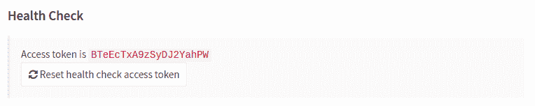

# Health Check

> 原文：[https://docs.gitlab.com/ee/user/admin_area/monitoring/health_check.html](https://docs.gitlab.com/ee/user/admin_area/monitoring/health_check.html)

*   [IP whitelist](#ip-whitelist)
*   [Using the endpoints locally](#using-the-endpoints-locally)
*   [Health](#health)
*   [Readiness](#readiness)
*   [Liveness](#liveness)
*   [Access token (Deprecated)](#access-token-deprecated)

# Health Check[](#health-check-core-only "Permalink")

版本历史

*   在 GitLab 9.1 中[引入](https://gitlab.com/gitlab-org/gitlab-foss/-/merge_requests/10416)了活动性和就绪性探针.
*   `health_check`端点是在 GitLab 8.8 中[引入的](https://gitlab.com/gitlab-org/gitlab-foss/-/merge_requests/3888) ，在 GitLab 9.1 中已弃用.
*   在 GitLab 9.4 中不赞成使用[访问令牌](#access-token-deprecated) ，而推荐使用[IP 白名单](#ip-whitelist) .

manbetx 客户端打不开提供活跃度和准备情况探针，以指示服务的健康状况和对所需服务的可达性. 这些探针报告数据库连接，Redis 连接和对文件系统的访问状态. [可以将](https://kubernetes.io/docs/tasks/configure-pod-container/configure-liveness-readiness-startup-probes/)这些端点[提供给 Kubernetes 之类的调度程序](https://kubernetes.io/docs/tasks/configure-pod-container/configure-liveness-readiness-startup-probes/)以保持流量，直到系统准备就绪或根据需要重新启动容器.

## IP whitelist[](#ip-whitelist "Permalink")

要访问监视资源，需要将发出请求的客户端 IP 包含在白名单中. 有关详细信息，请参阅[如何将 IP 添加到监视端点的白名单](../../../administration/monitoring/ip_whitelist.html) .

## Using the endpoints locally[](#using-the-endpoints-locally "Permalink")

使用默认白名单设置，可以使用以下 URL 从本地主机访问探针：

```
GET http://localhost/-/health 
```

```
GET http://localhost/-/readiness 
```

```
GET http://localhost/-/liveness 
```

## Health[](#health "Permalink")

检查应用服务器是否正在运行. 它不会验证数据库或其他服务是否正在运行. 该端点绕过了 Rails Controller，并在请求处理生命周期的早期就作为附加的中间件`BasicHealthCheck`实现.

```
GET /-/health 
```

请求示例：

```
curl 'https://gitlab.example.com/-/health' 
```

响应示例：

```
GitLab OK 
```

## Readiness[](#readiness "Permalink")

就绪探针会检查 GitLab 实例是否准备好通过 Rails Controller 接受流量. 默认情况下，该检查仅验证实例检查.

如果指定了`all=1`参数，则检查还将验证相关服务（数据库，Redis，Gitaly 等）并为每个服务提供状态.

```
GET /-/readiness
GET /-/readiness?all=1 
```

请求示例：

```
curl 'https://gitlab.example.com/-/readiness' 
```

Example response:

```
{  "master_check":[{  "status":"failed",  "message":  "unexpected Master check result: false"  }],  ...  } 
```

失败时，端点将返回`503` HTTP 状态代码.

如果通过`token`身份验证，则此检查确实会命中数据库，并且会重做 Redis.

此检查不受机架攻击.

## Liveness[](#liveness "Permalink")

**警告：**在 GitLab [12.4](https://about.gitlab.com/upcoming-releases/)中，"活动性"检查的响应主体已更改为与以下示例匹配.

检查应用服务器是否正在运行. 该探针用于了解 Rails 控制器是否不会由于多线程而死锁.

```
GET /-/liveness 
```

请求示例：

```
curl 'https://gitlab.example.com/-/liveness' 
```

响应示例：

成功后，端点将返回`200` HTTP 状态代码和如下响应.

```
{  "status":  "ok"  } 
```

失败时，端点将返回`503` HTTP 状态代码.

此检查不受机架攻击.

## Access token (Deprecated)[](#access-token-deprecated "Permalink")

**注意：**在 GitLab 9.4 中不赞成使用访问令牌，而推荐使用[IP 白名单](#ip-whitelist) .

访问探针端点时需要提供访问令牌. 当前接受的令牌可以在您的 GitLab 实例的**管理区域>监视>运行状况检查** （ `admin/health_check` ）页面下找到.

[](img/health_check_token.png)

可以将访问令牌作为 URL 参数传递：

```
https://gitlab.example.com/-/readiness?token=ACCESS_TOKEN 
```

**注意：**如果无法访问数据库或 Redis 服务，则不能保证探针端点响应正确. 您应该从已弃用的访问令牌切换到[IP 白名单](#ip-whitelist) ，以避免出现这种情况.