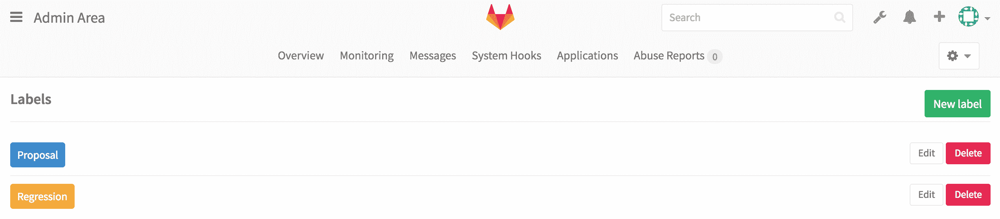

# Labels administration

> 原文：[https://s0docs0gitlab0com.icopy.site/ee/user/admin_area/labels.html](https://s0docs0gitlab0com.icopy.site/ee/user/admin_area/labels.html)

*   [Default Labels](#default-labels)

# Labels administration

在管理区域中，您可以管理 GitLab 实例的标签. 有关更多详细信息，请参见[标签](../project/labels.html) .

## Default Labels

在管理区域中创建的标签可用于每个*新*项目.

