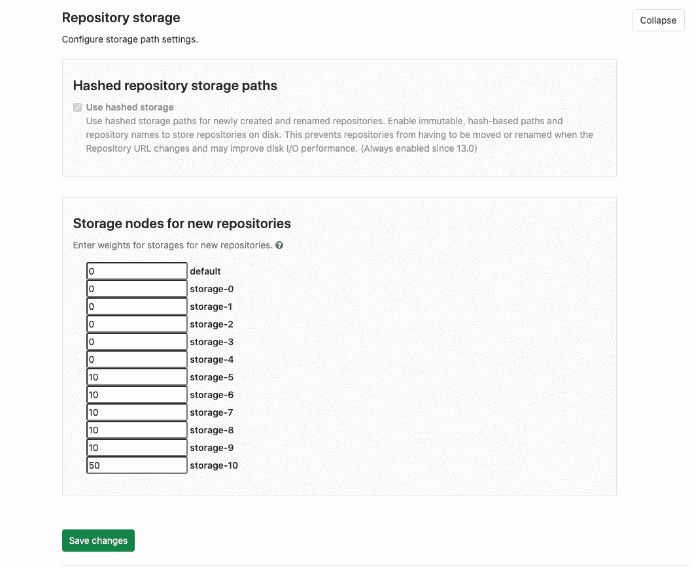

# Repository storage paths

> 原文：[https://docs.gitlab.com/ee/administration/repository_storage_paths.html](https://docs.gitlab.com/ee/administration/repository_storage_paths.html)

*   [Configure GitLab](#configure-gitlab)
*   [Choose where new repositories will be stored](#choose-where-new-repositories-will-be-stored)

# Repository storage paths[](#repository-storage-paths "Permalink")

在 GitLab 8.10 中[引入](https://gitlab.com/gitlab-org/gitlab-foss/-/merge_requests/4578) .

GitLab 允许您定义多个存储库存储路径（有时称为存储碎片），以在多个安装点之间分配存储负载.

> **Notes:**
> 
> *   您必须至少有一个名为`default`存储路径.
> *   路径在键值对中定义. 密钥是一个任意名称，您可以选择该名称来命名文件路径.
> *   目标目录及其任何子路径不得为符号链接.
> *   目标目录不能是另一个目录的子目录. 没有嵌套.

示例：这可以：

```
default:
  path: /mnt/git-storage-1
storage2:
  path: /mnt/git-storage-2 
```

这不行，因为它嵌套了存储路径：

```
default:
  path: /mnt/git-storage-1
storage2:
  path: /mnt/git-storage-1/git-storage-2 # <- NOT OK because of nesting 
```

## Configure GitLab[](#configure-gitlab "Permalink")

> **警告：**为了使[备份](../raketasks/backup_restore.html)正常工作，存储路径**不得**为挂载点，并且 GitLab 用户应对该路径的父目录具有正确的权限. 在 Omnibus GitLab 中，这是自动处理的，但是对于源代码安装，您应该格外小心.
> 
> 事实是，出于兼容性原因， `gitlab.yml`与 Omnibus 具有不同的结构. 在`gitlab.yml`您指示存储库的路径，例如`/home/git/repositories` ，而在 Omnibus 中，您指示`git_data_dirs` ，对于上面的示例，它是`/home/git` . 然后，Omnibus 将在该路径下创建一个`repositories`目录，以与`gitlab.yml`一起使用.
> 
> 这个小细节很重要，因为在还原备份时， `/home/git/repositories`的当前内容[已移至](https://gitlab.com/gitlab-org/gitlab/blob/033e5423a2594e08a7ebcd2379bd2331f4c39032/lib/backup/repository.rb#L54-56) `/home/git/repositories.old` ，因此，如果`/home/git/repositories`是安装点，则`mv`会移动挂载点之间发生故障，并且可能发生不良情况. 理想情况下， `/home/git`是挂载点，因此事情将在同一挂载点内移动. Omnibus 安装可以保证这一点（因为它们没有指定完整的存储库路径，而是指定父路径），但对于源安装则没有保证.

现在，您已经阅读了上面的警告提示，让我们编辑配置文件并添加备用存储库存储路径的完整路径. 在下面的示例中，我们添加了另外两个挂载点，分别称为`nfs_1`和`nfs_2` .

**Note:** This example uses NFS. We do not recommend using EFS for storage as it may impact GitLab’s performance. See the [relevant documentation](high_availability/nfs.html#avoid-using-awss-elastic-file-system-efs) for more details.

**对于源安装**

1.  编辑`gitlab.yml`并添加存储路径：

    ```
    repositories:
      # Paths where repositories can be stored. Give the canonicalized absolute pathname.
      # NOTE: REPOS PATHS MUST NOT CONTAIN ANY SYMLINK!!!
      storages: # You must have at least a 'default' storage path.
        default:
          path: /home/git/repositories
        nfs_1:
          path: /mnt/nfs1/repositories
        nfs_2:
          path: /mnt/nfs2/repositories 
    ```

2.  [重新启动 GitLab，](restart_gitlab.html#installations-from-source)以使更改生效.

> **注：** [`gitlab_shell: repos_path`条目](https://gitlab.com/gitlab-org/gitlab-foss/-/blob/8-9-stable/config/gitlab.yml.example#L457)中`gitlab.yml`将被弃用，取而代之的是`repositories: storages`在未来，所以如果你是从之前的版本升级 8.10，确保如在上述步骤中所描述的添加配置. 进行更改并确认它们可以使用之后，可以删除`repos_path`行.

**对于所有安装**

1.  通过将其余路径附加到默认路径中来编辑`/etc/gitlab/gitlab.rb` ：

    ```
    git_data_dirs({
      "default" => { "path" => "/var/opt/gitlab/git-data" },
      "nfs_1" => { "path" => "/mnt/nfs1/git-data" },
      "nfs_2" => { "path" => "/mnt/nfs2/git-data" }
    }) 
    ```

    请注意，Omnibus 将存储库存储在`git-data`目录的`repositories`子目录中.

## Choose where new repositories will be stored[](#choose-where-new-repositories-will-be-stored "Permalink")

设置了多个存储路径后，您可以在**管理区域>设置>存储库>存储库存储>新存储库的存储节点下选择新存储库的存储位置** .

可以为每个存储分配 0 到 100 的权重. 创建新项目时，将使用这些权重来确定将在其上创建存储库的存储位置.

[](img/repository_storages_admin_ui_v13_1.png)

从 GitLab 8.13.4 开始，可以选择多个路径. 新存储库将随机放置在所选路径之一上.